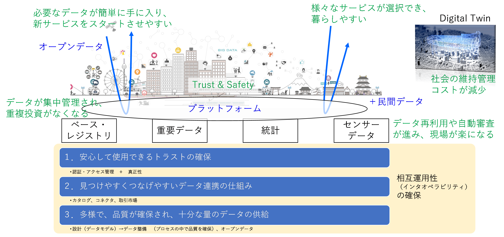
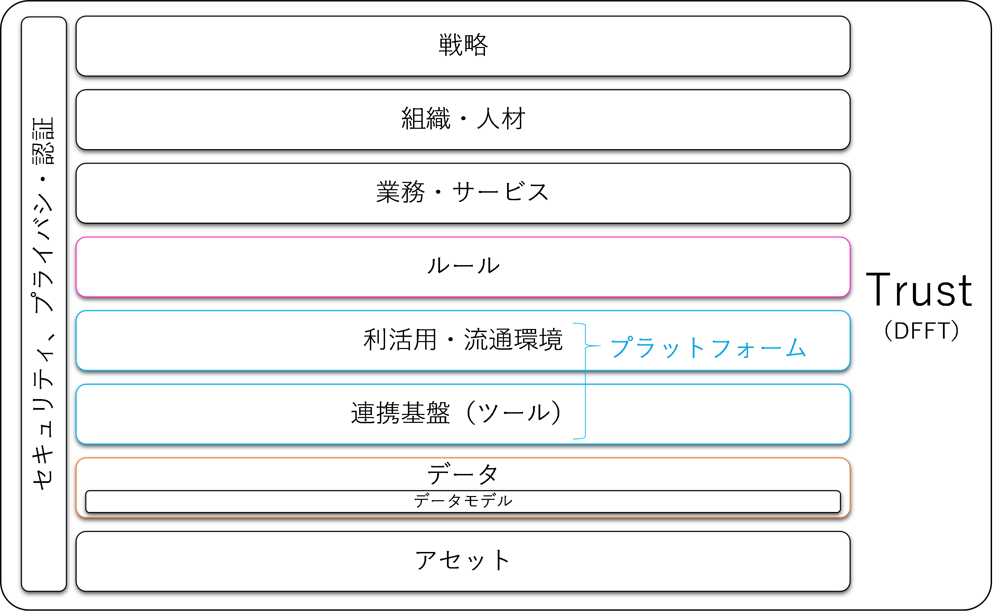
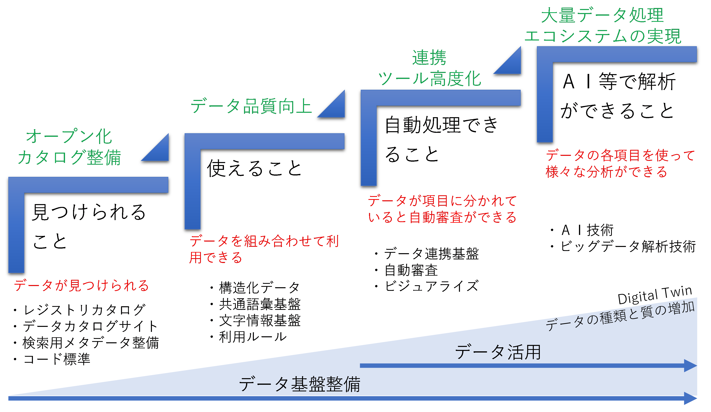
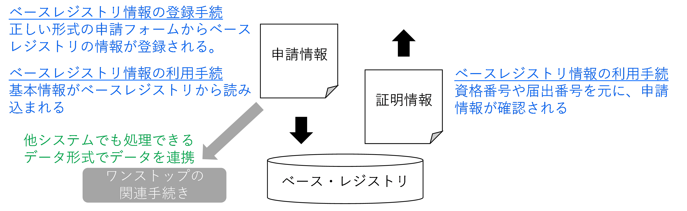
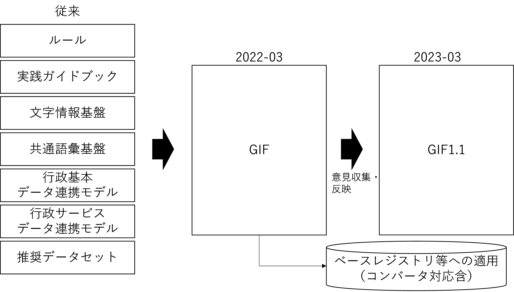
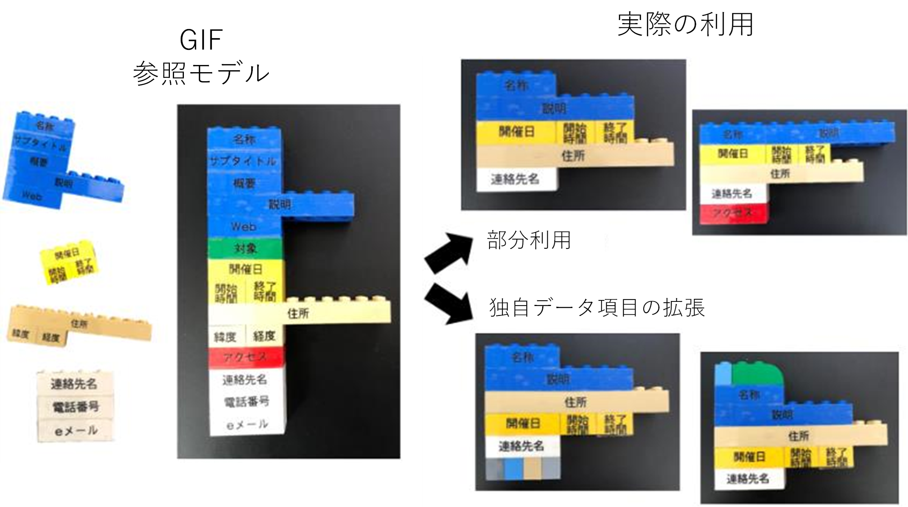
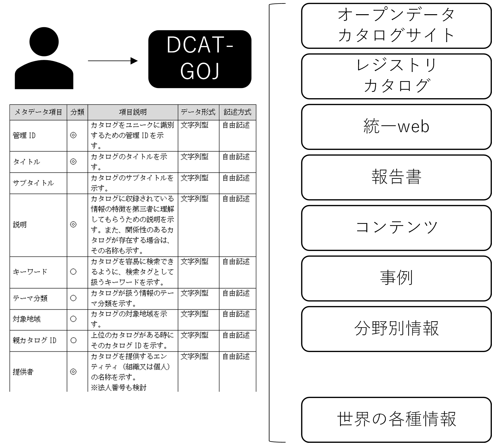
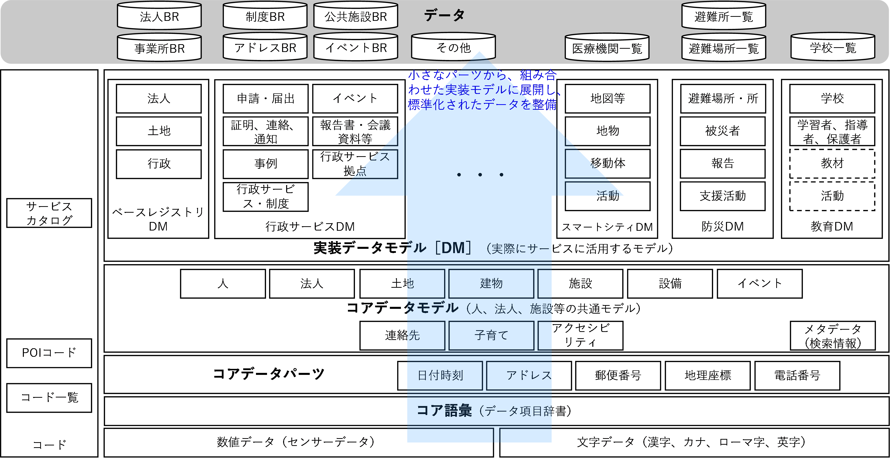
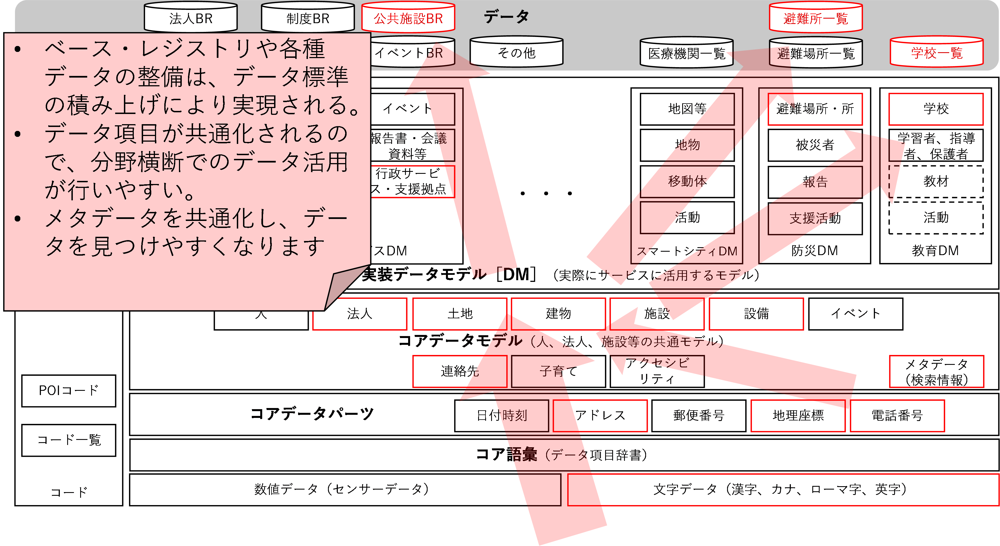
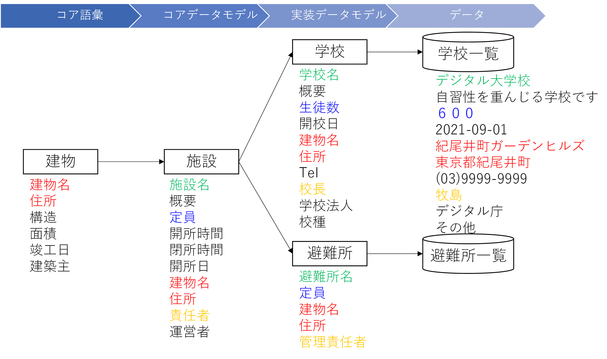

# 政府相互運用性フレームワーク（GIF） 全体編 <!-- omit in toc -->

デジタル社会推進実践ガイドブック DS-410

2022年（令和4年）5月9日

デジタル庁

-----
**[キーワード]**

GIF、相互運用性、IMI2、アーキテクチャ

**[概要]**

政府全体でサービスやデータの連携が求められています。サービスやデータの連携をするためには、業務プロセスの連携、ルールの連携、システムの連携、データの連携などの様々な要素の相互運用性を考える必要があります。

本ガイドブックでは、政府機関の持つサービスをスムースかつ効率的に行うための全体の考え方について説明します。また、詳細の技術項目は個別のガイドブックなどで解説をします。

-----

## 改定履歴 <!-- omit in toc -->

| 改定年月日    | 改定箇所  | 改定内容                                 |
|---------------|-----------|------------------------------------------|
| 2022年5月9日  | P14,16,18 | コアデータモデルに土地、建物、設備を追加 |
| 2022年3月31日 | \-        | 初版決定                                 |

## 目次 <!-- omit in toc -->

- [1. 　はじめに](#1-はじめに)
  - [1.1. 　背景と目的](#11-背景と目的)
  - [1.2. 　適用対象](#12-適用対象)
  - [1.3. 　位置づけ](#13-位置づけ)
  - [1.4. 　用語](#14-用語)
- [2. 　GIFの考え方](#2-gifの考え方)
  - [2.1. 　目指す社会](#21-目指す社会)
  - [2.2. 　基本的な考え方](#22-基本的な考え方)
    - [2.2.1. 従来の取り組みの継承](#221-従来の取り組みの継承)
    - [2.2.2. デジタル世界のルール形成](#222-デジタル世界のルール形成)
    - [2.2.3. 参照モデルの活用](#223-参照モデルの活用)
    - [2.2.4. 構造化したデータモデル](#224-構造化したデータモデル)
    - [2.2.5. グローバル連携](#225-グローバル連携)
  - [2.3. コンセプト](#23-コンセプト)
  - [2.4. GIFのアーキテクチャ](#24-gifのアーキテクチャ)
  - [2.5. GIFの推進ステップ](#25-gifの推進ステップ)
    - [2.5.1. 見つけられること](#251-見つけられること)
    - [2.5.2. 使えること](#252-使えること)
    - [2.5.3. 自動処理できること](#253-自動処理できること)
    - [2.5.4. AI等で解析できること](#254-ai等で解析できること)
  - [2.6. GIFの役割と効果](#26-gifの役割と効果)
    - [2.6.1. 相互運用性の向上（連携の容易さ）](#261-相互運用性の向上連携の容易さ)
    - [2.6.2. 拡張性の向上](#262-拡張性の向上)
    - [2.6.3. 設計コストや時間の削減](#263-設計コストや時間の削減)
    - [2.6.4. 設計や運用の高度化](#264-設計や運用の高度化)
    - [2.6.5. ワンスオンリー、ワンストップの実現](#265-ワンスオンリーワンストップの実現)
  - [2.7. GIFの全体像](#27-gifの全体像)
  - [2.8. GIFが推進する参照モデルとは](#28-gifが推進する参照モデルとは)
- [3. 戦略、組織人材、業務サービス層](#3-戦略組織人材業務サービス層)
- [4. ルール層](#4-ルール層)
    - [4.0.1. 政府標準利用規約](#401-政府標準利用規約)
    - [4.0.2. 個人情報保護条例](#402-個人情報保護条例)
    - [4.0.3. API利用規約](#403-api利用規約)
- [5. GIFのプラットフォーム層](#5-gifのプラットフォーム層)
  - [5.1. IDとアクセス管理](#51-idとアクセス管理)
  - [5.2. データカタログ](#52-データカタログ)
  - [5.3. コネクタ等による連携](#53-コネクタ等による連携)
    - [5.3.1. ブローカー](#531-ブローカー)
    - [5.3.2. コネクタ](#532-コネクタ)
  - [5.4. ツール](#54-ツール)
- [6. データ層](#6-データ層)
  - [6.1. 　メタデータ](#61-メタデータ)
  - [6.2. 各データモデル](#62-各データモデル)
    - [6.2.1. 数値データ、文字データ](#621-数値データ文字データ)
    - [6.2.2. コア語彙](#622-コア語彙)
    - [6.2.3. コアデータパーツ](#623-コアデータパーツ)
    - [6.2.4. コアデータモデル](#624-コアデータモデル)
    - [6.2.5. 実装データモデル](#625-実装データモデル)
    - [6.2.6. コード](#626-コード)
    - [6.2.7. ID（識別子）](#627-id識別子)
  - [6.3. データモデルの導入方法](#63-データモデルの導入方法)
  - [6.4. 導入に関する注意点](#64-導入に関する注意点)
  - [6.5. 既存データの扱い](#65-既存データの扱い)
- [7. アセット](#7-アセット)
- [8. セキュリティ、プライバシ・認証](#8-セキュリティプライバシ認証)
- [9. ドキュメント群](#9-ドキュメント群)
  - [9.1. 実践ガイドブック](#91-実践ガイドブック)
  - [9.2. データモデル](#92-データモデル)
  - [9.3. 主要コード](#93-主要コード)
  - [9.4. 実装データモデル](#94-実装データモデル)
- [10. 研修](#10-研修)
  - [10.1. データ入門](#101-データ入門)
  - [10.2. データ整備](#102-データ整備)
  - [10.3. データ活用（スマートシティ編）](#103-データ活用スマートシティ編)
  - [10.4. ワンスオンリーサービスの作り方](#104-ワンスオンリーサービスの作り方)
- [11. 今後の推進計画](#11-今後の推進計画)

-----
## 1. 　はじめに

### 1.1. 　背景と目的

2000年代後半にデジタルガバメントを見直しが行われ、サービスの基盤として相互運用性の必要性が着目されました。そして、文字情報の整備から、その関連プロジェクトとしてデータモデルを中心とする共通語彙基盤（通称IMI）プロジェクトへと取り組みを拡大していき、データの基盤を整備する一方で、その活用を推進するため、2019年に、「デジタルファースト」「ワンスオンリー」「コネクテッド・ワンストップ」を３原則とするデジタル手続法[^1]　を制定しています。

また、日本の将来ビジョンであるSociety5.0の推進をする中でアーキテクチャの検討やデータ連携基盤の整備を進めてきました。さらに、これらの取り組みを総括し、2021年6月に包括的データ戦略を策定し、2030年のデータ駆動社会の実現に向け取り組みを進めています。

本ガイドブックは、政府機関の持つサービスをスムースかつ効率的に連携できる相互運用可能な環境を実現することを目的にフレームワークの整備をしています。詳細の技術項目は個別のガイドブック等で解説をします。

### 1.2. 　適用対象

政府情報システムを対象とします。地方公共団体やスマートシティでの活用等、社会活動全般で参照し活用することが可能です。

### 1.3. 　位置づけ

本ガイドブックは、標準ガイドライン群の一つとして位置づけられます。

### 1.4. 　用語

本ガイドブックにおいて使用する用語は、別段の定めがある場合を除き、標準ガイドライン群用語集の例によります。

## 2. 　GIFの考え方

### 2.1. 　目指す社会

政府相互運用性フレームワーク（GIF：Government Interoperability Framework）は、誰でも必要な情報が簡単に手に入り、新たなサービスをスタートさせやすい環境作りを目指しています。様々なサービスが生まれるだけでなく、それらがつながり暮らしやすい社会を実現していきます。

<figure>

<figcaption>
図 1　目指す社会
</figcaption>
</figure>

そのためには、「安心してデータやサービスを使用できるトラストの確保」、「見つけやすくつなげやすいデータ連携の仕組み」、ベース・レジストリ重要データ、統計データ、センサーデータなどの「多様で、品質が確保され、十分な量のデータの供給」が必要になります。

また、データを持続的に安定していくことも重要です。データ生成の場に負担をかけない仕組みを考えていく必要があります。

これらの環境整備を通じてリアル社会のデータが整備されデジタル・ツインが実現します。デジタル・ツインの世界では自動運転、都市シミュレーション、保守シミュレーションなどが行われ、社会の維持コストの軽減が図られるともに高度な検討も可能になり、社会全体の持続性を高めていくことができます。

### 2.2. 　基本的な考え方

GIFの推進は、以下の５原則で進めます。

#### 2.2.1. 従来の取り組みの継承

データ連携に関わる従来の様々な取り組みを継承し、分野や地域を越えてシームレスにデータの交換や利活用できる環境を目指します。

#### 2.2.2. デジタル世界のルール形成

社会活動では、社会の文化や歴史に基づき様々なデータの表現が使用されます。しかし、そのままではデータの処理ができない場合もあります。GIFはデジタル世界でデータを扱うためのモデルであり、画面や紙面の表記を制限するものではありません。

#### 2.2.3. 参照モデルの活用

社会変化に対応するため、また、様々な目的や業務で活用できるように、確定した標準を作るのではなく参照モデルを提供します。目的や業務に応じて拡張や部分利用を可能にすることで相互運用性を確保します。

#### 2.2.4. 構造化したデータモデル

データモデルは、繰り返し構造を持つとともにブロック化したパーツを組み合わせて扱えるように構造化して整理します。専門知識がない人のために表形式のデータ定義も併用します。

#### 2.2.5. グローバル連携

GIFは、グローバルに連携することを前提に、主要なグローバルな取り組みと連携して取り組みを進めます。

### 2.3. コンセプト

本フレームワークは、行政における相互運用性に関わる多くの取り組みを包含するため、正式名を政府相互運用性フレームワーク（Government Interoperability Framework：GIF）とします。

また、これまで日本の相互運用性確保の取り組みとしてIMIをプロジェクト名として使ってきました。国際的に通用し、国内でも知名度があるので「IMI」を継承し、プロジェクト名は「IMI２」（アイ・エム・アイ・ツー）とします。

<figure>

<figcaption>
図 2　プロジェクト　ロゴ
</figcaption>
</figure>

IMIは、Infrastructure for Multi-layer Interoperabilityの略であり、様々な分野や技術レベル横断の相互運用性の基盤です。欧米での相互運用性の取り組みはセマンティック・インタオペラビリティが中核で「意味論」まで含んだ相互運用性を目指しています。そうしたことから、「意味（IMI）」と掛けたプロジェクト名にしています。

### 2.4. GIFのアーキテクチャ

データ戦略は、Society5.0の参照アーキテクチャを参照して推進されています。GIFは実装のためのフレームワークであることから、データ連携基盤であるプラットフォームを一体として考え、データモデルは設計の検討を容易にするためルールではなくデータ層に入れています。

<figure>

<figcaption>
図 3　アーキテクチャ
</figcaption>
</figure>

### 2.5. GIFの推進ステップ

GIFは、誰でも自由に必要な時にデータが使えることを目標としていますが、データ利活用環境は段階的に整備していく必要があります。本フレームワークでは、「見つけられること」「使えること」「自動処理できること」「AI等で解析できること」の4ステップで進んでいくことを想定しています。

<figure>

<figcaption>
図 4　GIF推進のステップ
</figcaption>
</figure>

#### 2.5.1. 見つけられること

データは保有しているが公開していない、もしくは、公開しているけど見つからないと言うことがあります。また、公開している情報が独自形式であり内容がわからないため効率的にデータを見つけられないことがあります。見つけられるようにするためにはデータをオープンにすることと、データを見つけるためのカタログ情報、検索用のメタデータを提供することが重要になります。これまでオープンデータカタログの整備を推進してきましたが、さらに、ワンスオンリーサービスを実現するため、行政内のクローズでの利用も含めてデータが検索できるレジストリカタログも重要になります。また、データ間を結びつける識別子であるIDの管理や分類体系であるコード標準も必要になります。

#### 2.5.2. 使えること

データが見つかっても文書がスキャンした画像で提供されていたりPDFであったりといった機械判読が困難なものでは使えません。最新データに更新が行われるなど、最低限のデータ品質を満たしている必要があり、データを使いやすくするためにデータが構造化設計されていることが求められます。また、そのためのデータ項目やデータ形式が揃っている必要があり、データの意味レベルの相互運用性も考慮した共通語彙基盤や、文字の体系である文字情報基盤の活用も必要です。さらに、機械判読ができる場合でも利用規約などのルールが揃っていないと活用が困難であり、標準的なルールの整備や活用も重要になります。

#### 2.5.3. 自動処理できること

データを連携するには様々なツールが必要になります。データへのアクセス管理、データ変換、転送管理のための仕組みを含むデータ連携基盤を整備するとともに、複数データを突き合わせて検証する自動審査の仕組み、人の判断を補助するビジュアライズの仕組みなどが必要になります。

#### 2.5.4. AI等で解析できること

大量のデータが集まるとそれを解析するためAI等を使ったデータ処理ができるようになります。また、データ活用を持続的に行うため、データ収集や品質確保を継続的に行う仕組みの整備が必要になります。

### 2.6. GIFの役割と効果

GIFは相互運用性を高めることを目的としていますが、それだけでなく、「拡張性の向上」「設計コストや時間の削減」「設計や運用の高度化」「ワンスオンリー、ワンストップの実現」を実現します。

#### 2.6.1. 相互運用性の向上（連携の容易さ）

参照モデルを元に連携するシステムの検討ができるので、ルールやデータ項目の対応関係の整理などのサービス連携の検討が容易になります。

#### 2.6.2. 拡張性の向上

システムやサービスはビルディングブロック（モジュール）群で構成されます。このブロック群が、統一されたデータやAPIで接続されるので組み合わせが容易になり、短時間で品質のよいサービスを作れるようになります。

#### 2.6.3. 設計コストや時間の削減

ルールの策定やデータの設計で参照モデルを活用することができるので、設計時間の短縮や設計・運用コストの低減をはかることができます。

#### 2.6.4. 設計や運用の高度化

短縮された設計時間を、サービスや運用の高度化の検討に使うことができます。

#### 2.6.5. ワンスオンリー、ワンストップの実現

申請画面への既存データの読み込みや、申請データと証明データとの自動照合等、デジタル手続法の3原則の１つであるワンスオンリーサービスを実現します。また、データ項目等が共通化されることで複数サービス横断のワンストップサービスが実現できます。

<figure>

<figcaption>
図 5　ワンスオンリー、ワンストップの実現
</figcaption>
</figure>

### 2.7. GIFの全体像

GIFは従来の実践ガイドブックとデータモデルを一体として整理しています。2022年3月に公開し、利用者の意見を収集、反映し、2023年3月により実務的なバージョンに更新していく予定です。また、ベース・レジストリ設計への反映、既存データへのコンバータ開発を進めていく予定です。

<figure>

<figcaption>
図 6　既存のデータルールと今後の展開
</figcaption>
</figure>

### 2.8. GIFが推進する参照モデルとは

GIFは参照モデルの考え方を導入しています。参照モデルとは「ひな形」と考えてください。利用者は参照モデルを、利用目的に合わせて拡張したり、内容を部分利用したりすることで、容易に相互運用性の高いサービスを作ることができます。

<figure>

<figcaption>
図 7　参照モデルの利用
</figcaption>
</figure>

参照モデルは、アーキテクチャ、ルール、業務プロセス、データモデル等、様々なものを対象に作成できます。基本となる部分が同じになるので相互運用性が高くなります。

ただし、参照モデルは正しい使い方をする必要があります。ひな形に過ぎないと考えて自由に改変すると相互運用性は損なわれます。参照モデルをできるだけ変更しないようにするとともに、変更点を明確にすることにより高い相互運用性が確保されます。

-----
## 3. 戦略、組織人材、業務サービス層

GIFで、データマネジメントのための組織、データ人材のあり方について検討を進めていますが、現時点で組織や人材、業務プロセスに対する相互運用性向上の取り組みは今後の検討課題です。

-----
## 4. ルール層

データには利用条件などのルールがあり、そのルールの中で利活用や連携を行います。このルールが独自ルールであると他地域や他分野で開発されたアプリケーションが使えないことがあります。多くのサービスでは複数主体からデータを収集しサービスを構築します。その場合、各データソースのルールを理解しサービスを構築する必要があり、データソースの1つでもルール改訂があると全体の整合性の確認を行う必要があるなど運用に負担がかかります。

例えば、「自由に改変し利用することができる。」という利用規約を改変する場合、以下の2つのパターンが考えられます。

* 文章の自由な変更
  * 「<u>非商用利用に限り許可の範囲で</u><s>自由に</s>改変し利用することができる。」
* 付則、但し書き等での変更
  * 「自由に改変し利用することができる。<u>付則、前項は、自由な改変ではなく非商用の利用で許可の範囲の改変に限る。</u>」

この場合、原文を変更せず付則で条件を記載する方が差分の確認が容易になります。

相互運用性を確保するための主なルールは、現在、以下の３つがあります。

#### 4.0.1. 政府標準利用規約

政府標準のデータの利用規約です。この規約を使うことで、複数組織のオープンデータの利用条件を容易に確認できます。ただし、各部局が独自の変更を加えている場合があるので、実際には利用規約の確認が個々に必要になります。

#### 4.0.2. 個人情報保護条例

地方公共団体毎に個人情報保護条例が独自に作られて相互運用性の検討を難しくしていましたが、令和３年改正個人情報保護法の改正で全国的な共通ルールを規定し、全体の所管を個人情報保護委員会に一元化することで検討が進められています。[^2]

#### 4.0.3. API利用規約

「スーパーシティのデータ連携基盤に関する調査業務」技術報告書[^3]のAPI利用規約が活用できます。API導入実践ガイドブックに掲載されています。

-----

## 5. GIFのプラットフォーム層

データの検索、利用、連携を行うためのデータ連携基盤やその機能を整備することで相互運用性を確保します。ビルディングブロックという機能モジュールでAPIにより自由に組み合わせられる構造を持つことが重要です。

### 5.1. IDとアクセス管理

アクセスするときの認証と、そのアクセス内容のログを管理する機能が求められます。

個人の認証はJPKIが整備、運用されており、マイナンバーカードに搭載される等、普及が進められています。

法人の認証は政府統一の認証システムであるgBizIDで各種サービスの認証一元化を進めています。

### 5.2. データカタログ

政府のオープンデータカタログサイトのData.go.jpをはじめ多くの行政機関がカタログサイトのオープンソースのであるCKANを利用しています。また、カタログの検索を容易にするためのメタデータの検討が進められています。

### 5.3. コネクタ等による連携

データ連携のための機能は、データの変換、送達確認、アクセス制御等の機能がビルディングブロックで提供され、APIで接続しています。

#### 5.3.1. ブローカー

データの形式の変換とデータの送達を管理する機能が提供されます

#### 5.3.2. コネクタ

ブローカーの機能を包含し、アクセス制御、ポリシー管理や送信履歴管理などデータ連携に必要な機能が搭載されます。

### 5.4. ツール

データのクレンジングのためのOpenRefine[^4]やデータ品質を確認するためのバリデータなどの共通的なツールが必要になります。ツールの情報の共有を進めることでデータの連携を効率的にできるようにすることが重要です。

-----

## 6. データ層

データは、個々のデータ項目から対象物のデータモデルまで、一貫したモデルを整備することで、分野を横断して相互運用できる仕組みが整備できます。

各データモデルと、データを検索するメタデータが重要になります。

### 6.1. 　メタデータ

GIFの導入ステップの第一段階はデータを「見つかりやすく」することです。そのためデータには、データのためのデータといわれる検索用のメタデータが付与されます。メタデータは、データの名称、概要、利用権、更新日などの情報を含んでおり、様々な分野に適用を進めています。統一的なメタデータをつけることで、分野横断でのデータ検索が容易になります。

世界各国は国際標準化団体のW3Cが制定したDCATをベースにメタデータを自国向けにアレンジして使っています。GIFは、日本版のメタデータとして、メタデータ導入実践ガイドブックの中でDCAT-GOJを規定しています。グローバルな標準を参照しているので、国際的な情報検索も容易に行うことができます。

<figure>

<figcaption>
図 8　メタデータのイメージ
</figcaption>
</figure>

### 6.2. 各データモデル

データモデルの全体構成は以下のようになります。

<figure>

<figcaption>
図 9　データモデルの全体像
</figcaption>
</figure>

#### 6.2.1. 数値データ、文字データ

センサー等から収集される数値データと、報告や各種情報に含まれる文字データがあります。

文字の中には、漢字、ヨミガナ、英字などが含まれ、データ不一致の原因になっています。文字情報環境導入実践ガイドブックに基づき相互運用できる導入方式にしていく必要があります。

#### 6.2.2. コア語彙

政府が整備したデータ定義集である共通語彙基盤の中核をなすコア語彙です。社会の活動は、ほぼこのコア語彙を使って表現することができます。多様な表記を可能にするためデータ項目が細かく細分化され定義されています。実装する場合には、このコア語彙をベースにデータ項目を取捨選別して実装用のデータモデルを整備していく必要があります。

#### 6.2.3. コアデータパーツ

日付やアドレス等、多くのデータに共通的に含まれるデータ項目のデータ形式を定義しています。

#### 6.2.4. コアデータモデル

人、施設等、社会で汎用的に使えるデータモデルを、コア語彙、コアデータパーツなどを組み合わせて定義しています。また、連絡先やアクセシビリティ情報等、ブロック化して各データモデルに組み込んで使えるデータの集合を切り出してデータモデルとして定義しています。

#### 6.2.5. 実装データモデル

サービスに組み込む場合に、「施設」のデータ項目に「学校種別」等の情報を拡張して「学校」とするなど、実際の使用目的に応じて作成したデータモデルです。

このデータモデルが、ベース・レジストリやその他の実際のデータ整備に使われます。

#### 6.2.6. コード

データの分類を整理したものです。コードを共通化することで複数データを統合して活用することが容易になります。データ項目内の選択肢であるコントロールド・ボキャブラリ（統制語彙）も含みます。政府の主要コードを収集し、コード一覧として公開していきます。

#### 6.2.7. ID（識別子）

各データは対象物を一意に特定する識別子が必要になります。個人にはマイナンバー、法人には法人番号が振られており、行政手続きでも認定番号や証明書番号があり、社会の活動でも自動車や製品のシリアル番号等の識別子があります。これらの識別子はデータを連携するときのキー項目となります。IDの発行主体、管理方法を検討していく必要があります。

### 6.3. データモデルの導入方法

GIFにおけるデータモデルの導入イメージは下図のように下からモデルを積み上げていくイメージになります。

まずは漢字の範囲やヨミガナの有無などを規定し、アドレス、地理座標、電話番号等の表記方法を規定します。それを元にした連絡先のパーツが作られます。さらに、コア語彙とコアデータパーツから法人と施設の汎用的なコアデータモデルを作成します。

実装データモデルは、コアデータモデルを各分野の特徴に合わせてカスタマイズして作ります。建物のコア語彙をベースに公共施設種別を付加して公共施設データモデルを作り、避難所情報を付加するとともに余分な情報を除き避難所データモデルを作るなど、それぞれ分野で使いやすいデータモデルとそれを活用したデータを整備していきます。

このような設計手法をとることで、基本部分が共通化され分野横断で活用がしやすいデータを整備していくことができます。

<figure>

<figcaption>
図 10　データモデルの利用イメージ
</figcaption>
</figure>

具体的に施設のコアデータモデルは、コア語彙の建物や施設のデータ項目を使い、実際の運用を想定したデータ項目に絞り込んでいます。それを元に、データ構造は同じまま学校データや避難所データの派生モデルを作っています。

<figure>

<figcaption>
図 11　実装データモデルの作り方
</figcaption>
</figure>

### 6.4. 導入に関する注意点

中長期的には、GIFを使うことで使いやすいデータが整備され運用コストも下がるので、新規システムの設計時はもちろん、システム公開のタイミングでGIFを参照していくことが推奨されます。ただし、既存のシステム、データの蓄積がある中、短期間で移行することは大変です。移行コストを考えながら移行の検討を進めていく必要があります。特に、業界標準でデータ項目が普及しており、様々なシステムやサービスが存在する場合、移行時に新旧二重でデータを保有する期間を置くなどの移行措置をとる必要が生じることがあります。時間を掛けて関係者の合意を得るとともに、コンバータなども使用して移行をしていく必要があります。

### 6.5. 既存データの扱い

推奨データセット等の既存データを活かすため、従来データのためのコンバータを活用するなど、自治体や利用者に負担をかけない導入方法を実現していきます。また、2022年4月以降、地方自治体などとデータモデルを含め議論の場を作っていきます。

-----
## 7. アセット

ハードウェア、ネットワーク、センサーなどについては、デファクトも含め、できるだけグローバル標準になっているものを使用します。

-----

## 8. セキュリティ、プライバシ・認証

相互運用性を確保した環境においてセキュリティ確保は重要な課題です。内閣サイバーセキュリティセンターの公表する「政府機関等のサイバーセキュリティ対策のための統一規範」、「政府機関等のサイバーセキュリティ対策の運用等に関する指針」、「政府機関等のサイバーセキュリティ対策のための統一基準（令和3年度版）」を参照するとともに、「クラウドを利用したシステム運用に関するガイダンス」を参照することが重要です。また、システムやデータを守るため「ランサムウェア特設ページ」（https://security-portal.nisc.go.jp/stopransomware/）の情報を参照することも重要になります。

またデータ連携におけるプライバシ上の課題、認証に関しては個人情報保護委員会等の取り組みを注視していく必要があります。

-----

## 9. ドキュメント群

GIFの推進をするために、実践方法を解説した実践ガイドブック、データモデル、主要コード一覧、実装データモデルを用意しています。

### 9.1. 実践ガイドブック

* 文字環境導入実践ガイドブック［改定（新ISO反映）］
* マスターデータ等設計・活用実践ガイドブック［改定］
* コード（分類体系）設計・活用実践ガイドブック［改定（QRコード等追記）］
* API設計・活用実践ガイドブック［改定］
* APIテクニカルガイドブック［4月以降改定予定］
* データマネジメント実践ガイドブック［新規］
* データ人材管理実践ガイドブック［ベータ版から正式化］
* データアーキテクチャ管理実践ガイドブック［新規］
* データ品質管理実践ガイドブック［ベータ版から正式化（簡易測定を追加）］
* メタデータ設計・活用実践ガイドブック［新規］→別紙

### 9.2. データモデル

* コア語彙（共通語彙基盤［IPAで運用中］）
* コアデータモデル
  * コアモデル
    * 人
    * 法人
    * 施設
    * イベント
    * 土地
    * 建物
    * 施設
  * モジュール
    * 連絡先
    * アクセシビリティ
    * 子育て支援
* コアデータパーツ（旧行政基本データ連携モデル）
  * 日付及び時刻
  * 住所
  * 郵便番号
  * 地理座標
  * 電話番号
  * POIコード

### 9.3. 主要コード

コード一覧

### 9.4. 実装データモデル

* 行政（行政サービス・データ連携モデル）
  * 申請・届出データモデル
  * 証明、通知データモデル
  * 事例データモデル
  * 行政サービス・制度データモデル
  * イベントデータモデル・・・基本データモデルを再掲
  * 報告書・会議資料等データモデル
  * 行政サービス拠点・支援機関等データモデル
  * サービスカタログモデル
  * 調達データモデル
* スマートシティ
  * スマートシティデータモデル［4月以降公開予定］
    * 地物
    * 移動体
    * インフラ

-----
## 10. 研修

GIFは多くのドキュメント群で構成されます。これらを効果的に活用するための研修教材およびビデオを提供します。

### 10.1. データ入門

行政におけるデータの実態と重要性を解説します。

### 10.2. データ整備

データ設計、コード設計の方法を解説します。

### 10.3. データ活用（スマートシティ編）

スマートシティでのデータ整備方法や活用の考え方を解説します。

### 10.4. ワンスオンリーサービスの作り方

ワンスオンリーサービス設計の考え方と方法、ベース・レジストリとの連携方法などを解説します。

-----
## 11. 今後の推進計画

GIFに関する本ガイドブック群は、2022年度中の運用と意見収集を元に2023年3月に改訂を実施する予定です。

[^1]: 情報通信技術を活用した行政の推進等に関する法律（デジタル手続法。平成14年法律第151号）

[^2]: https://www.soumu.go.jp/main_content/000790352.pdf

[^3]: https://www.chisou.go.jp/tiiki/kokusentoc/supercity/supercity_kentoukai.html

[^4]: https://openrefine.org/
