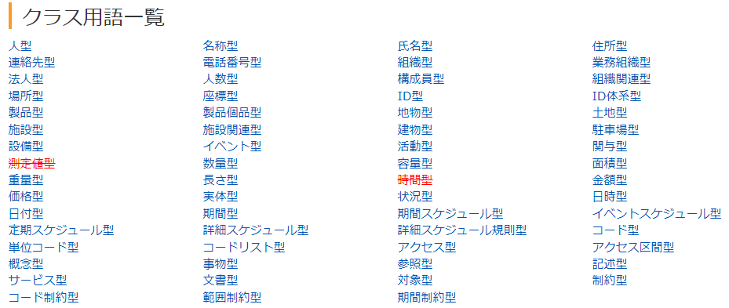
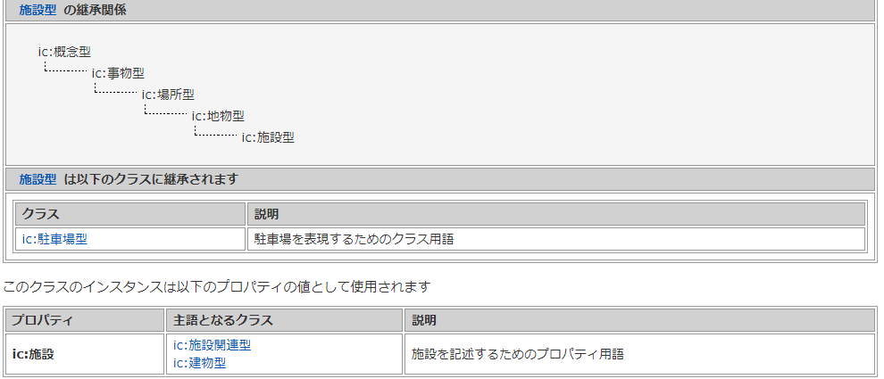
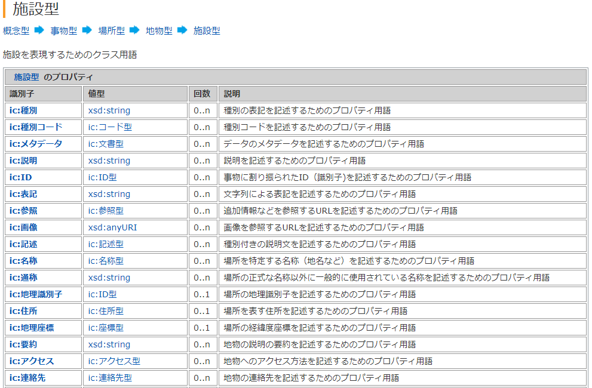
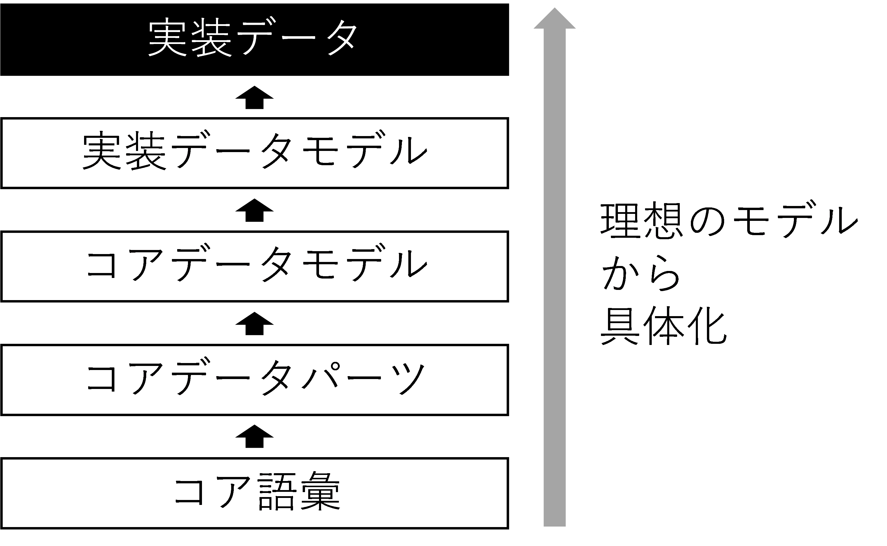

# コア語彙（共通語彙基盤） <!-- omit in toc -->

デジタル社会推進実践ガイドブック DS-420

2022年（令和4年）3月31日

デジタル庁

-----
**[キーワード]**

共通語彙基盤、IMI、データモデル、データ辞書

**[概要]**

他機関とのデータ交換を容易、かつ正確に行えるようにするための参照データモデル群。社会の主要な物事を表現できる６１のクラス用語で構成され、このクラス用語やデータ項目を選択することで、データ設計を容易にすることができ、データ設計のコストや時間を削減することができる。

-----
## 改訂履歴 <!-- omit in toc -->

| 改訂年月日    | 改訂箇所 | 改訂内容 |
|---------------|----------|----------|
| 2022年3月31日 | -       | 初版決定 |

## 目次 <!-- omit in toc -->
- [1. 　背景と課題](#1-背景と課題)
  - [1.1. 　背景](#11-背景)
  - [1.2. 　課題](#12-課題)
- [2. 　目的と概要](#2-目的と概要)
  - [2.1. 　目的](#21-目的)
  - [2.2. 　概要](#22-概要)
    - [2.2.1. データ連携](#221-データ連携)
    - [2.2.2. データ設計](#222-データ設計)
- [3. 　コア語彙の内容](#3-コア語彙の内容)
  - [3.1. 　クラス用語とデータ項目](#31-クラス用語とデータ項目)
  - [3.2. 　データの継承](#32-データの継承)
  - [3.3. 　データ項目（プロパティ）定義](#33-データ項目プロパティ定義)
  - [3.4. 　利用イメージ](#34-利用イメージ)
- [4. 　コア語彙と他のGIFのデータモデルとの関係](#4-コア語彙と他のgifのデータモデルとの関係)
- [5. 　世界のコア語彙](#5-世界のコア語彙)
  - [5.1. schema.org](#51-schemaorg)
  - [5.2. SEMIC core vocabulary](#52-semic-core-vocabulary)
  - [5.3. NIEM](#53-niem)

-----
## 1. 　背景と課題

### 1.1. 　背景

外部の組織とデータの連携をしたり、複数ソースのデータを合わせたりしてデータを活用する機会が増えてきています。そのとき、同じデータ項目に異なるデータ項目名がついていたり、同じデータ項目名なのにデータの定義や内容が異なっていたりすることがよくあります。その場合、データの交換はできるものの、内容が一致しないので正確なデータの連携や活用をすることができません。

データは数十年使うことも多く、数百年にわたり活用することもある組織の資産です。

そのため世界では、構造化したデータ設計をしたり、参照用のデータモデルやデータ辞書によりデータの意味レベルで問題解決を図ったりする等、データの相互運用性を確保するための取り組みをおこなっています。

一方、国内では、ヒアリングや既存資料を基に表を使って独自にデータ設計を行う方法が一般的であり、データ定義や構造に揺らぎが生じてデータ連携を困難にしています。

### 1.2. 　課題

個社や業界の中でデータの共通定義をおこないデータが連携できない課題を解決している場合もありますが、データ駆動社会の中で組織や分野を超えてデータを連携する場面で多くの問題が生じています。

データオーナーが感じる課題

* どのようにデータ項目を設計、命名したらよいのかわからない。
* データ設計やデータ連携のたびに費用と時間がかかる。処理できない場合もある。
データ利用者が感じる課題
* 複数のデータ項目が同じものか判断できない。
* 同じデータ項目として処理してしまったものが違うデータであり結果が正確でないことがある。

-----
## 2. 　目的と概要

### 2.1. 　目的

本ガイドブックは、相互運用性の高いデータで社会活動全般を表現することを目的としたコア語彙の解説をすることにより、分野やサービス横断でデータ連携可能にするとともにデータ設計を効率化することを目的とします。また、データ管理を高度化することで持続性の高いるデータ環境を実現します。

### 2.2. 　概要

コア語彙は、共通語彙基盤のコア語彙として政府のIT戦略の基盤として推進されてきました。データの参照モデルによる相互運用性確保を目指しています。

標準のように、全てのシステムが標準のデータモデルを厳守する必要はありません。参照モデルを元に、部分利用（サブセット）、拡張（エンハンス）して活用をするので、高い相互運用性と拡張性を両立させています。また、各システムは既存のデータモデルを使ったり、高速処理などの目的に応じてデータモデルを使ったりすることができます。その場合にはデータを連携するときに、参照モデルに変換することによりデータの連携を行います。

<figure>

<figcaption>
図 1　データの拡張とサブセット化
</figcaption>
</figure>

共通語彙基盤やコア語彙の詳細は以下のサイトを参照してください。

https://imi.go.jp/goi/

#### 2.2.1. データ連携

これまでは、データを接続するたびに接続先と調整をするため接続にコストと時間がかかっていましたが、参照モデルを使うことでデータ連携時のデータモデルが規定されるので、各組織は接続先数にかかわらずにデータの連携がしやすくなります。

<figure>

<figcaption>
図 2　データ交換での参照モデルの利用
</figcaption>
</figure>

このようなデータ交換する仕組みは、以前からEAI（Enterprise Application Integration）があります。機能はデータ連携で同じです。この交換時に参照データモデルを中間データ構造として使用します。

#### 2.2.2. データ設計

コア語彙のもう一つの効果がデータ設計の高度化です。対象物に対するデータ設計をゼロからするのではなくデータモデルを参照してデータ設計することで、データ設計を高度化、迅速化することができます。また、将来の拡張性も確保することができます。

コア語彙は詳細に定義されているためそのまま実装することはなく、実装するときにコア語彙を元にデータモデルを設計します。その実装用語彙をDMD（Data Model Description）として推進してきましたが、DMDをより簡易に作る仕組みとしてGIFではコアデータパーツ、コアデータモデル、実装データモデルの3階層で設計しています。

## 3. 　コア語彙の内容

### 3.1. 　クラス用語とデータ項目

データは、複数のデータ項目をブロック化し、それを組み合わせてデータを作る構造化の手法がとられます。コア語彙では、61のクラス用語で構成されます。

<figure>

<figcaption>
図 3　クラス用語一覧（赤字は廃止したクラス語彙）
</figcaption>
</figure>

### 3.2. 　データの継承

データモデルは大きな概念からブレイクダウンしていきます。このようにブレイクダウンすることを継承と言います。大きな概念部分を共通化してそれを派生するという設計方式にすることで、共通化できる範囲が広がり、より使いやすいデータ構造にすることができます。

下図は、場所の中に地物（土地に紐付く物体）があり、その一つとして施設があるという展開の事例を示しています。

<figure>

<figcaption>
図 4　データの継承イメージ
</figcaption>
</figure>

### 3.3. 　データ項目（プロパティ）定義

各クラス用語は多くのデータ項目（プロパティ）で構成されます。データ項目名、値の型、出現回数、説明で構成されます。

出現回数を定義することで画像を何種類も添付するなどの繰り返し表現をすることが可能です。

<figure>

<figcaption>
図 5　データ項目（プロパティ）例
</figcaption>
</figure>

### 3.4. 　利用イメージ

目的や既存データ、データ作成の負荷を考慮してデータ項目を選択して使用する。データ項目名はラベルとして自由に変えて使うことができるが、それが何に基づくデータ項目か明確にすることが重要になります。

<figure>

<figcaption>
</figcaption>
</figure>

-----
## 4. 　コア語彙と他のGIFのデータモデルとの関係

コア語彙は汎用的に使えるようにするため多くのデータ項目で構成されています。また、データ長は定義していません。そのため、データを実際に使うためには実装のためのデータ設計をする必要があります。

GIFでは、ほとんどのデータに含まれる住所のようなデータ項目や連絡先のようなデータ項目群をコアデータパーツと定義しています。ここではコア語彙から実装しやすいデータ項目を選択するとともに、データ表記・形式の定義をしています。

またコア語彙とコアデータパーツを組み合わせることで、施設や法人などの広く使われるクラスのひな形となるデータモデルを作ることができます。これらをコアデータモデルとして定義しています。

さらに、各サービスの実装では、分野の特性を踏まえコアデータモデルを拡張した実装データモデルを定義しています。このように整備されたデータモデルを元に実際のデータを整備していきます。

<figure>

<figcaption>
図 6　コア語彙からGIFの各要素への展開
</figcaption>
</figure>

-----
## 5. 　世界のコア語彙

世界では、相互運用性を確保するための様々なコア語彙が定義されています。

### 5.1. schema.org

検索サービス提供各社が中心となり推進している社会全体のデータモデル体系。

https://schema.org/

### 5.2. SEMIC core vocabulary

欧州委員会が中心となり推進している行政を中心としたデータモデル体系。

https://joinup.ec.europa.eu/collection/semantic-interoperability-community-semic/core-vocabularies

### 5.3. NIEM

米国政府のデータモデル体系。各州も参照しており、安全保障系のデータが充実している。

https://www.niem.gov/
