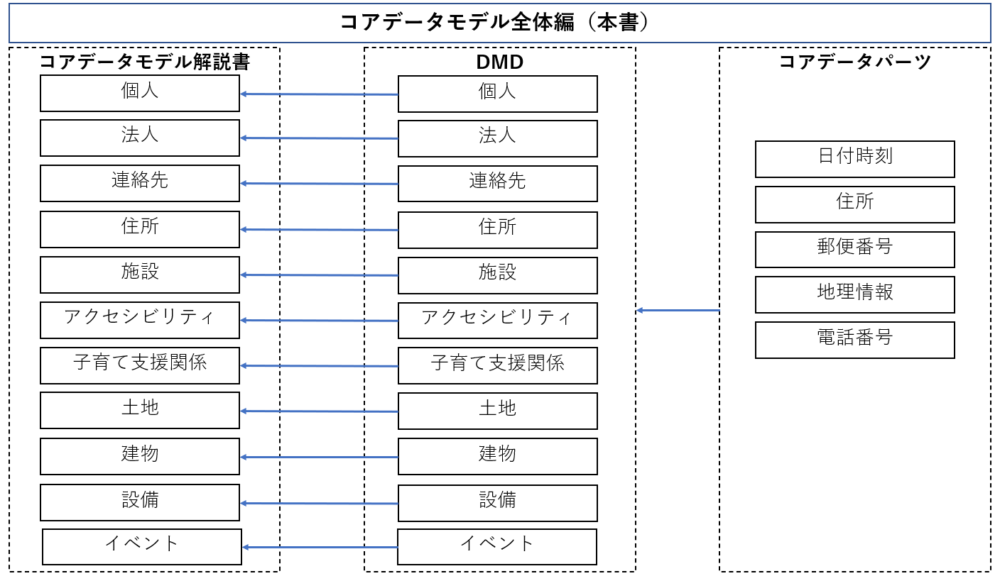
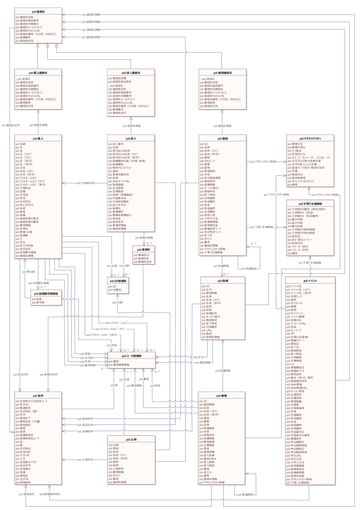

# コアデータモデル全体概要 <!-- omit in toc -->

デジタル社会推進実践ガイドブック DS-430

2022年（令和4年）6月30日

デジタル庁

-----
**[キーワード]**

データ標準、相互運用性、データ連携、データモデル、データ形式</p>

**[概要]**

行政機関で個人や法人に関するマスターデータや各種手続きに関するシステムを開発するときに参照すべき実践的なデータモデルについて紹介。このガイドに従いデータ構造の設計を行うことで、他機関とのデータ交換が容易、かつ正確に行えるようになり、データ設計を行うコストも削減することができる。

-----

## 改訂履歴 <!-- omit in toc -->

| 改訂年月日    | 改訂箇所 | 改訂内容                                 |
|---------------|----------|------------------------------------------|
| 2022年6月30日 | P7-9     | コアデータモデルにイベントを追加         |
| 2022年5月9日  | P7       | コアデータモデルに土地、建物、設備を追加 |
| 2022年3月31日 | \-       | 初版決定                                 |
## 目次　<!-- omit in toc -->
- [- 5. 5.付録](#--5-5付録)
- [1. はじめに](#1-はじめに)
  - [1.1. 背景](#11-背景)
  - [1.2. 解決したい課題](#12-解決したい課題)
  - [1.3. 検討のプロセス](#13-検討のプロセス)
    - [1.3.1. 既存の標準群のデータ項目について対応表を作成](#131-既存の標準群のデータ項目について対応表を作成)
    - [1.3.2. 個々のデータ項目について必要性や定義を再検討](#132-個々のデータ項目について必要性や定義を再検討)
    - [1.3.3. 実装の容易さや利便性を加味して全体を構造化](#133-実装の容易さや利便性を加味して全体を構造化)
- [2. 全体像](#2-全体像)
  - [2.1. ドキュメントの構成](#21-ドキュメントの構成)
    - [2.1.1. コアデータモデル解説書](#211-コアデータモデル解説書)
    - [2.1.2. DMD (Data Model Description)](#212-dmd-data-model-description)
    - [2.1.3. コアデータパーツ](#213-コアデータパーツ)
  - [2.2. コアデータモデルの全体構造](#22-コアデータモデルの全体構造)
  - [2.3. DMD (Data Model Description) の構造](#23-dmd-data-model-description-の構造)
    - [2.3.1. 項目名、項目名（英語）](#231-項目名項目名英語)
    - [2.3.2. 必須項目](#232-必須項目)
    - [2.3.3. 最小回数](#233-最小回数)
    - [2.3.4. 最大数](#234-最大数)
    - [2.3.5. 説明](#235-説明)
    - [2.3.6. 形式](#236-形式)
    - [2.3.7. 記入例](#237-記入例)
    - [2.3.8. その他項目](#238-その他項目)
  - [2.4. コアデータモデルで定義した型](#24-コアデータモデルで定義した型)
    - [2.4.1. ID情報型](#241-id情報型)
    - [2.4.2. コード情報型](#242-コード情報型)
    - [2.4.3. 役割関与情報型](#243-役割関与情報型)
- [3. コアデータモデルの利用方法](#3-コアデータモデルの利用方法)
  - [3.1. データの設計時にコアデータモデルを参照する](#31-データの設計時にコアデータモデルを参照する)
  - [3.2. データ項目の記述形式にコアデータパーツを参照する](#32-データ項目の記述形式にコアデータパーツを参照する)
- [4. 全体に関わる留意事項](#4-全体に関わる留意事項)
  - [4.1. 氏名、法人名の漢字表記の扱い](#41-氏名法人名の漢字表記の扱い)
  - [4.2. 氏名、法人名のヨミガナの扱い](#42-氏名法人名のヨミガナの扱い)
  - [4.3. 氏名、法人名、住所などのローマ字表記の扱い](#43-氏名法人名住所などのローマ字表記の扱い)
  - [4.4. 本社住所の扱い](#44-本社住所の扱い)
  - [4.5. 外字の扱い](#45-外字の扱い)
  - [4.6. データやデータ項目名の表記に関する留意点](#46-データやデータ項目名の表記に関する留意点)
  - [4.7. 国の名称とコードの扱い](#47-国の名称とコードの扱い)
  - [4.8. 性別のコードの扱い](#48-性別のコードの扱い)
  - [4.9. 日時の扱い](#49-日時の扱い)
- [5. 5.付録](#5-5付録)
-----
## 1. はじめに

### 1.1. 背景

 行政機関では多くのデータを管理していますが、そのデータは独自の形式である場合が多く、標準化されていません。
 そのため、データの再利用が困難であったり、外部とのデータ連携においても大きな障害になっています。
 また、データ形式が標準化されていないと、データ連携ができないだけでなく、データの整形に多くのリソースを割くことになり、分析にも支障をきたします。
 AIやビッグデータの活用が注目されていますが、そのインプットとなるデータが十分に整備されていなければ、目的の結果にたどり着くのが困難になります。

 欧州や米国では、行政データの標準化を進めることで、社会全体のデータ標準化につながっていくものと考え、欧州委員会（EC）は、各国の個人、法人、場所情報等が活用できるようにSEMIC[^1]という行政データ標準化のプロジェクトを推進しています。
 米国では同様にNIEM[^2]というプロジェクトが進められています。

 日本においても行政データの標準化を図るため、これまで標準ガイドライン群の一部として、行政基本情報データ連携モデル、行政サービス・データ連携モデル（β版）、推奨データセット、共通語彙基盤などを設計、公開してきました。
 これら既存の標準群はデータを相互に連携する際の共通規格のように使われることを想定しており、世の中の基礎的な要素について統一した表現方法を採用することで、データの相互運用性を確保することを目的としています。
 行政データの標準化にあたってはこれら既存の標準群を活用できる状態にありますが、後述するような課題も認識されています。

### 1.2. 解決したい課題

 これまで公表してきたデータ標準群を実際に使いたいユーザーの目線から見た時、大きく分けて以下のような課題があります。

1.  標準が普及しておらず、存在を認識できていない
2.  標準がたくさんあって、どれを見ればいいのかわからない

 １つめの課題は標準の普及についてです。CIOポータルにその他の標準ガイドラインと並べて掲載はしているものの、その認知度や可読性には課題があります。

-   掲載されていることを知らなかった
-   CIOポータル自体を知らなかった
-   そもそもデータの相互運用性の課題に対して、標準というアプローチがあることを知らなかった

 などの理由により、既存の標準が広く普及しているとは言い難い状況にあります。

２つめの課題は標準の統一についてです。
既存の標準群はそれぞれ異なったタイミングで整備・発表されたものなので、内容であるデータ項目には重複や定義の差異が存在しており、データの構造も異なっています。
ドキュメント自体の体系もそれぞれ異なっているため、ユーザーは複数の異なるドキュメントからユースケースにあった標準を見つけねばならず、標準を採用するまでの負荷が増大しています。

今回の取り組みでは、上記の課題のうち２つめの課題、すなわち標準の統一を解決します。
既存の標準群を統合・再整理し、利活用の側面からデータ項目の取捨選択、定義の見直しを行った上でGIF（Government Interoperability Framework)の一部として一つにまとめることを目的としています。
統合したデータ標準は、基礎編であるコアデータモデルと、応用編である実装データモデルに分けて整理しています。
基礎編では社会の様々な場面で登場する個人や法人、住所や連絡先などの基礎的なデータをコアデータモデルとして本書で取りまとめています。
応用編ではコアデータモデルの組み合わせやカスタマイズによって表現される実装データモデルを、行政、教育、スマートシティなど分野ごとに分けて整備しています。

GIFとして整理を行ったこれらの標準やデータに関わる実践ガイドブックは、発表後1年をかけて普及・定着のためのマーケティングや、利用者からのフィードバックを反映して内容の更新を行います。これにより1つめの普及課題を解決しながら、徐々に完成形に近づけていきます。


### 1.3. 検討のプロセス

 標準の統一・再整理は以下のプロセスで検討を行いました。

#### 1.3.1. 既存の標準群のデータ項目について対応表を作成

 既存の標準のうち、行政データ・サービス連携モデル（β版）をベースに、推奨データセットやIMI共通語彙基盤など、その他の標準をデータ項目ごとに紐づける形で対応表を作成しました。
 これにより、データ項目の重複や差異、欠落を洗い出し、項目レベルでの統合を行いました。標準間の細かい定義の揺れもこのプロセスで吸収しています。

#### 1.3.2. 個々のデータ項目について必要性や定義を再検討

 作成した対応表をもとに、データ項目一つ一つについて、民間のデータ有識者を含むデジタル庁内チームで検討を行い、定義の見直しや項目自体の取捨選択を行いました。
 項目の必須・任意の分類もこのプロセスで行なっています。
 必須項目を定義することで、最低限の相互運用性を確保しつつ、任意項目の選択や利用者独自の項目追加により、カスタマイズの余地を残すことを目的としています。

#### 1.3.3. 実装の容易さや利便性を加味して全体を構造化

 最後に、確定したデータ項目を正規化し、全体の構造の見直しを行いました。
 既存の標準の中ではIMI共通語彙基盤が最も構造化されています。
 逆にオープンデータの普及を目的とした推奨データセットは構造化が最小限に留められています。
 構造の見直しにおいては、これら２つの既存標準の中間となるような、ある程度は構造化されていてシステム実装とメンテナンスが行いやすく、かつフラットな構造を一部残すことでデータ利用者にとって扱いやすいことを念頭に置いて再構成しています。
 この過程において「ID情報型」や「コード情報型」など、項目に対応する新しいデータの型を追加しました。

 再構成した新しい標準体系は実際の利用場面を想定した実装データモデルとして位置付けています。
 それに対して、既存の標準であるIMI共通語彙基盤はデータの辞書のように使われることを想定しています。
 そのため、新しい標準をより構造化した形にカスタマイズして利用したい場合などに、IMI共通語彙基盤を参考にすることができます。


-----
## 2. 全体像

### 2.1. ドキュメントの構成

 統一・再整理したデータ標準のことを以下、コアデータモデルと呼称します。コアデータモデルのドキュメント構成は図1のとおりです。

<figure>

<figcaption>
図1 ドキュメント構成
</figcaption>
</figure>


 全体を説明する本書とは別に３つの大きなドキュメント群で構成されます。

#### 2.1.1. コアデータモデル解説書

 様々な場面で参照される以下の要素について、標準となる基本的なデータ構造を定義しています。

1.  個人
2.  法人
3.  連絡先
4.  住所
5.  施設
6.  アクセシビリティ
7.  子育て支援情報
8.  土地
9.  建物
10. 設備
11. イベント

 これらについてデータ項目と使い方の解説を記載したものがコアデータモデル解説書です。解説書は行政データ・サービス連携モデル（β版）を元に作成されていますが、行政のもつデータだけでなく、民間事業者のもつデータにも活用されることを想定しています。
 例えば、民間事業者が「個人」のデータモデルを参考に自社サービスのユーザー情報をデータ化したり、「法人」のデータモデルを参考に取引先の情報をデータ化し、設計コストを下げるとともに他社や行政との相互運用性を高めることなどが想定されます。

#### 2.1.2. DMD (Data Model Description)

 データ項目の解説書としてDMD (Data Model Description) を作成し、表形式ファイルにまとめています。行政または民間事業者がデータを設計するにあたって、DMDを参考に任意項目の取捨選択や、項目のカスタマイズの検討、システム実装の際のスキーマ決定の参考として活用されることを想定しています。
 DMDの詳細は添付の「438_コアデータモデル_DMD.xlsx」を参照してください。

#### 2.1.3. コアデータパーツ

 日付や電話番号、住所など、様々なデータモデルで登場する以下のデータ項目に関しては、共通形式を定めています。

1.  日付時刻
2.  住所（アドレス）
3.  郵便番号
4.  地理情報
5.  電話番号

 共通形式でデータを記述しておくことで、連携の際に変換処理を省くことができ、円滑なデータ連携が可能になります。
 コアデータモデルにおいては、行政基本情報データ連携モデルをベースに内容を更新したものを「コアデータパーツ」としてまとめています。
 これらデータ項目の形式の詳細については別紙「コアデータパーツ」を参照してください。

### 2.2. コアデータモデルの全体構造

 コアデータモデル全体の構造をクラス図として表現すると以下のようになります。（大きなサイズのものはPDF資料の「430-1_DMD_クラス図\_.pdf」も併せて参照してください。）

<figure>

<figcaption>
図2 コアデータモデルの全体像
</figcaption>
</figure>


 住所や連絡先など、その他のモデルでも頻繁に登場するデータに関しては個別に切り出して定義しています。「個人連絡先」、「法人連絡先」、「施設連絡先」はそれぞれ連絡先のデータモデルをベースに拡張されたデータモデルであることを表わしています。

### 2.3. DMD (Data Model Description) の構造

 DMDの構造は以下のとおりです。

#### 2.3.1. 項目名、項目名（英語）

 データ項目の名称を日本語と英語で記載しています。英語名はIMI共通語彙基盤およびSchema.orgで既に定義済みのものを引用する他、未定義のものは新たに定義しています。

#### 2.3.2. 必須項目

 必須項目と任意項目を分類しています。必須項目はデータモデルを設計する際、必ず含めておくべき項目です。例えば「個人」であればID、氏、名、氏（カナ）、名（カナ）、性別、連絡先が必須項目となっています。

#### 2.3.3. 最小回数

 最小回数は項目の必須・任意と対応しています。最小回数が1である項目は最低1回、すなわち必須で情報をもつ必要があります。最小回数が0である場合、その項目は任意項目であり、データモデルの設計の中で省略することができます。

#### 2.3.4. 最大数

 最大回数はデータ項目の繰り返しが可能な回数を指定しています。例えば「個人」であればIDの最大回数がNとなっています。これはIDという項目の中に複数のID情報を含めることが可能ということを示しています。個人がもつIDはマイナンバーなど公的な番号以外に、社員番号、教員番号のように組織から付与される番号が存在します。これらの番号を一つのデータモデルの中で複数個扱えるようにするため、IDの最大回数はNとなっています。

#### 2.3.5. 説明

 データ項目の説明文を記載しています。

#### 2.3.6. 形式

 文字列、数値、日付など、データ項目の形式を指定しています。一部のデータ項目は構造化された型や他のコアデータモデルを形式として指定しています。

#### 2.3.7. 記入例

 「2022-03-31」や「山田太郎」などの具体的なデータの例を記載しています。

#### 2.3.8. その他項目

 本書でまとめたコアデータモデルは同名で別定義のデータ標準と区別するために、プレフィックスとして「PD」（Public Data）を付与しています。

### 2.4. コアデータモデルで定義した型

 コアデータモデルでは以下の三つ（ID、コード、役割）について、情報を構造化された形で持てるようにしています。例えば、個人に紐付くIDの情報は「マイナンバー」、「社員番号」などの種別と、「12345-6789」、「22-0123」などの値が一対の組となっています。こういった組になっている情報をデータで表現可能にするため、以下の三つの型を定義しています。

#### 2.4.1. ID情報型

 事物に対して採番されたIDを記述するための型がID情報型です。「ID」と「ID種別」の組で構成されます。IDには「12345-6789」など実際の値が入力され、ID種別には「個人番号」などのID体系を特定するための情報が入力されます。JSON形式でID情報型を記述する場合、例えば以下のようになります。

 例）JSON形式で表現する場合

 ```json
 { "ID": "12345-6789", "ID種別": "個人番号" }
```

#### 2.4.2. コード情報型

 コードを記述するための型がコード情報型です。参照するコードの「種別」と、コードの値が入る「種別関連情報」の組で構成されます。種別関連情報にはコードの値の他、コードが示す値そのものを入力することもできます。

 例）JSON形式で表現する場合

```json
 { "種別": "性別コード", "種別関連情報": "1" }
```

 または

```json
 { "種別": "性別", "種別関連情報": "男性" }
```

#### 2.4.3. 役割関与情報型

 続柄、保護者など、個人と個人、または法人と個人の関係性を記述するための型が役割関与情報型です。種別を表す「役割」と、その役割を担う個人を示す「関与者」の組で構成されます。関与者には個人データモデルへの参照が入力されます。

 例）JSON形式で表現する場合

```json
 { "役割": "保護者", "関与者": "山田太郎（ID、氏名など）" }
```

-----
## 3. コアデータモデルの利用方法

### 3.1. データの設計時にコアデータモデルを参照する

 コアデータモデルでは社会の基本要素となるいくつかの概念について、相互運用性を加味したデータの設計を行っています。
 行政または民間事業者で新しくデータを設計したり、既存のデータを他のデータと連携しやすい形に組み替えたりする場合に、これらコアデータモデルを参照することで以下のメリットを得られます。

-   データを設計するコストが低減できる
-   他のシステムやデータと連携しやすい形に設計できる
-   データが構造化され、メンテナンスしやすい状態を保てる

また、コアデータモデルに足りない項目や余分な項目は独自にカスタマイズすることができます。
カスタマイズにあたって、相互運用性の観点から削るべきではない項目は必須項目として位置付けています。
それ以外の項目は任意項目となるため、利用場面に応じて省略することが可能です。

例えば、ある行政のシステムで、登録した国民の情報を管理する必要がある場合、個人のコアデータモデルを参考にすることができます。
個人のコアデータモデルではIDの他、氏名と氏名のカナ表記、性別、連絡先を必須項目としています。
氏名をカナ表記込みでデータ化することで、後にアルファベット表記への変換が容易になります。
また、連絡先を構造化したデータとして切り出すことで、連絡先の変更に対応しやすくなります。
このように、相互運用性を確保した設計を行う上で、コアデータモデルは便利な参考情報として使うことができます。

### 3.2. データ項目の記述形式にコアデータパーツを参照する

 コアデータパーツでは様々なデータ設計の際に登場する日付、住所、

 電話番号などの項目について、具体的に推奨する記述形式を記載しています。これらを記述ルールとして採用することで、形式の揺れや誤記を防ぐことができます。また、同じルールを採用する他のシステムやデータとの連携が容易になります。

 既存データの記述形式がコアデータパーツと異なる場合であっても、コンバーター等を介してコアデータパーツの記述形式と揃えることで、相互運用性を高めることができます。


-----
## 4. 全体に関わる留意事項

### 4.1. 氏名、法人名の漢字表記の扱い

 氏名、法人名は、一般の情報機器では扱うことができないJIS X 0213で定められた範囲外の文字（いわゆる外字）で戸籍や登記に登録されていることがあります。
 これらは政府に登録された正規の表記ですが、既に社会保障・税番号制度の導入に伴い、マイナンバーカードに個人氏名の外字に対応する代替文字が導入されたり、法人番号公表サイトで法人名の代替文字が提供されています。
 また、マイナンバーカードでは券面入力補助アプリにも代替文字が記録されています。
 従来の手続と同等の利便性を確保するために、行政サービスや他システム連携データでは、氏名、法人名に代替文字が活用されることがあります。

 戸籍や商業登記に基づき登録された文字が法令等に基づき必要な場合には、既存のデータ項目に外字を入力するのではなく、一般の手続に使われる「氏名」の項目とは別項目の「戸籍氏名」を設けたり、商業登記名が必要なときには「法人名」と別項目の「登記名」を設けるなど、円滑な連携ができるように工夫が必要です。

### 4.2. 氏名、法人名のヨミガナの扱い

 氏名や法人名については、法的にはヨミガナが存在しません。
 しかし、名簿等でのデータのソートは名称の五十音順に行われることが多く、ヨミガナがないと、データのソートや検索に不都合が生じます。
 よって、手続では、固有名詞のデータにヨミガナを付与することを基本とします。ヨミガナを付与することでローマ字表記にすることも容易になります。

### 4.3. 氏名、法人名、住所などのローマ字表記の扱い

 氏名、法人名、住所などのローマ字表記については、パスポート等でヘボン式表記が定められているのと同じく、日本語を知らない英語話者にとって実際の発音を推測しやすいメリットがあるため、ヘボン式での記述を原則とします。

### 4.4. 本社住所の扱い

 本社住所は、商業登記した住所が正式なものです。一方で、変更登記が行われていない法人も多く、自治体による住居表示変更等も反映されていない場合があります。

 ワンスオンリー実現の観点から、商業登記した住所を、その後の申請などで使うことが求められていますが、正確な連絡先として使用できない場合があるため、「登記住所」というデータ項目とは別に事業所名は「本社」、事業所住所は「本社住所」と記録できるようにするなどの工夫が必要です。
 登記変更を促すため申請のデータ項目に本社住所を追加することで、「登記住所」と「本社住所」が異なる場合に注意を促す運用も可能になります。

### 4.5. 外字の扱い

 氏名、法人名、地名等で外字の表示が必須である場合には、コンピュータで処理するデータ項目以外に、外字をイメージで保有する場合があります。
 その場合にも、データ項目は、JIS X 0213の範囲で運用することが望ましいです。
 範囲外の文字をデータとして使う場合には、連携システムや再利用時の影響評価を実施した上で判断する必要があります。

### 4.6. データやデータ項目名の表記に関する留意点

 本書では、システム連携のためのデータモデルを示しています。画面や帳票等などユーザーインターフェイス部分ではデータ形式を変換して表示することがあります。
 例えば、日付データはシステムには「2019-04-01」で格納し、入出力画面や帳票上では「2019年4月1日」に変換して表示する等、様式や手続等の要件に応じて変換を行います。
 データ項目名も必要に応じて異なる表示をすることがあります。例えば、データ項目名として「氏名」がよく使われますが、入出力画面や帳票等では「お名前」と表示する場合などです。

### 4.7. 国の名称とコードの扱い

 個人や住所のデータモデルでは国の名称や国を表すコードを扱う項目が存在します。
 これらについては国際標準であるISO 3166-1およびJISX0304に従って管理します。
 コードで表す必要がある場合はアルファベット3文字（日本ならば「JPN」）で表すISO 3166-1 alpha-3での管理を標準とします。

### 4.8. 性別のコードの扱い

 個人のデータモデル等で性別をコードで管理する場合は、国際標準であるISO 5218に従って管理します。
 すなわち「0:不明」「1:男性」「2:女性」「9:その他」となります。
 ここでいう性別とは生物学的性差（sex）を差し、文化的社会的性差（gender）は別項目として管理します。

### 4.9. 日時の扱い

 日時の管理については国際標準であるISO 8601に従い、2022年3月31日であれば「2022-03-31」と管理します。
 時間と組み合わせて管理する場合は「2022-03-31T12:34:56」のように「T」で日付と時刻を接続します。
 日時の管理についてはコアモデルパーツ日付および時刻も参照してください。


-----
## 5. 5.付録

 「2.2 コアデータモデルの全体構造」に記載したコアデータモデルのクラス図について、大きなサイズのものは別添の「430-1_DMD_クラス図_.pdf」を参照してください。


-----

[^1]: https://joinup.ec.europa.eu/collection/semantic-interoperability-community-semic
[^2]: https://www.niem.gov/