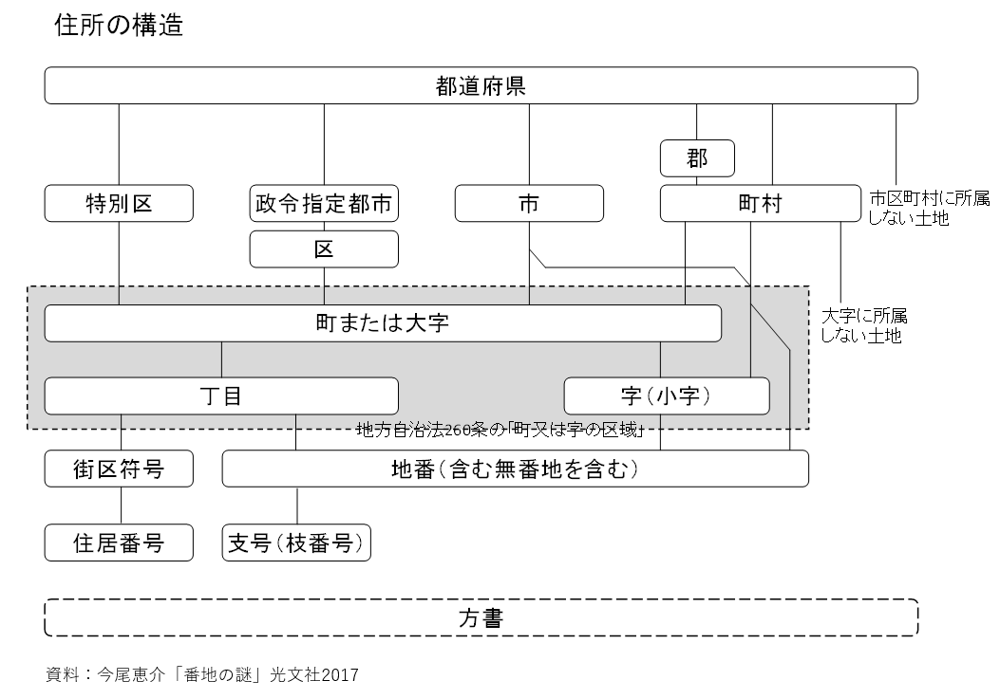

# コアデータパーツ 住所（アドレス） <!-- omit in toc -->

デジタル社会推進実践ガイドブック DS-442

2022年（令和4年）3月31日

デジタル庁

-----
**[キーワード]**

住所、アドレス、町字、番地、丁目、データ形式

**[概要]**

円滑なデータ連携を行うには、データが共通の形式で整えられていることが必要です。本書はコアデータモデルを対象に、住所のデータ形式について示すものです。住所のデータ形式は、住所関連の主要省庁及び日本郵便株式会社、およびアドレス・ベース・レジストリのデータ記述方式を参照し、以下のとおりとします。

-----

## 改訂履歴 <!-- omit in toc -->

| 改訂年月日 | 改訂箇所 | 改訂内容 |
|-----|-----|-----|
| 2022年3月31日 | P5, P11, P3 | アドレス・ベース・レジストリによる町字IDの整備に伴い記載を変更 |
| 2022年3月31日 | P3 | アドレス・ベース・レジストリの管理方法に倣い4個のデータ項目で管理する場合を記載 |
|2021年6月4日| P1 | 3個のデータ項目を記述することを推奨と追記 |
|2021年6月4日| P2 | データ区切り位置を町名以降から丁目以降に変更 |
|2021年6月4日| P3等 | 方書を建物名等に変更 |
|2021年6月4日| P4,P5 | 分かち書きの記載内容について、国土地理院の「地名等の英語表記規程」の文面に合わせる |
|2019年4月1日| P4 | 内容の不備について修正 |
|2019年3月28日| - | 初版決定 |
|2017年12月7日| - | α版決定 |

## 目次 <!-- omit in toc -->

- [1. 住所全体をコードを用いて管理する場合（推奨）](#1-住所全体をコードを用いて管理する場合推奨)
  - [1.1. 全国地方公共団体コードと町字IDを使用して管理する場合（推奨）](#11-全国地方公共団体コードと町字idを使用して管理する場合推奨)
  - [1.2. 全国地方公共団体コードのみを使用して管理する場合](#12-全国地方公共団体コードのみを使用して管理する場合)
  - [1.3. 郵便番号を用いて管理する場合](#13-郵便番号を用いて管理する場合)
- [2. 住所全体を文字で管理する場合](#2-住所全体を文字で管理する場合)
  - [2.1. 1個のデータ項目で管理する場合](#21-1個のデータ項目で管理する場合)
  - [2.2. ２個のデータ項目で管理する場合](#22-２個のデータ項目で管理する場合)
    - [2.2.1. 町丁目番地号分離](#221-町丁目番地号分離)
    - [2.2.2. 丁目番地号分離](#222-丁目番地号分離)
  - [2.3. 3個のデータ項目で管理する場合](#23-3個のデータ項目で管理する場合)
  - [2.4. 4個のデータ項目で管理する場合](#24-4個のデータ項目で管理する場合)
    - [2.4.1. 町名で分割する場合](#241-町名で分割する場合)
    - [2.4.2. 町字で分割する場合（推奨）](#242-町字で分割する場合推奨)
    - [2.4.3. 住所情報を分割するコンバーターについて](#243-住所情報を分割するコンバーターについて)
  - [2.5. 都道府県や市区町村や番地、号を分離して管理する場合](#25-都道府県や市区町村や番地号を分離して管理する場合)
- [3. 建物名等](#3-建物名等)
- [4. 英語表記](#4-英語表記)
  - [4.1. 基本事項](#41-基本事項)
  - [4.2. 住所表記](#42-住所表記)
  - [4.3. 建物名等](#43-建物名等)
- [5. 解説](#5-解説)
  - [5.1. 住所のデータ表現における字の整理](#51-住所のデータ表現における字の整理)
  - [5.2. 住所のデータ表現における丁目の表記](#52-住所のデータ表現における丁目の表記)
  - [5.3. 住所のデータ表現における号の枝番の表記](#53-住所のデータ表現における号の枝番の表記)
  - [5.4. 住所のデータ表現における番地の前の記号の扱い](#54-住所のデータ表現における番地の前の記号の扱い)
  - [5.5. 番地項目に文字が入る場合の扱い](#55-番地項目に文字が入る場合の扱い)
  - [5.6. 英語住所表記における都道府県名及び市区町村名](#56-英語住所表記における都道府県名及び市区町村名)
  - [5.7. 英語の市区町村名の揺らぎ](#57-英語の市区町村名の揺らぎ)
  - [5.8. 英語住所の表記例](#58-英語住所の表記例)
  - [5.9. 英語表記における政令指定都市の扱い](#59-英語表記における政令指定都市の扱い)

-----
## 1. 住所全体をコードを用いて管理する場合（推奨）

令和４年より一元的な住所情報の管理を目的としたアドレス・ベース・レジストリがデジタル庁によって整備・公開されることから、アドレス・ベース・レジストリとの相互運用性を確保するためコードを用いた管理を推奨します。全国地方公共団体コードおよび町字IDを用いて住所情報を管理することで、表記や定義の揺れを防ぐことができます。

これらのコードやIDはデジタル庁が取りまとめ、各利用者から参照できるように公開していくことを予定しています。

### 1.1. 全国地方公共団体コードと町字IDを使用して管理する場合（推奨）

都道府県から町字までの情報をIDで管理し、番地以下をデータで持ちます。

例）東京都千代田区霞が関二丁目１番6号の場合

| 全国地方公共団体コード | 町字ID | 番地以下 |
|-----|-----|-----|
| 131016 | 0002002 | 1-6 |

表記の際は全国地方公共団体コード、町字IDを変換し、「東京都千代田区霞が関2-1-6」などと表記することで人が判別しやすい形に加工して利用する。

### 1.2. 全国地方公共団体コードのみを使用して管理する場合

全国地方公共団体コードで市区町村までを管理し、町字以下をデータで管理します。一般的な住所データ管理方法です。

表記の時には全国地方公共団体コードを都道府県名、市区町村名に変換して、町字以下の情報と合わせて表示します。

例）東京都千代田区霞が関二丁目１番6号の場合

| 全国地方公共団体コード | 町字以下 |
|-----|-----|
| 131016 | 霞が関2-1-6 |

表記の際はコードを変換した上で結合し「東京都千代田区霞が関2-1-6」などと表記することで人が判別しやすい形に加工して利用する。

### 1.3. 郵便番号を用いて管理する場合

郵便番号で住所の町字までを選択し、丁目以下をデータで持ちます。

例）東京都千代田区霞が関二丁目１番6号の場合

| 郵便番号 | 丁目以下  |
|----------|---------|
| 1000013| 2-1-6   |

表記の際は郵便番号を変換し「東京都千代田区霞が関2-1-6」などと表記することで人が判別しやすい形に加工して利用する。

-----
## 2. 住所全体を文字で管理する場合

住所のデータは、都道府県や番地号等を1個のデータ項目に連結した文字列として記述されていることもありますが、昨今では各種インターネットサービスで郵便番号を使った入力が増えてきており、データ連携の観点からも都道府県、市区町村等の複数のデータ項目に分割することが多くなってきています。特に、郵便番号からの入力の場合、都道府県項目と市区町村と町名までの項目と丁目以下の数字項目を分けることが一般的です。

前述のアドレス・ベース・レジストリによって整備された住所情報との相互運用性を確保するためにも、住所データを文字列で管理する場合については、2.4で示すように4個のデータ項目で表記することを推奨します。4項目で管理することで、前述のコード管理への移行も容易に行うことができます。

現在1個のデータ項目で住所情報を管理しているシステムについても、システム更改時にデータを4個に分割すること、またはさらに進んで住所情報のコード管理まで検討することを推奨します。

### 2.1. 1個のデータ項目で管理する場合

都道府県から番地号までを一つのデータ項目で管理する場合は、以下の規則に従います。

-   都道府県から記述し、「町・字」までかな漢字とする
-   ○支庁、○○郡、大字名の前につく「大字」の文字、字の前につく「字」の文字は、省略可能とする例1
-   「町・大字」に「丁目」が含まれる場合には、「丁目」および「番地・号」以下を半角数字と半角ハイフン区切りとする例2,3
-   「字」がある場合には、「字」までかな漢字、「番地・号」の数字項目以下は半角数字と半角ハイフン区切りとする
-   また、丁目以下に甲乙、いろは、子丑等の記号が含まれる場合には、記号までかな漢字、「番地・号」の数字項目以下は半角数字と半角ハイフン区切りとする例4
-   京都市等のように、通り名を表記する方法も可能とする例5（省略も可能）

例

1. 福島県会津若松市大戸町（大字）高川甲1324
1.  東京都千代田区霞が関二丁目１番6号の場合
    * 東京都千代田区霞が関2-1-6
1. 北海道芦別市北1条1丁目3番地の場合（条丁目制）
    * 北海道芦別市北１条1-3
1. 福島県会津若松市大戸町大字高川甲1324
1. 京都市中京区<u>寺町通御池上る</u>上本能寺前町488

### 2.2. ２個のデータ項目で管理する場合

都道府県から番地号までを住所項目1、住所項目2のように2個のデータ項目で管理する場合は、「1個のデータ項目で管理する場合」の規則に加え、以下の規則に従うこととします。

#### 2.2.1. 町丁目番地号分離

都道府県や市区町村は記入もしくは選択肢で入力し、町字以下を2番目のデータ項目に入力し管理する場合には、以下のとおりとします。

例）東京都千代田区霞が関二丁目１番6号の場合

| 都道府県・市区町村 | 町字以下 |
|--------------------|----------------|
| 東京都千代田区 | 霞が関2-1-6 |

例）福島県会津若松市大戸町大字高川甲1324の場合

| 都道府県・市区町村 | 町字以下 |
|--------------------|----------------|
| 福島県会津若松市 | 大戸町大字高川甲1324 |

#### 2.2.2. 丁目番地号分離

郵便番号等を使って町名までのデータを入力し、丁目以下のデータを入力し管理する場合には、以下のとおりとします。

例）東京都千代田区霞が関二丁目１番6号の場合

| 都道府県・市区町村・町名 | 丁目以下 |
|--------------------------|----------------------|
|東京都千代田区霞が関  | 2-1-6 |

例）福島県会津若松市大戸町大字高川甲1324の場合

| 都道府県・市区町村・町名 | 丁目以下 |
|--------------------------|----------------------|
|福島県会津若松市大戸町大字高川甲  | 1324 |

### 2.3. 3個のデータ項目で管理する場合

都道府県、市区町村を別データ項目として管理する場合、都道府県や市区町村を別データ項目として管理します。都道府県や市区町村は記入又は選択肢で入力し、丁目以下を3番目のデータ項目に入力し管理します。

例）東京都千代田区霞が関二丁目１番6号の場合

| 都道府県 | 市区町村 | 丁目以下 |
|-----|-----|-----|
|東京都| 千代田区霞が関 | 2-1-6 |

### 2.4. 4個のデータ項目で管理する場合

#### 2.4.1. 町名で分割する場合

都道府県、市区町村、町名を別データ項目として管理する場合、それぞれを別データ項目として管理します。町名までは記入又は選択肢で入力し、丁目以下を4番目のデータ項目に入力し管理します。

例）東京都千代田区霞が関二丁目１番6号の場合

| 都道府県 | 市区町村 | 町名 | 丁目以下 |
|-----|-----|-----|-----|
|東京都 | 千代田区 | 霞が関 | 2-1-6 |

#### 2.4.2. 町字で分割する場合（推奨）

都道府県、市区町村、丁目含む町字までを別データ項目として管理する場合、それぞれを別データ項目として管理します。町名までは記入又は選択肢で入力し、番地以下を4番目のデータ項目に入力し管理します。

例）東京都千代田区霞が関二丁目１番6号の場合

| 都道府県 | 市区町村 | 町字 | 番地以下 |
|-----|-----|-----|-----|
|東京都 | 千代田区 | 霞が関二丁目 | 1-6 |

「1.3 町字IDを使用して管理する場合」もあわせて参照のこと。全国地方自治体コードと町字IDが特定できている場合、都道府県、市区町村に加え、町字までが特定できます。そのため、入力を省略することが可能となります。

#### 2.4.3. 住所情報を分割するコンバーターについて

住所情報を4個のデータ項目で管理する場合、町名ではなく、「１丁目」のような丁目まで含めた町字での分割を推奨しています。一方で、利用者観点からは町名と町字の境界を判定しづらいというリスクがあります。

例）東京都千代田区紀尾井町１番２号の場合

| 都道府県 | 市区町村 | 町字 | 番地以下 |
|-----|-----|-----|-----|
|東京都 | 千代田区 | 紀尾井町| 1-2 |

上記の例で既存の住所が「紀尾井町1-2」のように保存されている場合、分割の際に利用者は「紀尾井町１丁目」なのか「紀尾井町１番」なのか判別することが難しいというリスクがあります。

こういったリスクがあるため、住所情報を正確に、かつ相互運用性を保つ形式で分割するツール（コンバーター）の提供について、その必要性や開発方針を引き続きデジタル庁で検討を行っていきます。

### 2.5. 都道府県や市区町村や番地、号を分離して管理する場合

住所に関連する情報を最小単位で管理します。

例）東京都千代田区霞が関二丁目１番6号の場合

| 都道府県 | 市区町村 | 町名 | 丁目 | 街区符号 | 番地（住居表示番号または地番） |
|-----|-----|-----|-----|-----|-----|
|東京都 | 千代田区 | 霞が関 | 2 | 1 | 6 |

-----
## 3. 建物名等

建物名などのデータである方書は、現在では建物名というデータ項目名にすることがほとんどであり、方書というデータ項目名は行政業務での利用が中心になっています。よって、データ項目名は、一般的に使用される表記をベースとして「建物名等（方書）」とします。

住所の自動確認を容易にするとともに、利便性向上のために、住所とは別データ項目とします。具体的なデータとしてはビル名など建物名のほか、部屋番号、フロアの名称などをもこの項目に記述します。

部屋番号、フロア名称については将来の配送、不動産取引の際の利便性を考慮して、別項目として分離することも今後検討します。

## 4. 英語表記

### 4.1. 基本事項

住所の英語表記は、国土交通省国土地理院が定める「地名等の英語表記規程」（平成28年国地達第10号）の表記方法に準ずる。必要に応じて、「観光立国実現に向けた多言語対応の改善・強化のためのガイドライン」（平成26年3月国土交通省観光庁）を参照します。

ヘボン式ローマ字を用いることとし、以下の規則に従うこと。

-   はねる音「ん」は、「n」と書く　
-   はねる音をあらわす「n」と、次に来る母音字又は「y」を切り離す必要がある場合には、「n」の次にハイフンを入れる
-   つまる音は、次の音節の最初の子音字を重ねて表す。ただし、次に「ch」音がくる場合には「c」を重ねず「t」を用いる
-   長音を表す記号は、省略することを原則とします。 ただし、50音の「い」段の長音は、「i」を重ねて表し、「えい」は「ei」と書く
-   表音のローマ字表記が「ou」「oo」「uu」となるときに、対応する元の漢字が一文字の場合にはそれぞれ「o」「o」「u」に短縮するが、二文字に分かれる場合には短縮しない。ただし、短縮する表記が通用している場合に は、短縮してもよい

地名等の解釈又は発音の便宜上必要なときは、分かち書き（語の区切りに空白を挟んで記述すること）を行うことができることとします。

地名の解釈で区切る場合には、ハイフンを用いて区切るものとします。ただし、分かち書きしなくても誤解のない場合や、短い地名等の場合は除きます。区切る箇所は、次の各号のとおりとします。一号及び二号の場合は、ハイフンの後ろの最初の文字を大文字にするものとします。

* 一 複合地名における地域名称等の後
* 二 東、西、南及び北並びに上、中及び下並びに新、旧及び元など他の地名と相対的な関係を表す接頭語の後
* 三 地形を表す部分の前

発音の便宜上区切る場合には、ハイフンを用いて区切るものとします。ただし、広く使用されているなど、分かち書きしなくても誤解のない場合は除きます。

### 4.2. 住所表記

日本語のデータ項目に準じて町名などのデータを個別のデータ項目とすることを推奨しますが、一行で記述する場合には以下のように記述します。ただし、市区町村名等、コードを使って自動入力できる項目もあります。自治体から住所表記についてガイドライン等が公開されている場合は、そちらを優先します。

* 基本形
  * 数字表記(丁目を含む。), 町名, 市区町村, 都道府県 郵便番号, Japan
  * 例
    * 2-1-2 Kasumigaseki, Chiyoda-ku, Tokyo 1008926, Japan
* 政令指定都市の場合
  * 数字表記(丁目を含む。), 町名, 区, 政令指定都市 (, 都道府県), 郵便番号, Japan
  * 例
    * 1-1 Minato-cho, Naka-ku, Yokohama-shi, Kanagawa 2310017, Japan
    * 1-1 Minato-cho, Naka-ku, Yokohama-shi, 2310017, Japan
* 条丁目制を採用している場合
  * 数字表記(条丁目を含む。), (町名), 市区町村, 都道府県 郵便番号, Japan
  * 例
    * Kita 1 Higashi 1-3, Ashibetsu-shi, Hokkaido 0758711, Japan
* 条丁目制を採用している場合（政令指定都市）
  * 数字表記(条丁目を含む。), 区, 政令指定都市 (, 都道府県), 郵便番号, Japan
  * 例
    * Kita 1 Nishi 2-1-1, Chuo-ku, Sapporo-shi 060-8611, Japan
* 全体ルール
  -   丁目以下は半角数字表記としハイフンで接続する
  -   数字表記の後ろに半角スペースを置き、後ろの町名との間を分ける
  -   町名、市区町村名、都道府県名は、先頭文字を大文字、その他の文字を小文字で記入する
  -   町名、市区町村名、都道府県名の間は、半角カンマ「,」と半角スペースにより区切る
  -   数字表記と町名の間、都道府県名と郵便番号の間は、半角スペースで区切る
  -   郵便番号は7桁連続とし、ハイフンによる区切りは使わない
  -   郵便番号の後にJapanを書く場合には、郵便番号とJapanの間を半角カンマ「,」と半角スペースにより区切る
  -   市区町村名は、各自治体固有部分の後に「-shi」「-ku」「-machi」「-cho」「-mura」「-son」をつける
  -   都府県は、固有自治体名のみ記入し「-to」「-fu」「-ken」は記述しない。北海道は「Hokkaido」と記入する
  -   政令指定都市の場合、数字項目、町名、区名、政令指定都市名を記入し、政令指定都市名の後ろに半角カンマ「,」と半角スペースにより区切り都道府県名を記入します。半角スペースを空け、郵便番号7桁を区切りなしで記入します。ただし、政令指定都市名は、都道府県名を省略することも可能です

### 4.3. 建物名等

基本的に、住所と別データ項目で記載します。住所の数字項目の前の先頭に記入し、半角カンマ「,」と半角スペースにより区切ります。

例）

2nd Bldg. of the Central Common Government Office,

2-1-2 Kasumigaseki, Chiyoda-ku, Tokyo 100-8926, Japan

-----
## 5. 解説

### 5.1. 住所のデータ表現における字の整理

住所は、「都道府県」「支庁」「郡」「市区町村」「政令指定都市」「区」「町村」「町・大字」「丁目・字」「番地・号」、「地域自治区」で構成され、さらに「建物名等」を使用します。

※地方自治法（昭和22年法律第67号）第260条に「字」の新設や廃止に関する条項があるが字の定義はない。住居表示に関する法律においても字の定義はない。

本標準では、アドレス・ベース・レジストリによって「町」「大字」「丁目」「字」までの範囲が「町字」として整理され、地方自治体ごとにユニークなIDを振って管理が開始されることから、相互運用性を加味して同じ範囲を「町字」として分類しています。

<figure>

<figcaption>
</figcaption>
</figure>

### 5.2. 住所のデータ表現における丁目の表記

公文書において「丁目」は漢数字で記載されることが多いですが、社会的には丁目以下を数字で管理することが一般的であり、英語等でも数字で表記することから、本標準においては、丁目以下を分離して管理する場合は半角数字と半角ハイフン区切りで記述することを基本とします。

* 例
  * 東京都千代田区霞が関2-1-2

### 5.3. 住所のデータ表現における号の枝番の表記

不動産登記事務取扱手続き準則に基づき、土地分割等により号に枝番号を使う場合には、以下のとおり番地に追記します。

丁目-番地-号（枝番含む）

* 例
  * 一丁目1番地1-1号
    * 1-1-1-1

集合住宅において住所の号の後にハイフンで部屋番号を記入する場合がありますが、本標準では集合住宅名や部屋番号は建物名等のデータ項目として分けて管理します。

* 例
  * 一丁目1番地1号〇〇住宅1号室
    * 1-1-1
    * 〇〇住宅
  * 一丁目1番地1号〇〇住宅A棟101号室
    * 1-1-1
    * 〇〇住宅A-101

### 5.4. 住所のデータ表現における番地の前の記号の扱い

番地の前に、甲乙、いろは、子丑等の記号が含まれる場合には、字の一部として扱います。

### 5.5. 番地項目に文字が入る場合の扱い

番地項目に「番外地」「地先」等の文字が入る場合には、例外として扱います。

### 5.6. 英語住所表記における都道府県名及び市区町村名

国土地理院「地名等の英語表記規程」では、都道府県名及び市区町村名でPrefectureやCityの英語区分を使用することとしています。住所表記においては、一般的に使用される「-shi」等の表音によるルールに従うこととします。

### 5.7. 英語の市区町村名の揺らぎ

英語の地名の表記は以下の例に示すとおり、府省や組織により異なる場合がありますが、住所表記においては、「地名等の英語表記規程」に準拠します。

例）御殿場の場合

* 国土交通省土地総合情報システム
  * Gotenba
* 国土地理院地名集日本2007
  * Gotenba
* 総務省国勢調査（地域一覧）
  * Gotemba
* 御殿場警察署
  * Gotenba
* 御殿場駅
  * Gotemba
* 御殿場インターチェンジ
  * Gotenba

### 5.8. 英語住所の表記例

英語住所の表記法は、住所表記関連組織が自組織の住所を記述している方法を参考にします。

* 日本郵便WebサイトCorporate Information
  * 100-8798　1-3-2 Kasumigaseki, Chiyoda-ku, Tokyo
* 日本郵便Webサイト（グループ会社紹介ページ）
  * 1-16-2 Nishi-Shinbashi, Minato-ku, Tokyo 105-0003
* 国土交通省Webサイト
  * 2-1-3 Kasumigaseki, Chiyoda-ku, Tokyo 100-8918
* 総務省Webサイト
  * 1-2 Kasumigaseki 2-chome, Chiyoda-ku. Tokyo 100-8926, Japan
* 総務省Webサイト（アクセス（PDF））
  * 2nd Bldg. of the Central Common Government Office, 2-1-2, Kasumigaseki, Chiyoda-ku, Tokyo 100-8926, Japan
* 国土地理院
  * Kudan Daini Government Building, 1-1-15, Kudanminami, Chiyoda-ku, Tokyo 102-0074

### 5.9. 英語表記における政令指定都市の扱い

政令指定都市の英語名の記載では、ほとんどの都市が都道府県名を省略しているため、本標準でも都道府県名は省略可能とします。

-----