# 実装データモデル（行政） 申請・届出 <!-- omit in toc -->

デジタル社会推進実践ガイドブック DS-451-1

2022年（令和4年）3月31日

デジタル庁

-----
**[キーワード]**

個人、法人、申請、届出、報告、自動審査

**[概要]**

行政機関で申請・届出手続に関するシステムを作る場合に参照すべき実践的ガイド。このガイドに従いデータ設計を行うことで、既提出データやベース・レジストリを再利用するワンスオンリーや、ワンストップサービスにおける他機関とのデータ交換や自動審査が容易かつ正確に行えるようになります。また、データ設計に関するコストの削減や、行政機関に対する報告への活用も可能です。

-----

## 改訂履歴 <!-- omit in toc -->

| 改訂年月日    | 改訂箇所 | 改訂内容   |
|---------------|----------|------------|
| 2022年3月31日 | 全体     | 正式版決定 |
| 2021年6月4日  | -       | β版公開    |

## 目次 <!-- omit in toc -->
- [1. 背景と課題](#1-背景と課題)
  - [1.1. 背景](#11-背景)
  - [1.2. 課題](#12-課題)
  - [1.3. 投資対効果](#13-投資対効果)
- [2. 目的と概要](#2-目的と概要)
  - [2.1. 目的](#21-目的)
  - [2.2. 概要](#22-概要)
    - [2.2.1. 個人の場合](#221-個人の場合)
    - [2.2.2. 法人の場合](#222-法人の場合)
  - [2.3. 委任する場合](#23-委任する場合)
    - [2.3.1. 個人への委任](#231-個人への委任)
    - [2.3.2. 法人への委任](#232-法人への委任)
  - [2.4. 申請データの再利用](#24-申請データの再利用)
  - [2.5. 届出・報告での活用](#25-届出報告での活用)
- [3. 個人用データモデル](#3-個人用データモデル)
  - [3.1. データモデルの全体概要図（クラス図）](#31-データモデルの全体概要図クラス図)
  - [3.2. 概要](#32-概要)
    - [3.2.1. A票：個人申請基本情報](#321-a票個人申請基本情報)
    - [3.2.2. B票：申請内容](#322-b票申請内容)
- [4. 法人用データモデル](#4-法人用データモデル)
  - [4.1. データモデルの全体概要図（クラス図）](#41-データモデルの全体概要図クラス図)
  - [4.2. 概要](#42-概要)
    - [4.2.1. A票：法人申請基本情報](#421-a票法人申請基本情報)
    - [4.2.2. B票：申請内容](#422-b票申請内容)
    - [4.2.3. C票：財務情報（今後、決算公告データ標準化に合わせて変更予定）](#423-c票財務情報今後決算公告データ標準化に合わせて変更予定)
    - [4.2.4. D票：役員一覧](#424-d票役員一覧)
    - [4.2.5. E票：主要株主](#425-e票主要株主)
    - [4.2.6. F票：事業所一覧](#426-f票事業所一覧)
- [5. 士業法人用データモデル](#5-士業法人用データモデル)
  - [5.1. データモデルの全体概要図（クラス図）](#51-データモデルの全体概要図クラス図)
  - [5.2. 概要](#52-概要)
    - [5.2.1. A票：法人申請基本情報](#521-a票法人申請基本情報)
    - [5.2.2. B票：申請内容](#522-b票申請内容)
    - [5.2.3. C票：財務情報（今後、決算公告データ標準化に合わせて変更予定）](#523-c票財務情報今後決算公告データ標準化に合わせて変更予定)
    - [5.2.4. D票：役員一覧](#524-d票役員一覧)
    - [5.2.5. E票：主要株主](#525-e票主要株主)
    - [5.2.6. F票：事業所一覧](#526-f票事業所一覧)
    - [5.2.7. G票：資格保有者（従業員）一覧](#527-g票資格保有者従業員一覧)
- [6. データモデルの活用イメージ](#6-データモデルの活用イメージ)
  - [6.1. 機能イメージ](#61-機能イメージ)
    - [6.1.1. 自動入力](#611-自動入力)
    - [6.1.2. ワンストップ](#612-ワンストップ)
    - [6.1.3. 自動照合](#613-自動照合)
  - [6.2. サービスイメージ](#62-サービスイメージ)
    - [6.2.1. 個人向け](#621-個人向け)
    - [6.2.2. 法人向け](#622-法人向け)
- [7. 解説](#7-解説)
  - [7.1. 個人向けデータ標準](#71-個人向けデータ標準)
  - [7.2. 法人向けデータ標準](#72-法人向けデータ標準)
- [8. 付録](#8-付録)

-----
## 1. 背景と課題

### 1.1. 背景

デジタル手続法が2019年5月に制定され、「デジタルファースト」「ワンスオンリー」「ワンストップ」サービスの実現を強力に推し進めることとなりました。

<figure>
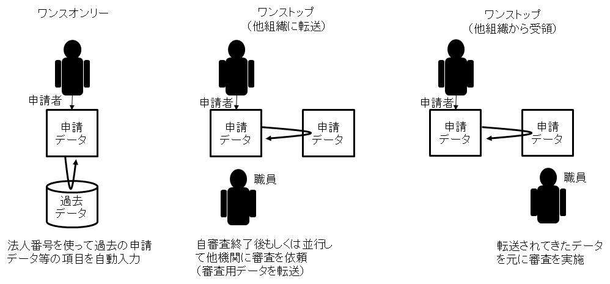
<figcaption>
図 1　ワンスオンリー、ワンストップの概要
</figcaption>
</figure>

ワンスオンリーとワンストップを実現するためには、組織間で円滑なデータ連携ができるよう、データ項目の標準化が必要となります。過去の情報やベース・レジストリを参照するとき、他の機関に情報を転送するときには、データを連携するための標準的なデータモデルが必要です。

また、申請時に申請内容を証明するために、住民票や印鑑証明書などに代表される証明情報を添付することが多くありますが、これまでは申請情報と証明情報を目視で照合してきました。こうした照合方法では個人差による照合結果に違いが生じることがあり、また、処理できる件数にも課題があります。デジタルファーストの推進のためには、申請情報の標準化に合わせて、証明情報についてもデータの標準化を行うことが必要です。これにより、申請情報と証明情報の照合・審査を機械的に処理できるようになり、より人がすべき業務に人的リソースを再配置することが可能になります。

### 1.2. 課題

デジタル技術の発展によりオンライン申請が可能になったにもかかわらず、行政においては、現在も多くの業務で紙による申請が行われています。編集可能な申請書式ファイルの提供やフォームでのオンライン申請等が徐々に実装されつつありますが、オンライン申請にした場合にも、従来の個人・法人が行う申請には以下の課題があり、時間と手間がかかっていました。

* 利用者にとっての課題
     * 申請毎に同じ内容の入力を求められる
     * 申請毎に書式や項目が異なっている
     * 後援名義使用許可のように複数部署に同じ内容の書類を出すのに、書式や提出内容が違うことがある
     * 多くの添付書類を求められる
     * 入力間違いなどにより差戻しが発生する
     * 申請処理時間が長く、処理状況がわからない
* 行政職員にとっての課題
     * 入力内容の間違いや書類不備による差戻しがあった
     * 既に行政が保有する情報と提出した情報が一致せず差戻しが起こる
     * 部署を移動すると、類似の申請であっても書式や申請項目が異なることが多い
     * 申請内容を添付書類で目視確認する必要があり、負担感がある
     * 申請や証明データの活用が十分にできていなかった

オンラインで申請するときには、本人確認と申請料等の支払が課題になる場合があります。本人確認と支払は専門性が高いことから、別途、内閣官房のデジタル・ガバメント推進標準ガイドライン群で提供又は今後提供されるガイド等を参照してください。

### 1.3. 投資対効果

申請者はこれまで、申請書に手書き、又は、ワープロなどを使用して申請書を作成していました。申請の手続毎に申請内容は異なるものの、法人名や所在地等の共通的な情報の記入を繰り返し求められることがあり、申請書の送付などにも時間を要していました。

一度提出された情報を再利用するワンスオンリーを適用すれば、こうしたことを効率化できます。

例えば、1枚の申請書類を作成するのに毎回ほとんど変わらない基本情報の記入に30分かかっていたとして、過去データの再利用が可能になれば、表示された過去データを確認するだけで済むため2-3分で済み、約1/10に業務時間を削減することができます。

ワンスオンリーは申請を受領する側にとってもメリットがあります。データ項目を細分化して登録しておくことで、単純な入力間違いなどを機械的に修正できるようになります。また、データ項目を細分化しておくことで、地域や産業、人口等といった様々な観点でデータを分析できるようになり、エビデンスに基づく政策立案（EBPM）の実現や、新たな価値を生み出すことが期待できます。

-----
## 2. 目的と概要

### 2.1. 目的

各種申請・届出に必要な情報のデータ形式を標準化し、マスタデータとして蓄積します。それを活用することで申請者の手間の大幅な削減や、審査の自動化等を通じて審査時間の短縮等の内部業務を効率化・高度化するとともに、申請データと資格等の証明データを機械的に照合できるようにし、職員の作業時間を抜本的に短縮させ、データの分析による政策立案の高度化を目指します。

これらを通じて、申請者の利便性の向上と、職員の生産性の向上、審査の高度化を実現します。

### 2.2. 概要

#### 2.2.1. 個人の場合

申請情報を2つの書式に分け、書式を定義しています。

<figure>
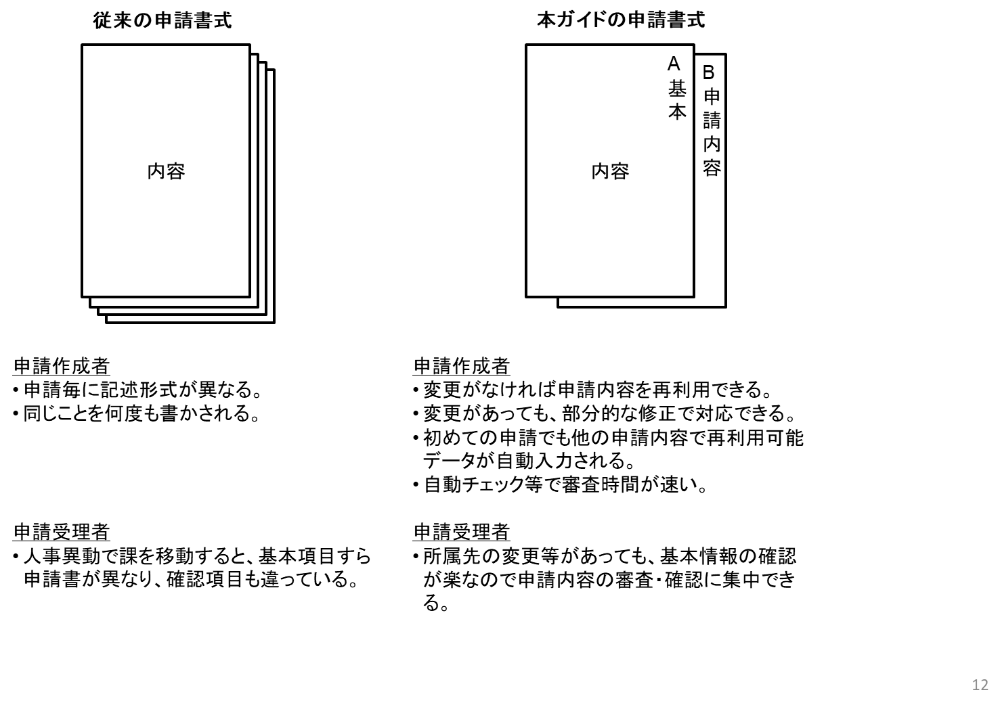
<figcaption>
図 2　申請書式の基本構成（個人）
</figcaption>
</figure>

A票は定型フォーム化することで、情報の再利用性を高めています。また、別途ガイド化されている資格証明データモデルとリンクすることにより資格の確認も容易に行うことができます。

このように定型審査を容易にすることで、職員はB票にある申請内容の確認に集中して取り組むことができます。申請内容に関するB票は、事業目的に応じて各部門が独自に設定可能です。タイトル、概要等の基本情報だけが設定されており、事業の審査内容等に応じて自由に設定可能になっています。

<figure>
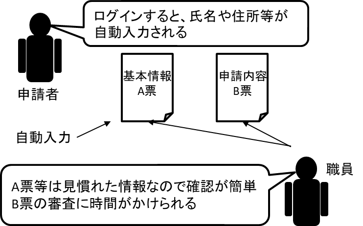
<figcaption>
図 3　利用イメージ（個人）
</figcaption>
</figure>

申請終了後、A票のデータは、次回以降のワンスオンリーサービスで活用可能なように、申請システム等に保存されます。

#### 2.2.2. 法人の場合

申請情報を6つの書式に分け、書式を定義しています。

<figure>
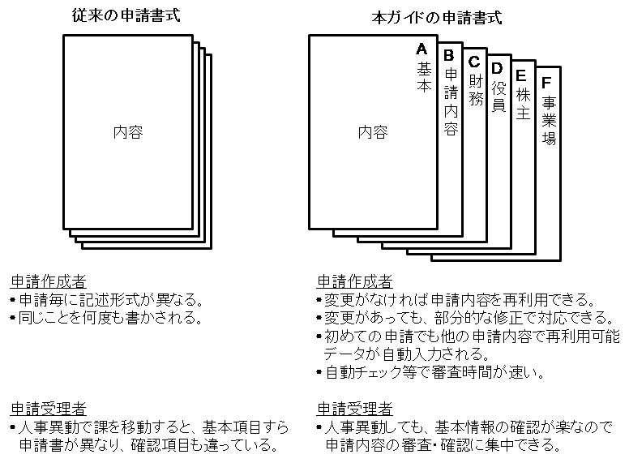
<figcaption>
図 4　申請書式の基本構成（法人）
</figcaption>
</figure>

A票及びC-F票は定型フォーム化することで、情報の再利用性を高めています。財務情報や社員数による分析などは自動化、半自動化が可能になります。

このため、職員はB票にある申請内容の確認に集中して取り組むことができます。申請内容に関するB票は、事業目的に応じて各部門が独自に設定可能で、タイトル、概要等の基本情報だけが設定されており、事業の審査内容等に応じて自由に設定することが可能になっています。

<figure>
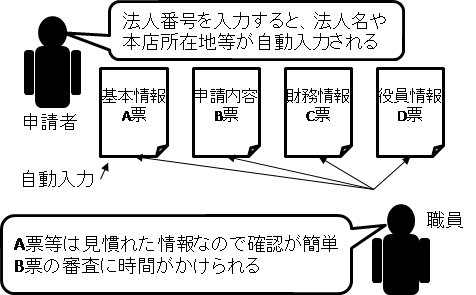
<figcaption>
図 5　利用イメージ（法人）
</figcaption>
</figure>

申請終了後、A票及びC-F票のデータは、次回以降のワンスオンリーサービスで活用可能なように、申請システム等に保存されます。

また、月次等の定期的な計測データ報告の場合にも、B票に表を含む、又はデータを添付することで報告を効率的に行うことができます。

申請システム等が既存のシステムであり、再利用のために保全できない場合にも、申請者が手元に申請データの複写を保存し、次回の申請時に再利用することも可能です。

法人の申請・届出において、士業法人から申請・届出がされる場合があります。その場合には、役員情報に資格情報が必要になり、さらに資格保有者一覧の添付が求められるため、7書式のデータが必要になります。基本的には一般の法人と同じ申請・届出データで追加項目があるため、法人の申請・届出情報を拡張して申請・届出のデータモデルを定義します。

### 2.3. 委任する場合

委任をする場合は、A票の最後に委任情報を付加します。委任先は個人の場合と法人の場合があるため、役割と連絡先情報を組み合わせて表現します。

#### 2.3.1. 個人への委任

|   |   |
|---|---|
| 役割 | 委任先の役割や本人との関係性 |
| 委任内容 | 委任する内容 |
| 委任先個人 | 委任先個人に関する情報（コアデータモデル個人型） |
| 委任先個人連絡先 | 委任先個人の連絡先情報（コアデータモデル個人連絡先型） |

#### 2.3.2. 法人への委任

|   |   |
|---|---|
| 役割 | 連絡先の役割 |
| 委任内容 | 委任する内容 |
| 委任先法人 | 委任先法人に関する情報（コアデータモデル法人型） |
| 委任先法人連絡先 | 委任先法人の連絡先情報（コアデータモデル法人連絡先型） |

### 2.4. 申請データの再利用

A票及びC-F票のデータは、提出時に次回以降も再利用を希望するかを利用者に確認すること（オプトイン）により、次回以降ワンスオンリーサービスで使用するかの選択を可能にします。

以下のイメージとなります。

<figure>
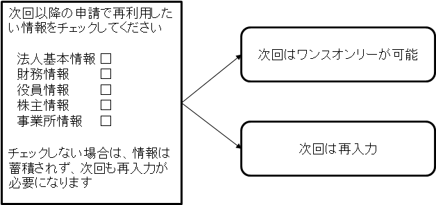
<figcaption>
図 6　再利用確認のイメージ
</figcaption>
</figure>

申請者に、再利用するときのメリット等を明記することが重要です。

### 2.5. 届出・報告での活用

行政の手続には届出や報告もあります。その場合にもこのデータモデルが活用可能です。B票の申請内容を、届出や報告の内容にします。定期報告では、表などのデータのみになる場合もあります。

-----
## 3. 個人用データモデル

### 3.1. データモデルの全体概要図（クラス図）

申請（個人）の実装データモデルの全体概要図は以下のとおりです。

<figure>
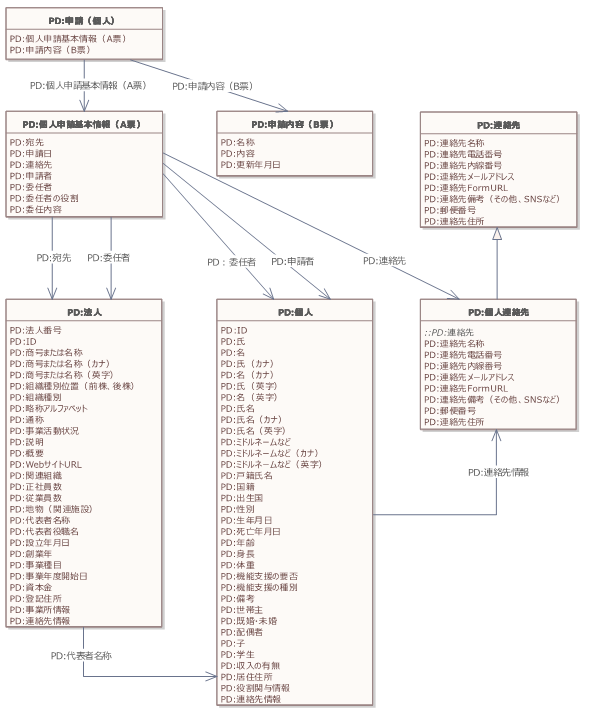
<figcaption>
図7 申請（個人）データモデルの全体概要図（クラス図）
</figcaption>
</figure>

### 3.2. 概要

個人から行政機関等に提出される申請データモデルです。本申請のデータモデルは、以下の2書式で構成されます。

<figure>
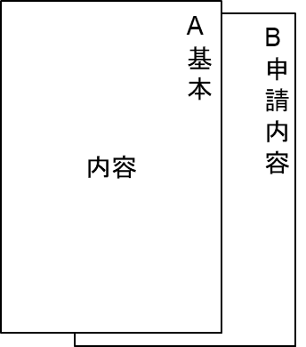
<figcaption>
</figcaption>
</figure>

※委任情報データが付く場合があります

#### 3.2.1. A票：個人申請基本情報

| 必須項目 | 項目名 | 説明 |
|---------|--------|-----|
| 必 | 宛先 | 申請の宛先。コアデータモデル「法人」を参照。 |
| 必 | 申請日 | 申請書の提出日（西暦年月日とし、半角数字をハイフンでつなぐ、YYYY-MM-DD形式） |
| 必 | 連絡先 | 連絡先情報。コアデータモデル「個人連絡先」を参照。 |
| 必 | 申請者 | 申請者の情報。コアデータモデル「個人」を参照。 |
|    | 委任者 | 委任者の情報。コアデータモデル「個人」又は「法人」を参照。 |
|    | 委任者の役割 | 委任先の役割や申請者との関係性 |
|    | 委任内容 | 委任する内容 |

#### 3.2.2. B票：申請内容

| 必須項目 | 項目名 | 説明 |
|---------|--------|------|
| 必 | 名称 | 申請内容のタイトル |
| 必 | 内容 | 申請内容 |
|    | 更新年月日 | 申請内容の更新日（西暦年月日で、半角数字をハイフンでつなぐ）初回の場合は申請日 |

-----
## 4. 法人用データモデル

### 4.1. データモデルの全体概要図（クラス図）

申請（法人）の実装データモデルの全体概要図は以下のとおりです。

<figure>
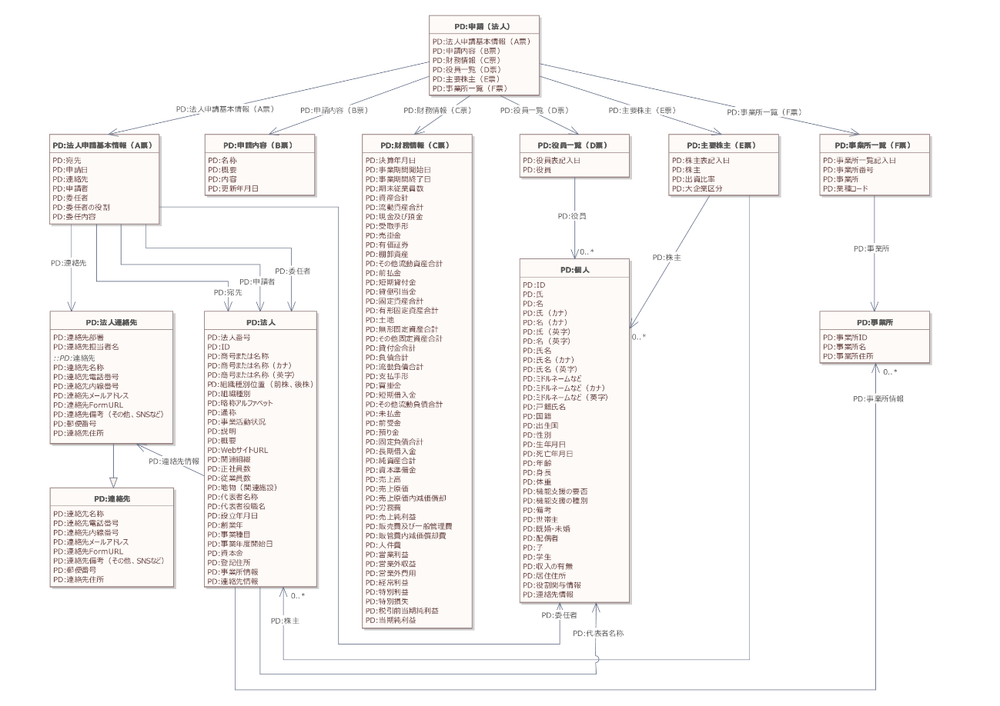
<figcaption>
図8 申請（法人）データモデルの全体概要図（クラス図）
</figcaption>
</figure>

### 4.2. 概要

法人から、行政機関等に提出される申請データモデルです。本申請データモデルは、以下の6書式で構成されます。

<figure>
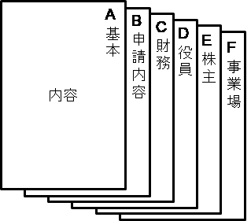
<figcaption>
</figcaption>
</figure>

※委任情報データが付く場合があります

#### 4.2.1. A票：法人申請基本情報

| 必須項目 | 項目名 | 説明 |
|---------|--------|-----|
| 必 | 宛先 | 宛先情報。コアデータモデル「法人」を参照。 |
| 必 | 申請日 | 申請書の提出日（西暦年月日とし、半角数字をハイフンでつなぐ、YYYY-MM-DD形式） |
| 必 | 連絡先 | 連絡先情報。コアデータモデル「法人連絡先」を参照。 |
| 必 | 申請者 | 申請者の情報。コアデータモデル「法人」を参照。 |
|    | 委任者 | 委任者の情報。コアデータモデル「個人」又は「法人」を参照。 |
|    | 委任者の役割 | 委任先の役割や申請者との関係性 |
|    | 委任内容 | 委任する内容 |

#### 4.2.2. B票：申請内容

| 必須項目 | 項目名 | 説明 |
|---------|--------|-----|
| 必 | 名称 | 申請内容のタイトル |
| 必 | 概要 | 申請内容の概要 |
|    | 内容 | 申請内容 |
|    | 更新年月日 | 申請内容の更新日（西暦年月日とし、半角数字をハイフンでつなぐ） |

#### 4.2.3. C票：財務情報（今後、決算公告データ標準化に合わせて変更予定）

| 必須項目 | 項目名 | 説明 |
|---------|--------|------|
|    | 決算年月日 | 決算日（西暦年月日とし、半角数字をハイフンでつなぐ） |
|    | 事業期間開始日 | 決算を行った事業期間の開始日（西暦年月日とし、半角数字をハイフンでつなぐ） |
|    | 事業期間終了日 | 決算を行った事業期間の終了日（西暦年月日とし、半角数字をハイフンでつなぐ） |
|    | 期末従業員数 | 常時雇用する従業員の期末における人数 |
|    | 資産合計 | 流動資産、固定資産、繰延資産の合計 |
|    | 流動資産合計 | 流動資産の合計 |
|    | 現金及び預金 | 現金と預金（当座、定期）の合計 |
|    | 受取手形 | 売上債権のうち手形として保有している額  |
|    | 売掛金 | 売上債権のうち手形として保有していない額 |
|    | 有価証券 | 有価証券の合計  |
|    | 棚卸資産 | 販売目的で一時的に保有する商品・製品・原材料・仕掛品の合計 |
|    | その他流動資産合計 | 前払金、短期貸付金、貸倒引当金などの流動資産の合計 |
|    | 前払金 | 商品を受け取る前に代金を先払いした額  |
|    | 短期貸付金 | 決算日の翌日から起算して1年以内に回収される貸付金の合計 |
|    | 貸倒引当金 | 貸倒損失になるかもしれない額 |
|    | 固定資産合計 | 固定資産の合計 |
|    | 有形固定資産合計 | 建物、機械装置、土地などの有形固定資産の合計 |
|    | 土地 | 土地の合計 |
|    | 無形固定資産合計 | ソフトウェア、のれんなどの無形固定資産の合計 |
|    | その他固定資産合計 | 投資、長期貸付金、長期前払費用、関係会社株式などの固定資産の合計 |
|    | 貸付金合計 | 長期貸付金と短期貸付金の合計 |
|    | 負債合計 | 流動負債、固定負債の合計 |
|    | 流動負債合計 | 流動負債の合計 |
|    | 支払手形 | 営業取引によって生じた手形債務 |
|    | 買掛金 | 営業取引によって生じた未払金 |
|    | 短期借入金 | 借入金で１年以内に期限の到来するもの |
|    | その他流動負債合計 | 未払金、前受金、預り金などの合計 |
|    | 未払金 | 通常の取引に関連して発生した未払金 |
|    | 前受金 | 営業収益の前受額 |
|    | 預り金 | 後日預かった者又は第三者対して支払うべきもの |
|    | 固定負債合計 | 固定負債の合計 |
|    | 長期借入金 | 到来期限が1年以上の借入金 |
|    | 純資産合計 | 資産から負債を引いた額 |
|    | 資本準備金 | 資本準備金 |
|    | 売上高 | 製品・商品等の売上高 |
|    | 売上原価 | 製品・商品等の原価 |
|    | 売上原価内減価償却費 | 製品・商品の製造に関わる減価償却実施額 |
|    | 労務費 | 製造に関わる人件費・労務費 |
|    | 売上総利益 | 売上高から売上原価を引いた額 |
|    | 販売費及び一般管理費 | 販売費及び一般管理費計 |
|    | 販管費内減価償却費 | 営業に関わる減価償却実施額 |
|    | 人件費 | 従業員給料、役員報酬などの合計 |
|    | 営業利益 | 売上総利益から販売費及び一般管理費を引いた額 |
|    | 営業外収益 | 主に金融活動に伴う収益 |
|    | 営業外費用 | 主に金融活動に伴う費用 |
|    | 経常利益 | 本業と本業以外の損益の合計 |
|    | 特別利益 | 資産売却益、為替差益等 |
|    | 特別損失 | 資産評価損・処分損、為替差損等 |
|    | 税引前当期純利益 | 税引前の当期利益額 |
|    | 当期純利益 | 税引前当期純利益から法人税等を引いた額 |

#### 4.2.4. D票：役員一覧

| 必須項目 | 項目名 | 説明 |
|---------|--------|------|
|    | 役員表記入日 | 役員表の記入日（西暦年月日とし、半角数字をハイフンでつなぐ） |
|    | 役員 | 役員の情報。コアデータモデル「個人」を参照。 |

#### 4.2.5. E票：主要株主

| 必須項目 | 項目名 | 説明 |
|---------|--------|------|
|    | 株主表記入日 | 株主表の記入日（西暦年月日とし、半角数字をハイフンでつなぐ） |
|    | 株主 | 株主の情報。コアデータモデル「個人」又は「法人」を参照。 |
|    | 出資比率 | 出資比率（%）を数字のみ記入 |
|    | 大企業区分 | 株主が大企業の場合に「大企業」と記入 |

#### 4.2.6. F票：事業所一覧

| 必須項目 | 項目名 | 説明 |
|---------|--------|------|
|    | 事業所一覧記入日 | 事業所一覧の記入日（西暦年月日とし、半角数字をハイフンでつなぐ） |
|    | 事業所番号 | ※今後検討 |
|    | 事業所 | 事業所の情報。コアデータモデル「事業所」を参照。 |
|    | 業種コード | 事業所の業種をコードで表現したもの（日本標準産業分類の大分類で2桁） |

-----
## 5. 士業法人用データモデル

### 5.1. データモデルの全体概要図（クラス図）

申請（士業法人）の実装データモデルの全体概要図は以下のとおりです。

<figure>
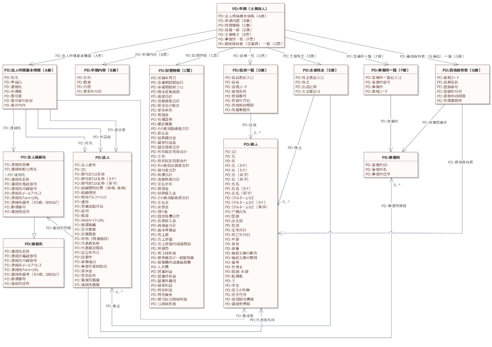
<figcaption>
図9 申請（士業法人）データモデルの全体概要図（クラス図）
</figcaption>
</figure>

### 5.2. 概要

士業法人は、資格保有者の一覧が必要になるなど、一般的な法人とデータ項目が異なります。法人用データの役員一覧であるD票を拡張するとともに、資格保有者情報のG票を追加し、以下の7書式でデータモデルは構成されます。

<figure>
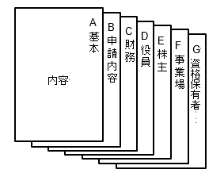
<figcaption>
</figcaption>
</figure>

#### 5.2.1. A票：法人申請基本情報

法人用データモデルを使用します。

#### 5.2.2. B票：申請内容

法人用データモデルを使用します。

#### 5.2.3. C票：財務情報（今後、決算公告データ標準化に合わせて変更予定）

法人用データモデルを使用します。

#### 5.2.4. D票：役員一覧

| 必須項目 | 項目名 | 説明 |
|---------|--------|------|
|    | 役員表記入日 | 役員表の記入日（西暦年月日とし、半角数字をハイフンでつなぐ） |
|    | 役員 | 役員の情報。コアデータモデル「個人」を参照。 |
|    | 資格コード | ※今後検討 |
|    | 資格名称 | 資格名 |
|    | 登録番号 | 資格を所管する団体が発行する資格者を識別するための番号 |
|    | 登録年月日 | 資格を取得（登録）した年月日（西暦年月日とし、半角数字をハイフンでつなぐ） |
|    | 資格有効期限 | 資格保有有効期限日（西暦年月日とし、半角数字をハイフンでつなぐ） |
|    | 所属事業所 | 資格保有者が主に勤務する事業所の情報。コアデータモデル「事業所」を参照。 |

#### 5.2.5. E票：主要株主

法人用データモデルを使用します。

#### 5.2.6. F票：事業所一覧

法人用データモデルを使用します。

#### 5.2.7. G票：資格保有者（従業員）一覧

| 必須項目 | 項目名 | 説明 |
|---------|--------|------|
|    | 資格コード | ※今後検討 |
|    | 資格名称 | 資格名 |
|    | 登録番号 | 資格を所管する団体が発行する資格者を識別するための番号 |
|    | 資格保有者 | 資格保有者の情報。コアデータモデル「個人」を参照。 |
|    | 登録年月日 | 資格を取得（登録）した年月日（西暦年月日とし、半角数字をハイフンでつなぐ） |
|    | 資格有効期限 | 資格保有有効期限日（西暦年月日とし、半角数字をハイフンでつなぐ） |
|    | 所属事業所 | 資格保有者が主に勤務する事業所の情報。コアデータモデル「事業所」を参照。 |

-----
## 6. データモデルの活用イメージ

データモデルを活用した申請のライフサイクルは、以下の流れになります。この中核になるのが申請データで、他の様々なデータとともに活用されます。

<figure>
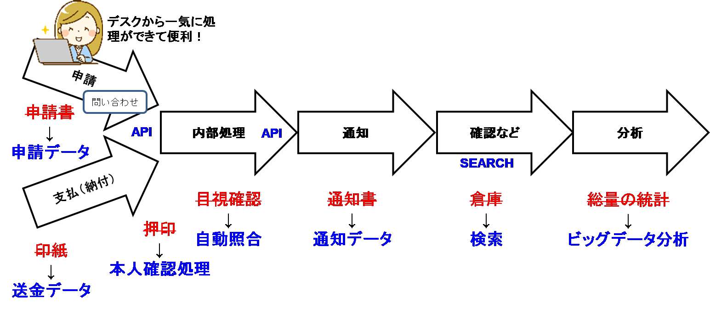
<figcaption>
図 10　申請データの流れ
</figcaption>
</figure>

標準化されたデータモデルを活用することで、メリットとして以下のシナリオが考えられます。

### 6.1. 機能イメージ

#### 6.1.1. 自動入力

A社が電子申請を行う際、ログイン後に以前使用した自社の法人情報が自動的にサイト上に表示され、再度入力する手間をかけずにスムーズに次のステップに進むことができます。

#### 6.1.2. ワンストップ

B社が複数の手続の申請を行う際、わかりやすい共通フォームを使って最低限の入力操作を一か所で行うだけでワンストップ手続が行われるため、多くの時間を費やすことなく全ての申請を完了させることができます。

#### 6.1.3. 自動照合

C社が申請書B票の中に資格情報を記入します。受付システムが、当該資格情報サイトにAPIで自動照合を行うことで確認が行われ、自動的に次の審査に移行することができるようになります。

### 6.2. サービスイメージ

#### 6.2.1. 個人向け

児童手当の場合は、A-B票及び所得の要件など資格情報の組合せで申請が行われています。

次回申請時は、A-B票の内容を確認・修正の上で再提出することが可能になります。また、小児医療証など他の申請を行う場合、A票及び重複する資格情報の提出は不要になります。（ワンスオンリー）

<figure>
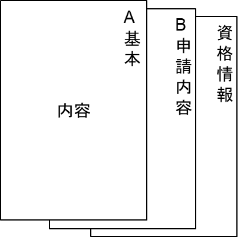
<figcaption>
図 11　申請データの構成例1
</figcaption>
</figure>

#### 6.2.2. 法人向け

法人が行うイベントの後援名義申請の場合は、A-C票及び添付のイベント情報、イベント収支計画の組合せで申請が行われています。（前回のイベントがある場合は、その報告も添付）

同様のイベントを次回申請する場合には、A-C票の内容を確認・修正の上で、新規のイベント情報、収支計画を添付し再提出することが可能になります。前回のイベント終了時に報告済みの場合は報告書の提出は不要になります（ワンスオンリー）。

<figure>
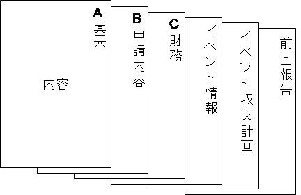
<figcaption>
図 12　申請データの構成例2
</figcaption>
</figure>

-----
## 7. 解説

### 7.1. 個人向けデータ標準

申請データに参照する標準がないため、自治体の様々な申請書の様式を参考に作成しています。

### 7.2. 法人向けデータ標準

申請データに参照する標準がないため、A票及びC-F票のデータは、経済産業省における従来の申請データフォーマットを複数分析し標準化しています。

財務情報を示すB票は、これまでの申請で税務申告書のコピーを添付する場合が多かったことから、税務申告データをベースに項目を選定し、経営分析が可能なように、中小企業庁ローカルベンチマークのデータ項目を付加しています。税務申告データを活用することにより、納税証明書データとの突合で、財務情報の真正性を確認することが可能になります。

-----
## 8. 付録

全体概要図として掲載したクラス図について、大きなサイズのものは別添の以下ファイルを参照してください。

* 451-1-1_申請（個人）データモデル_クラス図.pdf
* 451-1-2_申請（法人）データモデル_クラス図.pdf
* 451-1-3_申請（士業法人）データモデル_クラス図.pdf

-----