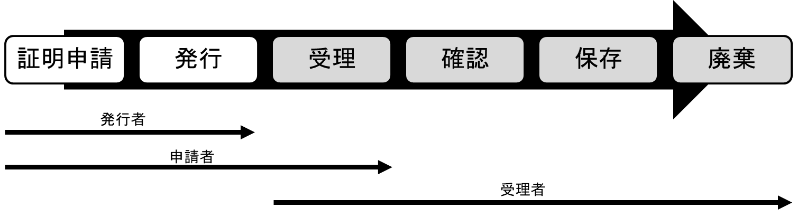
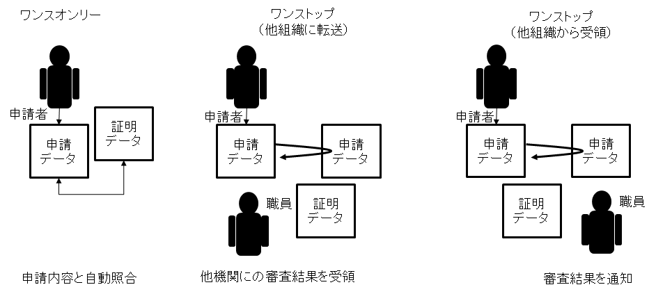
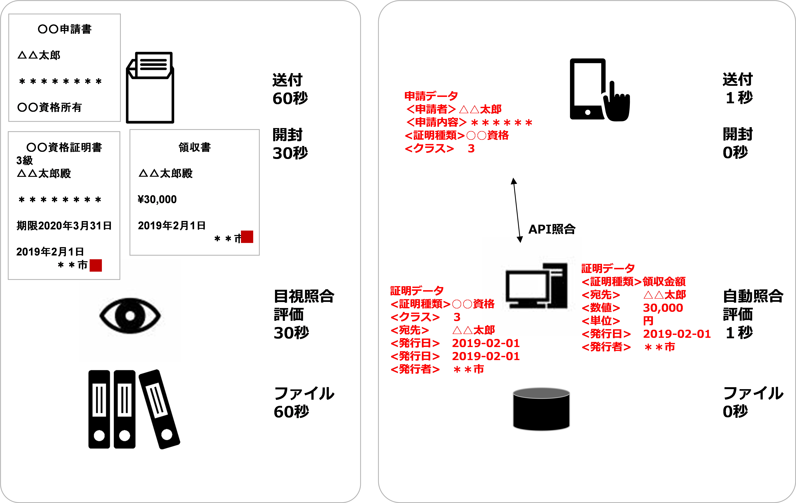
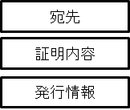
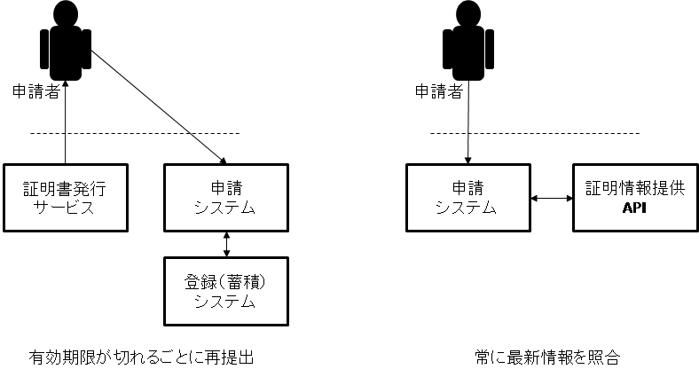
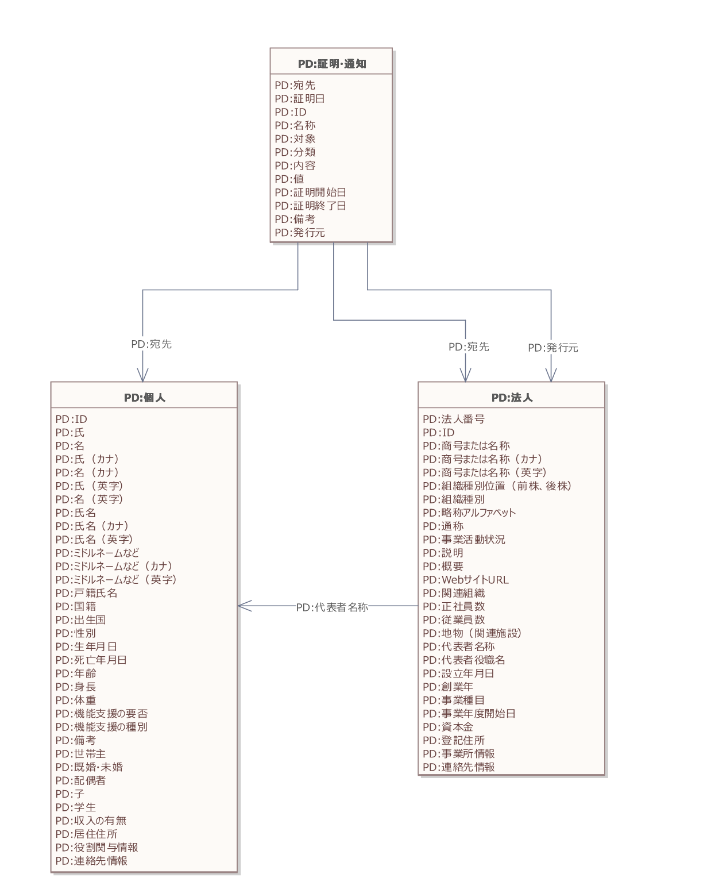
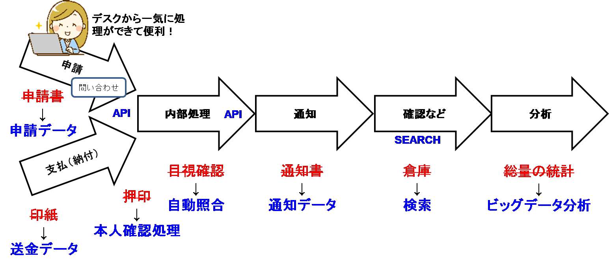
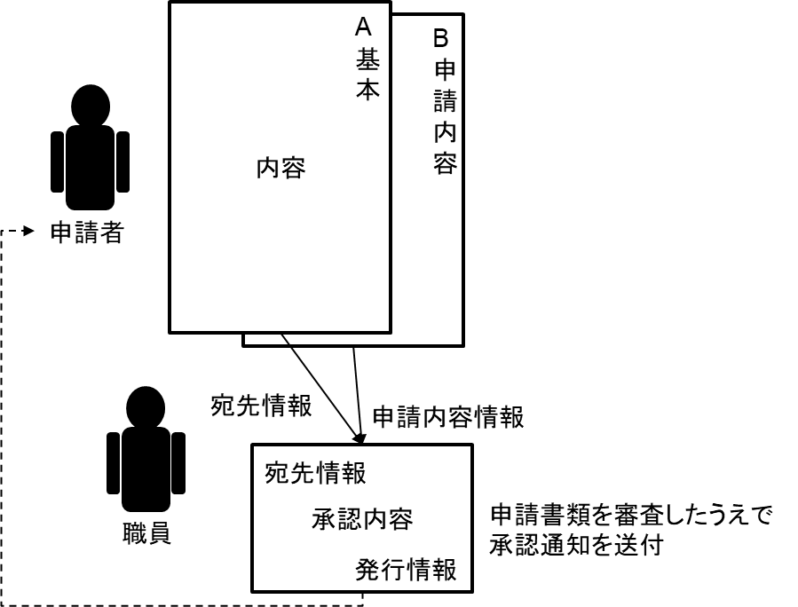
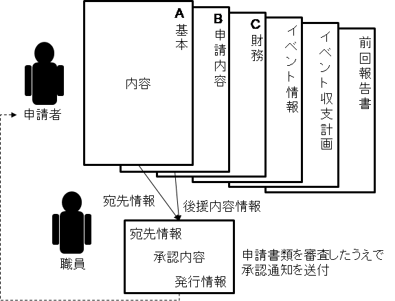

# 実装データモデル（行政） 証明・通知 <!-- omit in toc -->

デジタル社会推進実践ガイドブック DS-451-2

2022年（令和4年）3月31日

デジタル庁

-----
**[キーワード]**

個人、法人、証明、通知、表彰、資格、添付

**[概要]**

個人や法人に行政機関として契約や表彰等の証明や通知を行う業務を行うにあたって参照すべき実践的ガイド。このガイドに従いデータ設計を行うことで、申請の審査自動化等を容易かつ正確に行えるようになります。証明や通知を受けた個人や法人も、このデータを契機にした自動処理を行えるようになります。また、データ設計に関するコストも削減することができます。

-----

## 改訂履歴 <!-- omit in toc -->

| 改訂年月日    | 改訂箇所 | 改訂内容   |
|---------------|----------|------------|
| 2022年3月31日 | 全体     | 正式版決定 |
| 2021年6月4日  | -       | β版公開    |

## 目次 <!-- omit in toc -->
- [1. 背景と課題](#1-背景と課題)
  - [1.1. 背景](#11-背景)
  - [1.2. 課題](#12-課題)
  - [1.3. 投資対効果](#13-投資対効果)
- [2. 目的と概要](#2-目的と概要)
  - [2.1. 目的](#21-目的)
  - [2.2. 概要](#22-概要)
  - [2.3. 証明、通知データの再利用について](#23-証明通知データの再利用について)
- [3. データモデル](#3-データモデル)
  - [3.1. データモデルの全体概要図（クラス図）](#31-データモデルの全体概要図クラス図)
  - [3.2. 概要](#32-概要)
- [4. 活用場面イメージ](#4-活用場面イメージ)
  - [4.1. 機能イメージ](#41-機能イメージ)
    - [4.1.1. 自動照合](#411-自動照合)
    - [4.1.2. 通知](#412-通知)
  - [4.2. サービスイメージ](#42-サービスイメージ)
    - [4.2.1. 個人向け](#421-個人向け)
    - [4.2.2. 法人向け](#422-法人向け)
- [5. 解説](#5-解説)
  - [5.1. データ標準](#51-データ標準)
    - [5.1.1. 基準・証明データ](#511-基準証明データ)
    - [5.1.2. 資格証明データ](#512-資格証明データ)
- [6. 付録](#6-付録)

-----
## 1. 背景と課題

### 1.1. 背景

資格や納税等に関する証明情報は各種申請の際に添付書類として求められることが多くあります。その証明内容は多岐にわたり、資格証明、納税額等だけではなく、契約の請書、表彰、通知等も一種の証明情報といえます。

証明情報はその申請から廃棄まで、発行者、申請者と受理者が関与するライフサイクルを形成します。これまで、証明情報は主に紙によって発行されてきましたが、「デジタルファースト」、「ワンスオンリー」、「ワンストップ」サービスの実現の観点から、デジタル情報の活用を前提に、ライフサイクル全体を考慮した業務を検討して行く必要があります。

<figure>

<figcaption>
図 1　証明情報のライフサイクル[^1]
</figcaption>
</figure>

<figure>

<figcaption>
図 2　ワンスオンリーやワンストップでのイメージ
</figcaption>
</figure>

証明情報をPDFで添付することもあるため、AI-OCRやRPAのような、コンピュータが文字認識し、その処理を自動化する技術が注目されています。しかしこれらは文字や図表等の認識精度の面からデータの品質低下を招く要因になっており、コストも余計にかかっています。そのため、添付書類自体をデータ化し、API等を通じて自動処理する仕組みが求められています。

### 1.2. 課題

添付情報は、紙で提出するのが主流であったため、データの標準化がされてきませんでした。納税証明のようにデジタルデータで提出できる証明書もありましたが、PDFである等の理由で再利用が困難でした。また、住民票のように証明内容に外字を含むため、PDF化しコンビニエンスストアでしか印刷できないといった制約をかけているものもありました。こうしたことから、証明には以下のような課題があります。

* 証明での利用者にとっての課題
     * 証明取得に窓口に行くか郵送する必要があり手間がかかる
     * 申請先の数だけ証明情報を取得する必要がある
     * 添付に手間がかかる
* 証明での行政職員にとっての課題
     * 添付書類不備による差戻しがある
     * 申請内容を添付書類で目視確認する必要がある
     * 証明データの活用が十分にできていない

デジタルデータ化すると改ざん等のセキュリティ上の課題があるのではないかという指摘がありますが、認証や電子証明書の技術を活用することで、紙での認証以上のセキュリティを確保することができます。また、課題解決にあたってはWebサイト等で正しい情報を確認できる仕組みにして行くことも重要です。

### 1.3. 投資対効果

申請者はこれまで、証明書を取得する作業コストと、送付するための作業コストをかけていました。さらに、200円の証明書を5か所に提出するときには5通の証明書を取得する必要があり合計1,000円の費用がかかっていました。これが証明情報をデータ化することで、インターネットがあればどこからでも取得可能で複製も可能なことから、取得に関する人件費はもちろんのこと、証明書費用、送料等の直接費用も削減することができます。

申請を受領する側にとってもメリットがあります。証明情報のデータ項目が細分化されることで、申請書の該当項目と自動照合することができるようになります。さらに、証明内容によっては申請を評価するための評価点の算出が自動化できる場合もあります。

<figure>

<figcaption>
図 3　証明データの自動照合の例
</figcaption>
</figure>

-----
## 2. 目的と概要

### 2.1. 目的

証明、通知データの標準化を通じて、審査の自動化、迅速化、正確性の向上の実現を目指します。申請者の利便性の向上のみならず、行政職員の生産性の向上、行政の透明性の向上も実現できます。

大幅な効果を上げるためには、証明、通知データの標準化だけではなく申請データと一緒に活用することが重要です。申請の流れ全体の中で効率化を目指します。

### 2.2. 概要

証明、通知情報は「宛先」「証明内容」「発行情報」の3ブロックで構成されます。

<figure>

<figcaption>
図 4　証明情報の構成
</figcaption>
</figure>

申請を行うときに、申請情報とともに証明情報を送信することも可能ですが、申請受理者が資格番号などをキーに、証明機関のサーバーにAPIで検索することで証明情報を取得し、自動照合をすることが可能になります。こうすることで紙の証明書を廃止でき、申請者、審査者の双方の効率化を図ることができます。

<figure>

<figcaption>
図 5　証明のAPI化
</figcaption>
</figure>

証明内容のデータ項目は業務に応じて自由に設定可能です。宛名と発行者、発行日に加えて、資格の証明では、資格の種類、クラス、有効期限等が証明項目であり、領収書では、適用項目や金額が証明項目になります。

### 2.3. 証明、通知データの再利用について

証明、通知情報は、申請者の希望（オプトイン）により、次回申請用に再利用（ワンスオンリー）できるようにするか検討し、再利用可能にする場合は、証明情報を提供するAPI等を提供し最新の証明情報が確認できるようにします。こうすることで申請者、審査者の双方の業務効率が向上します。

<figure>

<figcaption>
図 6　証明データの再利用
</figcaption>
</figure>

-----
## 3. データモデル

### 3.1. データモデルの全体概要図（クラス図）

証明・通知の実装データモデルの全体概要図は以下のとおりです。

<figure>

<figcaption>
図 7 証明・通知データモデルの全体概要図（クラス図）
</figcaption>
</figure>

### 3.2. 概要

証明、通知のデータモデルは、以下になります。

表1 証明、通知のデータ項目

| 必須項目 | 項目名 | 説明 |
|---------|--------|------|
| 必 | 宛先 | 宛先の情報。コアデータモデル「個人」または「法人」を参照。 |
| 　 | 証明日 | 証明の発行日（西暦年月日とし、半角数字をハイフンでつなぐYYYY-MM-DD）※通知の場合は発行日 |
| 必 | ID | 証明、通知のID |
| 必 | 名称 | 証明、通知の名称 |
| 　 | 対象 | 証明、通知の対象となる人やモノ |
| 　 | 分類 | 分野、地域、クラス等の分類 |
| 　 | 内容 | 証明、通知の内容、説明 |
| 　 | 値 | 証明、通知する対象に数値がある場合に記入 |
| 　 | 証明開始日 | 証明の開始日（西暦年月日とし、半角数字をハイフンでつなぐ）※通知で内容に期間があるときに使用 |
| 　 | 証明終了日 | 証明の終了日（西暦年月日とし、半角数字をハイフンでつなぐ）※通知で内容に期間があるときに使用 |
| 　 | 備考 | 証明、通知に関する備考 |
| 必 | 発行元 | 発行元の情報。コアデータモデル「法人」を参照。 |

-----
## 4. 活用場面イメージ

申請のライフサイクルの中で送金データに関する証明、手続完了などの通知、申請された証明内容等、いくつかの場面で証明情報が活用されます。

<figure>

<figcaption>
図 8　申請のライフサイクルの中での証明や通知
</figcaption>
</figure>

### 4.1. 機能イメージ

#### 4.1.1. 自動照合

申請データと送金データの照合は、申請データと領収書や印紙の金額を目視で照合するのではなく、法人番号や法人名の確認、手数料と送金データの送金額とが一致するかの確認が自動で行われます。

また、申請データとともに資格証明データが送付されてきた場合には、個人氏名や法人名、資格種別等の自動照合を行います。資格データは、データで送付される場合と、資格証明サーバーに証明書番号などを基に確認しに行く方式があります。

#### 4.1.2. 通知

通知は、証明、通知のデータモデルに従ったデータが送られてきます。法人等では、承認が下りたときに自社システムでその通知データを自動判別することで、社内の発注プロセスに自動的に進む等の処理の効率化、迅速化を図ることができます。

### 4.2. サービスイメージ

#### 4.2.1. 個人向け

例えば資格証明申請の場合、申請が行われ承認が行われると、通知として資格証明を自動交付することが可能になります。また、このデータを行政機関で活用することが可能となります。

<figure>

<figcaption>
図 9　個人の証明データ交付イメージ
</figcaption>
</figure>

#### 4.2.2. 法人向け

後援名義申請の場合、申請が行われ承認が行われると、後援名義承認の通知を自動交付することが可能になります。

<figure>

<figcaption>
図 10　法人の証明データ交付イメージ
</figcaption>
</figure>

-----
## 5. 解説

### 5.1. データ標準

#### 5.1.1. 基準・証明データ

証明データは、欧州の証明データの標準であるCCCEV（Core Criterion and Core Evidence Vocabulary Version 1.0.0）[^2]との整合性を確保しています。

表2 CCCEVのクラスのレベル項目

| 本標準 | CCCEV |
|--------|-------|
| 証明対象者 | Agent |
| 対象サービスのフレームワーク | FomalFramework |
| 評価軸 | Criterion |
| 評価要求条件 | RequirmentGroup CriterionRequirment |
| 評価対象提出資料 | RequirementResponce |
| 証明資料 参照資料 | Evidence DocumentReference |
| 証明期間 | PriodOfTime |
| 証明機関 | Organization |

CCCEVでは、単に証明できるだけではなく、その根拠についても詳細に記述できるようになっています。

#### 5.1.2. 資格証明データ

資格証明のデータ標準にはIMSグローバルによるオープン・バッジ[^3]があります。

表3 オープン・バッジの標準

| 項目名 | オープン・バッジの項目 |
|--------|----------------------|
| 証明対象者 | Recipient |
| 証明内容（バッジ） | Badge |
| 評価軸 | Criteria |
| 評価対象提出資料 | RequirementResponce |
| 証明資料 説明 | Evidence Narrative |
| 証明期間 | IssuedOn Expires |
| 証明機関 | Issuer |

-----
## 6. 付録

全体概要図として掲載したクラス図について、大きなサイズのものは別添の「451-2-1_証明・通知データモデル_クラス図.pdf」を参照してください。

-----

[^1]: 発行者は、証明や通知を発行する行政機関等。申請者は、何らかの申請・届出等により公的機関から証明を受ける個人や法人。受理者は、個人や法人から証明情報の提供を受け審査などを行う行政機関等。

[^2]: https://joinup.ec.europa.eu/collection/semantic-interoperability-community-semic/solution/core-criterion-and-core-evidence-vocabulary/releases

[^3]: https://www.imsglobal.org/sites/default/files/Badges/OBv2p0Final/index.html
