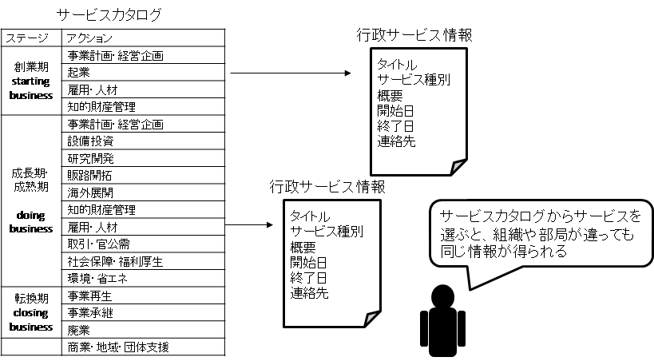
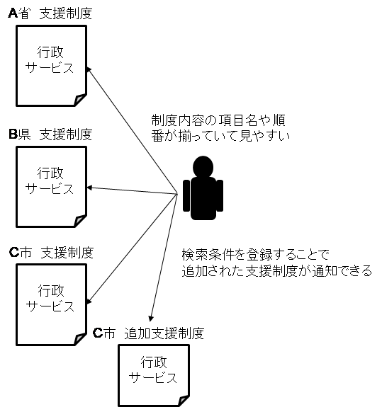
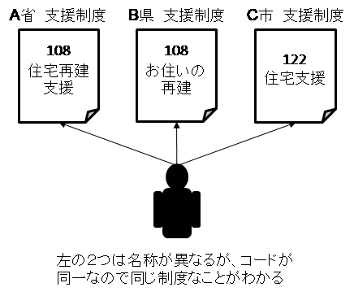
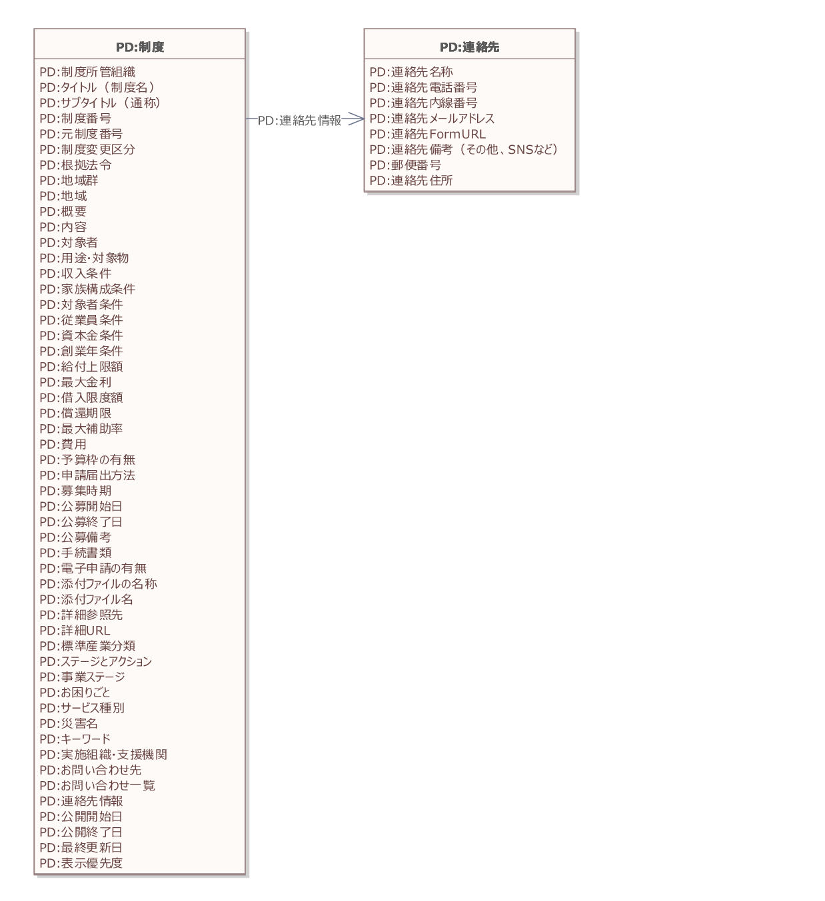

# 実装データモデル（行政） 行政サービス・制度 <!-- omit in toc -->

デジタル社会推進実践ガイドブック DS-451-4

2022年（令和4年）3月31日

デジタル庁

-----
**[キーワード]**

行政サービス、制度、支援制度

**[概要]**

行政機関で行政サービスや支援制度情報に関する情報提供をするシステムを作る時に参照すべき実践的ガイド。このガイドに従いデータ設計を行うことで、行政サービスや支援制度情報が容易かつ正確に情報提供できるようになります。また、データ設計に関するコストも削減することができます。

-----

## 改訂履歴 <!-- omit in toc -->

| 改訂年月日    | 改訂箇所 | 改訂内容   |
|---------------|----------|------------|
| 2022年3月31日 | 全体     | 正式版決定 |
| 2021年6月4日  | -       | β版公開    |

## 目次 <!-- omit in toc -->
- [1. 背景と課題](#1-背景と課題)
  - [1.1. 背景](#11-背景)
  - [1.2. 　課題](#12-課題)
  - [1.3. 投資対効果](#13-投資対効果)
- [2. 目的と概要](#2-目的と概要)
  - [2.1. 目的](#21-目的)
  - [2.2. 概要](#22-概要)
    - [2.2.1. デジタルデータでの整備](#221-デジタルデータでの整備)
    - [2.2.2. データ表記の簡素化](#222-データ表記の簡素化)
    - [2.2.3. データ基準の簡素化](#223-データ基準の簡素化)
    - [2.2.4. 行政サービスIDによる管理](#224-行政サービスidによる管理)
- [3. データモデル](#3-データモデル)
  - [3.1. データモデルの全体概要図（クラス図）](#31-データモデルの全体概要図クラス図)
  - [3.2. データモデルの項目定義](#32-データモデルの項目定義)
- [4. 事例](#4-事例)
  - [4.1. ミラサポplus　制度ナビ](#41-ミラサポplus制度ナビ)
- [5. 解説](#5-解説)
  - [5.1. データ標準項目について](#51-データ標準項目について)
  - [5.2. サービスカタログモデルに基づくタグ](#52-サービスカタログモデルに基づくタグ)
- [6. 付録](#6-付録)

-----
## 1. 背景と課題

### 1.1. 背景

国、都道府県、市区町村は、多くの行政サービス、支援制度、補助金（以降、行政サービスと表記）を個人や法人に対して提供しており、その数は数千種類ともいわれています。これらの説明は紙で行われることが多く、国、都道府県、市区町村がそれぞれガイドブックやリーフレットなどを発行しています。これらのガイドブックは記述項目や分類が異なり、行政サービス間の比較検討が難しくなっています。

国際的には、行政サービスの分類方法（サービスカタログ）や記述方式（行政サービス情報）の統一が進められており、広域での情報提供を行いやすい環境を整備しています。

<figure>

<figcaption>
図 1　サービスカタログと行政サービス情報の関係
</figcaption>
</figure>

### 1.2. 　課題

どのような行政サービスや支援制度があるのか知りたい、自分が活用できる行政サービスや支援制度は何か知りたいという意見は、行政サービスに関する調査を行うと常に上位にあげられています。利用者のために作った制度にもかかわらず、そのサービスや支援制度の存在が知られておらず、その行政サービスの利用率が低いと指摘されることもあります。

特に、大規模災害後には緊急で支援制度などが数多く提供されますが、これらの情報は、各組織で紙冊子が作られ、検索性が低い状況で配布がされています。

また、地方公共団体等、様々な機関が支援制度情報の冊子などを作っており、利用者がわかりやすいように行政サービスのタイトルや説明を書き直したり、自治体独自の加算金を加えた派生形の行政サービスを作ったりすることがあります。このように情報内容に様々なバリエーションがあることにより、行政サービスの全体像がわかりにくくなっている場合もあります。

利用者にとっての課題

* 行政サービスや支援制度を知らない、見つけられない
* 各支援制度情報の記述内容が不統一で分かりにくい
* 類似の支援制度が複数組織から公表されていてわかりにくい
* 同じ支援制度が複数個所から違う表現で情報提供され、複数の支援制度に見える
* 支援制度を知った時には申込みが終わっていることがある

行政職員にとっての課題

* 情報が利用者に届かないため、利用（政策の普及）が進まない
* 支援制度広報に予算が必要だが、十分にない
* 周辺自治体などの支援制度情報を調べたくても調べられない
* 国の支援制度を探すのが大変
* 災害時に大量の追加の支援制度が出るが、手作業で対応している

### 1.3. 投資対効果

行政サービスに関する情報の提供は情報利用者の視点ではなく情報提供者の視点で行われることが多いため、行政サービスの利用者は、活用できるサービスを探すために多くの時間をかけたり、支援制度活用の機会を逃していたりすることさえあります。これまで、サービスや制度を探す際には、市区町村、都道府県、国、支援機関の情報を収集し、利用できそうなサービスや支援制度を比較検討し、更に、支援機関に相談することもあります。これら様々な支援機関から提供される支援制度を一元的に検索できるようにすることで、全ての利用者の時間節約になるとともに、早期の行政支援の活用によりその効果を享受することが可能になります。

行政サービスや支援制度の提供部門にとってもメリットがあります。定型データモデルに制度情報を記入する事務コストは従来の業務とほとんど変わりませんが、定型のデータモデルに支援制度を記入することにより、政策の広報が効率的にできるだけでなく、内容が分かりやすくなるため問い合わせが減るという効果もあります。

利用者が相談に訪れる相談機関や支援機関は、利用者に合わせた制度が探しやすくなり、的確な支援をアドバイスしやすくなります。支援対象者の業種に特化したガイドブックの作成等をすることもできるようになります。

特に災害時には、日々追加される支援制度を効果的に情報提供・収集できる必要があることから、このように定型データモデルによる情報提供は非常に大きな価値を生み出すと考えられます。

-----
## 2. 目的と概要

### 2.1. 目的

行政サービス情報を正確かつ効率的に利用者に届け、活用の促進を図ることを目的とします。

利用者の業務を効率化するだけではなく、提供する行政機関の問い合わせ対応業務の削減等も実現します。

### 2.2. 概要

行政サービスを紙の冊子でもインターネット経由でも活用しやすいデータとして整備します。そのために、タイトルや連絡先等のデータ項目の統一化と記述方式の統一を行います。

行政サービスは、社会変化に合わせて日々追加されますが、行政サービス情報に付加されたタグ等により、利用者の要望に応じて追加配信をすることも可能になります。

<figure>

<figcaption>
図 2　複数機関の行政サービス情報の収集
</figcaption>
</figure>

#### 2.2.1. デジタルデータでの整備

行政サービスの検索性を高めるためには、データ化が欠かせません。検索性を高めるために、従来の記述内容のうち、特定の情報については別項目でデータを登録する場合もあります。

<figure>

<figcaption>
図 3　検索用データ項目の作成
</figcaption>
</figure>

#### 2.2.2. データ表記の簡素化

単にデータ項目を統一するだけではなく、利用者にわかりやすくするためにデータ表記の簡素化を行います。日付の表記項目を統一するのをはじめとして、補助率は、1/3補助や5/12補助などのわかりにくい分数表現ではなく、小数点以下1桁表示にするなどの工夫が必要です。制度によっては、条件により補助率を複数持つ場合がありますが、最大補助率とそれを補足する自由記述を組み合わせることで、検索性を高めつつ詳細情報も伝える工夫をする必要があります。

#### 2.2.3. データ基準の簡素化

データの記述項目に曖昧性がある項目を明確化します。これまで、補助金などの説明が、補助の対象購入額なのか、補助金として最大支給額なのかが行政サービス毎に異なる記述をされていました。また、金額や人数の記載では、「以下」と「未満」が混在しています。いき値の扱いに関する情報を内容説明の中で明確にする必要があります。

#### 2.2.4. 行政サービスIDによる管理

制度間の関連性を明確にするために制度IDを付与します。元の制度の内容を変えずにわかりやすい文書に書き下す場合や加算などを行う場合には、親の制度IDを記述することで、その関連性がわかるように管理します。

<figure>

<figcaption>
図 4　行政サービスIDの意義
</figcaption>
</figure>

行政サービスIDは、制度所管組織が付与する必要があります。制度所管組織は、制度名の変更や制度内容の軽微な変更をした時にも、同じ制度IDを使う必要がありますが、制度の大幅な変更がある時には新しい制度IDを付与することも検討する必要があります。

地方公共団体は、国の制度の派生の制度を作る時には、IDの連携によりその関係性を明確にすることで住民にわかりやすく情報提供することができるようになります。また、地方公共団体が独自に制度を制定する時には、地方公共団体コードと組み合わせた制度IDを独自に発行することとなります。

-----
## 3. データモデル

### 3.1. データモデルの全体概要図（クラス図）

行政サービス・制度の全体概要図は以下のとおりです。

<figure>

<figcaption>
図5 イベントデータモデルの全体構造図（クラス図）
</figcaption>
</figure>

### 3.2. データモデルの項目定義

表1 行政サービス・制度のデータ項目定義

| 必須項目 | 項目名 | 説明 |
|---------|--------|-----|
| 必 | 制度所管組織 | 制度を所管する組織 |
| 必 | タイトル（制度名） | 制度のタイトル（40文字以内を推奨） |
|    | サブタイトル（通称） | 制度のサブタイトル（40文字以内を推奨） |
|    | 制度番号 | 制度固有のID |
|    | 元制度番号 | 当該制度の元となる制度のID |
|    | 制度変更区分 | 元制度がある場合に制度の変更状況 0:分かりやすいように内容を変えずに書換えを実施 1:地方公共団体などでの追記あり 2:条件による詳細化 |
|    | 根拠法令 | 根拠となる法令や条例 |
|    | 地域群 | 制度の提供範囲に地域群 |
|    | 地域 | 制度の対象都道府県、市区町村コード（セミコロン区切りで列挙） |
| 必 | 概要 | 制度の概要（100文字以内） |
| 必 | 内容 | 制度の内容（500文字以内） |
|    | 対象者 | 制度の利用者に条件がある場合に記入 |
|    | 用途・対象物 | 制度の利用用途に制限がある場合に記入 |
|    | 収入条件 | 対象となる収入の種類、収入条件 |
|    | 家族構成条件 | 家族構成の条件がある場合に条件を記入 |
|    | 対象者条件 | 対象者の条件がある場合に条件を記入 |
|    | 従業員条件 | 従業員規模（人数） |
|    | 資本金条件 | 資本金の規模（円単位） |
|    | 創業年条件 | 創業年に条件がある場合に条件を記入 |
|    | 給付上限額 | 給付上限額（円単位） |
|    | 最大金利 | 貸与の場合に金利などの条件（複数金利がある場合には、最大金利を％で記入） |
|    | 借入限度額 | 貸与の場合に借入の限度額（円単位） |
|    | 償還期限 | 償還期限がある場合に記入（年） |
|    | 最大補助率 | 補助の場合に補助率（最大補助率を％で、小数点以下1桁まで四捨五入で記入） 1/3補助は33.3% |
|    | 費用 | 制度利用に費用が掛かる場合に記入（円単位） |
|    | 予算枠の有無 | 予算総額に上限があり、年度途中で終了する可能性がある場合に「有」と記入 |
|    | 申請届出方法 | 申請届出方法がある場合に記入 |
|    | 募集時期 | 随時、未定若しくは予定募集時期 |
|    | 公募開始日 | 公募する制度に関しては公募開始日。未定の場合には空欄にし、公募備考に未定等と記入（西暦年月日とし、半角数字をハイフンでつなぐ） |
|    | 公募終了日 | 公募する制度に関しては公募終了日。未定の場合には空欄にし、公募備考に未定等と記入（西暦年月日とし、半角数字をハイフンでつなぐ） |
|    | 公募備考 | 公募に関する諸条件 |
|    | 手続書類 | 手続に必要な書類がある場合に記入。申請書類の入手先、URLがある場合にはここに記入 |
|    | 電子申請の有無 | 電子申請がある場合には、URLを記入 |
|    | 添付ファイル名称 | 制度に関連して添付ファイルがある場合にファイル名称を記入（内容説明で図を使う必要がある場合等にも利用可能） |
|    | 添付ファイル名 | 添付のファイル名を拡張子も含んで記入 |
|    | 詳細参照先 | 詳細参照先の名称 |
|    | 詳細URL | 詳細参照先のURL |
|    | 標準産業分類 | 大分類又は中分類 複数選択可能（3個まで） |
|    | ステージとアクション | 支援対象となるライフステージとアクション（サービスカタログから選択） |
|    | 事業ステージ | 企業の成長段階に応じて直面する状況・局面 |
|    | お困りごと | 行政サービスを探す元となるお困りごと（サービスカタログから選択） |
|    | サービス種別 | 行政サービスの種類（サービスカタログから選択） |
|    | 災害名 | 制度の対象となる災害が指定されている時に記入 |
|    | キーワード | 制度につけるキーワード（セミコロン区切りで列挙）。 |
|    | 実施組織・支援機関 | 制度所管組織と異なる組織が運用する場合に記入 |
|    | お問い合わせ先 | 問い合わせ先情報。詳細化できる場合には連絡先情報も記入 |
|    | お問合わせ先一覧 | 問い合わせ先がリスト化して公開している場合にはURL |
| 必 | 連絡先情報 | 連絡先情報を記入。 コアデータモデル「連絡先」を参照。 |
|    | 公開開始日 | 本制度の情報公開開始日 |
|    | 公開終了日 | 本制度の情報公開終了日 |
|    | 最終更新日 | 本制度の最終更新日 |
|    | 表示優先度 | イベント会場表示に優先がある場合に記入。10が最優先、1が最低（同じ条件でリスト化される時の表示優先順位） |

-----
## 4. 事例

### 4.1. ミラサポplus　制度ナビ

中小企業向け支援制度の提供を行う「ミラサポplus　制度ナビ」[^1]では、本データモデルのサブセット化と中小企業向けの拡張を行ってサービスを提供しています。本モデルのすべてのデータモデルを適用しようとしても、現在の支援制度情報の元データが十分にデータの細分化ができていないことから、まずは、現在のデータ粒度を基に、データ項目を最小化してサービスを実現しています。また、独自項目をいくつか付与しています。

表2 ミラサポplus 制度ナビで追加された独自項目

| 項目名 | 説明  |
|-------|-------|
| 制度集 | 情報源の制度集がある時、または、制度集としてグループ管理したい時に記入 |
| 中小企業施策利用ガイドブックページＮｏ | 中小企業施策利用ガイドブックに掲載されている制度の場合、そのページ番号を記入 |
| 特定施策区分 | 中小企業庁の特定施策の場合に施策名を記入 |
| 関連制度 | 関連する制度 |
| 企業規模 | 対象企業の企業規模 |

表3 ミラサポplus 制度ナビのデータモデル

| 分類 | 項目名 | 説明 |
|---|---|---|
| 基本 | 制度所管組織 | 制度を所管する組織 |
| 基本 | タイトル（制度名） | 事例のタイトル |
| 基本 |  | 40文字以内を推奨（スマートフォンではこれ以上表示できない場合があります） |
| 基本 | サブタイトル（通称） | 事例のサブタイトル |
| 基本 |  | 40文字以内を推奨（スマートフォンではこれ以上表示できない場合があります） |
| 基本 | 制度番号 | 制度固有のID |
| 基本 | 元制度番号 | 当該制度の元となる制度がある場合にそのIDを記入 |
| 基本 | 制度変更区分 | 元制度がある場合に制度の変更状況を記入 |
| 基本 |  | 0:分かりやすいように内容を変えずに書換えを実施 |
| 基本 |  | 1:地方公共団体などでの追記あり |
| 基本 |  | 2:条件による詳細化 |
| 基本 | 制度集 | 情報源の制度集がある時、または、制度集としてグループ管理したい時に記入 |
| 基本 | 中小企業施策利用ガイドブックページＮｏ | 中小企業施策利用ガイドブックに掲載されている制度の場合、そのページ番号を記入 |
| 基本 | 特定施策区分 | 中小企業庁の特定施策の場合に施策名を記入 |
| 基本 | 根拠法令 | 根拠となる法令や条例 |
| 基本 | 関連制度 | 関連する制度 |
| 基本 | 地域群 | 制度の提供範囲に地域群がある場合に記入 |
| 基本 | 地域 | 制度の対象都道府県、市区町村コード。列挙する場合はセミコロン区切り |
| 内容 | 概要 | 制度の概要を100文字以内で記入 |
| 内容 | 内容 | 制度の内容を500文字以内で記入 |
| 内容 | 企業規模 | 対象企業の企業規模 |
| 内容 | 対象者 | 制度の利用者に条件がある場合に記入 |
| 内容 | 用途・対象物 | 制度の利用用途に制限がある場合に記入 |
| 申請 | 申請URL | 申請URLがある場合に記入 |
| 申請 | 申請届出方法 | 申請届出方法がある場合に記入 |
| 申請 | 公募開始日 | 公募する制度に関しては公募開始日を記入。未定の場合には公募備考に記入（西暦年月日とし、半角数字をハイフンでつなぐ） |
| 申請 | 公募終了日 | 公募する制度に関しては公募終了日を記入。未定の場合には公募備考に記入（西暦年月日とし、半角数字をハイフンでつなぐ） |
| 申請 | 公募備考 | 公募に関する諸条件 |
| 関連情報 | 詳細参照先 | 詳細参照先の名称 |
| 関連情報 | 標準産業分類 | 大分類又は中分類 |
| 関連情報 |  | 複数選択可能（3個まで） |
| 関連情報 | 事業ステージ | 企業の成長段階に応じて直面する状況・局面 |
| 関連情報 | お困りごと | 行政サービスを探す元となるお困りごと（「５．２」サービスカタログから選択） |
| 関連情報 | サービス種別 | 行政サービスの種類（「５．２」サービスカタログから選択） |
| 関連情報 | 災害名 | 制度の対象となる災害が指定されている時に記入 |
| 関連情報 | キーワード | 制度に関連するキーワード |
| 関連情報 | 実施組織・支援機関 | 制度所管組織と異なる組織が運用する場合に記入 |
| 関連情報 | お問い合わせ先 | 問い合わせ先情報。詳細化できる場合には連絡先情報も記入 |
| 関連情報 | 公開状態 | Webサイトへの公開、非公開の管理状況 |
| 関連情報 | 公開開始日 | 本制度の情報公開開始日 |
| 関連情報 | 公開終了日 | 本制度の情報公開終了日 |
| 関連情報 | 最終更新日 | 本制度の最終更新日 |
| 関連情報 | 表示優先度 | 表示に優先がある場合に記入。10が最優先、1が最低（同じ条件でリスト化される時の表示優先順位） |
| 関連情報 | 管理グループ | 制度情報を管理するグループ |

個人の制度情報の場合は、「事業ステージ」「お困りごと」「サービス種別」の部分が個人向けのステージ情報等になります。

-----
## 5. 解説

### 5.1. データ標準項目について

欧州の行政サービス情報のデータ標準であるCPSV[^2]と東日本大震災後に復旧・復興支援制度データベースとして運用してきたデータ項目、中小企業施策利用ガイドブックの情報内容を基に作成しています。

### 5.2. サービスカタログモデルに基づくタグ

情報の検索性を向上させるためサービスカタログモデルに基づくタグを付与しています。詳細については「実装データモデル サービスカタログ」を参照してください。

-----
## 6. 付録

全体概要図として掲載したクラス図について、大きなサイズのものは別添の「451-4-1_制度データモデル_クラス図.pdf」を参照してください。

----

[^1]: https://seido-navi.mirasapo-plus.go.jp/

[^2]: https://ec.europa.eu/isa2/solutions/core-public-service-vocabulary-application-profile-cpsv-ap_en
