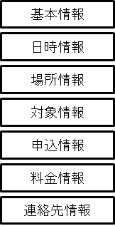
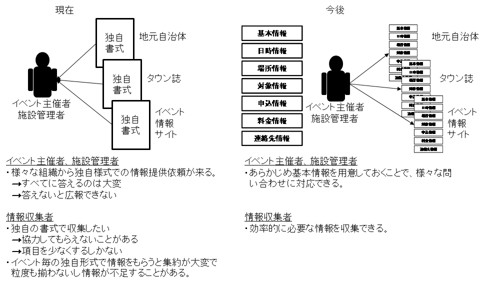
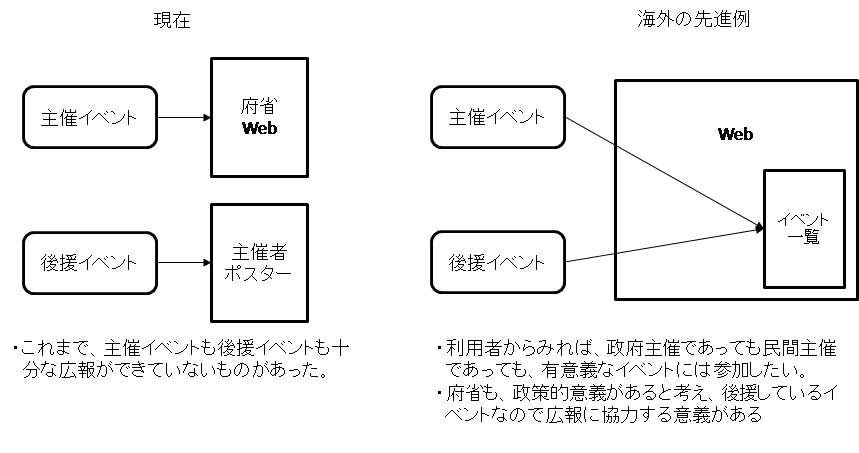
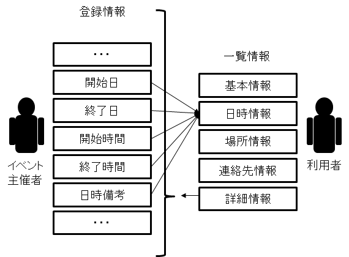
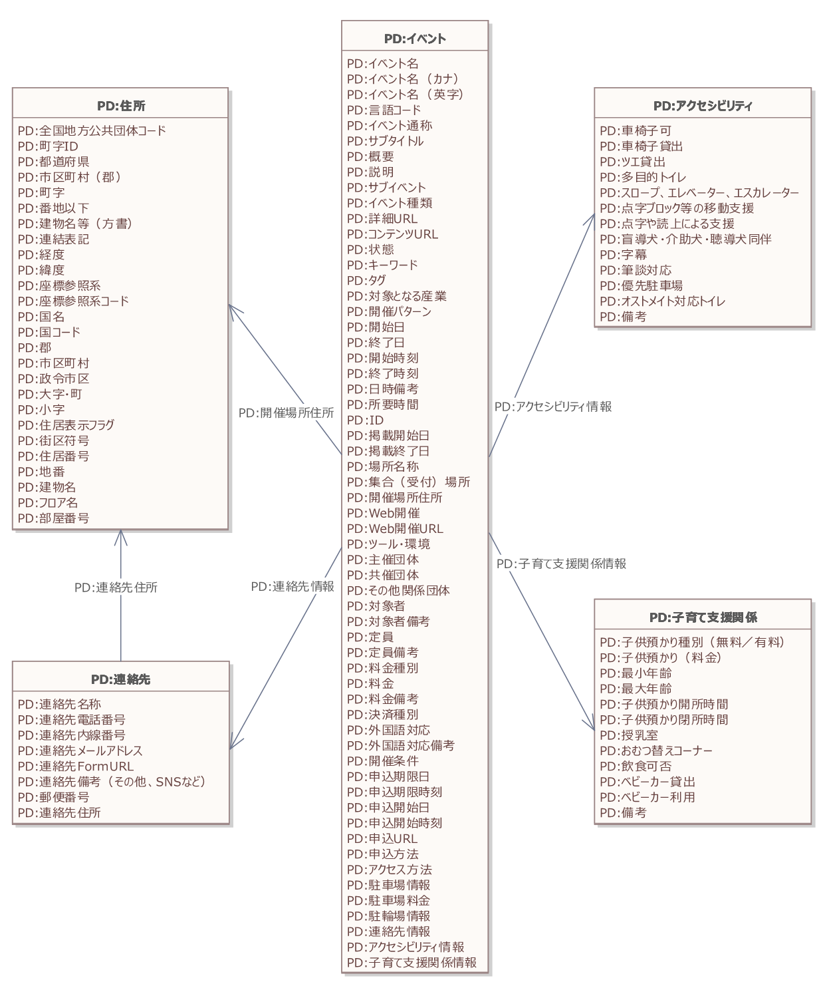

# 実装データモデル（行政） イベント <!-- omit in toc -->

デジタル社会推進実践ガイドブック DS-451-5

2022年（令和4年）3月31日

デジタル庁

-----
**[キーワード]**

イベント、主催、共催、後援

**[概要]**

個人の情報をシステム実装する際に参照すべきデータモデルについて解説するガイドブックです。このガイドに従いデータ設計を行うことで、同じ設計規則に従うシステム間、分野間でのデータ連携を容易かつ正確に行えるようになります。また、データ設計を実施するコストも削減することができます。

-----
## 改訂履歴 <!-- omit in toc -->

| 改訂年月日    | 改訂箇所 | 改訂内容   |
|---------------|----------|------------|
| 2022年3月31日 | 全体     | 正式版決定 |
| 2021年6月4日  | -       | β版公開    |

-----
## 目次 <!-- omit in toc -->
- [1. 背景と課題](#1-背景と課題)
  - [1.1. 背景](#11-背景)
  - [1.2. 課題](#12-課題)
  - [1.3. 投資対効果](#13-投資対効果)
- [2. 目的と概要](#2-目的と概要)
  - [2.1. 目的](#21-目的)
  - [2.2. 概要](#22-概要)
- [3. データモデル](#3-データモデル)
  - [3.1. データモデルの全体概要図（クラス図）](#31-データモデルの全体概要図クラス図)
  - [3.2. データモデルの項目定義](#32-データモデルの項目定義)
- [4. 活用場面イメージ](#4-活用場面イメージ)
  - [4.1. イベント情報収集時のイメージ](#41-イベント情報収集時のイメージ)
    - [4.1.1. 主催イベント](#411-主催イベント)
    - [4.1.2. 後援名義イベント](#412-後援名義イベント)
  - [4.2. 各種会議への適用イメージ](#42-各種会議への適用イメージ)
  - [4.3. 災害時支援活動への活用イメージ](#43-災害時支援活動への活用イメージ)
  - [4.4. 体験イベントでのカスタマイズ例](#44-体験イベントでのカスタマイズ例)
- [5. 付録](#5-付録)

-----
## 1. 背景と課題

### 1.1. 背景

行政機関は政策を推進するため様々なイベントを主催したり、関連する民間イベントを後援したりしています。しかしその広報範囲は限定されており、十分に政策効果を上げているとは言えません。

イベントの種類にも様々なものがあり、主催・後援イベント以外にも、工場見学のような常設イベントを一覧で提供している場合もあります。

また、審議会の案内、施設公開等もイベントであり、災害時の活動も一種のイベント情報として効率的な配信をすることが可能です。

### 1.2. 課題

主催イベントや後援イベント等、それぞれの行政機関が個別に情報を発信しているため、情報の公開場所が統一されておらず、イベント対象者に対して的確に情報が届いていません。

* 利用者にとっての課題
     * イベント情報を知らなかった
     * イベント情報の提供方法がバラバラで収集するのが難しい
     * メール等で自らに関係のないイベント情報が案内される
     * イベント事後に記事などを見るが、事前に情報を提供してほしい
* 行政職員にとっての課題
     * 広報しているのに十分集客できていない
     * 後援情報は、ポスター等に記載するだけで効果が十分ではない

### 1.3. 投資対効果

行政機関主催のイベントに関する広報は、Webサイトに載せているだけの場合が多く、イベント情報のデータを様々な媒体で活用できるようにして、体系的に広報することにより、手間と費用を抑えつつ、より大きな広報効果を上げることが可能になります。また、後援イベントを統一したサイト等から情報を提供することで、効果的に周知し政策効果を上げることができます。

-----
## 2. 目的と概要

### 2.1. 目的

個人や法人に関連したイベント情報を必要な利用者が容易に発見・入手できるように、イベントデータを構造化してタグをつける等の標準化を行います。イベント情報を標準化することで、情報流通をしやすくしてイベントの活用を促進します。

イベント情報の発信方法を改善することより、政策を必要な人に的確に伝えることを目的とします。

### 2.2. 概要

イベント情報では、いつ、どこで、誰が、どのようなテーマでイベントを行うかということが重要な情報項目になります。イベントには広域で行うイベントがあったり、情報化月間などという上位のイベントがあったり、イベント内で行うサブイベントがあったりと様々な条件があり、標準的なデータを作るのが難しいと言われてきました。

一般的なイベントは以下のように表すことができます。また、定期開催イベントと単独開催のイベントでも記述方法が変わってきます。

<figure>

<figcaption>
図 1 イベント情報の基本構造
</figcaption>
</figure>

このようなイベントのデータモデルを使うことで、イベント主催者は、様々な関係者へのデータ公開を効率化することができます。また、詳細な必要情報を公開することができるため、問い合わせを減らすことができます。

<figure>

<figcaption>
図 2　多様な広報媒体への展開
</figcaption>
</figure>

海外の政府機関では、府省主催のイベント以外に、府省が後援をしている民間イベントも府省のWebサイトのトップページで案内しているところもあります。

<figure>

<figcaption>
図 3　海外のイベント情報提供例
</figcaption>
</figure>

また、多くのイベントを公表する場合には、画面で見やすいように一覧化することが重要になります。主要データを抜粋して簡易的に一覧表示させ、別途整理した詳細情報に誘導する等の工夫をしていきます。

<figure>

<figcaption>
図 4　簡易な一覧情報の作成
</figcaption>
</figure>

-----
## 3. データモデル

### 3.1. データモデルの全体概要図（クラス図）

イベントの実装データモデルの全体概要図は以下のとおりです。

<figure>

<figcaption>
図5 イベントデータモデルの全体構造図（クラス図）
</figcaption>
</figure>

### 3.2. データモデルの項目定義

項目定義はコアデータモデルのイベントと同一となっています。

表1 イベントのデータ項目定義

| 必須項目 | 項目名 | 説明 |
|---------|--------|-----|
| 必 | イベント名 | イベント名称を記載。 |
|    | イベント名（カナ） | イベント名称をカナで記載。 |
|    | イベント名（英字） | イベント名称を英語で記載。 |
|    | 言語コード | イベント情報の記述言語コード（JA、EN、CNなど）を記載。 |
|    | イベント通称 | イベント通称を記載。 |
|    | サブタイトル | サブタイトルを記載。 |
| 必 | 概要 | 概要を記載。 |
| 必 | 説明 | 説明を記載。 |
|    | サブイベント | サブイベントのIDを記載。 |
| 必 | イベント種類 | イベントの種類を記載。 |
| 必 | 詳細URL | イベントの詳細が掲載されているWebサイトのURLを記載。 |
|    | コンテンツURL | イベントのコンテンツが掲載されているURLを記載。 |
|    | 状態 | 状態を記載。 |
|    | キーワード | 検索用キーワードを記載（セミコロン区切りで列挙）。 |
|    | タグ | 分類用のタグを記載（セミコロン区切りで列挙）。 |
|    | 対象となる産業 | イベントの対象となる産業（標準産業分類から選択）を記載。 |
|    | 開催パターン | 開催パターン（定期開催、通年開催など）を記載。 |
|    | 開始日 | 開始日を記載。 |
|    | 終了日 | 終了日を記載。 |
|    | 開始時刻 | 開始時刻を記載。 |
|    | 終了時刻 | 終了時刻を記載。 |
|    | 日時備考 | 日時に関する備考（最終日は早く終わることなど）を記載。 |
|    | 所要時間 | 所要時間を記載。 |
| 必 | ID | イベントに付与した一意のIDを記載。 |
| 必 | 掲載開始日 | イベント情報の掲載開始日を記載。 |
| 必 | 掲載終了日 | イベント情報の掲載終了日を記載。 |
| 必 | 場所名称 | 開催場所の名称を記載。 |
| 必 | 集合（受付）場所 | 集合または受付場所を記載。 |
| 必 | 開催場所住所 | 開催場所の住所を記載。 コアデータモデル「住所」を参照。 |
| 必 | Web開催 | Web開催の有無を記載。 |
|    | Web開催URL | Web開催のURLを記載。 |
|    | ツール・環境 | Web開催時の使用ツールを記載（セミコロン区切りで列挙）。 |
| 必 | 主催団体 | 主催団体名を記載。 |
|    | 共催団体 | 共催団体名を記載。 |
|    | その他関係団体 | 協賛、協力などの開催に関連する団体名を記載。 |
| 必 | 対象者 | 対象者を記載。 |
|    | 対象者備考 | 対象者に関する備考（カップル限定など）を記載。 |
|    | 定員 | 定員を記載。 |
|    | 定員備考 | 定員に関する備考（３グループまでなど）を記載。 |
| 必 | 料金種別 | 「有料」、「無料」の区分を記載。 |
|    | 料金 | イベントに参加費用（単位：円）で記載。 |
|    | 料金備考 | 料金に関する備考（１グループ1000円など）を記載。 |
|    | 決済種別 | 決済種別（現金、クレジットカード、電子マネーなど）を記載（セミコロン区切りで列挙）。 |
|    | 外国語対応 | 外国語の対応言語を記載（セミコロン区切りで列挙）。 |
|    | 外国語対応備考 | 外国語対応に関する備考（英語は案内ありなど）を記載。 |
|    | 開催条件 | 開催条件（雨天決行など）を記載。 |
|    | 申込期限日 | 申込期限日を記載。 |
|    | 申込期限時刻 | 申込期限時刻を記載。 |
|    | 申込開始日 | 申込開始日を記載。 |
|    | 申込開始時刻 | 申込開始時刻を記載。 |
|    | 申込URL | Webで申し込む場合のURLを記載。 |
| 必 | 申込方法 | イベント会場へのアクセス方法を記載。 |
|    | アクセス方法 | イベント会場へのアクセス方法を記載。 |
|    | 駐車場情報 | イベント会場で指定されている駐車場情報を記載。 |
|    | 駐車場料金 | 駐車場料金の「有料」、「無料」の区分を記載。 |
|    | 駐輪場情報 | イベント会場で指定されている駐輪場情報を記載。 |
| 必 | 連絡先情報 | 連絡先情報を記載。コアデータモデル「連絡先」を参照。 |
|    | アクセリビリティ情報 | アクセリビリティ情報を記載。コアデータモデル「アクセシビリティ」を参照。 |
|    | 子育て支援情報 | 子育て支援情報を記載。 コアデータモデル「子育て支援情報」を参照。 |

項目の記入例や形式などの詳細は「438_コアデータモデル_DMD.xlsx」もあわせて参照してください。

-----
## 4. 活用場面イメージ

### 4.1. イベント情報収集時のイメージ

各行政機関では、イベントを自ら主催する場合と、第三者が行うイベントを後援する場合があります。

#### 4.1.1. 主催イベント

主催イベントは、本データモデルのイベント情報に従い記入します。府省でのイベント案内ページ等に掲載、若しくは、APIで公開することで、広範囲へのイベント情報の公開が期待されます。

#### 4.1.2. 後援名義イベント

後援名義の依頼者に、申請データの一部として提出をしてもらいます。府省でのイベント案内ページ等に掲載、若しくは、APIで公開することで、広範囲へのイベント情報の公開が期待されます。

### 4.2. 各種会議への適用イメージ

審議会などの会議開催は、現在、各府省のWebページに掲載されていますが、イベント情報提供モデルを使って提供することで、会議内容を広く広報することが可能になります。以下の表は会議をイベントの一種と捉え、イベントのデータモデルをベースにカスタマイズした会議のデータモデルの例です。

表2 イベントをベースにした会議のデータモデルの例

| 項目         | 説明                                           |
|--------------|------------------------------------------------|
| ID           | 会議を識別するユニークなID                     |
| 会議名       | 会議の名称                                     |
| 概要         | 会議情報として公開可能な情報（70文字以内）     |
| 説明         | 会議情報の詳細                                 |
| イベント種類 | 「委員会」「検討会議」など、会議の種類を記載   |
| 対象者       | 会議に関連する人の情報                         |
| 詳細URL      | 会議情報を公開しているURLを記載                |
| Web開催      | Web開催の有無                                  |
| 開催日       | 会議の開催日                                   |
| 開始時刻     | 会議の開始時刻                                 |
| 終了時刻     | 会議の終了時刻                                 |
| 日時備考     | 定型で表せない条件を記入                       |
| 場所名称     | 会議室名                                       |
| 主催者       | 会議主催者                                     |
| 申込方法     | 当日参加可、要事前申込み等の申込み情報         |
| 開催場所住所 | 開催場所住所の情報（コアデータモデル住所型）   |
| 連絡先       | 主催や申込の連絡先（コアデータモデル連絡先型） |
| 備考         | 特記事項があれば記入                           |

### 4.3. 災害時支援活動への活用イメージ

災害時の各種支援活動は、データ構造がイベントのデータ構造と同じです。イベント情報と同じ構造で情報発信することで、災害時に効率的で正確な情報発信が可能になり、その情報を広域で集約するなどの活用が可能になります。また、平時用のイベント情報配信の仕組みを使って被災者に情報を配信することができます。

表3 イベントをベースにした災害時支援活動のデータモデル

| 項目 | 説明 |
|------|-----|
| 名称 | 支援活動の名称 |
| 概要 | 支援活動情報として公開可能な情報 |
| 説明 | 支援活動の詳細情報 |
| イベント種類 | 「炊出」、「給水」、「風呂」、「医療」、「ガソリン」、「給電」、「その他」等から選択 |
| 開催日 | 支援活動の開催日 |
| 開始時刻 | 支援活動の開始時刻（24時間表記とし、時・分の半角数字を半角コロンでつなぐHH:MM形式） |
| 終了時刻 | 支援活動の終了時刻（24時間表記とし、時・分の半角数字を半角コロンでつなぐHH:MM形式） |
| 場所名称 | 支援活動の会場名がある場合に記入 |
| 場所住所 | 支援活動の会場住所（コアデータモデル住所型） |
| 対象者 | 支援活動の対象となる人の情報 |
| 集合（受付）場所 | 集合場所や受付場所があれば記載 |
| 提供者（主催者） | 支援活動の提供者 |
| 連絡先 | 当日の連絡先情報（コアデータモデル連絡先型） |
| 詳細URL | 概要等を掲載したURLがあれば記載 |
| 備考 | 特記事項があれば記入 |

### 4.4. 体験イベントでのカスタマイズ例

体験イベントは、学校の課外活動、体験型旅行等の大きなニーズがあります。イベントのデータモデルに加えて以下の情報をカスタマイズ項目として付加することで、情報発信を充実させることができます。

表4 体験イベントで付与するカスタマイズ項目の例

| 項目 | 説明 |
|------|-----|
| 対象年齢 | 年齢。学年を記入する場合もある |
| 体験種類 | 「学ぶ」、「ふれる・感じる」、「体を動かす」、「奏でる」、「乗る」、「見る」、「作る・描く」、「収穫・採集する」、「その他」から選択する |
| 体験対象 | 体験対象 |
| 体験内容 | 体験内容 |
| その他条件 | 身長120cm以上などの諸条件を記入 |

-----
## 5. 付録

全体概要図として掲載したクラス図について、大きなサイズのものは別添の「451-5-1_イベントデータモデル_クラス図.pdf」を参照してください。
