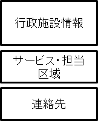
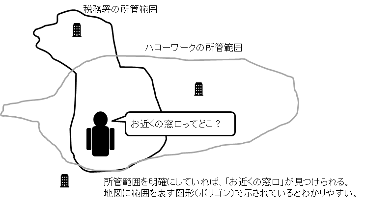
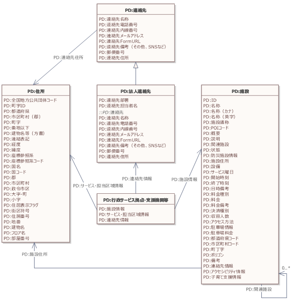

# 実装データモデル（行政） 行政サービス拠点・支援機関等 <!-- omit in toc -->

デジタル社会推進実践ガイドブック DS-451-7

2022年（令和4年）3月31日

デジタル庁

-----
**[キーワード]**

支援機関、行政サービス、行政サービス拠点、学校

**[概要]**

行政サービスや支援機関の情報を地域に応じて提供するサービスを作る際に参照すべき実践的ガイド。行政サービスや各種支援では、行政サービス区域、管轄区域を設定している場合があり、個人や法人に適切な行政サービス情報、支援情報を届けるためにはこれらの情報を管理する必要があります。このガイドに従いデータ設計を行うことで、受付や相談窓口の案内などが容易かつ正確に行えるようになります。

-----
## 改訂履歴 <!-- omit in toc -->

| 改訂年月日    | 改訂箇所 | 改訂内容   |
|:--------------|:---------|:-----------|
| 2022年3月31日 | 全体     | 正式版決定 |
| 2021年6月4日  | -        | β版公開   |

## 目次 <!-- omit in toc -->
- [1. 背景と課題](#1-背景と課題)
  - [1.1. 背景](#11-背景)
  - [1.2. 課題](#12-課題)
  - [1.3. 投資対効果](#13-投資対効果)
- [2. 目的と概要](#2-目的と概要)
  - [2.1. 目的](#21-目的)
  - [2.2. 概要](#22-概要)
    - [2.2.1. 行政境界](#221-行政境界)
    - [2.2.2. ポリゴン](#222-ポリゴン)
- [3. データ](#3-データ)
  - [3.1. データモデルの全体概要図（クラス図）](#31-データモデルの全体概要図クラス図)
  - [3.2. データモデルの項目定義](#32-データモデルの項目定義)
- [4. 事例](#4-事例)
    - [4.0.1. 施設情報（コアデータモデル施設型）](#401-施設情報コアデータモデル施設型)
    - [4.0.2. サービス・担当区域情報（コアデータモデル住所型）](#402-サービス担当区域情報コアデータモデル住所型)
    - [4.0.3. 連絡先（コアデータモデル連絡先型）](#403-連絡先コアデータモデル連絡先型)
- [5. 解説](#5-解説)
  - [5.1. データ標準](#51-データ標準)
  - [5.2. 行政サービス拠点種別](#52-行政サービス拠点種別)
- [6. 付録](#6-付録)

-----
## 1. 背景と課題

### 1.1. 背景

行政機関は、サービスを的確かつ効率的に行うために、サービス提供の対象地域を支所等毎に定めている場合があります。この情報が様々な機関で独自の形態で管理されているため、行政サービスを受けるときや、届出をするときに、どこに行けばよいかわからないことがあります。

行政サービスガイドや支援制度ガイド等を作成するときにも、参照しているサービスの問い合わせ先に、「お近くの○○事務所にお問い合わせください」という案内がされている場合があり、個人や法人向けにカスタマイズした情報を提供する妨げになっていました。

### 1.2. 課題

行政サービス範囲は組織毎に異なり、市区町村などの行政境界と違う場合もあるため、行政サービス情報を提供する情報データベースなどを作成しても的確に連絡先を案内することができませんでした。

行政サービス範囲は、地方公共団体の境界だけでなく、法務局のように広範な地域を対象にする場合もありますし、学区のように小地域を対象にしている場合もありますが、いずれにしてもワンストップサービスなどを行うために範囲の明確化が求められています。

*   利用者にとっての課題
    *   どこに相談に行けばよいかわからない
    *   管轄外のサービス拠点に行くと、出直さなければならない
*   行政職員にとっての課題
    *   管轄外の利用者が来訪すると、その利用者に適した管轄の拠点を案内しなければならない
    *   一覧表で案内しているが、管轄区域外の問い合わせがくる

### 1.3. 投資対効果

申請者はこれまで、届出等を行うときに担当の窓口を検索する必要があり、別表を見る等、手間がかかっていました。

検索性を向上するためには、検索に適したデータ形式で情報を提供する必要があります。行政サービス範囲は各府省庁が従来から保有している情報となるため、データ標準化の対応に初期コストがかかりますが、その後はコストがかかりません。

利用者は、データが標準化されることで、担当している窓口や行政サービス拠点を迅速に探すことができ、時間とコストの節約になります。

-----
## 2. 目的と概要

### 2.1. 目的

行政サービスの利用者に的確に相談や手続の窓口を案内し、行政サービスや支援を迅速に提供することで、利用者の利便性の向上を図ることを目的にします。

### 2.2. 概要

行政サービス拠点の情報は、一般の行政施設情報にサービス・担当区域を追加したものになります。

<figure>

<figcaption> 図1　行政サービス拠点のデータ構造 </figcaption> </figure>

行政施設情報は、訪問に必要な名称、場所、利用可能時間で構成されます。
サービス・担当区域の記述方法にはいくつかの方法があります。

#### 2.2.1. 行政境界

都道府県、市区町村、町丁字を列挙することで行政サービス範囲を記述します。この方法はデータ作成が容易ですが、「霞が関1丁目（一部）」のような範囲設定があるときには正確に範囲を特定することができません。このような部分的な地域を含むときには、その地域名を記入し、備考で「一部」であることを明記します。

#### 2.2.2. ポリゴン

担当区域を地図上の範囲で示す方法です。自由に地域を書くことが可能で詳細に範囲を記述できますが、ポリゴン作成の手間がかかります。

連絡先は、行政施設の代表を記述するのではなく、相談が迅速にできるように担当課の連絡先を記入することが望まれます。

<figure>

<figcaption> 図2　行政サービス拠点の所管範囲のイメージ </figcaption> </figure>

-----
## 3. データ

### 3.1. データモデルの全体概要図（クラス図）

行政サービス拠点・支援機関等の実装データモデルの全体概要図は以下のとおりです。

<figure>

<figcaption> 図3 行政サービス拠点・支援機関等データモデルの全体構造図 </figcaption> </figure>

### 3.2. データモデルの項目定義

行政サービス拠点・支援機関等は、コアデータモデルを組み合わせることでシンプルにデータで表現することができます。

表1 行政サービス拠点・支援機関等のデータ項目

| 必須項目 | 項目名 | 説明 |
|:---|:---|:---|
| 必 | 施設情報 | 施設情報を記入。コアデータモデル「施設」を参照。 |
| 必 | サービス・担当区域情報 | サービス・担当区域情報を記入。コアデータモデル「住所」を参照。 |
| 必 | 連絡先情報 | 連絡先情報を記入。コアデータモデル「法人連絡先」を参照。 |

-----
## 4. 事例

武蔵野税務署を例にデータの事例を以下に示します。

#### 4.0.1. 施設情報（コアデータモデル施設型）

| 項目名 | 説明 |
|:---|:---|
| ID | 行政施設に一意のID |
| 名称 | 武蔵野税務署 |
| 名称（カナ） | ムサシノゼイムショ |
| 名称（英字） | Musashino Tax Office |
| POIコード | 1210 |
| 概要 | |
| 説明 | |
| 施設住所 | 東京都武蔵野市吉祥寺本町3-27-1（コアデータモデルの住所型:連結表記） |
| サービス曜日 | 月火水木金 |
| 開始時刻 | 08:30 |
| 終了時刻 | 17:00 |
| 日時備考 | 土曜日、日曜日、祝日及び年末年始（12月29日から1月3日）は執務を行っておりません |
| 料金種別 | 無料 |
| 連絡先情報 | 省略（コアデータモデル連絡先型） |

#### 4.0.2. サービス・担当区域情報（コアデータモデル住所型）

| 項目名 | 説明 |
|:---|:---|
| 全国地方公共団体コード | 130001 |
| 都道府県 | 東京都 |
| 市区町村（郡） | 武蔵野市,三鷹市,小金井市 |

#### 4.0.3. 連絡先（コアデータモデル連絡先型）

| 項目名 | 説明 |
|:---|:---|
| 連絡先名称 | （本資料では省略） |
| 連絡先電話番号 | 0422-53-1311 |
| 連絡先内線番号 | |
| 連絡先メールアドレス | （本資料では省略） |
| 連絡先FormURL | （本資料では省略） |
| 連絡先備考（その他、SNSなど） | https://www.nta.go.jp/about/organization/tokyo/location/tokyo/musashino/ |

-----
## 5. 解説

### 5.1. データ標準

デジタル庁が公開するGIF(Government Interoperability Framework)コアデータモデルの住所、施設、連絡先を参照して作成しています。

### 5.2. 行政サービス拠点種別

行政サービス拠点の種別には、観光施設、公共施設など地理的目標物（Point Of Interest）に対する分類コードである行政基本情報データ連携モデルのPOIコード[^1]を使用します。POIコードの詳細についてはコアデータモデル施設もあわせて参照してください。以下に、国の機関のPOIコードを示します。
| POIコード |POI | 解説|
|:---|:---|:---|
| 1201 | 官公署 | 官公署 |
| 1202 | 合同庁舎 | 合同庁舎 |
| 1203 | 検察庁 | 検察庁 |
| 1204 | 裁判所 | 裁判所 |
| 1205 | 法務局 | 法務局 |
| 1206 | 法テラス | 法テラス |
| 1207 | 公証役場 | 公証役場 |
| 1208 | 出入国管理局 | 出入国管理局 |
| 1209 | 税関 | 税関 |
| 1210 | 税務署 | 税務署 |
| 1211 | 警察署 | 警視庁、道府県警察本部及び警察法による警察署 |
| 1212 | 交番 | 警察法による交番その他の派出所及び駐在所 |
| 1213 | 運転免許試験場 | 運転免許試験場 |
| 1214 | 消防署 | 消防組織法による消防署をいう |
| 1215 | 消防署分署 | 支署、出張所及び分遣所 |
| 1216 | 郵便局 | 普通郵便局、特定郵便局及び簡易郵便局。分室及び常設の出張所 |
| 1217 | 森林管理署 | 森林管理署 |
| 1218 | 気象台 | 気象台 |
| 1219 | 職業安定所 | 職業安定所 |
| 1220 | 労働基準監督署 | 労働基準監督署 |
| 1221 | 社会保険事務所 | 社会保険事務所 |
| 1222 | 矯正施設 | 刑務所、少年院　等 |
| 1223 | 自衛隊・米軍 | 自衛隊・米軍 |
| 1224 | 外国公館 | 外国が日本に設置している大使館、公使館及び領事館 |
| 1299 | その他国の機関 | 　 |

中小企業向けの支援機関にはPOIコードが設定されていないため、以下の分類を使用してください。

| POIコード |POI | 解説|
|:---|:---|---|
| C0001 | 金融機関 | |
| C0002 | 中小企業支援センター | |

以下に、地方行政に関するPOIコードを示します。

| POIコード |POI | 解説|
|:---|:---|:---|
| 1301 | 県庁 | 県庁 |
| 1302 | 市役所・東京都の区役所 | 市役所及び東京都の区役所 |
| 1303 | 町村役場・政令指定都市の区役所 | 町村役場及び政令指定都市の区役所 |
| 1304 | 役場支所及び出張所 | 市・特別区・町・村・指定都市の区の役場支所及び出張所 |
| 1305 | 市民活動施設 | 市民活動施設 |
| 1306 | 産業支援施設 | 産業支援施設 |
| 1307 | 公民館 | 公民館 |
| 1308 | 公会堂 | 公会堂 |
| 1309 | 集会施設 | 集会施設 |
| 1399 | その他行政サービス施設 | 　 |

以下に、対象者に地域性のある代表的な機関に関するPOIコードを示します。

| POIコード |POI | 解説|
|:---|:---|:---|
| 1402 | 保育園 | 保育園、保育所、託児所。日日保護者の委託を受けて，乳児又は幼児を保育する福祉事業を行う施設 |
| 1403 | 児童館（児童センター） | 児童館（児童センター） |
| 1404 | 学童保育クラブ | 学童保育クラブ |
| 1405 | 認定こども園 | 認定こども園 |
| 1406 | 児童相談所 | 児童相談所 |
| 1407 | 福祉事務所 | 都道府県、市町村及び特別区が設置する福祉に関する事務所 |
| 1408 | 老人ホーム | 特別養護老人ホーム、介護老人福祉施設、有料老人ホーム　等 |
| 1409 | 老人通所・短期入所介護施設 | 老人デイサービスセンター、老人短期入所施設、小規模多機能型居宅介護事業所　等。要介護者等を通所又は短期入所させ、介護等の日常生活上の世話や機能訓練を行う事業所 |
| 1499 | その他の社会福祉施設 | 　 |
| 1501 | 幼稚園 | 幼稚園 |
| 1502 | 学校 | 学校の総称 |
| 1503 | 小学校 | 小学校 |
| 1504 | 中学校 | 中学校 |
| 1505 | 高等学校・中等教育学校 | 高等学校・中等教育学校 |
| 1514 | 職業・教育支援施設 | 大学校、研修センター　等。官公庁、企業若しくは事業所が業務遂行のため所属職員等を対象として教育・研修を行う事業所又は官公庁、企業若しくは事業所からの委託を受けて業務遂行のため所属職員等の教育・研修を行う施設 |
| 1606 | 保健所 | 地域保健法による保健所。支所、出張所等は含まない |
| 2004 | 廃棄物処理施設 | 廃棄物処理施設 |
| 2005 | 資源回収所 | 資源回収所 |
| 2006 | ごみ焼却場 | ごみ焼却場 |
| 2009 | 火葬場 | 火葬場 |
| 2010 | 墓地 | 墓地 |
| 2201 | 避難施設 | 避難施設 |
| 2202 | 避難場所 | 避難場所 |
| 2203 | 津波避難施設 | 津波避難施設 |
| 2205 | 給水所 | 給水所 |

上記以外のPOIコードは、別添の「491-3-1_POIコード表.xlsx」、および解説書として「491-3_コード_POIコード.docx」を参照してください。

-----
## 6. 付録

全体概要図として掲載したクラス図について、大きなサイズのものは別添の「451-7-1_行政サービス拠点・支援機関等データモデル_クラス図.pdf」を参照してください。

また、本文書に掲載していないPOIコードの全体については、別添の「491-3-1_POIコード表.xlsx」を参照してください。

[^1]: https://cio.go.jp/guides

