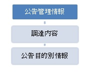

# 実装データモデル（行政）  調達 <!-- omit in toc -->

デジタル社会推進実践ガイドブック DS-451-8

2022年（令和4年）3月31日

デジタル庁

-----
**[キーワード]**

調達

**[概要]**

行政の調達情報のデータモデルを示すガイドブック。このガイドを参照して情報の提供を行うことで、組織横断での情報検索を容易にすることができます。

-----
## 改訂履歴 <!-- omit in toc -->

| 改訂年月日| 改訂箇所 | 改訂内容|
|---|-----|------|
| 2022年3月31日 | - | 行政サービス・データ連携モデル「調達」の書式を変更し、解説を加えた。 |

-----
## 目次 <!-- omit in toc -->

- [1. 背景と課題](#1-背景と課題)
  - [1.1. 背景](#11-背景)
  - [1.2. 課題](#12-課題)
  - [1.3. 投資対効果](#13-投資対効果)
- [2. 目的と概要](#2-目的と概要)
  - [2.1. 目的](#21-目的)
  - [2.2. 概要](#22-概要)
    - [2.2.1. 入札公告](#221-入札公告)
    - [2.2.2. 調達予定の公告](#222-調達予定の公告)
    - [2.2.3. 落札公告](#223-落札公告)
    - [2.2.4. 訂正公告](#224-訂正公告)
    - [2.2.5. 関連参加資格等の公告](#225-関連参加資格等の公告)
  - [2.3. 調達データの構造](#23-調達データの構造)
- [3. データ](#3-データ)
  - [3.1. 公告管理情報](#31-公告管理情報)
  - [3.2. 入札公告](#32-入札公告)
  - [3.3. 調達予定の公告](#33-調達予定の公告)
  - [3.4. 落札公告](#34-落札公告)
  - [3.5. 訂正公告](#35-訂正公告)
  - [3.6. 関連参加資格等の公告](#36-関連参加資格等の公告)
- [4. 事例](#4-事例)
  - [4.1. 官報　（国立印刷局）](#41-官報国立印刷局)
  - [4.2. 調達ポータル　（総務省）](#42-調達ポータル総務省)
  - [4.3. 官公需情報ポータルサイト　（中小企業庁）](#43-官公需情報ポータルサイト中小企業庁)
  - [4.4. 入札情報サービス（統合PPI）　（JACIC）](#44-入札情報サービス統合ppijacic)
- [5. 解説](#5-解説)
  - [5.1. データ標準（参考とした情報）](#51-データ標準参考とした情報)
  - [5.2. コード](#52-コード)
    - [5.2.1. 品目コード](#521-品目コード)
    - [5.2.2. 調達機関コード](#522-調達機関コード)
-----
## 1. 背景と課題

### 1.1. 背景

行政機関は国内最大の調達機関であり、その調達情報は国内外から広く公開が求められています。そのため、政府の調達情報は官報に公示され、地方自治体の調達情報は公報に公示されます。

調達情報電子化は長年取り組まれており、1994年に調達に関する官報に掲載される主要事項の様式が政府調達関連省庁の事務連絡で決められるとともに、1997年に行政情報化推進基本計画で調達の電子化の推進が決められました。さらに、1998年10月に「高度情報通信社会推進に向けた基本方針」で公共工事の調達システムの推進が決められ、同年12月に内閣総理大臣直轄タスクフォースであるバーチャルエージェンシーを設置して物品・役務の政府調達手続きの電子化を集中的に検討しました。

2002年には電子入札コアシステム 開発コンソーシアムによる電子入札コアシステムが開発され、日本主導でUN/CEFACTに調達データの標準化を提案してきました。また、国の工事に関しては入札情報サービス（i-ppi）や電子調達システム（政府電子調達（GEPS））が提供され、独立行政法人や地方公共団体の調達情報を集める仕組みとして、2009年に官公需情報ポータルサイトが開設されています。

しかし、国の情報は工事と物品・役務に分かれ、地方公共団体とも統一されていないなど収集、集約することが困難でした。また、調達システムとは別に官報への入稿を別途行う必要があるなど行政内の手続きも見直されてきませんでした。

### 1.2. 課題

各機関や複数の集約サイトで調達情報を公開しているため、事業者からは、調達情報を一元的に公開してほしいとの要望が多く寄せられています。

*   国の調達実施者にとっての課題
    *   多くの調達参加者に参加してもらいたい
    *   調達事務を簡単にしたい
*   自治体の調達実施者にとっての課題
    *   多くの調達参加者に参加してもらいたい
*   調達システム担当者にとっての課題
    *   現行システムの維持でていっぱい
*   官報担当者にとっての課題
    *   デジタル時代に合った見直しが必要
*   調達情報の利用者にとっての課題
    *   調達情報が様々なところにあり探しにくい
    *   ビジネスチャンスがつかめない
    *   民間の集約サービスが有料である
*   海外の調達情報の利用者にとっての課題
    *   調達情報が見つからない

### 1.3. 投資対効果

調達データを統一することで、国内の調達案件を一元的に探すことができ、ビジネスチャンスが広がります。調達実施者は業務の効率化ができます。様々な調達システムでの重複投資が削減されます。

## 2. 目的と概要

### 2.1. 目的

国内最大の調達機関である行政機関の調達情報を利用しやすくすることは、多様な参加者が調達に参加しやすくなり競争が促進されるとともに、優良な企業が調達を通じて成長できる機会を提供することができます。

本データモデルを使うことで調達情報を正しく素早く検索できるようにすることを目的としています。

### 2.2. 概要

調達データにはいくつかのデータモデルがあります。また、物品・役務と工事ではデータの一部に差異があることがあります。また、公告は日本語だけでなく英語での公告が求められる場合もあります。

#### 2.2.1. 入札公告

行政機関が調達を行うときに入札の公告をします。

#### 2.2.2. 調達予定の公告

今後の調達予定に関して公告をします。

#### 2.2.3. 落札公告

調達の落札者に関して、法人名や落札金額などを公告します。

#### 2.2.4. 訂正公告

公告内容に変更があった場合に公告します。

#### 2.2.5. 関連参加資格等の公告

関連資格を取得した法人などに関して公告します。

### 2.3. 調達データの構造

調達データは、調達公告に関する公告管理情報と調達内容、公告目的別情報により構成されます。

<figure>

<figcaption> 図 1　調達データの構造 </figcaption> </figure>

## 3. データ

### 3.1. 公告管理情報

全ての公告に共通で使用される管理情報です。この項目の後ろに調達内容、公告目的別情報が付加されます。

| |データ項目名 |英語表記 |説明 |備考 |
|:---|:---|:---|:---|:---|
|公告内容|公示種別 |Procedure_type |一般競争入札等の公示の種別を記入。 | |
|公告内容|カテゴリー |Category |物品役務、工事等のカテゴリーを記入。 | |
|公告内容|公示日 |CFT_issue_date |公示日を記入。YYYY-MM-DD | |
|公告内容|契約担当官 |Official |契約担当官名を記入 | |
|公告内容|調達機関コード |Contract_folder_ID |調達機関番号を記入（国の機関の場合。その他の機関は法人番号を記入。）| |
|公告内容|組織名 |Organization_name |調達組織名を記入 | |
|公告内容|機関種別名 |Organization_type |国または地方公共団体を記入 | |
|公告内容|都道府県市町村コード |Lg_code |調達機関の所在地コードを記入 | |
|公告内容|入札公告番号 |CFT_ID |入札公告に関する一意のIDを記入 | |
|公告内容|号番号（上記IDと合わせて一意）|CFT_sub_ID |入札公告番号に枝番があるときに記入 |物品・役務の調達時のみ使用|
|公告内容|訂正・取消区分 |Revised_type |変更や取消広告の時に記入 |物品・役務の調達時のみ使用|
|公告内容|区分 |Revised_sub_type |変更や取消広告の時に記入 |物品・役務の調達時のみ使用|
|公告内容|変更公示ID |Revised_CFT_ID |公告に変更した時の関連公示のIDを記入 |物品・役務の調達時のみ使用|

### 3.2. 入札公告

入札の公告の場合、公告管理情報に付加する調達情報です。

| 　 | データ項目名 | 英語表記 | 説明 | 備考 |
|:---|:---|:---|:---|:---|
| 調達内容 | 品目分類番号 | Item_code | 品目分類番号を記入 | 　 |
|調達内容| 件名 | Project_name | 公告の件名を記入 | 　 |
|調達内容| 件名(英語) | Project_name_en | 公告の件名の英語名を記入 | 物品・役務の調達時のみ使用 |
|調達内容| 数量 | Quantity | 公告対象の数量を記入 | 物品・役務の調達時のみ使用 |
|調達内容| 単位 | Unit | 数量の単位を記入 | 物品・役務の調達時のみ使用 |
|調達内容| 公告 | Project_description | 公告の内容を記入 | 　 |
|調達内容| 納入期限日 | Period_end_time | 納入期限を記入YYYY-MM-DD | 物品・役務の調達時のみ使用 |
|調達内容| 納入期限日備考 | Period_end_note | 納入期限に関する備考を記入 | 　 |
|調達内容| 履行期間 | Period_detail | サービスや工事の履行期間を記入 | 　 |
|調達内容| 履行場所 | Location | サービスや工事の履行場所を記入 | 　 |
|調達内容| 入札方法 | Tender_type | 入札方式を記入 | 　 |
|調達内容| 追加工事 | Additional_contract | 追加工事の内容を記入 | 建設工事の時のみ記入 |
|調達内容| 工事実施形態 | Construction_type | 公示実施形態を記入 | 建設工事の時のみ記入 |
| 資格 | 参加資格 | Certification | 参加資格を記入 | 　 |
|資格| 参加資格種類 | Certification_type | 参加資格の種類を記入 | 物品・役務の調達時のみ使用 |
|資格| 参加希望地域 | Certification_area | 参加の希望地域を記入 | 物品・役務の調達時のみ使用 |
|資格| 参加者条件 | Participant_note | 参加者に条件があるときに記入 | 　 |
| 申請書 | 申請書提出郵便番号 | Postal_code_for_proposal | 提出先の郵便番号を記入 | 建設工事の時のみ記入 |
|申請書| 申請書提出住所 | Address_for_proposal | 提出先の住所を記入 | 建設工事の時のみ記入 |
|申請書| 申請書提出組織 | Organization_for_proposal | 提出先の組織名を記入 | 建設工事の時のみ記入 |
|申請書| 申請書提出担当者 | Official_for_proposal | 提出先の担当者名を記入 | 建設工事の時のみ記入 |
|申請書| 申請書提出電話番号 | TEL_for_proposal | 提出先の電話番号を記入 | 建設工事の時のみ記入 |
|申請書| 申請書提出方法 | Submit_type_for_proposal | 提出方法を記入 | 建設工事の時のみ記入 |
| 入札 | 入札書提出郵便番号 | Postal_code_for_tender | 提出先の郵便番号を記入 | 　 |
|入札| 入札書提出住所 | Address_for_tender | 提出先の住所を記入 | 　 |
|入札| 入札書提出組織 | Organization_for_tender | 提出先の組織名を記入 | 　 |
|入札| 入札書提出担当者 | Official_for_tender | 提出先の担当者名を記入 | 　 |
|入札| 入札書提出電話番号 | TEL_for_tender | 提出先の電話番号を記入 | 　 |
|入札| 契約条項を示す場所 | Location_for_providing_contract_condition | 契約事項を示す場所を記入 | 　 |
|入札| 入札説明書交付場所 | Location_for_CFT_info | 入札説明書の場所を記入 | 　 |
|入札| 公告問合せ先 | Contact_point_for_the_notice | 公告の問い合わせ先を記入 | 　 |
|入札| 入札説明書交付方法 | Distribution_type_for_CFT_info | 入札説明書の交付方法を記入 | 　 |
|入札| 説明会日時 | Explanatory_meeting_date_for_CFT_info | 説明会の日時を記入 | 　 |
|入札| 説明会場所 | Explanatory_meeting_location_for_CFT_info | 説明会の場所を記入 | 　 |
|入札| 入札期限日 | Tender_submission_deadline | 入札期限の日を記入 | 　 |
|入札| 入札書提出方法 | Submit_type_for_tender | 入札書提出方法を記入 | 　 |
| 開札 | 開札日 | Opening_tenders_event | 開札日を記入 | 　 |
| 開札| 開札場所 | Opening_tenders_location | 開札場所を記入 | 　 |
| その他 | 言語 | Language | 使用する言語を記入 | 　 |
|その他| 通貨 | Currency | 使用する通貨を記入 | 　 |
|その他| 入札保証金 | Security_money_for_tender | 入札保証金の額を記入 | 　 |
|その他| 契約保証金 | Security_money_for_contract | 契約保証金の額を記入 | 　 |
|その他| 入札者に要求される事項 | Terms_for_tender | 入札者に要求される事項を記入 | 　 |
|その他| 入札の無効 | Terms_of_invalidation | 入札の無効の条件を記入 | 　 |
|その他| 契約書作成の要否 | Draw_up_contract | 契約書作成の要否を記入 | 　 |
|その他| 落札者の決定方法 | Criterion_description | 落札者の決定方法を記入 | 　 |
|その他| 配置予定技術者の確認 | Specialist | 配置予定技術者の確認を記入 | 　 |
|その他| 手続きにおける交渉の有無 | Negotiation_process | 手続きにおける交渉の有無を記入 | 　 |
|その他| 電子調達システムの利用 | Etendering | 電子調達システムの利用 | 　 |
|その他| その他 | Additional_info | その他記述内容を記入 | 　 |
|その他| 一般競争参加資格の認定を受けていない者の参加 | No_cirtification_company | 一般競争参加資格の認定を受けていない者の参加の可否を記入 | 　 |
|その他| 詳細 | Detail | 詳細を記入 | 　 |
|その他| 公告情報（url） | External_document_uri | 公告情報（url）を記入 | 　 |

### 3.3. 調達予定の公告

調達予定の公告の場合、公告管理情報に付加する調達情報です。

| 　 | データ項目名 | 英語表記 | 説明 | 備考 |
|:---|:---|:---|:---|:---|
| 調達内容 | 品目分類番号 | Item_code | 品目分類番号を記入 | 　 |
|調達内容| 件名 | Project_name | 公告の件名を記入 | 　 |
|調達内容| 件名(英語) | Project_name_en | 公告の件名の英語名を記入 | 物品・役務の調達時のみ使用 |
|調達内容| 数量 | Quantity | 公告対象の数量を記入 | 物品・役務の調達時のみ使用 |
|調達内容| 単位 | Unit | 数量の単位を記入 | 物品・役務の調達時のみ使用 |
| 予定内容 | 入札公告（公示）の予定時期 | Schedule | 入札公告（公示）の予定時期を記入 | 　 |
|予定内容 | 予定価格 | Estimated_price | 予定価格を記入 | 　 |

### 3.4. 落札公告

落札の公告の場合、公告管理情報に付加する調達情報です。

| |データ項目名 |英語表記 |説明 |備考 |
|:---|:---|:---|:---|:---|
|公告内容 |公示種別 |Procedure_type |一般競争入札等の公示の種別を記入。 | |
|公告内容|カテゴリー |Category |物品役務、工事等のカテゴリーを記入。 | |
|公告内容|公示日 |CFT_issue_date |公示日を記入。YYYY-MM-DD | |
|公告内容|契約担当官 |Official |契約担当官名を記入 | |
|公告内容|調達機関コード |Contract_folder_ID |調達機関番号を記入（国の機関の場合。その他の機関は法人番号を記入。）| |
|公告内容|組織名 |Organization_name |調達組織名を記入 | |
|公告内容|機関種別名 |Organization_type |国または地方公共団体を記入 | |
|公告内容|都道府県市町村コード |Lg_code |調達機関の所在地コードを記入 | |
|公告内容|入札公告番号 |CFT_ID |入札公告に関する一意のIDを記入 | |
|公告内容|号番号（上記IDと合わせて一意）|CFT_sub_ID |入札公告番号に枝番があるときに記入 |物品・役務の調達時のみ使用|
|公告内容|訂正・取消区分 |Revised_type |変更や取消広告の時に記入 |物品・役務の調達時のみ使用|
|公告内容|区分 |Revised_sub_type |変更や取消広告の時に記入 |物品・役務の調達時のみ使用|
|公告内容|変更公示ID |Revised_CFT_ID |公告に変更した時の関連公示のIDを記入 |物品・役務の調達時のみ使用|
|調達内容 |品目分類番号 |Item_code |品目分類番号を記入 | |
|調達内容|件名 |Project_name |公告の件名を記入 | |
|調達内容|件名(英語) |Project_name_en |公告の件名の英語名を記入 |物品・役務の調達時のみ使用|
|調達内容|数量 |Quantity |公告対象の数量を記入 |物品・役務の調達時のみ使用|
|調達内容|単位 |Unit |数量の単位を記入 |物品・役務の調達時のみ使用|
|　落札内容|調達方法 |Procurement_method |調達方法を記入 | |
|落札内容|契約方式 |Contract_type |契約方式を記入 | |
|落札内容|落札者 |Award_party |落札者を記入 | |
|落札内容|落札者法人番号 |JCN |法人番号を記入 | |
|落札内容|落札者氏名 |Award_party_name |落札者氏名を記入 | |
|落札内容|落札者住所 |Award_party_address|落札者住所を記入 | |
|落札内容|落札価格 |Award_price |落札価格を記入 | |
|落札内容|随意契約理由 |Award_discription |随意契約理由を記入 | |
|落札内容|指名業者名 |Candidate_name |指名業者名を記入 | |
|落札内容|落札方式 |Evaluation_type |落札方式を記入 | |
|落札内容|予定価格 |Estimate_price |予定価格を記入 | |

### 3.5. 訂正公告

訂正の公告の場合、公告管理情報に付加する調達情報です。

| 　 | データ項目名 | 英語表記 | 説明 | 備考 |
|:---|:---|:---|:---|:---|
| 調達内容 | 品目分類番号 | Item_code | 品目分類番号を記入 | 　 |
| 調達内容 | 件名 | Project_name | 公告の件名を記入 | 　 |
| 調達内容 | 件名(英語) | Project_name_en | 公告の件名の英語名を記入 | 物品・役務の調達時のみ使用 |
| 調達内容 | 数量 | Quantity | 公告対象の数量を記入 | 物品・役務の調達時のみ使用 |
| 調達内容 | 単位 | Unit | 数量の単位を記入 | 物品・役務の調達時のみ使用 |
| 訂正内容 | 訂正項目 | Correction_item | 訂正項目を記入 | 　 |
| 訂正内容 | 訂正前情報 | Original_info | 訂正前情報を記入 | 　 |
| 訂正内容 | 訂正後情報 | Revised_info | 訂正後情報を記入 | 　 |

### 3.6. 関連参加資格等の公告

関連参加資格等の公告の場合、公告管理情報に付加する調達情報です。

| 　 | データ項目名 | 英語表記 | 説明 | 備考 |
|:---|:---|:---|:---|:---|
| 調達内容 | 品目分類番号 | Item_code | 品目分類番号を記入 | 　 |
| 調達内容 | 件名 | Project_name | 公告の件名を記入 | 　 |
| 調達内容 | 件名(英語) | Project_name_en | 公告の件名の英語名を記入 | 物品・役務の調達時のみ使用 |
| 調達内容 | 数量 | Quantity | 公告対象の数量を記入 | 物品・役務の調達時のみ使用 |
| 調達内容 | 単位 | Unit | 数量の単位を記入 | 物品・役務の調達時のみ使用 |
| 参加資格内容 | 関連資格 | Qualify | 関連資格を記入 | 　 |
| 参加資格内容 | 必須参加資格 | Indispensable_qualify | 必須参加資格を記入 | 　 |
| 参加資格内容 | 関連参加資格 | Rerated_qualify | 関連参加資格を記入 | 　 |
| 参加資格内容 | その他条件 | Condition | その他条件を記入 | 　 |

## 4. 事例

行政機関の調達情報は既に様々な形式、流通経路で提供が行われています。それぞれのデータ項目は別表「451-9-2_別表各種調達標準の比較.xlsx」に示します。　

### 4.1. 官報　（国立印刷局）

官報で政府の調達情報の提供を行っています。

https://kanpou.npb.go.jp/index.html

### 4.2. 調達ポータル　（総務省）

政府の物品調達や役務の提供などの調達情報を一元的に提供しています。APIによる情報提供も行っています。

https://www.p-portal.go.jp/pps-web-biz/UZA01/OZA0101

### 4.3. 官公需情報ポータルサイト　（中小企業庁）

政府と自治体の調達情報を各組織のWebサイトなどから収集し、一元的に提供しています。APIによる情報提供も行っています。

https://kkj.go.jp/s/

### 4.4. 入札情報サービス（統合PPI）　（JACIC）

自治体にパッケージでサービスを提供することにより、自治体による調達情報の提供を支援しています。

https://www.i-ppi.jp/Search/Web/Index.htm

## 5. 解説

### 5.1. データ標準（参考とした情報）

別表「451-9-2_別表各種調達標準の比較.xlsx」の右表が参考にした手続等の情報、左表が参考情報を元に新たに定義した様式・語彙であり、参考元との対応を示しています。

* 平成7年「「政府調達に関する協定」等に基づく入札公告等の官報掲載方法
* 官報　（国立印刷局）
* 調達総合情報システム　（総務省）
* 官公需サイト　（中小企業庁）
* 入札情報サービス（統合PPI）　（JACIC）
* CEN BII（EESPA）
* UN/CEFACT BRS　（UNECE）
* 政府公共調達データベース　（JETRO）
* GSA　（米国）
* TED　（EU）

### 5.2. コード

#### 5.2.1. 品目コード

全省庁統一資格の営業品目のコードと政府調達の品目分類のコードがある。法人関係情報を一元的に提供しているｇBizInfoでは以下のように日本標準産業分類とマッピングして使用している。

* 産業分類参考情報　情報源

総務省 日本標準産業分類 2017年1月19日

http://www.soumu.go.jp/toukei_toukatsu/index/seido/sangyo/

総務省 全省庁統一資格　営業品目 2017年1月19日

https://www.chotatujoho.go.jp/va/com/eigyo_hinmoku.html

内閣府 政府調達　品目分類 2017年1月19日

http://www.kantei.go.jp/jp/kanbou/20tyoutatu/dai4/dai4siryo1.pdf

| 日本標準産業分類（コード） | 日本標準産業分類（名称）| 政府統一資格情報（コード） |政府統一資格情報（名称） |営業品目名（コード） |営業品目名（名称） | 政府調達コード |品目分類名 |
|---|---|---|---|---|---|---|---|
| A0 | 農業，林業 | 　 | 　 | 　 | 　 | 　 | 　 |
| A1 | 農業 | 　 | 　 | 　 | 　 | 1 | 農水産品及び加工食品 |
| A2 | 林業 | 401 | 立木竹 | 　 | 　 | 89 | 林業及び木材伐出業に付随するサービス |
| B0 | 漁業 | 　 | 　 | 　 | 　 | 　 | 　 |
| B3 | 漁業（水産養殖業を除く） | 　 | 　 | 　 | 　 | 　 | 　 |
| B4 | 水産養殖業 | 　 | 　 | 　 | 　 | 　 | 　 |
| C0 | 鉱業，採石業，砂利採取業 | 　 | 　 | 　 | 　 | 2 | 鉱物性生産品 |
| C5 | 鉱業，採石業，砂利採取業 | 　 | 　 | 　 | 　 | 　 | 　 |
| D0 | 建設業 | 124 | 土木・建設・建築材料 | 224 | 土木・建設・建築材料 | 41 | 建設工事 |
| D6 | 総合工事業 | 　 | 　 | 　 | 　 | 　 | 　 |
| D7 | 職別工事業(設備工事業を除く) | 　 | 　 | 　 | 　 | 　 | 　 |
| D8 | 設備工事業 | 　 | 　 | 　 | 　 | 　 | 　 |
| E0 | 製造業 | 　 | 　 | 　 | 　 | 　 | 　 |
| E9 | 食料品製造業 | 　 | 　 | 　 | 　 | 1 | 農水産品及び加工食品 |
| E10 | 飲料・たばこ・飼料製造業 | 　 | 　 | 　 | 　 | 　 | 　 |
| E11 | 繊維工業 | 101 | 衣服・その他繊維製品類 | 201 | 衣服・その他繊維製品類 | 7 | かばん類並びに紡織用繊維及びその製品 |
| E12 | 木材・木製品製造業（家具を除く） | 　 | 　 | 　 | 　 | 6 | 木材及びその製品、製紙用原料並びに紙製品 |
| E13 | 家具・装備品製造業 | 114 | 家具・什器類 | 214 | 家具・什器類 | 23 | 家具等 |
| E14 | パルプ・紙・紙加工品製造業 | 109 | 紙・紙加工品類 | 209 | 紙・紙加工品類 | 6 | 木材及びその製品、製紙用原料並びに紙製品 |
| E14| パルプ・紙・紙加工品製造業 |  | | 225 | 造幣・印刷事業用原材料類 | 　 | 　 |
| E15 | 印刷・同関連業 | 105 | フォーム印刷 | 205 | フォーム印刷 | 76 | 出版及び印刷のサービス |
| E15| 印刷・同関連業| 106 | その他印刷類 | 206 | その他印刷類 | 　 | 　 |
| E15| 印刷・同関連業| 107 | 図書類 | 207 | 図書類 | 　 | 　 |
| E16 | 化学工業 | 　 | 　 | 　 | 　 | 3 | 化学工業の生産品 |
| E16| 化学工業 | 122 | 医薬品・医療用品類 | 222 | 医薬品・医療用品類 | 4 | 医療品及び医療用品 |
| E17 | 石油製品・石炭製品製造業 | 113 | 燃料類 | 213 | 燃料類 | 　 | 　 |
| E18 | プラスチック製品製造業（別掲を除く） | 102 | ゴム・皮革・ﾌﾟﾗｽﾁｯｸ製品類 | 202 | ゴム・皮革・ﾌﾟﾗｽﾁｯｸ製品類 | 5 | 人造樹脂、ゴム、皮革、毛皮及びこれらの製品 |
| E19 | ゴム製品製造業 | 102 | ゴム・皮革・ﾌﾟﾗｽﾁｯｸ製品類 | 202 | ゴム・皮革・ﾌﾟﾗｽﾁｯｸ製品類 | 5 | 人造樹脂、ゴム、皮革、毛皮及びこれらの製品 |
| E20 | なめし革・同製品・毛皮製造業 | 102 | ゴム・皮革・ﾌﾟﾗｽﾁｯｸ製品類 | 202 | ゴム・皮革・ﾌﾟﾗｽﾁｯｸ製品類 | 5 | 人造樹脂、ゴム、皮革、毛皮及びこれらの製品 |
| E21 | 窯業・土石製品製造業 | 103 | 窯業・土石製品類 | 203 | 窯業・土石製品類 | 8 | 石、セメント他これらに類する材料の製品、陶磁器製品、ガラス及びその製品 |
| E22 | 鉄鋼業 | | | | | 9 | 鉄鋼及びその製品 |
| E23 | 非鉄金属製造業 | 104 | 非鉄金属・金属製品類 | 204 | 非鉄金属・金属製品類 | 10 | 非鉄金属及びその製品 |
| E24 | 金属製品製造業 | 104 | 非鉄金属・金属製品類 | 204 | 非鉄金属・金属製品類 | 　 | 　 |
| E24 | 金属製品製造業 | | | 226 | 造幣事業用金属工芸品類 | | |
| E25 | はん用機械器具製造業 | 　 | 　 | 　 | 　 | 13 | 一般産業用機器 |
| E26 | 生産用機械器具製造業 | 115 | 一般・産業用機器類 | 215 | 一般・産業用機器類 | 11 | 動力発生用機器 |
| E27 | 業務用機械器具製造業 | 115 | 一般・産業用機器類 | 215 | 一般・産業用機器類 | 12 | 特定産業用機器 |
| E27 | 業務用機械器具製造業 | 120 | 事務用機器類 | 220 | 事務用機器類 | 14 | 事務用機器及び自動データ |
| E27 | 業務用機械器具製造業 | 123 | 事務用品類 | 223 | 事務用品類 | 　 | 　 |
| E27 | 業務用機械器具製造業 | 119 | 医療用機器類 | 219 | 医療用機器類 | 22 | 医療用又は獣医用機器 |
| E27 | 業務用機械器具製造業 | 122 | 医薬品・医療用品類 | 222 | 医薬品・医療用品類 | 31 | 医療器具機械 |
| E27 | 業務用機械器具製造業 | 　 | 　 | 　 | 　 | 32 | 医療用品 |
| E27 | 業務用機械器具製造業 | 　 | 　 | 　 | 　 | 33 | 歯科材料 |
| E27 | 業務用機械器具製造業 | | | | | 21 | 衛生用品、暖房器具及び照明器具 |
| E27 | 業務用機械器具製造業 | 　 | 　 | 　 | 　 | 24 | 化学用又は制御用の機器 |
| E27 | 業務用機械器具製造業 | 　 | 　 | 　 | 　 | 25 | 写真用機器、光学用品及び時計 |
| E27 | 業務用機械器具製造業 | 127 | 警察用装備品類 | 227 | 警察用装備品類 | 　 | 　 |
| E27 | 業務用機械器具製造業 | 128 | 防衛用装備品類 | 228 | 防衛用装備品類 | 　 | 　 |
| E28 | 電子部品・デバイス・電子回路製造業 | 118 | 精密機器類 | 218 | 精密機器類 | 　 | 　 |
| E29 | 電気機械器具製造業 | 116 | 電気・通信用機器類 | 216 | 電気・通信用機器類 | 16 | 電気機器及びその他の機械 |
|E29 | 電気機械器具製造業 | 　 | 　 | 　 | 　 | 21 | 衛生用品、暖房器具及び照明器具 |
| E30 | 情報通信機械器具製造業 | 116 | 電気・通信用機器類 | 216 | 電気・通信用機器類 | 28 | 電気通信機器 |
| E30 | 情報通信機械器具製造業 | 117 | 電子計算機類 | 217 | 電子計算機類 | | |
| E30 | 情報通信機械器具製造業 | | | | | 15 | 電気通信用機器及び音声録音再生機器 |
| E31 | 輸送用機械器具製造業 | 110 | 車両類 | 210 | 車両類 | 17 | 道路走行用車両 |
| E31 | 輸送用機械器具製造業 | 111 | その他輸送・搬送機械器具類 | 211 | その他輸送・搬送機械器具類 | 18 | 鉄道用車両及びその付属装置 |
| E31 | 輸送用機械器具製造業 | 　 | 　 | 　 | 　 | 19 | 航空機及びその付属装置 |
| E31 | 輸送用機械器具製造業 | 112 | 船舶類 | 212 | 船舶類 | 20 | 船舶及び浮き構造物 |
| E32 | その他の製造業 | 121 | その他機器類 | 221 | その他機器類 | 26 | その他物品 |
| E32 | その他の製造業 | 129 | その他 | 229 | その他 | 　 | 　 |
| E32 | その他の製造業 | 315 | その他 | 　 | 　 | 　 | 　 |
| E32 | その他の製造業 | 402 | その他 | 　 | 　 | 　 | 　 |
| F0 | 電気・ガス・熱供給・水道業 | 　 | 　 | 　 | 　 | 　 | 　 |
| F33 | 電気業 | 　 | 　 | 　 | 　 | 　 | 　 |
| F34 | ガス業 | 　 | 　 | 　 | 　 | 　 | 　 |
| F35 | 熱供給業 | 　 | 　 | 　 | 　 | 　 | 　 |
| F36 | 水道業 | 　 | 　 | 　 | 　 | 　 | 　 |
| G0 | 情報通信業 | 　 | 　 | 　 | 　 | 　 | 　 |
| G37 | 通信業 | 　 | 　 | 　 | 　 | 29 | 電気通信機器に係るサービス |
| G37 | 通信業 | 　 | 　 | 　 | 　 | 30 | 電気通信分野のその他のサービス |
| G38 | 放送業 | 　 | 　 | 　 | 　 | 　 | 　 |
| G39 | 情報サービス業 | 304 | 情報処理 | 　 | 　 | 27 | コンピュータ・サービス |
| G39 | 情報サービス業 | 　 | 　 | 　 | 　 | 64 | 電子データ交換 |
| G39 | 情報サービス業 | 　 | 　 | 　 | 　 | 65 | 高度ファクシミリ・サービス |
| G39 | 情報サービス業 | 　 | 　 | 　 | 　 | 66 | コード及びプロトコルの変換 |
| G39 | 情報サービス業 | 　 | 　 | 　 | 　 | 67 | 情報及びデータのオンラインでの処理 |
| G39 | 情報サービス業 | 306 | ソフトウェア開発 | 　 | 　 | 71 | 電子計算機サービス及び関連のサービス |
| G40 | インターネット附随サービス業 | 　 | 　 | 　 | 　 | 61 | 電子メール |
| G40 | インターネット附随サービス業 | 　 | 　 | 　 | 　 | 62 | ボイスメール |
| G40 | インターネット附随サービス業 | 　 | 　 | 　 | 　 | 63 | 情報及びデータベースのオンラインでの検索 |
| G41 | 映像・音声・文字情報制作業 | 　 | 　 | 　 | 　 | 94 | 映画及びビデオテープの制作及び配給のサービス |
| G41 | 映像・音声・文字情報制作業 | 108 | 電子出版物類 | 208 | 電子出版物類 | 　 | 　 |
| G41 | 映像・音声・文字情報制作業 | 313 | 電子出版 | 　 | 　 | 　 | 　 |
| H0 | 運輸業，郵便業 | 　 | 　 | 　 | 　 | 　 | 　 |
| H42 | 鉄道業 | 310 | 運送 | 　 | 　 | 53 | その他の陸上運送サービス |
| H42 | 鉄道業 | 　 | 　 | 　 | 　 | 57 | 貨物運送取扱いサービス |
| H43 | 道路旅客運送業 | 　 | 　 | 　 | 　 | 53 | その他の陸上運送サービス |
| H44 | 道路貨物運送業 | 310 | 運送 | 　 | 　 | 53 | その他の陸上運送サービス |
| H44 | 道路貨物運送業 | 　 | 　 | 　 | 　 | 57 | 貨物運送取扱いサービス |
| H44 | 道路貨物運送業 | 　 | 　 | 　 | 　 | 74 | 装甲車による運送サービス |
| H45 | 水運業 | 310 | 運送 | 　 | 　 | 54 | 運転者を伴う海上航行船舶の賃貸サービス |
| H45 | 水運業 | 　 | 　 | 　 | 　 | 55 | 海上航行船舶以外の船舶の賃貸サービス |
| H45 | 水運業 | 　 | 　 | 　 | 　 | 57 | 貨物運送取扱いサービス |
| H46 | 航空運輸業 | 310 | 運送 | 　 | 　 | 56 | 航空運送サービス |
| H46 | 航空運輸業 | 　 | 　 | 　 | 　 | 57 | 貨物運送取扱いサービス |
| H47 | 倉庫業 | 　 | 　 | 　 | 　 | 　 | 　 |
| H48 | 運輸に附帯するサービス業 | 310 | 運送 | 　 | 　 | 88 | こん包サービス |
| H49 | 郵便業（信書便事業を含む） | 　 | 　 | 　 | 　 | 58 | クーリエ・サービス |
| I0 | 卸売業，小売業 | 　 | 　 | 　 | 　 | 　 | 　 |
| I50 | 各種商品卸売業 | 　 | 　 | 　 | 　 | 　 | 　 |
| I51 | 繊維・衣服等卸売業 | 　 | 　 | 　 | 　 | 　 | 　 |
| I52 | 飲食料品卸売業 | 　 | 　 | 　 | 　 | 　 | 　 |
| I53 | 建築材料，鉱物・金属材料等卸売業 | 　 | 　 | 　 | 　 | 　 | 　 |
| I54 | 機械器具卸売業 | 　 | 　 | 　 | 　 | 　 | 　 |
| I55 | その他の卸売業 | 　 | 　 | 　 | 　 | 　 | 　 |
| I56 | 各種商品小売業 | 　 | 　 | 　 | 　 | 　 | 　 |
| I57 | 織物・衣服・身の回り品小売業 | 　 | 　 | 　 | 　 | 　 | 　 |
| I58 | 飲食料品小売業 | 　 | 　 | 　 | 　 | 　 | 　 |
| I59 | 機械器具小売業 | 　 | 　 | 　 | 　 | 　 | 　 |
| I60 | その他の小売業 | 　 | 　 | 　 | 　 | 　 | 　 |
| I61 | 無店舗小売業 | 　 | 　 | 　 | 　 | 　 | 　 |
| J0 | 金融業，保険業 | 　 | 　 | 　 | 　 | 　 | 　 |
| J62 | 銀行業 | 　 | 　 | 　 | 　 | 　 | 　 |
| J63 | 協同組織金融業 | 　 | 　 | 　 | 　 | 　 | 　 |
| J64 | 貸金業，クレジットカード業等非預金信用機関 | 　 | 　 | 　 | 　 | 　 | 　 |
| J65 | 金融商品取引業，商品先物取引業 | 　 | 　 | 　 | 　 | 　 | 　 |
| J66 | 補助的金融業等 | 　 | 　 | 　 | 　 | 　 | 　 |
| J67 | 保険業（保険媒介代理業，保険サービス業を含む） | 　 | 　 | 　 | 　 | 　 | 　 |
| K0 | 不動産業，物品賃貸業 | 　 | 　 | 　 | 　 | 　 | 　 |
| K68 | 不動産取引業 | 　 | 　 | 　 | 　 | 　 | 　 |
| K69 | 不動産賃貸業・管理業 | 307 | 会場等の借り上げ | 　 | 　 | 　 | 　 |
| K70 | 物品賃貸業 | 308 | 賃貸借 | 　 | 　 | 　 | 　 |
| K70 | 物品賃貸業 | 　 | 　 | 　 | 　 | 82 | 農業用機器（運転者を伴わないもの）の賃貸サービス |
| K70 | 物品賃貸業 | 　 | 　 | 　 | 　 | 83 | 家具その他家庭用の器具の賃貸サービス |
| K70 | 物品賃貸業 | 　 | 　 | 　 | 　 | 84 | 娯楽用品の賃貸サービス |
| K70 | 物品賃貸業 | 　 | 　 | 　 | 　 | 85 | その他の個人用品又は家庭用の賃貸サービス |
| L0 | 学術研究，専門・技術サービス業 | 　 | 　 | 　 | 　 | 　 | 　 |
| L71 | 学術・開発研究機関 | 　 | 　 | 　 | 　 | 　 | 　 |
| L72 | 専門サービス業（他に分類されないもの） | 　 | 　 | 　 | 　 | 86 | 経営相談サービス |
| L72 | 専門サービス業（他に分類されないもの） | 　 | 　 | 　 | 　 | 87 | 経営相談に関するサービス |
| L72 | 専門サービス業（他に分類されないもの） | 303 | 調査・研究 | 　 | 　 | 72 | 市場調査及び世論調査のサービス |
| L72 | 専門サービス業（他に分類されないもの） | 305 | 翻訳・通訳・速記 | 　 | 　 | 　 | 　 |
| L73 | 広告業 | 301 | 広告・宣伝 | 　 | 　 | 73 | 広告サービス |
| L74 | 技術サービス業（他に分類されないもの） | 302 | 写真・製図 | 　 | 　 | 42 | 建設のためのサービス、エンジニアリング・サービスその他の技術的サービス |
| M0 | 宿泊業，飲食サービス業 | 　 | 　 | 　 | 　 | 　 | 　 |
| M75 | 宿泊業 | 　 | 　 | 　 | 　 | 　 | 　 |
| M76 | 飲食店 | 　 | 　 | 　 | 　 | 80 | 食料提供サービス |
| M76 | 飲食店 | 　 | 　 | 　 | 　 | 81 | 飲料提供サービス |
| M77 | 持ち帰り・配達飲食サービス業 | 　 | 　 | 　 | 　 | 80 | 食料提供サービス |
| M77 | 持ち帰り・配達飲食サービス業 | 　 | 　 | 　 | 　 | 81 | 飲料提供サービス |
| N0 | 生活関連サービス業，娯楽業 | 　 | 　 | 　 | 　 | 　 | 　 |
| N78 | 洗濯・理容・美容・浴場業 | 　 | 　 | 　 | 　 | 　 | 　 |
| N79 | その他の生活関連サービス業 | 　 | 　 | 　 | 　 | 　 | 　 |
| N80 | 娯楽業 | 　 | 　 | 　 | 　 | 　 | 　 |
| O0 | 教育，学習支援業 | 　 | 　 | 　 | 　 | 　 | 　 |
| O81 | 学校教育 | 　 | 　 | 　 | 　 | 90 | 初等教育サービス |
| O81 | 学校教育 | 　 | 　 | 　 | 　 | 91 | 中等教育サービス |
| O81 | 学校教育 | 　 | 　 | 　 | 　 | 92 | 高等教育サービス |
| O82 | その他の教育，学習支援業 | 　 | 　 | 　 | 　 | 90 | 初等教育サービス |
| O82 | その他の教育，学習支援業 | | | | | 91 | 中等教育サービス |
| O82 | その他の教育，学習支援業 | | | | | 92 | 高等教育サービス |
| O82 | その他の教育，学習支援業 | | | | | 93 | 成人教育サービス |
| P0 | 医療，福祉 | 　 | 　 | 　 | 　 | 　 | 　 |
| P83 | 医療業 | 　 | 　 | 　 | 　 | 34 | 医療サービス |
| P84 | 保健衛生 | 　 | 　 | 　 | 　 | 　 | 　 |
| P85 | 社会保険・社会福祉・介護事業 | 　 | 　 | 　 | 　 | 　 | 　 |
| Q0 | 複合サービス事業 | 　 | 　 | 　 | 　 | 　 | 　 |
| Q86 | 郵便局 | 　 | 　 | 　 | 　 | 　 | 　 |
| Q87 | 協同組合（他に分類されないもの） | 　 | 　 | 　 | 　 | 　 | 　 |
| R0 | サービス業（他に分類されないもの） | 　 | 　 | 　 | 　 | 　 | 　 |
| R88 | 廃棄物処理業 | 　 | 　 | 　 | 　 | 78 | 汚水及び廃棄物の処理、衛生その他の環境保護のサービス |
| R89 | 自動車整備業 | 311 | 車両整備 | 　 | 　 | 51 | 自動車の保守及び修理サービス |
| R89 | 自動車整備業 | 　 | 　 | 　 | 　 | 52 | モーターサイクル、カタピラを有する軽自動車の保守及び修理のサービス |
| R90 | 機械等修理業（別掲を除く） | 　 | 　 | 　 | 　 | 77 | 金属製品、機械及び機器の修理のサービス |
| R90 | 機械等修理業（別掲を除く） | 　 | 　 | 　 | 　 | 79 | 個人用品及び家庭用品の修理のサービス |
| R90 | 機械等修理業（別掲を除く） | 312 | 船舶整備 | 　 | 　 | 　 | 　 |
| R90 | 機械等修理業（別掲を除く） | 314 | 防衛用装備品類の整備 | 　 | 　 | 　 | 　 |
| R91 | 職業紹介・労働者派遣業 | 　 | 　 | 　 | 　 | 　 | 　 |
| R92 | その他の事業サービス業 | 309 | 建物管理等各種保守管理 | 　 | 　 | 75 | 建築物の清掃サービス |
| R93 | 政治・経済・文化団体 | 　 | 　 | 　 | 　 | 　 | 　 |
| R94 | 宗教 | 　 | 　 | 　 | 　 | 　 | 　 |
| R95 | その他のサービス業 | 129 | その他 | 229 | その他 | 　 | 　 |
| R95 | その他のサービス業 | 315 | その他 | 　 | 　 | 　 | 　 |
| R95 | その他のサービス業 | 402 | その他 | 　 | 　 | 　 | 　 |
| R96 | 外国公務 | 　 | 　 | 　 | 　 | 　 | 　 |
| S0 | 公務（他に分類されるものを除く） | 　 | 　 | 　 | 　 | 　 | 　 |
| S97 | 国家公務 | 　 | 　 | 　 | 　 | 　 | 　 |
| S98 | 地方公務 | 　 | 　 | 　 | 　 | 　 | 　 |
| T0 | 分類不能の産業 | 　 | 　 | 　 | 　 | 　 | 　 |
| T99 | 分類不能の産業 | 　 | 　 | 　 | 　 | 　 | 　 |

#### 5.2.2. 調達機関コード

国や独立行政法人の調達機関コードが毎年、官邸から提供されている。

https://www.kantei.go.jp/jp/kanbou/r01tyoutatu/dai4/dai4shiryou3.pdf

