# 実装データモデル　地域サービス・データモデル・ガイドブックβ版 <!-- omit in toc -->

地域サービス：スーパーシティ、スマートシティ、デジタル田園都市等で活用されるサービス

2022年5月31日

デジタル庁

---

本ドキュメントは、地域サービス間の相互運用性を確保するための参照データモデルガイドです。

既存のデータモデルを使っている場合に、必ずしもこのモデルに変換する必要はありません。既存のデータモデルを使用しているときにも、外部とのデータ交換時にこのモデルを参照することで、様々な都市やアプリケーションとデータ連携することが容易になります。

---
はじめに

本書は、「スーパーシティ／スマートシティのデータ連携等に関する検討会 中間とりまとめ」（令和３年４月）を踏まえ、デジタル庁が拡張した、地域サービス間の相互運用性を確保するための参照データモデルガイドです。

参照データモデルとは、いわゆる「ひな形」といわれるもので、データ項目を部分利用したり、独自データ項目を追加、拡張したりして使うことができます。

コアとなる部分を共通化したり、データ間の対応関係を明確にすることで、高い相互運用性を実現すると同時に、各データ関係者の取り組みの柔軟性を確保することができます。

---
## 改訂履歴 <!-- omit in toc -->

| 改訂年月日 | 改訂箇所 | 改訂内容 |
|:---|:---|:---|
| | | |

---
## 目次 <!-- omit in toc -->

- [1. 概要](#1-概要)
  - [1.1. 背景](#11-背景)
  - [1.2. 目的](#12-目的)
  - [1.3. 概要](#13-概要)
    - [1.3.1. メリット・デメリット](#131-メリットデメリット)
    - [1.3.2. 留意事項](#132-留意事項)
  - [1.4. 　原則](#14-原則)
    - [1.4.1. 参照データモデルとしての整備](#141-参照データモデルとしての整備)
    - [1.4.2. 既存データモデルの活用](#142-既存データモデルの活用)
    - [1.4.3. グローバル標準との整合性](#143-グローバル標準との整合性)
    - [1.4.4. スモールスタートと成果の可視化](#144-スモールスタートと成果の可視化)
    - [1.4.5. イノベーションのための成長の仕組み](#145-イノベーションのための成長の仕組み)
    - [1.4.6. 多様な用途に永く使える仕組み](#146-多様な用途に永く使える仕組み)
    - [1.4.7. データ定義の順次整備](#147-データ定義の順次整備)
  - [1.5. 　アーキテクチャやAPIとの関係](#15-アーキテクチャやapiとの関係)
    - [1.5.1. 動的・静的データ](#151-動的静的データ)
    - [1.5.2. 地理空間データ](#152-地理空間データ)
    - [1.5.3. パーソナルデータ](#153-パーソナルデータ)
  - [1.6. 　対象範囲](#16-対象範囲)
- [2. 　本書について](#2-本書について)
  - [2.1. 　本書の全体構成](#21-本書の全体構成)
    - [2.1.1. コアデータパーツ](#211-コアデータパーツ)
    - [2.1.2. データモデル](#212-データモデル)
    - [2.1.3. コード体系](#213-コード体系)
    - [2.1.4. カタログ](#214-カタログ)
    - [2.1.5. データの運用](#215-データの運用)
  - [2.2. 　本書の使い方](#22-本書の使い方)
    - [2.2.1. データを設計する場合](#221-データを設計する場合)
    - [2.2.2. データ連携する場合](#222-データ連携する場合)
  - [2.3. 　関連取り組みとの関連性](#23-関連取り組みとの関連性)
    - [2.3.1. 政府相互運用性フレームワークとの関係性](#231-政府相互運用性フレームワークとの関係性)
    - [2.3.2. 地理空間情報、CityGMLとの関係性](#232-地理空間情報citygmlとの関係性)
    - [2.3.3. Smart Data Modelとの関係性](#233-smart-data-modelとの関係性)
    - [2.3.4. Schema.orgとの関係性](#234-schemaorgとの関係性)
    - [2.3.5. デジタル・ツインとの関係性](#235-デジタルツインとの関係性)
    - [2.3.6. 推奨データセットとの関係性](#236-推奨データセットとの関係性)
- [3. 　すべてのデータモデルへの共通事項](#3-すべてのデータモデルへの共通事項)
  - [3.1. 　文字](#31-文字)
  - [3.2. 　外国語表記・ピクトグラム](#32-外国語表記ピクトグラム)
  - [3.3. 　日時](#33-日時)
    - [3.3.1. 定期スケジュール](#331-定期スケジュール)
      - [3.3.1.1. 年次スケジュール](#3311-年次スケジュール)
      - [3.3.1.2. 月次スケジュール](#3312-月次スケジュール)
      - [3.3.1.3. 週次スケジュール](#3313-週次スケジュール)
    - [3.3.2. 非定期のスケジュール](#332-非定期のスケジュール)
  - [3.4. 　緯度、経度](#34-緯度経度)
  - [3.5. 　住所等（アドレス）](#35-住所等アドレス)
    - [3.5.1. 都道府県分離表記方式（町字ID想定）](#351-都道府県分離表記方式町字id想定)
    - [3.5.2. 都道府県分離表記方式（町字ID非想定）](#352-都道府県分離表記方式町字id非想定)
    - [3.5.3. 全住所一体方式](#353-全住所一体方式)
  - [3.6. 　連絡先](#36-連絡先)
  - [3.7. 　画像](#37-画像)
  - [3.8. 　空間スキーマ](#38-空間スキーマ)
  - [3.9. 　レコード情報](#39-レコード情報)
  - [3.10. 　アクセシビリティデータ](#310-アクセシビリティデータ)
  - [3.11. 　子育て支援情報データ](#311-子育て支援情報データ)
  - [3.12. 　言語対応データ](#312-言語対応データ)
  - [3.13. 　申込・予約](#313-申込予約)
  - [3.14. 　支払](#314-支払)
- [4. 　実装データモデル](#4-実装データモデル)
  - [4.1. 　土地](#41-土地)
    - [4.1.1. 土地](#411-土地)
      - [4.1.1.1. 参照元データ](#4111-参照元データ)
      - [4.1.1.2. データモデル](#4112-データモデル)
      - [4.1.1.3. データ項目に選択肢があるときの候補](#4113-データ項目に選択肢があるときの候補)
        - [4.1.1.3.1. 土地の用途](#41131-土地の用途)
      - [4.1.1.4. 既存のデータモデル](#4114-既存のデータモデル)
        - [4.1.1.4.1. ３Ｄ都市モデル標準製品仕様書（国土交通省）](#41141-３ｄ都市モデル標準製品仕様書国土交通省)
        - [4.1.1.4.2. 不動産登記情報](#41142-不動産登記情報)
        - [4.1.1.4.3. 電子国土基本図　地図情報ファイル仕様書](#41143-電子国土基本図地図情報ファイル仕様書)
        - [4.1.1.4.4. 国土数値情報](#41144-国土数値情報)
        - [4.1.1.4.5. 政府関連土地関連基礎情報](#41145-政府関連土地関連基礎情報)
        - [4.1.1.4.6. Smart Data Model](#41146-smart-data-model)
        - [4.1.1.4.7. Schema.org](#41147-schemaorg)
    - [4.1.2. 都市計画基礎調査情報](#412-都市計画基礎調査情報)
  - [4.2. 　建物](#42-建物)
    - [4.2.1. 参照元データ](#421-参照元データ)
    - [4.2.2. データモデル](#422-データモデル)
    - [4.2.3. データ項目に選択肢があるときの候補](#423-データ項目に選択肢があるときの候補)
      - [4.2.3.1. 種別](#4231-種別)
      - [4.2.3.2. 構造](#4232-構造)
      - [4.2.3.3. 主要用途](#4233-主要用途)
    - [4.2.4. 既存データモデル](#424-既存データモデル)
      - [4.2.4.1. ３Ｄ都市モデル標準製品仕様書（国土交通省）](#4241-３ｄ都市モデル標準製品仕様書国土交通省)
      - [4.2.4.2. 不動産登記情報](#4242-不動産登記情報)
      - [4.2.4.3. 電子国土基本図　地図情報ファイル仕様書](#4243-電子国土基本図地図情報ファイル仕様書)
      - [4.2.4.4. Smart Data Model](#4244-smart-data-model)
      - [4.2.4.5. Schema.org](#4245-schemaorg)
  - [4.3. 　施設](#43-施設)
    - [4.3.1. 基本形](#431-基本形)
      - [4.3.1.1. 参照元データ](#4311-参照元データ)
      - [4.3.1.2. データモデル](#4312-データモデル)
      - [4.3.1.3. データ項目に選択肢があるときの候補](#4313-データ項目に選択肢があるときの候補)
        - [4.3.1.3.1. POIコード](#43131-poiコード)
      - [4.3.1.4. 既存データモデル](#4314-既存データモデル)
        - [4.3.1.4.1. ３Ｄ都市モデル標準製品仕様書（国土交通省）](#43141-３ｄ都市モデル標準製品仕様書国土交通省)
        - [4.3.1.4.2. 電子国土基本図　地図情報ファイル仕様書](#43142-電子国土基本図地図情報ファイル仕様書)
        - [4.3.1.4.3. 国土数値情報](#43143-国土数値情報)
        - [4.3.1.4.4. Smart Data Model](#43144-smart-data-model)
        - [4.3.1.4.5. Schema.org](#43145-schemaorg)
    - [4.3.2. 公共施設・観光施設](#432-公共施設観光施設)
      - [4.3.2.1. 参照元データ](#4321-参照元データ)
      - [4.3.2.2. データモデル](#4322-データモデル)
      - [4.3.2.3. データ項目に選択肢があるときの候補](#4323-データ項目に選択肢があるときの候補)
      - [4.3.2.4. 既存データモデル](#4324-既存データモデル)
        - [4.3.2.4.1. 国土数値情報](#43241-国土数値情報)
        - [4.3.2.4.2. ３Ｄ都市モデル標準製品仕様書（国土交通省）](#43242-３ｄ都市モデル標準製品仕様書国土交通省)
        - [4.3.2.4.3. Smart Data Model](#43243-smart-data-model)
        - [4.3.2.4.4. Schema.org](#43244-schemaorg)
    - [4.3.3. 医療機関](#433-医療機関)
      - [4.3.3.1. 参照元データ](#4331-参照元データ)
      - [4.3.3.2. データモデル](#4332-データモデル)
      - [4.3.3.3. データ項目に選択肢があるときの候補](#4333-データ項目に選択肢があるときの候補)
        - [4.3.3.3.1. 医療機関区分](#43331-医療機関区分)
        - [4.3.3.3.2. 診療科目](#43332-診療科目)
        - [4.3.3.3.3. 医療機関番号](#43333-医療機関番号)
        - [4.3.3.3.4. 災害拠点分類](#43334-災害拠点分類)
      - [4.3.3.4. 既存データモデル](#4334-既存データモデル)
        - [4.3.3.4.1. 厚生労働省各地方局の「保険医療機関・保険薬局の指定等一覧」](#43341-厚生労働省各地方局の保険医療機関保険薬局の指定等一覧)
        - [4.3.3.4.2. 国土数値情報の「医療機関」](#43342-国土数値情報の医療機関)
        - [4.3.3.4.3. ３Ｄ都市モデル標準製品仕様書（国土交通省）](#43343-３ｄ都市モデル標準製品仕様書国土交通省)
        - [4.3.3.4.4. Schema.org](#43344-schemaorg)
    - [4.3.4. 教育機関](#434-教育機関)
      - [4.3.4.1. 参照元データ](#4341-参照元データ)
      - [4.3.4.2. データモデル](#4342-データモデル)
      - [4.3.4.3. 既存のデータモデル](#4343-既存のデータモデル)
        - [4.3.4.3.1. 文部科学省　学校コード 教育データ標準](#43431-文部科学省学校コード-教育データ標準)
        - [4.3.4.3.2. ３Ｄ都市モデル標準製品仕様書（国土交通省）](#43432-３ｄ都市モデル標準製品仕様書国土交通省)
        - [4.3.4.3.3. Schema.org](#43433-schemaorg)
    - [4.3.5. 介護サービス事業所](#435-介護サービス事業所)
      - [4.3.5.1. 参照元データ](#4351-参照元データ)
      - [4.3.5.2. データモデル](#4352-データモデル)
      - [4.3.5.3. データ項目に選択肢があるときの候補](#4353-データ項目に選択肢があるときの候補)
        - [4.3.5.3.1. 実施サービス](#43531-実施サービス)
      - [4.3.5.4. 既存のデータモデル](#4354-既存のデータモデル)
        - [4.3.5.4.1. ３Ｄ都市モデル標準製品仕様書（国土交通省）](#43541-３ｄ都市モデル標準製品仕様書国土交通省)
        - [4.3.5.4.2. Schema.org](#43542-schemaorg)
    - [4.3.6. 子育て支援施設](#436-子育て支援施設)
      - [4.3.6.1. 参照元データ](#4361-参照元データ)
      - [4.3.6.2. データモデル](#4362-データモデル)
      - [4.3.6.3. データ項目に選択肢があるときの候補](#4363-データ項目に選択肢があるときの候補)
        - [4.3.6.3.1. POIコード](#43631-poiコード)
    - [4.3.7. 事業所](#437-事業所)
      - [4.3.7.1. 参照元データ](#4371-参照元データ)
      - [4.3.7.2. データモデル](#4372-データモデル)
      - [4.3.7.3. データ項目に選択肢があるときの候補](#4373-データ項目に選択肢があるときの候補)
        - [4.3.7.3.1. 業種](#43731-業種)
      - [4.3.7.4. 既存のデータモデル](#4374-既存のデータモデル)
        - [4.3.7.4.1. Smart Data Model](#43741-smart-data-model)
        - [4.3.7.4.2. Schema.org](#43742-schemaorg)
    - [4.3.8. 食品等営業許可・届出事業所](#438-食品等営業許可届出事業所)
      - [4.3.8.1. 参照元データ](#4381-参照元データ)
      - [4.3.8.2. データモデル](#4382-データモデル)
      - [4.3.8.3. データ項目に選択肢があるときの候補](#4383-データ項目に選択肢があるときの候補)
        - [4.3.8.3.1. 食品衛生法施行令第35条](#43831-食品衛生法施行令第35条)
    - [4.3.9. 公園](#439-公園)
      - [4.3.9.1. 参照元データ](#4391-参照元データ)
      - [4.3.9.2. データモデル](#4392-データモデル)
      - [4.3.9.3. データ項目内で選択肢があるときの候補](#4393-データ項目内で選択肢があるときの候補)
        - [4.3.9.3.1. 国土数値情報](#43931-国土数値情報)
      - [4.3.9.4. 既存データモデル](#4394-既存データモデル)
        - [4.3.9.4.1. 国土数値情報](#43941-国土数値情報)
        - [4.3.9.4.2. ３Ｄ都市モデル標準製品仕様書（国土交通省）](#43942-３ｄ都市モデル標準製品仕様書国土交通省)
        - [4.3.9.4.3. Schema.org](#43943-schemaorg)
    - [4.3.10. 交番](#4310-交番)
      - [4.3.10.1. 参照元データ](#43101-参照元データ)
      - [4.3.10.2. データモデル](#43102-データモデル)
    - [4.3.11. 入浴施設](#4311-入浴施設)
      - [4.3.11.1. 参照元データ](#43111-参照元データ)
      - [4.3.11.2. データモデル](#43112-データモデル)
    - [4.3.12. クリーニング施設（コインランドリー含む）](#4312-クリーニング施設コインランドリー含む)
      - [4.3.12.1. 参照元データ](#43121-参照元データ)
      - [4.3.12.2. データモデル](#43122-データモデル)
  - [4.4. 　設備](#44-設備)
    - [4.4.1. 基本形](#441-基本形)
      - [4.4.1.1. 参照元データ](#4411-参照元データ)
      - [4.4.1.2. データモデル](#4412-データモデル)
      - [4.4.1.3. データ項目内で選択肢があるときの候補](#4413-データ項目内で選択肢があるときの候補)
        - [4.4.1.3.1. 区分](#44131-区分)
        - [4.4.1.3.2. 種類](#44132-種類)
      - [4.4.1.4. 既存データモデル](#4414-既存データモデル)
        - [4.4.1.4.1. ３Ｄ都市モデル標準製品仕様書](#44141-３ｄ都市モデル標準製品仕様書)
        - [4.4.1.4.2. Schema.org](#44142-schemaorg)
    - [4.4.2. 出入口](#442-出入口)
      - [4.4.2.1. 参照元データ](#4421-参照元データ)
      - [4.4.2.2. データモデル](#4422-データモデル)
      - [4.4.2.3. 既存データモデル](#4423-既存データモデル)
        - [4.4.2.3.1. GTFS](#44231-gtfs)
        - [4.4.2.3.2. ３Ｄ都市モデル標準製品仕様書](#44232-３ｄ都市モデル標準製品仕様書)
    - [4.4.3. AED](#443-aed)
      - [4.4.3.1. 参照元データ](#4431-参照元データ)
      - [4.4.3.2. データモデル](#4432-データモデル)
    - [4.4.4. 公衆無線LANアクセスポイント](#444-公衆無線lanアクセスポイント)
      - [4.4.4.1. 参照元データ](#4441-参照元データ)
      - [4.4.4.2. データモデル](#4442-データモデル)
    - [4.4.5. 公衆トイレ](#445-公衆トイレ)
      - [4.4.5.1. 参照元データ](#4451-参照元データ)
      - [4.4.5.2. データモデル](#4452-データモデル)
      - [4.4.5.3. 既存データモデル](#4453-既存データモデル)
        - [4.4.5.3.1. Schema.org](#44531-schemaorg)
    - [4.4.6. 消防水利施設](#446-消防水利施設)
      - [4.4.6.1. 参照元データ](#4461-参照元データ)
      - [4.4.6.2. データモデル](#4462-データモデル)
      - [4.4.6.3. データ項目に選択肢があるときの候補](#4463-データ項目に選択肢があるときの候補)
        - [4.4.6.3.1. オープンデータの推奨データセット](#44631-オープンデータの推奨データセット)
  - [4.5. 　　建物内・地下街・地下埋設物](#45-建物内地下街地下埋設物)
    - [4.5.1. 建物内・地下街](#451-建物内地下街)
    - [4.5.2. 地下埋設物](#452-地下埋設物)
    - [4.5.3. ボーリング柱状図等](#453-ボーリング柱状図等)
  - [4.6. 　道路](#46-道路)
    - [4.6.1. 道路](#461-道路)
      - [4.6.1.1. 参照元データ](#4611-参照元データ)
      - [4.6.1.2. データモデル](#4612-データモデル)
      - [4.6.1.3. データ項目に選択肢があるときの候補](#4613-データ項目に選択肢があるときの候補)
        - [4.6.1.3.1. 国土数値情報　緊急輸送道路　道路種別コード](#46131-国土数値情報緊急輸送道路道路種別コード)
      - [4.6.1.4. 既存データモデル](#4614-既存データモデル)
        - [4.6.1.4.1. ３Ｄ都市モデル標準製品仕様書](#46141-３ｄ都市モデル標準製品仕様書)
        - [4.6.1.4.2. 電子国土基本図　地図情報ファイル仕様書](#46142-電子国土基本図地図情報ファイル仕様書)
        - [4.6.1.4.3. Smart data model](#46143-smart-data-model)
    - [4.6.2. 道路関連設備](#462-道路関連設備)
    - [4.6.3. 交通規制情報](#463-交通規制情報)
    - [4.6.4. 交通インフラ（橋、トンネル等）](#464-交通インフラ橋トンネル等)
  - [4.7. 交通関連施設](#47-交通関連施設)
    - [4.7.1. 空港](#471-空港)
      - [4.7.1.1. 参照元データ](#4711-参照元データ)
      - [4.7.1.2. データモデル](#4712-データモデル)
      - [4.7.1.3. データ項目に選択肢があるときの候補](#4713-データ項目に選択肢があるときの候補)
      - [4.7.1.4. 既存データモデル](#4714-既存データモデル)
        - [4.7.1.4.1. 国土数値情報](#47141-国土数値情報)
        - [4.7.1.4.2. Smart Data Model](#47142-smart-data-model)
        - [4.7.1.4.3. Schema.org](#47143-schemaorg)
    - [4.7.2. 港湾](#472-港湾)
      - [4.7.2.1. 参照元データ](#4721-参照元データ)
      - [4.7.2.2. データモデル](#4722-データモデル)
      - [4.7.2.3. 既存データモデル](#4723-既存データモデル)
        - [4.7.2.3.1. 国土数値情報](#47231-国土数値情報)
        - [4.7.2.3.2. Smart data model](#47232-smart-data-model)
    - [4.7.3. 駅・バス停](#473-駅バス停)
      - [4.7.3.1. 参照元データ](#4731-参照元データ)
      - [4.7.3.2. データモデル](#4732-データモデル)
      - [4.7.3.3. 既存データモデル](#4733-既存データモデル)
        - [4.7.3.3.1. 国土数値情報](#47331-国土数値情報)
        - [4.7.3.3.2. GTFS](#47332-gtfs)
        - [4.7.3.3.3. Smart data model](#47333-smart-data-model)
        - [4.7.3.3.4. Schema.org](#47334-schemaorg)
    - [4.7.4. 鉄道路線・バス路線](#474-鉄道路線バス路線)
      - [4.7.4.1. 参照元データ](#4741-参照元データ)
      - [4.7.4.2. データモデル](#4742-データモデル)
      - [4.7.4.3. データ項目に選択肢があるときの候補](#4743-データ項目に選択肢があるときの候補)
        - [4.7.4.3.1. GTFSの経路タイプ](#47431-gtfsの経路タイプ)
      - [4.7.4.4. 既存データモデル](#4744-既存データモデル)
        - [4.7.4.4.1. 国土数値情報](#47441-国土数値情報)
        - [4.7.4.4.2. GTFS](#47442-gtfs)
    - [4.7.5. タクシー乗り場](#475-タクシー乗り場)
      - [4.7.5.1. 参照元データ](#4751-参照元データ)
      - [4.7.5.2. データモデル](#4752-データモデル)
      - [4.7.5.3. 既存データモデル](#4753-既存データモデル)
        - [4.7.5.3.1. Schema.org](#47531-schemaorg)
    - [4.7.6. 駐車場](#476-駐車場)
      - [4.7.6.1. 参照元データ](#4761-参照元データ)
      - [4.7.6.2. データモデル](#4762-データモデル)
      - [4.7.6.3. 既存データモデル](#4763-既存データモデル)
        - [4.7.6.3.1. Smart data model](#47631-smart-data-model)
        - [4.7.6.3.2. Schema.org](#47632-schemaorg)
    - [4.7.7. 駐車スペース（路上）](#477-駐車スペース路上)
      - [4.7.7.1. 参照元データ](#4771-参照元データ)
      - [4.7.7.2. データモデル](#4772-データモデル)
      - [4.7.7.3. 既存データモデル](#4773-既存データモデル)
        - [4.7.7.3.1. Smart data model](#47731-smart-data-model)
    - [4.7.8. 駐車スポット（荷さばき場所）](#478-駐車スポット荷さばき場所)
      - [4.7.8.1. 参照元データ](#4781-参照元データ)
      - [4.7.8.2. データモデル](#4782-データモデル)
      - [4.7.8.3. 既存データモデル](#4783-既存データモデル)
        - [4.7.8.3.1. Smart data model](#47831-smart-data-model)
    - [4.7.9. 駐輪場](#479-駐輪場)
      - [4.7.9.1. 参照元データ](#4791-参照元データ)
      - [4.7.9.2. データモデル](#4792-データモデル)
    - [4.7.10. シェアードカーステーション](#4710-シェアードカーステーション)
    - [4.7.11. レンタル自転車・ｅスクータースポット](#4711-レンタル自転車ｅスクータースポット)
      - [4.7.11.1. 参照元データ](#47111-参照元データ)
      - [4.7.11.2. データモデル](#47112-データモデル)
      - [4.7.11.3. 既存データモデル](#47113-既存データモデル)
        - [4.7.11.3.1. Smart data model](#471131-smart-data-model)
        - [4.7.11.3.2. GBFS（General Bikeshare Feed Specification）](#471132-gbfsgeneral-bikeshare-feed-specification)
    - [4.7.12. ガソリンスタンド・水素ステーション](#4712-ガソリンスタンド水素ステーション)
      - [4.7.12.1. 参照元データ](#47121-参照元データ)
      - [4.7.12.2. データモデル](#47122-データモデル)
      - [4.7.12.3. 既存データモデル](#47123-既存データモデル)
        - [4.7.12.3.1. Schema.org](#471231-schemaorg)
        - [4.7.12.3.2. Smart data model](#471232-smart-data-model)
    - [4.7.13. EVスタンド](#4713-evスタンド)
      - [4.7.13.1. 参照元データ](#47131-参照元データ)
      - [4.7.13.2. データモデル](#47132-データモデル)
      - [4.7.13.3. 既存データモデル](#47133-既存データモデル)
        - [4.7.13.3.1. Smart data model](#471331-smart-data-model)
  - [4.8. 　地物・地点](#48-地物地点)
    - [4.8.1. 参照元データ](#481-参照元データ)
    - [4.8.2. データモデル](#482-データモデル)
    - [4.8.3. データ項目に選択肢があるときの候補](#483-データ項目に選択肢があるときの候補)
    - [4.8.4. 既存データモデル](#484-既存データモデル)
      - [4.8.4.1. Smart Data Model](#4841-smart-data-model)
      - [4.8.4.2. Schema.org](#4842-schemaorg)
    - [4.8.5. 観光ポイント](#485-観光ポイント)
      - [4.8.5.1. 参照元データ](#4851-参照元データ)
      - [4.8.5.2. データモデル](#4852-データモデル)
      - [4.8.5.3. データ項目に選択肢があるときの候補](#4853-データ項目に選択肢があるときの候補)
      - [4.8.5.4. 既存データモデル](#4854-既存データモデル)
        - [4.8.5.4.1. 国土数値情報](#48541-国土数値情報)
        - [4.8.5.4.2. Smart Data Model](#48542-smart-data-model)
        - [4.8.5.4.3. Schema.org](#48543-schemaorg)
    - [4.8.6. 指定緊急避難場所](#486-指定緊急避難場所)
      - [4.8.6.1. 参照元データ](#4861-参照元データ)
      - [4.8.6.2. データモデル](#4862-データモデル)
    - [4.8.7. ゴミ集積場所](#487-ゴミ集積場所)
      - [4.8.7.1. 参照元データ](#4871-参照元データ)
      - [4.8.7.2. データモデル](#4872-データモデル)
    - [4.8.8. その他地点](#488-その他地点)
  - [4.9. 　移動オブジェクト](#49-移動オブジェクト)
    - [4.9.1. 基本形](#491-基本形)
      - [4.9.1.1. 参照元データ](#4911-参照元データ)
      - [4.9.1.2. データモデル](#4912-データモデル)
      - [4.9.1.3. データ項目に選択肢があるときの候補](#4913-データ項目に選択肢があるときの候補)
    - [4.9.2. 人](#492-人)
      - [4.9.2.1. 参照元データ](#4921-参照元データ)
      - [4.9.2.2. データモデル](#4922-データモデル)
      - [4.9.2.3. データ項目に選択肢があるときの候補](#4923-データ項目に選択肢があるときの候補)
        - [4.9.2.3.1. 性別](#49231-性別)
        - [4.9.2.3.2. 移動、視覚、聴覚条件](#49232-移動視覚聴覚条件)
      - [4.9.2.4. 既存データモデル](#4924-既存データモデル)
        - [4.9.2.4.1. 人の流れ（パーソントリップ）に関するデータモデル](#49241-人の流れパーソントリップに関するデータモデル)
    - [4.9.3. 乗り物（自動車、オートバイ、自転車、船、飛行物、その他）](#493-乗り物自動車オートバイ自転車船飛行物その他)
      - [4.9.3.1. 参照元データ](#4931-参照元データ)
      - [4.9.3.2. データモデル](#4932-データモデル)
      - [4.9.3.3. データ項目に選択肢があるときの候補](#4933-データ項目に選択肢があるときの候補)
        - [4.9.3.3.1. 乗り物タイプ](#49331-乗り物タイプ)
        - [4.9.3.3.2. 燃料種別](#49332-燃料種別)
    - [4.9.4. 物](#494-物)
  - [4.10. 　自然](#410-自然)
    - [4.10.1. 植生](#4101-植生)
    - [4.10.2. 湖沼](#4102-湖沼)
    - [4.10.3. 河川](#4103-河川)
    - [4.10.4. 自然の保護保全](#4104-自然の保護保全)
    - [4.10.5. 天気](#4105-天気)
      - [4.10.5.1. データ項目に選択肢があるときの候補](#41051-データ項目に選択肢があるときの候補)
  - [4.11. 　農地](#411-農地)
    - [4.11.1. 参照元データ](#4111-参照元データ-1)
    - [4.11.2. データモデル](#4112-データモデル-1)
    - [4.11.3. データ項目に選択肢があるときの候補](#4113-データ項目に選択肢があるときの候補-1)
      - [4.11.3.1. 地目](#41131-地目)
    - [4.11.4. 既存データモデル](#4114-既存データモデル)
      - [4.11.4.1. Smart data model](#41141-smart-data-model)
  - [4.12. 　イベント・アクション](#412-イベントアクション)
    - [4.12.1. イベント](#4121-イベント)
      - [4.12.1.1. 参照元データ](#41211-参照元データ)
      - [4.12.1.2. データモデル](#41212-データモデル)
      - [4.12.1.3. データ項目に選択肢があるときの候補](#41213-データ項目に選択肢があるときの候補)
        - [4.12.1.3.1. イベント種類](#412131-イベント種類)
        - [4.12.1.3.2. 体験種類](#412132-体験種類)
      - [4.12.1.4. 既存データモデル](#41214-既存データモデル)
        - [4.12.1.4.1. Smart data model](#412141-smart-data-model)
        - [4.12.1.4.2. Schema.org](#412142-schemaorg)
    - [4.12.2. アクション](#4122-アクション)
      - [4.12.2.1. 参照元データ](#41221-参照元データ)
      - [4.12.2.2. データモデル](#41222-データモデル)
  - [4.13. 　緊急情報・防災情報](#413-緊急情報防災情報)
  - [4.14. 　行政情報](#414-行政情報)
    - [4.14.1. 行政情報](#4141-行政情報)
      - [4.14.1.1. 参照元データ](#41411-参照元データ)
      - [4.14.1.2. データモデル](#41412-データモデル)
      - [4.14.1.3. 既存データモデル](#41413-既存データモデル)
        - [4.14.1.3.1. 統計](#414131-統計)
    - [4.14.2. 地域・年齢別人口](#4142-地域年齢別人口)
      - [4.14.2.1. 参照元データ](#41421-参照元データ)
      - [4.14.2.2. データモデル](#41422-データモデル)
  - [4.15. 　センサーデータ](#415-センサーデータ)
    - [4.15.1. 参照元データ](#4151-参照元データ)
    - [4.15.2. データモデル](#4152-データモデル)
    - [4.15.3. データ項目に選択肢があるときの候補](#4153-データ項目に選択肢があるときの候補)
      - [4.15.3.1. 種類](#41531-種類)
    - [4.15.4. 既存データモデル](#4154-既存データモデル)
      - [4.15.4.1. Smart data model](#41541-smart-data-model)
      - [4.15.4.2. OMA（Open Mobile Alliance）](#41542-omaopen-mobile-alliance)
      - [4.15.4.3. GSM Association](#41543-gsm-association)
      - [4.15.4.4. W3C SSN(Semantic Sensor Network Ontology)](#41544-w3c-ssnsemantic-sensor-network-ontology)
  - [4.16. 　健康情報](#416-健康情報)
    - [4.16.1. 健康情報](#4161-健康情報)
    - [4.16.2. 給食情報](#4162-給食情報)
      - [4.16.2.1. 参照元データ](#41621-参照元データ)
      - [4.16.2.2. データモデル](#41622-データモデル)
      - [4.16.2.3. データ項目に選択肢があるときの候補](#41623-データ項目に選択肢があるときの候補)
  - [4.17. 　文化財](#417-文化財)
    - [4.17.1. 建物、施設、もの、地物、地域の文化財](#4171-建物施設もの地物地域の文化財)
      - [4.17.1.1. 参照元データ](#41711-参照元データ)
      - [4.17.1.2. データモデル](#41712-データモデル)
      - [4.17.1.3. データ項目に選択肢があるときの候補](#41713-データ項目に選択肢があるときの候補)
        - [4.17.1.3.1. 分類](#417131-分類)
        - [4.17.1.3.2. 種類](#417132-種類)
      - [4.17.1.4. 既存データモデル](#41714-既存データモデル)
        - [4.17.1.4.1. 国指定文化財等データベース](#417141-国指定文化財等データベース)
    - [4.17.2. 無形の文化財](#4172-無形の文化財)
      - [4.17.2.1. 参照元データ](#41721-参照元データ)
      - [4.17.2.2. データモデル](#41722-データモデル)
- [5. 　コード体系、ID体系](#5-コード体系id体系)
  - [5.1. 　地理空間に関するコード](#51-地理空間に関するコード)
    - [5.1.1. 地方公共団体コード](#511-地方公共団体コード)
    - [5.1.2. POIコード](#512-poiコード)
  - [5.2. 　時間、時期に関するコード](#52-時間時期に関するコード)
    - [5.2.1. 時間帯コード](#521-時間帯コード)
    - [5.2.2. 季節、旬コード](#522-季節旬コード)
  - [5.3. 　状態に関するコード](#53-状態に関するコード)
    - [5.3.1. 施設やイベントの状況](#531-施設やイベントの状況)
    - [5.3.2. 混雑の状況](#532-混雑の状況)
    - [5.3.3. 予約の状況](#533-予約の状況)
  - [5.4. ユニークID（識別子）](#54-ユニークid識別子)
    - [5.4.1. 行政機関が発行する主なユニークID](#541-行政機関が発行する主なユニークid)
    - [5.4.2. 行政機関に要望が多いユニークID](#542-行政機関に要望が多いユニークid)
- [6. 　成果測定指標（KGI,KPI）](#6-成果測定指標kgikpi)
  - [6.1. 　スマートシティ施策のKPI設定指針](#61-スマートシティ施策のkpi設定指針)
  - [6.2. 　デジタル田園都市　wellbeing指標](#62-デジタル田園都市wellbeing指標)
  - [6.3. 　都市再生のための評価マニュアル　モニタリングマニュアル](#63-都市再生のための評価マニュアルモニタリングマニュアル)
- [7. 　データカタログ等](#7-データカタログ等)
  - [7.1. 　データカタログ](#71-データカタログ)
  - [7.2. 　データセットのメタデータ](#72-データセットのメタデータ)
    - [7.2.1. カタログ](#721-カタログ)
    - [7.2.2. カタログレコード](#722-カタログレコード)
    - [7.2.3. データセット](#723-データセット)
    - [7.2.4. データサービス](#724-データサービス)
    - [7.2.5. ディストリビューション](#725-ディストリビューション)
  - [7.3. 　データディクショナリ](#73-データディクショナリ)
- [8. 　データの運用](#8-データの運用)
  - [8.1. 　データのエコシステムの構築](#81-データのエコシステムの構築)
  - [8.2. 　データの格納形態、送信形態](#82-データの格納形態送信形態)
  - [8.3. 　データ品質](#83-データ品質)
- [9. 　Smart Data Model、３D都市モデル、schema.orgとのマッピング](#9-smart-data-model３d都市モデルschemaorgとのマッピング)
  - [9.1. 　土地](#91-土地)
  - [9.2. 　建物](#92-建物)
  - [9.3. 　施設](#93-施設)
  - [9.4. 　設備](#94-設備)
  - [9.5. 　イベント](#95-イベント)

---
## 1. 概要

### 1.1. 背景

国内で多くのスマートシティ関連プロジェクトが行われています。我が国は、従来から正確な交通ネットワークや気象予報、インフラ保守などのスマートシティを構成する基盤が整備されており、そこに行政情報、建築物情報、センサー／アクチュエータ、高度なネットワークを組み合わせることで新たなサービスを効率的に構築できると期待されています。また、高齢者が多いことから、アクセシブルな都市環境を世界に先駆けて構築できるとの期待もあります。

さらに、今後のスマートシティを考えると、自都市でのスマートシティ化にとどまることなく他都市さらには海外へのサービス展開も考えられます。逆に、世界の最先端のサービスを自都市に取り入れることも可能になります。

そのためには相互運用性が確保されたスマートシティを実現していく必要があります。これまでもスマートシティアーキテクチャの整備やAPIの検討が進められてきましたが、さらにスマートシティの取り組みを進めるためにはデータモデルの整備が必要であり、世界各国でデータモデル整備の取り組みが進められています。

### 1.2. 目的

本データモデルは、スマートシティの中で様々なサービスを効率的に実現するための基盤です。このデータモデルを使うことで、サービス提供者等の関係者は、データ設計や連携の作業・調整を最小化することができます。関係者はデータ設計や調整に時間を使うのではなく、スマートシティサービスの高度化に専念でき、さらには、社会や技術の変化に応じた柔軟性や移行性の高い都市基盤を整備することができます。

### 1.3. 概要

本データモデルは、データのひな形である参照データモデルを提示しています。利用者は、既存の各分野の標準等を参照しつつ本データモデルを使うことで、効率的に相互運用性の高いサービスを作ることができます。

<figure>
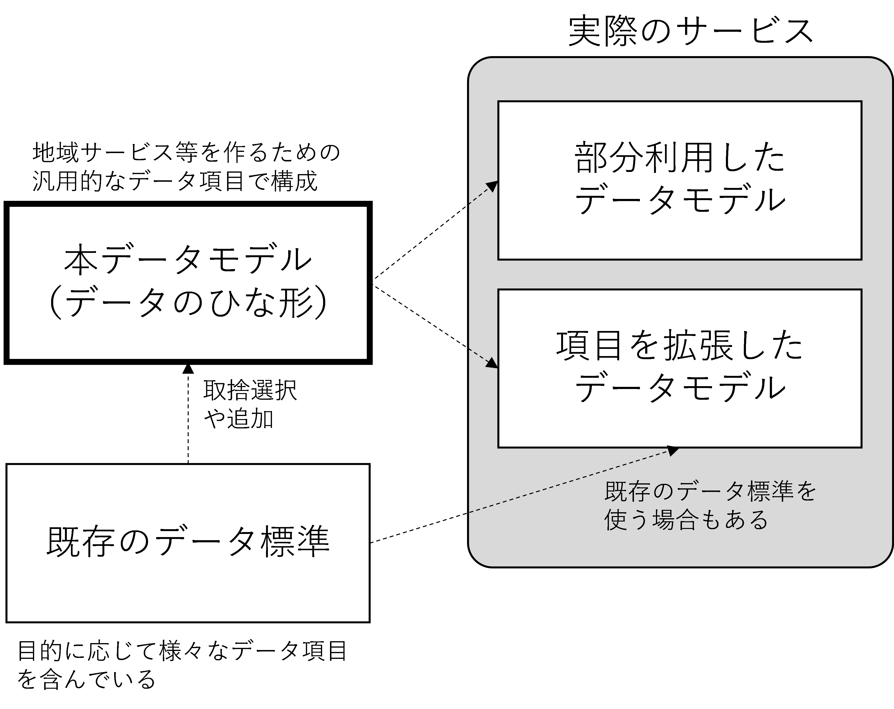
<figcaption> 図 1　本データモデルの活用イメージ </figcaption> </figure>

このように参照データモデルを使ってサービスを設計することで分野間の情報検索やサービス連携が容易になります。

<figure>
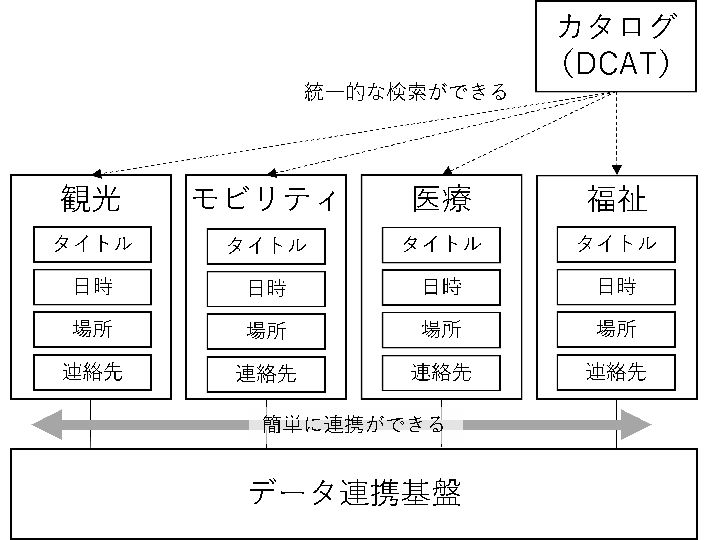
<figcaption> 図 2　分野間のデータ連携のイメージ </figcaption> </figure>

#### 1.3.1. メリット・デメリット

データモデルを使うことで、以下のメリットを得ることができます。

* 設計者は、分野横断で相互運用性が高いシステムを作ることができる
* 設計者は、スマートシティの設計を迅速にできる
* 設計者は、データ設計の時間を短縮することで、サービス検討に十分な時間を使うことができる
* 都市オーナーは、移行性や拡張性の高い都市基盤を定義することができる
* 都市オーナーは、グローバルにサービス展開をすることができる
* 都市オーナーは、世界の最先端サービスを迅速に都市に導入することができる
* 市民や事業者は、データを活用した最新のサービスを活用することができる
* 市民や事業者は、データを入手、活用しやすくなり新しいサービスを作りやすくなる
* 都市全体が災害などの緊急時に対応しやすくなる

データモデルを使うことでサービス設計の自由度が狭められるなど、デメリットを指摘する意見もありますが、本データモデルは標準ではなく自由な改変ができる参照データモデルであることから、高い柔軟性が確保されています。

#### 1.3.2. 留意事項

本データモデルの活用は、以下の留意点を理解した上で使用してください。

* データモデルの継続的改善による変更
    * 世界中のスマートシティでデータモデルの設計が同時並行で進められています。そのため、本データモデルと世界標準との間に差異が生じる場合があります。また、社会変化により変更する場合もあります。そうした差異はデータ変換表やコンバータで解決していきます。
* 内部での独自データの活用
    * データ所有者やサービス提供者によっては高速処理等を目的として、本データモデルと異なるデータモデルで内部データを保有・活用する場合があります。その場合は、外部とのデータ交換時にデータを変換することで容易に相互運用性を確保することが可能になります。
* 初期コスト
    * データモデルの初期のデータ移行では、既存データとの変換などでコストがかかることがあります。これは一過性のコストであり、中長期の投資と考えて取り組む必要があります。
* 表記揺れへの対応
    * 組織によって用語定義が違うため、データモデルを作る時に、例えば「住所」「所在」「所在地」のように同じ項目を異なる名前で表す表記ゆれが発生することがよくあります。本データモデルでは複数の表記のうち、代表的な表現を使って作成しています。表記揺れについては今後、データディクショナリの整備を通じて解決していきます。
* データ項目間の関係
    * データ項目によっては「地域」（関東等）のように法律や制度による対象範囲の違い、「住民数」等におけるデータの基準日の違い等、同じデータ項目なのに対象範囲が異なる場合があります。「所在地」というデータ項目の対象範囲緯度経度も含むこともあります。対象範囲の違いには「完全一致」「包含する」「包含される」「一部一致」等のパターンがあります。

本データモデルは、既存データモデルとの関係性を示すことがありますが、既存データモデルと完全一致していない場合があります。完全一致ではなく、関連の強い既存のデータ項目を示している場合がありますので、実装時には注意が必要です。

### 1.4. 　原則

データモデルは以下の原則に基づいて整理します。

#### 1.4.1. 参照データモデルとしての整備

ここで示すデータモデルは、参照データモデルです。従って、データモデルをそのまま実装することもできますし、必要なデータ項目のみ選択してサブセットとして使ったり、データ項目の追加によりデータモデルの拡張をして使うことが可能です。これにより、相互運用性を確保しつつ、独自性を実現できる等、柔軟に導入することが可能です。また、前述したように高速処理をするために、実装はシンプルなデータモデルで行い、外部とデータ交換するときに参照モデルにデータを変換して実装することが可能です。

#### 1.4.2. 既存データモデルの活用

スマートシティに限らず、既存のデータモデルが存在する場合には、可能な限りそのデータモデルを使用します。既存のデータモデルを使うことにより、先人の知見を活用するとともに既存サービスとの相互運用性を確保します。

ただし、既存モデルの設計思想が古い等、再利用することでデータ流通が円滑に進まない場合には、既存のデータモデルと相互運用性をできる形でデータモデルを新たに設計する場合があります。

#### 1.4.3. グローバル標準との整合性

データモデルは、可能な限りグローバルな体系を意識して整備します。グローバルな体系に合わせることにより、スマートシティサービスの国際展開を容易にするとともに、世界中の先端のサービスを導入可能にすることが期待できます。

本書のデータモデルは、日本におけるこれまでのデータモデルの取組み経緯をふまえつつ、スマート化に関する広範囲のテーマを対象とするデータモデルであるSmart Data Model、都市のデータの標準であるCityGML、webの標準であるschema.org 等のグローバル標準を参照して作成しています。

#### 1.4.4. スモールスタートと成果の可視化

データの整備は既存のデータやシステムがある場合、一気に実現できない場合があります。時間や地域、サービスを絞ってスモールスタートすることにより、成果を利用者に理解してもらい、応援者を集めながら推進していくことが重要です。ただし、スモールスタートが一過性の実証に終わってはいけません。全体ロードマップと成果を可視化しながら推進を図っていくことが重要です。

#### 1.4.5. イノベーションのための成長の仕組み

データに関連する技術は年々進歩しており、最新技術を使ったイノベーティブな取り組みに継続的に取り組んでいく必要があります。最新技術へ適応するために参照データモデル以外のモデルを使う場合もあります。その場合、そのモデルや取組内容を公開し、本参照データモデルの改善に資する情報のフィードバックがあることが望ましいです。

また、数年おきに本モデルの全体検証を行い、データモデルを変更した場合には、データ変換ツールやマニュアル提供の検討も行います。

#### 1.4.6. 多様な用途に永く使える仕組み

データの通信方法、処理方法、処理単位などは、時代、地域、用途などによって変わります。多様な条件でデータ項目を抽出したり、異なる種類のデータを結合・集計したり、それぞれのデータ間の相関を分析したりすることを想定して、柔軟なデータ構造を検討しています。

また、データを扱う情報システムの更改やデータストレージ技術の進化に合わせて変更が可能で、拡張性のあるデータモデルを検討しています。

#### 1.4.7. データ定義の順次整備

データモデルを構成するデータ項目に、必須等の優先順位をつけてほしいという意見があります。参照元がある既存のデータモデルは優先順位を継承しますが、新規のデータモデルでは優先順位がないものがあります。

また、データ長も定義してほしい、サンプルデータやサンプルコードを追加してほしいという要望もありますが、現段階で整備できていません。英語のデータ項目名も定義できていませんので、現段階では参照できる海外のデータ項目などを元にデータ項目名を決めてください。その場合、英語項目名はSmart data modelやschema.orgで使われる単語区切りを大文字で示すキャメルケースを推奨します。（一方、GTFSはアンダースコアで接続するスネークケースです）

本書では、データ構造を明確にすることを第一優先としており、詳細化は今後の実装状況や要望をふまえ検討をすることとします。

### 1.5. 　アーキテクチャやAPIとの関係

データモデルを整備するにあたり、それを全体サービスの中でどのように使うのか、どのような制約条件があるか等の全体像の整理をしていく必要があります。本データモデルは、Society5.0の一環で整備されている「スマートシティリファレンスアーキテクチャ　ホワイトペーパー」[^1]を用い、そのデータ整備部分を補完するものです。

<figure>

<figcaption> 図 3　スマートシティ・リファレンス・アーキテクチャとの関係 </figcaption> </figure>

また、「スマートシティリファレンスアーキテクチャ　ホワイトペーパー」では、参考となるデータ一覧として次のデータを示しています。

#### 1.5.1. 動的・静的データ

#### 1.5.2. 地理空間データ

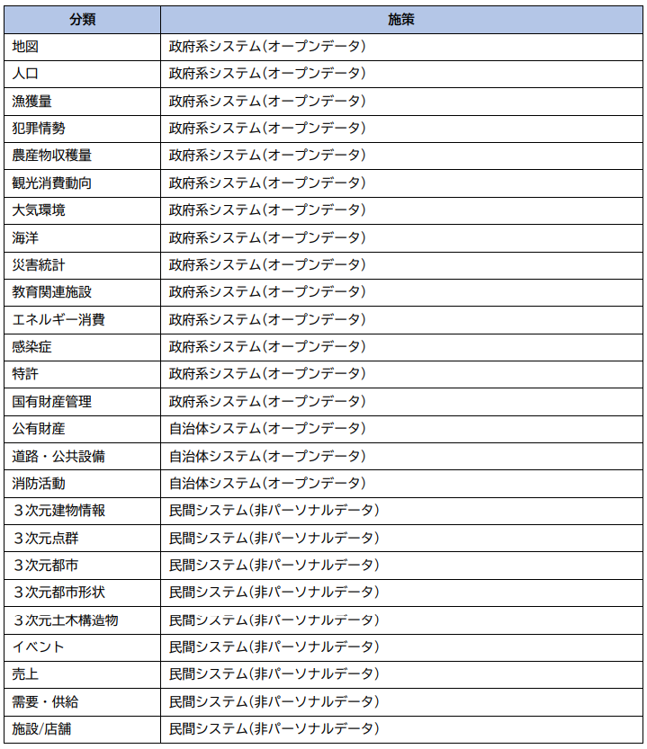

#### 1.5.3. パーソナルデータ

また、データを活用するためのAPIの実装については「スーパーシティ／スマートシティの相互運用性の確保等に関する検討会最終報告書」の考え方を参考にしてください。

### 1.6. 　対象範囲

本書は、スマートシティの検討でデータモデルへの要望が大きい地物と移動体を中心に検討しています。本データモデルでデータを定義するだけでは十分ではありません。スマートシティ関係者がデータモデルの設計や活用に容易に取り組めるように、できる限り既存サービスやデータの参照情報を掲載しています。

データ項目の選定基準は、国内外の主要なスマートシティのデータモデルの中で共通的に使われているもの、国内でニーズの高いものを有識者ヒアリングにより選定しています。

地理空間データの基礎は地図（ベースマップ）ですが、地図のデータモデルは用途により選ばれることも多いことから、本書のデータモデルの対象とせず、付録で技術的な解説を行うにとどめています。

---
## 2. 　本書について

### 2.1. 　本書の全体構成

データモデルの記述レベルは様々なレベルがあります。本書はデータ全体像を提示することが目的です。

本書は、データ項目名とその項目説明を提示し、クラス図やデータ型の定義、及び当該データ項目に対応する既存のスマートシティのデータ項目とのマッピングは、可能な範囲で行います。

また本書は、「コアデータパーツ」「データモデル」「コード体系」「カタログ」「データの運用」の構成で整理を行います。

#### 2.1.1. コアデータパーツ

全てのデータに共通的に使われる「文字」、「日付」、「場所」「緯度経度」等のデータ項目を整理します。

#### 2.1.2. データモデル

対象分野毎にデータの対象物とその属性情報、いわゆるクラスとプロパティを整理します。

現在はデータモデルの概要を記載しています。詳細なクラス図やデータの形式、データ項目の優先度は今後の課題とします。

#### 2.1.3. コード体系

データモデルで参照する分類を示すコード体系の整理をします。データ項目が選択式の場合、その選択肢であるコントロールド・ボキャブラリ（統制語彙）は、コード化されているかどうかに関わらずコード体系の中で整理します。分野に特化した小規模の選択肢の場合は各データモデルの中で記載します。

#### 2.1.4. カタログ

データの検索性を高めるためのカタログと、そのデータを管理するためのメタデータについて整理します。

#### 2.1.5. データの運用

データ実装方式や品質について整理します。

### 2.2. 　本書の使い方

本書で示すデータモデルは参照データモデルです。参照データモデルとはひな形であり、このモデルを参考に自由に項目の追加・削除をして実際に使用するデータモデルを作ることができます。

#### 2.2.1. データを設計する場合

1.  業務やサービスに必要なデータ候補をリストアップする。
2.  本書のデータモデルのうち類似のデータモデルはないか確認する。
3.  類似のデータモデルがあった場合には、データ項目を見て、業務やサービスに必要な項目とのフィット＆ギャップ分析を行う。
4.  データモデルの全体像を整理する。
5.  関連した連携データがある場合には、データ項目間のデータ連携方式（コンバージョン（形式変換、分割・統合））の方法を検討する
6.  最終的なデータ項目を決定する。
7.  既存データに新しいデータ項目に対応するデータがない場合は、補完方式（追加収集、省略等）を検討する。

※類似のデータモデルがない場合には、コアデータパーツ、コアデータモデルを参照し、データ設計をすることで、日付、連絡先などの項目で最低限の相互運用性を確保することができます。

#### 2.2.2. データ連携する場合

1.  連携元のデータ項目を一覧化する
2.  連携対象のデータモデルと類似のデータモデルがあるか確認する。
3.  類似のデータモデルがある場合には、連携元のデータモデルとデータ項目の対照表を作り、マッピングを行う。
4.  連携先のデータモデルを一覧化しデータ項目の対照表に加筆する。
5.  完全一致しないデータ項目について変換方式を決定する。
6.  連携に不足するデータ項目の扱いを検討する。

※類似のデータモデルがない場合には、コアデータパーツ、コアデータモデルを参照し、データ連携をすることで、日付、連絡先などの項目で最低限の相互運用性を確保することができます。

### 2.3. 　関連取り組みとの関連性

#### 2.3.1. 政府相互運用性フレームワークとの関係性

政府相互運用性フレームワーク（GIF: Government Interoperability Framework）[^2]（以後、GIFと記述）は、コアデータモデルとして、土地、建物、施設、設備等のデータモデルを示すとともに、コアデータパーツとして日付、住所（アドレス）のデータモデルを提示しています。本書はGIFの一部をなすものであり、GIFのデータモデル、定義を継承するものとします。

#### 2.3.2. 地理空間情報、CityGMLとの関係性

国土交通省や国土地理院から詳細な地理空間情報がすでに提供されています。この地理空間情報に、施設のオープン、クローズ時間などの地域サービス情報、センサー情報などを組み合わせることで、都市データをより高度に活用できます。

最近、建物等を３Dモデルに詳細に表すことができるCityGMLの活用が増えてきています。また、CityGML[^3] やi－都市再生技術仕様（案）(i-UR)[^4]を参照し、国土交通省から３D都市モデル標準製品仕様書[^5]が公表されています。この建物情報と都市サービス情報、センサー情報を組み合わせることで、より高度な利用ができます。一方、建物ID、施設ID等、対象物を一意に表すIDが整備されていないことから、３Dモデルと関連付けて複数データを一体として扱うのは簡単ではありません。そこで本書では、CityGMLのデータ項目と都市サービスデータ項目を比較することで、データ同定のための情報、補完関係にある情報を明確にします。

また、スマートシティのデータモデルは、地点や線など地理形状情報を含むことがあります。「ポイント」「ライン」「ポリゴン」「メッシュ」等です。特に「ポリゴン」に関しては様々な情報管理方法があります。本書では、「ポイント」に関連した情報を基本とし、「ライン」「ポリゴン」「メッシュ」等の扱いは簡易な記述にとどめ、将来の検討課題とします。

#### 2.3.3. Smart Data Modelとの関係性

欧州を中心にスマートシティのデータモデルの検討が進められています。国際的なサービスの相互運用性を確保することで、国内のスマートシティサービスを世界に展開しやすくなるとともに、世界の最新サービスの国内への導入が容易になります。そこで本書では、Smart Data Model[^6]との項目比較を行い、データモデルの検討を容易にします。

#### 2.3.4. Schema.orgとの関係性

検索サービスで使用するメタデータのデファクトスタンダードにSchema.org[^7]があります。スマートシティで対象とするものやサービスのデータモデルを、Schema.orgのデータ項目と関連つけることにより、利用者に検索サービスを通じて効率よくデータを届けることができます。

#### 2.3.5. デジタル・ツインとの関係性

デジタル・ツインの世界では、地理空間情報、建築物情報、行政情報、都市サービス情報、センサー情報等がシームレスに扱われる必要があります。これらはユニークIDで連携することもある他、名称や位置情報を使って各情報間の連携を行う場合もあります。そのため本書では、スマートシティに関連する情報を幅広に検討しています。

#### 2.3.6. 推奨データセットとの関係性

オープンデータ推進の一環で推奨データセット[^8]が提示されており、データモデルが示されています。また、既に多くの地方公共団体でデータセットの整備が進められています。一方、推奨データセットは2017年に策定され、その後、推奨データセットの対象データの追加が行われてきましたが、オープンデータの各地での取り組みが進んできたことと、問い合わせにフォームのデータ項目がないなど、見直しが必要になってきたことから、2022年4月からGIFも踏まえた推奨データセットの見直しが進められています。データは標準化されていることでコンバートなどを行うことが容易になりますので、推奨データセットを従来通りの方針で推進しても、将来一貫性を持ってGIFと融合することができるよう、コンバータの提供なども予定しています。

また、これまでの推奨データセットのモデルは、それぞれGIFに含まれるモデルに取り込まれています。以下に対応表を示します。

| 推奨データセット | GIF | 本書の記述位置等 |
|:---|:---|:---|
| AED設置箇所 | AED | 設備 |
| 介護サービス事業所 | 介護サービス事業所 | 施設 |
| 医療機関 | 医療機関 | 施設 |
| 文化財 | 文化財 | 文化財 |
| 観光施設 | 公共施設・観光施設 | 施設 |
| イベント | イベント | イベント |
| 公衆無線LAN | 公衆無線LAN | 設備 |
| アクセスポイント | アクセスポイント | |
| 公衆トイレ | 公衆トイレ | 設備 |
| 消防水利施設 | 消防水利施設 | 設備 |
| 指定緊急避難場所 | 指定緊急避難場所 | 地物・地点 |
| 地域・年齢別人口 | 地域・年齢別人口 | 行政情報 |
| 公共施設 | 公共施設・観光施設 | 施設 |
| 子育て施設 | 子育て支援施設 | 施設 |
| オープンデータ | データカタログ等メタデータ | カタログ |
| 食品等営業許可・届出 | 食品等営業許可・届出事業所 | 施設 |
| 学校給食献立情報 | 給食献立 | 健康 |
| 小中学校通学区域情報 | 学校 | 施設 |
| ボーリング柱状図等 | ボーリングデータ | 建物内・地下街・地下埋設物 |
| 都市計画基礎調査情報 | 都市計画基礎調査 | 土地 |
| 調達情報 | 調達情報 | GIF実装データモデル（行政（調達））を参照 |
| 標準的なバス情報フォーマット | 駅・バス停、鉄道路線・バス路線 | 交通関係施設 |
| 支援制度情報 | 制度情報 | GIF実装データモデル（行政（行政サービス・制度））を参照 |

---
## 3. 　すべてのデータモデルへの共通事項

すべてのデータモデルで共通的なデータモデル、モジュール、共通記述方法を示します。

* 多くのデータモデルで共通的に使うデータ
  * 文字
  * 外国語表示・ピクトグラム
  * 日時
  * 緯度、経度
  * 住所等
  * 連絡先
  * 画像
  * 空間スキーマ
  * レコード情報

また、イベントや施設等、市民や観光客、企業等へ向けて提供するサービスでは、利用に補助が必要な方や高齢者、育児中の方、外国の方に対する対応内容を共通的に示すことが望ましいです。そのため、イベントや施設のデータモデルに共通的に付加して利用できるデータ項目を定義しています。

* 施設やイベントに必要に応じて付加するデータ
  * アクセシビリティ
  * 子育て支援情報
  * 言語対応
  * 申込・予約
  * 支払

### 3.1. 　文字

文字は、スマートフォン等の一般的な機器に搭載されているJIS X 0213（JIS第4水準までの約1万文字）の範囲内とします。また文字符号化はUTF-8を使用します。さらに、氏名や地名、法人名等の固有名詞にはヨミガナを別データ項目として定義することとします。詳細は、「GIF文字環境導入実践ガイドブック」[^9]を参照してください。

### 3.2. 　外国語表記・ピクトグラム

スマートシティの各サービスは日本語が母国語ではない人が利用することが想定されます。そのため、最低限、英字対応することが求められます。

地名の英字については、国土交通省「地名等の英語表記規程」[^10]の英字表記が参照できます。施設名等の英字表記は、施設等が自ら提示する名称を基本とします。さらに、観光庁「観光立国実現に向けた 多言語対応の改善・強化のためのガイドライン」[^11]や東京都「国内外旅行者のためのわかりやすい案内サイン標準化指針」[^12]を参考にしてください。

また、都市サービスでは言語がわからなくても直感的に理解ができるように多くのピクトグラムが使用されます。観光庁「観光立国実現に向けた 多言語対応の改善・強化のためのガイドライン」[^13]や東京都「国内外旅行者のためのわかりやすい案内サイン標準化指針」[^14]が参考にできます。

### 3.3. 　日時

「GIFコアデータパーツ（日付時刻）」[^15]に基づき、日付はISO8601の拡張形式であるYYYY-MM-DD、時刻はHH:MM:SSを使用します。これは、コンピュータの中のデータ形式であり、表示や印字においては自由な表記形式に変換して利用することが可能です。

開始時間、終了時間などの期間がある場合には、一つのデータ項目内で自由に記述するのではなく「開始時間」、「終了時間」のようにデータ項目を分離してデータを扱いやすくすることが重要です。

利用可能日、利用不可日を表すときには、利用可能日を記述します。例えば「休館：土日祝日」ではなく「開館：月火水木金」「開館日備考：祝日は除く」とします。

曜日指定、季節、時間帯、タイムゾーン等は「GIFコアデータパーツ（日付時刻）」の定義やコードを活用します。

#### 3.3.1. 定期スケジュール

定期スケジュールで行われるイベントの種別は、「年次スケジュール」「月次スケジュール」「週次スケジュール」があります。

定期スケジュールの情報は、求める声が多いものの、記述方法に標準がないため、本書では以下のように定義します。

##### 3.3.1.1. 年次スケジュール

年の特定日に行うスケジュール事項です。

* 月日をMM-DDで、カンマ区切りで列挙します。

##### 3.3.1.2. 月次スケジュール

月の特定日に行うスケジュールです。

* 日をDDで、カンマ区切りで列挙します。

隔月イベントは、備考欄に「隔月」であることを記載します。

##### 3.3.1.3. 週次スケジュール

週の特定日に行うスケジュールです。

* 曜日はMo,Tu,We,Th,Fr,Sa,Suで表します。
* 毎週は0
* 1週から5週は1-5
* 最終は6
* 隔週は7とする。

記述例

  * 毎週水曜日　 ０We
  * 第1,3月曜日 13Mo
  * 第1,4火曜日と第4木曜日 14Tu４Th
  * 最終金曜 6Fr
  * 隔週日曜 7Su

#### 3.3.2. 非定期のスケジュール

時期により開催や、希望者がいるときに開催をするイベント等、不定期に開催されるイベントについては本書では特にデータ形式を定めません。

### 3.4. 　緯度、経度

緯度経度は、1m程度の誤差を許容し、「GIFコアデータパーツ（地理情報）」 に従い、小数点以下6桁を基本とします。

ただし、測量法が定める誤差等、作るデータの目的により許容される誤差が異なる場合があります。特別な精度を必要とするサービスの場合は、サービス側でリアルタイム測地点による補正や小数点以下7桁情報の利用を検討してください。

本書は登録データの原データの誤差範囲を制約するものではありません。

### 3.5. 　住所等（アドレス）

住所等の所在地を表す情報は、以下の「GIFコアデータパーツ（住所（アドレス））」が基本になります。

| 必須 | 項目名 | 説明 |
|:---|:---|:---|
| 必 | 全国地方公共団体コード | 全国地方公共団体コード（6桁、都道府県と市区町村まで含む）を記載。 |
| 必 | 町字ID | アドレスベースレジストリの町字IDを記載。 |
| 必 | 都道府県 | 都道府県を記載。 |
| 必 | 市区町村（郡） | 市区町村（郡名および政令市区名を含む）記載。 |
| 必 | 町字 | 町字を記載。 |
| 必 | 番地以下 | 番地以下（街区符号、住居番号または地番）を記載。 |
| 必 | 建物名等(方書) | 建物名、部屋番号、フロア名などを記載。 |
| | 連結表記 | 都道府県から建物名まで連結して記載。 |
| | 緯度 | 緯度（Geoコーダーで自動入力）を記載。 |
| | 経度 | 経度（Geoコーダーで自動入力）を記載。 |
| | 座標参照系 | 座標参照系（旧日本測地系、世界測地系などの種別）を記載。 |
| | 座標参照系コード | EPSGコード |
| | 国名 | 国名を記載 |
| | 国コード | 国コードを記載（コード情報型） |
| | 郡 | 郡名を記載。 |
| | 市区町村 | 市区町村名のみを記載 |
| | 政令市区 | 政令市区名を記載 |
| | 大字・町 | 大字および町を記載。 |
| | 小字 | 小字および番地補足（イ・甲・北など）を記載。 |
| | 住居表示フラグ | 住居表示フラグを記載。 |
| | 街区符号 | 街区符号を記載。 |
| | 住居番号 | 住居番号を記載。 |
| | 地番 | 地番を記載。 |
| | 建物名 | 建物名を記載。 |
| | フロア名 | フロア名を記載。 |
| | 部屋番号 | 部屋番号（フロア番号なども含む）を記載。 |

GIFではデータ処理用にデータ項目が細かく分かれていますが、実際の利用時には簡易に住所を入力できたり表記できたりする必要があります。また、住所のデータについても、旧システムの制約で住所と建物を1つのデータ項目で表す形式のデータしか保持していない場合も多いです。

サービス実装時は、サービス利用者や既存データとの関係、入力しやすさ等を検討し、データ変換を効果的に活用しデータの相互運用を図っていくことが重要です。

以下に簡易入力する場合の推奨方式を示します。

#### 3.5.1. 都道府県分離表記方式（町字ID想定）

一般的な入力方式です。「二丁目」のような丁目までが町字に含まれます。都道府県、市区町村、町字部分は町字ID導入時にIDでの入力が可能です。（町字IDはアドレスベースレジストリで準備中）

| データ項目 | 説明 |
|:---|:---|
| 都道府県 | 都道府県名を記入。（例：東京都） |
| 市区町村 | 市区町村を記入。 |
| 町字 | 町字を記入。 |
| 番地以下 | 住所の番地以下、地番を半角数字とハイフンで記入。 |
| 建物名等 | 建物名等の情報がある場合に使用。 |

最近はドア前の置き配送などもあり、部屋番号を建物番号と別データ項目にすべきとの議論がありますが、現時点ではそのようなデータ項目を保有するサービスが少ないことから、今後、社会のニーズを見ながら検討を進めていきます。

#### 3.5.2. 都道府県分離表記方式（町字ID非想定）

一般的な入力方式です。町字ID導入時に変換が必要となります。

| データ項目 | 説明 |
|:---|:---|
| 都道府県 | 都道府県名を記入。（例：東京都） |
| 市区町村町名 | 住所を市区町村から記入。（丁目以下省略） |
| 住所丁目以下 | 住所の丁目以下、地番を半角数字とハイフンで記入。 |
| 建物名等 | 建物名等の情報がある場合に使用。 |

部屋番号については前項と同様とします。

#### 3.5.3. 全住所一体方式

多くの従来データで使われる方式です。

| データ項目 | 説明 |
|:---|:---|
| 住所 | 所在地を記入。（都道府県名から、丁目、号まで1データで記載） |
| 建物名等 | 建物名等の情報がある場合に使用。 |

部屋番号については前項と同様とします。

### 3.6. 　連絡先

連絡先は以下のデータ項目を持ちます。「GIFコアデータモデル（連絡先）」を参照してください。

| データ項目 | 説明 |
|:---|:---|
| 連絡先名称 | 連絡先名称 |
| 連絡先電話番号 | 電話番号、携帯電話番号 |
| 連絡先内線番号 | 内線番号 |
| 連絡先メールアドレス | 連絡先メールアドレス |
| 連絡先FormURL | 連絡先がWebFormの場合のURL |
| 連絡先備考（その他、SNSなど） | SNSなどの連絡手段がある場合に記入 |
| 郵便番号 | 郵便番号 |
| 連絡先住所 | 連絡先住所の情報 |

### 3.7. 　画像

データには画像ファイルが含まれる場合があります。GIFのメタデータ定義であるDCAT-GOJを部分利用することができます。

| データ項目 | 説明 |
|:---|:---|
| タイトル | 画像のタイトル |
| キーワード | 画像につけるキーワード |
| ファイル名 | 画像のファイル名 |
| 公開日 | 画像の公開日 |
| 提供者 | 画像の提供者 |
| 作成者 | 画像の作成者 |
| バイトサイズ | バイトサイズ（MB） |
| 公開条件 | 「教育利用は可」等の公開条件があれば記入 |
| ライセンス | ライセンスを記入する。外部で定義されたライセンスへのリンク（url）でもよい。 |
| 備考 | その他特記事項 |

### 3.8. 　空間スキーマ

スマートシティの対象物を表す場合、点、線と範囲の形状を表すポリゴンを使う場合が多いです。点は緯度・経度で表すことが可能ですが、土地の代表点を表す場合も多く正確に位置を示していない場合もあります。空間スキーマはCityGMLとの連携が重要なことからgml:\_GeometricPrimitiveを参照することとします。

| 対象 | 型と多重度 | 説明 |
|:---|:---|:---|
| gml:Point | gml:DirectPosition \[1\] | 座標値 |
| gml:LineString | gml:DirectPosition \[2..\*\] | 線を構成する座標値の列。 |
| gml:Polygon | gml:\_Ring \[1\] | 多角形の外周。役割の定義により内周の定義も可能。 |

### 3.9. 　レコード情報

対象物の個々のデータの記録や更新に関する情報です。

| データ項目 | 説明 |
|:---|:---|
| 登録日時 | レコードを登録した日時 |
| 登録者 | レコード登録者 |
| 最終更新日時 | レコードを最後に更新した日時 |
| 更新者 | レコードを最後に更新した更新者 |

### 3.10. 　アクセシビリティデータ

アクセシビリティ[^16]に関する情報提供を行う際は、以下のデータ項目を参照します。いずれのデータ項目も対応可否を「有」、「無」、「不明または未確認=空白」で記載します。施設や設備、イベント、サービス等を扱うデータモデルでの適用が推奨されます。「GIFコアデータモデル（アクセシビリティ）」を参照してください。

| データ項目 | 説明 |
|:---|:---|
| 車椅子可 | 車椅子の使用可否を記載。 |
| 車椅子貸出 | 車椅子貸出の有無を記載。 |
| ツエ貸出 | ツエ貸出の有無を記載。 |
| バリアフリートイレ | バリアフリートイレの有無を記載。 |
| スロープ、エレベータ、エスカレータ | スロープ、エレベータ、エスカレータの有無を記載。 |
| 点字ブロック等の移動支援 | 点字ブロック等の移動支援の有無を記載。 |
| 点字や読上による支援 | 点字や読上による支援の有無を記載。 |
| 盲導犬・介助犬、聴導犬同伴 | 盲導犬・介助犬同伴の有無を記載。 |
| 字幕 | 字幕の有無を記載。 |
| 筆談対応 | 筆談対応の有無を記載。 |
| 優先駐車場 | 優先駐車場の有無を記載。 |
| オストメイト対応トイレ | オストメイト対応トイレの有無を記載。 |
| 備考 | その他アクセシビリティ事項を記載。 |

### 3.11. 　子育て支援情報データ

子育て支援策に関する情報提供を行う場合は、以下の「GIFコアデータモデル（子育て支援情報）」のデータ項目を参照します。子どもが利用する可能性のある施設や設備、イベント、サービス等を扱うデータモデルでの適用が可能です。

| データ項目 | 説明 |
|:---|:---|
| 子供預かり種別（無料/有料） | 料金の種別 |
| 子供預かり（料金） | 有料の場合の料金 |
| 子供預かり（料金備考） | 料金の備考 |
| 最少年齢 | 利用可能年齢（下限） |
| 最少月齢 | 利用可能月齢 |
| 最大年齢 | 利用可能年齢（上限） |
| 子供預かり開所時間 | 対応時間 |
| 子供預かり閉所時間 | 対応時間 |
| 授乳室 | 有無を記入 |
| おむつ替えコーナー | 有無を記入 |
| 飲食可否 | 有無を記入 |
| ベビーカー貸出 | 有無を記入 |
| ベビーカー利用 | 有無を記入 |
| 備考 | その他子育て支援系項目 |

### 3.12. 　言語対応データ

外国語対応に関する情報提供を行う際は、以下のデータ項目を参照します。日本語を母国語としない方が利用する可能性のある施設や設備、イベント、サービス等を扱うデータモデルでの活用が推奨されます。

| データ項目 | 説明 |
|:---|:---|
| 言語 | 2文字言語コードを使用する。 |
| 会話可否 | 説明や会話による対応の可否。 |
| 資料 | 外国語資料、説明表示による対応の可否。 |
| 備考 | 要予約などの備考があれば記載。 |

### 3.13. 　申込・予約

施設やイベントの利用で申し込みや予約を行う際は、以下のデータ項目を参照します。

| データ項目 | 説明 |
|:---|:---|
| 申込開始日時 | 申し込みを開始する日時 |
| 申込終了日時 | 申し込みの受け付けを終了する日時 |
| 申込方法 | インターネット、郵送等の方法 |
| 申込フォームurl | 申込フォームurl |
| 受付方法 | 先着順、抽選など |
| 申込者 | 申し込み代表者。サービスによっては全申込者を記入。必要に応じて年齢や性別なども記入します。 |
| | サービスによっては全申込者を記入。必要に応じて年齢や性別なども記入します。 |
| 申込み単位 | グループ、ペア、個人 |
| 総合計人数 | 合計人数 |
| 分類別人数 | 男女、年齢層等、必要に応じて複数のデータ項目を設定します。 |
| キャンセル待ちの有無 | キャンセル待ちが可能な場合は、有 |
| 予約番号 | 予約完了時に発行する番号 |
| 連絡先 | 申込者の連絡先（氏名、メールアドレス等）連絡先型 |
| 備考 | 備考 |

### 3.14. 　支払

施設やイベントの利用で支払いを行う際は、以下のデータ項目が参照できます。支払いに汎用的なサービスを利用する場合は、そのサービスのデータ項目を使います。

| データ項目 | 説明 |
|:---|:---|
| 支払先 | 支払先の名称 |
| 支払方法 | 支払いの方法（クレジット、現金等） |
| 支払方法詳細 | クレジット、振り込みなどの詳細情報を必要に応じて複数に分割したデータ項目で記述します |
| 支払タイミング | 事前、利用時、事後を選択 |
| 金額 | 金額を円で記入 |
| 支払い期限 | 支払期限をYYYY-MM-DDで記入 |
| 備考 | 備考 |

---
## 4. 　実装データモデル

スマートシティでニーズが高いデータのモデルを示します。相互運用性を確保するために、既存のデータモデルをできる限り参照しています。
各データモデルは、そのデータが何を主に参照して作られたかを示す「参照元データ」、データ項目を一覧化した「データモデル」、データ項目の選択肢となる「候補（コントロールド・ボキャブラリ）」、その他参考になる「既存のデータモデル」により構成されます。

また、施設や設備等は、博物館、行政機関等の個々の類型でデータ項目の差異が小さいため、基本形を示したうえでその差分を記述します。ただし、学校や交番など既にデータの形式が所管省庁等で整理されている場合には、基本形を使わずに、データ項目の列挙を行います。
各データ項目は、参照元のデータモデルに必須、推奨等の指定がある場合には必須かどうかを示します。空欄の場合は任意項目です。

本データモデルは、だれもがわかりやすく参照できるように表形式で記載しています。イベントに対してサブイベントが複数ある等の繰り返し項目については、繰り返し情報を記述していません。また、データの形式や文字数も明記していません。
本書はデータ項目の明確化を目的としており、クラス図や繰り返し項目、データ形式などの詳細は今後の課題とします。

### 4.1. 　土地

土地のデータは利用目的によって異なります。現実世界に存在する土地で、位置、形状、使用形態に関する情報で表される土地情報、これらの情報に所有権等の財産情報を加えた不動産としての土地情報があります。

#### 4.1.1. 土地

##### 4.1.1.1. 参照元データ

| 名称 | 英語名称 | 参照元 |
|:---|:---|:---|
| 土地 | Land | GIFコアデータモデル |
| 土地利用 | LandUsage | ３D都市モデル標準製品仕様書[^17] |
| PoI | Point Of Interest | Smart data model[^18] |
| 場所 | Place | Schema.org[^19] |

##### 4.1.1.2. データモデル

| 必須 | 項目名 | 説明 |
|:---|:---|:---|
| | ID | 機械的に採番された土地を一意に識別するID。土地単位に付番する |
| 必 | 用途 | 土地の主要な用途 |
| | 名称 | 土地の名称 |
| | 名称（カナ） | 土地のカナ表記 |
| | 名称（英字） | 土地の英語名またはローマ字表記 |
| | 通称 | 土地に通称がある場合に記入 |
| | 説明 | 土地情報として公開可能な詳細情報 |
| 必 | 住所 | 住所情報（住所型） |
| | 敷地面積 | 土地の敷地面積(m2) |
| | ポリゴン | 土地の形状を表す情報 |
| | 備考 | 備考 |
| | 連絡先情報 | 連絡先の情報（連絡先型） |

##### 4.1.1.3. データ項目に選択肢があるときの候補

###### 4.1.1.3.1. 土地の用途

都市計画基礎調査実施要領[^20]（平成 3 年 5 月国土交通省都市局）の区分を参照します。

| コード | 説明 |
|:---|:---|
| 201 | 田（水田） |
| 202 | 畑（畑、樹園地、採草地、養鶏（牛・豚）場） |
| 203 | 山林（樹林地） |
| 204 | 水面（河川水面、湖沼、ため池、用水路、濠、運河水面） |
| 205 | その他自然地（原野・牧野、荒れ地、低湿地、河川敷・河原、海浜、湖岸） |
| 211 | 住宅用地（住宅、共同住宅、店舗等併用住宅、店舗等併用共同住宅、作業所併用住宅） |
| 212 | 商業用地 |
| 213 | 工業用地 |
| 219 | 農林漁業施設用地 |
| 214 | 公益施設用地 |
| 215 | 道路用地（道路、駅前広場） |
| 216 | 交通施設用地 |
| 217 | 公共空地（公園・緑地、広場、運動場、墓園） |
| 218 | その他公的施設用地（防衛施設用地） |
| 220 | その他の空地①（ゴルフ場） |
| 221 | その他空地②（太陽光発電のシステムを直接整備している土地） |
| 222 | その他の空地③（平面駐車場） |
| 223 | その他の空地④（その他の空地①～③以外の都市的土地利用：建物跡地、資材置場、改変工事中の土地、法面（道路、造成地等の主利用に含まれない法面）） |
| 231 | 不明 |
| 251 | 可住地 |
| 252 | 非可住地 |
| 260 | 農地（田、畑の区分がない） |
| 261 | 宅地（住宅用地、商業用地等の区分が無い） |
| 262 | 道路・鉄軌道敷（道路と交通施設用地が混在） |
| 263 | 空地（その他の空地①～④の区分が無い） |

##### 4.1.1.4. 既存のデータモデル

###### 4.1.1.4.1. ３Ｄ都市モデル標準製品仕様書（国土交通省）

３D都市モデルを策定するためのデータ構造やコードが参照できます。土地、道路などの記述が可能です。さらに都市計画や防災関連の情報、地形の情報のデータモデルも含まれています。

###### 4.1.1.4.2. 不動産登記情報

不動産登記の表題部から所有者情報を除いたデータ項目が参照できます。

| データ項目 | 説明 |
|:---|:---|
| 調製 | 登記記録作成日を記入する |
| 不動産番号 | 不動産固有のIDを記入する |
| 地図番号 | 登記所に備え付けられている精度の高い地図情報の番号を記入する。（登記所に地図が備え付けていない場合は空白） |
| 筆界特定 | 筆界特定所が作成されている場合にその旨を記入する。 |
| 所在 | 市区町村と町字を記入する。 |
| 地番 | 地番を記入する |
| 地目 | 「宅地」、「田」、「畑」、「山林」、「原野」、「用悪水路」、「公衆用道路」、「公園」、「雑種地」、「境内地」、「牧場」、「鉱泉地」、「池沼」、「墓地」、「水道用地」、「運河用地」、「ため池」、「保安林」、「堤」、「井溝」、「保安林」、「鉄道用地」、「学校用地」から選択 |
| 地積 | 水平投影面積により、m2（平方メートル）で小数点以下2桁まで記入する |
| 原因 | 発生年月日と「売買」等の事象を記入する |

###### 4.1.1.4.3. 電子国土基本図　地図情報ファイル仕様書

土地利用等のサブパッケージのデータモデルを参照できます。

###### 4.1.1.4.4. 国土数値情報

国土の土地利用のデータモデルを参照できます。

###### 4.1.1.4.5. 政府関連土地関連基礎情報

政府内の専門領域で規定されているデータ構造やコードが参照できます。

* DID地区（国土交通省都市計画基礎調査）
* 土地利用：区域区分（国土交通省都市計画基礎調査）
  * 都市計画区域及び準都市計画区域
* 土地利用現況（国土交通省都市計画基礎調査）
* 農地の区画情報（農林水産省筆ポリゴンデータ）[^21]
* 土地利用3次メッシュ、土地利用細分メッシュ、都市地域土地利用細分メッシュ、土地利用詳細メッシュ、森林地域、国有林野、農業地域、都市地域、用途地域（国土数値情報）[^22]
* 浸水想定区域［防災計画（ハザードマップ）］（国土交通省 水管理・国土保全局 河川環境課 水防企画室）[^23]
* 基盤地図（国土地理院）[^24]

###### 4.1.1.4.6. Smart Data Model

スマートシティ用のPoint of Interest モデルを参考にできます。目的地としての土地を示しています。

###### 4.1.1.4.7. Schema.org

Web検索情報用のPlaceモデルを参考にできます。目的地としての土地を示しています。派生形として、地形のデータモデルがあります。

#### 4.1.2. 都市計画基礎調査情報

都市計画に関する情報は、国土交通省「都市計画基礎調査情報のオープン化に向けた取組」を参照してください。[^25]

### 4.2. 　建物

ビルディングや家屋など、建築物一般を表すデータモデルです。

#### 4.2.1. 参照元データ

| 名称 | 英語名称 | 参照元 |
|:---|:---|:---|
| 建物 | Building | GIFコアデータモデル（建物） |
| 建物 | Building | ３D都市モデル標準製品仕様書 |
| 建物 | Building,BuildingOperation,BuildingType | Smart data model |
| 場所 | Place | Schema.org |

#### 4.2.2. データモデル

| 必須  | 項目名  | 説明  |
|:---|:---|:---|
| 必  | ID  | 機械的に採番された建物を一意に識別するID。建物単位に付番する  |
|   | 種別  | 建物の種別  |
| 必  | 名称  | 建物の名称  |
| 必  | 名称（カナ）  | 建物のカナ表記  |
| 必　 | 名称（英字）  | 建物の英語名またはローマ字表記  |
|   | 通称  | 建物に通称がある場合に記入  |
| | 概要  | 建物情報として公開可能な概要情報  |
| | 説明  | 建物情報として公開可能な詳細情報  |
|   | 関連建物  | 提携している他建物の情報など（建物型）  |
|   | 状態  | 「建築」、「稼働中」、「閉鎖中」などのステータス  |
| 必  | 建物住所  | 住所情報（住所型）  |
|   | 設備  | 建物内に併設されている設備の情報  |
|   | 敷地面積  | 建物の敷地面積(m2)  |
|   | 主な機能  | 建物の主な働き  |
|   | 主要用途  | 建物の主要用途の表記  |
|   | 建築面積  | 建物の建築面積(m2)  |
|   | 延べ面積  | 建物の延べ床面積(m2)  |
|   | 最高の高さ  | 建物の最高点の高さ(m)  |
|   | 地上階数  | 建物の地上階数  |
|   | 地下階数  | 建物の地下階数  |
|   | 構造  | 建物の構造の表記  |
|   | 竣工日  | 建物の竣工日  |
|   | 備考  | 備考  |
|   | 連絡先情報  | 連絡先の情報（連絡先型）  |
|   | アクセリビリティ情報  | アクセリビリティ情報（アクセシビリティ型）  |

#### 4.2.3. データ項目に選択肢があるときの候補

##### 4.2.3.1. 種別

一戸建ての住宅、工場等、建築基準法施行規則（別記様式）[^26]に定める建築物用途区分コードを使用できます。

##### 4.2.3.2. 構造

不動産登記の「構造」区分を使用できます。次項の不動産登記情報に参照情報を示します。

##### 4.2.3.3. 主要用途

都市計画基礎調査実施要領[^27]に準拠します。

| コード | 説明 |
|:---|:---|
| 401 | 業務施設 |
| 402 | 商業施設 |
| 403 | 宿泊施設 |
| 404 | 商業系複合施設 |
| 411 | 住宅 |
| 412 | 共同住宅 |
| 413 | 店舗等併用住宅 |
| 414 | 店舗等併用共同住宅 |
| 415 | 作業所併用住宅 |
| 421 | 官公庁施設 |
| 422 | 文教厚生施設 |
| 431 | 運輸倉庫施設 |
| 441 | 工場 |
| 451 | 農林漁業用施設 |
| 452 | 供給処理施設 |
| 453 | 防衛施設 |
| 454 | その他 |
| 461 | 不明 |

#### 4.2.4. 既存データモデル

##### 4.2.4.1. ３Ｄ都市モデル標準製品仕様書（国土交通省）

Buildingのデータ項目が参照できます。建物内、建物構造や壁面など多様な表現が可能です。

##### 4.2.4.2. 不動産登記情報

不動産登記の表題部から所有者情報を除いたデータ項目を参考にできます。

| データ項目 | 説明 |
|:---|:---|
| 調製 | 登記記録作成日を記入する |
| 所在図番号 | 建物所在図が備え付けられている場合に記入する |
| 所在 | 町字に加えて地番を記入する（土地登記と異なるので注意が必要） |
| 家屋番号 | 家屋に固有の番号を記入する（地番が入る場合とさらに枝番が入る場合がある） |
| 種類 | 不動産登記規則第113条で示す種類「居宅」、「店舗」、「寄宿舎」、「共同住宅」、「事務所」、「旅館」、「料理店」、「工場」、「倉庫」、「車庫」、「発電所」、「変電所」不動産登記事務取扱手続準則第80条で示す種類「校舎」、「講堂」、「研究所」、「病院」、「診療所」、「集会所」、「公会堂」、「停車場」、「劇場」、「映画館」、「遊技場」、「競技場」、「野球場」、「競馬場」、「公衆浴場」、「火葬場」、「守衛所」、「茶室」、「温室」、「蚕室」、「物置」、「便所」、「鶏舎」、「酪農舎」、「給油所」これらの区分に該当しない建物については、これに準じて定める |
| 構造 | 構成材料による区分「木造」、「土蔵」、「石」、「れんが」、「コンクリートブロック」、「鉄骨」、「鉄筋コンクリート」、「鉄骨鉄筋コンクリート」屋根の種類による区分「かわらぶき」、「スレートぶき」、「亜鉛メッキ鋼板ぶき」、「草ぶき」、「陸屋根」階数による区分「平家建」、「二階建（三階建以上の建物にあっては、これに準ずるものとする。）」これらの区分に該当しない建物については、これに準じて定める |
| 床面積 | 各階の床面積をm2（平方メートル）で小数点以下2桁まで記入する |
| 原因 | 発生年月日と「売買」等の事象を記入する |

##### 4.2.4.3. 電子国土基本図　地図情報ファイル仕様書

建物等のサブパッケージのデータモデルを参照できます。

##### 4.2.4.4. Smart Data Model

スマートシティ用のビルディングモデルを参照できます。Buildingデータモデルは建物の基本情報を示し、BuildingOperationやBuildhingTypeのデータ項目と組み合わせ、より詳細な表現ができます。

##### 4.2.4.5. Schema.org

Web検索情報用のPlaceモデルを参考にできます。目的地としての建物を示しています。派生形として、宿泊施設、公共構造物、ランドマーク、歴史的建造物、住居のデータモデルがあります。

### 4.3. 　施設

施設の種類は多岐にわたります。施設の「基本モデル」+「目的別追加データ項目」の組み合わせで、目的に応じてデータ項目を付加して活用します。

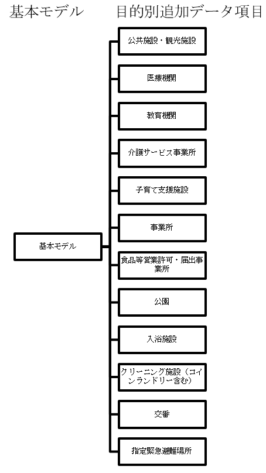

#### 4.3.1. 基本形

全ての施設に共通的なデータモデルです。

##### 4.3.1.1. 参照元データ

| 名称 | 英語名称 | 参照元 |
|:---|:---|:---|
| 施設 | Facility | GIFコアデータモデル(施設) |
| 公共施設 | Facility | 推奨データセット |
| 観光施設 | Tourism Facility | 推奨データセット |
| 都市施設 | Urban Facility | ３D都市モデル標準製品仕様書 |
| 建物 | Building,Building Operation | Smart data model |
| 場所 | Place | Schema.org |

##### 4.3.1.2. データモデル

| 必須 | 項目名 | 説明 |
|:---|:---|:---|
| 必 | ID | 機械的に採番された施設を一意に識別するID。施設単位ごとに付番する |
| 必 | 名称 | 施設の名称 |
| 必 | 名称（カナ） | 施設のカナ表記 |
| 必 | 名称（英字） | 施設の英語名またはローマ字表記 |
| | 施設通称 | 施設に通称がある場合に記入 |
| 必 | POIコード | 地理的目標物分類コード |
| 必 | 概要 | 施設情報として公開可能なリード文。概要情報 |
| 必 | 説明 | 施設情報として公開可能な詳細情報 |
| | 関連施設 | 提携している他施設の情報など（施設型） |
| | 状態 | 「閉館中」、「営業中」などのステータス |
| | 防災施設情報 | 避難場所、避難所、福祉避難所、防災倉庫などの情報 |
| 必 | 施設住所 | 住所情報（住所型） |
| | 設備 | 施設内に併設されている設備の情報 |
| 必 | サービス曜日 | 施設を利用できる曜日 |
| 必 | 開始時刻 | 施設を利用開始できる時間 |
| 必 | 終了時刻 | 施設の利用終了時間 |
| | 日時備考 | 定型で表せない施設の利用日時情報 |
| 必 | 料金種別 | 「有料」、「無料」の区分 |
| | 料金 | 施設利用に必要な各種料金を日本円で記載(1円単位) |
| | 料金備考 | 料金の備考。例: １グループ1000円など |
| | 決済種別 | 現金、クレジットカード、電子マネーなど |
| | 収容人数 | 収容人数 |
| | アクセス方法 | 公共交通や車でのアクセス方法を記載 |
| | 駐車場情報 | 駐車スペースについて記入 |
| | 駐車場料金 | 駐車場の料金の有料/無料種別 |
| | 都道府県コード | サービス担当区域※の都道府県コード |
| | 市区町村コード | サービス担当区域※の市区町村コード |
| | 町丁字 | サービス担当区域※の町丁字 |
| | ポリゴン | サービス担当区域※を表すポリゴン情報へのリンク |
| | 備考 | サービス担当区域※の備考 |
| 必 | 連絡先情報 | 連絡先の情報（施設連絡先型） |
| | アクセリビリティ情報 | アクセリビリティ情報（アクセシビリティ型） |
| | 子育て支援情報 | 子育て支援情報（子育て支援情報型） |

※サービス担当区域とは、税務署の所管地域や学校の学区等、施設がそのサービス範囲を特定しているときに使用するデータ項目

##### 4.3.1.3. データ項目に選択肢があるときの候補

###### 4.3.1.3.1. POIコード

GIFコード（POIコード）が定義する観光施設、公共施設など地理的目標物に対する分類コードです。無意コード 4 桁のコード体系となっています。各行政機関の設定するPOI体系を参照して作成されています。

##### 4.3.1.4. 既存データモデル

###### 4.3.1.4.1. ３Ｄ都市モデル標準製品仕様書（国土交通省）

urf:UrbanFacility、urf:DistrictFacilityのデータ項目が参照できます。以下の派生形のデータモデルがあります。

| 交通施設 | urf:TrafficFacility |
|:---|:---|
| 公園や公共空間 | urf:OpenspaceForPublicUse |
| 電力などの公共サービスの供給施設 | urf:SupplyFacility |
| 下水道などの公共の処理施設 | urf:TreatmentFacility |
| 教育・文化施設 | urf:EducationAndCultureFacility |
| 医療施設 | urf:MedicalFacility |
| 福祉施設 | urf:SocialWelfareFacility |
| と畜場や火葬場 | urf:MarketsSlaughterhousesCrematoria |
| 集合住宅 | urf:CollectiveHousingFacilities |
| 官公庁施設 | urf:CollectiveGovernmentAndPublicOfficeFacilities |
| 流通業務団地 | urf:DistributionBusinessPark |
| 津波防災拠点市街地形成施設 | urf:CollectiveFacilitiesForTsunamiDisasterPrevention |
| 復興再生拠点市街地形成施設 | urf:CollectiveFacilitiesForReconstructionAndRevitalization |
| 復興拠点市街地形成施設 | urf:CollectiveFacilitiesForReconstruction |
| 災害時の特定公益的施設 | urf:CollectiveUrbanDisasterPreventionFacilities |
| 通信施設 | urf:TelecommunicationFacility |
| 防風施設 | urf:WindProtectionFacility |
| 防火施設 | urf:FireProtectionFacility |
| 防潮施設 | urf:TideFacility |
| 洪水防止施設 | urf:FloodPreventionFacility |
| 防雪施設 | urf:SnowProtectionFacility |
| 防砂施設 | urf:SandProtectionFacility |
| 集落地区の公共施設 | urf:RuralDistrictFacility |
| 沿道の公共施設 | urf:RoadsideDistrictFacility |
| 防災街区整備地区の防災公共施設 | urf:ZonalDisasterPreventionFacility |

###### 4.3.1.4.2. 電子国土基本図　地図情報ファイル仕様書

交通施設等のサブパッケージのデータモデルを参照できます。

###### 4.3.1.4.3. 国土数値情報

地域の施設のデータモデルを参照できます。

* 国・都道府県の機関
* 市町村役場等及び公的集会施設
* 市区町村役場
* 公共施設
* 警察署
* 消防署
* 郵便局
* 医療機関
* 福祉施設
* 文化施設
* 学校、都市公園
* 上水道関連施設
* 下水道関連施設
* 廃棄物処理施設
* 発電施設
* 燃料給油所
* 研究機関
* 地場産業関連施設
* 物流拠点
* 集客施設
* 道の駅

###### 4.3.1.4.4. Smart Data Model

スマートシティ用のBuildingデータモデルの建物の基本情報に加え、BuildingOperationやBuildhingTypeのデータ項目を組み合わせて使用するモデルです。

###### 4.3.1.4.5. Schema.org

Web検索情報用のPlaceモデル参照できます。目的地としての施設を示しています。派生形として、宿泊施設、公共構造物、ランドマーク、歴史的建造物、住居のデータモデルがあります。

#### 4.3.2. 公共施設・観光施設

行政機関等が運営する施設です。博物館、図書館などの文化施設や観光施設も含みます。

##### 4.3.2.1. 参照元データ

| 名称 | 英語名称 | 参照元 |
|:---|:---|:---|
| 公共施設 | Public Facility | 推奨データセット |
| 都市施設 | Urban Facility | ３D都市モデル標準製品仕様書 |
| 建物 | Building,Building Operation | Smart data model |
| 公共構造物 | Civic Structure | Schema.org |

##### 4.3.2.2. データモデル

施設の基本モデルを利用します。目的別追加データ項目はありません。

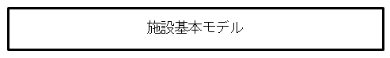

##### 4.3.2.3. データ項目に選択肢があるときの候補

* POIは、GIFコード（POIコード）を参照します。

##### 4.3.2.4. 既存データモデル

###### 4.3.2.4.1. 国土数値情報

国土数値情報の「公共施設」[^28]が参照できます。

###### 4.3.2.4.2. ３Ｄ都市モデル標準製品仕様書（国土交通省）

urf:UrbanFacility、urf:DistrictFacilityの定義および派生形が参照できます。

###### 4.3.2.4.3. Smart Data Model

スマートシティ用のBuildingデータモデルの建物の基本情報に加え、BuildingOperationやBuildhingTypeのデータ項目を組み合わせて使用するモデルです。

###### 4.3.2.4.4. Schema.org

Web検索情報用のCivicStructureが参照できます。

#### 4.3.3. 医療機関

医療機関に関する情報を示します。薬局なども含みます。

##### 4.3.3.1. 参照元データ

| 名称 | 英語名称 | 参照元 |
|:---|:---|:---|
| 医療機関 | Hospital | 推奨データセット |
| 医療施設 | MedicalFacility | ３D都市モデル標準製品仕様書 |
| 医療機関 | Hospital | Schema.org |

##### 4.3.3.2. データモデル

施設の基本モデルに、目的別追加データ項目として以下を付加して利用します。

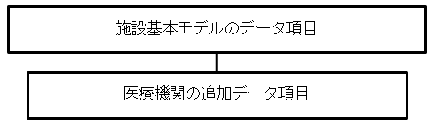

| 必須 | データ項目 | 説明 |
|:---|:---|:---|
| 必 | 医療機関区分 | 医療機関の種類を記載。 |
| 必 | 医療機関コード | 医療機関の医療機関コードを記載。 |
| | 時間外における対応 | 医療機関の診療時間外における対応内容を記載。 |
| 必 | 診療科目 | 医療機関の診療科目を「;」（半角のセミコロン）区切りで記載。 |
| | 病床数 | 医療機関の病床数を記載。 |

災害対応情報として、以下の項目を付加することもあります。

| 必須 | データ項目 | 説明 |
|:---|:---|:---|
| | 災害拠点分類 | 災害拠点病院等の分類を記載 |
| | 状況 | 医療機関の状況を記載。 |

##### 4.3.3.3. データ項目に選択肢があるときの候補

###### 4.3.3.3.1. 医療機関区分

厚生労働省が示す医療施設の区分[^29]を参照します。（診療所は、オープンデータ推奨データセットに従い、無床、有床に分割）

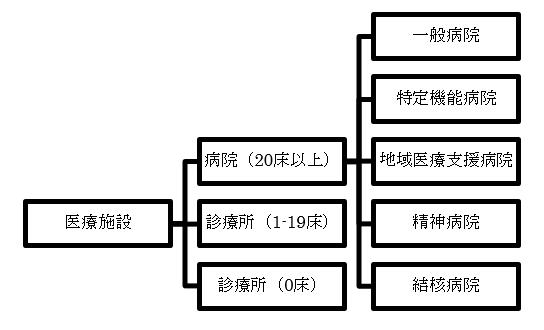

###### 4.3.3.3.2. 診療科目

診療科区分（厚生労働省 様式コード表）のコード[^30]を参照します。

| コード | 診療科目 | コード | 診療科目 |
|:---|:---|:---|:---|
| 10 | 内科 | 310 | 泌尿器科 |
| 20 | 心療内科 | 320 | 産科 |
| 30 | 精神科 | 330 | 婦人科 |
| 40 | 神経科 | 340 | 呼吸器内科 |
| 50 | 呼吸器科 | 350 | 循環器内科 |
| 60 | 消化器科 | 360 | 歯科 |
| 70 | 循環器科 | 370 | 歯科矯正科 |
| 80 | アレルギー科 | 380 | 小児歯科 |
| 90 | リウマチ科 | 390 | 歯科口腔外科 |
| 100 | 小児科 | 400 | 糖尿病科 |
| 110 | 外科 | 410 | 腎臓内科 |
| 120 | 整形外科 | 420 | 腎移植科 |
| 130 | 形成外科 | 430 | 血液透析科 |
| 140 | 美容外科 | 440 | 代謝内科 |
| 150 | 脳神経外科 | 450 | 内分泌内科 |
| 160 | 呼吸器外科 | 460 | 救急医学科 |
| 170 | 心臓血管外科 | 470 | 血液科 |
| 180 | 小児外科 | 480 | 血液内科 |
| 190 | 皮膚泌尿器科 | 490 | 麻酔科 |
| 200 | 性病科 | 500 | 消化器内科 |
| 210 | 肛門科 | 510 | 消化器外科 |
| 220 | 産婦人科 | 520 | 肝胆膵外科 |
| 230 | 眼科 | 530 | 糖尿内科 |
| 240 | 耳鼻咽喉科 | 540 | 大腸肛門科 |
| 250 | 気管食道科 | 550 | 眼形成眼窩外科 |
| 260 | リハビリテーション科 | 560 | 不妊内分泌科 |
| 270 | 放射線科 | 570 | 膠原病リウマチ内科 |
| 280 | 神経内科 | 580 | 脳卒中科 |
| 290 | 胃腸科 | 590 | 腫瘍治療科 |
| 300 | 皮膚科 | 600 | 総合診療科 |
| | | 610 | 乳腺甲状腺外科 |
| | | 620 | 新生児科 |
| | | 630 | 小児循環器科 |

###### 4.3.3.3.3. 医療機関番号

地方厚生局のコード内容別医療機関一覧表の医療機関番号を参照します。

北海道厚生局

https://kouseikyoku.mhlw.go.jp/hokkaido/iryo_shido/hoken-kikan.html

東北厚生局

https://kouseikyoku.mhlw.go.jp/tohoku/gyomu/gyomu/hoken_kikan/itiran.html

関東信越厚生局

https://kouseikyoku.mhlw.go.jp/kantoshinetsu/chousa/shitei.html

東海北陸厚生局

https://kouseikyoku.mhlw.go.jp/tokaihokuriku/gyomu/gyomu/hoken_kikan/shitei.html

近畿厚生局

https://kouseikyoku.mhlw.go.jp/kinki/tyousa/shinkishitei.html

中国四国厚生局

https://kouseikyoku.mhlw.go.jp/chugokushikoku/chousaka/iryoukikanshitei.html

四国厚生支局

https://kouseikyoku.mhlw.go.jp/shikoku/gyomu/gyomu/hoken_kikan/shitei/

九州厚生局

https://kouseikyoku.mhlw.go.jp/kyushu/gyomu/gyomu/hoken_kikan/index.html

###### 4.3.3.3.4. 災害拠点分類

「期間災害医療センター」「地域災害医療センター」「救護所」から選択します。

##### 4.3.3.4. 既存データモデル

###### 4.3.3.4.1. 厚生労働省各地方局の「保険医療機関・保険薬局の指定等一覧」

厚生労働省各地方局が毎月公表する「保険医療機関・保険薬局の指定等一覧」が参照できます。

###### 4.3.3.4.2. 国土数値情報の「医療機関」

国土数値情報の医療情報[^31]が参照できます。

###### 4.3.3.4.3. ３Ｄ都市モデル標準製品仕様書（国土交通省）

urf:MedicalFacilityのデータ項目が参照できます。

###### 4.3.3.4.4. Schema.org

Web検索情報用のHospitalのデータ項目が参照できます。

#### 4.3.4. 教育機関

> 教育機関に関する情報を以下に示します。塾など民間教育機関は事業所のデータモデルに含まれるので、このデータには含みません。

##### 4.3.4.1. 参照元データ

| 名称 | 英語名称 | 参照元 |
|:---|:---|:---|
| 学校 | School | 文部科学省、学校コード、教育データ標準 |
| 教育・文化施設 | EducationAndCultureFacility | ３D都市モデル標準製品仕様書 |
| 教育機関 | EducationalOrganization | Schema.org |

##### 4.3.4.2. データモデル

学校のデータモデルは文部科学省が定める学校コード[^32]のデータモデルを元に、教育データ標準[^61]の主体情報の学校データ項目を追加しています。

| 項目 | 備考 |
|:---|:---|
| 学校コード | 学校コードを記入する |
| 学校種 | A1：幼稚園 A2：幼保連携型 認定こども園 B1：小学校 C1：中学校 C2：義務教育学校 D1：高等学校 D2：中等教育学校 E1：特別支援学校 F1：大学 F2：短期大学 G1：高等専門学校 H1：専修学校 H2：各種学校 |
| 都道府県番号 | 学校コードの都道府県番号の規則にならう。01-47 |
| 設置区分 | 1：国立 2：公立 3：私立 |
| 設置者情報 | 学校の設置法人 |
| 本分校 | 1：本校 2：分校 9：廃校 |
| 本校学校コード | 分校の場合記入 |
| 本校学校名 | 分校の場合記入 |
| 学校名 | 設置者名は入れないことを原則とするが、学校コード上の学校種、都道府県番号及び設置区分が同一となる、同じ名称の学校が同一都 道府県内に存在する場合（例：「公立」とな る県立と市立で同じ名称の高校が存在する場合）には、区別を容易にするために設置者名を含めて記載（例：「〇〇市立〇〇高等学校」と記載）することを原則とする。 |
| 学校名カナ表記 | 学校名のカナ表記［教育データ標準から追加］ |
| 学校略称 | 学校名の略称がある場合に記入［教育データ標準から追加］ |
| 学校所在地 | 都道府県名は入れないことを原則とする。 |
| 郵便番号 | 9999999 |
| 属性情報設定年月日 | YYYY-MM-DD |
| 属性情報廃止年月日 | YYYY-MM-DD |
| 旧学校調査番号 | 学校コードへの移行前に当該学校に設定されていた都道府県番号-学校調査番号を記載する。但し、大学、短期大学、高等専門学校に ついては、都道府県番号を含めず学校調査番号のみを記載する。 |
| 移行後の学校コード | 現行の学校コードを廃止した上で別の学校コードに移行する場合に本データを設定する。 |

小学校、中学校における学区のデータモデルは、以下の項目を付加します。

| 必須 | データ項目 | 説明 |
|:---|:---|:---|
| 必 | 行政サービス拠点種別 | 行政サービス拠点の種別をPOIコードで記載。小学校の場合：1503　　中学校の場合：1504 |
| | 通学区域_登録年月日 | 通学区域の登録年月日。YYYY-MM-DD の形式で記載。 |
| | 通学区域_廃止日 | 変更等により当該通学区域が廃止された場合の年月日。学区の履歴を残したい場合にこの項目を使用する。YYYY-MM-DD の形式で記載。 |
| | 通学区域の住所 | 文字列で通学区域に含まれる住所を ";"（半角セミコロン）区切りで記載。市区町村名より後の住所を記載し、市区町村を越えた通学区域の場合は、市町村名（政令指定都市の場合は区名）から記載する。「〇〇」町の一部」「〇〇団地の〇号棟まで」といった特殊な取り扱いも記載。 |
| | 特記事項 | 選択学区など、その学校の通宅区域主体についての特殊な取り扱いについて文章で記載する。市区町村を越えた通学区域がある場合は、「〇〇市の一部住所を含む」など、その旨記載する。 |
| | ポリゴン | 地域のポリゴンファイル(Shape, GeoJson等)がある場合には、当該学区が含まれるファイル名を記載。 |

##### 4.3.4.3. 既存のデータモデル

###### 4.3.4.3.1. 文部科学省　学校コード 教育データ標準

統計用の学校コードと校務システムなど学校運営に使用する教育データ標準の主体情報としての学校データモデルがあります。学校データモデルではスマートシティ用の本データモデルより詳細な学校に関するデータ項目が定義されています。

###### 4.3.4.3.2. ３Ｄ都市モデル標準製品仕様書（国土交通省）

urf:EducationAndCultureFacilityのデータ項目が参照できます。

###### 4.3.4.3.3. Schema.org

EducationalOrganizationが参照できます。派生形として以下のデータモデルがあります。

* Preschool
* ElementarySchool
* MiddleSchool
* HighSchool
* School
* CollegeOrUniversity

#### 4.3.5. 介護サービス事業所

介護サービス事業所および介護関連事業者の情報のデータモデルです。

##### 4.3.5.1. 参照元データ

| 名称 | 英語名称 | 参照元 |
|:---|:---|:---|
| 介護サービス事業所 | Nursing home | 推奨データセット |
| 福祉施設 | Social Welfare Facility | ３D都市モデル標準製品仕様書 |
| 医療ビジネス | Medical Business | Schema.org |

##### 4.3.5.2. データモデル

施設の基本モデルに、目的別追加データ項目として以下を付加して利用します。

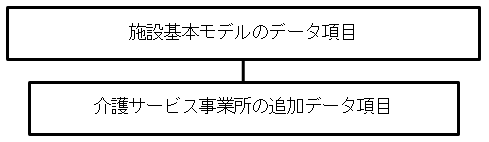

| | データ項目 | 説明 |
|:---|:---|:---|
| 必 | 実施サービス | 実施サービスを記載。 |
| | 事業所番号 | 介護サービス事業所の事業所番号を記載。 |
| | 定員 | サービスの定員を記載。 |

##### 4.3.5.3. データ項目に選択肢があるときの候補

###### 4.3.5.3.1. 実施サービス

実施サービスは、推奨データセットに記載された以下の項目を選択します。複数のサービスが該当する場合は「;」で区切り列挙する。

* 居宅介護支援
* 訪問介護（ホームヘルプ）、訪問入浴、訪問看護、訪問リハビリ、
* 夜間対応型訪問介護、定期巡回・随時対応型訪問介護看護
* 通所介護（デイサービス）、通所リハビリ、地域密着型通所介護、
* 療養通所介護、認知症対応型通所介護
* 小規模多機能型居宅介護
* 複合型サービス（看護小規模多機能型居宅介護）
* 短期入所生活介護（ショートステイ）、短期入所療養介護
* 介護老人福祉施設（特別養護老人ホーム）、介護老人保健施設（老健）
* 介護療養型医療施設、
* 特定施設入居者生活介護（有料老人ホーム・軽費老人ホーム等）、
* 認知症対応型共同生活介護（グループホーム）
* 地域密着型介護老人福祉施設入所者生活介護
* 地域密着型特定施設入居者生活介護
* 福祉用具貸与、特定福祉用具販売

##### 4.3.5.4. 既存のデータモデル

###### 4.3.5.4.1. ３Ｄ都市モデル標準製品仕様書（国土交通省）

urf:SocialWelfareFacilityのデータ項目が参照できます。

###### 4.3.5.4.2. Schema.org

Medical Businessが参照できます。

#### 4.3.6. 子育て支援施設

保育園や学童クラブなどの子育て支援施設情報のデータモデルです。

##### 4.3.6.1. 参照元データ

| 名称 | 英語名称 | 参照元 |
|:---|:---|:---|
| 子育て支援施設 | Child support facility | 推奨データセット |

##### 4.3.6.2. データモデル

施設の基本モデルに、目的別追加データ項目としてオープンデータの推奨データセットの「子育て施設」のデータ項目を付加して利用します。

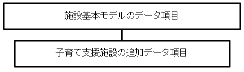

| | データ項目 | 説明 |
|:---|:---|:---|
| | 認可等年月日 | 認可又は認定をもらった時の年月日を記載。 |
| | 収容定員 | 収容できる定員数を記載。 |
| | 受入年齢 | 利用可能年齢を記載。 |
| | 一時預かりの有無 | 一時預かりがあるかどうかを記載。 |
| | 病児保育 | 病児保育の可否 |

##### 4.3.6.3. データ項目に選択肢があるときの候補

###### 4.3.6.3.1. POIコード

施設項目のPOIコードに、以下から選択したコードを記入します。

* 授乳室
* 保育園
* 児童館（児童センター）
* 学童保育クラブ
* 認定こども園
* 幼稚園
* その他の社会福祉施設

#### 4.3.7. 事業所

店舗や事務所などの事業所を表すデータモデルです。

##### 4.3.7.1. 参照元データ

| 名称 | 英語名称 | 参照元 |
|:---|:---|:---|
| 事業所 | Business facility | ｇBizInfo |
| 店舗 | Store | Smart data model |
| 事業所、店舗 | Local business、Store | Schema.org |

##### 4.3.7.2. データモデル

gBizInfo[^62]のデータモデルに、目的別追加データ項目として以下を付加して利用します。

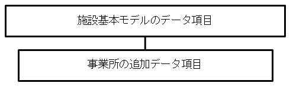

| 必須 | データ項目 | 説明 |
|:---|:---|:---|
| | 事業所ID | 事業所のIDを記載。（現在未定義の予約領域） |
| | 業種 | 事業所が主に提供するサービスの業種コードを記載 |
| | 法人番号 | 法人の事業所の場合、法人番号を記載。個人事業主の場合は空欄。 |
| 必 | 法人名 | 法人の事業所の場合、法人名を記載。個人事業主の場合は空欄。 |
| | 許可種類 | 営業許可などがある場合に記入 |
| | 許可番号 | 営業許可などがある場合に許可番号を記入 |

##### 4.3.7.3. データ項目に選択肢があるときの候補

###### 4.3.7.3.1. 業種

日本標準産業分類[^33]を参照します

##### 4.3.7.4. 既存のデータモデル

###### 4.3.7.4.1. Smart Data Model

Point of Interestの派生形のStoreのデータ項目が参照できます。営業時間や店舗のロゴなど詳細なデータ項目が定義されています。

###### 4.3.7.4.2. Schema.org

Local BusinessとStoreが参照できます。営業時間や店舗のロゴなど詳細なデータ項目が定義されています。

#### 4.3.8. 食品等営業許可・届出事業所

保健所に届け出を行う食堂や食料品販売などの事業所の情報を以下に示します。

##### 4.3.8.1. 参照元データ

| 名称 | 英語名称 | 参照元 |
|:---|:---|:---|
| 食品等営業許可・届出事業所 | Food shop | 推奨データセット |
| 食品等営業許可・届出事業所 | | 厚生労働省オープンデータ一覧[^34] |

##### 4.3.8.2. データモデル

施設基本モデルに、目的別追加データ項目として以下を付加して利用します。

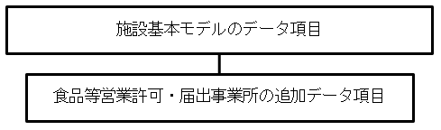

| 必須 | データ項目 | 説明 |
|:---|:---|:---|
| 必 | 営業の種類 | 食品衛生法施行令第35条にて定める34の営業の分類と、各地方公共団体における条例で定めた分類の中から該当するものを記載。 |
| | 業態 | 営業施設の業態に係る情報で、「営業の種類」の項目より詳細な情報を記載。（「自動販売機」、「移動販売」、「臨時営業」等の情報も本項目に記載。） |
| 必 | 営業所所在地 | 営業施設の住所を記載。 |
| | 営業所建物名等 | 営業施設の住所の建物名等を記載。 |
| | 緯度 | 営業施設の緯度を記載。 |
| | 経度 | 営業施設の経度を記載。 |
| | 営業所電話番号 | 営業施設の連絡先（電話番号）を記載。 |
| | 法人名 | 営業許可申請の申請主体が法人の場合、法人名を記載。営業許可申請が個人の場合は記載不要。 |
| | 法人番号 | 営業許可申請の申請主体が法人の場合、法人番号を記載。営業許可申請が個人の場合は記載不要。 |
| 必 | 許可番号 | 営業許可申請に対する各地方公共団体で管理する許可番号を記載。 |
| | 初回許可年月日 | 初回に営業許可を出した時の年月日を記載。 |
| 必 | 許可年月日 | 直近で営業許可を出した時の年月日を記載。 |
| | 許可開始日 | 営業許可開始日の年月日を記載。 |
| 必 | 許可満了日 | 営業許可満了日の年月日を記載。 |
| | 廃業年月日 | 廃業届を受理した際の廃業日の年月日を記載。 |
| | 申請区分 | 受理した申請の区分を記載。「新規」「変更」「継続」「廃業」 |
| | 許可条件 | 営業許可にあたり、付けている条件がある場合、その内容を記載。 |

##### 4.3.8.3. データ項目に選択肢があるときの候補

###### 4.3.8.3.1. 食品衛生法施行令第35条

営業の種類を以下の中から選択する。

1. 飲食店営業
2. 喫茶店営業
3. 菓子製造業
4. あん類製造業
5. アイスクリーム類製造業
6.  乳処理業
7.  特別牛乳搾取処理業
8.   乳製品製造業
9.   集乳業
10.  乳類販売業
11.  食肉処理業
12.  食肉販売業
13.  食肉製品製造業
14.  魚介類販売業
15.  魚介類せり売営業
16.  魚肉ねり製品製造業
17.  食品の冷凍又は冷蔵業
18.  食品の放射線照射業
19.  清涼飲料水製造業
20.  乳酸菌飲料製造業
21.  氷雪製造業
22.  氷雪販売業
23.  食用油脂製造業
24.  マーガリン又はショートニング製造業
25.  みぞ製造業
26.  しょう油製造業
27.  ソース類製造業
28.  酒類製造業
29.  豆腐製造業
30.  納豆製造業
31.  めん類製造業
32.  そうざい製造業
33.  缶詰又は瓶詰製造業
34.  添加物製造業

https://www.mhlw.go.jp/content/11121000/000349946.pdf

#### 4.3.9. 公園

都市公園や緑地などに関する情報を以下に示します。

##### 4.3.9.1. 参照元データ

| 名称 | 英語名称 | 参照元 |
|:---|:---|:---|
| 公園 | Park | 推奨データセット |
| 公共スペース | urf:OpenspaceForPublicUse | ３D都市モデル標準製品仕様書 |
| 公園 | Park | Schema.org |

##### 4.3.9.2. データモデル

施設の基本モデルに、目的別追加データ項目として以下を付加して利用します。

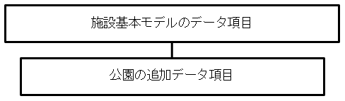

| 必須 | データ項目 | 説明 |
|:---|:---|:---|
| | 目的 | 「体を動かす」「自然に触れる」「スポーツをする」「施設を利用する」や自由記述の特徴語を;区切りで列挙。 |
| | 公園種別 | 国土数値情報「都市公園」公園種別コードから選択する。 |
| | 特徴 | 「芝生広場」、「水遊び」、「ボート」、「森」、「歴史」、「庭園」や自由記述の特徴語を;区切りで列挙。 |
| | 主な遊具 | 「健康遊具」「滑り台」「ブランコ」「鉄棒」「ジャングルジム」「複合遊具」「砂場」や自由記述の特徴語を;区切りで列挙。 |
| | 主な植物 | 「アジサイ」「イチョウ」「ウメ」「サクラ」「スイセン」「チューリップ」「ツツジ」「バラ」「フジ」「モミジ」や自由記述の特徴語を;区切りで列挙。 |
| | スポーツ | 「ジョギング」「テニス」「野球」「サッカー」「バスケットボール」「アスレチックコース」「プール」「ゲートボール」や自由記述の特徴語を;区切りで列挙。 |
| | 面積 | 公園の面積（m2） |
| | 施設 | 「レストラン」「売店」「トイレ」「集会場」や自由記述の特徴語を;区切りで列挙。 |
| | 禁止事項 | 「火気」「球技」「楽器」「ペット」「自転車」「遊泳」「動植物の採集」「凧あげ」「宴会」「野営」や自由記述の特徴語を;区切りで列挙。 |

##### 4.3.9.3. データ項目内で選択肢があるときの候補

###### 4.3.9.3.1. 国土数値情報

公園種別は、「都市公園」公園種別コードから選択します。

1. 街区公園
2. 近隣公園
3. 地区公園（カントリーパーク）
4. 総合公園
5. 運動公園
6. 広域公園
7. レクリエーション都市
8. 国営公園
9. 特殊公園（風致公園、動植物公園、歴史公園、墓園）
10. 緩衝緑地
11. 都市緑地
12. 緑道
13. 都市林
14. 広場公園

##### 4.3.9.4. 既存データモデル

###### 4.3.9.4.1. 国土数値情報

「都市公園」のデータモデル[^35]が参照できます。

###### 4.3.9.4.2. ３Ｄ都市モデル標準製品仕様書（国土交通省）

urf:OpenspaceForPublicUseのデータ項目が参照できます。urf:parAttributeで公園サイズやIDを付加することもできます。

###### 4.3.9.4.3. Schema.org

Parkのモデルが参照できます。開園時間など詳細なデータ項目が定義されています。

#### 4.3.10. 交番

交番の情報を以下に示します。

##### 4.3.10.1. 参照元データ

| 名称 | 英語名称 | 参照元 |
|:---|:---|:---|
| 交番 | Police station | なし |

##### 4.3.10.2. データモデル

交番のデータモデルは以下のモデルで示せます。

| 必須 | 項目名 | 項目の説明 |
|:---|:---|:---|
| | ID | 交番に一意のID。 |
| 必 | 名称 | 交番の名称。 |
| | 名称(カナ） | 交番のカナ名称。 |
| | 名称(英語） | 交番の英語名称。 |
| 必 | 警察署 | 警察署名。 |
| | 行政サービス拠点種別 | 交番のPOIコード「1212」を記入 |
| 必 | 住所町字 | 交番の住所表記（都道府県から記入、番地以下省略） |
| 必 | 住所番地以下 | 交番の住所表記（丁目以下を半角数字とハイフンで記入）。 |
| | 建物名等 | 交番の入る建物名。 |
| | 市区町村 | 所管範囲の市区町村コードをセミコロン区切りで列挙。 |
| | 町丁字 | 所管範囲の町丁字セミコロン区切りで列挙。 |
| | ポリゴン | 所管地域のポリゴンのファイルがある場合にはファイル名を記入。 |
| | 備考 | 所管範囲が市区町、町丁字の一部の場合には、それぞれの項目で少しでも含まれている場合には記入の上、この項目で、一部である解説をする。 |

#### 4.3.11. 入浴施設

温泉、銭湯などの入浴施設の情報を以下に示します。

##### 4.3.11.1. 参照元データ

| 名称 | 英語名称       | 参照元 |
|:---|:---|:---|
| 交番 | Police station | なし   |

##### 4.3.11.2. データモデル

施設の基本モデルに、目的別追加データ項目として以下を付加して利用します。

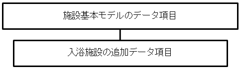

| 必須 | 項目名 | 項目の説明 |
|:---|:---|:---|
| | 湯の種類 | 温泉、鉱泉、炭酸泉、湯 |
| | サービス内容 | 露天風呂、無料シャンプー・ソープ、タオルレンタル、サウナ、水風呂、休息所、ランドリー、wifi |

#### 4.3.12. クリーニング施設（コインランドリー含む）

クリーニング店、コインランドリ等の施設の情報を以下に示します。

##### 4.3.12.1. 参照元データ

| 名称 | 英語名称 | 参照元 |
|:---|:---|:---|
| クリーニング施設 | Cleaning | 推奨データセット「公共施設」 |

##### 4.3.12.2. データモデル

施設の基本モデルに、目的別追加データ項目として以下を付加して利用します。

| 必須 | 項目名 | 項目の説明 |
|:---|:---|:---|
| | サービス内容 | 「クリーニング」、「コインランドリ」「クリーニング;コインランドリ」から選択する。 |
| | コインランドリ台数 | 台数を記入する。 |
| | 洗剤販売 | 販売の有無。 |

### 4.4. 　設備

都市や建物に設置された設備の情報を以下に示します。

#### 4.4.1. 基本形

全ての設備に共通的なデータモデルです。

##### 4.4.1.1. 参照元データ

| 名称 | 英語名称 | 参照元 |
|:---|:---|:---|
| 設備 | Equipment | GIFコアデータモデル |
| 都市設備 | CityFurniture | ３D都市モデル標準製品仕様書 |
| 製品 | Product | Schema.org |

##### 4.4.1.2. データモデル

設備の基本モデルを以下に示します。

| 必須 | 項目名 | 説明 |
|:---|:---|:---|
| | ID | 機械的に採番された設備を一意に識別するID。設備単位に付番する |
| | 区分 | 設備の区分 |
| | 種類 | 設備の種類 |
| 必 | 名称 | 設備の名称 |
| 必 | 名称（カナ） | 設備のカナ表記 |
| 必 | 名称（英字） | 設備の英語名またはローマ字表記 |
| | 説明 | 設備情報として公開可能な詳細情報 |
| | 状態 | 「稼働中」などのステータス |
| 必 | 設備住所 | 住所情報（住所型の緯度経度を使用） |
| | サービス曜日 | 設備を利用できる曜日 |
| | 開始時刻 | 設備を利用開始できる時間 |
| | 終了時刻 | 設備の利用終了時間 |
| | 日時備考 | 定型で表せない設備の利用日時情報 |
| | URL | AEDの設置場所写真のURLなど |
| | 備考 | 設備の備考 |
| | 連絡先情報 | 連絡先の情報（連絡先型） |

##### 4.4.1.3. データ項目内で選択肢があるときの候補

###### 4.4.1.3.1. 区分

CityGML 2.0　Annex C.4のコードを使用します。

| コード | 説明 |
|:---|:---|
| 1000 | 交通施設 |
| 1010 | 通信施設 |
| 1020 | 保安施設 |
| 1030 | その他 |

###### 4.4.1.3.2. 種類

道路基盤地図情報製品仕様書（案）、作業規程の準則（公共測量標準図式）を使用します。

| コード | 説明 | コード | 説明 |
|:---|:---|:---|:---|
| 1000 | 道路標示 | 5300 | CAB |
| 1010 | 区画線 | 5400 | 情報BOX |
| 1020 | 車道中央線 | 5500 | 管路 |
| 1030 | 車線境界線 | 5600 | 管理用開口部 |
| 1040 | 車道外側線 | 5610 | マンホール |
| 1100 | 指示標示 | 5620 | ハンドホール |
| 1110 | 横断歩道 | 5630 | 入孔 |
| 1120 | 停止線 | 6000 | 距離標 |
| 1200 | 規制標示 | 6010 | 境界標識 |
| 2000 | 柵・壁 | 6020 | 道路元標・里程標 |
| 3000 | 道路標識 | 6100 | 料金徴収施設 |
| 3110 | 案内標識 | 6200 | 融雪施設 |
| 3120 | 警戒標識 | 7000 | 排水施設 |
| 3130 | 規制標識 | 7100 | 集水桝 |
| 3140 | 指示標識 | 7200 | 排水溝 |
| 3150 | 補助標識 | 7300 | 側溝 |
| 4000 | 建造物 | 7400 | 排水管 |
| 4010 | 上屋 | 7500 | 排水ポンプ |
| 4020 | 地下出入口 | 8010 | 停留所 |
| 4100 | 視線誘導標 | 8020 | 消火栓 |
| 4120 | 道路反射鏡 | 8030 | 郵便ポスト |
| 4200 | 照明施設 | 8040 | 電話ボックス |
| 4300 | 道路情報管理施設 | 8050 | 輸送管 |
| 4400 | 災害検知器 | 8060 | 軌道 |
| 4500 | 気象観測装置 | 8070 | 架空線 |
| 4600 | 道路情報板 | 8080 | 自動販売機 |
| 4700 | 光ファイバー | 8090 | 墓碑 |
| 4800 | 柱 | 8100 | 記念碑 |
| 4810 | 路側 | 8110 | 立像 |
| 4820 | 片持 | 8120 | 噴水 |
| 4830 | 門型 | 8130 | 井戸 |
| 4840 | 電柱 | 8140 | 掲示板 |
| 4900 | 交通信号機 | 8150 | 点字ブロック |
| 5000 | 階段 | 8160 | ベンチ |
| 5010 | 通路 | 8170 | テーブル |
| 5020 | エレベータ | 9000 | その他 |
| 5030 | エスカレータ | 9001 | 看板（自立式） |
| 5100 | 管理用地上施設 | 9002 | 水飲み |
| 5200 | 電線共同溝 | | |

##### 4.4.1.4. 既存データモデル

###### 4.4.1.4.1. ３Ｄ都市モデル標準製品仕様書

frn:CityFurnitureのデータモデルが参照できます。

###### 4.4.1.4.2. Schema.org

Productのデータモデルが参照できます。設備の製造元、サイズなどの詳細のデータ項目はありますが、位置情報はありません。

#### 4.4.2. 出入口

建物や公園等の入り口、駐車場、車両搬入口等の情報を以下に示します。

##### 4.4.2.1. 参照元データ

| 名称 | 英語名称 | 参照元 |
|:---|:---|:---|
| 出入口 | Gate | なし |
| ドア | Door | ３D都市モデル標準製品仕様書 |

##### 4.4.2.2. データモデル

以下のデータモデルを参照します。

| 必須 | データ項目 | 説明 |
|:---|:---|:---|
| | 名称 | 出入口の名称を記入する |
| | 利用開始時間 | 開門、開扉時間を記入する |
| | 利用終了時間 | 閉門、閉扉時間を記入する |
| 必 | 緯度 | 緯度を記入する |
| 必 | 経度 | 経度を記入する |
| | 出入口情報 | 入口、出口、出入口、搬出入口から選択する |
| | エスカレータ | 人の出入り口の場合のエスカレータ有無 |
| | エレベータ | 人の出入り口の場合のエレベータ有無 |
| | スロープ | 人の出入り口の場合のスロープの有無 |
| | 点字ブロック | 人の出入り口の場合の点字ブロックの有無 |
| | 車高制限 | 車の出入り口の場合の車高制限 |
| | 車幅制限 | 車の出入り口の場合の車幅制限 |
| | 備考 | 出入口に関する関連情報を記入する |

##### 4.4.2.3. 既存データモデル

###### 4.4.2.3.1. GTFS

出入口のデータ項目にGTFSのSTOPを使用する場合には、Location_typeに出入口を表す「2」を指定します。

###### 4.4.2.3.2. ３Ｄ都市モデル標準製品仕様書

建物の場合bldg:Doorのデータモデルが参照できます。

#### 4.4.3. AED

AEDの情報を以下に示します。

##### 4.4.3.1. 参照元データ

| 名称 | 英語名称 | 参照元 |
|:---|:---|:---|
| AED | AED | 推奨データセット |

##### 4.4.3.2. データモデル

設備の基本モデルに、目的別追加データ項目として以下を付加して利用します。

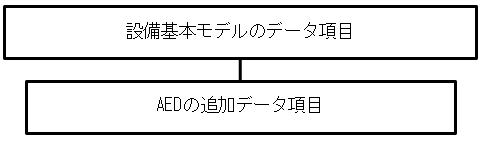

| 必須 | データ項目 | 説明 |
|:---|:---|:---|
| 必 | 設置位置 | AED設置場所における詳細位置を記載。（受付等） |
| 必 | 画像 | AED設置場所の位置が分かる俯瞰写真のURL |
| | 外部利用不可 | 設置場所が制限区域内にあり外部利用ができない場合に「外部利用不可」時入 |

#### 4.4.4. 公衆無線LANアクセスポイント

公衆無線LANの情報を以下に示します。

##### 4.4.4.1. 参照元データ

| 名称 | 英語名称 | 参照元 |
|:---|:---|:---|
| 公衆無線LANアクセスポイント | Wifi | 推奨データセット |

##### 4.4.4.2. データモデル

設備の基本モデルに、目的別追加データ項目として以下を付加して利用します。

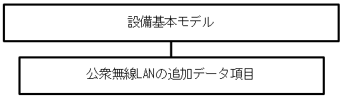

| 必須 | データ項目 | 説明 |
|:---|:---|:---|
| | SSID | 公衆無線LANのSSIDを記載。 |
| | 提供エリア | 公衆無線LANの設置施設の施設内の提供エリアを記載。 |
| | URL | 公衆無線LANの設置施設のWebサイトのURLを記載。 |

#### 4.4.5. 公衆トイレ

公衆トイレの情報を以下に示します。

##### 4.4.5.1. 参照元データ

| 名称 | 英語名称 | 参照元 |
|:---|:---|:---|
| 公衆トイレ | Public Toilet | 推奨データセット |
| 公衆トイレ | Public Toilet | Schema.org |

##### 4.4.5.2. データモデル

施設の基本モデルに、目的別追加データ項目として以下を付加して利用します。

| 必須 | データ項目 | 説明 |
|:---|:---|:---|
| 必 | 車椅子使用者用トイレ | 車椅子使用者用トイレの設置有無を記載。有(1)無(0) |
| 必 | 乳幼児用設備設置トイレ | 乳幼児用設備設置トイレの設置有無を記載。有(1)無(0) |
| 必 | オストメイト設置トイレ | オストメイト設置トイレの設置有無を記載。有(1)無(0) |

推奨データセットには便器の数もデータ項目としてありますが省略可能とします。

##### 4.4.5.3. 既存データモデル

###### 4.4.5.3.1. Schema.org

PublicToiletのモデルが参照できます。

#### 4.4.6. 消防水利施設

消火栓などの消防水利施設の情報を以下に示します。

##### 4.4.6.1. 参照元データ

| 名称 | 英語名称 | 参照元 |
|:---|:---|:---|
| 消防水利施設 | Water supply for fire | 推奨データセット |

##### 4.4.6.2. データモデル

設備の基本モデルに、目的別追加データ項目として以下を付加して利用します。利用可能時間などは省略可能です。

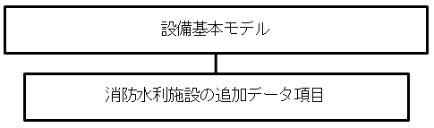

| 必須 | データ項目 | 説明 |
|:---|:---|:---|
| 必 | 種別 | 消防水利施設の種類を記載。 |
| | 口径 | 消防水利施設が対応する口径をミリメートル単位で記載。 |

##### 4.4.6.3. データ項目に選択肢があるときの候補

###### 4.4.6.3.1. オープンデータの推奨データセット

種別のデータ項目は、以下から選択する。

* 消火栓
* 私設消火栓
* 防火水そう
* プール
* 河川・溝等
* 濠・池等
* 海・湖
* 井戸
* 下水道
* その他

### 4.5. 　　建物内・地下街・地下埋設物

#### 4.5.1. 建物内・地下街

CityGMLのConstructionモジュールのBuilding等を使い、建物内、地下街、地下通路等を表すことが考えられますが今後の検討課題とします。

建物内・地下街内の施設や設備は、施設や設備のデータモデルで表現します。

#### 4.5.2. 地下埋設物

３D都市モデル標準製品仕様書urbanFunctionのurf;SupplyFacilityで水道、ガスや、urf:TreatmentFacilityで下水などを表すことが考えられますが今後の検討課題とします。

#### 4.5.3. ボーリング柱状図等

「地質・土質調査成果電子納品要領」（国土交通省策定）の「第2編ボーリング柱状図編　5ボーリング交換用データ」及び「第6編土質試験及び地盤調査編　6土質試験結果一覧表データ」を参考にして下さい。[^36]

### 4.6. 　道路

#### 4.6.1. 道路

道路のデータは、道路名（路線名）、起点終点、代表点、道路最小幅等の様々な要素があります。

##### 4.6.1.1. 参照元データ

| 名称 | 英語名称 | 参照元 |
|:---|:---|:---|
| 高速道路時系列、道路密度・道路延長メッシュ、緊急輸送道路 | | 国土数値情報 |
| 道路 | Road | ３D都市モデル標準製品仕様書 |
| 道路 | Road | Smart data model |

##### 4.6.1.2. データモデル

道路の概要については国土数値情報を参考に以下の道路モデルを示しますが、道路の詳細モデルについては３D都市モデル標準製品仕様書（CityGML）のTransportation（tran:road）を参照してください。

| 必須 | データ項目 | 説明 |
|:---|:---|:---|
| | 路線名 | 路線名 |
| | 道路種別コード | 道路の種別のコード |
| | 路線 | 路線区間の位置（直線、曲線） |
| | 地点 | 接続部の位置 |
| | 地点名 | 接続部の名称 |
| | 幅員 | 幅員(m) |
| | 状況 | 当該路線が供用されている状況の区分 |

##### 4.6.1.3. データ項目に選択肢があるときの候補

###### 4.6.1.3.1. 国土数値情報　緊急輸送道路　道路種別コード

種別のデータ項目は、以下から選択します。

| コード | 定義 |
|:---|:---|
| 1 | 高速自動車国道 |
| 2 | 都市高速道路 |
| 3 | 一般国道 |
| 4 | 主要地方道（都道府県道） |
| 5 | 主要地方道（指定市市道） |
| 6 | 一般都道府県道 |
| 7 | 市町村道（認定道路） |
| 8 | その他道路 |
| 9 | 不明 |

##### 4.6.1.4. 既存データモデル

###### 4.6.1.4.1. ３Ｄ都市モデル標準製品仕様書

Tran:roadのモデルが参照できます。車道、歩道など詳細な３Dモデルを作成できます。

###### 4.6.1.4.2. 電子国土基本図　地図情報ファイル仕様書

交通施設のサブパッケージのデータモデルを参照できます。

###### 4.6.1.4.3. Smart data model

Roadのモデルが参照できます。道路の概要情報を記載するデータモデルです。

#### 4.6.2. 道路関連設備

道路には標識や電柱、排水溝等の様々な設備が設置されています。道路関連設備のデータモデルについては３D都市モデル標準製品仕様書（CityGML）のCityFurniture（frn:CityFurniture）を使用することができます。

「設備」のデータ項目を参照してください。

#### 4.6.3. 交通規制情報

交通規制情報は、事故、工事、イベントなどにより随時発生し、都市情報として重要です。

公益財団法人日本道路交通情報センターの公開する「一般道路の「交通規制情報(11種別)」[^37]が参照できます。

| No. | 規制種別 |
|---|---|
| 1 | 歩行者用道路|
| 2 | 自転車用道路 |
| 3 | 自転車及び歩行者用道路 |
| 4 | 通行止め |
| 5 | 車両通行止め |
| 6 | 指定方向外進行禁止 |
| 7 | 一方通行 |
| 8 | 一時停止 |
| 9 | 信号機 |
| 10 | ゾーン 30 |
| 11 | 環状交差点 |

#### 4.6.4. 交通インフラ（橋、トンネル等）

交通インフラ情報は、CityGMLのConstructionモジュールが参照できます。また、電子国土基本図　地図情報ファイル仕様書の交通施設のサブパッケージのデータモデルも参照できます。

### 4.7. 交通関連施設

「施設」のデータモデルをもとに交通関係の施設を表します。

#### 4.7.1. 空港

空港の情報を以下に示します。

##### 4.7.1.1. 参照元データ

| 名称 | 英語名称 | 参照元 |
|:---|:---|:---|
| 空港 | Airport | 推奨データセット「施設」 |
| 交通施設 | urf:TrafficFacility | ３D都市モデル標準製品仕様書 |
| 空港 | Airport | Smart data model |
| 空港 | Airport | Schema.org |

##### 4.7.1.2. データモデル

施設の基本モデルを使用します。

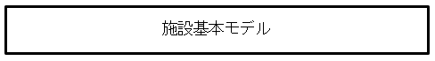

##### 4.7.1.3. データ項目に選択肢があるときの候補

* POIは、GIFコード（POIコード）を参照します。

##### 4.7.1.4. 既存データモデル

###### 4.7.1.4.1. 国土数値情報

交通（交通）の空港のデータモデルが参照できます。

###### 4.7.1.4.2. Smart Data Model

スマートシティ用のAirportのデータモデルを参照できます。IATAコード、ICAOコードなどが付加できます。

###### 4.7.1.4.3. Schema.org

Web検索情報用のAirportが参照できます。IATAコード、ICAOコードなどが付加できます。

#### 4.7.2. 港湾

港湾の情報を以下に示します。

##### 4.7.2.1. 参照元データ

| 名称 | 英語名称 | 参照元 |
|:---|:---|:---|
| 港湾 | Port | 推奨データセット「施設」 |
| 港湾施設 | SeaportFacilities | Smart data model |
| ボートターミナル | BoatTerminal | Schema.org |

##### 4.7.2.2. データモデル

施設の基本モデルを使用します。

##### 4.7.2.3. 既存データモデル

###### 4.7.2.3.1. 国土数値情報

交通（交通）の港湾、漁港のデータモデルが参照できます。

###### 4.7.2.3.2. Smart data model

TransportStationとPublicTransportStopが参照できます。

#### 4.7.3. 駅・バス停

駅・バス停の情報を以下に示します。

##### 4.7.3.1. 参照元データ

| 名称 | 英語名称 | 参照元 |
|:---|:---|:---|
| 駅 | Station | GTFS-JP |
| バス停 | Bus stop | GTFS-JP |
| 移動ステーション、公共交通停車場 | TransportStation,PublicTransportStop,GtfsStation | Smart data model |
| 駅、バスステーション、バス停留所 | TrainStation,BusStation,BusStop | schema.org |

##### 4.7.3.2. データモデル

GTFS-JP[^63]の「停留所・標柱情報（STOP）」モデルを参照します。

| 必須 | データ項目 | GTFSフィールド名 | 説明 |
|:---|:---|:---|:---|
| 必 | 停留所・標柱ID | stop_id | 駅、停車場を識別する ID を指定 |
| | 停留所・標柱番号 | stop_code | 駅IDを指定 |
| 必 | 停留所・標柱名称 | stop_name | 駅や停車場の名前 |
| | 停留所・標柱付加情報 | stop_desc | 駅や停車場に関する説明 |
| | 緯度 | stop_lat | 場所の緯度。 |
| | 経度 | stop_lon | 場所の経度。 |
| | 運賃エリアID | Zone_id | 均一制の場合、運賃エリアを設定。対キロ制の場合、標柱IDを設定。 |
| | 停留所・標柱url | stop_url | ウェブページの URL。 |
| 必 | 停留所・標柱区分 | location_type | 駅を示す「1」を記入 |
| | タイムゾーン | stop_timezone | 日本では設定しない |
| | 車いす対応 | wheelchair_boarding | 車椅子での乗車が可能かどうかを指定 |
| | プラットフォーム番号 | platform_code | 駅やバスターミナルでのプラットフォームや乗り場の情報 |

##### 4.7.3.3. 既存データモデル

###### 4.7.3.3.1. 国土数値情報

交通（交通）のバス停留所のデータモデルが参照できます。

###### 4.7.3.3.2. GTFS

Stopのデータ項目として、階や停留所の親子関係が記述できます。[^38]

###### 4.7.3.3.3. Smart data model

TransportStation、PublicTransportStopが参照できます。

###### 4.7.3.3.4. Schema.org

駅、バスターミナル、バス停の詳細を記述する場合にはTrainStation、BusStation、BusStopが参照できます。

#### 4.7.4. 鉄道路線・バス路線

鉄道やバス路線の情報を以下に示します。

##### 4.7.4.1. 参照元データ

| 名称 | 英語名称 | 参照元 |
|:---|:---|:---|
| 鉄道路線、バス路線 | Route | GTFS-JP |

##### 4.7.4.2. データモデル

GTFSのモデルを使用します。

| 必須 | データ項目名 | GTFS | 説明 |
|:---|:---|:---|:---|
| 必 | 経路ID | route_id | 事業者が内部的に使用しているコードをそのまま設定可。 |
| 必 | 経路名 | route_long_name | 経路の正式名称 |
| | 経路略称 | route_short_name | 経路に通称がある場合に記入 |
| 必 | 事業者ID | agency_id | 運行会社の法人番号 |
| | 経路情報 | route_desc | 経路の説明。 |
| 必 | 経路タイプ | route_type | 経路で使用される輸送手段のタイプ |
| | URL | route_url | ウェブページの URL。 |
| | 経路色 | route_color | 経路を線やラベルなどで表現する場合の色 |
| | 経路文字色 | route_text_color | 経路を線やラベルなどで表現する場合に、その上に系統名などを表示する場合の色 |
| | 路線ID | jp_parent_rout_id | 経路の親となる情報（路線IDまたは路線名称等）を設定。 |

##### 4.7.4.3. データ項目に選択肢があるときの候補

###### 4.7.4.3.1. GTFSの経路タイプ

鉄道、バス、フェリー等を表す路線タイプは、欧州全域 TPEG 規格の階層型車種（HVT）コードを参照して検討されているGTFSのルートタイプを参照します。

| コード | 説明 |
|---|---|
| 0 | 路面電車、市街電車、ライトレール。都市圏内を運行する軽量軌道交通または路面電車システム。 |
| 1 | 地下鉄、メトロ。都市圏内を運行する地下鉄システム。 |
| 2 | 電車。都市間または長距離の鉄道路線。 |
| 3 | バス。短距離および長距離のバス路線。 |
| 4 | フェリー。短距離および長距離の航路。 |
| 5 | ケーブルトラム。ケーブルが車両の下を通る、路面を走る鉄道車両（例: サンフランシスコのケーブルカー）。 |
| 6 | 索道（例: リフト、ケーブルカー、ゴンドラ、ロープウェイ）1 本または複数本のケーブルに吊り下げた客車、車両、ゴンドラ、椅子で移動する交通機関。 |
| 7 | 鋼索鉄道。急斜面用に設計されたすべての鉄道システム。 |
| 11 | トロリーバス。道路上空の架線から棹状の集電装置で集めた電気を動力として走るバス。 |
| 12 | モノレール。1 本のレールまたは桁を軌道とする鉄道。 |

##### 4.7.4.4. 既存データモデル

###### 4.7.4.4.1. 国土数値情報

交通（交通）のバスルート、鉄道のデータモデルが参照できます。

###### 4.7.4.4.2. GTFS

Routeのデータ項目として、経路順や途中乗降の情報等が記述できます。

#### 4.7.5. タクシー乗り場

タクシー乗り場の情報を以下に示します。

##### 4.7.5.1. 参照元データ

| 名称 | 英語名称 | 参照元 |
|:---|:---|:---|
| タクシー乗り場 | Taxi stand | Schema.org |

##### 4.7.5.2. データモデル

Schema.orgのTaxistandのデータ項目のうち主要項目を利用します。

| 必須 | データ項目 | Schema.org | 説明 |
|:---|:---|:---|:---|
| 必 | 乗り場ID | identifier | 駅、停車場を識別する ID を指定 |
| 必 | 名称 | name | 乗り場の名前 |
| | 説明 | description | 乗り場に関する説明 |
| | 住所 | address | 乗り場の住所 |
| 必 | 緯度 | latitude | 場所の緯度。 |
| 必 | 経度 | longitude | 場所の経度。 |
| | url | url | ウェブページの URL。 |
| | 配車時間 | openingHours | 配車時間。 |

##### 4.7.5.3. 既存データモデル

###### 4.7.5.3.1. Schema.org

Taxiで運行会社などの詳細データ項目が定義されています。また、タクシー予約、ピックアップ場所、ピックアップ時間のデータモデルも参照できます。

#### 4.7.6. 駐車場

自動車、バス、バイク等の駐車場のデータモデルを示します。

##### 4.7.6.1. 参照元データ

| 名称 | 英語名称 | 参照元 |
|:---|:---|:---|
| 駐車場 | Off street Parking | Smart data model |
| 駐車場 | Parking facility | Schema.org |

##### 4.7.6.2. データモデル

施設の基本モデルに、目的別追加データ項目として以下を付加して利用します。

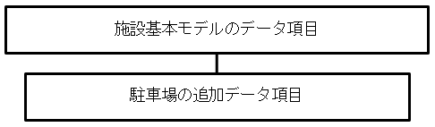

| 必須 | データ項目 | 説明 |
|:---|:---|:---|
| 必 | 車種 | 「普通車」、「バス」、「バイク」を記入 |
| 必 | 最大駐車台数 | 最大駐車台数を記入 |
| | 利用可能台数 | 現時点での利用可能駐車台数を記入 |
| | 一時間あたりの入庫車数 | 直近1時間の入庫台数 |
| | 付帯設備 | トイレ、自動販売機、洗車場、充電設備等を記入 |

##### 4.7.6.3. 既存データモデル

###### 4.7.6.3.1. Smart data model

Off street Parkingに、車種、車両条件、料金、平置き等を詳細に記述するためのデータ項目が提供されています。

###### 4.7.6.3.2. Schema.org

ParkingFacilityのデータモデルが参照できます。

#### 4.7.7. 駐車スペース（路上）

パーキングメーターなどの路上の駐車スペースのデータモデルを示します。

##### 4.7.7.1. 参照元データ

| 名称 | 英語名称 | 参照元 |
|:---|:---|:---|
| 駐車スペース（路上） | OnStreetParking | Smart Data Model |

##### 4.7.7.2. データモデル

駐車場の基本モデルに、目的別追加データ項目として以下を付加して利用します。

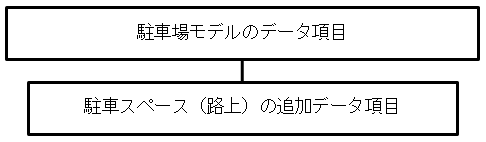

※緯度経度が必須情報になります

| 必須 | データ項目 | 説明 |
|:---|:---|:---|
| 必 | 許容時間 | 許容時間をhh:mmで記入する |

##### 4.7.7.3. 既存データモデル

###### 4.7.7.3.1. Smart data model

OnStreetParkingで車種や駐車可能時間などのデータ項目を定義しています。

#### 4.7.8. 駐車スポット（荷さばき場所）

荷さばきなど1台分の駐車スペースのデータモデルを示します。

##### 4.7.8.1. 参照元データ

| 名称 | 英語名称 | 参照元 |
|:---|:---|:---|
| 駐車スポット | ParkingSpot | Smart Data Model |

##### 4.7.8.2. データモデル

駐車場の基本モデルに、目的別追加データ項目として以下を付加して利用します。

※緯度経度が必須情報になります

| 必須 | データ項目 | 説明 |
|:---|:---|:---|
| 必 | 許容時間 | 許容時間をhh:mmで記入する |

##### 4.7.8.3. 既存データモデル

###### 4.7.8.3.1. Smart data model

ParkingSpotで車種や駐車可能時間などのデータ項目を定義しています。

#### 4.7.9. 駐輪場

自転車を置くための駐輪場のデータモデルです。

##### 4.7.9.1. 参照元データ

| 名称 | 英語名称 | 参照元 |
|:---|:---|:---|
| 駐輪場 | Bike station | Schema.org(Parking Facilityを参照) |

##### 4.7.9.2. データモデル

施設の基本モデルに、目的別追加データ項目として以下を付加して利用します。

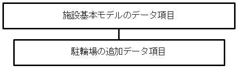

| 必須 | データ項目 | 説明 |
|:---|:---|:---|
| 必 | 屋内外 | 「屋外」、「屋内」を記入 |
| 必 | 最大駐輪台数 | 最大駐車台数を記入 |
| | 利用可能台数 | 現時点での利用可能駐車台数を記入 |
| | 一時間あたりの入庫車数 | 直近1時間の入庫台数 |

#### 4.7.10. シェアードカーステーション

シェアードカーステーションは、次項目のレンタル自転車のモデルを準用します。

#### 4.7.11. レンタル自転車・ｅスクータースポット

レンタル自転車やｅスクーターのレンタル、返却場所を示すデータモデルです。

##### 4.7.11.1. 参照元データ

| 名称 | 英語名称 | 参照元 |
|:---|:---|:---|
| レンタル自転車スポット | BikeHireDockingStation | Smart data model |

##### 4.7.11.2. データモデル

| データ項目 | smart-data-models | 説明 |
|:---|:---|:---|
| ID | id | ID |
| 名称 | name | 名称 |
| 別名 | alternateName | 別名がある場合 |
| 運営組織 | provider | レンタルバイク運営組織（ブランド） |
| 住所 | address | 住所情報（住所型の緯度経度を使用） |
| 説明 | description | 説明 |
| 開始時間 | openingHours | 開始時間を記入 |
| 終了時間 | openingHours | 終了時間を記入 |
| 利用可能エリア | areaServed | レンタルバイク等の利用可能エリア |
| 空きスロット数 | freeSlotNumber | レンタルバイク等を返却するための空きスロット数 |
| 利用可能バイク数 | availableBikeNumbe | レンタルバイク等の利用可能バイク数 |
| 故障スロット数 | outOfServiceSlotNumber | 故障スロット数 |
| 全スロット数 | totalSlotNumber | レンタルバイクステーションの全スロット数 |
| データ更新時間 | dateModified | 利用状況データのデータ更新時間 |
| 連絡先 | contactPoint | 連絡先 |
| 所有者 | owner | 所有者 |
| 状況 | status | ステーションの状況（閉鎖等） |
| 備考 | seeAlso | 備考 |

##### 4.7.11.3. 既存データモデル

###### 4.7.11.3.1. Smart data model

BikeHireDockingStationでサービス会社やサービスエリアのデータ項目を定義しています。

###### 4.7.11.3.2. GBFS（General Bikeshare Feed Specification）

バイクシェアなどのリアルタイムデータを配信する仕様として整備されたjsonファイルの集合です。[^39]
#### 4.7.12. ガソリンスタンド・水素ステーション

ガソリンスタンドのデータモデルである。

##### 4.7.12.1. 参照元データ

| 名称 | 英語名称 | 参照元 |
|:---|:---|:---|
| ガソリンスタンド、水素ステーション | Fuel station | Schema.org(gasStation） |
| EVスタンド | EVChargingStation | Smart data model |

##### 4.7.12.2. データモデル

Schema.orgのガソリンスタンドとSmart data modelのEVスタンドを参考に、以下にデータモデルを整理します。

| データ項目 | smart-data-models | 説明 |
|:---|:---|:---|
| ID | id | ID |
| ブランド | network | ガソリンや水素を提供するブランド名 |
| 事業所名 | name | 事業所の名称 |
| 別名 | alternateName | 事業所の愛称など別称があるときに記入 |
| 説明 | description | サービス内容などを記入 |
| 利用可能曜日 | availableDays | 利用可能な曜日を記入 |
| 開店時間 | openingHours | 開店時間を記入 |
| 閉店時間 | openingHours | 閉店時間を記入 |
| 住所 | address | 住所情報（住所型） |
| 対象車種 | allowedVehicleType | 普通車、大型バス、○トン未満のトラック |
| 利用可能車両数 | availableCapacity | 現在利用可能な車両数 |
| 最大車両数 | capacity | 同時に供給可能な車両数 |
| 燃料 | FuelType | 供給可能な燃料の種類を記入 |
| 支払方法 | acceptedPaymentMethod | 支払い方法を列挙 |
| 連絡先 | contactPoint | 連絡先情報を記入 |
| データ更新日 | dateModified | データを更新した日を記入 |
| 運営者 | operator | ブランドを運営する事業者を記入 |
| 所有者 | owner | 事業所の所有者を記入 |
| 状況 | status | 施設の状況を記入 |
| 備考 | seeAlso | 特記事項を記入する |

##### 4.7.12.3. 既存データモデル

###### 4.7.12.3.1. Schema.org

GasStation のデータモデルですが、事業所であるLocalBusinessの準用をしているので、燃料などに関する情報を加えて使用する必要があります。

###### 4.7.12.3.2. Smart data model

EVChargingStationで提供事業者や電圧などの充電情報のデータ項目を提供しています。

#### 4.7.13. EVスタンド

##### 4.7.13.1. 参照元データ

| 名称 | 英語名称 | 参照元 |
|:---|:---|:---|
| EVスタンド | EVChargingStation | Smart data model |

##### 4.7.13.2. データモデル

EVステーションのモデルの燃料項目を以下に示します。

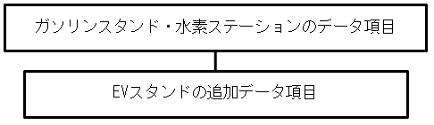

| データ項目 | smart-data-models | 説明 |
|:---|:---|:---|
| 充電タイプ | chargeType | 急速充電など、充電のタイプ |
| ソケット数 | socketNumber | 充電ソケットの数 |
| ソケットタイプ | socketType | 充電ソケットのタイプ |
| 電圧 | voltage | 充電時の電圧 |
| 最大アンペア数 | amperage | 充電の最大アンペア数 |

##### 4.7.13.3. 既存データモデル

###### 4.7.13.3.1. Smart data model

EVChargingStationで提供事業者や電圧などの充電情報のデータ項目を提供しています。

### 4.8. 　地物・地点

建物や設備などではなく、地点を示すときに参照します。３D都市モデル標準製品仕様書も参照できます。

#### 4.8.1. 参照元データ

| 名称 | 英語名称 | 参照元 |
|:---|:---|:---|
| 土地 | Land | GIFコアデータモデル |
| 土地利用 | LandUsage | ３D都市モデル標準製品仕様書[^40] |
| PoI | Point Of Interest | Smart data model[^41] |
| 場所 | Place | Schema.org[^42] |

#### 4.8.2. データモデル

その他の地物は以下の基本モデルを利用します。

| 必須 | データ項目 | 説明 |
|:---|:---|:---|
| | ID | 情報の管理主体である地方公共団体内でデータが一意に決まるよう、IDを設定し記載。 |
| 必 | 名称 | 地物の名称を記載。 |
| 必 | 名称_カナ | 地物の名称をカナで記載。 |
| | 名称_英字 | 地物の名称を英字で記載。 |
| | POIコード | 地物のPOIコードを記載。 |
| | 説明 | 地物の説明を記入 |
| 必 | 住所 | 地物の住所を記載。（住所型）住所がない地物は、住所型の緯度経度を記載。 |
| | 建物名等 | 地物の住所の建物名等を記載。 |
| | 連絡先 | 地物の連絡先を記載。 |
| | URL | 地物に関する情報源を示すサイト等を記載。 |
| | 備考 | 特記事項等があれば記載。 |

#### 4.8.3. データ項目に選択肢があるときの候補

* POIは、GIFコード（POIコード）を参照します。

#### 4.8.4. 既存データモデル

##### 4.8.4.1. Smart Data Model

Point of Interestのデータ項目を参照できます。

##### 4.8.4.2. Schema.org

Placeのデータ項目を参照できます。

#### 4.8.5. 観光ポイント

見晴台、石碑など地点を示したいときの情報を以下に示します。

##### 4.8.5.1. 参照元データ

| 名称 | 英語名称 | 参照元 |
|:---|:---|:---|
| 観光ポイント | Tourism point | |
| 観光目的地 | TouristDestination | Smart data model |
| 観光目的地 | TouristDestination | Schema.org |

##### 4.8.5.2. データモデル

地物・地点の基本モデルを利用します。

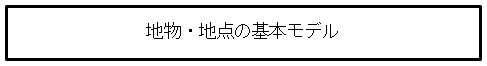

##### 4.8.5.3. データ項目に選択肢があるときの候補

* POIは、GIFコード（POIコード）を参照します。

##### 4.8.5.4. 既存データモデル

###### 4.8.5.4.1. 国土数値情報

 政策区域（行政地域）の以下のデータモデルが参照できます。

 * 景観地区・準景観地区
 * 景観重要建造物・樹木
 * 歴史的風土保存区域
 * 伝統的建造物群保存地区
 * 地域（施設）の集客施設
 * 道の駅
 * 地域（施設）の都道府県指定文化財
 * 世界文化遺産
 * 世界自然遺産
 * 観光資源

###### 4.8.5.4.2. Smart Data Model

TouristDestinationのデータ項目を参照できます。アトラクションのデータ項目が定義されています。

###### 4.8.5.4.3. Schema.org

TouristDestinationのデータ項目を参照できます。ツーリストタイプのデータ項目が定義されています。

#### 4.8.6. 指定緊急避難場所

災害時の緊急避難場所の情報を以下に示します。

##### 4.8.6.1. 参照元データ

| 名称 | 英語名称 | 参照元 |
|:---|:---|:---|
| 指定緊急避難場所 | Evacuation place | 推奨データセット |

##### 4.8.6.2. データモデル

施設の基本モデルに、目的別追加データ項目として以下を付加して利用します。

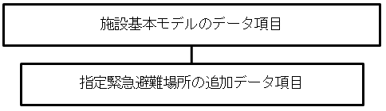

| 必須 | データ項目 | 説明 |
|:---|:---|:---|
| 必 | 災害種別_洪水 | 指定緊急避難場所が対応している災害(洪水)を記載。 |
| 必 | 災害種別_崖崩れ、土石流及び地滑り | 指定緊急避難場所が対応している災害(崖崩れ、土石流及び地滑り)を記載。 |
| 必 | 災害種別_高潮 | 指定緊急避難場所が対応している災害(高潮)を記載。 |
| 必 | 災害種別_地震 | 指定緊急避難場所が対応している災害(地震)を記載。 |
| 必 | 災害種別_津波 | 指定緊急避難場所が対応している災害(津波)を記載。 |
| 必 | 災害種別_大規模な火事 | 指定緊急避難場所が対応している災害(大規模な火事)を記載。 |
| 必 | 災害種別_内水氾濫 | 指定緊急避難場所が対応している災害(内水氾濫)を記載。 |
| 必 | 災害種別_火山現象 | 指定緊急避難場所が対応している災害(火山現象)を記載。 |
| 必 | 指定避難所との重複 | 指定避難所との重複している施設の際に記載。 |
| | 想定収容人数 | 指定緊急避難場所に収容可能な人数を記載。 |
| | 対象となる町会・自治会 | 指定緊急避難場所へ避難する対象の地域等を「;」（半角のセミコロン）区切りで記載。 |

※災害種別は該当する場合は「1」、該当しない場合は「0」を記入

上記の災害種別データは、以下のように構造化することも可能です。

| 必須 | データ項目 | 説明 |
|:---|:---|:---|
| 必 | 災害種別 | 災害種別名を記載 |
| 必 | 該当 | 該当する場合は「1」、該当しない場合は「0」を記載 |

#### 4.8.7. ゴミ集積場所

ゴミ集積場所の情報を以下に示します。

##### 4.8.7.1. 参照元データ

| 名称 | 英語名称 | 参照元 |
|:---|:---|:---|
| ゴミ集積場所 | Waste station | |

##### 4.8.7.2. データモデル

施設の基本モデルに、目的別追加データ項目として以下を付加して利用します。

| 必須 | データ項目 | 説明 |
|:---|:---|:---|
| 必 | ゴミ種類 | 廃棄可能なゴミの種類 |
| | ゴミ収集日 | ゴミの収集日 |

#### 4.8.8. その他地点

何らかの目的により位置を示したいときの情報は、地物・地点の基本形を使用します。

### 4.9. 　移動オブジェクト

都市を構成する要素として、人や自動車等の移動する対象物を考える必要があります。各対象物には詳細なデータモデルがありますが、ここでは都市内を移動する対象物という観点からデータモデルを整理します。

#### 4.9.1. 基本形

##### 4.9.1.1. 参照元データ

| 名称 | 英語名称 | 参照元 |
|:---|:---|:---|
| 物 | Product | Schema.org |

##### 4.9.1.2. データモデル

| 項目 | Schema.org | 説明 |
|:---|:---|:---|
| ID | Id | 一意に付番されたID |
| カテゴリ | category | 移動オブジェクトのカテゴリ |
| 高さ | height | 高さ |
| 長さ | depth | 長さ |
| 幅 | width | 幅 |
| 重量 | weight | 重量 |

##### 4.9.1.3. データ項目に選択肢があるときの候補

カテゴリには以下の項目を選択します。

* 人
* 物
* 自動車
* オートバイ
* 自転車
* 電動スクーター等
* 車椅子
* UAV
* 農耕車両
* 工事車両
* その他

#### 4.9.2. 人

人の特性のデータ項目のみ対象とし、個人情報は扱いません。

##### 4.9.2.1. 参照元データ

| 名称 | 英語名称 | 参照元 |
|:---|:---|:---|
| 人 | Person | Schema.org |

##### 4.9.2.2. データモデル

| 項目 | Schema.org | 説明 |
|:---|:---|:---|
| ID | identifier | 一意に付番されたID |
| 身長 | height | 身長を記入。 |
| 重量 | Weight | 重量を記入。 |
| 性別 | Gender | 性別をコードで記入。 |
| 年齢 | (age) | 年齢を記入。 |
| 機能支援の種別 | FunctionalSupportType | 視覚支援、聴覚支援、移動支援など |

※性別以下の項目は、移動速度、配慮事項などが異なること、パーソントリップ等の人流データ解析に使うことから追加しています。

##### 4.9.2.3. データ項目に選択肢があるときの候補

###### 4.9.2.3.1. 性別

国際標準ISO 5218に準拠する。

| コード | 性別 |
| --- | --- |
|0|不明|
|1|男性|
|2|女性|
|9|適用外|

###### 4.9.2.3.2. 移動、視覚、聴覚条件

アクセシビリティを求める条件を以下のコードで記入する。

| コード | 性別 |
| --- | --- |
|0|無|
|1|有|

##### 4.9.2.4. 既存データモデル

###### 4.9.2.4.1. 人の流れ（パーソントリップ）に関するデータモデル

「東京大学CSIS人の流れデータセット」[^43]や「交通流動量 パーソントリップＯＤ量データ」[^44]があります。

#### 4.9.3. 乗り物（自動車、オートバイ、自転車、船、飛行物、その他）

陸海空の移動体についてのデータモデルです。

##### 4.9.3.1. 参照元データ

| 名称 | 英語名称 | 参照元 |
|:---|:---|:---|
| 乗り物 | Vehicle | Schema.org |

##### 4.9.3.2. データモデル

| 項目 | Schema.org | 説明 |
|:---|:---|:---|
| ID | Identifier | 一意に付番されたID |
| 乗り物タイプ | bodyType | 乗り物やボディの形状を記入。 |
| 高さ | Height | 高さを記入。（m） |
| 長さ | Size | 長さを記入。（m） |
| 幅 | Width | 幅を記入。（m） |
| 重量 | weight | 重量を記入。（kg） |
| 燃料種別 | fuelType | 燃料の種類 |
| 定員 | seatingFacility | 定員数 |
| 積載量 | payload | 積載量（kg） |

##### 4.9.3.3. データ項目に選択肢があるときの候補

###### 4.9.3.3.1. 乗り物タイプ

乗り物タイプは以下から選択します。

* 乗用車
* トラック
* バス
* 農耕車両
* 工事車両
* オートバイ
* 自転車
* 車いす
* 動力付きスクーター
* UAV

###### 4.9.3.3.2. 燃料種別

燃料種別は以下から選択します。

* 電気
* ガソリン
* ディーゼル
* 自然エネルギー
* なし

#### 4.9.4. 物

無人搬送機、無人清掃ロボットなどのデータモデルは、移動オブジェクトの基本形を活用します。

### 4.10. 　自然

植生、天気など自然に関するデータモデルを示します。

#### 4.10.1. 植生

植生は、３D都市モデル標準製品仕様書のVegetation（CityGML）等を参照します。以下の定義が参照できます。

| 独立した樹木 | veg:SolitaryVegetationObject |
|:---|:---|
| 植被（芝生や茂みのように、植生に覆われた範囲） | veg:PlantCover |
| 生産緑地 | urf:ProductiveGreenZone |

また、 電子国土基本図地図情報ファイル仕様書の付属資料等のサブパッケージのデータモデルを参照できます。

国土数値情報の森林地域のデータモデルを参照できます。

#### 4.10.2. 湖沼

湖沼は、３D都市モデル標準製品仕様書のWaterBody（CityGML）のwtr:WaterBodyが参照できます。 電子国土基本図地図情報ファイル仕様書の水部等のサブパッケージのデータモデル、国土数値情報の国土（水・土地）の湖沼のデータモデルを参照できます。

#### 4.10.3. 河川

河川は、３D都市モデル標準製品仕様書のWaterBody（CityGML）のurf:Waterwayが参照できます。wtr:WaterBodyでも表すことができます。 電子国土基本図地図情報ファイル仕様書の水部等のサブパッケージのデータモデル、国土数値情報の国土（水・土地）の河川のデータモデルを参照できます。

#### 4.10.4. 自然の保護保全

自然の保護保全に関して、国土数値情報の地域（地域資源・観光）の世界自然遺産、地域（保護保全）の自然公園地域、自然保護地域、鳥獣保護区のデータモデルが参照できます。

#### 4.10.5. 天気

Smart data modelでWeatherが定義されています。以下の４種類のデータモデルが参照できます。

SeaConditions、WeatherAlert、WeatherForecast、WeatherObserved

気象庁は様々なデータを情報配信しています。各データモデルや技術資料は気象庁の「配信資料に関する技術情報」[^45]を参照してください。

国内用として定めた15種類を分類として推奨します。（国際的には96種類が決められています。）

##### 4.10.5.1. データ項目に選択肢があるときの候補

天気は、以下の項目から選択してください。

* 快晴
* 晴れ
* 薄曇り
* 曇り
* 煙霧
* 砂じん嵐
* 地ふぶき
* 霧
* 霧雨
* 雨
* みぞれ
* 雪
* あられ
* ひょう
* 雷

より詳細な天気の分類と記号[^46]は以下を参照してください。

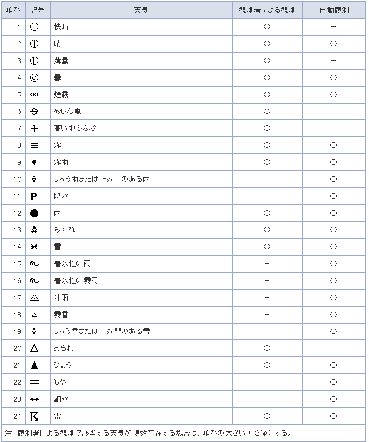

### 4.11. 　農地

農地は詳細なデータモデルもありますが、本書では、地域サービスの検討に有効なデータ項目のみ示します。

#### 4.11.1. 参照元データ

| 名称 | 英語名称 | 参照元 |
|:---|:---|:---|
| 農地 | Farm | eMAFF農地ナビ |
| 不動産登記 | | 不動産登記 |

#### 4.11.2. データモデル

| 必須 | 項目名 | 説明 |
|:---|:---|:---|
| | 所在 | 農地の所在・地番 |
| | 地目 | 農地の地目 |
| | 面積 | 農地の面積(m2) |
| | 遊休農地かどうか | 遊休農地かどうか |
| | ポリゴン | 農地の形状 |

#### 4.11.3. データ項目に選択肢があるときの候補

##### 4.11.3.1. 地目

eMAFF農地ナビの選択肢が参照できます。

* 田
* 畑
* 樹木地
* 採草放牧地
* 農業用施設用地
* その他

#### 4.11.4. 既存データモデル

##### 4.11.4.1. Smart data model

Smart data modelは農業や水産業のデータを定義しています。現在、農業はテスト版のデータモデルが提供されています。

* AgriApp
* AgriCrop
* AgriFarm
* AgriGreenhouse
* AgriParcel
* AgriParcelOperation
* AgriParcelRecord
* AgriPest
* AgriProductType
* AgriSoil
* Animal
* Compartment
* Pen

### 4.12. 　イベント・アクション

コンサートや催し物、展示会等のイベント情報のデータモデルを定義します。工事、災害時などの支援活動もイベントのデータモデルで表すことができます。

#### 4.12.1. イベント

コンサートなどのイベント、産業展などの展示会、セミナーや災害時の炊き出し等、時間と場所が決まった活動に関する周知情報のデータモデルです。

##### 4.12.1.1. 参照元データ

| 名称 | 英語名称 | 参照元 |
|:---|:---|:---|
| イベント | Event | 推奨データセット |
| イベント | Event | Smart data model |
| イベント | Event | Schema.org |

##### 4.12.1.2. データモデル

| 必須 | 項目名 | 説明 |
|:---|:---|:---|
| 必 | イベント名 | イベント名称を記載。 |
| | イベント名（カナ） | イベント名称をカナで記載。 |
| | イベント名（英字） | イベント名称を英語で記載。 |
| | 言語コード | イベント情報の記述言語コード（JA、EN、CNなど）を記載。 |
| | イベント通称 | イベント通称を記載。 |
| | サブタイトル | サブタイトルを記載。 |
| 必 | 概要 | 概要を記載。 |
| 必 | 説明 | 説明を記載。 |
| | サブイベント | サブイベントのIDを記載。 |
| 必 | イベント種類 | イベントの種類を記載。 |
| 必 | 詳細URL | イベントの詳細が掲載されているWebサイトのURLを記載。 |
| | コンテンツURL | イベントのコンテンツが掲載されているURLを記載。 |
| | 状態 | 状態を記載。 |
| | キーワード | 検索用キーワードを記載。（セミコロン区切りで列挙） |
| | タグ | 分類用のタグを記載（セミコロン区切りで列挙）。 |
| | 対象となる産業 | イベントの対象となる産業（標準産業分類から選択）を記載。 |
| | 開催パターン | 開催パターン（定期開催、通年開催など）を記載。 |
| | 開始日 | 開始日を記載。 |
| | 終了日 | 終了日を記載。 |
| | 開始時刻 | 開始時刻を記載。 |
| | 終了時刻 | 終了時刻を記載。 |
| | 日時備考 | 日時に関する備考（最終日は早く終わることなど）を記載。 |
| | 所要時間 | 所要時間を記載。 |
| 必 | ID | イベントに付与した一意のIDを記載。 |
| 必 | 掲載開始日 | イベント情報の掲載開始日を記載。 |
| 必 | 掲載終了日 | イベント情報の掲載終了日を記載。 |
| 必 | 場所名称 | 開催場所の名称を記載。 |
| 必 | 集合（受付）場所 | 集合または受付場所を記載。 |
| 必 | 開催場所住所 | 開催場所の住所を記載。コアデータモデル「住所」を参照。 |
| 必 | Web開催 | Web開催の有無を記載。 |
| | Web開催URL | Web開催のURLを記載。 |
| | ツール・環境 | Web開催時の使用ツールを記載（セミコロン区切りで列挙）。 |
| 必 | 主催団体 | 主催団体名を記載。 |
| | 共催団体 | 共催団体名を記載。 |
| | その他関係団体 | 協賛、協力などの開催に関連する団体名を記載。 |
| 必 | 対象者 | 対象者を記載。 |
| | 対象者備考 | 対象者に関する備考（カップル限定など）を記載。 |
| | 定員 | 定員を記載。 |
| | 定員備考 | 定員に関する備考（３グループまでなど）を記載。 |
| 必 | 料金種別 | 「有料」、「無料」の区分を記載。 |
| | 料金 | イベントに参加費用（単位：円）で記載。 |
| | 料金備考 | 料金に関する備考（１グループ1000円など）を記載。 |
| | 決済種別 | 決済種別（現金、クレジットカード、電子マネーなど）を記載（セミコロン区切りで列挙）。 |
| | 外国語対応 | 外国語の対応言語を記載（セミコロン区切りで列挙）。 |
| | 外国語対応備考 | 外国語対応に関する備考（英語は案内ありなど）を記載。 |
| | 開催条件 | 開催条件（雨天決行など）を記載。 |
| | 申込期限日 | 申込期限日を記載。 |
| | 申込期限時刻 | 申込期限時刻を記載。 |
| | 申込開始日 | 申込開始日を記載。 |
| | 申込開始時刻 | 申込開始時刻を記載。 |
| | 申込URL | Webで申し込む場合のURLを記載。 |
| 必 | 申込方法 | イベント会場へのアクセス方法を記載。 |
| | アクセス方法 | イベント会場へのアクセス方法を記載。 |
| | 駐車場情報 | イベント会場で指定されている駐車場情報を記載。 |
| | 駐車場料金 | 駐車場料金の「有料」、「無料」の区分を記載。 |
| | 駐輪場情報 | イベント会場で指定されている駐輪場情報を記載。 |
| 必 | 連絡先情報 | 連絡先情報を記載。コアデータモデル「連絡先」を参照。 |
| | アクセリビリティ情報 | アクセリビリティ情報を記載。コアデータモデル「アクセシビリティ」を参照。 |
| | 子育て支援情報 | 子育て支援情報を記載。コアデータモデル「子育て支援情報」を参照。 |

##### 4.12.1.3. データ項目に選択肢があるときの候補

###### 4.12.1.3.1. イベント種類

イベント種類は、各種広報紙で主に使われる以下を使用できます。

* 文化・芸術
* 音楽
* セミナー
* 子育て・教育
* 健康・福祉
* スポーツ
* 生活と環境
* 催事・観光
* 仕事・産業
* その他イベント
* 公共サービス
* 安全と防災
* 資格と認定
* 採用
* 申請
* その他公共サービス

災害時の災害対応イベントは、以下のイベント種類を使用できます。

* 炊出
* 給水
* 風呂
* 医療
* ガソリン
* 給電
* その他

###### 4.12.1.3.2. 体験種類

体験型イベントは、データ項目を追加し、以下の体験種類を使用できます。

* 学ぶ
* 触れる・感じる
* 遊ぶ・体を動かす
* 奏でる・歌う
* 乗る
* 見る
* 創る
* 採集・収穫する
* その他

##### 4.12.1.4. 既存データモデル

###### 4.12.1.4.1. Smart data model

Eventのデータを定義しています。出演者などの詳細情報のデータ項目が参照できます。

###### 4.12.1.4.2. Schema.org

Eventのデータを定義しています。出演者などの詳細情報のデータ項目が参照できます。派生形として以下のイベントのデータ項目が定義されています。

* BusinessEvent
* ChildrensEvent
* ComedyEvent
* CourseInstance
* DanceEvent
* DeliveryEvent
* EducationEvent
* EventSeries
* ExhibitionEvent
* Festival
* FoodEvent
* Hackathon
* LiteraryEvent
* MusicEvent
* PublicationEvent
* SaleEvent
* ScreeningEvent
* SocialEvent
* SportsEvent
* TheaterEvent
* VisualArtsEvent

#### 4.12.2. アクション

イベント（事象）により発生したアクションを記録、報告するデータモデルです。

イベント情報に対して行ったアクションを記録していきます。

##### 4.12.2.1. 参照元データ

| 名称 | 英語名称 | 参照元 |
|:---|:---|:---|
| アクション | Action | Schema.org |

##### 4.12.2.2. データモデル

イベントのモデルに、目的別追加データ項目として以下を付加して利用します。

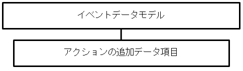

| 必須 | 項目名 | 説明 |
|:---|:---|:---|
| 必 | アクション名 | アクション名を記載。 |
| 必 | アクション種類 | アクションの種類を記載。 |
| 必 | 実施日 | アクションの実施日を記載 |
| 必 | 開始時間 | 開始時間を記載 |
| 必 | 終了時間 | 終了時間を記載 |
| 必 | 内容 | 実施内容を記載。 |
| 必 | 結果 | 実施した結果を記載 |
| 必 | 引き継ぎ事項 | 引き継ぎ事項を記載 |
| 必 | 対応者 | 対応者名を記載 |

時系列に複数のアクションが記録されることもあります。

### 4.13. 　緊急情報・防災情報

行政機関が当該地域に発信する情報として、気象警報等の緊急情報があります。Lアラートや防災等の検討を踏まえ、今後検討を進めていきます。

緊急情報のデータモデルを統一することで、配信アプリなどの開発も促進され円滑な情報提供ができます。

### 4.14. 　行政情報

スマートシティ等の推進の中で行政との情報の交換が生じたり行政情報の活用が図られたりする場合があります。そのためGIF実装データモデルで行政用のモデルを定義しています。

#### 4.14.1. 行政情報

手続きや行政機関が公表する情報等のデータモデルを示します。

##### 4.14.1.1. 参照元データ

| 名称 | 英語名称 | 参照元 |
|:---|:---|:---|
| 実装データモデル(行政) | GIF（Administration） | GIF実装データモデル(行政) |

##### 4.14.1.2. データモデル

行政用のデータモデルは、以下が参照できます。

* 申請・届出
* 証明・通知
* 事例
* 行政サービス
* イベント
* 報告書
* 行政サービス拠点・支援機関
* 調達

##### 4.14.1.3. 既存データモデル

###### 4.14.1.3.1. 統計

総務省統計局の提供するデータモデルとコードが参照できます。[^47]

#### 4.14.2. 地域・年齢別人口

地域分析などに使用することが多い、地域・年齢別情報のデータモデルを示します。

##### 4.14.2.1. 参照元データ

| 名称 | 英語名称 | 参照元 |
|:---|:---|:---|
| 人口統計 | | 統計 |

##### 4.14.2.2. データモデル

地域の年齢別のデータモデルを以下に示します。

| 必須 | データ項目 | 説明 |
|:---|:---|:---|
| | 都道府県コード又は市区町村コード | 情報の管理主体である地方公共団体の都道府県コード又は市区町村コードを記載。※記載方法について、「データ項目特記事項」シートの【共通ルール】を参照。 |
| | 地域コード | 地方公共団体にて管理する地域コードがある場合に記載。 |
| | 都道府県名 | 情報の管理主体である地方公共団体名について、都道府県名を記載。 |
| | 市区町村名 | 情報の管理主体である地方公共団体名について、市区町村名を記載。都道府県については記載不要。 |
| 必 | 調査年月日 | 調査した西暦を記載。※調査時点のデータは原則更新せず、新規調査時は別データセットを作成。 |
| 必 | 地域名 | 対象地域（注1）を記載。 |
| 必 | 総人口 | 対象地域に居住する住民の総数を記載。 |
| 必 | 男性 | 対象地域に居住する住民の男性総数を記載。 |
| 必 | 女性 | 対象地域に居住する住民の女性総数を記載。 |
| 必 | 0-4歳の男性 | 0-4歳の男性人口を記載。 |
| 必 | 0-4歳の女性 | 0-4歳の女性人口を記載。 |
| 必 | 5-9歳の男性 | 5-9歳の男性人口を記載。 |
| 必 | 5-9歳の女性 | 5-9歳の女性人口を記載。 |
| 必 | 10-14歳の男性 | 10-14歳の男性人口を記載。 |
| 必 | 10-14歳の女性 | 10-14歳の女性人口を記載。 |
| 必 | 15-19歳の男性 | 15-19歳の男性人口を記載。 |
| 必 | 15-19歳の女性 | 15-19歳の女性人口を記載。 |
| 必 | 20-24歳の男性 | 20-24歳の男性人口を記載。 |
| 必 | 20-24歳の女性 | 20-24歳の女性人口を記載。 |
| 必 | 25-29歳の男性 | 25-29歳の男性人口を記載。 |
| 必 | 25-29歳の女性 | 25-29歳の女性人口を記載。 |
| 必 | 30-34歳の男性 | 30-34歳の男性人口を記載。 |
| 必 | 30-34歳の女性 | 30-34歳の女性人口を記載。 |
| 必 | 35-39歳の男性 | 35-39歳の男性人口を記載。 |
| 必 | 35-39歳の女性 | 35-39歳の女性人口を記載。 |
| 必 | 40-44歳の男性 | 40-44歳の男性人口を記載。 |
| 必 | 40-44歳の女性 | 40-44歳の女性人口を記載。 |
| 必 | 45-49歳の男性 | 45-49歳の男性人口を記載。 |
| 必 | 45-49歳の女性 | 45-49歳の女性人口を記載。 |
| 必 | 50-54歳の男性 | 50-54歳の男性人口を記載。 |
| 必 | 50-54歳の女性 | 50-54歳の女性人口を記載。 |
| 必 | 55-59歳の男性 | 55-59歳の男性人口を記載。 |
| 必 | 55-59歳の女性 | 55-59歳の女性人口を記載。 |
| 必 | 60-64歳の男性 | 60-64歳の男性人口を記載。 |
| 必 | 60-64歳の女性 | 60-64歳の女性人口を記載。 |
| 必 | 65-69歳の男性 | 65-69歳の男性人口を記載。 |
| 必 | 65-69歳の女性 | 65-69歳の女性人口を記載。 |
| 必 | 70-74歳の男性 | 70-74歳の男性人口を記載。 |
| 必 | 70-74歳の女性 | 70-74歳の女性人口を記載。 |
| 必 | 75-79歳の男性 | 75-79歳の男性人口を記載。 |
| 必 | 75-79歳の女性 | 75-79歳の女性人口を記載。 |
| 必 | 80-84歳の男性 | 80-84歳の男性人口を記載。 |
| 必 | 80-84歳の女性 | 80-84歳の女性人口を記載。 |
| 必 | 85歳以上の男性 | 85歳以上の男性人口を記載。 |
| 必 | 85歳以上の女性 | 85歳以上の女性人口を記載。 |
| | 世帯数 | 世帯数を記載。 |
| | 備考 | 特記事項等があれば記載。 |

上記の年齢別データは、以下のように構造化することも可能です。

| 必須 | データ項目 | 説明 |
|:---|:---|:---|
| 必 | 年齢下限 | 年齢範囲の下限を記載 |
| 必 | 年齢上限 | 年齢範囲の上限を記載 |
| 必 | 性別 | 性別を記載 |
| 必 | 人数 | 人数を記載 |

### 4.15. 　センサーデータ

* 大気
* 騒音
* 温度
* 湿度
* 水位
* 水質
* 化学物質濃度
* 酸性度
* 照度
* 振動
* 加速度
* ひずみ
* 人流
* 交通量

等のセンサーデータのデータモデルがあります。

#### 4.15.1. 参照元データ

| 名称 | 英語名称 | 参照元 |
|:---|:---|:---|
| センサーデータ | Device | Smart data model |

#### 4.15.2. データモデル

センサーのデータは、Smart data modelのDeviceを参照して以下のように整理します。

| データ項目 | 説明 |
|:---|:---|
| 種類 | センサーの種類を記入する |
| 場所名称 | データ取得場所の名称を記入する（移動型センサーの場合はこの項目は使用しない） |
| 住所 | 取得場所の住所を記入する |
| 緯度 | 取得場所の緯度を記入する |
| 経度 | 取得場所の経度を記入する |
| 計測対象 | 計測対象物を記入する |
| 計測方法 | 計測方法を記入する |
| 日時 | 取得時の日次を記入する |
| 数値 | 取得数値を記入する |
| 単位 | 数値の単位を記入する |
| 精度 | データの精度を記入する |

#### 4.15.3. データ項目に選択肢があるときの候補

##### 4.15.3.1. 種類

センサーの種類は、以下から選択できます。

* 大気
* 騒音
* 温度
* 湿度
* 風速
* 風向
* 圧力
* 水位
* 水質
* 化学物質濃度
* 酸性度
* 照度
* 振動
* 加速度
* ひずみ
* 人流
* 交通量
* その他

#### 4.15.4. 既存データモデル

##### 4.15.4.1. Smart data model

Deviceは、センサーとアクチュエータを含んだデータモデルです。誤差や製造番号等の詳細データ項目が定義されています。

##### 4.15.4.2. OMA（Open Mobile Alliance）

地域に設置されるセンサーなどモバイルに関連したセンサーのデータモデルが定義されています。[^48]

##### 4.15.4.3. GSM Association

地域に設置されるセンサーなどモバイルに関連したセンサーのデータモデルが定義されています。[^49]

##### 4.15.4.4. W3C SSN(Semantic Sensor Network Ontology)

地域に設置されるセンサーなどモバイルに関連したセンサーやアクチュエータのデータモデルが定義されています[^50]

### 4.16. 　健康情報

#### 4.16.1. 健康情報

健康情報は、歩数、血圧、心拍数、血中酸素濃度、体重、体脂肪率、睡眠時間などが健康機器などから取得できます。HL7FHIR(Fast Healthcare Interoperability Resource)[^51]が参照できます。

#### 4.16.2. 給食情報

学校給食の献立情報を示すデータです。

##### 4.16.2.1. 参照元データ

| 名称 | 英語名称 | 参照元 |
|:---|:---|:---|
| 学校給食の献立情報 | Menu for school restaurant | 推奨データセット |

##### 4.16.2.2. データモデル

| 必須 | データ項目 | 説明 |
|:---|:---|:---|
| 必 | 学校ID | 学校を一意に特定するためのID。 |
| 必 | 学校所在地_都道府県名 | 学校所在地の都道府県名。 |
| | 学校所在地_郡名 | 学校所在地の郡名。（町村の場合のみ記載） |
| 必 | 学校所在地_市区町村名 | 学校所在地の市町村名。（東京都23区の場合は特別区名を記載） |
| | 学校所在地_行政区名 | 学校所在地の行政区名。（政令指定都市の場合のみ記載） |
| 必 | 学校所在地_全国地方公共団体コード | 学校所在地の全国地方公共団体コード（6桁）を記載。 |
| 必 | 学校名称 | 学校の正式名称を記載。 |
| | 学校名称_カナ | 学校の正式名称をカタカナで記載。 |
| 必 | 対象学年 | 給食が学年ごとに分かれている場合、献立の提供対象の学年の数字を記載。複数の学年の場合は ";"（半角セミコロン）区切りで記載。幼稚園、高校も可。 |
| 必 | レコードID | レコード（データの各行）を一意に識別するためのID。1つの表の中で重複が発生しないようにする。 |
| 必 | 提供年月日 | 献立の提供年月日。YYYY-MM-DD の形式で記載。 |
| | 献立ID | 献立（主食・主菜・副菜のセット）を一意に識別するためのID。同じ献立に含まれる料理には同一の献立IDを記載する。 |
| 必 | 料理ID | 日ごとのメニュー別の番号。 |
| 必 | 料理名称 | 「カレーライス」「トマトスープ」「牛乳」など。 |
| | 同一料理内通し番号 | 同一メニュー内の食品別番号。 |
| | 食品ID | 日本食品標準成分表の食品番号。 |
| | | 不明な場合は空欄でも良い。 |
| | 食品名称（成分表） | 日本食品標準成分表の食品名称。 |
| | | 不明な場合や食品番号がある場合は空欄でも良い。 |
| | 食品名称（独自） | 食品名称を独自で入れる場合（「トマト（〇〇産」「しょう油（小麦不使用）」など。 |
| | 食品群（６群） | １～６。３群のデータしかない場合は記載しない。 |
| | 食品群（３群） | 赤、緑、黄。６群での表記を基本とするが３群表記も可。 |
| | 分量 | その食品の分量。単位（ｇ） |
| | エネルギー | 日本食品標準成分表に準拠。単位（kcal） |
| | たんぱく質 | 日本食品標準成分表に準拠。単位（g） |
| | たんぱく質エネルギー比 | 日本食品標準成分表に準拠。単位（%E） |
| | 脂質 | 日本食品標準成分表に準拠。単位（g） |
| | 脂質エネルギー比 | 日本食品標準成分表に準拠。単位（%E） |
| | 食塩相当量 | 日本食品標準成分表に準拠。単位（g） |
| | カルシウム | 日本食品標準成分表に準拠。単位（mg） |
| | マグネシウム | 日本食品標準成分表に準拠。単位（mg） |
| | 鉄 | 日本食品標準成分表に準拠。単位（mg） |
| | ビタミンA＿ug | 日本食品標準成分表に準拠。本来「μg」だが「μ」が特殊文字のため「u」で表記。単位（ug） |
| | ビタミンA＿ugRAE | 学校給食実施基準に準拠。本来「μgRAE」だが「μ」が特殊文字のため「u」で表記。単位（ugRAE） |
| | ビタミンA_IU | 改定前の学校給食実施基準に準拠。単位（IU） |
| | ビタミンB１ | 日本食品標準成分表に準拠。単位（mg） |
| | ビタミンB２ | 日本食品標準成分表に準拠。単位（mg） |
| | ビタミンC | 日本食品標準成分表に準拠。単位（mg） |
| | 食物繊維 | 日本食品標準成分表に準拠。単位（g） |
| | 亜鉛 | 日本食品標準成分表に準拠。単位（mg） |
| | 炭水化物 | 日本食品標準成分表に準拠。単位（g） |
| | 糖質量 | 日本食品標準成分表に準拠。単位（g） |
| 必 | アレルゲン情報公開・非公開 | 公開なら「１」、非公開なら「０」とする。公開の場合のみアレルゲン品目も記載。 |
| | アレルゲン品目 | 「小麦;卵;乳…」と列記。同一セルに複数記載の場合の区切り文字は「；」（半角）を使用。 |
| | 調理方法（料理単位） | メニュー単位の調理方法を記載。 |
| | 調理方法（食材単位） | 食材単位の調理方法を記載。 |
| | 備考 | 特記事項等を記載。学校給食法によらない献立の場合は、こちらにその旨を記載する。 |

上記の「エネルギー」から「糖質量」までのデータ項目は、以下のように構造化することも可能です。

| 必須 | データ項目 | 説明 |
|:---|:---|:---|
| | 対象 | 対象エネルギーや栄養素名を記載 |
| | 値 | 値を記載 |
| | 単位 | 単位を記載 |

##### 4.16.2.3. データ項目に選択肢があるときの候補

日本食品標準成分表を参照できます。

### 4.17. 　文化財

オープンデータの推奨データセットは文化財のデータ整備を推奨していました。一方、文化庁は文化財を「有形文化財（建造物）」、「有形文化財（美術工芸品）」、「無形文化財」、「民俗文化財」、「記念物」、「文化的景観」、「伝統的建造物群保存地区」と7種類に分類しており、さらに、「選定保存技術」と「埋蔵文化財」がその他文化財等としています。

建物、施設、もの、地物、地域、無形が対象になっているため、建物、施設、もの（移動オブジェクト）、地物、地域のようなデータモデルがあるものと無形に分けてデータモデルを示します。

#### 4.17.1. 建物、施設、もの、地物、地域の文化財

##### 4.17.1.1. 参照元データ

| 名称 | 英語名称 | 参照元 |
|:---|:---|:---|
| 文化財 | Cultural heritages | 推奨データセット |
| 文化財 | Cultural heritages | 国指定文化財等データベース[^52] |

##### 4.17.1.2. データモデル

建物、施設、移動オブジェクト、地物の基本モデルに、目的別追加データ項目として以下を付加して利用します。

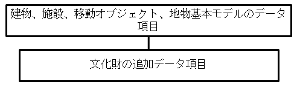

| 必須 | データ項目 | 説明 |
|:---|:---|:---|
| | NO | 情報の管理主体である団体内でデータが一意に決まるよう、NOを設定し記載。 |
| 必 | 文化財分類 | 文化財の分類を「;」（半角のセミコロン）区切りで記載。 |
| | 種類 | 文化財の種類を記載。 |
| | 場所名称 | 文化財が設置されている施設や建物などの名称を記載。 |
| | 連絡先 | 文化財の連絡先を記載。（連絡先型） |
| | 員数（数） | 当該文化財内の員数を数値部分のみ記載。 |
| | 員数（単位） | 当該文化財内の員数の単位を記載。 |
| | 法人番号 | 文化財の所有者・管理者・保護団体等の法人番号を記載。 |
| | 所有者等 | 文化財の所有者・管理者・保護団体等を記載。 |
| | 文化財指定日 | 文化財として指定された指定日を記載。 |
| | 画像 | 画像の格納先URLを記載。 |
| | 説明 | 文化財の説明を記載。 |
| | URL | 文化財のWebサイトのURLを記載。 |
| | 備考 | 特記事項があれば記載。 |

##### 4.17.1.3. データ項目に選択肢があるときの候補

###### 4.17.1.3.1. 分類

| 文化財分類 | 備考 |
|:---|:---|
| 重要文化財 | 有形文化財の場合に指定 |
| 国宝 | 有形文化財の場合に指定 |
| 登録有形文化財 | 有形文化財の場合に指定 |
| 重要無形文化財 | 無形文化財の場合に指定 |
| 記録作成等の措置を講ずべき無形文化財 | 無形文化財の場合に指定 |
| 重要有形民俗文化財 | 有形民俗文化財の場合に指定 |
| 登録有形民俗文化財 | 有形民俗文化財の場合に指定 |
| 重要無形民俗文化財 | 無形民俗文化財の場合に指定 |
| 記録作成等の措置を講ずべき無形の民俗文化財 | 無形民俗文化財の場合に指定 |
| 史跡 | 記念物の場合に指定 |
| 特別史跡 | 記念物の場合に指定 |
| 名勝 | 記念物の場合に指定 |
| 特別名勝 | 記念物の場合に指定 |
| 天然記念物 | 記念物の場合に指定 |
| 特別天然記念物 | 記念物の場合に指定 |
| 登録記念物 | 記念物の場合に指定 |
| 重要文化的景観 | 文化的景観の場合に指定 |
| 伝統的建造物群保存地区 | 伝統的建造物群の場合に指定 |
| 重要伝統的建造物群保存地区 | 伝統的建造物群の場合に指定 |

###### 4.17.1.3.2. 種類

| 種類 | 備考 |
|:---|:---|
| 建造物 | 有形文化財の場合に指定 |
| 美術工芸品 | 有形文化財の場合に指定 |
| 芸能 | 無形文化財の場合に指定 |
| 工芸技術 | 無形文化財の場合に指定 |
| その他 | 無形文化財の場合に指定 |

##### 4.17.1.4. 既存データモデル

###### 4.17.1.4.1. 国指定文化財等データベース

文化財に関する詳細なデータ項目が定義されています。

#### 4.17.2. 無形の文化財

演劇，音楽，工芸技術，その他の無形の文化的所産や、衣食住，生業，信仰，年中行事等に関する風俗慣習，民俗芸能，民俗技術及びこれらに用いられる衣服，器具，家屋，その他の物件などの無形の文化財に関するデータモデルです。

##### 4.17.2.1. 参照元データ

| 名称 | 英語名称 | 参照元 |
|:---|:---|:---|
| 文化財 | Cultural heritages | 推奨データセット |
| 文化財 | Cultural heritages | 国指定文化財等データベース[^53] |

##### 4.17.2.2. データモデル

| 必須 | データ項目 | 説明 |
|:---|:---|:---|
| | NO | 情報の管理主体である団体内でデータが一意に決まるよう、NOを設定し記載。 |
| | 都道府県名 | 情報の管理主体である地方公共団体名について、都道府県名を記載。 |
| | 市区町村名 | 情報の管理主体である地方公共団体名について、市区町村名を記載。都道府県については記載不要。 |
| 必 | 名称 | 文化財（注8）の正式名称を記載。 |
| 必 | 名称_カナ | 名称をカナで記載。※記載方法について、「データ項目特記事項」シートの【共通ルール】を参照。 |
| | 名称_通称 | 文化財の通称を記載。 |
| 必 | 文化財分類 | 文化財の分類を「;」（半角のセミコロン）区切りで記載。 |
| | 種類 | 文化財の種類を記載。 |
| | 場所名称 | 文化財が設置されている施設や建物などの名称を記載。 |
| | 住所 | 住所を記載。(住所型) |
| | 連絡先 | 文化財の連絡先を記載。（連絡先型） |
| | 法人番号 | 文化財の所有者・管理者・保護団体等の法人番号を記載。 |
| | 関係者等 | 文化財の管理者・保護団体等を記載。 |
| | 文化財指定日 | 文化財として指定された指定日を記載。 |
| | 画像 | 画像の格納先URLを記載。 |
| | 説明 | 文化財の説明を記載。 |
| | URL | 文化財のWebサイトのURLを記載。 |
| | 備考 | 特記事項があれば記載。 |

データ項目に選択肢があるときの候補 や既存のデータモデルは、有形の文化財と同じなので記述を省略します。

---
## 5. 　コード体系、ID体系

スマートシティを構成するデータ社会全体で、共通認識できる分類体系であるコードと各データを結びつけるユニークIDが必要です。本書ではスマートシティで共通的に使われる主なコードを提示します。また、「GIFコード一覧」に既存コードがある場合にはそれを参照することも可能です。

新規にコード設計する必要がある場合には「GIFコード（分類体系）設計実践ガイドブック」が参考になります。

### 5.1. 　地理空間に関するコード

#### 5.1.1. 地方公共団体コード

総務省自治行政局全国地方公共団体コード[^54]が使用できます。

#### 5.1.2. POIコード

GIFの「POIコード」[^55]を参照します。

### 5.2. 　時間、時期に関するコード

時間や時期に関する情報は、物流や施設等、スマートシティに関連するサービスで使われることが多いですが、運営者や主催者により様々な区分で管理されています。開始時間、終了時間で管理することも可能ですが、「GIFコアデータパーツ（日付時刻）」を活用してコード表記が使用できます。

桜の開花時期、大潮等の日時の定義が困難なデータは備考に記入します。

#### 5.2.1. 時間帯コード

「GIFコアデータパーツ（日付時刻）」を活用します。

時間帯コード

| コード | 時間帯 | コード | 時間帯 |
|:---|:---|:---|:---|
| 00 | 00:00/01:00 | 12 | 12:00/13:00 |
| 01 | 01:00/02:00 | 13 | 13:00/14:00 |
| 02 | 02:00/03:00 | 14 | 14:00/15:00 |
| 03 | 03:00/04:00 | 15 | 15:00/16:00 |
| 04 | 04:00/05:00 | 16 | 16:00/17:00 |
| 05 | 05:00/06:00 | 17 | 17:00/18:00 |
| 06 | 06:00/07:00 | 18 | 18:00/19:00 |
| 07 | 07:00/08:00 | 19 | 19:00/20:00 |
| 08 | 08:00/09:00 | 20 | 20:00/21:00 |
| 09 | 09:00/10:00 | 21 | 21:00/22:00 |
| 10 | 10:00/11:00 | 22 | 22:00/23:00 |
| 11 | 11:00/12:00 | 23 | 23:00/24:00 |
| | | 99 | 不明・未定 |

目標時間コード

| コード | 目標時間 | コード | 目標時間 |
|:---|:---|:---|:---|
| 00 | 00:00 | 12 | 12:00 |
| 01 | 01:00 | 13 | 13:00 |
| 02 | 02:00 | 14 | 14:00 |
| 03 | 03:00 | 15 | 15:00 |
| 04 | 04:00 | 16 | 16:00 |
| 05 | 05:00 | 17 | 17:00 |
| 06 | 06:00 | 18 | 18:00 |
| 07 | 07:00 | 19 | 19:00 |
| 08 | 08:00 | 20 | 20:00 |
| 09 | 09:00 | 21 | 21:00 |
| 10 | 10:00 | 22 | 22:00 |
| 11 | 11:00 | 23 | 23:00 |
| | | 99 | 不明・未定 |

#### 5.2.2. 季節、旬コード

「行政データ連携標準（日付時刻）」を活用することします。

季節コード

| コード | 季節 | コード | 季節 |
|:---|:---|:---|:---|
| 10 | 春 | 30 | 秋 |
| 11 | 初春 | 31 | 初秋 |
| 12 | 仲春 | 32 | 仲秋 |
| 13 | 晩春 | 33 | 晩秋 |
| 20 | 夏 | 40 | 冬 |
| 21 | 初春 | 41 | 初冬 |
| 22 | 仲夏 | 42 | 仲冬 |
| 23 | 晩夏 | 43 | 晩冬 |

旬コード

| コード | 旬 |
|:---|:---|
| 10 | 上旬 |
| 20 | 中旬 |
| 30 | 下旬 |
| 99 | 不明・未定 |

### 5.3. 　状態に関するコード

状態に関する情報はスマートシティに関連するサービスで使われることが多いですが、運営者や主催者により様々な区分で管理されており、標準といえるコードは確立していません。しかし、情報管理主体やデータセットの単位で統一された状態に関するコードを使用することは有益と考えられます。したがってここでは、代表的な列挙型コード（データ項目に選択肢があるときの候補）を選択肢候補として示します。

#### 5.3.1. 施設やイベントの状況

施設やイベントでは、開催状況に関する情報を必要とする場合があります。統一的なコードはありませんが、以下のような選択肢候補が考えられます。

* 準備中
* 受付中
* 開催中
* 中止
* 休止中
* 復旧中
* 延期

※「復旧中」は、故障、事故や災害時に使用されます。

#### 5.3.2. 混雑の状況

施設やイベント、交通機関では、混雑に関する情報を必要とする場合があります。統一的なコードはありませんが、以下のような選択肢候補が考えられます。

* 空あり
* 混雑
* 空なし

#### 5.3.3. 予約の状況

施設やイベント、交通機関では、予約に関する情報を必要とする場合があります。統一的なコードはないですが、以下のような選択肢候補が考えられます。

* 受付開始前
* 予約可
* 要問合せ
* 予約不可
* 当日可
* キャンセル待可
* 予約不要
* 予約期間終了
* 先着順

### 5.4. ユニークID（識別子）

情報と情報を関連付けるキー項目として、一意に降られたユニークIDを対象に振ることがあります。この場合も「GIF　コード（分類体系）設計実践ガイドブック」を参照し、二重付番などを避ける設計をする必要があります。

また、地方公共団体毎にユニークIDを発行し、地方公共団体コードと当該ユニークIDを組み合わせて一意性を保つ方法もあります。

#### 5.4.1. 行政機関が発行する主なユニークID

行政機関が各対象に一意な番号を付与しています。

| 種別 | ユニークID |
|---|---|
| 個人 | マイナンバー |
| 法人 | 法人番号 |
| 不動産 | 不動産番号 |
| 医療機関 | 医療機関番号 |
| 学校 | 学校コード |

#### 5.4.2. 行政機関に要望が多いユニークID

各組織で独自に付与している場合が多く、統一したユニークIDの付番や当該情報の公開に関する要望が寄せられており、付版の検討や普及が進められています

不動産ID、建物ID、事業所ID、オブジェクトID、資格番号

---
## 6. 　成果測定指標（KGI,KPI）

スマートシティの推進を確実にするために成果測定指標を使う場合があります。成果測定指標の導入にあたっては、現場にデータ取得の負担をかけないことが重要です。そのため、成果測定指標は、サービス設計時から計測可能なように組み込んでおく、もしくは統計などで既にデータ収集の仕組みがあるデータを使うことが望ましいです。サービス設計時に成果測定指標を組み込むことで、リアルタイム測定も可能になります。

客観的指標

| データ項目 | 説明 |
|:---|:---|
| ID | 成果測定指標のIDを記入する |
| 成果指標名 | データの種類を記入する |
| 対象地域 | データ取得場所の名称を記入する |
| 緯度 | センサー情報等、位置特定が必要な場合に記入する |
| 経度 | センサー情報等、位置特定が必要な場合に記入する |
| 開始日時 | データ取得時の日時を記入する |
| 終了日時 | データ取得時の日時を記入する |
| 公表日 | 調査票の時には集計公表日を記入する |
| 数値 | 取得数値を記入する |
| 単位 | 数値の単位を記入する |
| 精度 | データの制度を記入する |
| 計測方法 | データ計測方法を記入する |
| 測定数 | 平均等、複数データを根拠とする場合の測定サンプル数 |
| 測定者 | データ測定者名を記入する |
| 測定名等 | データの元となる調査名やシステム名があるときに記入する |
| 測定周期 | 年、月、週、日、リアルタイムから選択する |
| 備考 | 備考があれば記入する |

主観的な指標（満足度等）

| データ項目 | 説明 |
|:---|:---|
| ID | 成果測定指標のIDを記入する |
| 成果指標名 | データの種類を記入する |
| 対象地域 | データ取得場所の名称を記入する |
| 開始日時 | データ取得時の日時を記入する |
| 終了日時 | データ取得時の日時を記入する |
| 公表日 | 調査票の時には集計公表日を記入する |
| 回答 | 取得数値を記入する |
| 計測方法 | データ計測方法を記入する |
| 測定数 | 平均等、複数データを根拠とする場合の測定サンプル数 |
| 測定者 | データ測定者名を記入する |
| 測定名等 | データの元となる調査名やシステム名があるときに記入する |
| 測定周期 | 年、月、週、日、リアルタイムから選択する |
| 備考 | 備考があれば記入する |

※満足度の測定は、大変満足から大変不満までを5段階に評価する方法、他人に推薦したいかを測定するネット・プロモーター・スコア (NPS)等の方法があります。また、将来への不安を調査する場合もあります。

### 6.1. 　スマートシティ施策のKPI設定指針

令和4年4月に内閣府 科学技術・イノベーション推進事務局が公表した指針[^56]です。以下の分野にKPIを設定しています。

| 大分類 | 評価分野 | 施策のテーマ例 |
|:---|:---|:---|
| サービス | モビリティ | 交通／モビリティ、物流、交通拠点 |
| | 環境／エネルギー | 環境、エネルギー、水資源、廃棄物 |
| | 防災／防犯 | 防災、防犯 |
| | インフラ／施設 | インフラ維持管理、都市計画・整備、施設マネジメント、 住宅、建設、不動産 |
| | 健康／医療 | 健康、医療、介護 |
| | 産業／経済 | 農林水産業、観光、地域経済活性化、産業創出、産学連携、デジタル通貨・決済、働き方 |
| | 地域社会 | 地域コミュニティ形成、地域自治、社会活動 |
| | 教育／文化 | 教育、子育て、文化・アート |
| | 行政 | e-サービス、デジタル運営、セキュリティ |
| 基盤 | IT基盤 | 都市OS、データ連携基盤、デジタル通信網、オープン データ、3D都市モデル、データガバナンス、アクセシビリティ |
| | 運営体制 | 官民連携、住民参画、運営のオープン性・透明性、マネタイズ |
| | 人材 | スマートシティ人材育成・活用、リテラシー／デジタルデバイド対策 |

### 6.2. 　デジタル田園都市　wellbeing指標

地域版のスマートシティであるデジタル田園都市構想が推進されていますが、この構想の推進を円滑に行うためwell-being指標[^57]が設定されています。サービスへのアクセス数等のアウトプット指標ではなく、住民の生活を良くしたかどうかを測定するために活用することができます。

### 6.3. 　都市再生のための評価マニュアル　モニタリングマニュアル

都市再生に関する都市の取り組み評価のマニュアル[^58]です。統計等の集計データ、行政活動やセンサーなどから得られるモニタリングデータ、行政機関以外が保有するオルタネイティブデータの検討が行われています。

---
## 7. 　データカタログ等

### 7.1. 　データカタログ

多くのデータモデルが定義され、それに基づくデータが整備されると、多様なサービスが生まれる可能性が高まります。そのためには必要なデータを効率的に検索するための仕組みが必要となります。

データカタログサイトは、ハーベスティング機能があり広域のデータ収集にも対応可能なオープンソースのデータカタログサービスであるCKAN[^59]を推奨します。

### 7.2. 　データセットのメタデータ

データ検索や管理のためのメタデータは、国際的な検索性も考慮して、W3Cが整備したDCAT（Data CATalogue）[^60]に準拠したDCAT-GOJモデルを使います。DCAT-GOJは「GIFメタデータ導入実践ガイドライン」を参照して整備することができます。メタデータを標準化することで分野横断での検索を容易にすることができます。

DCAT-GOJは、分野や管理別のデータをまとめたカタログ情報と、具体的な中身を示すリソース情報の2階層になっています。リソースは、ファイルでデータを提供する場合のデータセット情報、APIでデータを提供するデータサービス情報、それらの具体的な配布内容であるディストリビューションにより構成されます。

<figure>

<figcaption> 図 4　DCAT-GOJの構造 </figcaption> </figure>

また、地理空間に特化したデータに関してはgeoDCAT、統計に関するデータはstatDCATを参照します。

#### 7.2.1. カタログ

| 分類 | データ項目 | 項目説明 |
|:---|:---|:---|
| 必 | 管理ID | カタログをユニークに識別するための管理IDを示す。 |
| 必 | タイトル | カタログのタイトルを示す。 |
| | サブタイトル | カタログのサブタイトルを示す。 |
| 必 | 説明 | カタログに収録されている情報の特徴を第三者に理解してもらうための説明を示す。また、関係性のあるカタログが存在する場合は、その名称も示す。 |
| | キーワード | カタログを容易に検索できるように、検索タグとして扱うキーワードを示す。 |
| | テーマ分類 | カタログが扱う情報のテーマ分類を示す。 |
| | 対象地域 | カタログの対象地域を示す。 |
| | 親カタログID | 上位のカタログがある時にそのカタログIDを示す。 |
| 必 | 提供者 | カタログを提供するエンティティ（組織又は個人）の名称を示す。※法人番号も検討 |
| | 公開日 | カタログの公開日を示す。入力形式は次のとおりとする。YYYY-MM-DD（西暦-月-日） |
| | 最終更新日 | カタログを最後に更新・修正した日付を示す。入力形式は次のとおり。YYYY-MM-DD（西暦-月-日） |
| | 更新頻度 | カタログが更新される頻度を示す。定期的に提供する場合、年・月・週・日あたりの回数を示す。不定期の場合は、不定期と示す。 |
| | 言語 | カタログがどの言語で記述されているかを示す。なお、国際標準化機構（ISO）が発行する「ISO 639-1:2002」又は「ISO 639-2:1998」に準拠したアルファベット２文字又は３文字で表記する。【例】日本語：ja、英語：en |
| | 公開範囲 | カタログの公開範囲を、以下のいずれかで示す。公開、制限付き公開、非公開 |
| | 公開条件 | カタログの公開範囲が「制限付き公開」の場合に、制限条件及び制限解除するための条件を示す。 |
| | ライセンス | カタログに適用されるライセンスについて示す。外部で定義されたライセンスへのリンク（URL）を示してもよい。 |
| | 利用規約 | カタログの利用規約を示す。外部で定義された利用規約へのリンク（URL）を示してもよい。 |
| | ホームページ | カタログに関連するホームページを示す。 |

#### 7.2.2. カタログレコード

| 分類 | データ項目 | 項目説明 |
|:---|:---|:---|
| 必 | トピックス | カタログのトピックスを示す。 |
| 必 | 説明 | カタログレコードにどのようなデータセットが収録されているか、説明を示す。 |
| | 公開日 | カタログレコードの公開した日付を示す。入力形式は次のとおりとする。YYYY-MM-DD（西暦-月-日） |
| | 最終更新日 | カタログレコードを最後に更新・修正した日付を示す。入力形式は次のとおりとする。YYYY-MM-DD（西暦-月-日） |
| | 言語 | カタログレコードがどの言語で記述されているかを示す。なお、国際標準化機構（ISO）が発行する「ISO 639-1:2002」又は「ISO 639-2:1998」に準拠したアルファベット２文字又は３文字で表記する。【例】日本語：ja、英語：en |

#### 7.2.3. データセット

| 分類 | データ項目 | 項目説明 |
|:---|:---|:---|
| 必 | 管理ID | データセットをユニークに識別するための管理IDを示す。 |
| 必 | タイトル | データセットのタイトルを示す。 |
| | サブタイトル | データセットのサブタイトルを示す。 |
| | バージョン | データセットのバージョン情報を示す。 |
| 必 | 説明 | データセットの特徴を第三者に理解してもらうための説明を示す。 |
| | キーワード | データセットを容易に検索できるように、検索タグとして扱うキーワードを示す。 |
| | 対象地域 | データセットの対象地域を示す。 |
| | 対象期間 | データセットの対象期間を示す。入力形式は以下のとおりとする。ただし、明確に年月日で示せない場合は、自由記述とする。・開始年月日/終了年月日 : YYYY-MM-DD/YYYY-MM-DD |
| | 分類 | データセットが扱うデータの分類を日本標準産業分類に基づき示す。 |
| | 提供者 | データセットを提供するエンティティ（組織又は個人）の名称を示す。　※法人番号も検討 |
| | 作成者 | データセットの作成に関わったエンティティ（組織又は個人）を示す。　※法人番号も検討 |
| | 連絡先情報 | データセットについて問い合わせを行う際の連絡先情報として以下の項目を示す。・組織名・部署名・電話番号・メールアドレス・フォームURL※法人番号も検討 |
| | タイプ | データセットの形式を示す。 |
| | 来歴情報 | データセットの出所や変更履歴等の来歴情報を示す |
| | 品質評価 | データセットの品質評価（評価方法は別途定義）を示す。 |
| | 品質測定結果 | データセットの品質測定結果（測定方法は別途定義）を示す。 |
| | 公開日 | データセットを公開した日付を示す。入力形式は次のとおりとする。YYYY-MM-DD（西暦-月-日） |
| | 最終更新日 | データセットを最後に更新・修正した日付を示す。入力形式は次のとおりとする。YYYY-MM-DD（西暦-月-日） |
| | 更新頻度 | データセットが更新される頻度を示す。定期的に提供する場合、年・月・週・日あたりの回数を示す。不定期の場合は、不定期と示す。 |
| | 言語 | データセットがどの言語で記述されているかを記載する。なお、国際標準化機構（ISO）が発行する「ISO 639-1:2002」又は「ISO 639-2:1998」に準拠したアルファベット２文字又は３文字で表記する。　【例】日本語：ja、英語：en |
| | 公開範囲 | データセットの公開範囲を、以下のいずれかで示す。公開、制限付き公開、非公開 |
| | 公開条件 | カタログの公開範囲が「制限付き公開」の場合に、制限条件及び制限解除するための条件を示す。 |
| | 準拠する標準 | データセットが準拠する標準を示す。 |
| | 関連ドキュメント | データセットに関する情報を持つドキュメントへのリンク（URL）を示す。 |
| | ランディングページ | データセットに関して、追加・補足できる情報が公開されているWebページのURLを示す。 |

#### 7.2.4. データサービス

| 分類 | データ項目 | 項目説明 |
|:---|:---|:---|
| 必 | 管理ID | データサービスをユニークに識別するための管理IDを示す。 |
| 必 | タイトル | データサービスのタイトルを示す。 |
| 必 | 説明 | データサービスの特徴を第三者に理解してもらうための説明を示す。 |
| | キーワード | データサービスを容易に検索できるように、検索タグとして扱うキーワードを示す。 |
| | 対象データセット | データサービスが配信対象とするデータセットを示す。 |
| | 提供者 | データサービスを提供するエンティティ（組織又は個人）の名称を示す。 |
| | タイプ | データサービスの形式を示す。 |
| | 公開範囲 | データセットの公開範囲を、以下のいずれかで示す。公開、制限付き公開、非公開 |
| | 公開条件 | カタログの公開範囲が「制限付き公開」の場合に、制限条件及び制限解除するための条件を示す。 |
| | ライセンス | データサービスを利用可能にするためのライセンスを示す。外部で定義されたライセンスへのリンク（URL）を示してもよい。 |
| | 準拠する標準 | データサービスが準拠する標準を示す。 |
| | 関連ドキュメント | データサービスに関する情報を持つドキュメントへのリンク（URL）を示す。 |
| | エンドポイントURL | データサービスのルートの位置又は主要エンドポイント(Webで解決可能なIRI(Internationalized Resource Identifier))を示す。 |
| | ランディングページ | データサービスに関して、追加・補足できる情報が公開されているWebページのURLを示す。 |

#### 7.2.5. ディストリビューション

| 分類 | データ項目 | 項目説明 |
|:---|:---|:---|
| 必 | タイトル | ディストリビューションのタイトルを示す。 |
| 必 | 説明 | ディストリビューションに関する説明を示す。 |
| | アクセスサービス | ディストリビューションにアクセスできるサービスを示す。 |
| | バイトサイズ | ディストリビューションのサイズをバイト単位で示す。 |
| | 圧縮形式 | ディストリビューションのデータサイズを縮小するために圧縮されている場合、圧縮形式を示す。 |
| | メディアタイプ | ディストリビューションのメディアタイプを示す。IANA(Internet Assigned Numbers Authority)管理語彙で定義されている配信データのメディアタイプから選択する。 |
| | 公開日 | ディストリビューションを公開した日付を示す。入力形式は次のとおりとする。YYYY-MM-DD（西暦-月-日） |
| 必 | 最終更新日 | ディストリビューションを最後に更新・修正した日付を示す。入力形式は次のとおりとする。YYYY-MM-DD（西暦-月-日） |
| | 期間 | ディストリビューションの配信期間を示す。入力形式は次のとおりとする。YYYY-MM-DD（西暦-月-日） |
| | ステータス | ディストリビューションのステータスを以下のいずれかで示す。配信中、配信準備中、配信停止中 |
| | 言語 | ディストリビューションデータがどの言語で記述されているかを記載する。なお、国際標準化機構（ISO）が発行する「ISO 639-1:2002」又は「ISO 639-2:1998」に準拠したアルファベット２文字又は３文字で表記する。【例】日本語：ja、英語：en |
| | ライセンス | ディストリビューションを利用可能にするためのライセンスを示す。外部で定義されたライセンスへのリンク（URL）を示してもよい。 |
| | 利用規約 | ディストリビューションの利用規約を示す。外部で定義された利用規約へのリンク（URL）を示してもよい。 |
| | | 外部で定義された利用規約へのリンク（URL）を示してもよい。 |
| | 準拠する標準 | ディストリビューションが準拠する標準を示す。 |
| | 関連ドキュメント | ディストリビューションに関する情報を持つドキュメントへのリンク（URL）を示す。 |
| 必 | アクセスURL | ディストリビューションを取得できるWebページのURLを示す。 |
| | ダウンロードURL | ディストリビューションがダウンロード可能なURL を示す。 |

### 7.3. 　データディクショナリ

データ項目名は表記に揺らぎが生じたり、データ項目名が同じでも意味の定義が異なったり、データ記録の基準日が違ったりすることがあります。このようなことを防ぎ、今後のデータ項目の乱立を防ぐためにデータディクショナリが整備される必要があります。

| 分類 | データ項目 | 項目説明 |
|:---|:---|:---|
| 必 | データ名 | データのラベルを示す。 |
| | データ項目名 | データ項目名（キャメルケースを推奨） |
| | データ名英語 | データの英語名ラベルを示す。 |
| 必 | データタイプ | データのタイプを示す。（住所型等） |
| 　 | データフォーマット | データの形式を示す。（999等） |
| 　 | フィールドサイズ | データの最大サイズをバイト単位で示す。 |
| 必 | 説明 | データの説明を示す。 |
| | 基準日 | データに基準日がある場合に基準日を示す。 |
| | 統制語彙 | データに選択肢がある場合に統制語彙示す。 |
| | 制約 | データ範囲などデータに制約がある場合に制約を示す。 |
| | 例 | データの例を示す。 |
| 必 | 出展 | 本データ項目定義の出典を示す。 |
| | 備考 | 備考を示す |

---
## 8. 　データの運用

### 8.1. 　データのエコシステムの構築

データを持続的に整備、更新をしていくことが重要です。データ整備が業務の中で自然に行えるように登録ツールを用意したり、申請などの登録時に申請データから自動的に必要データが収集できる仕組みを考えていく必要があります。また、データを収集や登録するときにAPIを使う等、人手を介さずにデータが集まる仕組みを考えていく必要があります。さらに、登録後のデータ更新による最新化が円滑に行われるように、定期的なリマインダーを行ったり、インセンティブを付与したりすることで、データの最新化を図っていく必要があります。

### 8.2. 　データの格納形態、送信形態

スマートシティで扱うデータの格納形態は、情報源により様々です。

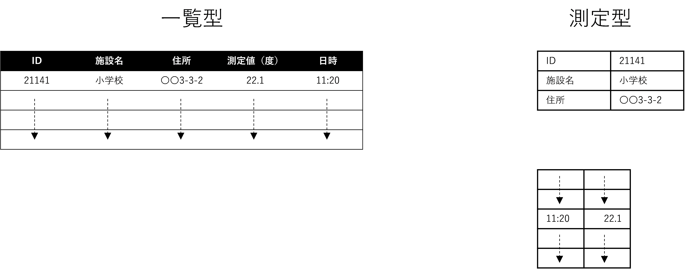

施設情報のように一覧でデータが格納されている場合と、センサーデータのように、データに関する情報と測定値が分離している場合があります。

また、記録された数値には単位や乗数があり、表外に記載される場合もあります。データを送る際には、新規データ毎に送信する場合と、一定時間などの区切り毎にファイル転送する場合があります。

これらのデータを、整合をとって扱うためにデータ連携基盤や都市OSを活用します。

### 8.3. 　データ品質

サービスを安定的に運用させるためにデータ品質が重要です。GIFデータ品質管理ガイドブックに従い、データの品質確保に努める必要があります。

以下に主要項目を列挙します。

| 品質項目| 説明 |
|---|---|
| 正確性 | データが正確であること |
| 完全性 | データに抜け漏れがないこと |
| 一貫性 | データ内の項目の値に一貫性があり矛盾が生じないこと |
| 信憑性 | データの出所が明確で、かいざんされていないこと |
| 最新性 | データが最新であること |

詳細な品質項目は、GIFデータ品質管理ガイドブックを参照してください。

---
## 9. 　Smart Data Model、３D都市モデル、schema.orgとのマッピング

### 9.1. 　土地

（太字データ項目は必須項目）
| 本データモデル | Smart Data Model | ３D都市モデル標準製品仕様書 | schema.org | 備考 |
|:---|:---|:---|:---|:---|
| 土地 | Point of Interest | LandUse(CityGML) | Place | 土地は物理的対象エリアを示し、Point of Interest、Placeは場所を示す概念である |
| ID | id | | identifier | |
| 用途 | category | tran:usage | | |
| 名称 | name | gml:name | name | |
| 名称（カナ） | name | gml:name | name | |
| 名称（英字） | name | gml:name | name | |
| 通称 | alternateName | | alternateName | |
| 説明 | description | gml:description | description | |
| 住所 | address,location | (gml:boundedby) | address,geo | 住所はアドレス情報と地理空間情報を含む、gml:boundedbyはオブジェクトの範囲と空間参照系を示し、土地と類似データ項目である |
| 敷地面積 | | | | |
| ポリゴン | | (gml:boundedby) | | |
| 備考 | seeAlso | | | |
| 連絡先情報 | contactPoint | | telephone | telephoneは連絡先の電話番号を示し、連絡先情報と類似データ項目である |
| 付記事項 | 必須項目に「type」NGSI Entity typeがある | | | |

### 9.2. 　建物

| 本データモデル | Smart Data Model | ３D都市モデル標準製品仕様書 | schema.org | 備考 |
|:---|:---|:---|:---|:---|
| 建物 | Building,BuildingOperation | Building（CityGML) | Place | |
| ID | id | uro:buildingIDAttribute | identifier | |
| 種別 | category | bldg:class | | |
| 名称 | name | gml:name | name | |
| 名称（カナ） | name | gml:name | name | |
| 名称（英字） | name | gml:name | name | |
| 通称 | altenateName | | alternateName | |
| 概要 | | | | |
| 説明 | description | gml:description | description | |
| 関連建物 | | bldg:consistsOfBuildingPart | containsPlace | consistsOfBuildingPartは複数の建物群を表し、関連建物と類似データ項目である |
| 状態 | status | | | |
| 建物住所 | address,location | bldg:address,(gml:boundedby) | address,geo | 住所はアドレス情報と地理空間情報を含む、gml:boundedbyはオブジェクトの範囲と空間参照系を示し、土地と類似データ項目である |
| 設備 | | | | |
| 敷地面積 | | | | |
| 主な機能 | | bldg:function | | |
| 主要用途 | | bldg:usage | | |
| 建築面積 | | | | |
| 延べ面積 | | | | |
| 最高の高さ | | bldg:measuredHeight | | |
| 地上階数 | floorsAboveGround | bldg:storeysAboveGround | | |
| 地下階数 | floorsBelowGround | bldg:storeysBelowGround | | |
| 構造 | | | | |
| 竣工日 | | bldg:yearOfConstruction | | |
| 備考 | seeAlso | | | |
| 連絡先情報 | Owner | | telephone,url | 連絡先情報と類似データ項目である |
| アクセリビリティ情報 | | | | |
| 付記事項 | 必須項目に「type」NGSI Entity typeがある | | | |

### 9.3. 　施設

| 本データモデル | Smart Data Model | ３D都市モデル標準製品仕様書 | schema.org | 備考 |
|:---|:---|:---|:---|:---|
| 施設 | Building,BuildingOperation | UrbanFacility | Place | |
| ID | id | | identifier | |
| 名称 | name | gml:name | name | |
| 名称（カナ） | name | gml:name | name | |
| 名称（英字） | name | gml:name | name | |
| 施設通称 | altenateName | | alternateName | |
| POIコード | category | (urf:usage) | | |
| 概要 | | | | |
| 説明 | description | gml:description | description | |
| 関連施設 | refBuilding | | | |
| 状態 | status | | | |
| 防災施設情報 | | | | |
| 施設住所 | address,location | (gml:boundedby) | address,geo | 住所はアドレス情報と地理空間情報を含む、gml:boundedbyはオブジェクトの範囲と空間参照系を示し、土地と類似データ項目である |
| 設備 | | | | |
| サービス曜日 | | | openingHourSpecification | |
| 開始時刻 | | | openingHourSpecification | |
| 終了時刻 | | | openingHourSpecification | |
| 日時備考 | | | openingHourSpecification | |
| 料金種別 | | | | |
| 料金 | | | | |
| 料金備考 | | | | |
| 決済種別 | | | | |
| 収容人数 | | | maximumAttendeeCapacity | |
| アクセス方法 | | | | |
| 駐車場情報 | | | | |
| 駐車場料金 | | | | |
| 都道府県コード | areaServed | | | |
| 市区町村コード | areaServed | | | |
| 町丁字 | areaServed | | | |
| ポリゴン | areaServed | | | |
| 備考 | seeAlso | | | |
| 連絡先情報 | occupier | | telephone,url | |
| アクセリビリティ情報 | | | | |
| 子育て支援情報 | | | | |
| 付記事項 | 必須項目に「startDate」「endDate」がある「type」NGSI Entity typeがある | | | |

### 9.4. 　設備

| 本データモデル | Smart Data Model | ３D都市モデル標準製品仕様書 | schema.org | 備考 |
|:---|:---|:---|:---|:---|
| 設備 | なし | CityFurniture,BuildingInsallation | Product | |
| ID | | | identifier | |
| 区分 | | bldg:class | | |
| 種類 | | bldg:function | | |
| 名称 | | gml:name | name | |
| 名称（カナ） | | gml:name | name | |
| 名称（英字） | | gml:name | name | |
| 説明 | | gml:description | description | |
| 状態 | | | itemCondition | |
| 設備住所 | | (gml:boundedby) | | 住所はアドレス情報と地理空間情報を含む、gml:boundedbyはオブジェクトの範囲と空間参照系を示し、土地と類似データ項目である |
| サービス曜日 | | | | |
| 開始時刻 | | | | |
| 終了時刻 | | | | |
| 日時備考 | | | | |
| URL | | | url | |
| 備考 | | | | |
| 連絡先情報 | | | | |
| 付記事項 | equipmentが定義されているが工場設備を対象にしている | 都市関連設備が中心である | 製品が対象であり、場所の定義がない | |

### 9.5. 　イベント

| 本データモデル | Smart Data Model | ３D都市モデル標準製品仕様書 | schema.org | 備考 |
|:---|:---|:---|:---|:---|
| イベント | Event | なし | Event | |
| イベント名 | name | | name | |
| イベント名（カナ） | name | | name | |
| イベント名（英字） | name | | name | |
| 言語コード | language | | inLanguage | |
| イベント通称 | alternateName | | alternateName | |
| サブタイトル | slogan | | | |
| 概要 | | | about | |
| 説明 | description | | description | |
| サブイベント | subEvent | | subEvent | Smart Data Model、schema.orgともに上位イベントのデータ項目も持つ |
| イベント種類 | subCategory | | | |
| 詳細URL | webSite | | mainEntityOfPage | |
| コンテンツURL | contentURL | | | |
| 状態 | eventStatus | | eventStatus | |
| キーワード | | | keywords | |
| タグ | category | | additionalType | |
| 対象となる産業 | thematic | | | |
| 開催パターン | | | | |
| 開始日 | startDate | | startDate | |
| 終了日 | endDate | | endDate | |
| 開始時刻 | openingHoursSpecification | | | Smart Data Model、schema.orgともに開場、閉場 のデータ項目も持つ |
| 終了時刻 | openingHoursSpecification | | | |
| 日時備考 | eventSchedule | | eventSchedule | |
| 所要時間 | duration | | | |
| ID | id | | identifier | |
| 掲載開始日 | | | | |
| 掲載終了日 | | | | |
| 場所名称 | | | | |
| 集合（受付）場所 | | | | |
| 開催場所住所 | address,location | | location | |
| Web開催 | | | | |
| Web開催URL | | | | |
| ツール・環境 | | | | |
| 主催団体 | owner | | organizer | |
| 共催団体 | | | | |
| その他関係団体 | | | contributor | |
| 対象者 | audience | | | |
| 対象者備考 | | | | |
| 定員 | maximumAttendeeCapacity | | maximumAttendeeCapacity | |
| 定員備考 | | | | |
| 料金種別 | | | | |
| 料金 | priceSpecification | | | |
| 料金備考 | | | | |
| 決済種別 | paymentAccepted | | | |
| 外国語対応 | | | | |
| 外国語対応備考 | | | | |
| 開催条件 | | | | |
| 申込期限日 | | | | |
| 申込期限時刻 | | | | |
| 申込開始日 | | | | |
| 申込開始時刻 | | | | |
| 申込URL | | | | |
| 申込方法 | | | | |
| アクセス方法 | accessPlan,transportServices | | | |
| 駐車場情報 | | | | |
| 駐車場料金 | | | | |
| 駐輪場情報 | | | | |
| 連絡先情報 | contactPoint | | | |
| アクセリビリティ情報 | wheelChairAccessible | | | |
| 子育て支援情報 | | | | |
| 付記事項 | 必須項目に「type」がある | | | |

[^1]: https://www8.cao.go.jp/cstp/stmain/20200318siparchitecture.html

[^2]: https://www.digital.go.jp/policies/data_strategy_government_interoperability_framework/

[^3]: https://www.ogc.org/standards/citygml

[^4]: https://www.chisou.go.jp/tiiki/toshisaisei/itoshisaisei/iur/index.html

[^5]: https://www.mlit.go.jp/plateau/libraries/

[^6]: https://smartdatamodels.org/

[^7]: https://schema.org/

[^8]: https://www.digital.go.jp/resources/data_dataset/

[^9]: https://www.digital.go.jp/policies/data_strategy_government_interoperability_framework/

[^10]: http://www.gsi.go.jp/common/000138865.pdf

[^11]: https://www.mlit.go.jp/common/001029742.pdf

[^12]: https://www.sangyo-rodo.metro.tokyo.lg.jp/tourism/signs/

[^13]: https://www.mlit.go.jp/common/001029742.pdf

[^14]: https://www.sangyo-rodo.metro.tokyo.lg.jp/tourism/signs/

[^15]: https://www.digital.go.jp/policies/data_strategy_government_interoperability_framework/

[^16]: 障害をもつ方などが、「他の者との平等を基礎として、都市及び農村の双方において、物理的環境、輸送機関、情報通信（情報通信機器及び情報通信システムを含む。）並びに公衆に開放され、又は提供される他の施設及びサービスを利用」できること(障害者権利条約日本語訳より。https://www.mofa.go.jp/mofaj/files/000018093.pdf)。

[^17]: https://www.mlit.go.jp/plateau/libraries/

[^18]: https://smartdatamodels.org/

[^19]: https://schema.org/

[^20]: https://www.mlit.go.jp/toshi/tosiko/kisotyousa001.html

[^21]: https://www.maff.go.jp/j/tokei/porigon/

[^22]: https://nlftp.mlit.go.jp/ksj/index.html#kokudo

[^23]: https://www.mlit.go.jp/river/shishin_guideline/bousai/saigai/tisiki/syozaiti/pdf/e-guideline_1910.pdf

[^24]: https://www.gsi.go.jp/kiban/

[^25]: https://www.mlit.go.jp/toshi/city_plan/toshi_city_plan_tk_000049.html

[^26]: https://elaws.e-gov.go.jp/document?lawid=325M50004000040_20200907_502M60000800074

[^27]: https://www.mlit.go.jp/toshi/tosiko/kisotyousa001.html

[^28]: https://nlftp.mlit.go.jp/ksj/gml/datalist/KsjTmplt-P02-v4_0.html

[^29]: https://www.mhlw.go.jp/wp/hakusyo/kousei/10-2/kousei-data/PDF/22010206.pdf

[^30]: https://www.mhlw.go.jp/bunya/iryouhoken/iryouhoken15/dl/other1-1-17.pdf

[^31]: https://nlftp.mlit.go.jp/ksj/gml/datalist/KsjTmplt-P04-v2_1.html

[^32]: https://www.mext.go.jp/b_menu/toukei/mext_01087.html

[^33]: https://www.soumu.go.jp/toukei_toukatsu/index/seido/sangyo/02toukatsu01_03000023.html

[^34]: https://ifas.mhlw.go.jp/faspub/IO_S010303.do?_errCheck=false&_searched=false&_sessionId=BA947AF4C66C968676784E434D9DBED9&method=a_menu_o01Action&param=&_focus=actionlink_a_menu_o01&_posx=0&_posy=0&_rowidx=0&_language=&_timezoneOffset=-540&_status=&_labelMapArchive=&_wfinfo=&_wfinfo_RefParams=&_ActionHistoryList%5B0%5D.action=%2FIO_S010303

[^35]: https://nlftp.mlit.go.jp/ksj/gml/datalist/KsjTmplt-P13.html

[^36]: http://www.cals-ed.go.jp/cri_point/

[^37]: https://www.jartic.or.jp/d/opendata/202102010000/typeA_kisei_11.pdf

[^38]: https://gtfs.org/

[^39]: https://github.com/NABSA/gbfs/blob/v2.2/gbfs.md

[^40]: https://www.mlit.go.jp/plateau/libraries/

[^41]: https://smartdatamodels.org/

[^42]: https://schema.org/

[^43]: https://pflow.csis.u-tokyo.ac.jp/wp-content/uploads/webapi.pdf

[^44]: https://nlftp.mlit.go.jp/ksj/jpgis/datalist/KsjTmplt-S05-b.html

[^45]: https://www.data.jma.go.jp/add/suishin/cgi-bin/jyouhou/jyouhou.cgi

[^46]: https://www.data.jma.go.jp/obd/stats/data/mdrr/man/tenki_kigou.html

[^47]: https://www.e-stat.go.jp/

[^48]: https://technical.openmobilealliance.org/index.html

[^49]: https://www.gsma.com/

[^50]: https://www.w3.org/TR/vocab-ssn/

[^51]: http://hl7.org/fhir/

[^52]: https://kunishitei.bunka.go.jp/bsys/index

[^53]: https://kunishitei.bunka.go.jp/bsys/index

[^54]: https://www.soumu.go.jp/denshijiti/code.html

[^55]: https://www.digital.go.jp/policies/data_strategy_government_interoperability_framework/

[^56]: https://www8.cao.go.jp/cstp/society5_0/smartcity/02_sc_kpi.pdf

[^57]: https://www.cas.go.jp/jp/seisaku/digital_denen/dai7/shiryou5-1.pdf

[^58]: https://www.chisou.go.jp/tiiki/toshisaisei/index.html#manual

[^59]: <https://ckan.org/>

[^60]: https://www.w3.org/TR/vocab-dcat-2/

[^61]: https://www.mext.go.jp/a_menu/other/data_00001.htm

[^62]: https://info.gbiz.go.jp/

[^63]: https://www.gtfs.jp/
