# 実装データモデル 地域サービス・データモデル・ガイドブック（付録） α版 <!-- omit in toc -->

-----
## 目次 <!-- omit in toc -->
- [1. 地理空間情報について](#1-地理空間情報について)
  - [1.1. ３Ｄ都市モデル標準製品仕様書](#11-３ｄ都市モデル標準製品仕様書)
  - [1.2. CityGML2.0](#12-citygml20)
    - [1.2.1. CityGML概要](#121-citygml概要)
    - [1.2.2. 空間と空間境界（Spaces and Space Boundaries）](#122-空間と空間境界spaces-and-space-boundaries)
    - [1.2.3. Level of Detail (LOD)](#123-level-of-detail-lod)
    - [1.2.4. 土木構造物: Construcction](#124-土木構造物-construcction)
      - [1.2.4.1. 概要](#1241-概要)
      - [1.2.4.2. データ構造](#1242-データ構造)
    - [1.2.5. 建物（内部）：Buidling & BuildingRoom](#125-建物内部buidling--buildingroom)
      - [1.2.5.1. 概要](#1251-概要)
      - [1.2.5.2. データ構造と建物内・地下街・地下埋設物の表現](#1252-データ構造と建物内地下街地下埋設物の表現)
    - [1.2.6. トンネル： Tunnel](#126-トンネル-tunnel)
      - [1.2.6.1. 概要](#1261-概要)
      - [1.2.6.2. データ構造と地下埋設物の表現](#1262-データ構造と地下埋設物の表現)
    - [1.2.7. 交通：Transportation](#127-交通transportation)
      - [1.2.7.1. 概要](#1271-概要)
      - [1.2.7.2. データ構造の概要](#1272-データ構造の概要)
  - [1.3. ｉ－都市再生技術仕様（案）](#13-ｉ都市再生技術仕様案)
  - [1.4. 電子国土基本図　地図情報ファイル仕様書1.5版](#14-電子国土基本図地図情報ファイル仕様書15版)
  - [1.5. DRM (Digital Road Map)（道路）](#15-drm-digital-road-map道路)
    - [1.5.1. 概要](#151-概要)
    - [1.5.2. データの特徴](#152-データの特徴)
  - [1.6. 国土数値情報](#16-国土数値情報)
    - [1.6.1. 国土（水・土地）](#161-国土水土地)
    - [1.6.2. 政策区域](#162-政策区域)
    - [1.6.3. 地域](#163-地域)
    - [1.6.4. 交通](#164-交通)
  - [1.7. GTFS (General Transit Feed Specification)](#17-gtfs-general-transit-feed-specification)
    - [1.7.1. GTFSの概要](#171-gtfsの概要)
    - [1.7.2. GTFSデータ形式の概要](#172-gtfsデータ形式の概要)
      - [1.7.2.1. 静的GTFSデータ](#1721-静的gtfsデータ)
      - [1.7.2.2. 動的GTFSデータ](#1722-動的gtfsデータ)
    - [1.7.3. データの整備事例](#173-データの整備事例)
      - [1.7.3.1. バス](#1731-バス)
      - [1.7.3.2. 鉄道](#1732-鉄道)
      - [1.7.3.3. フェリー・旅客船](#1733-フェリー旅客船)
- [2. 参照すべきスマートシティのデータモデル](#2-参照すべきスマートシティのデータモデル)
  - [2.1. 共通語彙基盤](#21-共通語彙基盤)
  - [2.2. 推奨データセット](#22-推奨データセット)
  - [2.3. Smart data models](#23-smart-data-models)
  - [2.4. OASC Shared Data Models for Smart City domains (SynchroniCity Data Models)](#24-oasc-shared-data-models-for-smart-city-domains-synchronicity-data-models)
  - [2.5. FIWARE](#25-fiware)
  - [2.6. Smart SDK（2019-1）](#26-smart-sdk2019-1)
  - [2.7. OMA(Open Mobile Alliance)](#27-omaopen-mobile-alliance)
    - [2.7.1. oma-label Objects Produced by OMA](#271-oma-labelobjects-produced-by-oma)
    - [2.7.2. ext-label Objects Produced by 3rd party Standards Development Organizations](#272-ext-labelobjects-produced-by-3rd-party-standards-development-organizations)
  - [2.8. GSM Association（2018-10-29）](#28-gsm-association2018-10-29)
  - [2.9. W3C SSN(Semantic Sensor Network Ontology](#29-w3c-ssnsemantic-sensor-network-ontology)
  - [2.10. Schema.org](#210-schemaorg)

-----
## 1. 地理空間情報について

地理空間情報とは、地理空間情報活用推進基本法（平成19年法律第63号）第2条第1項での定義に基づき、本書では(1)空間上の特定の地点又は区域の位置を示す情報（位置情報）と、(2) (1)に関連付けられた情報（属性情報）とし、地図を構成する要素として位置づけています。

(1)について、地理座標系として緯度・経度を有するものとし、各データは別のデータ項目で持った上で、10進表記で小数点以下6 桁とします。緯度・経度の測定基準である測地基準系は、JGD2011（日本測地系2011）またはITRF（国際地球基準座標系）とします。ITRFを用いる場合には、あわせて地殻変動の補正(https://positions.gsi.go.jp/cdcs/)が必要となります。なお、公共測量成果など、本書の示す標準以上に高精度でデータ連携が必要になる地理空間情報については、別途定められている定義に基づき、本書の対象とならないこととします。

データ連携にあたって測地基準系や座標参照系の変換を行う場合があることから、データ内のメタデータにおいて使用する測地基準系や座標参照系を明記する必要があります。
3Ｄ都市データに関するデータ形式は　3Ｄ都市モデル標準製品仕様書に従うこととし、点群データについてはLASとします。また両形式で定義できない地理空間情報はGeoJSONとします。

### 1.1. ３Ｄ都市モデル標準製品仕様書

国土交通省の３D都市モデルのためのデータモデルであり、地物や建築物などの詳細データモデルが示されています。Plateauに使用されています。

スキーマの関係性は以下のとおりです。

<figure>
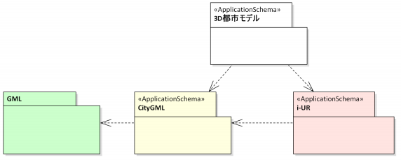
<figcaption>
</figcaption>
</figure>

各データには、クラス図やデータ定義が示されています。CityGMLが中核であることから、詳細は次章のCityGMLを参照してください。

### 1.2. CityGML2.0

#### 1.2.1. CityGML概要

3D都市モデルを利用する分野（都市計画、モバイル通信、災害対応、観光、車両・歩行者のナビゲーション、施設管理、環境シミュレーションなど）が拡大しており、採用する都市や企業も増えてきています。一方で、従来の3D都市モデルは可視化を主目的としたグラフィックや幾何モデルとして定義されており、個々のオブジェクトの意味やオブジェクト間の関係についてのデータが含まれていません。そのため、3D都市モデル内の検索・分析・シミュレーション等で利用することができず、データの再利用性が非常に限られていた。都市に関わる様々な応用分野のニーズを満たすために、より一般的なモデルを整備する必要がありました。

CityGMLモデルは、都市や地域モデルに関する地形オブジェクトに関するクラスとその関係を、幾何学的、位相的、意味的、外観的特徴から定義しています。「都市」は建物だけではなく、標高、植生、水域、都市構造物などを含めた広い意味での都市を表す。また、クラス間の階層、集約、オブジェクト間の関係と空間特性なども含まれます。

CityGMLは広域から小地域まで広く適用可能であり、地形と3Dオブジェクトを異なる詳細度（Level of Detail: LoD）で表現することが可能になっています。意味をほとんど持たない単純なモデルから、詳細な意味情報や位相関係を含む非常に複雑なモデルまで表現できるため、CityGMLは異なる地理情報システム（GIS）やユーザの間で3D都市モデルを一貫して表現することを可能にします。

CityGMLモデルは、地理参照された 3Dベクトルデータと、そのデータに付随するセマンティクスから構成される。
他の3Dベクターフォーマットとは異なり、CityGMLはジオメトリや外観情報に加え、様々なソースデータを統合して都市モデルを作成することが可能になります。
また、特定の領域でCityGMLを使用可能とするため、CityGMLではユーザがアプリケーションドメイン拡張（Application Domain Extension: ADE）として、相互運用性を維持したまま、識別可能な特徴や特性でデータを拡充する仕組みを持っており、CityGMLで定義されている構造物、道路、地形、橋梁、トンネル、土地利用、植生、水域以外についても定義を拡張可能になっています。
CityGMLの概念モデルでは、Coreモジュール（図 1緑）と11のテーマ別拡張モジュール（図 1赤）を定義しています。図 1青の５つの拡張モジュールは他の拡張モジュールと組み合わせて使用します。

<figure>
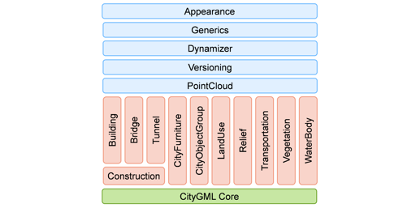
</figure>

図 1. CityGMLのデータモジュール[^1]

表 1. CityGMLのテーマ別拡張モジュールとモデリング拡張

| テーマ別拡張モジュール |  |
|----------------------|--|
| Construction | 土木建造物のモデル化 |
| Building | 建物、建物部品、建物設備、建物内部構造 |
| Bridge | 橋梁、橋梁部品、橋梁設備、橋梁内部構造 |
| Tunnel | トンネル、トンネルの部品、トンネル設備、トンネル内部構造 |
| CityFurniture | 街路灯、道路標識、電柱、ベンチ、バス停などの設備 |
| CityObjectGroup | オブジェクトのグループ |
| LandUse | 土地利用 |
| Relief | 地形。ラスタ、グリッド、TINなどで表現 |
| Transportation | 交通：道路、鉄道路線など |
| Vegetation | 植生：樹木・森林など |
| WaterBody | 水域：川、運河、湖など |

| モデリング拡張 |    |
|---------------|----|
| Appearance | オブジェクトの外観（色・テクスチャ） |
| Generics | 汎用的なオブジェクト、属性、関係の定義 |
| Dynamizer | オブジェクトの属性を時系列データで表現する。センサやセンサデータサービスなどの外部ファイルにリンクする |
| Versioning | オブジェクトの履歴、機能の履歴を表現 |
| PointCloud | オブジェクトの形状を3D点群表現 |

2021年9月にCityGML3.0が公表されていますが、本書ではにCityGML2.0を元に解説します。

#### 1.2.2. 空間と空間境界（Spaces and Space Boundaries）

CityGMLでは、すべてのオブジェクトを空間と空間境界という意味的な概念に対応させることで、空間特徴の明確な区別を導入しています。空間は実世界に存在する容積的な広がりを持つ実体であり、建物、水域、樹木、部屋、交通空間などが例にあげられます。

空間境界は現実世界における面的な広がりを持つ実体であり、空間境界は空間を区切り接続する。例として、建物を囲む壁面や屋根面、水域と空域の境界である水面、地面と交通空間の境界である道路面、地上と地下の空間境界であるデジタル地形モデルが挙げられます。

空間の定義を正確に表現するため、物理的空間と論理的空間に細分化します。

* 物理的空間
     * 完全にまたは部分的に物理的な物体で区切られた空間
          * 建物や部屋（壁やスラブで囲まれている）
          * 道路の交通空間（地面に対して路面が接している）
* 論理的空間
     * 必ずしも物理的なもので囲まれた空間ではなく、テーマに基づいて定義された空間
          * 用途によっては、仮想的な境界で区切られ、物理的な空間の集合体として表現されることもある。
          * 建物単位は、特定の部屋とフラットを集約した論理空間であり、部屋は壁面で囲まれた物理空間であるが、集約全体としては仮想境界で区切られている
          * 行政境界線に囲まれた街区
          * 空港のパブリックスペースとセキュリティゾーン
          * 都市計画による特定の規制を受けた街区

物理的な空間は、さらに占有空間と非占有空間に分類されます。

* 占有空間（OccupiedSpace）
     * 都市環境において空間を占める物理的な容積のオブジェクトを表す。占有空間とは、空間的な物体によって空間が遮断されていることを意味する
          * 建物、橋、樹木、都市家具、水域など※
* 非占有空間（UnoccupiedSpace）
     * 都市環境において空間を占有していない、物理的なオブジェクトを表す
          * ビルの部屋
          * 交通空間

<figure>
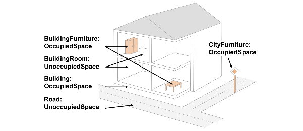
</figure>

図 2. 占有空間と非専有空間[^2]

#### 1.2.3. Level of Detail (LOD)

従来CG分野で描画の詳細度合を表すものとして使われていたLODに対して、CityGMLモデルでは、オブジェクト表現の詳細度合いを、地物のセマンティクスを考慮したものとしてLODを定義しています。LODの値が増加するにつれてより詳細になリます。CityGMLのデータセットでは、各オブジェクトについて異なるLODのジオメトリを同時に含めることも可能になっており、異なるアプリケーションや可視化に適した様々なレベルの空間的抽象化を持つことができます。

* LOD0 - 極めて一般化されたモデル（二次元の形状）
* LOD1 - ブロックモデル／押し出しオブジェクト（二次元の形状に高さを押出した三次元モデル）
* LOD2 - リアルではあるが一般化されたモデル（建物の屋根の形状などを追加）
* LOD3 - 詳細なモデル（建物の窓や扉などの外部の詳細な形状を追加）
* LOD4 - 極めて詳細なモデル（家具などを含めた建物の内部構造を追加）

CityGMLでは、オブジェクトの様々な幾何学的表現が可能なため、現実世界のオブジェクトを空間と空間境界に分類することは、これらのオブジェクトのセマンティクスにのみ基づいており、使用する幾何学的タイプには依存しません。例えば、建物は空間的には3Dのソリッド（例えばLOD1）で表現できますが、同時に実世界の形状を1点、足跡、屋根のプリント（LOD0）、または3Dメッシュ（LOD3）で抽象化することも可能です。また、建物の外壁は、壁面、屋根面、地表面に意味的に分解することもできます。

図には含まれていないが、LOD4では屋内のインテリアや家具なども含めた建物の内部構造が定義される。LOD4になると建築・設計等と同程度の情報を保有することになることから、BIM（Building Information Model）データとの相互変換対応なども検討されています。

2019年度に内閣府地方創生推進事務局にて策定された「i-都市再生技術仕様案（i-UR）」では、LODの概念をより広域で適用するため拡張LODとしてLOD-1, LOD-2が定義されおり、国土交通省のPLATEAUでも採用されています。[^3]

<figure>
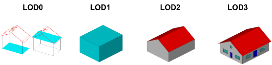
</figure>

図 3. 建物に関するLODレベルのイメージ [^4]

<figure>
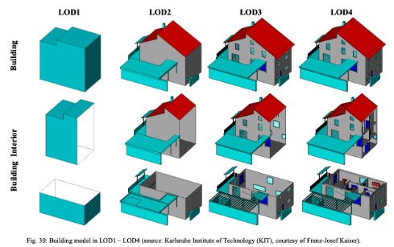
</figure>

図 4. 建物に関するLODレベルのイメージ[^5]

<figure>
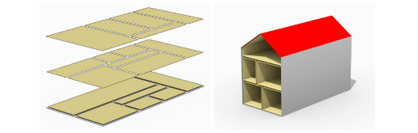
</figure>

図 5. LOD別の建物のフロア表現：（左）LOD0, （右）LOD2: 屋内外を連結した表現（内壁＋外壁）[^6]

<figure>
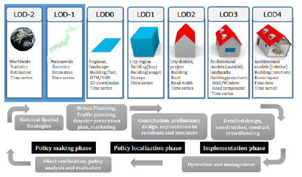
</figure>

図 6. Data Encoding Specification of i-Urban Revitalization -Urban Planning ADE – ver.1.5[^7]

#### 1.2.4. 土木構造物: Construcction

##### 1.2.4.1. 概要

Constructionモジュールは、あらゆる形態の構造物に共通する概念を定義しています。構造物は、建設材料から製造し、地上に接続され、永続的であることを意図したオブジェクトです。Constructionモジュールは、構造物の施工完了時の表現に焦点を当て、異なるタイプの構造物（特に建物、橋、トンネル）に共通するすべての概念を統合しています（建物・橋・トンネルはConstructionを継承して定義されています）。更に、建物・橋・トンネルのいずれでもない人工の構造物（例えば、大きな煙突や都市の壁など）についてもConstructionのサブクラスとして定義することができます。

##### 1.2.4.2. データ構造

Constructionでは家具、設備、構成要素の概念を定義しています。構造物や構成要素の外側の構造は、意味的に壁面、屋根面、地面、外側の床面、外側の天井面に区別でき、内部空間の目に見える表面は、内側の壁面、床面、天井面に構成が可能です。さらに、構造物の開口部、すなわち窓やドアは、それらに対応する充填面を含むいわゆる充填要素として表現することができる。CityGMLではADEクラスとして、壁・床・天井・窓・ドアなど内壁・外壁の別も含めて汎用的なパーツが予め定義されています。

<figure>
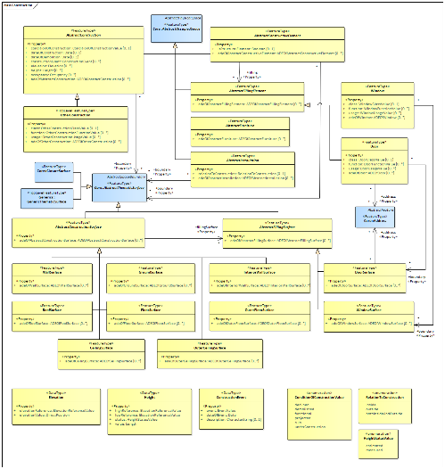
</figure>

図 7. UML Diagram of the Construction Model[^8]

#### 1.2.5. 建物（内部）：Buidling & BuildingRoom

##### 1.2.5.1. 概要

Buildingは、建物について空間的な側面を表現する。建物は屋根があり、通常は壁があり、人間が入ることができ、通常は一箇所に永久に立つように設計された、自立した建造物です。建物は人間が居住すること（例えば、仕事や娯楽の場）、人間、動物又は物の居住及び／又は避難のために意図されたものです。UML モデルでは、建物は最上位の機能タイプである Building（Constructionのサブクラス）で表現される。建物は、部屋（BuildingRoom）、階数（Storey）、建物単位（BuildingUnit）に細分化することができ、さらに、壁、スラブ、階段、梁などの構造要素に分解することができます。

<figure>
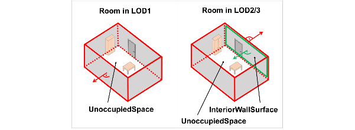
</figure>

図 8. BuildingRoomのLODによる表現の差異[^9]
##### 1.2.5.2. データ構造と建物内・地下街・地下埋設物の表現

建物内（部屋）を定義するBuildingRoomは前述のUnoccupiedSpaceのサブクラスとして定義され、空間境界となる壁・窓・天井・床で区切り、内部に設置物（BuildingFurniture）が配置されます。

Buildingは地下階数（storeyHeightsBelowGround）を記述する属性情報を持つため、建物内の地下の部屋も記述が可能です。よって、地下に配置した複数のBuildingRoomの集合を「地下街」として定義可能です。明示的に「地下街」を新たにADEとして拡張モジュール定義をすることも可能ですが、地上部分と同一の建物に含まれる場合と、地下空間のみで単一の構造物となる場合とで、定義上の差異があるかの検討が必要です。

地下埋設物は地下共同溝など人が内部で作業する可能性も想定されますが、Buildingよりも後述のTunnelに近い概念です。また、共同溝でない単純な地下埋設物の場合、Tunnelとも異なります。対象物にもよりますが、CityFurnitureとしてOccupiedSpaceとして定義するか、Constructionを用いて詳細を新たに定義する方法が考えられます。

<figure>
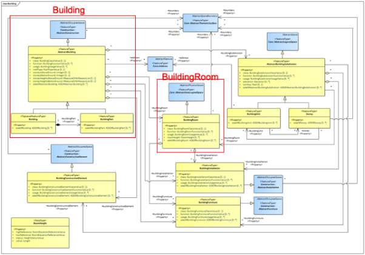
</figure>

図 9. Building モジュールのURLモデル[^10]
#### 1.2.6. トンネル： Tunnel

##### 1.2.6.1. 概要

トンネルは主に地下や水中にある水平または傾斜した密閉された通路を表します。トンネルは、山や水路などの障害物や、人間・動物・物などの交通路を通過するためのものです。トンネルはTunnelモジュールのメインクラスであるTunnelというトップレベルのフィーチャータイプで表現されます。トンネルは物理的、機能的にトンネル部品に細分化することができます。さらに、トンネルは、壁、スラブ、階段、梁などの構造要素に分解することができます。トンネルの内部は空洞(HollowSpace)で表現されます。これにより、トンネル内の走行、防災シミュレーション、トンネル内の照明演出など、トンネルを仮想的に利用することができます。

##### 1.2.6.2. データ構造と地下埋設物の表現

地下埋設物として人が内部で作業することが想定された地下共同溝を対象とする場合、トンネルが定義としては類似するものと考えられる。トンネルではUnoccupiedSpaceのサブクラスとして空洞（HollowSpace）が明示的に定義されており、Buildingに含まれるBuildingRoomとは意味的にも区別されています。一方で、物理的には空洞とすることが目的ではなく、ライフラインを通すことが目的であるため、トンネルとは別のデータを定義し記述することが現実的です。

一方で、人が内部で作業することを想定しない単純な地下埋設物としては、対象物にもよるが、CityFurnitureとしてOccupiedSpaceとして定義するか、Constructionを用いて詳細を新たに定義する方法が考えられる。

<figure>
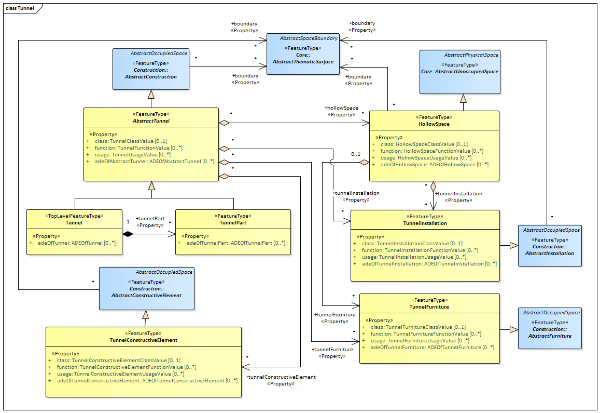
</figure>

図 10. Tunnel モジュールのURLモデル[^11]
#### 1.2.7. 交通：Transportation

##### 1.2.7.1. 概要

Transportation は、交通インフラの中心的な要素を定義しています。これには、車両、自転車、歩行者の移動のための交通オブジェクトである道路、軌道、広場、レール上の車輪付き車両の移動のための交通オブジェクトである鉄道、水域上または水域内の船舶の移動の交通オブジェクトである水路が含まれます。

##### 1.2.7.2. データ構造の概要

道路の場合、LOD0では道路は道路中心線とその接続関係による線形ネットワークによってモデル化され、最低限の経路探索や関連した分析が実行可能にないます。可視化に際しては道路幅員などを含まないため、道路網を抽象化されたラインの接続関係のみで示すことになります。LOD1から道路幅員等の形状を反映したポリゴンとして表現可能になる。LOD2-4では更に詳細にTrafficAreaに細分化され、自動車・鉄道・公共交通機関・飛行機・自転車・歩行者などの交通機関分担や、道路標識などの詳細なものまで配置可能になります。CityGML3.0では、TransportationSpaceはUnoccupiedSpaceのサブクラスとして新たに定義され、道路や鉄道などが通る交通空間が設定され、その配下で道路の区間・鉄道の区間がそれぞれ記述されます。

後述のDRM道路データは、LOD2以上のレベルの詳細なセマンティクスを保持しつつも、可視化表現用にはLOD0の道路ラインとその接続関係のみを持ち、道路形状を表すポリゴン情報を持たないものと見なすことができます。今後のCityGMLとのデータ連携を考慮すると、道路リンクや道路ノード（交差点）のIDの対応関係などを整理しておくことが必要になります。

<figure>
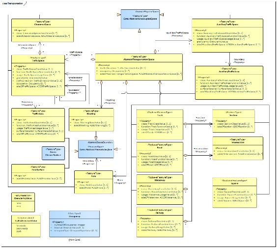
</figure>

図 11. TransportationモジュールのURLモデル[^12]

<figure>
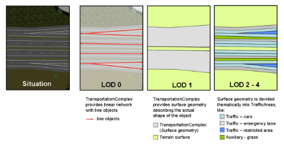
</figure>

図 12. TransportationComplex in LOD0-4(CityGML2.0)[^13]

<figure>
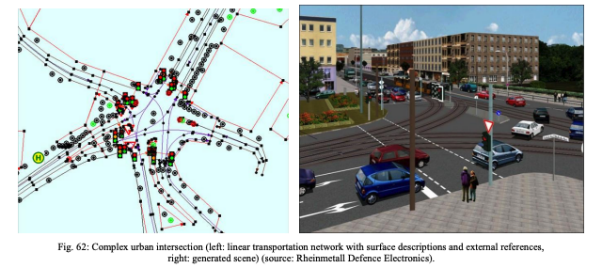
</figure>

図 13. Complex urban intersection in CityGML2.0[^14]

参考資料

1)  OGC, CityGML,
    <https://www.ogc.org/standards/citygml>
2)  OGC, City Geography Markup Language (CityGML) Part 1: Conceptual Model Standard,
    <https://docs.ogc.org/is/20-010/20-010.htm>
3)  OGC, Github: CityGML 3.0 Encodings,
    <https://github.com/opengeospatial/CityGML-3.0Encodings>
4)  国土交通省, 3D都市モデル標準製品仕様書, Series No1,
    <https://www.mlit.go.jp/plateau/file/libraries/doc/plateau_doc_0001_ver01.pdf>
5)  国土交通省, 3D都市モデル標準製品仕様書, Series No2,
    <https://www.mlit.go.jp/plateau/file/libraries/doc/plateau_doc_0002_ver01.pdf>
6)  東京都都市整備局, 都市の3Dデジタルマップのための データ製品仕様書（素案）の概要,
    <https://www.toshiseibi.metro.tokyo.lg.jp/bunyabetsu/machizukuri/pdf/digital04_3_3.pdf>
7)  東京都都市整備局, CityGMLデータ定義標準・技術文書,
    <https://www.toshiseibi.metro.tokyo.lg.jp/bunyabetsu/machizukuri/pdf/digital03_san01_1.pdf>
8)  国土交通省, PLATEAU,
    <https://www.mlit.go.jp/plateau/>

### 1.3. ｉ－都市再生技術仕様（案）

「社会の最適化を図る都市情報基盤」として、社会活動の高度化や日常生活における質の向上を実現させるため、都市情報と都市活動に関連する静的・動的な情報を連携させる技術使用として内閣府地方創生推進事務局がデータモデルを公表しています。[^15]

### 1.4. 電子国土基本図　地図情報ファイル仕様書1.5版

国土地理院の提供するデータモデルです。地物、境界線、交通施設、建物、構造物、水部、土地利用、地形等のデータモデル及び関連情報を電子国土基本図地図情報の仕様として定めています。[^16]

地物基本パッケージのほか、以下のサブパッケージがありクラス図とデータ定義で構成されています。

* 境界等 　　：行政区画、街区域　等
* 交通施設　：道路縁、軌道の中心線、交通施設記号、交通構造物　等
* 建物等　　：建築物、建物等記号　等
* 構造物　　：構造物面、構造物記号　等
* 水部等　　：水域、海岸線、水涯線、河川中心線、水部構造物線、　等
* 土地利用等：特定地区界、土地利用記号　等
* 地形等　　：等高線、標高点、等深線　等
* 付属資料等：発電所等、植生界、電波塔、鉄道中心線、送電線　等

※「注記」として情報記述用のサブパッケージも定義されています。

### 1.5. DRM (Digital Road Map)（道路）

#### 1.5.1. 概要

デジタル道地図（DRM）は1988年から整備されている日本全国の道路データであり、主にカーナビでの利用を中心に日本における一般的な道路データのひとつです。DRMは全国デジタル道地図データベース標準に基づいて1/25,000縮尺相当で整備され、道路の地理空形状だけでなく経路探索用に、交差点をノード、交差点の道路区間をリンクとしたグラフ構造のネットワークデータとして提供されます。また高速道路や一般道府県道などの基本道路網に加え、街など詳細な道路網を表す全道路が道路種別や幅員などの詳細な属性情報と合わせて含まれています。

#### 1.5.2. データの特徴

DRMデータに収録されている道路データには、経路探索可能な位相構造を含むネットワークデータとして基本道路と細道路があり、それに付随して道路の更新などを含む管理データがあります。背景データとして、道路周辺の施設や河川、鉄道路線なども含まれていますがここでは扱いません。

一般には、DRMデータは経路探索可能な道路ネットワークデータであり、交差点などの道路結節点をノード、ノード間を繋ぐ道路をリンクとした位相構造（接続関係）が整備されており、そこに交差点の位置情報や道路をラインとした幾何形状が含まれた形式となっています。道路の形状については、前述のCityGMLにおけるTransportationのLOD0に相当する単純なものですが、付属する属性情報には、道路種別（高速道路、国道など）、道路幅員、路線数、交通規制（制限速度や一方通行など）、道路管理者、開通予定など、が詳細に整理されています（テーブル参照）。代表的な用途として、道路交通センサスなどの道路関連の調査・計画、交通渋滞などの道路情報システム、交通事故分析（交通事故発生地点のデータ）などの交通安全、ナビゲーションサービスや運行・物流管理などの民間事業利用などで広く利活用されています。

<figure>
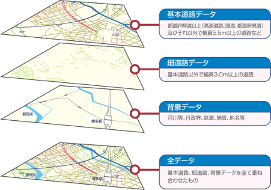
</figure>

図 14. DRMデータのイメージ[^17]

表 2. DRMデータの内容[^18]

| グループ種別 | データ種別 | 主なデータの内容 |
|-------------|-----------|-----------------|
| 管理データ | 管理データ | 2次メッシュ（＊1）コード、使用基図、地磁気偏角、区角辺の実距離、各データの更新年月日、データ別レコード数、データ別アイテム数 等 |
| 基本道路データ | 基本道路ノードデータ | ノード番号、位置座標、標高、ノード種別、接続リンク本数、接続ノード番号、交差点名称、フェリー接続航路数と行き先、IC・JCT施設番号 等 |
| 基本道路データ | 基本道路リンクデータ | リンク番号（起終点ノードの番号）、道路管理者、道路種別、路線番号、重用する路線情報、行政区域コード、リンク長、供用状況、異常気象時通行規制区間種別、幅員区分、車線数、車道幅員、道路センサスデータ（中央帯幅員、12時間交通量、旅行速度（ピーク時）、制限速度など交通規制）、補間点の位置座標・標高、緊急輸送道路区分、高速道路ナンバリング 等 |
| 基本道路データ | 基本道路リンク内属性データ | リンク内属性（橋・高架、トンネル、洞門、踏切、歩道橋、料金所、アンダーパス、道路冠水想定箇所等）の位置、名称　 等 |
| 基本道路データ | ビーコン位置データ | ビーコン・ITSスポットの種別、番号、位置、設置リンクの番号、地点名 等 |
| 細道路データ | 細道路ノードデータ | ノード番号、位置座標、標高、ノード種別、接続リンク本数、接続ノード番号 等 |
| 細道路データ | 細道路リンクデータ | リンク番号（起終点ノードの番号）、道路管理者、道路種別、行政区域コード、リンク長、幅員区分、車線数、対応する基本道路リンク番号、補間点の位置座標・標高　等 |
| 細道路データ | 細道路リンク内属性データ | リンク内属性（橋・高架、トンネル、洞門、踏切、歩道橋、料金所、アンダーパス、道路冠水想定箇所等）の位置、名称　 等 |
| 背景データ | 水系データ | 海岸線、湖沼、河川形状（ポリライン又はポリゴン） |
| 背景データ | 行政界位置データ | 都府県界、市区町村（政令指定都市区界を含む）界の形状（ポリライン） |
| 背景データ | 鉄道位置データ | 鉄道種別、路線の形状 |
| 背景データ | 施設等位置データ | 施設（都道府県庁、市役所、町村役場、サービスエリア、パーキングエリア、道の駅、フェリー発着所、鉄道駅、空港 等）の位置、行政区域コード、名称 等 |
| 背景データ | 施設等形状データ | 大規模鉄道駅、空港等の形状（ポリゴン） |
| 背景データ | 地名等表示位置データ | 名称（市町村、大字等の行政地名、島、岬、海岸等の自然地名、インターチェンジ等の道路施設名、港湾名、標識目標地名 等）、表示レベル参考コード、表示参考位置座標と角度、行政区域コード 等 |

その一方で、細道路であっても幅員3m以上に限られており、歩行者専用道等や私道などの細かな道路までは網羅されていません。そのため、地図制作会社等が独自により細かな細道路を調査・収録して販売しているものもあり、道路データとしては整備・収録される道路の粒度や網羅性にはばらつきがあります。また新規道路開通などで新たな交差点が追加されると、道路の位相構造も変化するため、既存の道路データへの参照情報を維持しながら新規データを追加する、経年変化にロバストなデータの整備も同時に必要となります。

そのため、異なる道路データ間での参照関係を確保する方法として道路の区間 IDによる参照方式が検討されています。この方式の概要としては、異なるデータ整備主体が共通に認識可能な「区間」（都道府県道上の交差点、県境で区切られる２点間）と「参照点」（都道府県道上の交差点、行政境、距離標等）を決定し、そこからの距離で位置を表現する（図参照）。異なる道路データが共通の区間・参照点との対応関係を含めることでデータ間の連携を可能としています。異なる位置表現を採用しているデータ間を連携する上で、共通の位置を示すID方式を採用することは、組織・分野を横断したデータ連携が迅速かつ正確に実現することに繋がります。道路の区間IDは、主要な道路から整備されていますが、まだ全国は網羅できていません。

DRMデータベース標準に基づいて、道路の区間ID方式（ISO17572: ITS-Location Referencing）についてもISO/TC204のWG3にてITSデータベース技術の標準化が推進されています。道路交通センサスをはじめとした公的調査にも利用される道路データですが、各種既存調査をスマートシティ等の検討に組み合わせる上で重要な参照データですが、前述のCityGMLとの連携は今後の課題です。

<figure>
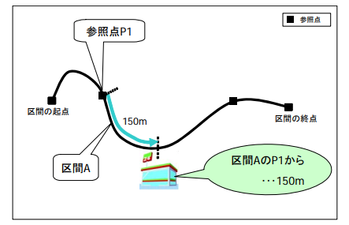
<figcaption>
図 15 道路の区間IDを活用した位置参照方式の考え方[^19]
</figcaption>
</figure>

参考資料
1)  DRMデータベース，
    <https://www.drm.jp/database/>

2)  次世代デジタル道路地図のあり方に関する研究（国土技術政策総合研究所）
    <http://www.nilim.go.jp/lab/bcg/siryou/tnn/tnn0372.htm>
    <http://www.nilim.go.jp/lab/bcg/siryou/tnn/tnn0372pdf/ks0372.pdf>

3)  国土交通省国土技術政策総合研究所、道路の区間IDを活用した位置参照方式の基本的考え方 Ver2.0,
    <https://www.drm.jp/assets/pdf/roadsection-fundamental-ver2.pdf>

4)  日本デジタル道路地図協会、道路の区間IDテーブル標準 ver 1.2，
    <https://www.drm.jp/assets/pdf/roadsection-standar-ver1.2.pdf>

5)  今井龍一、有賀清隆、佐々木洋一、重高浩一, 道路関連情報の流通のための位置参照方式 ～道路の区間ID方式の確立～、土木技術資料 54-2(2012)
    <http://www.nilim.go.jp/lab/qbg/ronbun/H23_dogishi01.pdf>

6)  日本デジタル道路地図道路協会、道路の区間IDテーブルの関連付け方法，
    <https://www.drm.jp/assets/pdf/Association-method-IDtable.pdf>

7)  ISO 17572-4:2020, Intelligent transport systems (ITS) — Location referencing for geographic databases,
    <https://www.iso.org/standard/72984.html>

### 1.6. 国土数値情報

「国土数値情報」は、国土形成計画、国土利用計画の策定等の国土政策の推進に資するために、地形、土地利用、公共施設などの国土に関する基礎的な情報を、データモデルをもとにＧＩＳデータとして整備したものです。クラス図とデータ定義、コード定義が参照できます。

#### 1.6.1. 国土（水・土地）

* 水域
     * 海岸線（ライン）
     * 海岸保全施設（ライン）（ポイント）
     * 湖沼（ポリゴン）
     * 流域メッシュ
     * ダム（ポイント）
     * 河川（ライン）（ポイント）

* 地形
     * 標高・傾斜度3次メッシュ
     * 標高・傾斜度4次メッシュ
     * 標高・傾斜度5次メッシュ
     * 低位地帯（ポリゴン）

* 土地利用
     * 土地利用3次メッシュ
     * 土地利用細分メッシュ
     * 土地利用細分メッシュ（ラスタ版）
     * 都市地域土地利用細分メッシュ
     * 土地利用詳細メッシュ
     * 森林地域（ポリゴン）
     * 国有林野（ポリゴン）
     * 農業地域（ポリゴン）
     * 都市地域（ポリゴン）
     * 用途地域（ポリゴン）
     * 立地適正化計画区域（ポリゴン）　

* 地価
     * 地価公示（ポイント）
     * 都道府県地価調査（ポイント）

#### 1.6.2. 政策区域

* 行政地域
     * 行政区域（ポリゴン）
     * DID人口集中地区（ポリゴン）
     * 中学校区（ポリゴン）（ポイント）
     * 小学校区（ポリゴン）（ポイント）
     * 医療圏（ポリゴン）　
     * 景観計画区域（ポリゴン）（ポイント）
     * 景観地区・準景観地区（ポリゴン）（ポイント）
     * 景観重要建造物・樹木（ポイント）
     * 歴史的風土保存区域（ポリゴン）
     * 伝統的建造物群保存地区（ポリゴン）
     * 歴史的風致維持向上計画の重点地区（ポリゴン）

* 大都市圏・条件不利地域
     * 三大都市圏計画区域（ポリゴン）
     * 過疎地域（ポリゴン）
     * 振興山村（ポリゴン）
     * 特定農山村地域（ポリゴン）
     * 離島振興対策実施地域（ポリゴン）
     * 離島振興対策実施地域統計情報（ポリゴン）
     * 小笠原諸島（ポリゴン）
     * 小笠原諸島統計情報（ポリゴン）
     * 奄美群島（ポリゴン）
     * 奄美群島統計情報（ポリゴン）
     * 半島振興対策実施地域（ポリゴン）
     * 半島振興対策実施地域統計情報（ポリゴン）
     * 半島循環道路（ポリゴン）（ライン）
     * 豪雪地帯（ポリゴン）
     * 豪雪地帯（気象データ）（ポリゴン）（ポイント）
     * 豪雪地帯統計情報（ポリゴン）
     * 特殊土壌地帯（ポリゴン）
     * 密集市街地（ポリゴン）

* 災害・防災
     * 避難施設（ポイント）
     * 平年値（気候）メッシュ
     * 竜巻等の突風（ポイント）
     * 土砂災害・雪崩メッシュ
     * 土砂災害危険箇所（ポリゴン）（ライン）（ポイント）
     * 土砂災害警戒区域（ポリゴン）（ライン）
     * 地すべり防止区域（ポリゴン）
     * 急傾斜地崩壊危険区域（ポリゴン）
     * 洪水浸水想定区域（ポリゴン）
     * 津波浸水想定（ポリゴン）
     * 高潮浸水想定区域（ポリゴン）
     * 災害危険区域（ポリゴン）（ポイント）

#### 1.6.3. 地域

* 施設
     * 国・都道府県の機関（ポイント）
     * 市町村役場等及び公的集会施設（ポイント）
     * 市区町村役場（ポイント）
     * 公共施設（ポイント）
     * 警察署（ポリゴン）（ポイント）
     * 消防署（ポリゴン）（ポイント）
     * 郵便局（ポイント）
     * 医療機関（ポイント）
     * 福祉施設（ポイント）
     * 文化施設（ポイント）
     * 学校（ポイント）
     * 都市公園（ポイント）
     * 上水道関連施設（ポリゴン）（ポイント）
     * 下水道関連施設（ポイント）
     * 廃棄物処理施設（ポイント）
     * 発電施設（ポイント）
     * 燃料給油所（ポイント）
     * ニュータウン（ポイント）
     * 工業用地（ポリゴン）
     * 研究機関（ポイント）
     * 地場産業関連施設（ポイント）
     * 物流拠点（ポイント）
     * 集客施設（ポイント）
     * 道の駅（ポイント）

* 地域資源・観光
     * 都道府県指定文化財（ポイント）
     * 世界文化遺産（ポリゴン）（ライン）（ポイント）
     * 世界自然遺産（ポリゴン）
     * 観光資源（ポリゴン）（ライン）（ポイント）
     * 宿泊容量メッシュ
     * 地域資源（ポイント）

* 保護保全
     * 自然公園地域（ポリゴン）
     * 自然保全地域（ポリゴン）
     * 鳥獣保護区（ポリゴン）

#### 1.6.4. 交通

* 交通
     * 高速道路時系列（ライン）（ポイント）
     * 緊急輸送道路（ライン）
     * 道路密度・道路延長メッシュ
     * バス停留所（ポイント）
     * バスルート（ライン）
     * 鉄道（ライン）
     * 鉄道時系列（ライン）（ポイント）
     * 駅別乗降客数（ライン）
     * 交通流動量 駅別乗降数（ポリゴン）（ポイント）
     * 空港（ポリゴン）（ポイント）
     * 空港時系列（ポリゴン）（ポイント）
     * 空港間流通量（ライン）
     * ヘリポート（ポイント）
     * 港湾（ライン）（ポイント）
     * 漁港（ライン）（ポイント）
     * 港湾間流通量・海上経路（ライン）
     * 定期旅客航路（ライン）（ポイント）

* パーソントリップ・交通変動量
     * 発生・集中量（ポリゴン）（ライン）
     * OD量（ポリゴン）（ライン）
     * 貨物旅客地域流動量（ポリゴン）（ライン）
     * 5\. 各種統計 arrow_drop_down

### 1.7. GTFS (General Transit Feed Specification)

#### 1.7.1. GTFSの概要

GTFS（General Transit Feed Specification）は公共交通機関（バス・鉄道等）の時刻表、運賃、運行ルートとその路線の幾何情報などを示したオープンフォーマットとして整備され、現在はGTFS.org（カナダの非営利団体MobilityDataが運営）で公開されています。公共交通機関の詳細な運行管理は想定しておらず、公共交通機関のサービス情報を乗客に伝えることを目的に整備されており、コンシューマ向けアプリでの利活用を目的に設計されています。また、公共交通機関を運用する小規模事業者でも扱いやすいようCSV表形式が採用されています。GTFSデータを整備・公開することで、GoogleMaps等の乗換案内サービスに登録可能となり、認知・利用の拡大が期待されています（Google乗換案内への登録は公共交通機関、またはその正式な代理人であることが必要）。

時刻表やルート情報を扱うCSV形式のGTFS（静的GTFS）に対して、リアルタイムな運行状況（例：バスロケなどの車両位置情報、遅延、運休等）を表すGTFS-Realtimeが別途整備されています。GTFS-RealtimeはAPIを介して提供されることを想定しており、データ形式にはProtocol Buffersが採用されています。

CityGMLと直接対応の取れるデータ形式ではありませんが、外部データとしてDynamizerから既存のデータモデルはそのままに、参照関係を整備する方式等が考えられます。

#### 1.7.2. GTFSデータ形式の概要

##### 1.7.2.1. 静的GTFSデータ

CSV形式で提供される静的GTFSファイルの種類は下記表の通りに定義されています。それぞれのファイルがCSV形式で記述され、相互のファイルの内容がIDで参照されます。なお、GTFS仕様として必須となっているのは1-6のみであり、公共交通機関について最低限の運行情報（時刻表・運行日程・経路）を利用者が確認できる。より詳細な乗換案内を提供する場合には、他のファイルを追加することになります。後述する国土交通省が策定した「標準的なバス情報フォーマット」においては、日本独自の拡張が含まれる他、日本のバスの運行形態に沿って、いくつかのファイルを必須としています。

静的GTFSを前述のCityGMLに直接当てはめることは難しいです。幾何形状の表現はShape.txtを追加することでLOD0といえますが、あくまでも路線の背景情報であり、ネットワーク分析等を実施するにあたりstops.txtに定義される停車地の位置とshapes.txtの間に直接の参照関係がないため、別途停車地間で区切るなどの下処理が必要となります。

表 3. 静的GTFSデータのファイル構成

| No  | File                | Note                                           |
|-----|---------------------|------------------------------------------------|
| 1   | agency.txt          | 必須。交通事業者の基本情報                     |
| 2   | stops.txt           | 必須。交通機関の停車地。例：バス停、鉄道駅など |
| 3   | routes.txt          | 必須。交通機関のルート情報                     |
| 4   | trips.txt           | 必須。交通機関の旅程情報                       |
| 5   | stop_times.txt      | 必須。交通機関の停車時刻                       |
| 6   | calendar.txt        | 必須。曜日別運行区分                           |
| 7   | calendar_dates.txt  | 日付別運行区分                                 |
| 8   | fare_attributes.txt | 運賃属性情報。通貨単位や支払方法               |
| 9   | fare_rules.txt      | 運賃定義情報。距離別運賃の場合の定義           |
| 10  | shapes.txt          | 運行ルートの幾何情報                           |
| 11  | frequencies.txt     | 運行間隔情報                                   |
| 12  | transfers.txt       | 乗換情報                                       |
| 13  | pathways.txt        | 鉄道駅構内の案内用のグラフデータ               |
| 14  | levels.txt          | pathways.txtとセットで駅構内の階層を表す       |
| 15  | translations.txt    | 翻訳情報                                       |
| 16  | feed_info.txt       | データ公開組織情報                             |
| 17  | attributions.txt    | データ帰属情報                                 |

<figure>
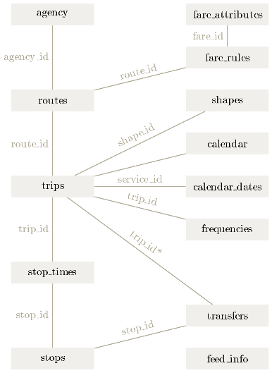
<figcaption>
図 16. 静的GTFS クラス図[^20]
</figcaption>
</figure>

##### 1.7.2.2. 動的GTFSデータ

前述の通り、動的GTFSデータ（GTFS-Realtime）では、APIを介したProtocol Buffers形式での提供が定義されています。現在データ仕様でサポートされているデータの種類は下記表の通りです。静的GTFSデータの旅程情報（trips.txt）との紐付けが必要な箇所もあり、動的GTFSデータ単体ではなく、静的GTFSデータと合わせての整備が必要となります。日本国内では、一般にバスロケと言われるバスのリアルタイム位置情報提供サービスが動的GTFSデータで実施されている例が、都バス（東京都交通局）など、いくつか出てきています。

表 4. 動的GTFSデータの種類

| No  | Type              | Note                                     |
|-----|-------------------|------------------------------------------|
| 1   | Trip Update       | 運行の遅延、キャンセル、経路の変更の通知 |
| 2   | Service Alerts    | 運行に影響する不測の事態の通知           |
| 3   | Vehicle positions | 運行中の車両の位置情報（＋混雑レベル）   |

#### 1.7.3. データの整備事例

公共交通機関のデータが整備・公開している国内の事例を中心に簡易にまとめる。公共交通オープンデータセンター[^21]や、東京公共交通オープンデータチャレンジで[^22]で公開されたデータは、必ずしもGTFSに準じたものに限りませんが、静的GTFSデータ、動的GTFSデータの事例がいくつか含まれるため、本節に整理します。[^23]

##### 1.7.3.1. バス

国土交通省総合政策局公共交通政策部がGTFSをベースに策定した「標準的なバス情報フォーマット（GTFS-JP）仕様書」（図 17）に基づいて、全国的にバスオープンデータの普及活動が広がっています。GTFS-JPでは、元の静的GTFS仕様に対し日本独自の拡張が含まれており、日本のバスの運行形態に沿って、いくつかのファイルが任意から必須または推奨になっています（表参照）。国内では動的GTFSデータの提供はまだ事例が少ないですが、バスロケシステムを導入している事業者が先行する状況が見られます（東京都交通局、横浜市交通局など）。

<figure>

<figcaption>
図 17. GTFS-JP の相関図[^24]
</figcaption>
</figure>

表 5. 標準的なバス情報フォーマット（GTFS-JP）のファイル構成（ + はファイルの拡張追加分）

| No | File | Note |
|---|---|---|
| 1 | agency.txt | 必須。交通機関の基本情報 |
| +1.1 | agency_jp.txt | 追加。交通事業者の追加情報。例：事業者登録情報等 |
| 2 | stops.txt | 必須。交通機関の停車地。例：バス停、鉄道駅など |
| 3 | routes.txt | 必須。交通機関のルート情報 |
| +3.1 | routes_jp.txt | 追加。交通機関ルート追加情報。例：起点・終点等 |
| 4 | trips.txt | 必須。交通機関の旅程情報 |
| +4.1 | office_jp.txt | 追加。営業所情報。例：営業所の連絡先等 |
| 5 | stop_times.txt | 必須。交通機関の停車時刻 |
| 6 | calendar.txt | 必須。曜日別運行区分 |
| 7 | calendar_dates.txt | 日付別運行区分 |
| 8 | fare_attributes.txt | 推奨：運賃属性情報。通貨単位や支払方法 |
| 9 | fare_rules.txt | 推奨：運賃定義情報。距離別運賃の場合の定義 |
| 10 | shapes.txt | 運行ルートの幾何情報 |
| 11 | frequencies.txt | 運行間隔情報 |
| 12 | transfers.txt | 乗換情報 |
| 13 | pathways.txt | なし |
| 14 | levels.txt | なし |
| 15 | translations.txt | 翻訳情報 |
| 16 | feed_info.txt | 必須。データ公開組織情報 |
| 17 | attributions.txt | データ帰属情報 |

##### 1.7.3.2. 鉄道

国内の鉄道事業者がGTFS形式で鉄道データを公開している事例は、静的・動的ともにほぼ見られません。東京公共交通オープンデータチャレンジでリアルタイムデータが一部API提供されていました（東京都交通局、横浜市交通局、東京メトロ等）が、動的GTFS形式ではなく独自の形式でした。国内鉄道については、時刻表データなどを取りまとめて販売する事業者があるため、公開にはそれらの調整が必要となります。他方で、日本の鉄道システムでは、複数事業者間の乗入・乗換・共同運行などの複雑な仕組みが、必ずしも静的GTFSの仕組みと整合の取れない部分があり、データ整備には留意が必要です。

##### 1.7.3.3. フェリー・旅客船

国土交通省海事局が、旅客船向けに静的GTFS仕様をベースに「標準的なフェリー・旅客船航路情報フォーマット」を策定しています。元となった静的GTFSデータに対して、ほとんどのファイルが必須となっていることに加え、船舶のペイロードや料金体系についての必須項目が追加されています。特に道路や鉄道のような背景情報として参照可能な他のデータがないため、海図上の航行ルートとしてshapes.txtが必須となっていることが特徴的です。

表 6. 標準的なフェリー・旅客船航路情報フォーマットのファイル構成（ + はファイルの拡張追加分）

| No | File | Note |
|---|---|---|
| 1 | agency.txt | 必須。運航事業者の基本情報 |
| 2 | stops.txt | 必須。港の情報 |
| 3 | routes.txt | 必須。航路の情報 |
| 4 | trips.txt | 必須。運航便の情報 |
| 5 | stop_times.txt | 必須。運航便の時刻情報 |
| 6 | calendar.txt | 必須。曜日別運行情報 |
| 7 | calendar_dates.txt | 条件付き必須。日付別運行情報 |
| 8 | fare_attributes.txt | 必須。乗船客の支払う運賃情報 |
| 9 | fare_rules.txt | 必須。船賃を特定するルール情報 |
| +9.1 | payload_fare_attributes.txt | 必須。車両や特殊手荷物を持ち込む際の追加運賃 |
| +9.2 | payload_fare_rules.txt | 必須。車両や特殊手荷物の持込追加運賃ルール |
| 10 | shapes.txt | 必須。海図上の航行ルート |
| 11 | frequencies.txt | 運行間隔情報 |
| 12 | transfers.txt | 乗換情報 |
| 13 | pathways.txt | 港施設の案内用のグラフデータ |
| 14 | levels.txt | pathways.txtとセットで港施設の階層を表す |
| 15 | translations.txt | 必須。翻訳情報 |
| 16 | feed_info.txt | 必須。データ公開組織情報 |
| 17 | attributions.txt | データ帰属情報 |
| +18 | payload.txt | 必須。乗船客以外の持込情報（車両・二輪車等） |
| +19 | ships.txt | 必須。船舶のスペック（例：船舶容量等） |

参考資料

1)  General Transit Feed Specification (GTFS), <https://developers.google.com/transit>
2)  GTFS.org, <https://gtfs.org/>
3)  MobilityData, <https://mobilitydata.org/>
4)  TransitFeeds, https://transitfeeds.com/feeds
5)  Google ヘルプ、Google 乗換案内にデータを登録する，
    <https://support.google.com/transitpartners/answer/1111481>
6)  国土交通省総合政策局公共交通政策部、静的バス情報フォーマット（GTFS-JP）仕様書（第２版）, <https://www.mlit.go.jp/common/001283244.pdf>
7)  東京都、都営バスのニュース【報道発表】, <https://www.kotsu.metro.tokyo.jp/pickup_information/news/bus/2020/bus_p_202008179276_h.html>
8)  公共交通オープンデータセンター、都バスGTFS-RT,
    <https://ckan.odpt.org/dataset/b_bus_gtfs_rt-toei>
9)  公共交通オープンデータセンター、<https://www.odpt.org/>
10) 国土交通省海事局内航課、標準的なフェリー・旅客船航路情報フォーマットVer.2，
   <https://www.mlit.go.jp/maritime/maritime_tk3_000061.html>

-----
## 2. 参照すべきスマートシティのデータモデル

スーパーシティ／スマートシティのデータモデルを考える場合、対象範囲が多岐にわたるため、すべてのデータモデルを定義することは困難です。また、様々な分野で技術の進展に合わせてデータモデルの定義も変化される状況を踏まえて、本データモデルにおいて個別にデータモデルの定義をするだけでなく、既存で確立されたデータモデルを参照して活用していくことが重要です。特にスーパーシティ／スマートシティの技術やノウハウをグローバルに展開、もしくは、世界最先端のソリューションに導入する上では、グローバルな活動にも適合可能なデータモデルとして設計する必要があります。

### 2.1. 共通語彙基盤

政府がデータの基盤として策定した汎用的なデータモデルです。[^25]

<figure>
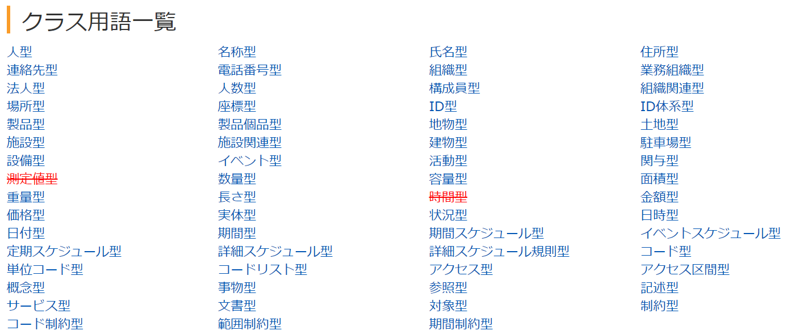
<figcaption>
</figcaption>
</figure>

<figure>

<figcaption>
</figcaption>
</figure>

### 2.2. 推奨データセット

政府がオープンデータの推進のために策定したデータモデル。[^26]

<figure>
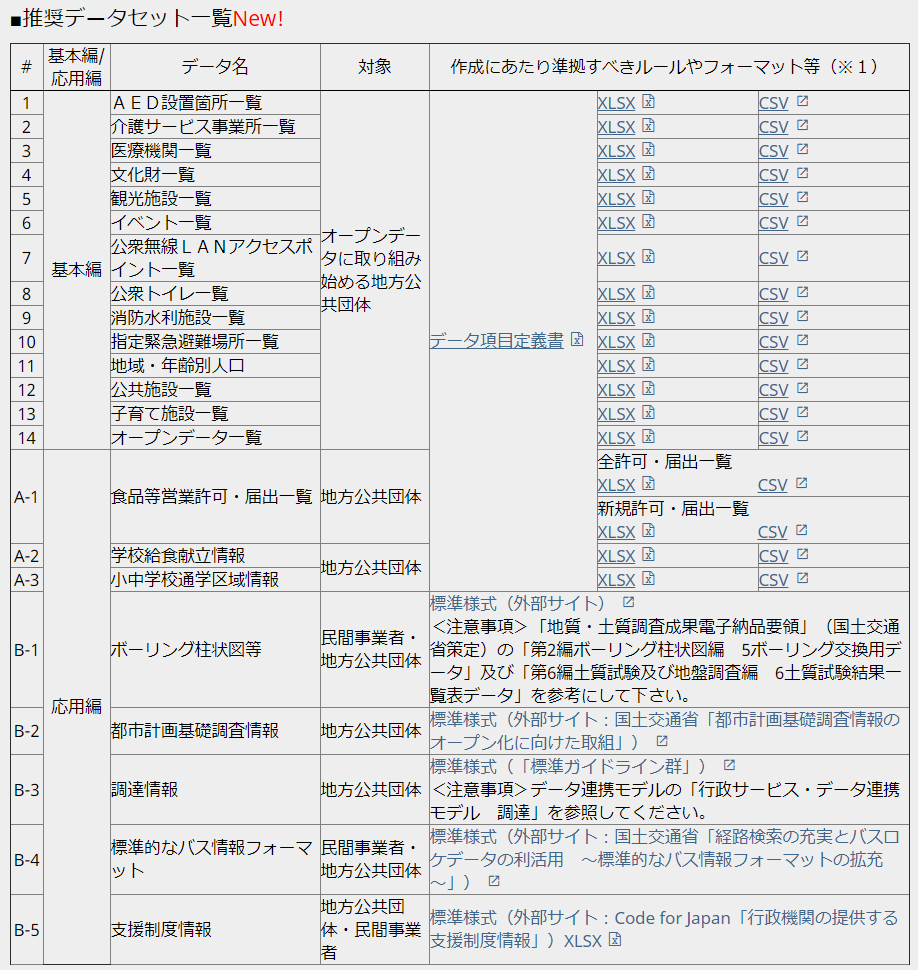
<figcaption>
</figcaption>
</figure>

### 2.3. Smart data models

FIWAREとTMforumとIUDX等が共同して推進しているイニシアチブであり、スマートシティをはじめ、スマート化に関する各種データのモデル定義をしています。[^27]

### 2.4. OASC Shared Data Models for Smart City domains (SynchroniCity Data Models)

Open Agile Smart Cities(https://oascities.org/)が推奨するデータモデル。SynchroniCityプロジェクトのデータを拡張しています。FIWAREのデータなども参照して、SmartCityに必要なデータを整備しています。

### 2.5. FIWARE

欧州を中心にSmartcityのプラットフォームとして使われるFIWAREが採用するデータモデルです。[^28]

外部を参照しているデータモデルもあり、不足する部分はschema.orgを参照することにしています。

<figure>

<figcaption>
</figcaption>
</figure>

### 2.6. Smart SDK（2019-1）

Reference data models for data intensive and IoT based Smart City, Smart Health and Smart Security V2

EUのsmartSDKプロジェクトのデータモデルです。[^29]

* smartSDKが定義するdata models
     * Alert
     * Questionnaire
     * Questionnaire/Question
     * Questionnaire/Answer
     * Transport Schedule
     * Agency
     * Route
     * Stop
     * Trip
     * AffectTransitService
     * TransitServiceAlert
     * VideoObject
     * VisualObject
     * AeroAllergenObserved

* FIWAREを参照するdata models
     * Device/DeviceModel
     * Vehicle
     * AirQualityObserved
     * PublicVehicleModel
     * WeatherObserved
     * TrafficFlowObserved
     * OffStreetParking
     * Road
     * RoadSegment
     * Building

### 2.7. OMA(Open Mobile Alliance)

モバイル環境という視点から、都市にあるデータをモデル化するとともに外部のデータモデルを参照しています。[^30]

OMA LightweightM2M (LwM2M) Object and Resource Registryというデータモデル群を整備しています。

#### 2.7.1. oma-label Objects Produced by OMA

Device等の定義をしています。

#### 2.7.2. ext-label Objects Produced by 3rd party Standards Development Organizations

Loudness, Parking Sensor等、oneM2M、IPSO Allience、GSMA、OpenAIS、IoT connectivity Allience、uCIFI等の外部のデータモデルを参照しています。

<figure>
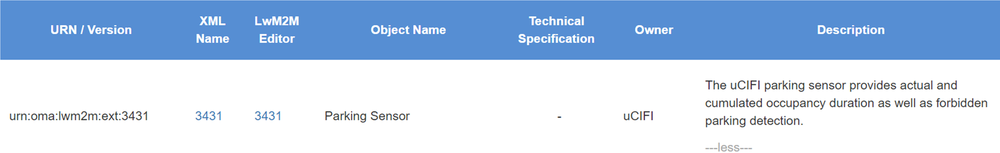
<figcaption>
</figcaption>
</figure>

<figure>
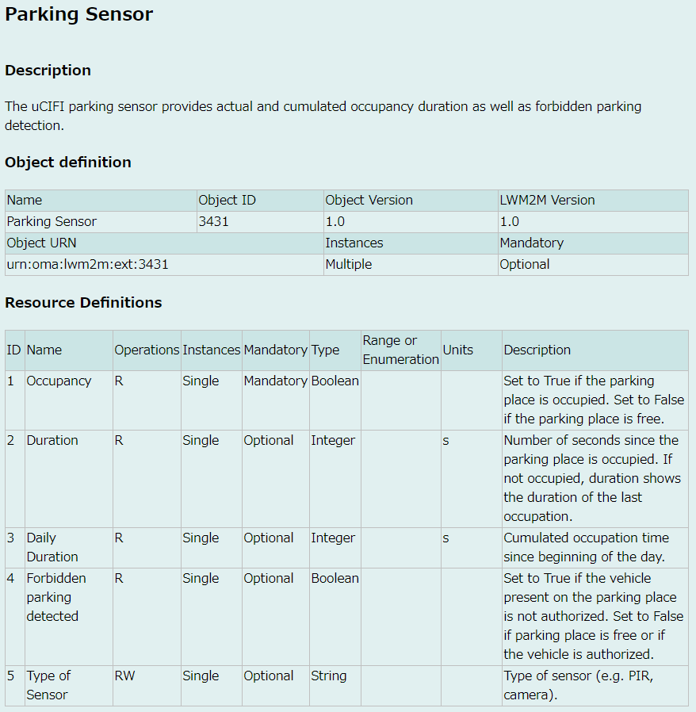
<figcaption>
</figcaption>
</figure>

### 2.8. GSM Association（2018-10-29）

GSM方式のモバイルシステムの視点から作成したデータモデルです。[^31]

* IoT Big Data Harmonised Data Model Version 6.0
     * Agriculture
     * Automotive
     * Environment
     * Industry
     * Smart City
     * Smart Home

データモデルはリンク先のGithubで公開しています。

<figure>
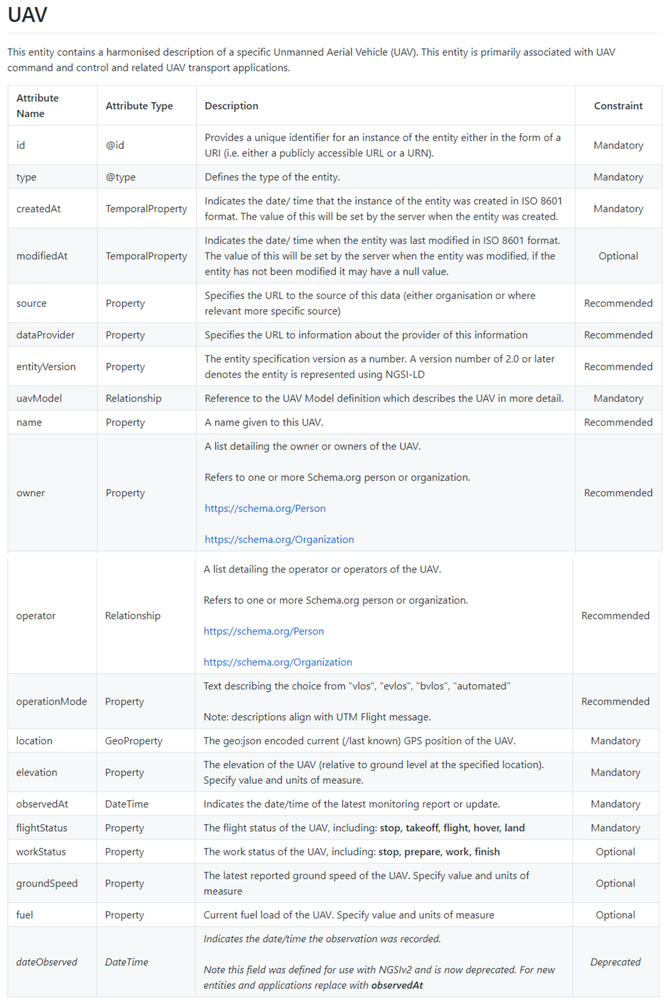
<figcaption>
</figcaption>
</figure>

### 2.9. W3C SSN(Semantic Sensor Network Ontology

センサーやアクチュエータについての汎用的なデータモデルです。[^32]

<figure>
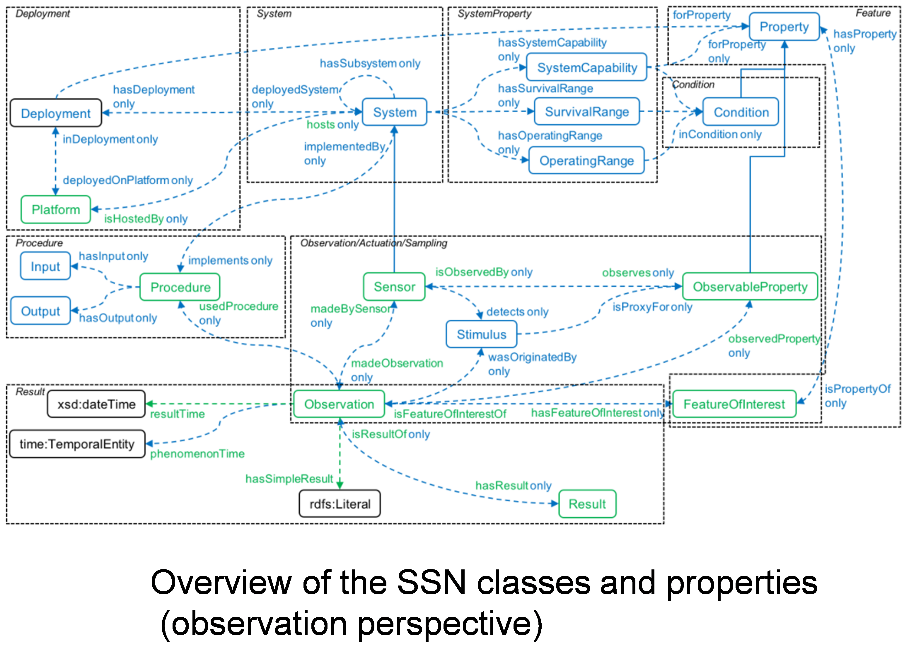
<figcaption>
</figcaption>
</figure>

<figure>
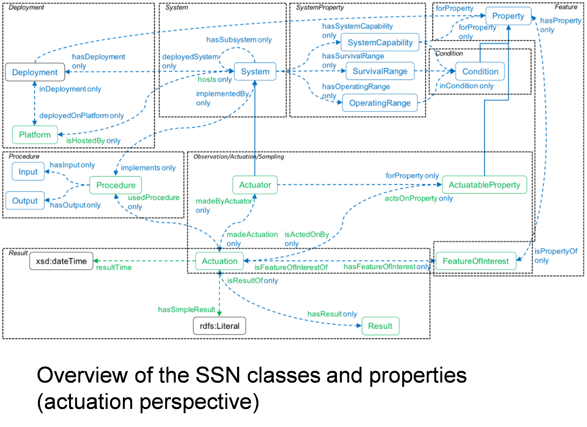
<figcaption>
</figcaption>
</figure>

### 2.10. Schema.org

Webサーチのためのデータモデル。社会のほとんどのものを表現できます。[^33]
ただし、コントロールド・ボキャブラリ（データ項目内で選択肢があるときの候補）など分野固有部分まで詳細化はしていません

<figure>
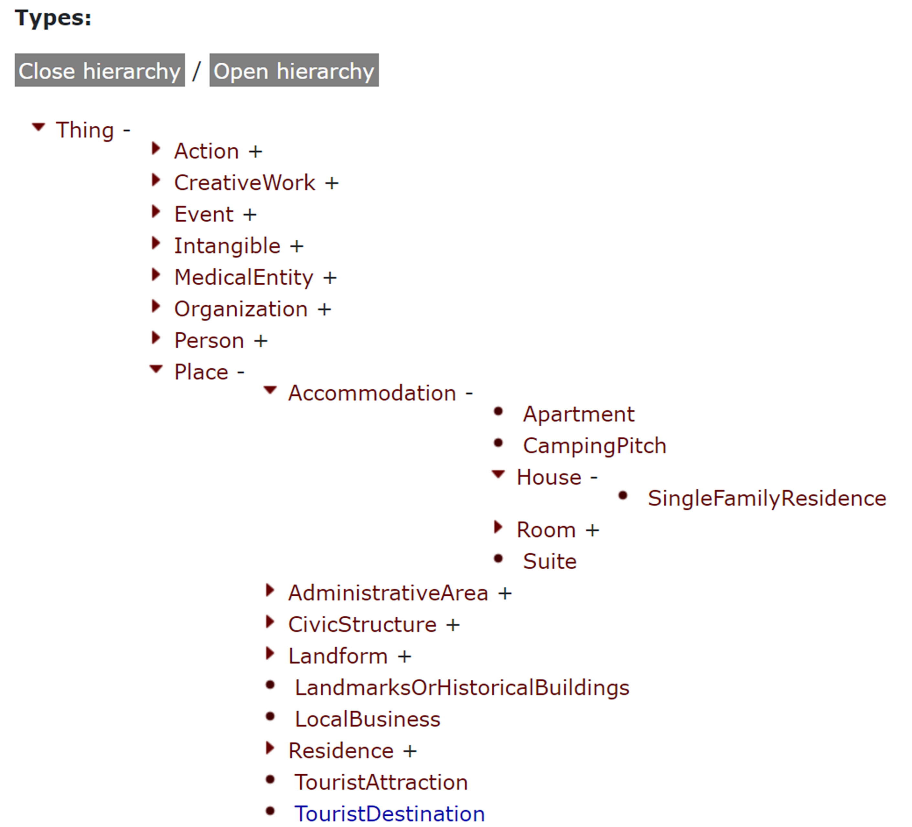
<figcaption>
</figcaption>
</figure>

[^1]: https://docs.ogc.org/is/20-010/20-010.html
[^2]: https://docs.ogc.org/is/20-010/20-010.html
[^3]: https://www.mlit.go.jp/plateau/learning/
[^4]: https://docs.ogc.org/is/20-010/20-010.html
[^5]: https://portal.ogc.org/files/?artifact_id=47842
[^6]: https://docs.ogc.org/is/20-010/20-010.html
[^7]: ttps://www.chisou.go.jp/tiiki/toshisaisei/itoshisaisei/iur/index.html
[^8]: https://docs.ogc.org/is/20-010/20-010.html#construction-uml
[^9]: https://docs.ogc.org/is/20-010/20-010.html
[^10]: https://docs.ogc.org/is/20-010/20-010.html
[^11]: https://docs.ogc.org/is/20-010/20-010.html
[^12]: https://docs.ogc.org/is/20-010/20-010.html
[^13]: https://portal.ogc.org/files/?artifact_id=47842
[^14]: https://portal.ogc.org/files/?artifact_id=47842
[^15]: https://www.chisou.go.jp/tiiki/toshisaisei/itoshisaisei/iur/index.html
[^16]: https://www1.gsi.go.jp/common/000219958.pdf
[^17]: https://www.drm.jp/database/content/
[^18]: https://www.drm.jp/database/content/
[^19]: 道路の区間IDテーブル標準Ver1.2
[^20]: Wikipedia、https://en.wikipedia.org/wiki/General_Transit_Feed_Specification
[^21]: https://www.odpt.org/
[^22]: https://tokyochallenge.odpt.org/
[^23]: 海外の事例:https://transitfeeds.com/feeds
[^24]: 静的バス情報フォーマット（GTFS-JP）仕様書第２版
[^25]: https://imi.go.jp/ns/core/Core242.html
[^26]: https://cio.go.jp/policy-opendata
[^27]: https://smartdatamodels.org/
[^28]: https://fiware-datamodels.readthedocs.io/en/latest/index.html
[^29]: https://www.smartsdk.eu/wp-content/uploads/sites/8/2019/01/SmartSDK-D2.4v1.0.pdf
[^30]: http://www.openmobilealliance.org/wp/omna/lwm2m/lwm2mregistry.html
[^31]: https://www.gsma.com/iot/wp-content/uploads/2018/11/CLP.26-v6.0.pdf
[^32]: https://www.w3.org/TR/vocab-ssn/
[^33]: https://schema.org/docs/full.html
