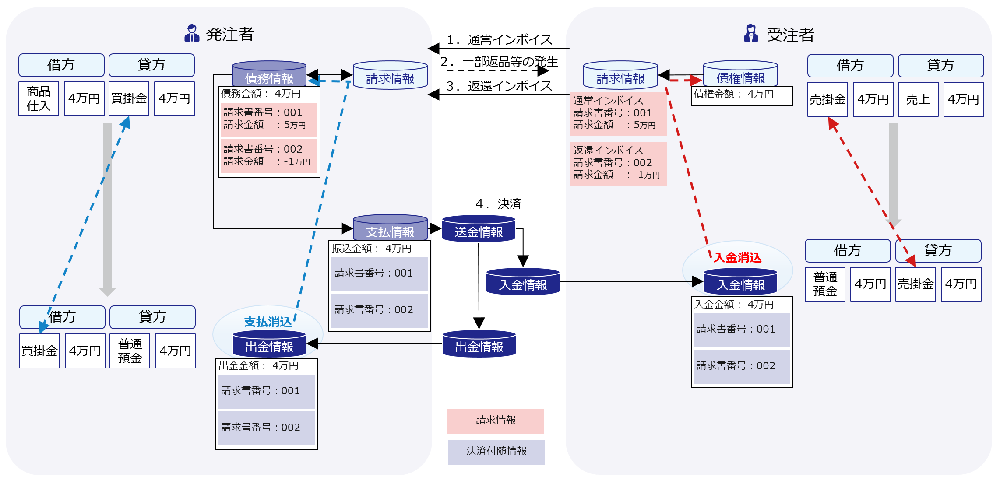
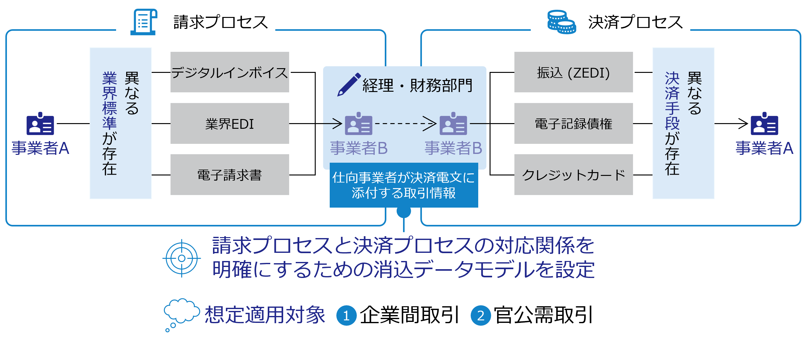
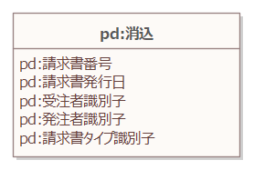
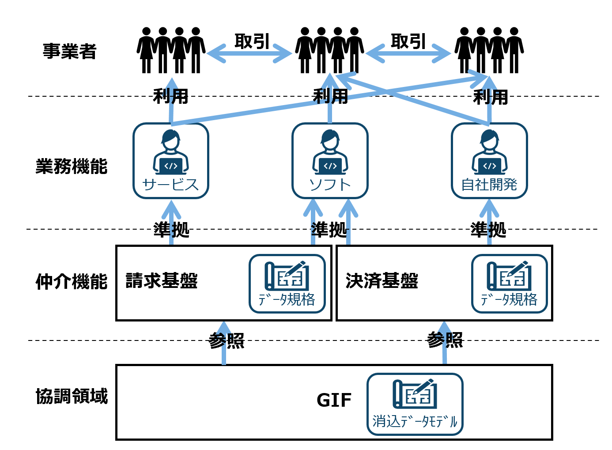
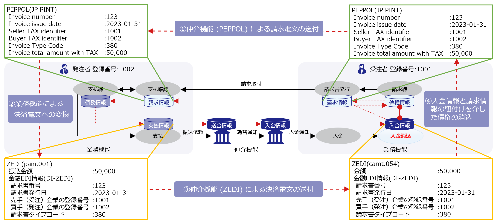
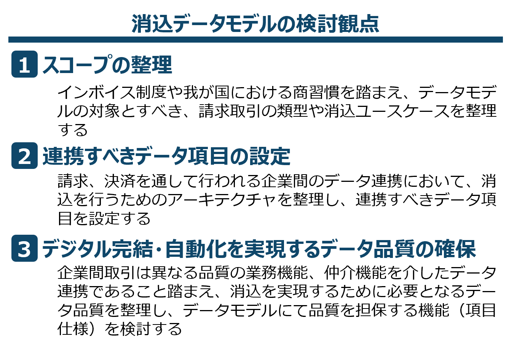
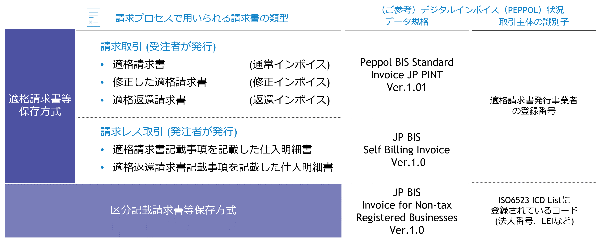
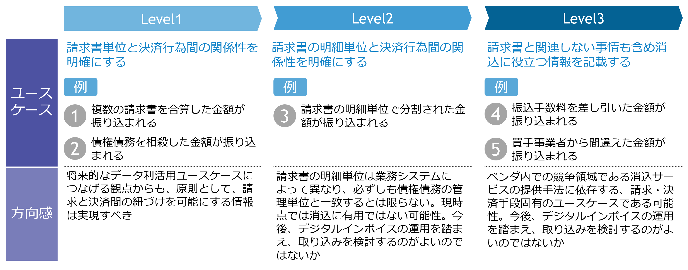
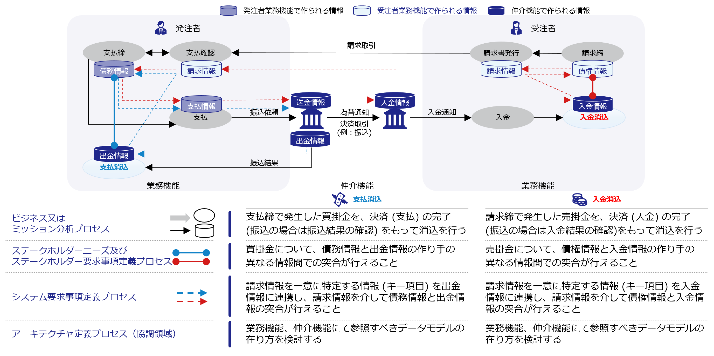

# 実装データモデル（金融） 消込 <!-- omit in toc -->

デジタル社会推進実践ガイドブック DS-453-1

2023年（令和5年）8月31日

デジタル庁

---
**[キーワード]**

企業間取引、請求、決済、債権債務管理、消込、デジタル完結・自動化

**[概要]**

企業間取引において取引主体間でやり取りされるデータをシステム実装する際に参照すべきデータモデルについて解説するガイドブックです。このガイドに従いデータ設計を行うことで、同じ設計規則に従うシステム間、分野間でのデータ連携を容易かつ正確に行えるようになります。また、データ設計を実施するコストも削減することができます。

---

## 改訂履歴 <!-- omit in toc -->

| 改訂年月日 | 改訂箇所 | 改訂内容 |
| --- | --- | --- |
| 2023年8月31日 | 全体 | 正式版決定 |

## 目次 <!-- omit in toc -->

- [1. 背景と課題](#1-背景と課題)
  - [1.1. 背景](#11-背景)
  - [1.2. 課題](#12-課題)
  - [1.3. 投資対効果](#13-投資対効果)
- [2. 目的と概要](#2-目的と概要)
  - [2.1. 目的](#21-目的)
  - [2.2. 概要](#22-概要)
- [3. 消込データモデル](#3-消込データモデル)
  - [3.1. データモデルの全体概要図（クラス図）](#31-データモデルの全体概要図クラス図)
  - [3.2. データモデルの項目定義](#32-データモデルの項目定義)
  - [3.3. データモデルの関係性](#33-データモデルの関係性)
  - [3.4. コントロールド・ボキャブラリ（統制語彙）](#34-コントロールドボキャブラリ統制語彙)
- [4. データモデルの活用イメージ](#4-データモデルの活用イメージ)
  - [4.1. 機能イメージ](#41-機能イメージ)
  - [4.2. データ連携イメージ](#42-データ連携イメージ)
- [5. 解説](#5-解説)
  - [5.1. 消込データモデルについて](#51-消込データモデルについて)
- [6. 付録](#6-付録)

---

## 1. 背景と課題

### 1.1. 背景

我が国では、これまで既存の産業分野やサプライチェーンを前提として、業務慣行やシステムの効率化・最適化が図られてきました。他方で、インターネットをベースとした世界的なビジネスの広がりや、技術革新を背景とした新たな商品・サービスの出現、さらにSDGsへの関心の高まりや、個人の働き方の変革等による消費行動の変容など、ビジネスをとりまく環境は日々変化しています。こうした変化の中、我が国における労働力人口は減少しており、今後多様な業界で労働力不足が生じることが予想され、各事業者においては生産性の向上が求められています。

企業間取引においては、適格請求書等保存方式の開始とそれに伴うデジタル庁によるデジタルインボイス（PEPPOL）の整備、金融メッセージ標準であるISO20022への移行など、請求プロセス、決済プロセスに関わる部分において、手段のデジタル化、情報の構造化が進んでいます。こうした背景を踏まえ、最適化されている個々のプロセス間の相互運用性を向上させることで、事業者のバックオフィス業務の効率化が必要です。

### 1.2. 課題

これまで事業者間でやりとりされる請求書の書式は統一されておらず、債権債務管理業務においては、決済情報と債権債務情報の紐づけが行いにくいという課題がありました。業界EDIなどによる請求情報のデジタル化が図られていましたが、業種業界毎、サプライチェーン毎に最適化されてきたため、他業種との取引に使用できない、決済時の付随情報として連携ができない状況にありました。

* 受注者にとっての課題
  * 既存の決済情報では、消込等の実施に不十分
  * 消込が行えない場合、相手事業者への問い合わせが発生する
* 発注者にとっての課題
  * 受注者から受け取った請求情報について、決済時にどの情報を返せばよいのか分からない
* 決済手段提供者にとっての課題
  * 事業者にとって有益となる情報がわからない
  * 請求データ規格が多く、決済付随情報の構造化が困難

### 1.3. 投資対効果

事業者は、消込データモデルを参照した業務システム、請求・決済手段を採用することで、消込精度の向上、しいては債権債務管理業務のデジタル完結・自動化が実現できます。実現によりバックオフィス業務を担っていた人手を本来業務に集中させることができ、生産性の向上を図ることができます。

---

## 2. 目的と概要

### 2.1. 目的

企業間取引における請求プロセスと決済プロセスでそれぞれ行われるデータ連携について、両プロセスの対応関係を明確にし、情報項目を標準化することで相互運用性を向上させ、債権債務管理業務のデジタル完結・自動化を実現します。

### 2.2. 概要

事業者の債権債務管理業務において、取引にて発生した債権（売掛金）、債務（買掛金）は、事業者間の決済の完了をもって解消の確認（消込）を行います。この際に、決済対象となった元々の請求情報を特定するために必要な情報を決済付随情報として連携することにより、消込時に債権債務情報との紐づけをデジタルで行えるようにし、消込精度の向上とデジタル完結・自動化を実現します。

<figure>

<figcaption>
図 1　実現イメージ
</figcaption>
</figure>

また、請求情報を特定する項目を標準化することにより、相手事業者毎に利用する請求手段、決済手段が異なる場合においても、事業者は意識することなくデジタル完結・自動化による消込が可能となります。

<figure>

<figcaption>
図 2　消込データモデルのコンセプト
</figcaption>
</figure>

---

## 3. 消込データモデル

### 3.1. データモデルの全体概要図（クラス図）

消込の実装データモデルの全体概要図は以下のとおりです。

<figure>

<figcaption>
図 3　消込データモデルの全体構造図（クラス図）
</figcaption>
</figure>

### 3.2. データモデルの項目定義

| 必須項目 | 項目名 | 説明 |
| --- | --- | --- |
| 必 | 請求書番号 | 請求書/仕入明細書発行時に発行主体にて採番された番号。35文字以内。 |
| 必 | 請求書発行日 | 請求書/仕入明細書の発行主体における発行日。 |
| 必 | 受注者識別子 | 受注者の適格請求書発行事業者としての登録番号。 |
| 必 | 発注者識別子 | 発注者の適格請求書発行事業者としての登録番号。 |
| 必 | 請求書タイプ識別子 | 請求書/仕入明細書等、決済対象となる請求情報の請求書タイプの識別子。 |

### 3.3. データモデルの関係性

消込データモデルと[デジタルインボイス(適格請求書：Peppol BIS Standard Invoice JP PINT、仕入明細書：JP BIS Self Billing Invoice)][1] との関係性を以下に示します。

[1]:https://www.digital.go.jp/policies/electronic_invoice/

| GIFデータ項目 | 対応するPeppol BIS Standard Invoice JP PINT Ver1.01 | 対応するJP BIS Self Billing Invoice Ver1.0 |
| --- | --- | --- |
| 請求書番号 | IBT-001/Invoice number | IBT-001/Invoice number |
| 請求書発行日 | IBT-002/Invoice issue date | IBT-002/Invoice issue date |
| 受注者識別子 | IBT-031/Seller TAX identifier | IBT-031/Seller TAX identifier |
| 発注者識別子 | IBT-048/Buyer TAX identifier | IBT-048/Buyer TAX identifier |
| 請求書タイプ識別子 | IBT-003/Invoice Type Code | IBT-003/Invoice Type Code |

### 3.4. コントロールド・ボキャブラリ（統制語彙）

①請求書タイプ識別子
 
UNCL1001に準拠します。なお、デジタルインボイスで使用するコードは以下の通り。

適格請求書：Peppol BIS Standard Invoice JP PINTで使用するコード
| コード | 説明 |
| --- | --- |
| 380 | Commercial invoice |

仕入明細書：JP BIS Self Billing Invoiceで使用するコード
| コード | 説明 |
| --- | --- |
| 389 | Self-billed invoice |

---

## 4. データモデルの活用イメージ

### 4.1. 機能イメージ

消込データモデルは、事業者間の請求や決済時に利用される電文のデータ規格への参照機能を提供します。データ規格に消込データモデルが組み込まれることにより、その電文を介して事業者の業務システム間で消込を可能とする請求情報が連携されるようになることを意図しています。また、様々な電文に組み込まれることで、取引先事業者毎に利用する請求手段、決済手段が異なる場合においても、債権債務管理業務のデジタル完結・自動化が可能となります。

<figure>

<figcaption>
図 4 消込データモデルの機能提供イメージ
</figcaption>
</figure>

なお、デジタル完結・自動化を想定していますが、事業者内において業務システム間の画面転記など、人の介在が発生する場合においても、データモデルを参照することで転記ルールのマニュアル化を図ることが可能です。

### 4.2. データ連携イメージ

デジタルインボイスによる請求と全銀EDIシステムによる決済を利用した場合のデータ連携イメージを下記に示します。

<figure>

<figcaption>
図 5 消込データモデルによる請求情報の連携イメージ
</figcaption>
</figure>

---

## 5. 解説

### 5.1. 消込データモデルについて

企業間取引において、事業者でやり取りされる請求情報を一意に特定することを可能とするデータモデルです。受注者から発注者へ渡す請求情報、および発注者から受注者へ渡す決済付随情報で利用します。なお、請求書を用いず、発注者から受注者へ仕入明細情報を渡している（いわゆる請求レス取引）場合においても、仕入明細書の参照モデルとして使用できます。
なお、消込データモデルの策定にあたり下記観点にて検討を行っています。

<figure>

<figcaption>
図 6 消込データモデルの検討観点
</figcaption>
</figure>

#### (1) スコープの整理<!-- omit in toc -->

##### (a)請求書の類型<!-- omit in toc -->

2023年10月からの適格請求書等保存方式の開始にあたり、請求情報の構造化（デジタルインボイス）および取引主体の識別子（適格請求書発行事業者の登録番号）の整備が行われています。こうした背景を踏まえ、決済プロセスで用いられるデータ規格との連携を図ることで構造化の便益最大化を目指す観点から、適格請求書等保存方式をスコープとしています。
また、従前の区分記載請求書保存方式については、今後も免税事業者での利用が想定されることから、今後のデジタルインボイスにおける検討状況を踏まえて検討を行います。

<figure>

<figcaption>
図 7 請求書の類型とデジタルインボイス整備状況
</figcaption>
</figure>

##### (b)消込ユースケース<!-- omit in toc -->

データモデルで対応する消込ユースケースとして対応レベルを３段階に分け整理しています。

<figure>

<figcaption>
図 8 消込ユースケースの実現Level
</figcaption>
</figure>

将来的なデータ利活用ユースケースにつなげる観点から、請求書単位と決済行為間の紐づけを可能にするユースケース(Level1)をスコープとしています。一方、請求書の明細単位の紐づけ（Level2）、商習慣や業界慣行に特化した情報の紐づけ（Level3）については、今後、デジタルインボイスの運用を踏まえ、取り込みを検討します。

#### (2) 連携すべきデータ項目の設定<!-- omit in toc -->

(a)消込を実現するための協調領域の整理

企業間取引における請求および決済プロセスを通じた消込を実現するために、整理すべき協調領域について、JIS X 0170：2020 (ISO/IEC/IEEE 15288：2015)システムライフサイクルプロセスにおけるテクニカルプロセスを参照し、要求と要求を実現するための協調領域を整理しています。

<figure>

<figcaption>
図 9 消込を実現する協調領域の整理
</figcaption>
</figure>

請求および決済プロセスを通じた消込を実現するためには、作成主体が異なる情報間での突合 (データ間の接続) が重要であり、業務機能及び仲介機能において、突合対象を特定するための情報項目 (キー項目)の 標準化が協調領域であるべきと整理しています。

(b)消込のためのキー項目の設定

協調領域とそこで必要になる参照データモデルの役割を踏まえ、請求情報を一意に特定する情報項目（キー項目）を設定しています。設定においては、まずは①発行主体で一意に特定するために必要と思われる項目を検討し、その上で②消込主体にて消込を行うために追加的に必要と思われる項目を検討、合わせてキー項目として設定しています。

①発行主体で一意に特定するために必要と思われる項目
| 項目名 | 説明 | 設定意図 |
| --- | --- | --- |
| 請求書番号 | 請求書/仕入明細書発行時に発行主体にて採番される番号 | 発行元における請求情報管理の観点から、請求単位で採番される番号。一般的には、単独でキー項目の役割を担うが、事業者の管理ポリシーや利用する業務機能、仲介機能によっては、請求書発行日等、他の項目との複合で使用されるケースもある。 |
| 請求書発行日 | 請求書/仕入明細書の発行主体における発行日 | 請求月、日単位で請求書番号を採番するケースを考慮。 |
| 発行先事業者識別子 | 請求書/仕入明細書の発行相手となる事業者の識別子 | 発行先事業者単位で請求書番号を採番するケースを考慮。 |

②消込主体にて消込を行うために追加的に必要と思われる項目
| 項目名 | 説明 | 設定意図 |
|  --- |  --- | --- |
| 受発注事業者識別子 | 取引主体となる事業者双方の識別子 | 様々な事業者との取引を行う、様々な請求の類型を扱う可能性があることを前提に、消込主体における①の重複ケースを解消するために設定。 |
| 請求書タイプ識別子 | 発行主体にて発行される請求書/仕入明細書の文書タイプ | 同上 |

#### (3) デジタル完結・自動化を実現するデータ品質の確保<!-- omit in toc -->

様々な事業者間のデータ連携においては、業務機能、仲介機能いずれも提供者（ソフトウェア、サービス、自社開発、基盤）が異なるため、連携されるデータそのものの品質について、利用用途に応じた品質水準を確保することが重要です。そのため、本データモデルには品質を担保する機能として項目仕様を実装しています。

| 項目名 | 項目仕様 |
| --- | --- |
| 請求書番号 | 35文字以内 |
| 請求書発行日 | ISO8601(YYYY-MM-DD) |
| 受注者識別子 | 受注者の適格請求書発行事業者の登録番号 |
| 発注者識別子 | 発注者の適格請求書発行事業者の登録番号 |
| 請求書タイプ識別子 | UNCL1001 |

なお、機能の実装にあたっては、JIS X 25012:2013 (ISO/IEC 25012:2008)　ソフトウェア製品の品質要求及び評価-データ品質モデルに規定されている、品質要求における15の品質特性を踏まえ、消込データモデルで担保すべき品質特性と実装方法を検討しています。

---

## 6. 付録

また、本データモデルは、独立行政法人情報処理推進機構デジタルアーキテクチャ・デザインセンターの活動を通じて策定されました。データモデルの検討経緯等、詳細につきましては、下記WEBサイトを合わせて参照してください。
 
<https://www.ipa.go.jp/digital/architecture/project/btob/contract_technical-meeting/index.html>

---
