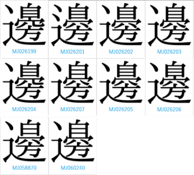
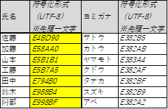
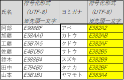
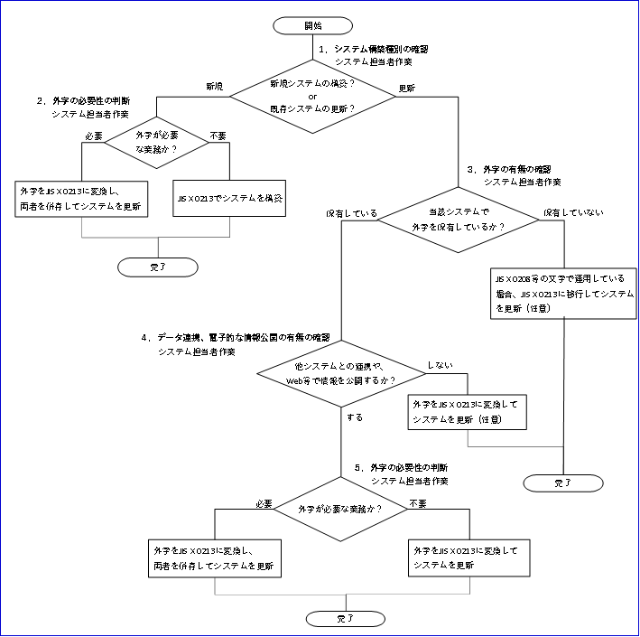

# 文字環境導入実践ガイドブック <!-- omit in toc -->

デジタル社会推進実践ガイドブック DS-461

2022年（令和4年）3月31日

デジタル庁

-----
**〔キーワード〕**

文字、漢字、代替文字、ヨミガナ、ローマ字、文字コード、符号化形式、外字、文字情報基盤、氏名、法人名、地名、JIS X 0213、JIS X 0221、

**〔概要〕**

情報システム間のデータ連携やスマートフォン等による行政サービスの利用が可能となるよう、情報システム及びサービスの開発において、行政機関がその行政活動において使用する文字の取扱いを標準化するための実践ガイドブック。

-----
## 改訂履歴 <!-- omit in toc -->

| 改訂年月日 | 改訂箇所 | 改訂内容 |
| ----------|----------|---------|
| 2023年1月12日 |2.1.2 |  漢字等１文字当たりのバイトを１～４の可変長に変更 |
|2022年3月31日| 全体 |「外字を使用せざるを得ない」場合の解説を追加。文字情報基盤が、2020年に独立行政法人情報処理推進機構から一般社団法人文字情報技術促進協議会（https://moji.or.jp/）に民間移管したことを反映 |
|2022年3月31日 | 全体|2020年にJIS X 0221が、ISO/IEC 10646の2017年版に合わせて改定したため、ISO/IEC 10646の記述をJIS X 0221に変更 |
| 2019年3月28日 | － | 初版決定  |

-----

## 目次　<!-- omit in toc -->

- [1. はじめに](#1-はじめに)
  - [1.1. 背景と目的](#11-背景と目的)
  - [1.2. 適用対象](#12-適用対象)
  - [1.3. 位置づけ](#13-位置づけ)
  - [1.4. 用語](#14-用語)
- [2. 文字に関する標準的な取扱い](#2-文字に関する標準的な取扱い)
  - [2.1. 総論](#21-総論)
    - [2.1.1. 文字の範囲に関する標準的な取扱い](#211-文字の範囲に関する標準的な取扱い)
      - [2.1.1.1. JIS X 0213の文字](#2111-jis-x-0213の文字)
      - [2.1.1.2. 外字](#2112-外字)
        - [2.1.1.2.1. 外字](#21121-外字)
        - [2.1.1.2.2. 環境依存文字の取扱い](#21122-環境依存文字の取扱い)
    - [2.1.2. 文字コード及び文字の符号化形式に関する標準的な取扱い](#212-文字コード及び文字の符号化形式に関する標準的な取扱い)
    - [2.1.3. ヨミガナに関する標準的な取扱い](#213-ヨミガナに関する標準的な取扱い)
    - [2.1.4. ローマ字表記に関する標準的な取扱い](#214-ローマ字表記に関する標準的な取扱い)
  - [2.2. 各論](#22-各論)
    - [2.2.1. 氏名における文字の取扱い](#221-氏名における文字の取扱い)
      - [2.2.1.1. 文字の範囲に関する標準的な取扱い](#2211-文字の範囲に関する標準的な取扱い)
      - [2.2.1.2. 文字コード及び文字の符号化形式に関する標準的な取扱い](#2212-文字コード及び文字の符号化形式に関する標準的な取扱い)
      - [2.2.1.3. ヨミガナに関する標準的な取扱い](#2213-ヨミガナに関する標準的な取扱い)
      - [2.2.1.4. ローマ字表記に関する標準的な取扱い](#2214-ローマ字表記に関する標準的な取扱い)
    - [2.2.2. 法人名における文字の取扱い](#222-法人名における文字の取扱い)
      - [2.2.2.1. 文字の範囲に関する標準的な取扱い](#2221-文字の範囲に関する標準的な取扱い)
      - [2.2.2.2. 文字コード及び文字の符号化形式に関する標準的な取扱い](#2222-文字コード及び文字の符号化形式に関する標準的な取扱い)
      - [2.2.2.3. ヨミガナに関する留意事項](#2223-ヨミガナに関する留意事項)
      - [2.2.2.4. ローマ字表記に関する標準的な取扱い](#2224-ローマ字表記に関する標準的な取扱い)
    - [2.2.3. 地名における文字の取扱い](#223-地名における文字の取扱い)
      - [2.2.3.1. 文字の範囲に関する標準的な取扱い](#2231-文字の範囲に関する標準的な取扱い)
      - [2.2.3.2. 文字コード及び文字の符号化形式に関する標準的な取扱い](#2232-文字コード及び文字の符号化形式に関する標準的な取扱い)
      - [2.2.3.3. ヨミガナに関する留意事項](#2233-ヨミガナに関する留意事項)
      - [2.2.3.4. ローマ字表記に関する標準的な取扱い](#2234-ローマ字表記に関する標準的な取扱い)
    - [2.2.4. Webサイト、通知、掲示物における文字の取扱い](#224-webサイト通知掲示物における文字の取扱い)
- [3. 文字環境導入のためのステップ](#3-文字環境導入のためのステップ)
  - [3.1. 文字環境の導入の全体の流れ](#31-文字環境の導入の全体の流れ)
  - [3.2. 文字環境の導入の個別の流れ](#32-文字環境の導入の個別の流れ)
    - [3.2.1. システム構築種別の確認](#321-システム構築種別の確認)
    - [3.2.2. 新規システムにおける外字の必要性の判断](#322-新規システムにおける外字の必要性の判断)
    - [3.2.3. 既存システムにおける外字の有無の確認](#323-既存システムにおける外字の有無の確認)
    - [3.2.4. データ連携、電子的な情報公開の有無の確認](#324-データ連携電子的な情報公開の有無の確認)
    - [3.2.5. 外字の必要性の判断](#325-外字の必要性の判断)
- [4. 別紙　参考](#4-別紙参考)
  - [4.1. 文字](#41-文字)
    - [4.1.1. 常用漢字](#411-常用漢字)
    - [4.1.2. 文字情報基盤](#412-文字情報基盤)
    - [4.1.3. 代替文字](#413-代替文字)
      - [4.1.3.1. 氏名における代替文字](#4131-氏名における代替文字)
      - [4.1.3.2. 法人名における代替文字](#4132-法人名における代替文字)
    - [4.1.4. デジタル・ガバメント実行計画（抄）](#414-デジタルガバメント実行計画抄)

-----
## 1. はじめに

### 1.1. 背景と目的

我が国においては、一般のコンピュータにおいて処理できるように日本工業規格（JIS）によって規格化された文字以外に、文字表現の違い等の様々な理由により、画像データとして管理されている文字（以下「外字」という。）が100万文字以上あるといわれています。行政機関では、行政運営上、本人確認等を厳格に行う場合や個人のアイデンティティに配慮する場合に、この膨大な文字を用いようとする傾向があります。その結果、外字をそれぞれのコンピュータに導入する方法や、当該文字のヨミガナを別途データとして管理する方法が採られてきました。

しかしながら、使える文字数は多ければ良いというものではありません。自らのコンピュータに追加した外字は、当該外字を追加していない他のコンピュータでは処理できません。その場合には、正しく表示できないのはもちろんのこと、検索やデータ連携も困難となります。また、文字の数が多ければ多いほど、視認性や表音性の難易度が高まり、結果として社会経済活動が円滑に行われにくくなるおそれがあります。日本語を母国語としない方にとっては、なおさら難しい問題です。

一般の社会生活において現代の日本語を書き表すための漢字使用の目安である常用漢字は約２千文字です。一方で、約２千文字では専門的な内容を伝えにくい等の社会の要請があります。そこで、これまで文字のJIS規格が整備されてきており、現在は、１万字程度となっています。これは、日常的に用いられるパソコン、スマートフォン、タブレット等において標準的に扱える文字になります。

世界に目を向けると、主要言語における文字は標準化されています。多くの文字を使う必要がなく、容易にデジタル環境へ移行することができています。

政府は、「デジタル・ガバメント実行計画」（平成30年7月20日デジタル・ガバメント閣僚会議決定）に基づき、行政サービスの100％デジタル化をする方針を掲げています。情報システム間のデータ連携を容易に行えるようにし、国民がスマートフォン等で行政サービスを利用できる環境を構築するための文字環境を効率的かつ確実に導入できるよう、行政機関の情報システム担当者向けに本ガイドブックを作成しました。

### 1.2. 適用対象

本ガイドブックの適用対象は、標準ガイドラインが適用されるサービス・業務改革並びにこれらに伴う国の行政機関の情報システムの整備及び管理に関する事項です。なお、これらの事項以外における文字の取扱いにも応用できるほか、国の行政機関以外においても参考となるように作成しています。

### 1.3. 位置づけ

本ガイドブックは、標準ガイドラインに属する文書群（以下「標準ガイドライン群」という。）の一つとしてナンバリングされる実践ガイドブックとなります。

### 1.4. 用語

本ガイドブックにおいて使用する用語は、表１-1及び本ガイドブックに別段の定めがある場合を除くほか、標準ガイドライン群用語集の例によります。その他専門的な用語については、民間の用語定義を参照してください。

表 １‑1　用語の定義

|用語    |意味 |
|:-------|:----|
|ヨミガナ|漢字の読み方を平仮名又は片仮名で表現したもののことです。漢字の上や横につけたヨミガナをフリガナやカナ表記と表現する場合もあります。|
|文字情報基盤|日本の行政業務で用いられる漢字約6万文字を整備したものです。国際標準化されており、用途によって少ない文字数で運用できる仕組みも用意しています。|
|文字コード|コンピュータで文字を扱う場合に、各文字の字形を扱うのではなく英数字による番号（コード）で扱います。文字コードとは、各文字それぞれに割り当てられる番号（コード）のことです。|
|符号化形式|文字コードを文書ファイルの保存や交換の際にどのように表現するかを指定する形式のことです。|
|JIS X 0213|一般的なパソコンやスマートフォン等で標準的に搭載されている文字の範囲のことです。漢字などの文字コードに関する日本工業規格。第１水準～第４水準の漢字と非漢字の約1万文字についてコード化しています。2012年に最新の改正がされています。関連規格として、JIS X 0208（非漢字、第1水準～第2水準）等があります。|
|外字|使用する機器に標準で搭載されず、特別に追加で作られた文字です。ユーザが独自に設定するため一般に機器間での交換はできません。一般の機器ではJIS X 0213が搭載されることから、本書では、そこに含まれない文字のことを指します。|
|代替文字|外字はデータの処理や交換ができないため、外字をコンピュータで使用できる文字に代替した文字を代替文字と言います。本ガイドブックでは、外字をJIS X 0213の文字に置き換えた文字のことを指します。|

-----
## 2. 文字に関する標準的な取扱い

### 2.1. 総論

#### 2.1.1. 文字の範囲に関する標準的な取扱い

##### 2.1.1.1. JIS X 0213の文字

 氏名、法人名、地名等の名称における文字は、その個別性、同一性を確認する上で、非常に重要な要素です。一方、前述のとおり、文字の表現の正確性を重視して、取り扱える文字の数量を増加させ、複雑化させることは、人間の能力の制約上、同一の文字であることを確認することに時間を要し、誤認することに繋がってしまい、結果的に、混乱の要因となる場合があります。

<figure>

</figure>

例えば、これら文字群は、「ベ」と表音する「邊」の異字体とされています。常用漢字では「辺」と表記されています。これらの文字は似ていますが、全て異なる文字です。これらの文字を、瞬時に、異なる文字と認識し、同一性の確認を行い、特定することは一般に困難だと考えられます。
また、検索する場合において正しく入力しないときには誤った検索結果が得られるおそれもあります。さらに、筆記された文字の場合には、略字を用いる可能性等が加わり、同一性の確認が一層難しくなります。

また、情報システムの構築及び管理の観点からは、一般に普及しているパソコン、スマートフォン、タブレットといったコンピュータで外字を取扱う場合には、個別にコンピュータに当該外字を導入しなければいけません。また、外字を扱う情報システムとの間においてデータ連携をする場合には、同じ外字を導入するか、利用可能な文字に変換しなければならず、効率的ではありません。
以上を踏まえ、サービス・業務を設計し、情報システムを構築及び管理していく上で、文字の取扱いは、日本工業規格JIS X 0213の文字（約1万文字）に限定して使用することを強く推奨します。JIS X 0213は、一般的なパソコンやスマートフォン等に標準搭載されており、当該文字を利用すれば、上述の問題の発生を防ぐことができるからです。
なお、JIS X 0213の利用は、デジタル・ガバメント実行計画に明記されています。

#####  2.1.1.2. 外字

###### 2.1.1.2.1. 外字

 戸籍謄抄本や法人登記の全部事項証明書等、文字を正確に扱う必要があり外字を使用せざるを得ない場合以外は、その用途に応じて、代替文字を利用することを推奨します。

###### 2.1.1.2.2. 環境依存文字の取扱い

 最新のJIS X 0213では規格化されている文字もありますが、丸数字や半角カタカナ等、システム環境によっては扱えない文字があり、環境依存文字と呼ばれます。利用者の環境によっては正しく表示できず、データ交換に支障をきたすため、環境依存文字の使用は避ける必要があります。

 特に、英字文書や英語に機械翻訳する予定がある文書は、正しく翻訳されないことがあるため、環境依存文字の使用を避けるべきです。

#### 2.1.2. 文字コード及び文字の符号化形式に関する標準的な取扱い

 コンピュータで文字を扱うためには、取り扱う文字の範囲を定めるだけでなく、文字をコンピュータが理解できる形式に符号化する必要があります。
 符号化に当たっては、文字に与える番号である「文字コード」及びこの番号を文書ファイルの保存や交換の際にどのように表現するかを指定する「符号化形式」が必要です。文字コード及び符号化形式には、それぞれ複数の種類があるため、情報システムを設計・開発していく上で、これらの仕様を示さないと、設計・開発事業者が独自の判断で決めてしまう可能性があります。このような場合には、情報システムの更新時のデータ移行や他の情報システムとのデータ連携を行う際に、文字コードや符号化形式の差異により、問題が発生するおそれがあります。

 このため、情報システムの設計・開発に係る調達においては、文字コードとしてはJIS X 0221 を、符号化形式としてはUTF-8を指定して使用することを推奨します。UTF-8と指定するだけで、JIS X 0221を文字コードとして使用することを併せて意味すると解釈されることもありますが、明確化のため、文字コード及び符号化形式の両方とも指定することが安全です。JIS X 0221文字コードをUTF-8の符号化形式で表現したものは世界中の文字を加えた国際規格のコードで、コンピュータの基礎的な符号化形式であるASCIIと互換性があり、世界の多くのソフトウェアがこれに対応しています。JIS X 0221 とUTF-8を利用することで、効率的に情報システムを構築及び管理することができます。

 調達仕様書では、以下のように記載することで、漢字の仕様を明確にすることができます。

* 取り扱う日本語文字集合の範囲：JIS X 0213
* 文字コード：JIS X 0221
* 文字の符号化形式：UTF-8

 なお、UTF-8では、漢字等を１文字当たり１～４バイトの可変長で表現します。既存システムにおいて漢字等を２バイトで表現する符号化方式（Shift-JIS等）を使用している場合、UTF-8に符号化方式を移行する際には２バイトから１～４バイトになることを想定した設計が必要になります。

#### 2.1.3. ヨミガナに関する標準的な取扱い

２.１のとおり、標準的な文字の取扱いにしても、約1万文字もあり、文字自体の読み方が分かりにくく、複数の文字の組み合わせによって読み方が特殊、難読又は複数になる場合があります。
また、例えば氏名の並べ替え（ソート）をする場合、システムでは文字コードでソートされるため、表 ２‑1のように、漢字によりソートした場合には人間が認識しにくい順番で並びますが、ヨミガナによりソートした場合には五十音順に並びますので、人間が認識しやすくなります。
したがって、サービス・業務及び情報システムを設計していく上では、漢字と併せてヨミガナを取り扱うことができるようにすることを強く推奨します。

なお、ヨミガナの表記及び記録については、全角カタカナを使うことを推奨します。半角カタカナの使用はデータ交換に支障を生じ得るためです。
また、濁音・半濁音については、濁点・半濁点を別の1文字として表記せず（例：「ス」「“」）、濁音・半濁音で1文字として表記（例：「ズ」）するべきです。

表 ２-１　文字のソート順の比較
<figure>
　
<figcaption>
(1) 漢字によるソート順（昇順）　
</figcaption>
</figure>

<figure>

<figcaption>
(2) ヨミガナによるソート順（昇順）　
</figcaption>
</figure>

#### 2.1.4. ローマ字表記に関する標準的な取扱い

 国際化が進み、行政サービスを提供する場合においても、日本語で表記できない氏名を扱うことが必要となる場合や、法人情報等を海外に向けて公開することが必要となる場合があります。このように、日本語を主要言語としない人や組織への配慮が求められる状況においては、ローマ字表記の重要性が増してきており、サービス・業務及び情報システムを設計していく上で、漢字・ヨミガナに併せてローマ字表記を取り扱うことができるようにすることを推奨します。

### 2.2. 各論

標準的な文字等の取扱いについては、２.１の記述のとおりですが、次に掲げる事項については、それぞれ記載のとおりに取り扱うことを推奨します。

#### 2.2.1. 氏名における文字の取扱い

##### 2.2.1.1. 文字の範囲に関する標準的な取扱い

 JIS X 0213の使用が前提ですが、外字を使用せざるを得ない場合には、外字とJIS X 0213の関連付け（マッピング表の作成）を行います。データ連携時には相互にマッピング表から外字をJIS X 0213の文字に代替してデータを提供します。外字については、文字情報基盤が提供する縮退マッピング表を活用することを推奨します。外字を使用せざるを得ない場合とは、個人のアイデンティティに関わり戸籍上の文字を使う必要がある場合です。

##### 2.2.1.2. 文字コード及び文字の符号化形式に関する標準的な取扱い

 総論で記載したとおり、文字コードはJIS X 0221、文字の符号化形式はUTF-8を指定することを推奨します。

##### 2.2.1.3. ヨミガナに関する標準的な取扱い

 行政サービスを提供する上で氏名を扱う必要がある場合においては、その氏名は漢字氏名（戸籍上、氏名が平仮名又はカタカナで表記されたものを含む。）が基本となりますが、漢字氏名を有さない外国人はパスポートや在留カード等に記載されているローマ字氏名となります。
 日本人にあっても外国人にあっても、同じ氏名であれば、複数のヨミガナを持つ可能性があり、近年は氏名からでは容易にわからないヨミガナも存在します。しかしながら、我が国の現行制度においては、氏名のヨミガナを規定する法令は明確でなく、ヨミガナは氏名の一部とされていないという課題があります。

 一方、氏名のヨミガナは、氏名と同様に、本人の人格を形成する要素の一部であって、他者と区別し本人を特定するものの一つとなっている実態があります。
 さらに、情報システムの構築及び管理においては、氏名のヨミガナがデータの検索キーや外部キーの重要な要素の一つとなっています。情報システムにおいては、清音と濁音のような小さな違いであっても、同一人物が異なる人物と特定されてしまう場合があり（「山崎」のヨミガナを「ヤマサキ」とデータベースに登録していた場合、「ヤマザキ」で検索しても特定できない等）、デジタル技術を活用して適切に行政サービスを提供する上で問題が発生するおそれがあります。

 したがって、窓口等において本人から氏名の情報を取得し、データベースに記録する場合には、併せて氏名のヨミガナも正確に取得し、データベースに記録する必要があります。
 具体的には、窓口等において本人から氏名の情報を新たに取得する際は、窓口の職員が本人の氏名を見てそのヨミガナを類推してデータベースに記録するのではなく、本人が記入した氏名のヨミガナをデータベースに記録し、記録された内容に間違いがないことを本人に確認することを強く推奨します。

 また、既にあるデータベースにおいて、氏名のヨミガナが正確に記録されていない場合（窓口の職員が本人の氏名を見て類推してヨミガナを記録している場合等）には、本人が来庁するときや、業務上本人に何らかの通知をするとき等において、データベースに記録されている氏名のヨミガナを本人に確認し、了承の上、データベースに記録されたヨミガナを修正することを推奨します。
 本人に氏名のヨミガナを確認するときは、清音と濁音の違いにも留意するとともに、外国人のローマ字氏名のヨミガナについては窓口の職員が聞き取ったヨミガナを本人に対してゆっくりと明確に発音して、本人の意思と表記に齟齬が生じないよう配慮することが必要です。

##### 2.2.1.4. ローマ字表記に関する標準的な取扱い

 行政サービスを提供する上で、漢字氏名ではなく、ローマ字氏名を扱うことが必要となる場合（外国政府とのデータ連携が必要な場合等）においては、氏名とは別に、ローマ字氏名を求めることになります。
 この場合、日本人のローマ字氏名については、本人のヨミガナを原則ヘボン式によりローマ字に変換したものであって、パスポートに記載されるもの又は記載されたものとすることを推奨します。

 また、外国人のローマ字氏名については、パスポートや在留カード等に記載されているものとなりますので、本人のヨミガナをローマ字に変換したものを使う必要はありません（なお、漢字氏名のみ有する外国人のローマ字氏名については、本人のヨミガナをローマ字に変換したものを使うか、空欄とするかは、当該行政サービスの必要性に応じて対応する必要があります。）。

 ただし、行政サービスを提供する上でローマ字氏名を扱うことが必要となる場合のうち、外国政府との情報連携を必要としない場合（クレジットカードの名義人の氏名が必要な場合等）においては、実態に合わせた対応をする必要があります。
 なお、ローマ字氏名の表記及び記録について、パスポート等の表記と同様に、大文字の半角英字を使うことを推奨します。

表 ２-２　氏名のヨミガナ表記の原則

| |氏名 |ヨミガナ |ローマ字氏名 |
|---|---|---|---|
|日本人 |全角・漢字 |全角・カタカナ |半角・アルファベット （ヘボン式) |
|（例） |内閣　太郎 |ナイカク　タロウ|NAIKAKU TARO |
|外国人 |半角・アルファベット （※） |全角・カタカナ |半角・アルファベット |
|（例） |MICHAEL CHANG |マイケル　チャン|MICHAEL CHANG |

※漢字氏名を有している外国人は、全角・漢字

#### 2.2.2. 法人名における文字の取扱い

##### 2.2.2.1. 文字の範囲に関する標準的な取扱い

JIS X 0213の使用が前提ですが、商業登記簿及び法人登記簿に記載された外字の取扱いについては、外字による表記が必要不可欠なものなのか、代替文字で問題ないものなのか、制度や慣習の見直しも視野に入れ、業務目的の観点から検討することが必要です。
代替文字で問題ないサービスで扱う法人名については、法人番号公表サイト注記）で提供しているWeb-API及びダウンロード機能で使用されている代替文字を利用することを強く推奨します。
運用にあたっては、受付時に外字が含まれる法人名が提出された場合は、外字と代替文字の両方の提出を求めることにより、システム間連携においては代替文字を使用し、外字表記が必要な場合は外字を使用することで、表記の正確性とデータ活用の効率性の双方を確保することが可能となります。

注記）法人番号公表サイト（https://www.houjin-bangou.nta.go.jp/）

##### 2.2.2.2. 文字コード及び文字の符号化形式に関する標準的な取扱い

 総論で記載したとおり、文字コードはJIS X 0221、文字の符号化形式はUTF-8を指定することを推奨します。

##### 2.2.2.3. ヨミガナに関する留意事項

2018年３月12日以降、法人登記等の申請書において、法人名のヨミガナの記載を開始するとともに、2018年４月２日以降、法人番号公表サイトにおいて、ヨミガナが公表されています。これにより、法人名のヨミガナは法人番号とともに流通することから、法人登記等の申請書に記載したヨミガナが、法人名のヨミガナとして事実上公用されることとなります。
このため、情報システムを構築及び管理するときは、法人番号公表サイトにおいて公開されたヨミガナを利用します。ただし、ヨミガナは法人登記等の申請に基づき登録されるため、登録されるまでの間、ヨミガナは存在しません。

##### 2.2.2.4. ローマ字表記に関する標準的な取扱い

2017年4月以降、国税庁が法人名の英語表記の登録を実施しています注記。

このため、情報システムを構築及び管理するときは、法人番号公表サイトにおいて公開された法人名の英語表記を利用します。ただし、英語表記の公表を希望する法人からの申込みに基づき公開されるため、申込みがない場合、英語表記は存在しません。
また、海外とのデータ連携や、外国人が読み上げる等、必要性がある場合には、法人名の英語表記を併用する場合もあります。

注記）海外の取引先は、法人名の英語名を法人番号公表サイトから、登録され次第、確認できるようになります。（<https://www.houjin-bangou.nta.go.jp/>）

#### 2.2.3. 地名における文字の取扱い

##### 2.2.3.1. 文字の範囲に関する標準的な取扱い

JIS X 0213の使用が前提ですが、歴史的地名等、特殊な要因のため、外字を使用せざるを得ない場合には、外字とJIS X 0213の関連付け（マッピング表の作成）を行います。データ連携の際にマッピング表から外字をJIS X 0213の文字にデータ提供者が変換してデータを提供します。

##### 2.2.3.2. 文字コード及び文字の符号化形式に関する標準的な取扱い

総論で記載したとおり、文字コードはJIS X 0221、文字の符号化形式はUTF-8を指定することを推奨します。

##### 2.2.3.3. ヨミガナに関する留意事項

訪日外国人旅行者向けた観光情報の提供等、地名のヨミガナの取扱いが必要な場合には、都道府県名及び市区町村名については、総務省が作成している「全国地方公共団体コード」注記）に記載されている「カナ」を使用します。

注記）全国地方公共団体コード（<http://www.soumu.go.jp/denshijiti/code.html>）

##### 2.2.3.4. ローマ字表記に関する標準的な取扱い

地図で用いる地名のローマ字については、国土交通省が作成している「地名等の英語表記規程」注記）のローマ字表記に基づき、決定します。
住所表記で用いる地名のローマ字については、行政機関が住所表記する場合には、「市」を「shi」のようにローマ字表記をすることが多いことから、一般的な行政文書では、地方公共団体のローマ字名であるshi等のローマ字表記を使用します。

注記）地名等の英語表記規程

（<http://www.gsi.go.jp/common/000138865.pdf>）

#### 2.2.4. Webサイト、通知、掲示物における文字の取扱い

Webサイト、通知、掲示物を通して外部に情報を提供する場合であって、テキスト形式等により行うときは、一般的なパソコンやスマートフォン等で扱えるJIS X 0213の範囲の文字を使用します。
氏名や法人名、地名に限らず、漢字を使用する場合には、常用漢字を使用し、それ以外の漢字を使う場合にはヨミガナをつけ、読み手に配慮することが必要です。

-----
## 3. 文字環境導入のためのステップ

### 3.1. 文字環境の導入の全体の流れ

文字環境の導入は、システムの新規構築や更新等の際に、下図のような流れで進めます。システム担当者は主に判断（菱形部分）を行います。
適宜、アドバイザーやシステム担当業者等、専門知識を有する方と連携しつつ進めてください。

<figure>

<figcaption>
図 ３‑１　文字環境導入の流れ
</figcaption>
</figure>

### 3.2. 文字環境の導入の個別の流れ

#### 3.2.1. システム構築種別の確認

 当該システムが新規開発なのか、既存システムの更新なのかを確認し、新規の場合は2)、既存の場合は3)に進みます。

#### 3.2.2. 新規システムにおける外字の必要性の判断

 戸籍に記載される文字のように、個人のアイデンティティに関わり、文字を正確に表記することを求められるような業務であるか検討し、外字の必要性を判断します。
 外字が必要である場合、外字及び外字をJIS X 0213の文字に変換した代替文字の両方を運用し、用途に応じて使い分けます（印字は外字、データ連携は代替文字で運用する等）。
 外字が必要でない場合、JIS X 0213の文字でシステムを構築します。

#### 3.2.3. 既存システムにおける外字の有無の確認

 当該システムにおいて、外字を保有しているか確認します。外字を保有している場合、3.2.4.に進みます。
 外字を保有しておらず、JIS X 0208等の規格の文字で運用している場合、JIS X 2013の文字への移行を推奨します。

#### 3.2.4. データ連携、電子的な情報公開の有無の確認

 当該システムが他システムとのデータ連携若しくはWebサイト等を通じて電子的な情報公開をするか確認します。
 データ連携や電子的な情報提供をする場合、3.2.5.に進みます。
 データ連携や電子的な情報提供をしない場合、必須ではありませんが、外字をJIS X 0213の文字に代替することを推奨します。

#### 3.2.5. 外字の必要性の判断

 3.2.2.のように、外字の必要性を判断します。
 外字が必要である場合、3.2.2.のように外字と代替文字の両方を使い分けます。
 外字が必要でない場合、3.2.4.のように外字をJIS X 2013の文字に代替します。

-----
## 4. 別紙　参考

-----
### 4.1. 文字

#### 4.1.1. 常用漢字

常用漢字注記）とは、一般の社会生活において現代の国語を書き表すための漢字使用の目安です。

 注記）常用漢字表（平成22年内閣告示第2号）（www.bunka.go.jp/kokugo_nihongo/sisaku/joho/joho/kijun/naikaku/kanji/index.html）

#### 4.1.2. 文字情報基盤

文字情報基盤注記）は、戸籍統一文字、住民基本台帳ネットワークシステム統一文字を含む行政機関で使用する文字約6万文字から構成されています。また、文字情報基盤は、JIS X 0221:2020(国際標準規格 ISO/IEC 10646:2017)として規格化されています。戸籍統一文字、住民基本台帳ネットワークシステム統一文字とのコードの対応表を提供するとともに、文字をJIS X 0213の範囲に代替するための縮退マップを提供しています。

 注記）文字情報基盤（http://mojikiban.ipa.go.jp/ ）は、独立行政法人情報処理推進機構で開発運営されてきましたが、2020年に一般社団法人文字情報技術促進協議会（https://moji.or.jp/ ）に民間移管し運営されています。

#### 4.1.3. 代替文字

##### 4.1.3.1. 氏名における代替文字

 氏名における代替文字は、制度化されたものはありませんが、公的個人認証制度における署名用電子証明書に、発行の際に本人が選択した代替文字が記録されマイナンバーカードに電子的情報として格納されています。

##### 4.1.3.2. 法人名における代替文字

 法人における代替文字とは、商業登記及び法人登記において使用されている独自文字を、一般のコンピュータやスマートフォン等で使用できるように、文字情報基盤の縮退マップを用いてJIS X 0213に含まれる文字に置き換えた文字です。当該代替文字は、法人番号公表サイトで提供しているWeb-API及びダウンロード機能で使用されています。

-----
#### 4.1.4. デジタル・ガバメント実行計画（抄）

イ．文字情報基盤の活用等による文字環境の整備（◎内閣官房、◎経済産業省、法務省、財務省、全府省）

文字情報基盤については、2017年（平成29年）に国際標準（ISO/IEC 10646第5版）が完了したところである。本基盤の活用を推進するとともに、更なる環境の整備を実施し、文字情報に関する相互運用性を確保する。

各府省は、今後情報システムを整備する際、一般的業務に係る行政システムにおいては使用する文字の範囲はJIS X 0213を原則とし、UCS5に従った表現（符号化及び記述法）でシステムの設計・構築を行う。加えて、現在個別に外字を使用している情報システムは更改時にその必要性を見直す。この際、戸籍氏名文字を表すことが必要な場合には、情報システムの現状を把握しつつ、文字情報基盤を通じたデータ連携を可能とする。

内閣官房は関係府省の協力の下、漢字、代替文字、フリガナ及びローマ字等を含む文字情報の現状や導入方法に関するガイドを2018年度（平成30年度）末までに整備する。

法人名に関しては、内閣官房は関係府省と協力し、法人名のフリガナ及び英語表記の普及を図る。

KPI：文字情報の導入方法に関するガイドの策定　

KPI：地方公共団体の調達における文字情報基盤参照割合
