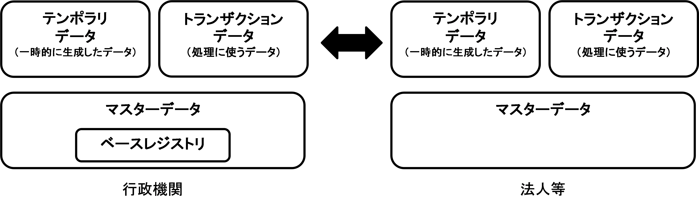
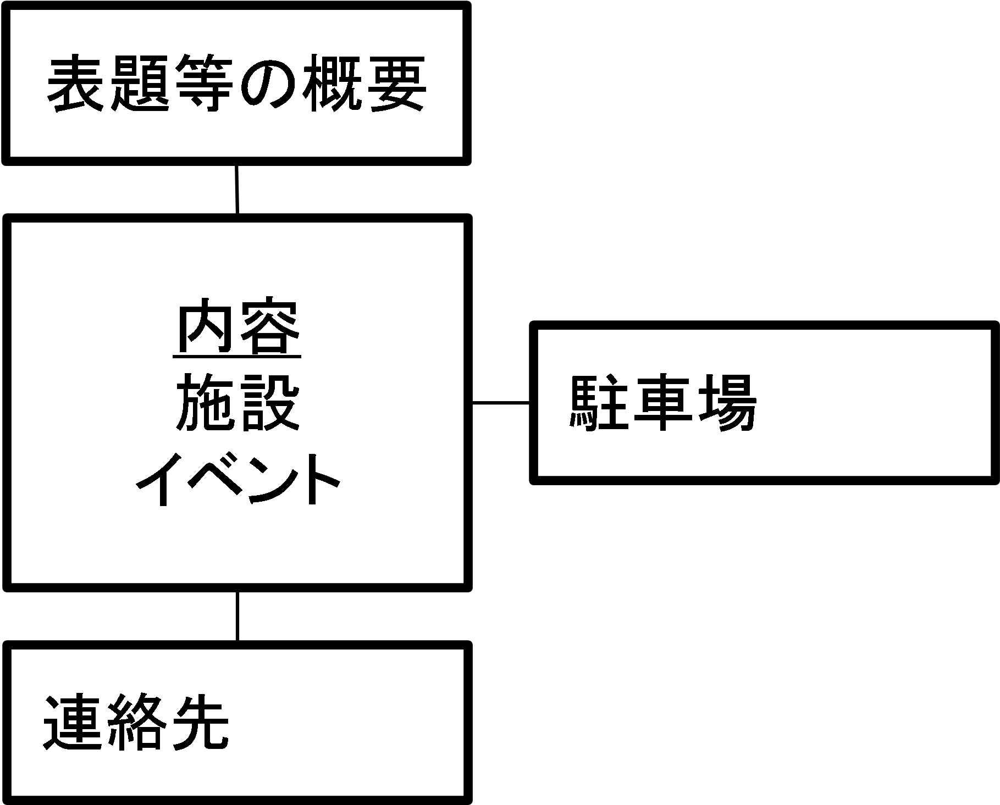
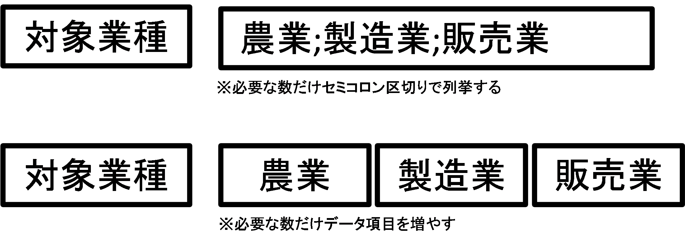
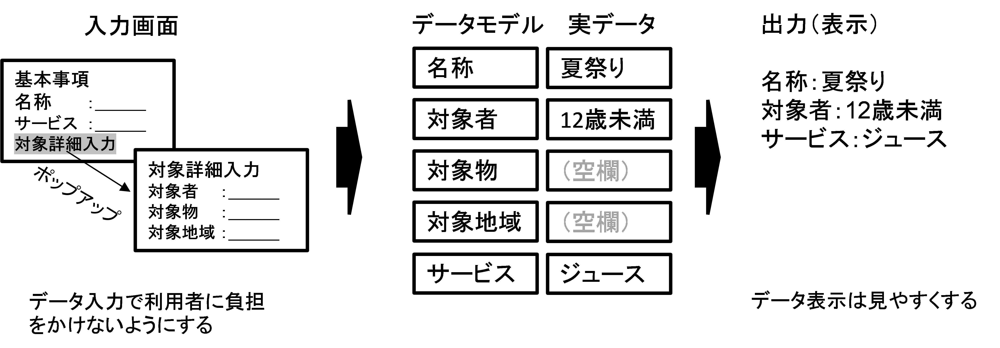

# マスターデータ等基本データ 導入実践ガイドブック <!-- omit in toc -->

デジタル社会推進実践ガイドブック DS-462

2022年（令和4年）3月31日

デジタル庁

-----
**[キーワード]**

マスターデータ、データ構造、データ項目、コード体系、データモデル、ベース・レジストリ

**[概要]**

マスターデータとは、社会や組織の情報基盤と呼べるもので、多様な情報の根幹となる基本的な情報のことです。本ガイドブックでは、基本的なマスターデータの説明や設計、導入の助けとなるデータモデルについて紹介します。

-----
## 改訂履歴 <!-- omit in toc -->

| 改訂年月日 | 改訂箇所 | 改訂内容 |
| ----------|----------|---------|
| 2022年3月31日 | 全体 | わかりやすくするための文書の小修正 |
| 2022年3月31日 | 全体 | 「テンプレート」を「データモデル」に変更 |
| 2022年3月31日 | P1、P3 | ベース・レジストリの記述の追加 |
| 2022年3月31日 | P10 | データ列挙の場合の区切り文字を「カンマ」から「セミコロン」に変更 |
| 2019年3月28日 | － | 初版決定  |
| 2017年8月1日  | － | β版公開  |

## 目次 <!-- omit in toc -->
- [1. 　はじめに](#1-はじめに)
  - [1.1. 　背景と目的](#11-背景と目的)
  - [1.2. 　適用対象](#12-適用対象)
  - [1.3. 　位置づけ](#13-位置づけ)
  - [1.4. 　用語](#14-用語)
- [2. 　基本事項](#2-基本事項)
  - [2.1. 　マスターデータの概要](#21-マスターデータの概要)
  - [2.2. 　マスターデータの意義](#22-マスターデータの意義)
  - [2.3. 　主なマスターデータ](#23-主なマスターデータ)
    - [2.3.1. 国全体で一元的に管理体系を整備するマスターデータ](#231-国全体で一元的に管理体系を整備するマスターデータ)
    - [2.3.2. 組織ごとに保有するマスターデータ](#232-組織ごとに保有するマスターデータ)
- [3. 　マスターデータの設計](#3-マスターデータの設計)
  - [3.1. 　マスターデータ設計の手順](#31-マスターデータ設計の手順)
    - [3.1.1. マスターデータにする候補の抽出](#311-マスターデータにする候補の抽出)
    - [3.1.2. 既存のマスターデータの調査](#312-既存のマスターデータの調査)
      - [3.1.2.1. データ項目、構造の検討](#3121-データ項目構造の検討)
      - [3.1.2.2. 既存のマスターデータとの関係性の整理](#3122-既存のマスターデータとの関係性の整理)
      - [3.1.2.3. ドキュメントの整備](#3123-ドキュメントの整備)
  - [3.2. 　標準や自組織等の保有する既存のマスターデータの活用と拡張](#32-標準や自組織等の保有する既存のマスターデータの活用と拡張)
    - [3.2.1. 紙のマスターデータの扱い](#321-紙のマスターデータの扱い)
    - [3.2.2. デジタル化されたマスターデータの扱い](#322-デジタル化されたマスターデータの扱い)
      - [3.2.2.1. データ項目の追加](#3221-データ項目の追加)
      - [3.2.2.2. データ項目の削除](#3222-データ項目の削除)
      - [3.2.2.3. データ形式や精度の変更](#3223-データ形式や精度の変更)
  - [3.3. 　データ項目と構造の設計](#33-データ項目と構造の設計)
    - [3.3.1. データ項目](#331-データ項目)
    - [3.3.2. 構造化](#332-構造化)
    - [3.3.3. 留意事項](#333-留意事項)
- [4. マスターデータの導入と運用](#4-マスターデータの導入と運用)
  - [4.1. 　データモデルの活用とレベルの考え方](#41-データモデルの活用とレベルの考え方)
    - [4.1.1. データ項目](#411-データ項目)
    - [4.1.2. 目標としてのレベルの活用](#412-目標としてのレベルの活用)
  - [4.2. 　データモデルを使ったマスターデータの整備と成長モデル](#42-データモデルを使ったマスターデータの整備と成長モデル)
    - [4.2.1. データモデルの選定](#421-データモデルの選定)
    - [4.2.2. 目標の設定](#422-目標の設定)
    - [4.2.3. 追加、省略項目の検討](#423-追加省略項目の検討)
    - [4.2.4. ドキュメントの整備](#424-ドキュメントの整備)
    - [4.2.5. データの整備](#425-データの整備)
  - [4.3. 　データモデルがない場合のマスターデータの整備と成長モデル](#43-データモデルがない場合のマスターデータの整備と成長モデル)
    - [4.3.1. 当該分野での主要データの収集](#431-当該分野での主要データの収集)
    - [4.3.2. 収集した主要データをデータ項目レベルでマッピング](#432-収集した主要データをデータ項目レベルでマッピング)
    - [4.3.3. データ項目の決定](#433-データ項目の決定)
    - [4.3.4. 目標設定](#434-目標設定)
  - [4.4. 　マスターデータの仕様と利用規約の提供](#44-マスターデータの仕様と利用規約の提供)
  - [4.5. 　マスターデータの変更手順](#45-マスターデータの変更手順)

-----
## 1. 　はじめに

### 1.1. 　背景と目的

各府省では、「電子行政分野におけるオープンな利用環境整備に向けたアクションプラン」（平成26年4月25日各府省情報統括責任者（CIO）連絡会議決定）に基づき、自府省内の諸活動に関する透明性を高め、開かれた行政の実現を図ってきました。
また、内閣官房では、行政情報を有効活用し、より利便性の高い公共サービスの実現に向けて各種ガイドの整備と普及を推進してきました。
平成28年12月に官民データ活用推進基本法（平成28年法律第103号）が制定され、世界最先端デジタル国家創造宣言・官民データ活用推進基本計画が平成30年6月に閣議決定されたことから、今後は、地方公共団体も含め、データ流通環境の整備が加速されることになります。データの活用や流通にはデータの標準などが重要になることから、データに関するガイド類の整備が求められているところです。
マスターデータ等基本データ（以下「マスターデータ」という。）とは、社会や組織の活動時の情報基盤と呼べるもので、多様な情報の根幹となる基本情報を集積したデータのことです。

現在、行政機関は多くのマスターデータを保有しています。これらのデータは、政府共通のマスターデータとして定義されていなかったり、類似するものが複数あったりすることにより、業務連携が煩雑になるとともにシステム連携時に無駄なコストが発生する等の様々な問題点が指摘されています。
その原因のひとつとして、マスターデータに関する考え方が政府内で整理されていないことや、マスターデータ作成時に手引きとする文書がなかったことが挙げられます。
令和2年12月にデータ戦略タスクフォース第一次とりまとめが行われ、マスターデータのなかでも、特に行政機関が登録をして管理するベース・レジストリの整備の推進を明記するとともにロードマップが策定されました。さらに、令和3年9月に施行されたデジタル社会形成基本法で「公的基礎情報データベースの整備」が記載されるなど、データ整備が急速に進められようとしています。

本ガイドブックは、行政機関においてマスターデータの作成、変更及び利用に携わる行政職員に向けて、適切な設計方法や運用手順を示すことを目的として策定しました。
なお、データ管理には様々な方式があることから、本ガイドブックは、遵守を必須とするものではなく、データを効果的に活用するために参照し、効率的に作業することを目的としたものとして整理しました。
また、公開後も、利用者のご意見をいただきつつ、継続的な改定を行ってまいります。

### 1.2. 　適用対象

政府情報システムを対象とします。

### 1.3. 　位置づけ

本ガイドブックは、標準ガイドラインの一つとして位置づけられます。

### 1.4. 　用語

本ガイドブックにおいて使用する用語は、本ガイドブックに別段の定めがある場合を除くほか、標準ガイドライン群用語集の例によります。

-----
## 2. 　基本事項

### 2.1. 　マスターデータの概要

マスターデータとは、データを利用してサービスを実現するときに必要となる基本情報のことです。複数のサービスから参照されるシステムの基幹情報になります。

例えば、目的に合わせた基本データ集として整理された台帳のようなものや、個人、組織、事業所、場所等の基本情報をリスト化したものが挙げられます。また、利用者、サービス種類、料金等の基本情報もマスターデータとして管理されています。一般に、このようなマスターデータは、共通のコード体系やデータ項目定義、データ構造を持ちます。

その中でも住民基本台帳、登記簿等、行政機関に登録され正確性を確保して管理されているデータは、マスターデータの中でもベース・レジストリとしての指定が行われています。ベース・レジストリのデータは信頼性が高く手続き時にワンスオンリーで活用される元データになったり、利用範囲の広いデータは社会全体の基盤データとなったりし、個人情報等の安全性を確保したうえで活用されていきます。デジタル庁がベース・レジストリとして指定して、重点的に再利用をしていくベース・レジストリだけでなく、各府省や地方公共団体が目的別のベース・レジストリと指定し、重点的に整備を進めるデータがあります。

<figure>

<figcaption>
図 1　マスターデータと他のデータとの関係性
</figcaption>
</figure>

### 2.2. 　マスターデータの意義

従来は、組織ごとに情報を管理していました。異なる組織間で情報交換するときに、管理の差異（コードやデータ構造等）から情報交換に齟齬が起きていました。これに対して、各組織間で共通のコード体系、データ項目、データ構造とし、相互運用可能な仕組みを導入することで、組織を横断しても共通の理解の下で業務を実行することが可能になります。
また、マスターデータを共有することで、情報を重複して収集、管理することがなくなり、情報の一元性及び一貫性の確保が実現することができるとともにメンテナンス性が向上します。

デジタル・ガバメント推進のためには、一度提出した書類を再度提出しないワンスオンリーの仕組みを整備する必要があります。その要となるのが、データを相互運用できるようにするためのマスターデータの管理です。さらに、国と地方公共団体、民間のデータを融合して活用するためにもマスター的なデータの管理は要となる要素です。
また、行政機関の基本データは社会の基盤的なデータが多いことから、オープンデータの基盤としても重要です。

表 1　社会全体でマスターデータを活用することによる期待効果の例

| 主体 | 効果例 |
|------|-------|
| 行政機関 | 情報品質／精度が上がる。 |
| 行政機関 | 各種情報の分析や活用が容易になり、政策立案を高度化することができる。 |
| 行政機関 | システムの設計やデータ変換のコストの低減ができる。 |
| 地方公共団体 | 情報品質／精度が上がる。 |
| 地方公共団体 | 各種情報の分析や活用が容易になり、政策立案を高度化することができる。 |
| 地方公共団体 | システムの設計やデータ変換のコストの低減ができる。 |
| 民間団体 | サービスをワンスオンリーで利用できる。 |
| 民間団体 | 各種情報の分析や活用が容易になり、企業活動を高度化することができる。 |
| 民間団体 | システムの設計やデータ変換のコストの低減ができる。 |
| 個人 | 情報の収集などのコストが下がる。 |
| 個人 | サービスをワンストップで利用できる。 |
| 個人 | 必要な情報を的確に識別・判別できる。 |

### 2.3. 　主なマスターデータ

行政機関が持つマスターデータには「国全体で一元的に管理体系を整備するマスターデータ」「組織ごとに保有するマスターデータ」があります。

#### 2.3.1. 国全体で一元的に管理体系を整備するマスターデータ

国が主体的にデータ管理するものと、国が設計を担い地方公共団体がデータ管理するものがあります。ここには、ベース・レジストリも含まれます。

表 2　国全体で一元的に管理体系を整備するマスターデータの例

| マスターデータ | 所管府省 | 概　要 |
|---------------|---------|-------|
| 戸籍 | 法務省 | 家族関係の基本データ |
| 戸籍 | 法務省 | 地方公共団体が戸籍データを管理 |
| 住民基本台帳 | 総務省 | 住民に関する基本データ |
| 住民基本台帳 | 総務省 | 地方公共団体が住民基本台帳データを管理 |
| 不動産登記 | 法務省 | 不動産に関する基本データ |
| 不動産登記 | 法務省 | 国が管理 |
| 法人登記 | 法務省 | 法人に関する基本データ |
| 法人登記 | 法務省 | 国が管理 |

#### 2.3.2. 組織ごとに保有するマスターデータ

組織内で業務を実行する上で必要な基本情報であり、組織内やサービス内で共有されます。個人情報保護や秘密保持の観点から、他組織等と外部連携できないデータも存在します。

表 3　組織ごとに保有するマスターデータの例

| マスターデータ | 概　要 |
|---------------|-------|
| 利用者マスター | サービス利用者の基本情報をサービスごとに管理する。 |
| 利用者マスター | 企業ではサービス横断のマスターを整備する場合もある。 |
| 職員マスター | 職員の氏名や住所などを管理する。 |
| サービスマスター | 関連団体などの限定された範囲で共有されることがある。 |
| サービスマスター | 行政サービスの基本情報を管理する。 |
| 各種台帳 | 各地方公共団体が多くの基本情報を台帳として管理する。 |
| 各種台帳 | 紙で保有している場合も多い。 |

-----
## 3. 　マスターデータの設計　

データは、従来、組織やシステム内で活用することを前提に独自に設計されることが多かったのですが、組織間の情報連携が進むにつれて、将来的な活用を踏まえて設計することが重要になってきています。また、マスターデータを軸に組織内の情報が整理されていくことから、マスターデータ自体の拡張性、長期的な一貫性及び安定性の確保が必要です。さらに、マスターデータには正確性や正当性が求められることから、データの項目や構造等の定義だけではなくデータの品質、信頼性も含んだ利活用を想定した総合的な枠組みや監査も含んだ維持管理体制の整備を図っていく必要があります。共通語彙基盤を活用することで、汎用性の高いデータの設計が可能です（https://imi.go.jp/goi/）。

### 3.1. 　マスターデータ設計の手順

#### 3.1.1. マスターデータにする候補の抽出

業務や機能の整理から必要情報を抽出し、複数機能から参照されるマスターデータにすべきデータの候補を明確にします。

#### 3.1.2. 既存のマスターデータの調査

既存のマスターデータ（データモデルを含む。）に、抽出しようとしているデータに類似するものが存在しないか、国内外の各種標準や関連団体等を調査します。特に、政府がベース・レジストリを整備済みの場合は、相互運用性を確保するため、その内容にできる限り合わせていきます。

##### 3.1.2.1. データ項目、構造の検討

* 既存のマスターデータに類似するものがある場合
  以下の２つの対処が考えられます。
   * 目的に合わせて拡張してデータ項目、構造を決定
   * 参考にして、新規にデータ項目、構造を決定
* 既存のマスターデータに類似するものがない場合
   * 新規にデータ項目、構造を決定

##### 3.1.2.2. 既存のマスターデータとの関係性の整理

既に普及している、主要なデータセットとのデータ項目間の関係性（同一、包含、一部等）を整理します。

##### 3.1.2.3. ドキュメントの整備

他組織等で活用できるように仕様書などのドキュメントを整備します。

### 3.2. 　標準や自組織等の保有する既存のマスターデータの活用と拡張

各組織では、従来からマスターデータとなる情報を保有している場合が多く、その情報はデジタルデータだけではなく紙の台帳として存在していることも少なくありません。業務の継承性の観点から、これらの既存のマスターデータを活用することを考える必要があります。

そのため、紙の場合にはデジタル化やメタデータ付与、デジタルデータの場合にはデータの変換やマッピングを行い、既存のマスターデータを活用できる形に拡張します。

#### 3.2.1. 紙のマスターデータの扱い

紙のデータの管理は、スキャニングでデジタル化して検索用にタイトル等のメタデータを付与する方法（インデックス化）に加えてデータ全体をデジタル化する方法があります。

データの分量及びその利用目的を勘案して決める必要があります。

#### 3.2.2. デジタル化されたマスターデータの扱い

現在の社会情勢に合わせると、グローバル化に合わせた英語データの付与や外字利用の停止等を考える必要があります。また、既存のデータではデータ項目が不足する又は過剰となる場合があります。その場合には、データ項目の拡張や削除等を行う必要があります。

また、既存データの中にはデータの精度など、品質的に問題がある場合もあります。その場合の扱いも整理する必要があります。

##### 3.2.2.1. データ項目の追加

既存データでは、今後の使用目的に対してデータ項目が不足していてデータ項目を追加する場合、表示画面、データベースやAPI等に影響がある場合もあるので、影響範囲を見極める必要があります。また、データ項目を追加した時に、過去に蓄積されたデータにも追加項目のデータを追加するか、今後のデータにだけデータ項目の内容を追加するのか、運用方針を検討する必要があります。

##### 3.2.2.2. データ項目の削除

既存のデータにあるが事業終了などにより、使用されなくなったデータ項目に関しては、データ項目の削除を検討します。

ただし、マスターデータの変更は多くのアプリケーションやデータベースに影響を与えることから、データ項目の削除はしない場合もあります。その場合にも、入力の省略を可能にする等により、運用上で事務の効率化を図ることを検討します。

##### 3.2.2.3. データ形式や精度の変更

技術の向上や業務の必要性により、有効桁数などのデータの形式や精度を変更する場合があります。

データの形式や精度が混在しないように、変更を行う場合には、変更日付を明記し、過去のデータとの変更時点を明確にする必要があります。

また、観測センサー等で旧型センサーも併用する等により、形式や精度の違うデータが混在する場合があります。その場合には、形式や精度の違いが明確になるようフラグを付ける等の工夫をすることで、データの活用を行いやすくします。

### 3.3. 　データ項目と構造の設計

マスターデータは、データ項目とその組み合わせによるデータ構造によって構成します。データ項目は、その項目名に関する意味の定義、記述形式を定義する必要があります。データ構造は、「事業者」や「利用者」などマスターデータとする対象ごとにデータ項目名に矛盾が起きないよう項目を定める必要があります。「申込み」や「交通機関のアクセス情報」等、機能ごとにデータ項目を組合わせて標準化（モジュール化）するとともに、メンテナンス性を良くする必要があります。
マスターデータのデータ項目とデータ構造の設計では、最初に、多くのシステムで使われる等の主要な既存のマスターデータ又は業界等で普及しているデータのマッピングを行います。

そこで共通的なデータ項目やデータ構造を分析し整理します。ただし、多くのデータは構造化がなされておらず、データ項目の羅列になっている場合が多いです。連絡先等、類似や関連のデータ項目毎にデータ項目をまとめて並べることにより、データ項目の不足などが見つかる場合もあります。
他分野との相互運用性の確保などを考えた場合には、モジュール化が進んでいる共通語彙基盤をベースにして各データ項目を当てはめていくと、効率的で洗練されたデータ構造を作りやすくなります。

#### 3.3.1. データ項目

データ項目は、分かりやすいデータ項目名称にするとともに、そのデータの意味の定義、記述形式を明確にする必要があります。

例えば、企業の住所に関するデータ項目を取扱う際、単に「住所」と記載されているときには、それが「本社」なのか「支社」なのかが不明確な場合があります。都道府県から記載するのか、番地をハイフンで記述するのか等、住所の構文として不明確な場合もあります。また、いつ時点で登録された住所であるか等、最新性が担保できない場合もあります。マスターデータとして求められる品質を担保するため、マスターデータを導入する際には、データ項目定義と記述ルールを明確にして、表記の揺らぎを防止する必要があります。

また、データ項目によっては、コードを引用する場合があります。その場合には、汎用性の高い標準的なコードを優先的に採用すべきです。独自のコードを使っている場合には、コードを説明したページを公開するとともに、業界標準的なコードがある場合には、そのコード表とのマッピングを公開することが望ましいです。コード表やコード変換表の公開は、CSV等の機械可読な形式で公開を行います。

データベース内で使うデータ項目名も分かりやすい名称を使用します。名詞を基本とし、複数形で記載することを推奨します。また、単語間をアンダースコアで繋げるスネイクケース（例：city_libraries）を推奨します。適切でない英語名をデータ項目名に付与することやデータ項目名の意味定義が曖昧な場合、他のサービスとの連携時に誤解を生み、データ不正や不備が発生する可能性があります。

#### 3.3.2. 構造化

マスターデータは、データ項目とその組み合わせによって構成されます（構造化されたデータ）。構造化されたデータは、用途に応じてデータ項目を組み合わせて利用できます（モジュール化）。

例えば「連絡先」は、「名称」「電話番号」「住所」等といったデータ項目の組み合わせたモジュールで構成できます。

<figure>

<figcaption>
図 2　データの構造化の例
</figcaption>
</figure>

ただし、データ項目を細分化すると、作業が多いのではないかとデータ作成者に負担感を与えることがあります。導入当初は「連絡先」という1つのデータ項目での自由記述から始めて、データ管理の習熟度に応じて細分化を図っていく等の工夫が必要です。

「連絡先」を1つのデータ項目で記述する場合にも、自由記述欄に［電話番号］のようにタグをつけて記述する等、機械処理が容易な形式で記述する工夫をします。このようにタグが付いていると、各項目をデータ処理によって変換（分離）することが容易にできます。

|連絡先| | |
|------|-|-|
| [名称] ○○省○○課 | [住所] ○○県○○市○○○－○－○ | [電話番号] (09)9999-9999 |

↓構造化

|連絡先|||
|------|-----|----------|
| 名称 | 住所 | 電話番号 |
| ○○省○○課 | ○○県○○市○○○－○－○ | (09)9999-9999 |

図 ３　構造化の例

データの構造化に当たっては、共通語彙基盤(https://imi.go.jp/goi/)が参考になります。

データ項目内に同種の内容を複数示す場合、複数の項目を分け、個別の項目として記述するか、一つのデータ項目内に列挙するかを検討することになります。列挙する場合は、セミコロン区切りで列挙します。データベースの構造によっては、1つのデータ項目内に複数の項目列挙をせずに、同じデータ項目を複数設定できる場合もあります。データベースの構造に合わせて設計をしていきます。

<figure>

<figcaption>
図 4　複数データの管理方法
</figcaption>
</figure>

こうして設計したデータ構造は、データ設計の標準的な記述手法であるクラス図に整理することを推奨します。クラス図を使うことで、内部教育や専門家とのコミュニケーションが円滑にできるようになり、さらに将来の拡張も容易になります。

#### 3.3.3. 留意事項

マスターデータで使う文字は、一般的な端末で操作可能なようにJIS X 0213と呼ばれるJISの第一水準から第四水準までの範囲を使います。その範囲外の文字は、ヨミガナで入力したり、範囲内の文字に縮退（代替）することで、誰もが使用できるデータで格納します。また、文字の符号化方式はUTF8を推奨します。

-----
## 4. マスターデータの導入と運用

マスターデータのデータ項目を設計する時に専門知識が不足すると、データ項目の洗い出しや分割が十分にできない場合があります。そのような場合には、データモデルを使うことで高品質なマスターデータを設計することができます。データモデルの選定は、schema.org等の標準的なデータを使ったり、主要サービスのデータ構造を参照したり、委員会で精査を行う等、中立的な検討を心掛けることが重要です。
また、マスターデータを設計すると項目が多くなりがちです。入力者の負担を軽くするためには、「必須データ項目」「推奨データ項目」「任意データ項目」を設定することが望ましいです。また、全ての項目を画面に表示するのではなく、任意項目の入力は展開した子画面で行うとか、空白なデータ項目は表示や印字を行いとか、ユーザビリティ上の工夫をする必要があります。

<figure>

<figcaption>
図 5　データ入出力での工夫
</figcaption>
</figure>

また、最初から全てのデータ項目を活用するのではなく、入力者の作業負荷を考慮し、必須以外のレベルについては任意入力とするような、段階的な導入を推奨します。

### 4.1. 　データモデルの活用とレベルの考え方

データ項目が多すぎると入力者の協力が得られず、少なすぎるとマスター的なデータとしての効果を十分に発揮することができません。入力者の作業負担と利用者のニーズのバランスを勘案し、導入することが重要です。また、入力者の作業負担と利用者のニーズのバランスは、サービスを提供していく中で変化していきます。導入レベルを活用することで、計画的にマスターデータの充実を図ることが可能になります。

#### 4.1.1. データ項目

以下に、マスターデータのレベル定義を示します。

表 ４　レベルの定義

|  | レベル感 | 説明 |
|--|---------|------|
| レベル１（Ｌ１） | 住民ガイドレベル（サマリーレベル） | ほとんどの地方公共団体等が情報を出しているレベル |
| レベル２（Ｌ２） | 基本ニーズレベル | 多くの利用者が最低限ここまで公表してほしいというレベル |
| レベル３（Ｌ３） | 目標サービスレベル | 多くの利用者が公表してほしいというレベル |
| レベル４（Ｌ４） | 理想サービスレベル | 全ての利用者が公表してほしいというレベル |
| レベル５（Ｌ５） | データベースレベル | データベース用にデータ項目が詳細に定義されているレベル |

ここでのレベルはマスターデータの設計における定義であり、データの登録数や空欄率などの運用上のレベルは、別途検討する必要があります。
以下のイベントデータの例の様に、各データ項目は目標レベルを詳細に設定します。

表 5　データ構造変換の例

| データ項目     | Ｌ１ | Ｌ２ | Ｌ３ | Ｌ４ | Ｌ５ |
|----------------|------|------|------|------|------|
| イベントid     |      |      |      |      | ●    |
| イベント名     | ●    | ●    | ●    | ●    | ●    |
| サブタイトル   |      | ○    | ○    | ○    | ○    |
| 要約           | ○    | ○    | ○    | ○    | ○    |
| 主催者         | ●    | ●    | ●    | ●    | ●    |
| 連絡先         | ●    | ●    |      |      |      |
| 電話番号       |      |      | ◎    | ◎    | ◎    |
| メールアドレス |      |      | ○    | ○    | ○    |
| 開催場所住所   | ●    | ●    | ●    | ●    | ●    |
| 緯度           |      |      | ○    | ○    | ○    |
| 経度           |      |      | ○    | ○    | ○    |
| アクセス       |      |      | ○    |      |      |
| 　最寄駅       |      |      |      | ○    | ○    |
| 駐車場         |      | ○    | ○    |      |      |
| 　普通車台数   |      |      |      | ○    | ○    |
| バス台数       |      |      |      |      | ○    |

凡例
●：必須
◎：推奨
○：任意

#### 4.1.2. 目標としてのレベルの活用

レベルは組織、対象データごとに検討し、現状把握と目標設定に使用することで段階的に導入することが可能になります。

表 6　データ活用の目標レベル設定の例

|                      | ２０１７ | ２０１８ | ２０２０ | ２０２２ |
|----------------------|----------|----------|----------|----------|
| 年間観光イベント予定 | Ｌ１     | Ｌ２     | Ｌ３     |          |
| 観光施設データ       | Ｌ１     | Ｌ２     | Ｌ３     |          |
| 年間産業イベント予定 | Ｌ１     |          |          | Ｌ３     |
| 地方公共団体広報紙   | Ｌ１     | Ｌ３     |          |          |

### 4.2. 　データモデルを使ったマスターデータの整備と成長モデル

マスターデータのデータモデルを元に、自サービスのマスターデータを作る場合には、自組織の目的やレベルに合わせてデータ内容をカスタマイズする必要があります。

#### 4.2.1. データモデルの選定

目的に合わせ、マスターデータのデータモデルを選定します。

#### 4.2.2. 目標の設定

データモデルと自組織が保有する既存のデータの間での項目の違いなどから、自組織の現状のレベルを把握します。その上で、目指すべき目標レベルと時期を設定します。また、必要な場合、中間目標の設定も併せて行います。

#### 4.2.3. 追加、省略項目の検討

データモデルのデータ項目を確認し、使用するデータ項目、使用しないデータ項目を決めます。また、必須入力項目についても検討します。この時に連絡先のような基本ブロックもどこまで詳細化するかを決定します。既存のデータとの整合性を重視する場合には、「3.3データ項目と構造の設計」で前述のように連絡先として1つのデータ項目の中に住所や電話番号を自由に記述する場合もあります。その場合にはタグ付け等の記述ルールを設けて、機械可読化することも検討します。

#### 4.2.4. ドキュメントの整備

整備するマスターデータの仕様と整備計画をドキュメントとして整備します。

#### 4.2.5. データの整備

データの整備を行います。導入当初は新しい業務であり効果も発現していないため、埋まらないデータ項目が多いと思われます。充足率を上げるために、データ入力がメリットを生むような成果をコンスタントに出していく必要があります。データは集積度が重要であることから、類似のデータを扱い行政機関や民間団体との協力関係を強化していくことも重要です。

### 4.3. 　データモデルがない場合のマスターデータの整備と成長モデル

マスターデータを作ろうとしたときにデータモデルがない場合には、既存のデータのデータ項目やデータ構造を参考にしながら、データ項目や構造の選定をして整備を進めることとなります。その場合にも、将来の相互運用性を高めるために共通語彙基盤で使われる「連絡先」等の基本ブロックを活用することが望ましいです。

また、「博物館」というマスターデータを作る場合、「施設」＋「博物館固有情報」と組み合わせることで、開館時間等の「施設」に該当する部分のデータが交換可能になり、他の観光施設データやイベントデータとも組み合わせやすくなります。

#### 4.3.1. 当該分野での主要データの収集

マスターデータの参考にするため、国内外の当該分野で普及しているデータを複数選定します。

#### 4.3.2. 収集した主要データをデータ項目レベルでマッピング

主要データのデータ項目を縦軸、主要データを横軸として表に書き出し、項目の比較を行った上で、全てのデータ項目で使っているデータ項目や主要なデータ項目をマークします。また、データ項目を「日時」としている場合と「日付」「時間」としている場合等、記述の粒度が異なる場合があります。そのような場合には、データの変換が必要になるため、データ間の対応関係が分かるように整理します。

#### 4.3.3. データ項目の決定

マスターデータの目的に照らして本当に必要かどうかという観点から、表にあるデータ項目を選択していきます。慣習的にデータ項目として残っていて使われないデータ等を見直します。

この作業を行うと、主要データに含まれる全てのデータ項目を含んだ、粒度の細かい巨大なデータセットができてしまうことがよくあります。過度にデータ項目を細かくするのではなく、既存主要データを参考にしながらレベルを設定し、段階的な導入ができるようにしていく工夫が必要です。

#### 4.3.4. 目標設定

データ項目が決定した後は、「4.2 データモデルを使ったマスターデータの整備と成長モデル」の4.2.4. ドキュメントの整備以降を同様に行います。

### 4.4. 　マスターデータの仕様と利用規約の提供

マスターデータがオープンデータである場合には、仕様を公開します。仕様に加えてサンプルデータも記載すると、利用者から分かりやすくなります。また、データの利用規約も合わせて公開します。行政機関の場合には、政府標準利用規約の活用を推奨します。

### 4.5. 　マスターデータの変更手順

マスターデータは変更した時の影響範囲が大きいことから、十分に時間をかけて検討する必要があります。特に、外部と連携をしているマスターデータに関しては、連携先に早期に変更予定の連絡を実施し、オープンデータにしているマスターデータに関しても、できるだけ早期に変更予定を公表します。
