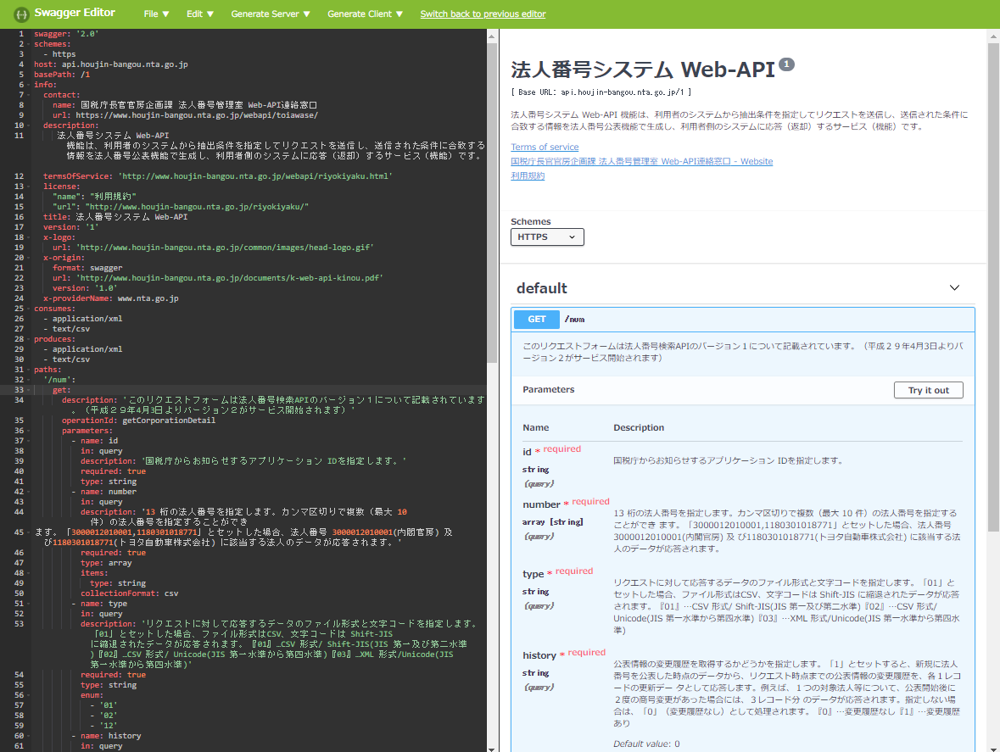
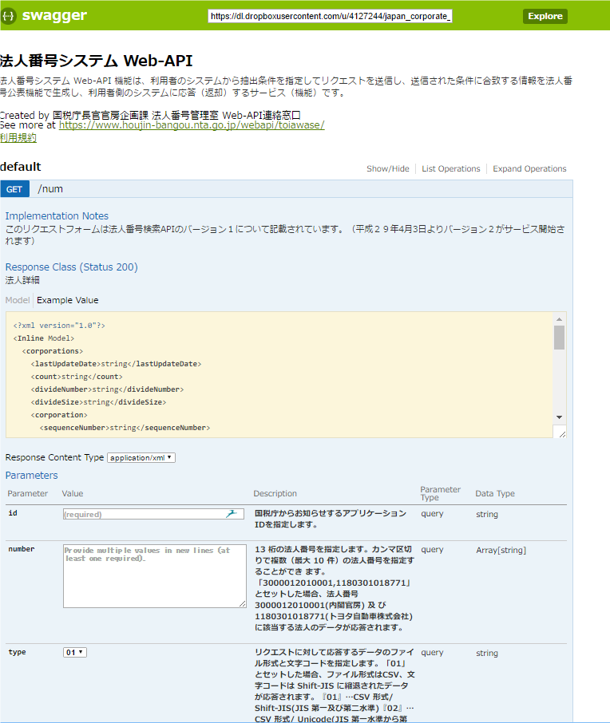
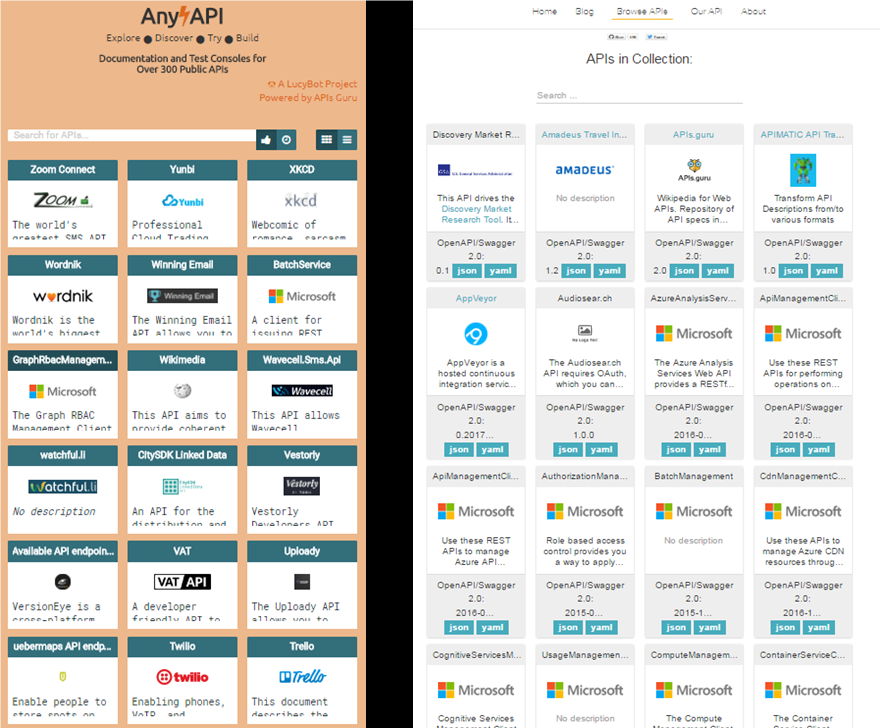

# APIテクニカルガイドブック <!-- omit in toc -->

デジタル社会推進実践ガイドブック DS-464-2

2022年（令和4年）8月10日

デジタル庁

-----
**[キーワード]**

行政情報の流通・活用、APIエコノミー、データフォーマット、国際標準、デファクト標準、相互運用性

**[概要]**

データは公開もさることながら、活用してこそ価値を生みます。そのためには活用しやすい形式でデータが提供される必要があり、そのアクセスインタフェースとしてAPIが普及してきています。政府機関においてもAPIによるデータ提供事例が増えつつありますが、その設計・運用は各府省の個々の指針によって行われているのが現状です。
本ガイドブックでは、APIの開発に当たり技術的に考慮すべき事項や留意点を記しました。

-----
## 改訂履歴 <!-- omit in toc -->

| 改訂年月日 | 改訂箇所 | 改訂内容 |
|-----------|---------|----------|
| 2022年8月10日 |  | 政府相互運用性フレームワークに統合、改訂 |
| 2019年3月28日 | - | 初版決定 |
| 2017年8月1日 | - | β版公開 |

-----
## 目次 <!-- omit in toc -->
- [1. 　はじめに](#1-はじめに)
  - [1.1. 　背景と目的](#11-背景と目的)
  - [1.2. 　適用対象](#12-適用対象)
  - [1.3. 　位置づけ](#13-位置づけ)
  - [1.4. 　用語](#14-用語)
- [2. 　API設計時の留意事項](#2-api設計時の留意事項)
  - [2.1. 　URI設計及びリクエスト](#21-uri設計及びリクエスト)
    - [2.1.1. 　URI設計のポイント（WebAPI）](#211-uri設計のポイントwebapi)
    - [2.1.2. 　リソース操作のメソッド（WebAPI）](#212-リソース操作のメソッドwebapi)
    - [2.1.3. 　パラメータの設計（WebAPI）](#213-パラメータの設計webapi)
    - [2.1.4. 　データ形式について（WebAPI）](#214-データ形式についてwebapi)
  - [2.2. 　レスポンス](#22-レスポンス)
    - [2.2.1. 　正常レスポンス（WebAPI）](#221-正常レスポンスwebapi)
    - [2.2.2. 　エラーレスポンス（WebAPI）](#222-エラーレスポンスwebapi)
  - [2.3. 　個別データの各パラメータについて](#23-個別データの各パラメータについて)
    - [2.3.1. 　データ項目名](#231-データ項目名)
    - [2.3.2. 　入力規約](#232-入力規約)
    - [2.3.3. 　個別記述と列挙](#233-個別記述と列挙)
    - [2.3.4. 　コード（分類体系）](#234-コード分類体系)
    - [2.3.5. 　構造化](#235-構造化)
  - [2.4. 　その他](#24-その他)
    - [2.4.1. 　セキュリティ](#241-セキュリティ)
      - [2.4.1.1. APIにおけるセキュリティ対策（WebAPI）](#2411-apiにおけるセキュリティ対策webapi)
      - [2.4.1.2. その他代表的なセキュリティ対策](#2412-その他代表的なセキュリティ対策)
    - [2.4.2. 　API呼び出し先と呼び出し元の処理における整合性担保（WebAPI）](#242-api呼び出し先と呼び出し元の処理における整合性担保webapi)
- [3. 　API運用時の留意事項](#3-api運用時の留意事項)
- [4. 　API開発の進め方](#4-api開発の進め方)
  - [4.1. 　API提供の告知](#41-api提供の告知)
  - [4.2. 　オープン規格を活用したAPIの開発（WebAPI）](#42-オープン規格を活用したapiの開発webapi)
  - [4.3. 　ドキュメントの公開](#43-ドキュメントの公開)
  - [4.4. 　テストフォーム及びテスト環境](#44-テストフォーム及びテスト環境)
  - [4.5. 　サンプルプログラムの提供](#45-サンプルプログラムの提供)
  - [4.6. 　開発者コミュニティ](#46-開発者コミュニティ)
  - [4.7. 　FAQ](#47-faq)
- [5. 　参考情報](#5-参考情報)
  - [5.1. 　URIの例](#51-uriの例)
  - [5.2. 　レスポンスサンプルデータ（WebAPI）](#52-レスポンスサンプルデータwebapi)
  - [5.3. 　ドキュメント「API概要情報」の例](#53-ドキュメントapi概要情報の例)
- [6. 参考文献一覧](#6-参考文献一覧)

-----
## 1. 　はじめに

### 1.1. 　背景と目的

各府省では、「電子行政分野におけるオープンな利用環境整備に向けたアクションプラン」（平成26年4月25日各府省情報統括責任者（CIO）連絡会議決定）に基づき、自府省内の諸活動に関する透明性を高め、開かれた行政の実現を図ってきました。

また、内閣官房では、国民、企業等の社会・経済活動に有益な情報資源の充実に資するため、行政情報を有効活用し、より利便性の高い公共サービスの実現に向けて各種ガイドの整備と普及を推進してきました。

平成28年12月に官民データ活用推進基本法（平成28年法律第103号）が制定され、世界最先端デジタル国家創造宣言・官民データ活用推進基本計画が平成30年6月に閣議決定されたことから、今後は、地方公共団体も含め、データ流通環境の整備が加速されることになります。データの活用や流通にはデータの標準などが重要になることから、データに関するガイド類の整備が必要になってきています。

データの提供は、公開することよりも、そのデータが活用され、効果を上げることに意義があります。活用を促進するためには、活用しやすい方式でデータを提供することが必要です。その観点から、Application Programming Interface（以下「API」という。）を利用したデータ提供が増えてきています。我が国の政府機関においても、徐々にAPIによるデータ提供事例が増えてきているところですが、その提供方法等に関しては、各府省が個別に検討しているという状況です。

API導入実践ガイドブック及び本ガイドブックでは、API利用者の利便性を向上し、利用を促進するため、各府省がWebサイトでAPIを提供するに当たり、共通化すべき事項や留意点などについて説明します。

API導入実践ガイドブックでは、主に各府省担当者向けにAPIの基本的内容（概要や意義など）を示し、本ガイドブックでは、主にAPI構築担当者向けにAPIを設計・運用するに当たって考慮すべき、具体的な取組事項を示します。各府省担当者も参考として、本ガイドブックに目を通し、API構築担当者の作業の概要を把握することで、作業管理や担当者とのコミュニケーションに役立つことが期待されます。API導入実践ガイドブック、本ガイドブックの順に参照することを推奨します。

本ガイドブック及びAPI導入実践ガイドブックは、インターネットを通じて提供するWebAPIが主な対象となりますが、センサー機器、IoT等、データを提供するその他全てのAPIにおいても参考となる内容です。

なお、本ガイドブックは、遵守を求めるものではなく、データを効果的に活用するために参照し、効率的に作業することを目的としたものとして整理しました。

また、公開後も利用者のご意見を頂きつつ、継続的な改定を行ってまいります。

また、本ガイドブックの理解を助けるために、APIに係る関係者の定義を下表に示します。

表 １　本ガイドブックにおける、APIに係る関係者の定義

| APIに係る関係者 | 定義 |
|-----------------|-----|
| 各府省担当者    | 各府省でAPIの開発・運用担当となっている行政職員 |
| API構築担当者   | 各府省担当者から受託して、APIの開発・運用を行っている民間事業者等 |
| API利用者       | APIを用いて各種サービス等の開発・運用を行っている者 |
| サービス利用者  | APIを用いた各種サービス等を利用している者 |

### 1.2. 　適用対象

APIを提供する政府情報システムを対象とします。地方公共団体や民間の情報システムにおいては、政府情報システムとAPI連携する際の参考としてください。

### 1.3. 　位置づけ

本ガイドブックは、標準ガイドライン群の一つとして位置づけられます。

### 1.4. 　用語

本ガイドブックにおいて使用する用語は、本ガイドブックに別段の定めがある場合を除くほか、標準ガイドライン群用語集の例によります。

-----
## 2. 　API設計時の留意事項

WebAPIを設計する際は、RESTに基づいて設計することを推奨します。本ガイドブックにおいてRESTは、HTTPプロトコルに基づいて、URIを指定しリソースを取得する設計様式を指します。ただし、厳密な適用を必須とするものではありません。

### 2.1. 　URI設計及びリクエスト

#### 2.1.1. 　URI設計のポイント（WebAPI）

以下のポイントを考慮して設計することを推奨します。

なお、以降で示すURIについては、「５　参考情報」に参考例を示します。

* 動詞ではなく名詞を用い、複数形とする。
*  抽象的な名詞は避け、API利用者がリソースの内容を把握できる単語を用いる。
* キャメルケース（区切りの文字（単語の頭文字）だけを大文字で示す表記法）ではなく、スネイクケース（単語間をアンダースコアで繋げる表記法）を推奨する。
  * 例：https://api.example.go.jp/v1/city_libraries
    * ※White House Web API Standardsを参考に作成

* APIのバージョンをURIに含める。バージョン番号は「v」+「整数」(v1、v2等)で表記し、バージョン番号を小数にしないこととする。
* ベースURIにAPI提供を表す「api」という単語を含める。apiサブドメインを推奨とする。
* リソースの操作はURIでなくHTTPメソッド（GET（データ取得）、POST （新規登録）、PUT（更新）、DELETE（削除））で表す。
* URIの階層が深くなる場合には、パラメータで指定する。
* URI設計は、RFC 6570「URI Template」に示されるURI Templateで指定できる形式とする。
  * 例：https://api.example.go.jp/v1/magazines/{id}.{format}
  * 例:https://api.example.go.jp/v1/magazines.json
  * https://api.example.go.jp/v1/magazines.xml
    * ※：White House Web API Standardsを参考に作成

* URIの拡張子にて返却するデータ形式を指定することができることとする。推奨するレスポンスのデータ形式は下記「２．２．１正常レスポンス」で示す。
* 運用開始後には、基本的にベースURIを変更しない。変更する場合には、前もって開発者へ通知する。詳細は「３　API運用時の留意事項」を参照されたい。

#### 2.1.2. 　リソース操作のメソッド（WebAPI）

URIによりリソースを指定して、HTTPメソッドを用いてデータの取得や登録など操作を行います。永続化データに求められるCRUD: Creadte（生成）、Read（読み取り）、Update（更新）、Delete（削除）操作に対応するメソッドとして一般的に普及している以下のメソッドを用いることを推奨します。

* Create: POST
* Read: GET
* Update: PUT（置換）もしくはPATCH（一部分のみ更新）
* Delete: DELETE

#### 2.1.3. 　パラメータの設計（WebAPI）

以下のポイントを考慮してパラメータを設計することを推奨します。

* 1つのパラメータに複数の値を指定する際には、カンマ「,」を用いる。
* ページネーションにおけるパラメータは、取得開始ページ（「offset」又は「page」）と件数（「limit」）とする。返却するデータ件数の初期値は100件以下を推奨とする。
* レスポンスデータに10件以上の返却項目を含む場合、不要なデータの返却を防ぎ、データ通信量やデータ検索負荷を削減するために、「fields」パラメータを指定し要求する項目のみ返却するようにする。

表 ２－１　WebAPIパラメータの例

| 名称   | 推奨度合 | 概要 |
|--------|----------|-----|
| limit  | ◎ | 1回のリクエストにて返却されるデータ件数を指定する。(「per_page」とする場合もあるが、「limit」の記述を推奨) |
| offset | ○ | 返却するデータの中で、先頭から「offset」で書かれた件数のデータを返却しないことを指定する。 |
| page   | △ | 返却してほしいデータの開始位置を指定する。「limit」と合わせて用いることが多い。 |
| since  | △ | 指定された日付以降のデータを返却する。 |
| until  | △ | 指定された日付以前のデータを返却する。 |
| sort   | ○ | 指定された条件を元に並び替えて結果を返却する。 |
| encode | △ | 文字コードを指定する。 |
| fields | ○ | 指定した項目のみを返却する。 |
| type   | × | 返却されるフォーマットを指定する。URIにて指定することを推奨する。 |

#### 2.1.4. 　データ形式について（WebAPI）

以下のポイントを考慮して、データ形式を設計することを推奨します。

* リクエストは、基本的に単純なパラメータによる値、又はカンマ区切りによる配列の受け渡しによって行うことを推奨する。
  単純なパラメータやカンマ区切りデータとしてリクエストすることが難しい場合には、リクエストデータの形式はレスポンスデータ形式と同一のものとする。
* マルチバイト文字（全角文字）については『JIS X 0213』に定義されるJIS第１水準～JIS第４水準を利用すること。
* 文字コードはUTF8を用いることとする。元データがShift-JISなど、UTF8ではない場合、文字を変換する際の文字化け・文字欠けに留意し、必要に応じて、文字コードの変換、文字の縮退を行うこととする。詳細は参考文献に示す「JIS縮退マップについて」を参照されたい。
* APIのリクエストデータに外字は利用しない。
* 日本語のように、非英字を用いる場合にはスネイクケース（単語間をアンダースコアで繋げる表記法）を使用する。
* URIのドメイン名にはスネイクケースは使用できないことに留意する。
* パーセントエンコーディングで表現される文字列はURIに含めない。

### 2.2. 　レスポンス

#### 2.2.1. 　正常レスポンス（WebAPI）

レスポンスデータの設計時には、以下の点に沿うことを推奨します。

なお、「５　参考情報」にレスポンスデータ例を示します。

* レスポンスデータにはタグ情報を持たず、XMLに比べてデータ量が少なく、タグ処理にかかる負荷が少ないJSON形式を推奨する。ただし、既にXMLやCSV形式で環境が整備されている場合や、扱う情報に応じて選択すること。
* また、API利用者の利便性の観点から、zip等のバイナリ形式のデータは申請書や公文書等の場合を除き、使用しない。

表 ２－２　データ形式ごとの特徴

| データ形式 | 特徴 | データ形式詳細 |
|-----------|------|--------------|
| JSON | WebAPIが返却するデータ形式の中で、最も採用例が多い。現在の主流であるため、推奨。 | RFC4627「The application/json Media Type for JavaScript Object Notation (JSON)」 https://tools.ietf.org/html/rfc4627 |
| XML | WebAPIにて、JSONが主流となる前によく利用された非常に柔軟なデータ形式 | W3CExtensible Markup Language (XML) 1.0 (Fifth Edition) http://www.w3.org/TR/xml/ |
| CSV | EXCELで利用することができるなど、API利用者の利便性が高い。 | 行と列を示すに当たり、行は改行で分けて示し、各行では列（項目）ごとに『,』（カンマ）で区切り、値を『"』（ダブルクォーテーション）で囲む。1行目が各データの属性を示すヘッダー行、2行目以降にデータを表すことが多く、データの説明等は別ファイルに示す。RFC4180「Common Format andMIME Type for Comma-Separated Values (CSV) Files」 https://tools.ietf.org/html/rfc4180 |

* データの種類によっては、標準化された専用のデータ形式が存在するため、必要に応じて、その形式に従う。代表的なデータ形式の例を下表に示す。

表 ２－３　標準化された専用のデータ形式例

| データ | データ形式 | 推奨度合 | データ形式詳細 |
|--------|----------|----------|---------------|
| 地理空間情報 | GeoJSON | ○ | RFC7946「The GeoJSON Format」 https://tools.ietf.org/html/rfc7946 |
| 地理空間情報 | KML | × | Open Geospatial Consortium http://www.opengeospatial.org/standards/kml  ただし、KMLは測地系をサポートしていないため、一部の地理空間データが表現することができない点に注意が必要 |
| スケジュール（イベントなど） | iCalendar | ○ | RFC5545 「Internet Calendaring and Scheduling Core Object Specification」 https://tools.ietf.org/html/rfc5545 |
| 連絡先 | vCard | ○ | RFC6350「vCard Format Specification」 https://tools.ietf.org/html/rfc6350 |

* リクエストデータと同様に、文字コードはUTF8を用いる。必要に応じて、文字の縮退を行うこととする。詳細は参考文献に示す「JIS縮退マップについて」を参照されたい。
* APIのレスポンスデータに外字は使用しない。
* API利用者はレスポンスデータを見て開発を行うため、返却される内容で実行結果を判断することができるようにすることが望ましい。処理ステータス、処理ログ、ドキュメント、パラメータ、データ件数、実行結果データ、画面遷移などのメタデータを項目に含める。次項にメタデータの例を示す。

図 ２－１　レスポンスデータに含めるメタデータ例

```json
    {
        "metadata": {
                 "title":"書籍情報取得"
                 "detail":"正常実行されました。"
                 "type":"https:// example.go.jp/docs/"
                 "parameter":{
                 "offset": 25,
                 "limit": 25
        },
        "resultset": {
                 "count": 227,
                 "offset": 25,
                 "limit": 25}
        },
        "results": []
    }
```
※：White House Web API Standardsを参考に作成

表 ２－４　レスポンスデータに含める代表的なメタデータ例

| 名称 | 推奨度合 | 概要 |
|------|---------|------|
| status | ◎ | 処理に対応したHTTPステータスコードをHTTPレスポンスヘッダに格納する。 |
| type | ○ | APIに関するドキュメントのURLを表示する。 |
| title | △ | リクエストに対応するWebAPIの機能名称を表示する。 |
| detail | △ | statusに対応する処理結果について表示する。 |
| instance | △ | リクエストURLを記載する。 |
| parameter | △ | WebAPIプログラムに渡されたパラメータを列挙する。 |
| resultset | ◎ | 全データ件数、返却しなかった件数、返却したデータ件数など、結果セットについてのメタ情報を表示する。 |
| result | ◎ | 結果データを表示する。 |

凡例：◎必須、○推奨、△必要に応じて、×非推奨

* 単純なデータ形式では表現が容易ではない画面遷移などに代えて、JSON+Hypertext Application Language(HAL)形式を用いリソースへのリンクを示すことで、リソース間の遷移ができるようにする。特に手続API（一連の処理を通じ、手続に関する機能を提供するものをいう。）では、既定のフローに従って順次APIを呼び出すことが多いため、API間の繋がりを示すAPI管理等の仕組みがあることが望ましい。

図 ２－２ JSON+Hypertext Application Language(HAL)形式例

```json
    {
		    "_links": {
			        "self": { "href": "/orders" },
			        "next": { "href": "/orders?page=2" },
			        "find": { "href": "/orders{?id}", "templated": true }
		    },
		    "_embedded": {
		     "orders": [{
			        "_links": {
			        "self": { "href": "/orders/123" },
			        "basket": { "href": "/baskets/98712" },
			        "customer": { "href": "/customers/7809" }
		    },
		    "total": 30000,
			        "currency": "JPY",
			        "status": "出荷中",
		    },]
    },
		    "currentlyProcessing": 14,
		    "shippedToday": 20
    }
```

※：White House Web API Standardsを参考に作成

#### 2.2.2. 　エラーレスポンス（WebAPI）

API利用時に正常にデータのやり取りがなされなかった場合、エラー内容を示すメッセージを返します。API利用者がメッセージを見ることで、どこにどのような問題が生じているか把握できる表現にする必要があります。

RFC 7807「Problem Details for HTTP APIs」で示されるように、メッセージは以下のデータ項目を含むことを推奨します。

表 ２－５　エラーレスポンスに含むデータ項目

| 名称 | 推奨度合 | 概要 |
|------|---------|------|
| status | ◎ | 処理に対応したHTTPステータスコードをHTTPレスポンスヘッダに格納する。 |
| type | △ | エラーの種別を示すURIを格納する。参照先のURIでは、API利用者がエラー種別を理解できるドキュメントを用意していることが望ましい。該当するURIがない時には、”about:brank”と入力する。 |
| title | ◎ | エラーの名称を表示する。 |
| detail | ○ | API利用者がどこに問題があるか理解できるよう、エラーの説明文を格納する。 |
| instance | △ | エラーが発生した場合のURIを記載する。 |

図 ２－３　エラーレスポンス例（JSON形式）

```json
    HTTP/1.1 403 Forbidden
    	Content-Type: application/problem+json
    	Content-Language: ja
    	{
    		"type": "https://example.com/probs/out-of-credit",
    		"title": "口座残高が十分でありません。",
    		"detail": "口座残高は3000円です。5000円の支払いが必要です。",
    		"instance": "/account/12345/msgs/abc",
    		"balance": 3000,
    		"accounts": ["/account/12345",
    		"/account/67890"]
    	}
```

※上記例では、推奨項目にbalance、accountsを追加している。
※：RFC 7807「Problem Details for HTTP APIs」を参考に作成

メッセージに含むコードは、既存のHTTPステータスコードだけでなく、より具体的なエラー情報を示すためにアプリケーション独自のエラーコードを設定することもあります。

ここでは、既存のHTTPステータスコードのうち、APIにおいて参照することの多いコードの例を示します。

表 ２－６　 HTTPステータスコード例

| 番号 | 名称 | 概要 |
|------|-----|------|
| 200  | OK | リクエスト成功 |
| 400  | Bad Request | リクエストデータに問題あり（パラメータの内容や文字コードが誤っているなど） |
| 401  | Unauthorized | 認証されていない。 |
| 403  | Forbidden | アクセスを拒否された（利用制限を越えているなど）。 |
| 404  | Not Found | URLにリソースが存在しない。 |
| 500  | Internal Server Error | サーバ側での処理中にエラーが発生 |
| 503  | Service unavailable | サービス利用不可（サーバがメンテナンス中など）|

### 2.3. 　個別データの各パラメータについて

データの利活用を促すためには、他のデータとの統合や掛け合わせ（結合）がしやすいことが重要であり、データ項目の名称、形式、意味定義が共通で一意性が確保できていることが望ましいと言えます。

そのため、レスポンスデータ等は国際標準やデファクト標準等に従って、データ項目名及び内容を設定することを推奨します。

分野を問わず使用される基本的なデータ（時刻、住所、電話番号等）については、行政基本情報データ連携モデルとして推奨する書式等を公開しています。

下表に推奨する表記方法を示します。

表 ２－７　推奨する表記方法例

| 内容 | 表記方法 | 表記例 |
|------|---------|-------|
| 日時 | ISO 8601に準拠。日付のみであれば、全て半角でYYYY-MM-DD。日時（日本時間）の場合、日付と時間の間にTを挟み、全て半角でYYYY-MM-DDTHH:mm:ss+09:00と記載する。日本ではUTCから9時間の時差があるため、+0900とする。 | 日付のみであれば、『2017-02-06』、日時（日本時間）であれば、『2017-02-06T13:50:40+0900』で表す。 |
| 言語 | ISO 639-1に準拠。日本語を必須、英語については推奨とする。多くの言語に対応する必要がある場合には、ISO639-2やISO639-3などを検討する。 | 日本語の場合『ja』、英語の場合『en』で表す。 |
| 貨幣 | ISO 4217に準拠。 | 日本円の場合『JPY』、アメリカドルの場合『USD』で表す。 |
| 性別 | ISO 5218に準拠。 | 男性の場合『1』、女性は『2』、それ以外は『9』、不明な場合には『0』で表す。 |
| 国 | ISO 3166-1 alpha-2に準拠。 | 日本の場合『JP』、米国の場合『US』で表す。 |
| 都道府県 | JIS X 0401に準拠。 | 東京都の場合は『13』で表す。 |
| 市区町村 | JIS X 0402に準拠。 | 東京都千代田区の場合は『101』で表す。 |
| 公衆向け警報において危険の深刻度を表すカラーコード | ISO 22324に準拠。 | 危険を赤色、注意を黄色、安全を緑色で表す。 |
| 地理座標 | 地理空間情報（緯度経度データを含む）はGeoJSON形式。測地系はJGD 2011/(B,L)を基本とし、緯度経度のデータとあわせて測地系を別項目で記述。 | 東京都千代田区永田町2丁目3-1は、JGD 2011/(B,L)で『35.676097, 139.744879』と表す。 |

ただし、標準では必須・推奨・任意などの推奨度合が示されているケースが多く、全ての項目を一律に用意する必要はありません。標準の中から作成するAPIの仕様に沿う、必要な項目だけを選択して活用することや標準に準拠しているデータ項目と、追加したデータ項目が分かるように、API仕様書などドキュメントで示すことを推奨します。

以下にデータ項目の例を示します。表 ２-7以外の表記法に関しては、共通語彙基盤・文字情報基盤を参照願います。詳細は巻末参考文献に示す共通語彙基盤及び文字情報基盤のWebサイト(https://imi.go.jp/goi/)で公開しています。

その他、データ項目を設計する際に留意すべき点を示します（以下一覧はAPI導入実践ガイドブック「３ 3.1 APIの設計　(4)データ項目の定義」の再掲です）。

#### 2.3.1. 　データ項目名

データ項目名は分かりやすい名称を使用することとし、名詞を基本として複数形で記載することを推奨します。また、設計上の支障がなければ、単語間をアンダースコアで繋げるスネイクケース（例：city_libraries）を推奨します。適切でない英語名をデータ項目名に付与することやデータ項目名の意味定義が曖昧な場合、他のサービスとの連携時に誤解を生み、データ不正や不備が発生する可能性があります。

#### 2.3.2. 　入力規約

日時など国際標準や業界固有のデファクト標準等で、表現、記述方法が複数存在するものや法人名のヨミガナのように書き方のルールが必要なものについては、API仕様書の中で入力規約として記述します。

#### 2.3.3. 　個別記述と列挙

データ項目内に同種の内容を複数示す場合、複数の項目を分け個別の項目として記述するか、一つのデータ項目内に列挙するかを検討することになります。例えば、施設の利用可能日を記述する場合、以下のように記述する方法があります。

* 曜日ごとに個別の項目で記述する方法
  * 月：○、火：×、水：○・・・

* 列挙して記述する方法
  * 利用可能日：月,水,・・・

基本的に、一つずつの要素（上記例では曜日）の属性（上記例では利用可否○/×）を示す場合には個別の記述とし、条件に合致するものに何があるか（上記例では利用可能な曜日は何か）を示す場合には列挙する記述を使用します。その他、扱うデータ項目ごとに変更への柔軟性や項目数などを勘案して決定します。

#### 2.3.4. 　コード（分類体系）

データ項目によっては、分類や基本属性を示すためにコードを活用することがあります。

コードを使う場合は各種標準コードがあるか調べ、できる限りその標準コードを利用します。独自コードを設計する場合には、別冊のコード（分類体系）設計・運用実践ガイドブックを参照してください。

#### 2.3.5. 　構造化

データを構造化し、共通的に利用していくことで、API利用者の利便性、各府省担当者やAPI構築担当者の業務の効率性を高めることができます。

データの構造化については、別冊の「マスターデータ等基本データ導入実践ガイドブック」を参照してください。

### 2.4. 　その他

#### 2.4.1. 　セキュリティ

##### 2.4.1.1. APIにおけるセキュリティ対策（WebAPI）

APIを設けるということは、外部から常時アクセスできる入口を作ることとなるため、セキュリティリスクを持つことになります。そのため、セキュリティリスクへの対策が極めて重要となります。一般的なREST APIにおいて必要なセキュリティ対策例を下表に示します。

表 ２－８　REST APIにおけるセキュリティ対策例

| 観点 | 対策事項 | 内容など |
|-----|----------|---------|
| 通信の改ざんや盗聴防止 | TLS(SSL)サポート（HTTPS通信）による暗号化 | Webサイトと同様に、通信データの暗号化により、送受データの信頼性担保、情報漏えいの防止が必須であり、必ずTLS(SSL)サポートの対応をする必要がある。TLS(SSL)を導入しない場合、iOSアプリでは動作しないことに注意する。TLS(SSL)証明書の発行は、政府認証基盤（GPKI）の利用が可能であれば、政府認証基盤により発行された証明書を利用する。 |
| 情報漏えい防止 | APIキー又はOpenID ConnectによるAPI利用者認証 | API利用者認証を強く推奨する。少なくともAPIキーによる実装以上の認証レベルを担保すること。API利用者情報の登録を行い、登録を終えた者に対してAPIキーを付与する。ただし、APIキーはコピーされアクセスされる可能性もあるため、強固な対策ではないことに留意する。そのため、例えば、パラメータにAPIキーを含めないこと、また発行後不要になったAPIキーを削除することなどの対応が必要となる。手続APIのように、行政手続を行う場合や個人情報を扱う場合など、個人認証を正確に行う必要がある際には、OpenID Connectの認証も行うことを推奨する。（OpenID Foundationにより適切に実装されていると認められたソフトウェアは、次のWebページにリストとして示されている(http://openid.net/certification/)。更に極めて守秘性の高い情報についての認証が必要な場合には、OpenID Connectの手法のうち、Hybrid Flowを採用することを推奨する。詳しくは、巻末参考文献のOpenID Japanを参照する。 |
| サーバ負荷の管理 | 利用制限 | 使いやすいAPIは攻撃者にとってもアクセスしやすく、DoSアタック(Denial of Service attack) を仕掛けられるなど攻撃の標的にされる可能性が高くなる。対策として、利用申請及び認証によりAPI利用者単位のAPIコール数を把握し、利用制限をかけることが挙げられる。API利用者ごとに、アクセス時間・回数又は取得データによる制限を行う。例えば、全件ダウンロードの禁止、1日のダウンロード件数上限、1日のアクセス回数上限などがある。大量取得を発見すれば、そのような行為を行ったAPI利用者へ通告することも可能である。ただし、制限を厳しくし過ぎると、利便性を損なうため、利用者の立場から、適切に利用制限を行う必要がある。また、手続APIでは、サービス利用者個々人に関するデータを送受するため、セキュリティ対策は、より強固とする必要がある。例えば、申請処理を扱うAPIで対策を怠れば、サービス利用者個々人の申請情報が書き換えられたり、盗み見られたりすることに繋がる。 |
| サーバ負荷の管理 | キャッシュ | 同一のGETリクエストに対して、キャッシュからレスポンスを返す仕様とする。 |
| クロスドメインの通信許可 | CORS対応 | 通常Webブラウザでは、クロスサイトスクリプティングを防止すべく、クロスドメインの通信を行わない機能が組み込まれている。Webサービスの利用を通じてAPIを呼び出す場合、Webサービスと別のドメインにアクセスこととなるため、クロスドメインの通信を許可するCORS（Cross Origin Resource Sharing）対応が必要となる。詳細は、巻末参考文献に示すW3CCORS勧告を参照すること。 |

特にサーバ負荷対策では、API利用者の使い方に応じて条件を付加するなど個々の対応が必要な場合があり、利用規約にその対応事項を記載することになります。例えば、同一のGETリクエストを繰り返し行う場合にはローカルにキャッシュすること、大量データを要求するケースではAPIからでなくWebサイトからファイルとして直接ダウンロードすることなどの留意事項を記載します。

##### 2.4.1.2. その他代表的なセキュリティ対策

他に考慮すべきセキュリティリスクとして、DoSアタック、SQLインジェクション、クロスサイトリクエストフォージェリ、クロスサイトスクリプティング、クリックジャギングなどが挙げられ、必要に応じて対策を講じる必要があります。詳細は、参考文献に示すIPA「ウェブサイトにおける脆弱性解説」、OWASP「REST Security Cheat Sheet」などを参照願います。

#### 2.4.2. 　API呼び出し先と呼び出し元の処理における整合性担保（WebAPI）

手続APIは、API呼び出し先の処理と呼び出し元の処理において、どちらも正常に処理が終了したかどうか整合を取る必要があります。例えば、API呼び出し先が正常に処理を終了することができたとしても、呼び出し元の処理がその後、異常終了した場合には、互いのデータの整合が取れない事態が発生する可能性があります。申請完了の通知を受けたにも関わらず実際は申請ができていないケース、申請途中でエラーになったはずなのに正常に申請ができている事態などが発生し得ます。

このような事態を避けるため、通常は一貫性の確保できるトランザクション処理を構築して対処する必要がありますが、APIを介したトランザクション処理の管理は複雑となる場合が多く、場合によってはマニュアルでの対処を許容するなど、整合性に対する割り切りを考慮した簡易な設計を目指すことを推奨します。

-----
## 3. 　API運用時の留意事項

API利用者向けの重要情報（API仕様変更など）は、APIを利用しているサービスに影響を与える恐れがあるため、確実にAPI利用者へ通知する必要があります。下表のような対応を取ることを推奨します。

表 ３　重要情報の通知方法

| 通知方法 | 備考 | 推奨度合 |
|---------|------|---------|
| HP上の告知 | APIを紹介するサイトや開発者専用ページなど | ◎ |
| 開発者への直接メール | 利用申請を課すことでAPI利用者情報の登録を行い、連絡手段を確保することが重要となる。 | ◎ |
| 開発者への説明会の実施 | 新規にAPIを公開するときや、仕様や規約の変更をしたとき等、重要な情報を伝える必要がある場合等に実施。ただしOpen API等で提供している場合、利用者が多岐に渡るため、説明会の開催は現実的ではなく非推奨。コミュニティへの投稿や告知の徹底が推奨される。 | 〇  ※× |
| 開発者コミュニティへの投稿 | 当該APIの開発者コミュニティに投稿する。 | △ |
| 開発者向けブログへの投稿 | RSS機能をブログに付与していることが望ましい。 | △ |

凡例：◎必須、○推奨、△任意、×非推奨

なお、API利用者側で改修、そのエンドユーザへの通知等の対応に時間を要する場合もあるため、通知から変更実施までには十分な移行期間を考慮する必要があります。

-----
## 4. 　API開発の進め方

APIの利用を促進するためには、提供しているAPIが広く開発者などに認知され、開発を支援するドキュメントやテスト環境などが用意されていることが重要になります。

ここでは、API開発のオープン規格であるOpen API Specification（OAS）を活用した、API開発作業について説明します。

### 4.1. 　API提供の告知

各府省Webサイトや政策目的別Webサイトなどのトップページにおいて、API提供の告知、紹介ページや開発者向け情報・ツールへのリンクを掲載し、情報を提供します。

### 4.2. 　オープン規格を活用したAPIの開発（WebAPI）

Open API Initiative（※）は、APIを標準化することで、APIを適切に作成し、APIを簡易に利用できることを目指している団体です。当団体では、API開発フレームワーク「Swagger」をベースに作成されたオープン規格「OAS」を提供しています。

※The Linux Foundationの協力の元、主要ICT企業で構成される団体

OASは誰でも自由に使うことができ、APIを積極的に利用している企業・組織では準拠が進んでいます。OASに基づくAPIを構築する際には、APIを受け取る/提供するプログラムの生成、ドキュメント自動生成、テストフォームの自動生成など、API開発時の工程を効率化できるツールを無料で利用できます。

行政機関においてもOASを採用し、その標準に沿うことで、開発者のAPI仕様の共通的な理解、作成にかかる負荷を減らし、開発作業が効率化されることが期待できます。

OASは検討、改訂が継続的に行われています。更新情報の定期的な確認を推奨します。 OASでは下表のようなツールが提供されています。

表 ４－１　OASが提供する主要なツール

| ツール名 | 概要 |
|---------|------|
| Swagger Editor | OASに準拠したSwaggerファイルを作成するためのエディタ。フレームワークに従って入力すれば、OASに沿った整理ができ、要件漏れ等を防げる。レスポンスデータの出力テストがその場ででき、APIにより提供するデータを確認することができる。 |
| Swagger UI | Swaggerファイルを元にして、APIのドキュメントとテストフォームを作成することができる。API構築完了時にテストフォームからのリクエストを元に、動作を確認することができる。 |
| Swagger Codegen | Swaggerファイルを元にして、APIの結果を受け取るプログラムのひな型と、API提供プログラムのひな型を、35以上のプログラミング言語やフレームワークにて自動作成することができる。 |

これらのツールを活用することでOASの標準に沿ったAPI仕様書を作ることができます。

また、Swaggerファイルを公開することで、独自にカスタマイズしたAPIを作成し、利用することができます。

<figure>

<figcaption>
図 ４－１　 Swagger Editorの利用イメージ
</figcaption>
</figure>

※：Swagger Editor ONLINE EDITOR http://editor.swagger.io/#/

<figure>

<figcaption>
図 ４－２　 Swagger Editorの利用イメージ
</figcaption>
</figure>

※：Swagger UI LIVE DEMOhttp://petstore.swagger.io/

以下のように、OASに準拠しているAPIであれば、OAS準拠のAPIを公開しているポータルにてSwaggerファイルを公開することができます。API利用者は、同一開発フレーム上で、登録されたAPIを同じ使い方で利用できます。

<figure>

<figcaption>
図 ４－３　OAS準拠のAPIを公開しているポータル例
</figcaption>
</figure>

※：[左]Any API https://any-api.com/ 　[右]APIs.GURU https://apis.guru/

### 4.3. 　ドキュメントの公開

API提供に当たり、公開を推奨するドキュメントを下表に示します。

Swagger UIを利用することで、自動でAPI仕様のドキュメントを生成できます。

表 ４－２　公開を推奨するドキュメント

| ドキュメント名称 | 推奨度合 | 含めるべき項目 |
|----------------|----------|---------------|
| API概要（「4参考情報」に記入例を示す。） | ◎ | ・データ内容の概要<br>当該APIで取得することができるデータの内容を記載する。（API利用者が概要を把握するドキュメントであり、利用者の目に留まりやすい公開方法（Webサイトのトップ等）を推奨。） |
| API概要（「4参考情報」に記入例を示す。） | ◎ | ・提供方式<br>RESTやSOAPなど方式を記載する。 |
| API概要（「4参考情報」に記入例を示す。） | ◎ | ・エンドポイント<br>エンドポイントのURIを記載する。 |
| API概要（「4参考情報」に記入例を示す。） | ◎ | ・OAS定義ファイルの公開場所<br>OAS定義ファイルを公開する場所のURLを示す。OASに準拠する場合のみ記述する。|
| API概要（「4参考情報」に記入例を示す。） | ◎ | ・リクエストフォーマット形式<br>リクエストする方法（メソッドなど）を示す。 |
| API概要（「4参考情報」に記入例を示す。） | ◎ | ・レスポンスフォーマット形式<br>レスポンスのデータ形式を示す。 |
| API概要（「4参考情報」に記入例を示す。） | ◎ | ・TLS(SSL)サポート<br>TLS(SSL)サポートの対応状況を記載する。 |
| API概要（「4参考情報」に記入例を示す。） | ◎ | ・利用申請<br>利用時の申請の有無を記載する。 |
| API概要（「4参考情報」に記入例を示す。） | ◎ | ・認証機能<br>どの認証機能を用いているかを記載する。 |
| API概要（「4参考情報」に記入例を示す。） | ◎ | ・利用制限<br>利用制限をかけている場合には、その内容を具体的に示す。 |
| API概要（「4参考情報」に記入例を示す。） | ◎ | ・開発者専用サイト<br>開発者のAPI利用者を支援するサイト（テストフォーム提供、サンプル公開など）の有無を記載する。有る場合にはURLを示す。 |
| API概要（「4参考情報」に記入例を示す。） | ◎ | ・利用規約<br>提供データの利用規約を示す。詳細を説明するページなどがあれば、そのURLを示す、など |
| API仕様書 | ◎ | ・API機能<br>取り扱うデータや操作内容など機能を説明 |
| API仕様書 | ◎ | ・API利用方法<br>エンドポイント、エンコード、認証機能、利用制限など |
| API仕様書 | ◎ | ・エラーコード |
| API仕様書 | ◎ | ・リクエスト<br>パラメータ、データ形式・データ項目の説明、サンプルなど|
| API仕様書 | ◎ | ・レスポンス<br>データ形式・データ項目の説明、サンプルなど |
| API仕様書 | ◎ | ・提供データに関する説明<br>データ更新日、提供元、データ内容、更新タイミング（特にデータ提供API）　など|
| 利用規約 | ◎ | ・コンテンツの利用条件（ライセンスなど） |
| 利用規約 | ◎ | ・クレジット表示（クレジット表示の要否、内容など） |
| 利用規約 | ◎ | ・禁止事項 |
| 利用規約 | ◎ | ・免責　など |
| 利用申請 | ◎（申請があれば） | API利用申請の手順 |
| 利用事例 | ○ | APIを用いた事例紹介 |

凡例：◎強く推奨、○推奨、△任意、×非推奨

### 4.4. 　テストフォーム及びテスト環境

テストフォームを提供することで、APIの動作仕様を検証しつつ、開発を行うことができます。

なお、Swagger UIを利用すると自動でテストフォームを生成できます。

テストフォームは、入力に手間がかからない工夫がされていれば確認がスムーズに行えます（例えば、デフォルト設定がある項目（言語など）は、自動で入力、指定パラメータ以外の入力不可項目はプルダウンにするなど）。

また、手続APIにおいては、実サービスへ影響を与えないように、テストすることが求められます。そのため、検証環境、テスト用データによる本番環境でのテスト実施等の検討が必要となります。

### 4.5. 　サンプルプログラムの提供

ドキュメント等と合わせて、サンプルプログラムをAPI利用者に提供することにより、利用者の利便性を高められます。

### 4.6. 　開発者コミュニティ

インターネット上の掲示板など、API利用者間で情報共有する場を提供することで、利用者同士で疑問を解決する仕組みが出来上がり、API提供者の問合せ対応負荷も削減でき、改善点の発見やナレッジの蓄積効果も期待できます。

### 4.7. 　FAQ

問合せでよく受ける質問と回答例を整理し、提供します。

-----
## 5. 　参考情報

### 5.1. 　URIの例

以下にURIの推奨される例、改善すべき例を示します。

図 ５－１　推奨される例

    本の一覧取得APIの場合:
    GET https://api.example.go.jp/v1/magazines.json
    本の一覧のうち、範囲を指定して集約・取得する場合：
    GET https://api.example.go.jp/v1/magazines?limit=25&offset=50
    本の一覧を特定のキーによって指定し取得する場合:
    GET https://api.example.go.jp/v1/magazines.json?year=2011&sort=title
    GET https://api.example.go.jp/v1/magazines.json?topic=economy&year=2011
    特定の本のデータをJSONフォーマットにて返却する場合:
    GET https://api.example.go.jp/v1/magazines/1234.json
    特定の本に関連する記事を全てJSONフォーマットで返却する場合:
    GET https://api.example.go.jp/v1/magazines/1234/articles.json
    特定の本に関連する記事を全てXMLフォーマットで返却する場合:
    GET https://api.example.go.jp/v1/magazines/1234/articles.xml
    特定の本に含まれるデータの中の特定のフィールドのみ、JSONフォーマットで返却する場合：
    GET https://api.example.go.jp/ v1/magazines/1234.json?fields=title,subtitle
    特定の本に関連する記事を投稿する場合：
    POST https://api.example.go.jp/v1/magazines/1234/articles
    特定の本に関連する情報を更新する場合：
    PUT https://api.example.go.jp/v1/magazines/1234/articles/2
    特定の本に関連する情報を更新する場合（一部）：
    PATCH https://api.example.go.jp/v1/magazines/1234/articles/2
    特定の本に関連する記事を削除する場合：
    DELETE https://api.example.go.jp/v1/magazines/1234/articles

図 ５－２　改善すべき例

    名詞が複数系ではない:
    GET https://www.example.go.jp/magazine
    GET https://www.example.go.jp/magazine/1234
    GET https://www.example.go.jp/publisher/magazine/1234
    URIに動詞が含まれる:
    GET https://www.example.go.jp/magazine/1234/create
    データの集約キーがURIに入っている：
    GET https://www.example.go.jp/magazines/2011/desc
    パラメータがキャメルケースで記述されている：
    GET https://api.example.go.jp/v1/magazines/1234.json?createAt=20161204

※：White House Web API Standardsを参考に作成

### 5.2. 　レスポンスサンプルデータ（WebAPI）

レスポンスのJSONデータのサンプルを示します。

図 ５－３　GET http://example.go.jp/api/v1/magazines.json

```json
    Response body:
            {
                   "metadata": {
                   "resultset": {
                   "count": 2,
                   "offset": 0,
                   "limit": 10
                           }
                   },
            "results": [
    	            {
                  "id": "1234",
                  "type": "magazine",
                  "title": "Public Water Systems",
                  "tags": [
                  {"id": "125", "name": "Environment"},
                  {"id": "834", "name": "Water Quality"}
                  ],
                  "created": "1231621302"
                  },
            {
                  "id": 2351,
                  "type": "magazine",
                  "title": "Public Schools",
                  "tags": [
                  {"id": "125", "name": "Pre-school"},
                  ],
                  "created": "126251302"
                  }
               ]
            }
```
※：White House Web API Standards https://github.com/WhiteHouse/api-standards

### 5.3. 　ドキュメント「API概要情報」の例

以下に、RESAS APIにおける、API概要情報の記入例を示します。

なお、RESAS APIはOASに準拠していないため、OAS定義ファイルの公開場所に関する記載は含んでいません。

表 ５－１　API概要情報の記入例（内閣府RESAS API）

| 項目 | 記入例 |
|------|-------|
| データ内容概要 | 地域別の産業・農林水産業・観光・人口など統計データ |
| 提供方式 | REST |
| エンドポイント | https://opendata.resas-portal.go.jp/api/{Version}/ |
| リクエスト フォーマット形式 | URI パラメータ（GET） |
| レスポンス フォーマット形式 | JSON |
| TLS(SSL)サポート | 対応 |
| 利用制限 | 呼び出し回数制限あり 上限：2000回/日 |
| 利用申請 | あり |
| 認証機能 | APIキー |
| 利用制限 | コール回数上限：2000回/日 |
| 開発者専用サイト | 無し |
| 利用規約 | 出典明記により、編集・加工も含め自由に利用可 |

※：内閣府RESAS API https://opendata.resas-portal.go.jp/

-----
## 6. 参考文献一覧

参考とした他APIガイド、及び本ガイドブック内で参照した規格や取組などを下表に示します。

表 ５－２　参考とした他APIガイド

| 文献名 | URL |
|-------|------|
| White House Web API Standards | <https://github.com/WhiteHouse/api-standards> |
| 18F API Standards | <https://github.com/18F/api-standards> |
| Application programming interfaces (APIs)(GOV.UK) | <https://www.gov.uk/service-manual/technology/application-programming-interfaces-apis> |
| API Design Guide(GOV.AU) | <http://apiguide.readthedocs.io/en/latest/index.html> |
| Web API DesignCrafting Interfaces that Developers Love | <https://pages.apigee.com/rs/apigee/images/api-design-ebook-2012-03.pdf> |

表 ５－３　本ガイドブック内で参照した企画や取り組みなど

| 文献名 | URL |
|-------|------|
| RFC6570 URI Template | https://tools.ietf.org/html/rfc6570 |
| RFC4627 The application/json Media Type for JavaScript Object Notation (JSON) | https://tools.ietf.org/html/rfc4627 |
| W3C Extensible Markup Language (XML) 1.0 (Fifth Edition) | http://www.w3.org/TR/xml/ |
| RFC4180 Common Format and MIME Type for Comma-Separated Values (CSV) Files | https://tools.ietf.org/html/rfc4180 |
| RFC7946 The GeoJSON Format | https://tools.ietf.org/html/rfc7946 |
| Open Geospatial Consortium | http://www.opengeospatial.org/standards/kml |
| RFC5545「Internet Calendaring and Scheduling Core Object Specification」 | https://tools.ietf.org/html/rfc5545 |
| RFC6350「vCard Format Specification」 | https://tools.ietf.org/html/rfc6350 |
| JIS縮退マップについて（ページ下部の項目） | https://www.houjin-bangou.nta.go.jp/download/ |
| JSON Hypertext Application Languagedraft-kelly-json-hal-08 | https://tools.ietf.org/html/draft-kelly-json-hal-08 |
| ISO 639「Language codes」 | http://www.iso.org/iso/home/standards/language_codes.htm |
| ISO 4217「Currency codes」 | http://www.iso.org/iso/home/standards/currency_codes.htm |
| ISO 3166「Country codes」 | http://www.iso.org/iso/home/standards/country_codes.htm |
| JISX0401「都道府県コード」 | http://www.jisc.go.jp/ でJISX0401を検索。 |
| JISX0402「市町村コード」 | http://www.jisc.go.jp/ でJISX0402を検索。 |
| ISO22324「Societal security」 | http://www.iso.org/iso/catalogue_detail.htm?csnumber=50061 |
| Security Research Group「Let's Encrypt」 | https://letsencrypt.org/ja/ |
| OpenID Connect | http://openid.net/ |
| OpenID Japan | http://www.openid.or.jp/document/index.html#op-doc-openid-connect |
| W3C Date and Time Formats (ISO8601より）| https://www.w3.org/TR/NOTE-datetime |
| 共通語彙基盤 | https://imi.go.jp/goi/ |
| 文字情報基盤 | https://imi.go.jp/mj/ |
| RFC7231 HTTPステータスコード| https://tools.ietf.org/html/rfc7231 |
| RFC7807 | https://tools.ietf.org/html/rfc7807 |
| エラーメッセージ |  |
| Cross-Origin ResourceSharing W3C Recommendation | https://www.w3.org/TR/cors/ |
| Open API Initiative | https://www.openapis.org/ |
| IPA ウェブサイトにおける脆弱性解説 | http://www.ipa.go.jp/security/vuln/vuln_contents/xss_solution.html |
| IPA 安全なウェブサイトの作り方 | http://www.ipa.go.jp/security/vuln/websecurity.html |
| IPA セキュア・プログラミング講座| http://www.ipa.go.jp/security/awareness/vendor/programmingv2/index.html |
| OWASP REST Security Cheat Sheet | https://www.owasp.org/index.php/REST_Security_Cheat_Sheet |

表 ５－４　技術用語説明

| 用語 | 概要 |
|-----|------|
| HTTPプロトコル | インターネット上で、Webクライアントからリクエストを送り、それを受けてWebサーバからレスポンスを返すことで、データの送受信を行う規約。サーバに要求する動作を定めたメソッドが定められており、GET/POST/PUT/DELETEなどがある。 |
| REST(本ガイドブック内) | Representational State Transferの略称。HTTPプロトコルに基づいて、URIを指定しリソースを取得する設計様式を指す。本ガイドブックでは、Pragmatic RESTとする。 |
| SOAP | Simple Object Access Protocolの略称。HTTPプロトコル等に基づいて、XMLデータのやり取りを通じ連携を行う方式。「WS-*」と総称される様々なプロトコルが用意されている。 |
| URI | Uniform Resource Identifierの略称。インターネット上で、リソースの場所などを表現する識別子 |
| エンドポイント | ネットワークに接続された端末のアドレス。本ガイドブックでは、APIへアクセスするためのアドレスを示す。 |
| ベースURI | URIのうち、指定するリソースによって変わらない共通部分 |
| ページネーション | データを小さく分割した単位及びそのアクセス先をページと呼ぶ。全データではなく特定のデータを要求する場合、欲しいデータ（ページ）を指定することとなる。 |
| HTTPステータスコード | HTTPプロトコルに従ったWebサーバからのレスポンスにおいて、その通信結果を表す3桁のコード |
| TLS(SSL) | Secure Sockets Layerの略称。インターネット上で通信データを暗号化するための技術。HTTPにおける通信にTLS(SSL)を適用した場合、その通信をHTTPS通信と呼ぶ。 |
| APIキー | APIの利用に必要な暗号鍵のこと。API利用者ごとに発行し、不正なアクセスを防ぐとともに、API呼び出し状況の把握にも使われる。 |
| OpenID Connect | Webサーバ上のリソースへのアクセス権限を管理し、利用者がクライアントにID/PWを教えることなく、アクセスを許可するための仕組み。OAuth2.0を拡張した認証プロトコル |
| クロスサイトスクリプティング | Webページの入力フォームなどから不正なスクリプトを挿入し、そのWebページを閲覧したブラウザ上で、スクリプトを実行させる攻撃。スクリプトにより、利用者の分からないところで、別のサーバに通信を行うこともある。 |
| クロスドメイン | １つのWebサイト内でアクセス先のドメインが複数に跨っている状態 |
| CORS対応 | Cross-Origin Resource Sharingの略称。Webブラウザがオリジンサーバ（主となるオリジナルコンテンツを保有しているサーバ）以外のサーバからデータを取得できるようにする対応。多くのWebブラウザでは、クロスサイトスクリプティングを防ぐために、別のサーバへアクセスしない仕組みとなっている。 |
| DoSアタック | Denial of Serviceアタックの略称。インターネット上から、サーバに過大な負荷を掛けるために、大量アクセスを行う攻撃。サーバが落ちたり、応答速度が遅くなる。 |
| SQLインジェクション | アプリケーションが想定しないSQL文を入力し、データベースの内容を変更したり削除する攻撃 |
| クロスサイトリクエストフォージェリ | 攻撃者が作成したWebサイトに訪れた利用者が、知らない間に、自動で他のリソースへアクセスし不正な行為をしてしまう攻撃 |
| クリックジャギング | 攻撃者が作成したWebサイト上で、ある箇所をクリックさせ、別のWebサイトに関する設定情報などを変更させる攻撃 |
| トランザクション処理 | 複数の処理セットを一つの単位として処理すること。具体的には、全ての工程が正常に実行された場合にのみ、データベースへの書き込みなど、他へ影響を与える処理を実行する。途中で異常があった場合には、全てを最初の状態に戻す。他からの書き換えが処理中に行われないよう、ロックする（自ら以外変更不可とする）ことなどが挙げられる。 |
| インタフェース（本ガイドブック内） | APIの仕様、つまりAPIを介した通信方法、又は、仕様に基づき実装された外部と通信する接点 |
