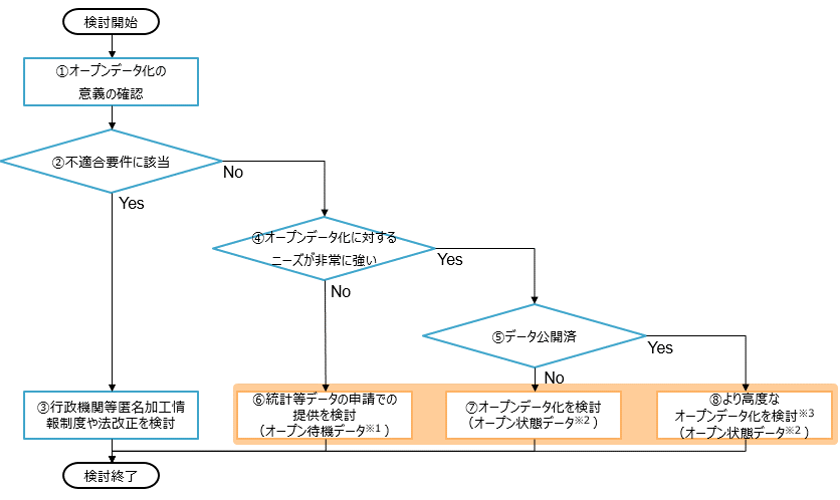
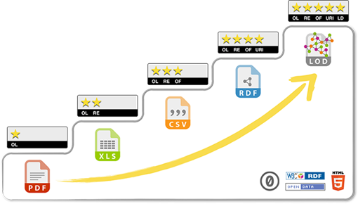
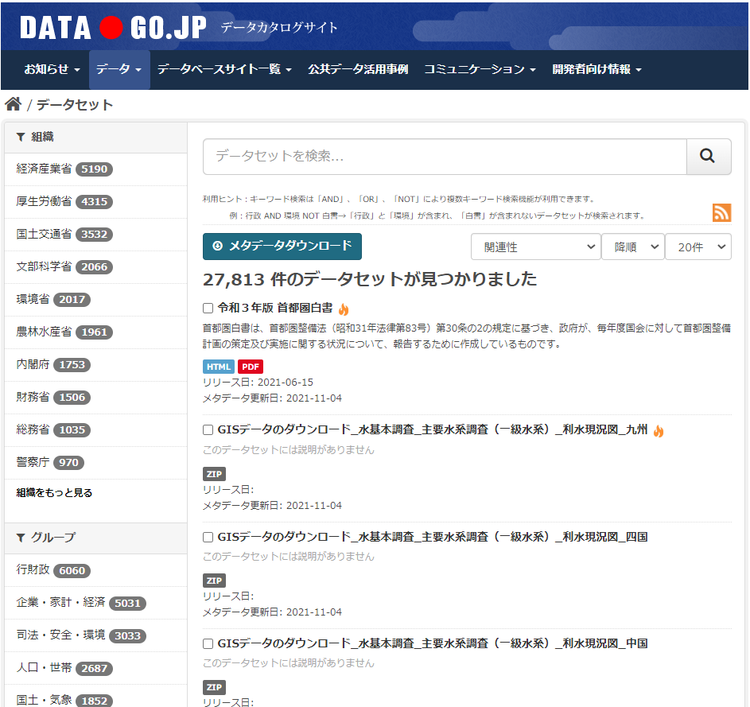

# データマネジメント実践ガイドブック （運用編） <!-- omit in toc -->

デジタル社会推進実践ガイドブック DS-465-2

2022年（令和4年）3月31日

デジタル庁

-----
**[キーワード]**

データマネジメント、データ利活用、ＥＢＰＭ、オープンデータ、データ品質、データ連携、データ標準、ＫＰＩ、データマネジメント実施計画

**[概要]**

行政機関にデジタル化やデータ利活用等が求められる中、安全かつ有効に情報システムを利用し、データ連携やデータ利活用を促進するため、データマネジメントが必要とされています。
本書では、データマネジメント実践ガイドブック（導入編）で策定したデータマネジメント実施計画に基づき、毎年継続的に実施していくデータマネジメントの取組手順を４つの重点テーマ（オープンデータの推進、データの品質確保、データ管理の高度化及びデータ標準の活用）ごとに、ＰＭＯ及びＰＪＭＯの視点でガイドしています。

-----
## 改訂履歴 <!-- omit in toc -->

| 改訂年月日    | 改訂箇所 | 改訂内容 |
|---------------|----------|----------|
| 2022年3月31日 |          | 初版決定 |

-----
## 目次 <!-- omit in toc -->
- [1. はじめに](#1-はじめに)
  - [1.1. 本書の位置付け（文書構成）](#11-本書の位置付け文書構成)
  - [1.2.  本書の使い方](#12--本書の使い方)
- [2. オープンデータの推進](#2-オープンデータの推進)
  - [2.1. オープンデータ化状況の定期調査](#21-オープンデータ化状況の定期調査)
    - [2.1.1. ＰＭＯの活動](#211-ｐｍｏの活動)
      - [2.1.1.1. 調査票の準備（実施時期：１０月～１１月頃）](#2111-調査票の準備実施時期１０月１１月頃)
      - [2.1.1.2. ＰＪＭＯへ調査票回答依頼（実施時期：１１月頃）](#2112-ｐｊｍｏへ調査票回答依頼実施時期１１月頃)
      - [2.1.1.3. 回答の収集・取りまとめ（実施時期：１２月頃）](#2113-回答の収集取りまとめ実施時期１２月頃)
    - [2.1.2. ＰＪＭＯの活動](#212-ｐｊｍｏの活動)
      - [2.1.2.1. オープンデータ化の意義の確認](#2121-オープンデータ化の意義の確認)
      - [2.1.2.2. 不適合要件に該当しないかどうかの確認](#2122-不適合要件に該当しないかどうかの確認)
      - [2.1.2.3. 識別加工情報制度や法改正を検討](#2123-識別加工情報制度や法改正を検討)
      - [2.1.2.4. オープンデータ化に対するニーズの確認](#2124-オープンデータ化に対するニーズの確認)
      - [2.1.2.5. データ公開済みか確認](#2125-データ公開済みか確認)
      - [2.1.2.6. 提供要請があった場合に適宜提供を検討（オープン待機データ）](#2126-提供要請があった場合に適宜提供を検討オープン待機データ)
      - [2.1.2.7. オープンデータ化を検討（オープン状態データ）](#2127-オープンデータ化を検討オープン状態データ)
      - [2.1.2.8. より高度なオープンデータ化を検討（オープン状態データ）](#2128-より高度なオープンデータ化を検討オープン状態データ)
  - [2.2. オープンデータ化状況の調査結果に基づく改善活動](#22-オープンデータ化状況の調査結果に基づく改善活動)
    - [2.2.1. ＰＭＯの活動](#221-ｐｍｏの活動)
      - [2.2.1.1. 府省庁内横断的なオープンデータ方針の検討](#2211-府省庁内横断的なオープンデータ方針の検討)
      - [2.2.1.2. 自府省庁内のガイド改訂](#2212-自府省庁内のガイド改訂)
    - [2.2.2. ＰＪＭＯの活動](#222-ｐｊｍｏの活動)
  - [2.3. オープンデータの整備・運用](#23-オープンデータの整備運用)
    - [2.3.1. 公開方法の検討](#231-公開方法の検討)
      - [2.3.1.1. 公開環境の検討](#2311-公開環境の検討)
      - [2.3.1.2. 公開データの形式の検討](#2312-公開データの形式の検討)
    - [2.3.2. メタデータの整理](#232-メタデータの整理)
    - [2.3.3. オープンデータ公開用環境の整備](#233-オープンデータ公開用環境の整備)
      - [2.3.3.1. データ公開サイトの検討](#2331-データ公開サイトの検討)
      - [2.3.3.2. 運用ルールの整備](#2332-運用ルールの整備)
      - [2.3.3.3. 二次利用可能なルールの整備と公開](#2333-二次利用可能なルールの整備と公開)
    - [2.3.4. オープンデータの公開と運用](#234-オープンデータの公開と運用)
    - [2.3.5. オープンデータの監理・モニタリング](#235-オープンデータの監理モニタリング)
  - [2.4. オープンデータの利活用促進に向けた活動](#24-オープンデータの利活用促進に向けた活動)
    - [2.4.1. オープンデータに対するニーズの定期的な調査](#241-オープンデータに対するニーズの定期的な調査)
    - [2.4.2. データの利活用促進のための啓発活動](#242-データの利活用促進のための啓発活動)
  - [2.5. 参考情報](#25-参考情報)
- [3. 　データの品質確保](#3-データの品質確保)
  - [3.1. データ品質状況の定期調査](#31-データ品質状況の定期調査)
    - [3.1.1. ＰＭＯの活動](#311-ｐｍｏの活動)
      - [3.1.1.1. 調査票の準備（実施時期：１０月～１１月頃）](#3111-調査票の準備実施時期１０月１１月頃)
      - [3.1.1.2. ＰＪＭＯへ調査票回答依頼（実施時期：１１月頃）](#3112-ｐｊｍｏへ調査票回答依頼実施時期１１月頃)
      - [3.1.1.3. 回答の収集・取りまとめ（実施時期：１２月頃）](#3113-回答の収集取りまとめ実施時期１２月頃)
    - [3.1.2. ＰＪＭＯの活動](#312-ｐｊｍｏの活動)
  - [3.2. データ品質状況の調査結果に基づく改善活動](#32-データ品質状況の調査結果に基づく改善活動)
    - [3.2.1. ＰＭＯの活動](#321-ｐｍｏの活動)
      - [3.2.1.1. ＰＪＭＯへの調査結果のフィードバック](#3211-ｐｊｍｏへの調査結果のフィードバック)
      - [3.2.1.2. 自府省庁内のガイド改訂](#3212-自府省庁内のガイド改訂)
    - [3.2.2. ＰＪＭＯの活動](#322-ｐｊｍｏの活動)
  - [3.3. データの品質確保のための監理・モニタリング](#33-データの品質確保のための監理モニタリング)
    - [3.3.1. ＰＭＯの活動](#331-ｐｍｏの活動)
    - [3.3.2. ＰＪＭＯの活動](#332-ｐｊｍｏの活動)
- [4. データ管理の高度化](#4-データ管理の高度化)
  - [4.1. データ管理の高度化の調査](#41-データ管理の高度化の調査)
    - [4.1.1. ＰＭＯの活動](#411-ｐｍｏの活動)
      - [4.1.1.1. 調査票の準備（実施時期：１０月～１１月頃）](#4111-調査票の準備実施時期１０月１１月頃)
      - [4.1.1.2. ＰＪＭＯへ調査票回答依頼（実施時期：１１月頃）](#4112-ｐｊｍｏへ調査票回答依頼実施時期１１月頃)
      - [4.1.1.3. 全システム（全データ）のデータ管理に係る調査（実施時期：１２月頃）](#4113-全システム全データのデータ管理に係る調査実施時期１２月頃)
      - [4.1.1.4. 回答の収集・取りまとめ（実施時期：１２月頃）](#4114-回答の収集取りまとめ実施時期１２月頃)
    - [4.1.2. ＰＪＭＯの活動](#412-ｐｊｍｏの活動)
  - [4.2. データ管理の高度化の調査結果に基づく改善活動](#42-データ管理の高度化の調査結果に基づく改善活動)
    - [4.2.1. ＰＭＯの活動](#421-ｐｍｏの活動)
      - [4.2.1.1. 府省庁内横断的なデータ管理の高度化の推進](#4211-府省庁内横断的なデータ管理の高度化の推進)
      - [4.2.1.2. 自府省庁内のガイド改訂](#4212-自府省庁内のガイド改訂)
    - [4.2.2. ＰＪＭＯの活動](#422-ｐｊｍｏの活動)
  - [4.3. データ管理の高度化の監理・モニタリング](#43-データ管理の高度化の監理モニタリング)
    - [4.3.1. ＰＭＯの活動](#431-ｐｍｏの活動)
    - [4.3.2. ＰＪＭＯの活動](#432-ｐｊｍｏの活動)
- [5. 　データ標準の活用](#5-データ標準の活用)
  - [5.1. 　データ標準の活用の調査](#51-データ標準の活用の調査)
    - [5.1.1. ＰＭＯの活動](#511-ｐｍｏの活動)
      - [5.1.1.1. 調査票の準備（実施時期：１０月～１１月頃）](#5111-調査票の準備実施時期１０月１１月頃)
      - [5.1.1.2. ＰＪＭＯへ調査票回答依頼（実施時期：１１月頃）](#5112-ｐｊｍｏへ調査票回答依頼実施時期１１月頃)
      - [5.1.1.3. 全システム（全データ）の標準の活用状況に係る調査（実施時期：１２月頃）](#5113-全システム全データの標準の活用状況に係る調査実施時期１２月頃)
      - [5.1.1.4. 回答の収集・取りまとめ（実施時期：１２月頃）](#5114-回答の収集取りまとめ実施時期１２月頃)
    - [5.1.2. ＰＪＭＯの活動](#512-ｐｊｍｏの活動)
  - [5.2. 　データ標準の活用の調査結果に基づく改善活動](#52-データ標準の活用の調査結果に基づく改善活動)
    - [5.2.1. ＰＭＯの活動](#521-ｐｍｏの活動)
      - [5.2.1.1. 府省庁内横断的な標準化方針の策定](#5211-府省庁内横断的な標準化方針の策定)
      - [5.2.1.2. 自府省庁内のガイド改訂](#5212-自府省庁内のガイド改訂)
    - [5.2.2. ＰＪＭＯの活動](#522-ｐｊｍｏの活動)
  - [5.3. 　データ標準の活用の監理・モニタリング](#53-データ標準の活用の監理モニタリング)
    - [5.3.1. ＰＭＯの活動](#531-ｐｍｏの活動)
    - [5.3.2. ＰＪＭＯの活動](#532-ｐｊｍｏの活動)
- [6. 年間を通したその他のデータマネジメント推進業務](#6-年間を通したその他のデータマネジメント推進業務)
  - [6.1. 年間を通したその他のデータマネジメント推進業務](#61-年間を通したその他のデータマネジメント推進業務)
    - [6.1.1. ＰＭＯの業務](#611-ｐｍｏの業務)
    - [6.1.2. ＰＪＭＯの業務](#612-ｐｊｍｏの業務)

-----
## 1. はじめに

### 1.1. 本書の位置付け（文書構成）

データマネジメント実践ガイドブックは、導入編と運用編の２編構成となっており、本書はデータマネジメント実践ガイドブック運用編に該当します。

**【運用編について】**
本書（運用編）では、導入編で策定したデータマネジメント実施計画を推進する上で、毎年継続的に実施していく取組の手順をガイドしています。
本書の構成を以下に示します。
データマネジメントにおける４つの重点テーマ（オープンデータの推進、データの品質確保、データ管理の高度化及びデータ標準の活用）ごとに、ＰＭＯ及びＰＪＭＯの視点で手順をガイドしています。
また、体制の見直し等、４つの重点テーマに共通して実施する手順を「年間を通したその他のデータマネジメント推進業務」にてガイドしています。

<figure>

<figcaption>
図表 １－１　データマネジメント実践ガイドブック　運用編
</figcaption>
</figure>

**【参考】導入編について**
導入編では、データマネジメントにおける重点テーマに関する説明及び各府省庁にてデータマネジメントを導入・推進する際の指針となるデータマネジメント実施計画の策定に向けたガイドを示しています。
本書を参照しているＰＭＯ及びＰＪＭＯにおいては、導入編の内容を基に、データマネジメント実施計画等の策定が完了しているものと想定しています。

<figure>

<figcaption>
図表 １－２　データマネジメント実践ガイドブック　導入編
</figcaption>
</figure>

### 1.2.  本書の使い方

データマネジメント実施計画の策定が完了している府省庁ＰＭＯ及びＰＪＭＯを対象に、本書を参照しながらデータマネジメントの取組を順次実施いただくことを想定しています。

４つの重点テーマごとに毎年継続的に実施していく取組の手順をガイドしているため、各府省庁の実情に合わせた形でテーラリングしながら1テーマから実施可能です。例えば、スモールスタートで「オープンデータの推進」に絞ってデータマネジメントを実施する場合は、「オープンデータの推進」及び「年間を通したその他のデータマネジメント推進業務」の手順を参照してください。

-----
## 2. オープンデータの推進

オープンデータの推進は、ＰＪＭＯが主体となり、自システムのオープンデータ化を順次実施する必要があります。ＰＪＭＯは、導入編で策定した実行ロードマップに沿って、毎年の定期調査と調査結果を踏まえたオープンデータ化を継続的に実施してください。

ＰＭＯは、現状調査や公開環境の整備、運用ルールの設定等、府省庁内横断的な取組を主導し、ＰＪＭＯの円滑なオープンデータの推進につなげてください。

### 2.1. オープンデータ化状況の定期調査

オープンデータ化の推進に当たり、現在のオープンデータ化状況を把握するための定期調査を毎年実施することが重要です。

以下に、ＰＭＯ及びＰＪＭＯの視点から、オープンデータ化状況の定期調査手順を示します。

なお、「2.1.2 ＰＪＭＯの活動」の中で示した「オープンデータ化判断フローチャート」は、導入編３章「調査（現状把握）」に掲載した調査票に基づく、調査の詳細を示したものです。導入編では、データマネジメント実施計画の策定に当たり必要な手順を可能な限りシンプル化してガイドし、運用編では２年目以降継続的に実施する取組のより具体的な実行手順をガイドしています。現状把握のための調査は、初年度以降、毎年継続的に実施する取組であることより、詳細な手順は運用編の中で記載しています。

#### 2.1.1. ＰＭＯの活動

##### 2.1.1.1. 調査票の準備（実施時期：１０月～１１月頃）

導入編の中で作成した「オープンデータの推進状況に係る調査票」を活用しながら、追加で調査したい項目等がある場合は追記を行った上で、今年度の調査票を準備します。

##### 2.1.1.2. ＰＪＭＯへ調査票回答依頼（実施時期：１１月頃）

ＰＪＭＯに対して、調査票への回答依頼を発出します。回答期限を短く設定し過ぎないようにし、ＰＪＭＯが多忙な場合を考慮し期限内に回答が収集できるよう計画的に調査依頼を行ってください。その際、他調査と併せて回答依頼を行う等、ＰＪＭＯの業務負荷を可能な限り抑えた形で実施してください。

##### 2.1.1.3. 回答の収集・取りまとめ（実施時期：１２月頃）

ＰＪＭＯから調査票回答を収集し、取りまとめを行います。各ＰＪＭＯの回答を集計し、問題となる事象が多かった項目や観点等を抽出することで、府省庁内横断的な傾向の把握を行ってください。

#### 2.1.2. ＰＪＭＯの活動

**調査票への回答（実施時期：１１月～１２月頃）**

ＰＪＭＯは、ＰＭＯからの回答依頼に基づき、調査票に回答します。

調査票は以下に示すフローチャートに基づいており、調査票の質問項目に回答することで、フローチャートに沿った形でオープンデータ化対象データの選定が可能です。

オープンデータ化判断フローチャート内の①～⑧の詳細を以下に示します。

<figure>

<figcaption>
図表 ２－１　オープンデータ化判断フローチャート
</figcaption>
</figure>

##### 2.1.2.1. オープンデータ化の意義の確認

「オープンデータ基本指針」[^1]にて示されているオープンデータ化の意義とプロジェクトの目的（システム化の目的、システム化の背景となる政策の目的及びシステム化の背景となる法律の主旨）を照らし合わせ、オープンデータ化がプロジェクトの目的と合致しているか確認してください。

図表 ２－２　オープンデータ化の意義[^2]

| 項目 | 内容 |
|------|-----|
| 国民参加・官民協働の推進を通じた諸課題の解決、経済活性化 | 広範な主体による公共データの活用が進展することで、創意工夫を活かした多様なサービスの迅速かつ効率的な提供、官民の協働による公共サービスの提供や改善が実現し、ニーズや価値観の多様化、技術革新等の環境変化への適切な対応とともに、厳しい財政状況、急速な少子高齢化の進展等の我が国が直面する諸課題の解決に貢献することができる。また、ベンチャー企業等による多様な新サービスやビジネスの創出、企業活動の効率化等が促され、我が国全体の経済活性化にもつながる。 |
| 行政の高度化・効率化 | 国や地方公共団体においてデータ活用により得られた情報を根拠として政策や施策の企画及び立案が行われることで（ＥＢＰＭ：Evidence Based Policy Making）、効果的かつ効率的な行政の推進につながる。 |
| 透明性・信頼の向上 | 政策立案等に用いられた公共データが公開されることで、国民は政策等に関して十分な分析、判断を行うことが可能になり、行政の透明性、行政に対する国民の信頼が高まる。 |

##### 2.1.2.2. 不適合要件に該当しないかどうかの確認

自システムのデータがオープンデータの対象外とされている不適合要件に該当していないか、確認してください。以下に、オープンデータ化対象外データの主なものを示します。

図表 ２－３　オープンデータ化対象外となる不適合要件の例

| 確認根拠 | 分類 | 詳細 |
|---------|------|------|
| 官民データ活用推進基本法　第十一条の規定 | 個人情報 | 個人情報に該当するデータに該当 |
| 官民データ活用推進基本法　第十一条の規定 | 個人情報 | 特定個人情報（マイナンバー含む個人情報）に該当 |
| 官民データ活用推進基本法　第十一条の規定 | 個人情報 | 要配慮個人情報（差別・偏見・不利益のおそれがある個人情報）に該当 |
| 官民データ活用推進基本法　第十一条の規定 | 個人情報 | 非識別加工情報（個人を識別不可に加工した個人情報）に該当 |
| 官民データ活用推進基本法　第十一条の規定 | 秩序維持・権利維持 | 国や公共の安全、秩序の維持に支障を及ぼすおそれがある又は法人や個人の権利利益を害する恐れがあるデータに該当 |
| 個別法令 | データの収集・利用目的 | 収集したデータの利用（公開）を制限する規定がある |

##### 2.1.2.3. 識別加工情報制度や法改正を検討

個人情報に関するデータは、不適合要件に該当し、オープンデータ化対象外とされます。ただし、非識別加工（個人を識別できないように加工）を行い民間に提供する制度である非識別加工情報制度を通じて、データの公開が可能な場合があります。必要に応じて検討してください。

また、法律にそもそも「公表」等の規定がない場合や、「公表」や「閲覧」等の対象が「データの要旨」等に限定されるなど、法律の条文に抵触するために公開ができないデータは、必要に応じて、法改正によるオープンデータ化の実施を検討してください。

##### 2.1.2.4. オープンデータ化に対するニーズの確認

オープンデータ化に対するニーズが強いデータに関して、優先的に公開を行っていく必要があります。特に、「各府省庁からしか提供できないデータ」、「様々な分野での基礎資料となり得る信頼性の高いデータ」、又は「リアルタイム性を重視するデータ」等の有用なデータについては社会的ニーズが高いと想定されることから、オープンデータ化の対象とすることが望ましいです。

##### 2.1.2.5. データ公開済みか確認

オープンデータ化に対するニーズが確認されたデータについて、公開済みのデータ[^3]又は新規に公開されるデータ[^4]か、現在の公開ステータスを確認します。

##### 2.1.2.6. 提供要請があった場合に適宜提供を検討（オープン待機データ）

オープンデータ化に対するニーズがそれほど強くなかったデータに関しても、提供要請等があった場合は提供が可能な仕組みを必要に応じて検討してください（オープン待機データ[^5]）。併せて、提供要請を受け付ける窓口等の設置も検討してください。

##### 2.1.2.7. オープンデータ化を検討（オープン状態データ）

新規に公開されるデータについては、オープン状態データ[^6]にするための公開方法やデータ形式の検討を行ってください。公開方法等の検討手順の詳細は、「2.3 オープンデータの整備・運用」を参照してください。

##### 2.1.2.8. より高度なオープンデータ化を検討（オープン状態データ）

既に公開済みのデータについては、より高度な公開方法やデータ形式などを検討してください。例えば、現在公開しているデータの形式がＰＤＦの場合は、より機械判読性に優れたＣＳＶでの公開を検討する等が考えられます。

公開方法等の検討手順の詳細は、「2.3 オープンデータの整備・運用」を参照してください。

### 2.2. オープンデータ化状況の調査結果に基づく改善活動

#### 2.2.1. ＰＭＯの活動

##### 2.2.1.1. 府省庁内横断的なオープンデータ方針の検討

ＰＭＯは、オープンデータ化状況の調査結果を分析し、オープンデータの推進に係る問題や傾向を把握します。その上で、オープンデータの推進のための自府省庁内横断的な方針を検討し、導入編で作成した実行ロードマップの更新・追記を行います。

併せて、調査結果のフィードバックや、全体方針に基づきオープンデータの推進を促すための啓発活動をＰＪＭＯに対して実施してください。

##### 2.2.1.2. 自府省庁内のガイド改訂

オープンデータを推進するに当たり、調達仕様書及び要件定義書の中で要件として定めた方が望ましい内容がある場合は、自府省庁の作成手引等の各種ガイドラインに追記してください。

#### 2.2.2. ＰＪＭＯの活動

ＰＪＭＯは調査結果及びＰＭＯの分析結果等を踏まえ、オープンデータの推進に向けた各種ドキュメントの作成・更新を行ってください。

図表 ２－４　調査結果に基づくＰＪＭＯの活動

| 実施時期 | 活動 |
|---------|------|
| 調査完了後 | プロジェクトごとの実行ロードマップの作成・更新 調査結果に基づき、課題の抽出、施策の検討を行い、施策の優先度を設定した上で、導入編で作成した実行ロードマップの更新・追記を行う。実行ロードマップは、プロジェクト計画書に掲載する。 |
| 予算要求時 | 予算要求 オープンデータを推進するに当たり必要な予算要求を行う。 |
| 予算要求時 | プロジェクト計画書「データ利活用」への反映 プロジェクト計画書の「データ利活用」に係る記載の見直しを行う。プロジェクトで保有するデータの利活用推進及びそのために必要なオープンデータ化方針や、オープンデータに関する指標及びその指標における達成水準（目標値）を設定し、プロジェクト計画書に記載する。 【反映箇所】 第３章「３．データ利活用の方向性」 第５章「２．データ利活用効果に関するKPIと達成状況」 等 |
| 予算執行時 | 調達仕様書及び要件定義書への反映 策定した実行ロードマップやＰＭＯの分析結果の内容を踏まえ、調達仕様書及び要件定義書にオープンデータの推進に係る要件を記述する。 |

### 2.3. オープンデータの整備・運用

#### 2.3.1. 公開方法の検討

ＰＪＭＯは、オープンデータ化対象として選定したデータについて、公開方法の検討を行います。

なお、既に公開済みのデータであっても、データ利活用促進の観点から公開方法の検討を再度行う必要があることから、「公開済みのデータ」及び「新規に公開されるデータ」を対象に公開方法の検討を行います。

公開方法の検討に当たり、考慮すべき事項を以下に示します。

##### 2.3.1.1. 公開環境の検討

データの利活用を促進するために、利用者が容易に検索・利用できる形でデータを公開する必要があります。ＰＭＯは、利用者の利便性を考慮し、システムの負荷及び効率性の観点から、一括ダウンロードを可能とする仕組みの導入や、ＡＰＩを通じた提供を検討してください。以下に、ＡＰＩ化に適しているデータの例を示します。

図表 ２－５　ＡＰＩ化に適しているデータの例[^7]

| 概要 | 詳細 |
|------|-----|
| データの更新が頻繁であるもの | 更新が頻繁なものやリアルタイム更新されるもの（日次よりも頻繁） ・センサーデータ ・日次で更新されるデータ |
| データ量が多い（全体のデータ量が多く、その一部を抽出・取得したい（させたい）場合等）もの | ファイルで提供されても検索・抽出や加工が大変なもの（レコード数が数万件以上等） ・レコード数が多いもの（数万件以上） ・データ項目（カラム）が多いもの |
| マッシュアップが期待できるもの | 他データとの組合せが期待できるもの |

加えて、ＡＰＩ化を検討する際には、デジタル・ガバメント推進標準ガイドライン群の「ＡＰＩ導入実践ガイドブック」及び「ＡＰＩテクニカルガイドブック」を併せて参照してください。

図表 ２－６　公開環境の検討における参照資料

| 資料名 | URL |
|-------|-----|
| ＡＰＩ導入実践ガイドブック | https://cio.go.jp/sites/default/files/uploads/documents/1019_api_guidebook.pdf |
| ＡＰＩテクニカルガイドブック | https://cio.go.jp/sites/default/files/uploads/documents/1020_api_tecnical_guidebook.pdf |

##### 2.3.1.2. 公開データの形式の検討

ＰＪＭＯは、公開データの形式について検討を行ってください。オープンデータ化に当たっては、利用者が加工しやすい、また、コンピュータプログラムが処理しやすい、機械判読に適した構造及びデータ形式で公開することが重要です。

機械判読性に基づいた公開レベルによってレベル１（★１）～レベル５（★５）の５段階に分類された、「５スターオープンデータ」の考え方を基に、より上位の評価となるファイル形式での公開を検討してください。

なお、「オープンデータ基本指針」[^8]では、統計情報等の行列や階層による表現が可能な情報などの構造化がしやすいデータは、より活用がしやすいデータ形式である「３段階（ＣＳＶやＸＭＬ等のフォーマット）」以上での公開を原則としていることより、基本的には「３段階（★★★）」以上での公開を検討してください。

図表 ２－７　５スターオープンデータの概要[^9]

<figure>

<figcaption>
</figcaption>
</figure>

| 段階 | 公開の状態 | データ形式 |
|-----|------------|-----------|
| １段階（★） | オープンライセンスでデータを公開 | ＰＤＦ、ＪＰＧ（編集不可） |
| ２段階（★★） | コンピュータで処理可能なデータを公開 | ＸＬＳ、ＤＯＣ（編集可） |
| ３段階（★★★） | オープンに利用できるフォーマットでデータを公開 | ＸＭＬ、ＣＳＶ（編集可） |
| ４段階（★★★★） | Ｗｅｂ標準（ＲＤＦ等）のフォーマットでデータを公開 | ＲＤＦ（機械判読可） |
| ５段階（★★★★★） | 他へのリンクを入れたデータ（ＬＯＤ）を公開 | Linked-ＲＤＦ（機械判読可） |

#### 2.3.2. メタデータの整理

ＰＪＭＯは、オープンデータの整備と併せ、データ自体の情報であるメタデータを整理します。新規に公開されるデータだけでなく公開済みデータ及び待機データについても、メタデータが整備されていない場合は、整理を行ってください。

メタデータを整理し、機械判読に適した形式で公開することで、利用者が必要なデータを探しやすくなります。

また、メタデータの整理に当たっては、メタデータ標準を活用することでデータカタログ間の連携が容易になり、データを効率的に活用することができます。

メタデータの国際的な標準であるＤＣＡＴ[^10]（Data Catalog Vocabulary)の仕様を参考に、個々のデータ単位の情報を配信する場合のメタデータ項目の例を以下に示します。必要に応じて参考にしてください。

図表 ２－８　メタデータの項目と記載例①

| 項目 | 説明や記載例等 |
|---|---|
| タイトル | |
| 説明 | |
| 公開日 | YYYY-MM-DD |
| 最終更新日 | YYYY-MM-DD |
| 期間 | YYYY-MM-DD/ YYYY-MM-DD |
| ライセンス | CC-BY |
| アクセス URL | http:// |

また、政府全体のデータカタログサイトである「DATA.GO.JP」に掲載する際のメタデータの項目と記載例を以下に示します。併せて、メタデータ項目の詳細な説明や考え方等に係る資料についても、必要に応じて参照してください。

図表 ２－９　メタデータの項目と記載例②[^11]

| 項目 | 説明や記載例等 |
|---|---|
| タイトル | |
| 説明 | |
| 公表組織名 | ○○省 |
| 連絡先 | ○○局○○課 |
| 作成者 | ○○局○○課 |
| タグ | |
| リリース日 | YYYY-MM-DD |
| 作成頻度 | |
| 公開ウェブページ | http:// |
| 対象地域 | |
| データ形式 | HTML |
| ファイルサイズ | DATA.GO.JPではバイト単位で記載 |
| 最終更新日 | YYYY-MM-DD |
| ライセンス | CC-BY |
| コピーライト | |
| 言語 | 日本語 |

図表 ２－１０　メタデータ項目の詳細な説明や考え方等に係る資料

| 参照先 |
|-------|
| https://www.data.go.jp/for-developer/for-developer (2) データカタログサイトで提供しているメタデータ等に関する情報 を参照。 |

#### 2.3.3. オープンデータ公開用環境の整備

##### 2.3.3.1. データ公開サイトの検討

オープンデータは、政府のデータカタログサイト「DATA.GO.JP」や政府統計ポータルサイト「e-Stat」への登録など、府省庁が運営するデータ公開のためのウェブサイトを活用し公開を行うことを検討してください。

また、自府省庁の既存のホームページにて公開することや、必要に応じて、データ公開サイトを新規に構築し公開することも考えられます。新たにサイトを構築する場合は、ホームページ型やカタログサイト等、大まかなサイトイメージや方針を明らかにした上で、掲載するコンテンツの検討や利用ルールの設定も行ってください。

なお、データ公開先の情報（リンク等）は、自府省庁のホームページや、「DATA.GO.JP」等に掲載することで、利用者に周知を行い、利活用促進につなげてください。

##### 2.3.3.2. 運用ルールの整備

データ公開サイトを新たに構築する場合は、ＰＭＯは、サイト運用ルールの整備を行います。運用ルールの例として、データ更新手順や意見・問い合わせ手順の整備が挙げられます。

運用ルールに従い、ＰＪＭＯがデータを順次公開し、ＰＭＯが状況を管理・モニタリングすることで、オープンデータ化を円滑に推進することができます。

以下に、データ更新手順の一例を示します。必要に応じて参考にしてください。

図表 ２－１１　データ更新手順（例）

| 手順 |
|------|
| ①各ＰＪＭＯは、追加、更新データがあれば、適宜メタデータとともにサイトで公開する。併せて、インデックス先の更新も行う。 |
| ②ＰＭＯは、各ＰＪＭＯが運用ルールに沿ってデータを公開しているか随時、確認・管理を行う。 |

##### 2.3.3.3. 二次利用可能なルールの整備と公開

ウェブサイト上で公開するデータ（「公開済みのデータ」及び「新規に公開されるデータ」）について、二次利用可能なルールの適用を行います。その上で、データ利用に際して利用者が遵守すべき事項を利用規約として整備し、データ公開サイトに掲載します。

利用規約の整備に当たっては、政府標準利用規約を活用してください。

また、著作権等の位置付けや利用ルールの在り方（二次利用に係る免責等）についてのより詳細な内容は、「二次利用の促進のための府省のデータ公開に関する基本的考え方（ガイドライン）」を参照してください。

図表 ２－１２　二次利用可能なルールに係る参照資料

| 資料名 | URL |
|-------|-----|
| 政府標準利用規約（第2.0版） | <http://www.kantei.go.jp/jp/singi/it2/densi/kettei/gl2_betten_1.pdf>　|
| 二次利用の促進のための府省のデータ公開に関する基本的考え方（ガイドライン） | <https://cio.go.jp/sites/default/files/uploads/documents/opendata_nijiriyou_hontai.pdf>　 |

**【アウトプット（例）】**
一例として、政府全体のデータカタログサイトである「DATA.GO.JP」のイメージを以下に示します。

図表 ２－１３　 DATA.GO.JP[^12]のイメージ

<figure>

<figcaption>
</figcaption>
</figure>

利用者は、組織、グループ、タグ、フォーマット等を指定しながら、府省庁内横断で必要なデータセットを検索することができます。

#### 2.3.4. オープンデータの公開と運用

公開用環境の整備が完了し、利用テスト等を経て問題なしと判断された後、ＰＪＭＯは府省庁が運営するデータ公開のためのウェブサイトや、自府省庁のデータ公開サイト上で、対象データ及びメタデータを公開します。

公開した後も、対象データ及びメタデータの最新化や運用ルールの更新は継続して行ってください。

#### 2.3.5. オープンデータの監理・モニタリング

ＰＭＯは、ＰＪＭＯの進捗状況や達成状況について管理し、必要に応じて取組を円滑に進めるためのアドバイスを行います。また、予算/執行ヒアリング時に、オープンデータ化の推進に当たっての課題・要望をＰＪＭＯに確認し、次年度以降の方針や施策の見直し等につなげます。

図表 ２－１４　ＰＭＯがモニタリング時に確認する事項

| 確認時期 | 確認対象 | 確認内容 |
|---------|---------|----------|
| 予算要求時 | ・実行ロードマップ ・プロジェクト計画書 | ・プロジェクト計画書に実行ロードマップの内容が反映されているか ・オープンデータの推進に基づく予算が要求されているか ・オープンデータの取組の進捗及び達成状況 |
| 予算執行時 | ・調達仕様書 ・要件定義書 | ・調達仕様書及び要件定義書の要件に、実行ロードマップを実現するためのオープンデータに係る要件が含まれているか |

### 2.4. オープンデータの利活用促進に向けた活動

オープンデータ化の実施と併せ、オープンデータの利活用促進に向けた以下の取組を実施することが望ましいです。

#### 2.4.1. オープンデータに対するニーズの定期的な調査

ＰＭＯは、オープンデータ化対象データを選定するに当たり、利用者へのニーズ調査を実施します。調査方法は、以下のようなものが考えられます。各プロジェクトでの実施が難しい場合は局単位で実施する等、自府省庁の状況に合わせ、適切な方法で実施してください。

図表 ２－１５　利用者ニーズ調査方法の例

| 調査方法 |
|---------|
| 対象利用者・有識者・政策関係者等へのヒアリング・アンケート |
| オープンデータ官民ラウンドテーブル、アイデアソン、ハッカソン等でのニーズ把握のためのワークショップ |
| ダウンロード回数、閲覧回数、ページ滞在時間の分析・把握 |
| 情報公開請求の有無（請求数等）を確認 |
| 非識別加工情報に対する要望を確認 |

#### 2.4.2. データの利活用促進のための啓発活動

オープンデータ化のニーズ調査に加え、データサイト公開の周知と利活用促進のための啓発活動を実施することも重要です。以下に啓発活動の一例を示します。必要に応じて参考にしてください。

図表 ２－１６　データ利活用促進のための啓発活動の例

| 活動目的 | 活動内容 |
|-|-|
| 周知のためのプロモーション活動 | オープンデータの利活用に取組む事業者への周知 |
| 周知のためのプロモーション活動 | 報道発表（プレスリリース） |
| 周知のためのプロモーション活動 | 各府省庁のウェブサイトのトップページにオープンデータサイトへのリンク掲載 |
| 周知のためのプロモーション活動 | オープンデータサイト構築に当たり、利用者からの意見受付 |
| 周知のためのプロモーション活動 | 政府ＣＩＯポータル及びDATA．GO．JP等へのリンク掲載 |
| 周知のためのプロモーション活動 | ＳＮＳによる周知広報活動 |
| 利活用促進のためのイベント活動 | オープンデータ官民ラウンドテーブル、アイデアソン、ハッカソン等の利活用促進のためのイベントの開催 |

**【アウトプット（例）】**
事例：環境省が開催したアイデアソン
データマネジメントポリシーを他省庁に先駆けて策定し、データマネジメントに係る取組を進めている環境省は、令和３年１１月に民間の非営利団体と共同で、データの有用性を評価し、アイデアを創出することを目的としたデータ活用ワークショップ（アイデアソン）を開催しました。
当日は、社会課題や事業創造及びデータ利活用に関心のある、幅広いバックグラウンドを持った参加者約３０名がチームに分かれ、自然環境に関するデータ活用の事業アイデアを考え、ビジネスモデルを作成・プレゼンを実施し、ユニークなビジネスアイデアが多く考案されました。
参加者からは、「知らない世界だったので興味深く参加ができた。バックグラウンドの異なる方々とのディスカッションはとても楽しかった」や「データベースの構築状況など学びが多く参考になりました」といったポジティブな感想が多く寄せられました。

### 2.5. 参考情報

政府のオープンデータに関する基本的な考え方を示した「オープンデータ基本指針」は、本書と関連する内容が多分に含まれるため、必要に応じて参照してください。

併せて、本章で紹介した一連のオープンデータ化実施手順のより詳細な内容について、内閣官房情報通信技術（ＩＴ）総合戦略室が作成した「オープンデータをはじめよう～地方公共団体のための最初の手引書」を参照してください。

図表 ２－１７　参考情報

| 資料名 | URL |
|-------|-----|
| オープンデータ基本指針 | https://cio.go.jp/sites/default/files/uploads/documents/data_shishin.pdf |
| オープンデータをはじめよう～地方公共団体のための最初の手引書～ | https://view.officeapps.live.com/op/view.aspx?src=https%3A%2F%2Fcio.go.jp%2Fsites%2Fdefault%2Ffiles%2Fuploads%2Fdocuments%2Fopendata_tebikisyo.pptx&wdOrigin=BROWSELINK |

-----
## 3. 　データの品質確保

データ品質を確保していくためには、データ品質状況の調査及び調査結果に基づき策定した実行ロードマップに即した改善活動を継続的に推進していくことが重要です。

以下に、データ品質確保のための具体的な活動について、ＰＭＯ及びＰＪＭＯごとに示します。

### 3.1. データ品質状況の定期調査

データの品質改善に関する取組は、データの特性や状況、取扱うシステムの特性によって、緊急性や対応難易度が異なるため、長期的かつ段階的な視点で対応が必要となるケースも考えられます。そのため、定期的な現状調査と実行ロードマップの策定・見直しは欠かせません。

導入編の「データの品質確保に係る調査票」を参考に、現状調査を毎年実施してください。

なお、調査結果や調査結果に基づく実行ロードマップは、予算要求を行う事業のプロジェクト計画書や調達仕様書（要件定義書含む）等に反映することから、本調査は１月を目標に完了することが望ましいです。

#### 3.1.1. ＰＭＯの活動

##### 3.1.1.1. 調査票の準備（実施時期：１０月～１１月頃）

導入編の中で作成した「データの品質確保に係る調査票」を参考に、今年度の調査票を準備します。

##### 3.1.1.2. ＰＪＭＯへ調査票回答依頼（実施時期：１１月頃）

ＰＪＭＯに対して、調査票への回答依頼を発出します。

##### 3.1.1.3. 回答の収集・取りまとめ（実施時期：１２月頃）

ＰＪＭＯから調査票回答を収集し、取りまとめを行います。各ＰＪＭＯの回答を集計し、問題となる事象が多かった項目や観点等を抽出することで、府省庁内横断的な傾向の把握を行ってください。

#### 3.1.2. ＰＪＭＯの活動

**調査票への回答（実施時期：１１月～１２月頃）**

ＰＭＯからの依頼を受け、調査票に回答します。具体的な質問項目や回答手順は、導入編の別紙「データの品質確保に係る調査票」のマニュアルシートに示していますので、必要に応じて参照してください。

前年度に既にデータ品質に係る調査や改善活動を実施している場合は、前年度と比較してデータ品質が向上したかという観点で再点検してください。

新規構築したシステムや改修を実施したシステムについては、新たにデータの品質に係る評価を実施してください。

### 3.2. データ品質状況の調査結果に基づく改善活動

#### 3.2.1. ＰＭＯの活動

##### 3.2.1.1. ＰＪＭＯへの調査結果のフィードバック

ＰＭＯは、データの品質確保の調査結果を分析し、データの品質確保に係る問題や傾向を把握します。その上で、データの品質確保のための自府省庁内横断的な方針を検討し、導入編で作成した実行ロードマップの更新・追記を行います。

併せて、各ＰＪＭＯに対してデータ品質状況についてのフィードバックを行います。フィードバックに当たっては、全省的な傾向や問題だけでなく、他のＰＪＭＯと比べて取組が十分でない部分等があれば、助言等を行うようにしてください。

##### 3.2.1.2. 自府省庁内のガイド改訂

全省的な問題や傾向を把握した上で、現状の問題を改善するためにＰＪＭＯが実施すべき事項や留意すべき事項を洗い出し、自府省庁内の調達仕様書及び要件定義書の作成手引等の各種ガイドラインの見直し（修正・追記）等を行います。

データの品質確保を推進するに当たり、調達仕様書及び要件定義書の中で要件として定めた方が望ましい内容を検討し、自府省庁の作成手引等の各種ガイドラインをアップデートしてください。以下にデータの品質確保に向けた要件例を示します。必要に応じて参考にしてください。

図表 ３－１　データの品質確保に係る要件の例

| 要件 |
|-----|
| 適切なデータ定義を行うこと（適切な型、桁数、取り得る範囲、必須項目の明確化、データ項目間の関係定義、書式の設定等） |
| クラス図、ＥＲ図の活用によるデータ連携を検討すること |
| データ連携を考慮したデータ項目の定義を行うこと（項目の粒度、データ項目間での型や値の整合性確保） |
| 適切なマスターデータ設計、コード設計を行うこと |
| データ標準、ベース・レジストリ等の活用を行うこと |
| 入力フォームやファイルのアップロード機能を適切に使用すること |
| データ入力時のチェック機能を設けること |
| データの改ざん防止策を実装すること（アクセス制限、更新のトレーサビリティ、自動検知等） |
| 更新プロセスを見直すこと（リードタイム短縮、即時更新化） |
| 機密性の高いデータについては、アクセス制限、暗号化、匿名化等のセキュリティ対策を実施すること |
| 不正なデータのクレンジングを実施すること |

見直した各種ガイドラインや府省庁内横断で実施すべき事項等をＰＪＭＯに対して通達してください。

#### 3.2.2. ＰＪＭＯの活動

ＰＪＭＯは調査結果及びＰＭＯの分析結果等を踏まえ、以下の活動を行います。

図表 ３－２　調査結果に基づくＰＪＭＯの活動

| 実施時期 | 活動 |
|---------|------|
| 調査完了後 | **プロジェクトごとの実行ロードマップの作成・更新** 調査結果に基づき、課題の抽出、施策の検討を行い、施策の優先度を設定した上で、導入編で作成した実行ロードマップの更新・追記を行う。実行ロードマップは、プロジェクト計画書に掲載する。 【立案に当たっての留意点】 ・前年度の調査結果と比較し、問題とされる事象がどれほど減ったか等を確認し、前年度からの取組の有効性を評価した上で、今年度版としてアップデートする。 ・今年度の調査で新たに抽出された課題についても、改善のための施策を検討する。 ・ＰＭＯから発出された府省庁内横断的な方針と整合が取れたものとする。 |
| 予算要求時 | **予算要求** データの品質確保を推進するに当たり必要な予算要求を行う。 |
| 予算要求時 | **プロジェクト計画書への反映** プロジェクト計画書の「データ利活用」に係る記載の見直しを行う。プロジェクトで保有するデータの利活用推進及びそのために必要なデータ品質確保に係る方針や、データ品質確保に関する指標及びその指標における達成水準（目標値）を設定し、プロジェクト計画書に記載する。 【反映箇所】 ・第３章「３．データ利活用の方向性」 ・第５章「２．データ利活用効果に関するKPIと達成状況」 等 |
| 予算執行時 | **調達仕様書及び要件定義書への反映（システム面での対応）** 策定した実行ロードマップやＰＭＯの分析結果の内容を踏まえ、調達仕様書及び要件定義書にデータの品質確保に係る要件を記述する。 |
| 予算執行時 | **制度、法律及び事務手続きの見直し（制度・業務面での対応）** システム運用・保守や更改における対応にとどまらず、データ品質確保に当たって、既存の制度や業務の見直しが必要な場合は、ＰＪＭＯが主体となり、関連する制度所管部署や業務実施部署と連携しながら、制度の変更や業務改善等を実施する。 |

### 3.3. データの品質確保のための監理・モニタリング

#### 3.3.1. ＰＭＯの活動

ＰＭＯは、ＰＪＭＯによるデータの品質確保に係る取組の実施状況（進捗状況・達成状況等）や各種ドキュメントについてチェックを行います。ＰＭＯが確認する事項について、以下に示します。

図表 ３－３　ＰＭＯがモニタリング時に確認する事項

| 確認時期 | 確認対象 | 確認内容 |
|---------|---------|----------|
| 予算要求時 | ・実行ロードマップ ・プロジェクト計画書 | ・プロジェクト計画書に実行ロードマップの内容が反映されているか ・データの品質確保に関する取組に基づく予算が要求されているか ・データの品質確保に係る取組の進捗及び達成状況 |
| 予算執行時 | ・調達仕様書 ・要件定義書  | ・調達仕様書及び要件定義書の要件に、実行ロードマップを実現するためのデータの品質確保に係る要件が含まれているか |

#### 3.3.2. ＰＪＭＯの活動

予算要求時における、ＰＭＯによるチェック結果を踏まえ、必要に応じて各種ドキュメントの内容の追記等を行います。また、ＰＭＯによる実行ロードマップの進捗状況や達成状況に係るチェック結果を踏まえ、必要に応じて実行ロードマップの見直し等を行います。

-----
##  4. データ管理の高度化

データ管理の高度化とは、データの所在などを示すドキュメントを一元的に管理し、データの所在やデータ項目間の関係性等を一目で把握できる状態にしておくことです。

データ管理の高度化に取り組むに当たっては、データの品質確保と同様に、調査及び調査結果に基づき策定した実行ロードマップに即した改善活動を推進していくことが重要です。

ただし、データの品質確保はＰＪＭＯ主体の活動が主であったのに対し、データ管理の高度化は府省庁内横断的な取組であり、ＰＭＯが府省庁における実施方針を策定し、ＰＪＭＯが方針に沿った取組を実施する等、ＰＭＯがより主体的な役割を担うことが求められます。

以下に、データ管理の高度化のための具体的な活動について、ＰＭＯ及びＰＪＭＯごとに示します。

### 4.1. データ管理の高度化の調査

ＰＭＯは、府省庁内横断的な実施方針を策定するために、管理の高度化に係る問題や傾向を把握するための調査を実施します。調査結果や調査結果に基づく実行ロードマップは、予算要求を行う事業のプロジェクト計画書や調達仕様書（要件定義書含む）等に反映することから、本調査は１月を目標に完了することが望ましいです。

#### 4.1.1. ＰＭＯの活動

##### 4.1.1.1. 調査票の準備（実施時期：１０月～１１月頃）

導入編の中で作成した「データ管理の高度化に係る調査票」を参考に、今年度の調査票を準備します。

##### 4.1.1.2. ＰＪＭＯへ調査票回答依頼（実施時期：１１月頃）

ＰＪＭＯに対して、調査票への回答依頼を発出します。

##### 4.1.1.3. 全システム（全データ）のデータ管理に係る調査（実施時期：１２月頃）

自府省庁内のデータに関するドキュメント等の横断的な管理状況を確認します。

図表 ４－１　全システムの横断的な管理状況の確認観点

| 分類 | 確認例 |
|------|-------|
| 全体管理状況 | 自府省庁内の情報システムにおける全データに関するドキュメント状態を把握できているか |
| 全体管理状況 | 自府省庁内の情報システムにおける全データについて、データ項目ごとの所在が把握できており、重複、同一項目複数名称、同一項目型/桁不一致、定義の誤り、実値不正などが把握されている、あるいは直ぐに調査できるようになっているか                             |
| 運用状況 | 自府省庁内の情報システムにおけるデータの課題（重複、同一項目複数名称、同一項目型/桁不一致、定義の誤り、実値不正など）について、常にその課題解決、改善に向けて活動を行っている状態であるか（データ管理の高度化を行うことでの最適運用がなされているか） |

##### 4.1.1.4. 回答の収集・取りまとめ（実施時期：１２月頃）

ＰＪＭＯから調査票回答を収集し、取りまとめを行います。また、ＰＪＭＯから提出された資料を確認し、問題となる事象が多かった項目や観点等を抽出することで、データ管理の高度化に係る問題や傾向の把握を行ってください。また、全システム（全データ）のデータ管理の高度化に係る調査結果を踏まえ、府省庁内横断的なデータ管理の高度化の状況を把握してください。

#### 4.1.2. ＰＪＭＯの活動

**調査票への回答（実施時期：１１月～１２月頃）**

ＰＭＯからの依頼を受け、調査票に回答します。前年度に既にデータ管理の高度化に係る調査や改善活動を実施している場合は、運用が適切に行われているかなどの観点で再点検してください。

新規構築したシステムや改修を実施したシステムについては、新たにデータ管理の高度化に係る評価を実施してください。

### 4.2. データ管理の高度化の調査結果に基づく改善活動

#### 4.2.1. ＰＭＯの活動

##### 4.2.1.1. 府省庁内横断的なデータ管理の高度化の推進

ＰＭＯは、調査結果を踏まえて府省庁内横断的なデータ管理の高度化実施方針を検討し、導入編で作成した実行ロードマップの更新・追記を行います。その上で、方針に沿った活動を順次実施していきます。ＰＭＯが実施すべき活動の例を以下に示します。必要に応じて参考にしてください。

図表 ４－２　府省庁内横断的なデータ管理の高度化活動（一例）

| 実施主体 | 実施内容 |
|---------|---------|
| ＰＭＯ | ①システム毎のデータの関係性可視化 ・データモデル、データ一覧、データ定義等の一連のデータに係る既存のドキュメントの収集 ・共通利用が想定されるデータの洗い出し |
| ＰＭＯ | ②データ管理の高度化方針の検討 |
| ＰＭＯ | ③データ管理の高度化の順次実施 ・ＰＪＭＯへの各種ドキュメント作成依頼 ・データの所在や管理者等を示すインデックス資料の整備 等 |

##### 4.2.1.2. 自府省庁内のガイド改訂

ＰＭＯは、データ管理の高度化を推進するに当たりＰＪＭＯが実施すべき事項や留意すべき事項を洗い出し、自府省庁内の調達仕様書及び要件定義書の作成手引等の各種ガイドラインの見直し（修正・追記）等を行います。

見直した各種ガイドラインや自府省庁内横断で実施すべき事項等をＰＪＭＯに対して通達してください。

#### 4.2.2. ＰＪＭＯの活動

ＰＪＭＯは調査結果及びＰＭＯの分析結果等を踏まえ、以下の活動を行います。

図表 ４－３　調査結果に基づくＰＪＭＯの活動

| 実施時期 | 活動 |
|---------|------|
| 調査完了後 | **プロジェクトごとの実行ロードマップの作成** ・更新調査結果に基づき、課題の抽出、施策の検討を行い、施策の優先度を設定した上で、導入編で作成した実行ロードマップの更新・追記を行う。実行ロードマップは、プロジェクト計画書に掲載する。 |
| 予算要求時 | **予算要求** データ管理の高度化を推進するに当たり必要な予算要求を行う。 |
| 予算要求時 | **プロジェクト計画書への反映** プロジェクト計画書の「データ利活用」に係る記載の見直しを行う。プロジェクトで保有するデータの利活用推進及びそのために必要なデータ管理の高度化に係る方針や、データ管理の高度化に関する指標及びその指標における達成水準（目標値）を設定し、プロジェクト計画書に記載する。 【反映箇所】 第３章「３．データ利活用の方向性」 第５章「２．データ利活用効果に関するKPIと達成状況」 等 |
| 予算執行時 | **調達仕様書及び要件定義書への反映** 策定した実行ロードマップやＰＭＯの分析結果の内容を踏まえ、調達仕様書及び要件定義書にデータ管理の高度化に係る要件を記述する。 |
| 通年 | **データ管理の高度化の順次実施（各種ドキュメントの整備）** ①各種ドキュメント（データモデル、データ一覧、データ定義など）の整備（初年度以降） ②既にあるドキュメントのメンテナンス（データ項目のアップデート）（次年度以降） ③システム新規構築・更改のタイミングで、データ管理の高度化の可能性を検討する。（次年度以降） |

### 4.3. データ管理の高度化の監理・モニタリング

#### 4.3.1. ＰＭＯの活動

ＰＭＯは、ＰＪＭＯによるデータ管理の高度化に係る取組の実施状況（進捗状況・達成状況等）や各種ドキュメントについてチェックを行います。ＰＭＯが確認する事項について、以下に示します。

図表 ４－４　ＰＭＯがモニタリング時に確認する事項

| 確認時期 | 確認対象 | 確認内容 |
|---------|---------|----------|
| 予算要求時 | ・実行ロードマップ ・プロジェクト計画書 | ・プロジェクト計画書に実行ロードマップの内容が反映されているか ・データ管理の高度化に関する取組に基づく予算が要求されているか ・データ管理の高度化に係る取組の進捗及び達成状況 |
| 予算執行時 | ・調達仕様書 ・要件定義書 | ・調達仕様書及び要件定義書の要件に、実行ロードマップを実現するためのデータ管理の高度化に係る要件が含まれているか |

#### 4.3.2. ＰＪＭＯの活動

予算要求時における、ＰＭＯによるチェック結果を踏まえ、必要に応じて各種ドキュメントの内容の追記等を行います。また、ＰＭＯによる実行ロードマップの進捗状況や達成状況に係るチェック結果を踏まえ、必要に応じて実行ロードマップの見直し等を行います。

**【参考】Tips集 データ管理の高度化の具体的な取組の例**

* データ管理の高度化のためのＰＭＯの活動
以下に、ＰＭＯによる活動の例を示します。必要に応じて参考にしてください。

図表 ４－５　データ管理の高度化のためのＰＭＯの活動

| 概要 | 詳細 |
|-----|------|
| 府省庁内の情報システムにおける全データに関するドキュメント状態の把握 | ・データの所在や管理者等を示すインデックス資料のフォーマットを作成する。 ・インデックス資料の記入をＰＪＭＯに依頼する。 ・インデックス資料の内容が現状と乖離していないか定期的に確認する。 |
| 府省庁内の情報システムにおける全データについて、データ項目ごとの所在の把握と、重複、同一項目複数名称、同一項目型/桁不一致、定義の誤り、実値不正等の把握又は直ぐに調査できる状態の維持 | ・情報システムにおける全データについて、ＥＲ図を用いたデータモデルの作成をＰＪＭＯに依頼する。 ・データモデルやインデックス資料の内容が現状と乖離していないことを定期的に確認する。 |
| 府省庁内の情報システムのデータ課題（重複、同一項目複数名称、同一項目型/桁不一致、定義の誤り、実値不正など）について、課題解決や改善活動の常時実施 | ・課題の収集（現状調査） ・対応すべき課題の特定 ・原因の分析 ・費用対効果を踏まえた優先順位付け ・対応方針の検討 |

* データ管理の高度化のためのＰＪＭＯの活動
以下に、ＰＪＭＯによる活動の例を示します。必要に応じて参考にしてください。

図表 ４－６　データ管理の高度化実現ためのＰＪＭＯの活動

| 概要 | 詳細 |
|-----|------|
| データに関するドキュメント（要件定義書、基本設計書）の一か所での集中管理 | ・データの所在や管理者等を示すインデックス資料を作成する。 ・情報システムごとにドキュメントの保管場所を定める。 ・各情報システムのドキュメントを種類ごとに洗い出し、特定の保管場所で管理する。 |
| 主要なデータ間（エンティティ間）の関係・構造を全体俯瞰できるドキュメントの作成 | ・ＥＲ図を用いてデータモデルを作成する。 |
| 全てのデータ項目について、エンティティ毎の一覧表化と、各項目の定義（名称、型、桁、意味、範囲等） | ・データがどのようなまとまりの単位になっているかを一覧形式で示した、データ一覧を作成する。 ・データ一覧にあるデータのまとまり単位にそれぞれに含まれるデータ項目の内容・説明を示す表である、データ定義を作成する。 ・各データ項目がどのような意味を持ち、どのような表現やルールで記録されるかなどを定義する。 |
| データと機能（処理）の関連がわかるドキュメントの作成 | ・データが、機能一覧で定義した機能の時系列の流れの中でどう変化するのかを定義した、ＣＲＵＤ マトリクスを作成する。 |
| ツール等で直ぐに取り出し、集計や加工が容易にできる形で情報システムにデータを保管 | ・ツール等を用いて容易に集計や加工できる形でデータを保管する設計とする（要件定義書へ明記する）。 |
| ドキュメントで示されたデータ項目単位で情報システム全体のデータを検索可能とする | ・ドキュメントで示されたデータ項目単位で情報システム全体のデータを検索可能とする設計とする（要件定義書へ明記する）。 |
| データに関するドキュメントの常時最新化と、実態と不整合の無い状態の維持 |・定期的にドキュメント内容の確認や更新を行う。 |
| データ項目に関する変更、追加時における、影響がある同類の項目についての調査と、当該項目の適切な設計及びドキュメントの管理 | ・特定のデータ項目の変更時に影響が出る、他のデータ項目を洗い出す。 ・当該データ項目におけるデータ定義の内容等を修正する。 |

-----
## 5. 　データ標準の活用

データ標準の活用もデータ管理の高度化と同様に、府省庁内横断的に推進する取組であり、ＰＭＯが主体となり府省庁内横断的な標準化方針を策定した上で、各ＰＪＭＯが方針に基づく実行ロードマップに即した改善活動を推進していくことが重要です。

以下に、データ標準の活用のための具体的な活動について、ＰＭＯ及びＰＪＭＯごとに示します。

### 5.1. 　データ標準の活用の調査

データ標準の活用に関する取組は、システムやＰＪＭＯの枠を超えて推進する活動であり、最初のステップとして、標準化の状況を把握した上で、府省庁内横断的な方針を策定する必要があります。

導入編の「データ標準の活用に係る調査票」を参考に、現状調査を実施してください。

なお、調査結果や調査結果に基づく実行ロードマップは、予算要求を行う事業のプロジェクト計画書や調達仕様書（要件定義書含む）等に反映することから、本調査は１月を目標に完了することが望ましいです。

#### 5.1.1. ＰＭＯの活動

ＰＭＯは、現状調査の実施に向けて、ＰＪＭＯへの調査依頼や調査票の取りまとめなどの主導的な役割を担います。具体的な手順の例を以下に示します。

##### 5.1.1.1. 調査票の準備（実施時期：１０月～１１月頃）

導入編の中で作成した「データ標準の活用に係る調査票」を参考に、追加で評価したい事項や観点等がある場合は追記等を行った上で、今年度の調査票を準備します。

##### 5.1.1.2. ＰＪＭＯへ調査票回答依頼（実施時期：１１月頃）

ＰＪＭＯに対して、調査票への回答依頼を発出します。

##### 5.1.1.3. 全システム（全データ）の標準の活用状況に係る調査（実施時期：１２月頃）

自府省庁内におけるデータ標準の活用の横断的な管理状況を確認します。

図表 ５－１　データ標準の活用の横断的な管理状況の確認観点

| 分類 | 確認例 |
|-----|--------|
| 全体管理状況 | 自府省庁内のデータ標準の活用の内容が全て把握されているか |
| 全体管理状況 | 標準化されたデータの業務での活用内容が把握できているか |
| 運用状況 | 自府省庁内のデータ標準の活用について不十分な箇所が課題として把握できており、それらの最適な標準化に向けた活動を常に行っている状態であるか |

##### 5.1.1.4. 回答の収集・取りまとめ（実施時期：１２月頃）

ＰＪＭＯから調査票回答及び標準化の検討結果を収集し、取りまとめを行います。各ＰＪＭＯの回答を集計し、問題となる事象が多かった項目や観点等を抽出することで、府省庁内横断的な傾向の把握を行ってください。

#### 5.1.2. ＰＪＭＯの活動

**調査票への回答（実施時期：１１月～１２月頃）**

ＰＭＯからの依頼を受け、調査票に回答します。前年度に既にデータ標準の活用に係る調査や改善活動を実施している場合は、運用が適切に行われているかなどの観点で再点検してください。

新規構築したシステムや改修を実施したシステムについては、新たにデータ標準の活用に係る評価を実施してください。

また、ＰＪＭＯは調査票への回答と併せて、標準化の検討結果をＰＭＯに提出してください。

### 5.2. 　データ標準の活用の調査結果に基づく改善活動

#### 5.2.1. ＰＭＯの活動

##### 5.2.1.1. 府省庁内横断的な標準化方針の策定

調査結果を踏まえ、ＰＭＯは府省庁内横断的な標準化実施方針を検討し、導入編で作成した実行ロードマップの更新・追記を行います。その上で、方針に沿った活動を順次実施していきます。実施内容の例を以下に示します。必要に応じて参考にしてください。

図表 ５－２　府省庁内横断的なデータ標準の活用方針（一例）

| 実施主体 | 実施方針 |
|---------|---------|
| ＰＭＯ | ①標準化ルールの整備 ・導入編で策定したデータマネジメント実施計画及びプロジェクトごとの調査結果や調査に基づく実行ロードマップを踏まえ、標準化を推進するための、府省庁内横断的なルールを整備する。 ・政府の方針や業界の動向及び国際的な標準を参考にするとともに、法令上の規定や自府省庁の示している様式等を踏まえ、ＰＪＭＯと協議の上でルールを整備する。 ・併せて、標準化すべきデータ項目の洗い出しを行う。また、マスターデータ及びデータ項目（コードを含む）について、より広範囲の標準化の実施を検討する。 ・データ項目の定義等を行い、府省庁内横断的なデータ標準を整備、ＰＪＭＯに公開する。 ②標準化の順次実施 等 |

##### 5.2.1.2. 自府省庁内のガイド改訂

ＰＭＯは、データ標準の活用を推進するに当たりＰＪＭＯが実施すべき事項や留意すべき事項を洗い出し、自府省庁内の調達仕様書及び要件定義書の作成手引等の各種ガイドラインの見直し（修正・追記）等を行います。

見直した各種ガイドラインや自府省庁内横断で実施すべき事項等をＰＪＭＯに対して通達してください。

#### 5.2.2. ＰＪＭＯの活動

ＰＪＭＯは調査結果及びＰＭＯの分析結果等を踏まえ、以下の活動を行います。

図表 ５－３　調査結果に基づくＰＪＭＯの活動

| 実施時期 | 活動 |
| - | - |
| 調査完了後 | **プロジェクトごとの実行ロードマップの作成・更新** 調査結果に基づき、課題の抽出、施策の検討を行い、施策の優先度を設定した上で、導入編で作成した実行ロードマップの更新・追記を行う。実行ロードマップは、プロジェクト計画書に掲載する。 |
| 予算要求時 | **予算要求** データ標準の活用を推進するに当たり必要な予算要求を行う。 |
| 予算要求時 | **プロジェクト計画書への反映** プロジェクト計画書の「データ利活用」に係る記載の見直しを行う。プロジェクトで保有するデータの利活用推進及びそのために必要なデータ標準の方針や、データ標準に関する指標及びその指標における達成水準（目標値）を設定し、プロジェクト計画書に記載する。 【反映箇所】 第３章「３．データ利活用の方向性」 第５章「２．データ利活用効果に関するKPIと達成状況」 等 |
| 予算執行時 | **調達仕様書及び要件定義書への反映** 策定した実行ロードマップやＰＭＯの分析結果の内容を踏まえ、調達仕様書及び要件定義書にデータ標準の活用に係る要件を記述する。（※要件定義書においては、機能要件の「データに関する事項」に、マスターデータ標準の活用及びデータ項目標準化（コード含む）のレベル等を要件として具体的に記述すること等を想定する。） |
| 通年 | **標準化の順次実施（各種ドキュメントの整備）** ①標準様式に従い、データ項目の整備を行う。（初年度以降） ②既にあるドキュメントのメンテナンス（データ項目のアップデート）（次年度以降） ③システム新規構築・更改のタイミングで、標準化の可能性を検討する。通常の改修の際に実施可能か、大規模な更改時の際に実施するか、実施時期を検討する。（次年度以降） |

### 5.3. 　データ標準の活用の監理・モニタリング

#### 5.3.1. ＰＭＯの活動

ＰＭＯは、府省庁内のデータ標準の活用の内容を全て把握するとともに、データ標準の活用が不十分である箇所に対しては、解決に向けた活動を常に行うことが重要です。

ＰＭＯは、ＰＪＭＯによるデータ標準の活用に係る取組の実施状況（進捗状況・達成状況等）や各種ドキュメントについてチェックを行います。ＰＭＯが確認する事項について、以下に示します。

図表 ５－４　ＰＭＯがモニタリング時に確認する事項

| 確認時期 | 確認対象 | 確認内容 |
|---------|---------|----------|
| 予算要求時 | ・実行ロードマップ ・プロジェクト計画書 | ・プロジェクト計画書に実行ロードマップの内容が反映されているか ・データ標準の活用に関する取組に基づく予算が要求されているか ・データ標準の活用に係る取組の進捗及び達成状況 |
| 予算執行時 | ・調達仕様書 ・要件定義書 | ・調達仕様書及び要件定義書の要件に、実行ロードマップを実現するためのデータ標準の活用に係る要件が含まれているか |

#### 5.3.2. ＰＪＭＯの活動

予算要求時における、ＰＭＯによるチェック結果を踏まえ、必要に応じて各種ドキュメントの内容の追記等を行います。また、ＰＭＯによる実行ロードマップの進捗状況や達成状況に係るチェック結果を踏まえ、必要に応じて実行ロードマップの見直し等を行います。

-----
## 6. 年間を通したその他のデータマネジメント推進業務

### 6.1. 年間を通したその他のデータマネジメント推進業務

前章までに示した内容に加え、データマネジメントの推進に当たり共通して実施すべき業務があります。ＰＭＯ及びＰＪＭＯごとに、年間を通したデータマネジメント推進業務の内容を示します。

#### 6.1.1. ＰＭＯの業務

以下に、ＰＭＯが主体となって実施する年間を通したデータマネジメント推進業務を示します。必要に応じて参考にしてください。

図表 ６－１　ＰＭＯが主体となり実施する年間を通したデータマネジメント推進業務

| 実施時期 | 実施内容 | 関連ドキュメント |
|---------|----------|----------------|
| 中長期計画関連（２～３月） | **中長期計画の改訂** データマネジメントに関して設定した目標を踏まえて、中長期計画の改定を行う。 | ・中長期計画 |
| 人事異動時（４、７、１０月） | **データマネジメント推進体制の見直し** 人事異動を踏まえ、体制の見直しを実施し、データマネジメント実施計画の該当箇所を修正する。結果をＰＪＭＯに共有し、合意形成を図る。 | ・データマネジメント実施計画 ６章「組織体制」 |
| 予算要求時 | **データマネジメント実施状況の評価** 4つの重点テーマに基づくデータマネジメントの活動の進捗や達成度の評価を実施し、フィードバック等を行う。また、各取組の進捗や課題の改善状況等を鑑みて毎年データマネジメント実施計画を更新する。【実施の流れ】①データマネジメント実施評価シート作成（初年度のみ）②データマネジメント実施状況の評価、データマネジメント推進功労賞の選定③評価結果を基に表彰 | ・実行ロードマップ ・データマネジメント実施計画 |
| 予算要求時 | **データマネジメント対象システムの管理** 予算ヒアリングを通して、データマネジメント実施対象システムの管理を行う。原則は全システムを対象とすることが望ましいが、難しい場合は、優先度を設定し、優先度の高いシステムからデータマネジメント対象とする。 | ・実行ロードマップ ・データマネジメント実施計画 |
| 通年（適宜） | **教育・啓発活動の開催** データマネジメントの必要性や、府省庁内横断での取組内容及び取組結果の共有を行い、データマネジメントの実施に対する理解・協力を促す。データマネジメントに関する成果を上げているＰＪＭＯを表彰する。 | ― |

#### 6.1.2. ＰＪＭＯの業務

以下に、ＰＪＭＯが主体となって実施する年間を通したデータマネジメント推進業務を示します。必要に応じて参考にしてください。

図表 ６－２　ＰＪＭＯが主体となり実施する年間を通したデータマネジメント推進業務

| 実施時期 | 実施内容 | 関連ドキュメント |
|---------|----------|----------------|
| 調査完了後 | **調査票への回答** ４つの重点テーマに基づく調査票に回答し、ＰＭＯに保有データの棚卸状況を報告する。 | ・調査票 |
| 人事異動（４、７、１０月） | **データマネジメント推進体制の見直し** 人事異動が発生する場合、体制の見直しを行い、プロジェクト計画書の更新及びＰＭＯへの報告を行う。 | ・プロジェクト計画書 第９章「体制」 |
| 通年（適宜） | **教育・啓発活動への参加** プロジェクトメンバーへ教育・啓発活動への参加を呼び掛ける。データマネジメントの必要性や、府省庁内横断での取組内容及び取組結果について、ＰＭＯからの共有を受け、理解促進につなげる。 | ― |

[^1]: オープンデータ基本指針（平成２９年５月３０日高度情報通信ネットワーク社会推進戦略本部・官民データ活用推進戦略会議決定、令和３年６月１５日改正）<https://cio.go.jp/sites/default/files/uploads/documents/data_shishin.pdf>

[^2]: オープンデータ基本指針（平成２９年５月３０日高度情報通信ネットワーク社会推進戦略本部・官民データ活用推進戦略会議決定、令和３年６月１５日改正）<https://cio.go.jp/sites/default/files/uploads/documents/data_shishin.pdf>　

[^3]: ウェブサイト上などで、外部から人為的な手続きを経ずに取得できる状態で公開されているデータ。

[^4]: 今後ウェブサイト上などで外部から人為的な手続きを経ずに取得できる状態で公開される予定のデータ。

[^5]: 標準ガイドライン実践ガイドブックによるオープンデータの定義。オープン可能データのうち、外部から申請等の手続を経て取得できるデータ。デジタル・ガバメント推進標準ガイドライン実践ガイドブック（第３編第５章要件定義）p.25<https://cio.go.jp/sites/default/files/uploads/documents/jissen-guide_5_20210330.pdf>

[^6]: 標準ガイドライン実践ガイドブックによるオープンデータの定義。オープン可能データのうち、外部から人為的な手続きを経ずに取得できる状態（ダウンロードサイト、Web-API公開など）になっているデータ。ＵＲＬ等は、脚注5を参照。

[^7]: 「オープンデータ100」の事例をもとに整理した。

[^8]: オープンデータ基本指針（平成２９年５月３０日高度情報通信ネットワーク社会推進戦略本部・官民データ活用推進戦略会議決定、令和３年６月１５日改正）<https://cio.go.jp/sites/default/files/uploads/documents/data_shishin.pdf>

[^9]: ５スターオープンデータ<https://5stardata.info/ja/>

[^10]: 国際標準化団体W3Cが勧告するデータカタログのメタデータ標準であり、世界中の行政機関や民間でのデータカタログで標準的に用いられている。

[^11]: 「DATA.GO.JP」https://www.data.go.jp/を基に整理した。

[^12]: 「DATA.GO.JP」https://www.data.go.jp/
