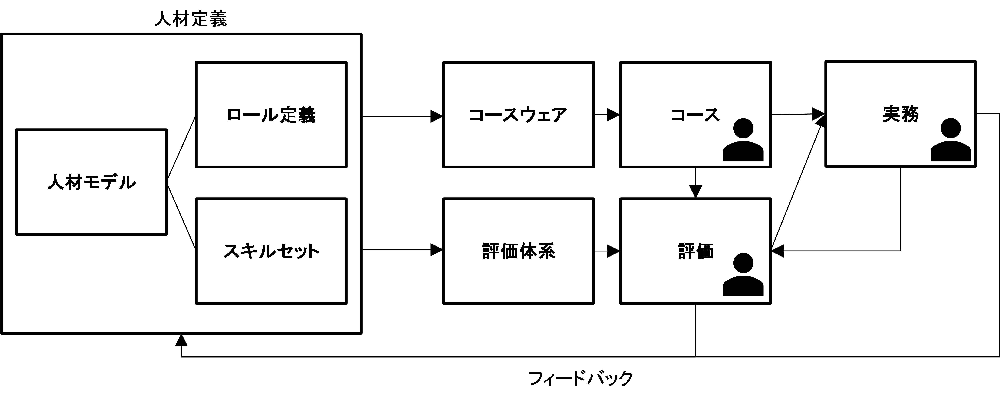
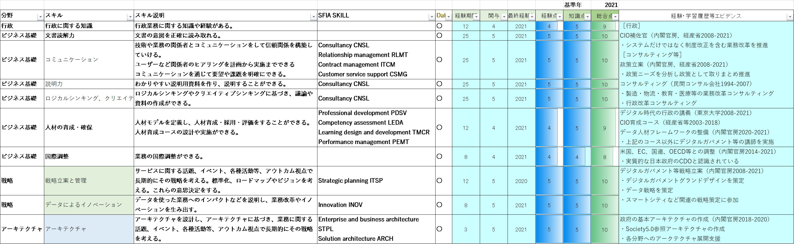

# データ人材管理実践ガイドブック <!-- omit in toc -->

デジタル社会推進実践ガイドブック DS-466

2022年（令和4年）8月31日

デジタル庁

-----
**[キーワード]**

人材、データ・アーキテクト、データ・エンジニア、データ・アナリスト、データ・サイエンティスト、AIスペシャリスト

**[概要]**

データ人材とは、データを企画設計するところから収集、管理し、さらにAIも含めデータ活用するために様々なスペシャリティを持った人材が必要です。
本ガイドブックでは、データ人材の人材像とスキルセットを明確にするとともに、評価方法も含めたデータ人材フレームワークを整理します。

-----
## 改訂履歴 <!-- omit in toc -->

| 改訂年月日    | 改訂箇所 | 改訂内容                                       |
|---------------|----------|------------------------------------------------|
| 2022年8月31日 | 全体     | SFIA7がSFIA8に改定されたことによるスキルの反映 |
| 2022年3月31日 | -       | 初版決定                                       |

-----
## 目次 <!-- omit in toc -->
- [1. 　概要](#1-概要)
  - [1.1. 　背景](#11-背景)
    - [1.1.1. データ量の増加](#111-データ量の増加)
    - [1.1.2. データのグローバル性](#112-データのグローバル性)
    - [1.1.3. データ人材の不足](#113-データ人材の不足)
    - [1.1.4. 人材体系がないための非効率](#114-人材体系がないための非効率)
  - [1.2. 　目的](#12-目的)
- [2. 　人材体系](#2-人材体系)
  - [2.1. 　データ人材体系](#21-データ人材体系)
  - [2.2. 　データ人材モデル](#22-データ人材モデル)
    - [2.2.1. データ・アーキテクト（AR）](#221-データアーキテクトar)
    - [2.2.2. データ・エンジニア［設計］（データ・アナリスト）(AN)](#222-データエンジニア設計データアナリストan)
    - [2.2.3. データ・エンジニア［開発］（データベース・エンジニア）（DB）](#223-データエンジニア開発データベースエンジニアdb)
    - [2.2.4. データ・サイエンティスト（DS）](#224-データサイエンティストds)
    - [2.2.5. AIスペシャリスト（AI）](#225-aiスペシャリストai)
    - [2.2.6. 地理空間データ・スペシャリスト（GE）](#226-地理空間データスペシャリストge)
  - [2.3. 　人材のロール](#23-人材のロール)
  - [2.4. 　スキルセット](#24-スキルセット)
- [3. 　人材の確保と育成](#3-人材の確保と育成)
  - [3.1. 　データ人材の採用と評価](#31-データ人材の採用と評価)
    - [3.1.1. 経験点](#311-経験点)
    - [3.1.2. 知識点](#312-知識点)
    - [3.1.3. 総合評価](#313-総合評価)
  - [3.2. 　データ人材育成コース](#32-データ人材育成コース)
    - [3.2.1. 内部コース](#321-内部コース)
      - [3.2.1.1. コースウェア](#3211-コースウェア)
      - [3.2.1.2. 教材と学習コンテンツの整備](#3212-教材と学習コンテンツの整備)
      - [3.2.1.3. 配信](#3213-配信)
      - [3.2.1.4. OJTの実施](#3214-ojtの実施)
      - [3.2.1.5. ケースの整備](#3215-ケースの整備)
    - [3.2.2. 外部コース](#322-外部コース)
- [4. 　関連する人材フレームワーク](#4-関連する人材フレームワーク)
  - [4.1. 　参照した人材フレームワーク](#41-参照した人材フレームワーク)
    - [4.1.1. SFIA8](#411-sfia8)
    - [4.1.2. DDaT Profession Capability Framework](#412-ddat-profession-capability-framework)
    - [4.1.3. O*NET](#413-onet)
    - [4.1.4. Curated Data Skills Catalog](#414-curated-data-skills-catalog)
    - [4.1.5. IPAのIT人材育成](#415-ipaのit人材育成)
      - [4.1.5.1. 情報処理技術者試験](#4151-情報処理技術者試験)
      - [4.1.5.2. ITSS](#4152-itss)
      - [4.1.5.3. ITSS+](#4153-itss)
      - [4.1.5.4. UISS](#4154-uiss)
      - [4.1.5.5. iコンピテンシ ディクショナリ（iCD）](#4155-iコンピテンシ-ディクショナリicd)
  - [4.2. 　研修等](#42-研修等)
    - [4.2.1. 情報システム統一研修](#421-情報システム統一研修)
    - [4.2.2. AI人材](#422-ai人材)
- [5. 参考：採用での活用事例](#5-参考採用での活用事例)
  - [5.1. プロダクトマネージャー（シニアデータスペシャリスト）（第１期）](#51-プロダクトマネージャーシニアデータスペシャリスト第１期)
    - [5.1.1. 業務内容](#511-業務内容)
    - [5.1.2. 必須条件](#512-必須条件)
    - [5.1.3. 歓迎条件](#513-歓迎条件)
  - [5.2. データ・アーキテクト（第２期）](#52-データアーキテクト第２期)
    - [5.2.1. 業務内容](#521-業務内容)
    - [5.2.2. 必須条件](#522-必須条件)
    - [5.2.3. 歓迎条件](#523-歓迎条件)
  - [5.3. データ・エンジニア（第４期）](#53-データエンジニア第４期)
    - [5.3.1. 業務内容](#531-業務内容)
    - [5.3.2. 必須条件](#532-必須条件)
    - [5.3.3. 歓迎条件](#533-歓迎条件)
  - [5.4. データ・スペシャリスト（地理空間）（第４期）](#54-データスペシャリスト地理空間第４期)
    - [5.4.1. 業務内容](#541-業務内容)
    - [5.4.2. 必須条件](#542-必須条件)
    - [5.4.3. 歓迎条件](#543-歓迎条件)
  - [5.5. データ戦略ポリシープランナー（第４期）](#55-データ戦略ポリシープランナー第４期)
    - [5.5.1. 業務内容](#551-業務内容)
    - [5.5.2. 必須条件](#552-必須条件)
    - [5.5.3. 歓迎条件](#553-歓迎条件)

-----
## 1. 　概要

### 1.1. 　背景

#### 1.1.1. データ量の増加

社会全体のいたるところにデータがあり、その種類、提供方法が増大しているためデータを活用したビジネスが盛んになってきています。また、従来の紙をベースにした業務からデータを使った業務へと変革することにより、抜本的な業務の効率化を図ることができたり、新たなビジネスモデルを実現することができたりする可能性が高まってきています。

#### 1.1.2. データのグローバル性

データはネットワークを通じて世界中を瞬時に移動し、グローバルな活用が行われるため、グローバルに活用できるデータ標準やインタフェース、ルール体系を整備していく必要があります。また、世界最先端のツールやサービスを迅速に導入、展開するため、効果的、効率的な情報収集が必要となってきています。

#### 1.1.3. データ人材の不足

データが増大し、可能性が広がる中で、データを生成、収集、管理、活用する人材が圧倒的に不足しています。データ活用に注目が集まり、AI人材やデータ・サイエンティストの人材には注目が集まるものの、データ設計やデータアーキテクチャなどの、データの根幹をなす部分の人材が特に不足しています。

育成したAI人材やデータ・サイエンティストもデータクレンジングに多大な時間が割かれており、結果として、組織や社会が持つデータを使いこなし、データの持つ価値を最大化できていません。

#### 1.1.4. 人材体系がないための非効率

データに関する人材体系がないために、人材の育成がバランスよくできていません。また、育成コースはコースウェアというよりも部分的な講義シリーズやセミナーで行うものが多く、体系的な学習が行える環境ができておらず、大学などの高等教育機関においても、データに関連した体系的なコースウェアが提供できていません。

### 1.2. 　目的

本データ人材フレームワークは、世界最先端のデータ設計、管理、活用を行うことができる人材を確保し、適正に評価するとともに、成長の支援、育成を行うことを目的とします。

-----
## 2. 　人材体系

### 2.1. 　データ人材体系

データ社会に対応した、サステイナブルな人材体系とします。

<figure>

<figcaption>
図 1　体系の全体像
</figcaption>
</figure>　

まず始めに人材モデルを定義し、各場面におけるロールを明確にするとともに、必要なスキルセットを定義します。

これらの人材定義を基にコースウェアと評価体系を開発し、そのうえで、コースを実施するとともにチーム内等での実務を行う。また、評価体系を用いて採用評価と定期評価を実施します。

さらに、コース、評価や実務を通じて各人へのフィードバックを行うとともに、各人の状況のアップデートを行います。

コースの提供は、教室形式での講義、Web配信やワークショップなどを通じて行います。

### 2.2. 　データ人材モデル

データ人材を、「データ・アーキテクト」、「データ・エンジニア（データ・アナリスト、データベース・エンジニア）」、「データ・サイエンティスト」、「AIスペシャリスト」、「地理空間データ・スペシャリスト」と定義します。

データ・サイエンティスト、AIスペシャリストは、利用面におけるデータ人材モデルであり、コースウェアの開発などが別途提供されているため、本フレームワークでは概要を述べるにとどめる。また、地理空間データについても領域の専門性が高く別途検討が進められていることから、本フレームワークでは概要を述べるにとどめます。

#### 2.2.1. データ・アーキテクト（AR）

* 事業目的に合わせたデータデザインを通じて、組織におけるデータ利活用のビジョンを作成する。
* データモデルやメタデータ、データディクショナリを整備するとともにガイドライン化を行う。
* その一環で、データ標準化にも取り組む。また、システム構築チームに対してアドバイスを行う。

#### 2.2.2. データ・エンジニア［設計］（データ・アナリスト）(AN)

* 事業へのインサイトを提供するために、データを収集、体系化し分析する。
* 各種ツールや技術を導入しデータ分析やビジュアライズを行う。
* システムにおけるデータを定義し、収集や移行も行う。
* データ分析用データを管理しクレンジングや抽象化、統合を行う。
* 異なるデータセット間のリンクを行う。また、利用者にとって適切なフォーマットを提供する。

#### 2.2.3. データ・エンジニア［開発］（データベース・エンジニア）（DB）

* データの収集、管理、利活用を行うシステム、サービスを開発する。
* データを使ったシステムやサービスとして最高のものを提供する。
* そのために、マニュアルのデータフローをスケーラブルで拡張が容易なシステムにするとともに、既存のデータフローを活用する方法を考え、データが効率的に流れるシステムを構築する。
* また、データ設計を実装するための詳細設計、方式設計を実施する。
* システム運用時のデータ移行などを支援し、データ関連システムの性能を最適化する。
* 関連したドキュメンテーションや再利用可能なBIレポートの作成も行う。

#### 2.2.4. データ・サイエンティスト（DS）

* データを駆使し複雑な事業課題を明確化する。
* 数理モデルなどを組み合わせてデータを分析する。
* データをAPIなどから取得し、様々な最新手法を使ったり比較したりして、データ・アナリストを支援するとともに、経営課題を明確化する。
* そのために必要なプログラミングも行う。

#### 2.2.5. AIスペシャリスト（AI）

* ビッグデータ解析や非構造データ分析、ディープラーニング等のAI技術を使って、大量データの解析を行う。

#### 2.2.6. 地理空間データ・スペシャリスト（GE）

* 地図や空間情報等の地理空間データの設計、分析を行う。

### 2.3. 　人材のロール

サービス開発時の各人材モデルのロールは以下の通りです。

| | データ・アーキテクト | データ・アナリスト | データベース・エンジニア | データ・サイエンティスト |
|--|---|---|---|---|
| 戦略 | データ戦略の検討を行う | － | － | 戦略検討に必要なデータ分析を行う |
| 企画 | 必要なデータ標準の確認を行う | データを使ったサービスの企画を行う | － | サービス検討に必要なデータ分析を行う |
| 設計 | データ設計が正しく行われているかを確認する | データの設計を行う データ移行の計画を作成する | データ実装の仕様を検討する | － |
| 開発 | － | － | データベースの実装とチューニングを行う データを移行する | － |
| 利活用 | 利活用場面からのデータ、ルール、ツールなどのニーズを収集する | | 障害対応、チューニングを行う | データ分析を行い、可視化する |
| 評価・改善 | データ標準やガバナンス体系の課題を明確にする データのインタビリティに関する課題を明確にする | データの利用状況を確認し、改善する | － | － |
| 全体 | 人材育成計画を作成し、実施する | － | － | アーキテクチャへの助言を行う |

### 2.4. 　スキルセット

日本のデータ人材のスキルセットは、IPA（独立行政法人 情報処理推進機構）が提供するデータベーススペシャリストとデータ・サイエンティストのスキルセットがあります。また、iCD（iコンピテンシ ディクショナリ）においてスキルとタスクが広く定義されています。

一方、国際的に参照されるスキル標準であるSFIA[^1]は、データに関する多くのスキル定義を提供し、これを基に英国政府はDDaT Profession Capability Framework[^2]を整備するなど、基盤構築にデータ人材のモデル作りを活用しています。

データに関する取組はグローバルな取組であることから、本フレームワークではSFIA8をベースに整理します。

以下に分野とスキルを解説します。

| 分野 | スキル | スキル説明 | SFIA SKILL |
|---|---|---|---|
| 行政 | 行政に関する知識 | 行政業務に関する知識や経験がある。 |  |
| ビジネス基礎 | 文書読解力 | 文書の意図を正確に読み取る。 |  |
| ビジネス基礎 | コミュニケーション | 技術や業務の関係者とコミュニケーションをして信頼関係を構築する。 ユーザーなど関係者のヒアリングを計画から実施まで行う。 コミュニケーションを通じて要望や課題を明確化する。 | Consultancy CNSL Relationship management RLMT Contract management ITCM Customer service support CSMG |
| ビジネス基礎 | 説明力 | わかりやすい説明用資料を作り、説明する。 | Consultancy CNSL |
| ビジネス基礎 | ロジカルシンキング、クリエイティブシンキング | ロジカルシンキングやクリエイティブシンキングに基づき、議論を行ったり、資料を作成したりする。 | Consultancy CNSL |
| ビジネス基礎 | 人材の育成・確保 | 人材モデルを定義し、人材育成・採用・評価を行う。 人材育成コースを設計し実施する。 | Professional development PDSV Competency assessment LEDA Learning design and development TMCR Performance management PEMT |
| ビジネス基礎 | 国際調整 | 業務の国際調整を行う。 |  |
| 戦略 | 戦略立案と管理 | サービスに関する話題、イベント、各種活動等、アウトカム視点で長期的にその戦略を考える。標準化、ロードマップやビジョンを考える。これらの意思決定をする。 | Strategic planning ITSP Investment appraisal INVA Marketing MKTG |
| 戦略 | データによるイノベーション | データを使った業務へのインパクトなどを説明し、業務改革やイノベーションを生み出す。 | Innovation INOV |
| アーキテクチャ | アーキテクチャ | アーキテクチャを設計し、アーキテクチャに基づき、業務に関する話題、イベント、各種活動等、アウトカム視点で長期的にその戦略を考える。 | Enterprise and business architecture STPL Solution architecture ARCH |
| チーム運営 | リーダーシップ | 目標を示し、協働できる環境を作り、課題を解決し、意思決定をする。チームをガイドし、関係者との調整を行う。 |  |
| チーム運営 | チーム運営 | チームのモチベーションを高め最高の成果を出していく。 オープンで協調的な環境整備も行う。 | Organization design and implementation ORDI Organizational capability development OCDV Organizational change management CIPM Organizational facilitation OFCL Workforce planning WFPL Employee experience EEXP |
| チーム運営 | チーム内の知識管理 | チーム内での経験や知識を効果的に共有する仕組みを整備する。 | Knowledge management KNOW Emerging technology monitoring EMRG |
| チーム運営 | ツールやソフトウェア | 現在の役割を実現するため、技術・ツールを適切に導入・活用する。 | Methods and tools METL |
| プロジェクト管理 | プログラム管理 | ユーザーニーズにあったサービスを開発するため、様々な専門性を持ったチームをまとめ上げる。 課題を明確にし、プロジェクト間の優先順位をつけるとともに解決を図る。 プロダクトのライフサイクルを通じたプロセス管理をする。また、事故対応を行う。 | Portfolio management POMG Product management PROD Program management PGMG Risk management BURM |
| プロジェクト管理 | プロジェクト管理、計画管理 | プロジェクトの計画、予測、見積り、不確実性の管理、測定、緊急対応プラン、ロードマップを作成し、プロジェクトを管理する。 | Project management PRMG |
| プロジェクト管理 | プログラム評価 | プログラム全体を可視化して評価する。 | Program management PGMG |
| ガバナンス | データ・ガバナンスルールの整備と実行 | 組織全体で、データの整合性が取れて品質の良い成果を出すためのガバナンスルールの作成と実行を行う。関連するガバナンスルールとの整合性をとり、その体系を持続的に発展させる。 データモデリング手法を使い、組織内のデータ標準を作る。 メタデータ管理やカタログサイトの知識があり、データのリポジトリを設計・管理する。 | Governance GOVN Information management IRMG Data management DATM |
| ガバナンス | データ品質管理、評価 | 正確性や網羅性などのデータの品質を管理し評価する。 | Quality management QUMG Quality assurance QUAS Measurement MEAS Audit AUDT |
| 業務改革 | 業務全体の理解と要件定義 | 業務分野に関するトレンドや外部事例を把握し、外部関連業務や過去業務やデータとの整合性を整理する。そのうえで要求と要件を定義する。 | Business situation analysis BUSA Feasibility assessment FEAS Requirements definition and management REQM Research RSCH Demand management DEMM Stakeholder relationship management RLMT |
| 業務改革 | 業務改革 | 業務課題に対して、課題を明確化して適切な解決策を提示する。従来の制約にとらわれず、業務目的に対して抜本的な改革・改善を行う。 業務をモデリングして、検討を可視化する。また、業務変更時の移行プロセスの検討を行う。 | Business modelling BSMO Business process improvement BPRE Service catalogue management SCMG Sustainability SUST |
| 設計 | コンテンツ設計・管理 | Webサービスなどのコンテンツをデザインし、公開などの管理を行う。 | Content authoring INCA Content publishing ICPM |
| 設計 | データ設計 | 複数のデータモデリング手法で記述されたデータを理解し、既存情報を基にデータモデルを作成する。データに関する問題点を分析しデータ間のマッピング、変換等でデータの統合や分離を行うなどの解決を図る。 統一したデータモデリング手法で、組織全体のデータモデル、ディクショナリと整合性のあるデータ設計を行う。 APIやリンクなどを使用し、目的に適合し、レジリエントで、拡張性があるデータ統合を実現する。 | Data engineering DENG Data modelling and design DTAN |
| 実装 | プログラミングとビルド | サービス実現のためのプログラミングを行う。 自動化等の最新手法を適用する。 | Programming/software development PROG Testing TEST |
| 実装 | 移行計画 | 旧業務から新業務・サービスへの移行を行う。 | Change management CHMG Configuration management CFMG Systems installation/decommissioning HSIN Release and deployment RELM |
| 実装 | データ整備 | 紙のデジタル化、データクレンジングや標準化を行う。 |  |
| 実装 | データベース実装 | データベースを実装し、データベースやインタフェースの性能の調整を行う。 | Database design DBDS Database administration DBAD |
| 実装 | アベイラビリティ、キャパシティ管理 | サービス継続に必要なリソースの可用性などを計画、管理する。 | Availability management AVMT Storage management STMG Capacity management CPMG |
| 実装 | 運用・サービス支援 | サービスの維持管理を行う。また、その中で課題を明確化し、企画や開発に反映する。 | Service level management SLMO Problem management PBMG Incident management USUP |
| 活用 | データ分析と可視化 | データを分析し価値ある事実を導き出したり、そのために複数データを合成したりする。 統計的な手法を活用するなど、データを可視化し、メッセージを作成する。 | Analytics INAN Data science DATS Business intelligence BINT Machine learning MLNG Data visualization VISL Measurement MEAS |
| セキュリティ | 情報セキュリティ・緊急対応 | セキュリティを実装し、規則等に対する準拠状況を管理する。 非常時の可用性確保の方策を作成する。 | Digital forensics DGFS Information security SCTY Information assurance INAS Security operation SCAD Continuity management COPL Personal data protection PEDP |

各スキルと人材の関係は以下のように整理できます。　

| 分野 | スキル | AR | AN | DB | DS | AI | GE |
|-----|--------|----|----|----|----|----|----|
| 行政 | 行政に関する知識 | ○ | ○ | ○ | ○ | ○ | ○ |
| ビジネス基礎 | 文書読解力 | ◎ | ◎ | ◎ | ◎ | ◎ | ◎ |
| ビジネス基礎 | コミュニケーション | ◎ | ◎ | ◎ | ◎ | ◎ | ◎ |
| ビジネス基礎 | 説明力 | ◎ | ◎ | ◎ | ◎ | ◎ | ◎ |
| ビジネス基礎 | ロジカルシンキング、クリエイティブシンキング | ◎ | ◎ | ◎ | ◎ | ◎ | ◎ |
| ビジネス基礎 | 人材の育成・確保 | ○ | ○ | ○ | ○ | ○ | ○ |
| ビジネス基礎 | 国際調整 | ○ |  |  |  |  | ○ |
| 戦略 | 戦略立案と管理 | ○ |  |  | ○ |  |  |
| 戦略 | データによるイノベーション | ○ | ○ |  | ○ | ○ | ○ |
| アーキテクチャ | アーキテクチャ | ○ |  |  |  |  |  |
| チーム運営 | リーダーシップ | ○ |  |  |  |  |  |
| チーム運営 | チーム運営 | ○ |  |  |  |  |  |
| チーム運営 | チーム内の知識管理 | ○ |  |  |  |  |  |
| チーム運営 | ツールやソフトウェア | ○ | ○ | ○ | ○ | ○ | ○ |
| プロジェクト管理 | プログラム管理 | ○ | ○ |  |  |  |  |
| プロジェクト管理 | プロジェクト管理、計画管理 |  | ○ |  |  |  |  |
| プロジェクト管理 | プログラム評価 | ○ | ○ |  |  |  |  |
| ガバナンス | データ・ガバナンスルールの整備と実行 | ○ | ○ |  |  |  | ○ |
| ガバナンス | データ品質管理、評価 | ○ | ◎ |  | ○ | ○ | ○ |
| 業務改革 | 業務全体の理解と要件定義 | ○ | ◎ |  | ○ | ○ | ○ |
| 業務改革 | 業務改革 |  | ◎ |  |  |  |  |
| 設計 | コンテンツ設計・管理 | ○ | ◎ |  | 〇 |  | ○ |
| 設計 | データ設計 |  | ◎ | ○ | 〇 |  | ○ |
| 実装 | プログラミングとビルド |  |  | ○ |  |  |  |
| 実装 | 移行計画 |  | ◎ | ○ |  |  |  |
| 実装 | データ整備 |  |  | ◎ | 〇 | 〇 |  |
| 実装 | データベース実装 |  |  | ◎ |  |  |  |
| 実装 | アベイラビリティ、キャパシティ管理 | ○ | ○ | ◎ |  |  |  |
| 実装 | 運用・サービス支援 | ○ | ○ | ◎ |  |  |  |
| 活用 | データ分析と可視化 | ○ |  |  | ◎ | ◎ | ○ |
| セキュリティ | 情報セキュリティ・緊急対応 | ○ | ○ | ○ |  |  |  |

-----
## 3. 　人材の確保と育成

### 3.1. 　データ人材の採用と評価

人材の評価は、書類による評価と面談による評価を組み合わせて行います。評価対象者は、謙虚な人と大風呂敷を広げる人、説明の上手な人と下手な人など様々な人がいます。その中で、対象者が適任かどうかを短い時間で評価するには効率的に情報を収集する仕組みが必要です。

また、知識だけあるが経験のない人、経験はあるが全体的な知識がない人もおり、そのような人も見極めていく必要があります。

そこで、データ人材のスキル評価[^3]は、経験と知識の総合的な評価方式を用いることとします。

#### 3.1.1. 経験点

経験は、経験期間と経験終了後の経過期間から、以下の考えに基づき実施します。

* 経験は２年以上あると、その業務に精通しているとみなすことができる。（１年周期の仕事を２回実施できるため）
* 経験２年未満の場合は、業務内容は大体把握しているが、２年以上経験した人と比較すると、半分の経験値である。
* 経験は、当該業務から離れると記憶が薄れることや、技術や環境変化があることから、10年かけて減衰するモデルとします。（経験直後５点であったものが10年で０ポイントになる）
* ただし、全く未経験の人と過去に一度でも当該業務にかかわった経験のある人では明らかに差があります。そのため、減衰は経験点が１点まで減衰し、そのまま維持されるものとします。

この考え方を図示すると、以下のようになる。

<figure>

<figcaption>
図 2　経験点の減衰
</figcaption>
</figure>　

経験には、当該経験における「関与の度合い」も大きく影響するため、経験点に以下の乗数を乗じて補正を行います。

| 関与の度合い | 補正 |
|-------------|-----|
| ５：中心的に関与 | 乗数１ |
| ４：主要メンバーとして関与 | 乗数0.8 |
| ３：メンバーとして関与 | 乗数0.6 |
| ２：アドバイスなど | 乗数0.4 |
| １：オーバービュー | 乗数0.2 |
| ０：全く関与せず | 乗数0 |

#### 3.1.2. 知識点

知識は、教育工学で理解の深さを評価する枠組みなどを参考に、以下のモデルで考えます。

* ５：教えられる
* ４：臨機応変に使用できる
* ３：使用できる
* ２：説明できる
* １：言葉の意味は知っている
* ０：聞いたことがない

#### 3.1.3. 総合評価

経験点(関与補正済み)と知識点の和で総合点を算出するとともに、その点の根拠となった経験、学習履歴等のエビデンスを記入します。

<figure>

<figcaption>
図 3　評価例
</figcaption>
</figure>　

また、評価においては、データ設計や留意事項作成などの実技を求める場合もあります。

### 3.2. 　データ人材育成コース

データ人材育成コースは、新規採用や転属など、様々なタイミングで開始することができるように、教材やビデオを整備します。

#### 3.2.1. 内部コース

行政内部で整備する学習コースである。外部人材との協働を円滑に行うことを想定しているため一般に公開を行います。

##### 3.2.1.1. コースウェア

様々な学習形態をとることができるように、教材と講義、講義ビデオの組合せで構成します。

##### 3.2.1.2. 教材と学習コンテンツの整備

スキルセットに応じた学習コンテンツを整備します。また、特定のトピックがある場合には、必要に応じて教材を作成することとします。

##### 3.2.1.3. 配信

職員を始め一般の方が見ることができるようにYouTube等の動画配信サービスを活用した配信とします。

##### 3.2.1.4. OJTの実施

デジタル庁のデータ関連業務の中でOJTを実施します。また、年度単位でスキルなどの再評価を実施します。

##### 3.2.1.5. ケースの整備

実業務を通じてケースの整備を行います。

#### 3.2.2. 外部コース

アーキテクチャやクラス図など専門性の高い教材については、内部コースを補完するものとして、大学、民間企業等が提供するコースを推奨します。

統計局のデータサイエンス・スクール[^4]、JMOOC[^5]、Coursera[^6]、edX[^7]やYouTube等の教材が想定されます。

-----
## 4. 　関連する人材フレームワーク

### 4.1. 　参照した人材フレームワーク

#### 4.1.1. SFIA8

SFIAは世界で参照されているIT人材のスキルフレームワークであり、日本のiコンピテンシ ディクショナリ（iCD）からも参照されている体系です。各スキルを定義するとともに、重点的なビューを示しており、データに関してはBig data/Data science skills viewを示しています。[^8]

#### 4.1.2. DDaT Profession Capability Framework

DDaT(Digital, Data and Technology) Profession Capability Frameworkは英国政府のデジタル人材のフレームワークであり、データ・ジョブ体系として、データ・アナリスト、データ・エンジニア、データ・サイエンティスト、パフォーマンス・アナリストを定義するとともに、テクニカル・ジョブ体系の中にデータ・アーキテクトを定義しています。各人材モデルはさらに、シニアクラス、担当者レベルごとに役割や必要スキルが定義されます。[^9]

#### 4.1.3. O*NET

米国政府の支援する人材体系であり、データ・サイエンティスト、データウェアハウス専門家、データベースアーキテクト等の職種について役割やスキルを定義しています。[^10]

#### 4.1.4. Curated Data Skills Catalog

米国政府のデータ人材のスキルカタログであり、各フェーズでの役割と必要スキルが定義されています。[^11]

#### 4.1.5. IPAのIT人材育成

IPAは、IT人材育成の取組として、情報処理技術者試験、ITSS、ITSS+、UISS、iコンピテンシ ディクショナリ（iCD）でシラバスやスキルを定義しています。[^12]

##### 4.1.5.1. 情報処理技術者試験

情報処理技術者試験は、データベーススペシャリストの試験区分を設定しシラバスを公開しています。

##### 4.1.5.2. ITSS

情報技術者のスキルを示すITSSは、コンサルタントやITアーキテクト等、各職種の中の個別技術要素としてデータに関する項目を含むとともに、ITスペシャリストの職種の中に専門分野としてデータベースを定義しスキル定義を公開しています。

##### 4.1.5.3. ITSS+

ITSSを拡張したITSS+は、データサイエンス領域を定義し、そのスキルを公開しています。

##### 4.1.5.4. UISS

情報システムユーザーのスキル標準であるUISSは、データに関する人材像は示していないが、各人材の必要スキルの中にデータ項目も包含し定義しています。

##### 4.1.5.5. iコンピテンシ ディクショナリ（iCD）

iコンピテンシ ディクショナリ（iCD）は、IPAの最新の人材体系であり、データ関連の職種として、ITSS、ITSS+、UISSを含みスキルの定義を行っています。

### 4.2. 　研修等　

#### 4.2.1. 情報システム統一研修

総務省が全府省向けに実施する政府情報システム統一研修で、2021年１月12日に本人材フレームワークの試行としてデータ入門コースを実施しました。

#### 4.2.2. AI人材

AI人材育成のために府省連携で学校教育から専門家育成までを一体の取組として推進しています。[^13]

-----
## 5. 参考：採用での活用事例

デジタル庁における民間人材の採用では、様々なデータ関連職種の採用が行われたが、その募集で示した業務内容と各種条件を提示します。

デジタル庁のすべての職種には以下の共通の必須条件があります。

* デジタル庁の設置に向けた理念、ミッション、基本的考え方への強い共感
* 社会全体のデジタル化に向けて、業務を人任せにせず、当事者意識を持って課題を解決していくマインド
* 「全体の奉仕者」たる国家公務員に求められる高い倫理観

データ専門家の採用に特化した業務内容と採用条件を以下に整理します。

### 5.1. プロダクトマネージャー（シニアデータスペシャリスト）（第１期）

#### 5.1.1. 業務内容

* 住民中心の住民データモデルの策定
     * 住民基本情報の整理
     * データ利活用の際の制約条件の整理
     * 既存データ・既存データ標準とのコンバージョンプランの検討
     * 住基システムの移行計画の検討
* ベース・レジストリの構成の検討、実施計画の策定及びマネジメント
     * ベース・レジストリの実現方式の検討
* ベース・レジストリの更新等のプロセスの整理
     * データ標準の検討と実装支援
* ベース・レジストリ整備に当たっての関係者との調整

#### 5.1.2. 必須条件

* データ設計の実務経験があること
* データモデリングに関する経験又は意欲があること
* ITスキル標準（ITSS）※１レベル５相当の能力
* プロジェクトマネジメントの経験（自分で大規模プロジェクトを立案し、推進できること）
* 英国SFIA7.0※2のレベル５も参照すること
* ガバメントデジタルサービスへの関心

#### 5.1.3. 歓迎条件

* 自治体系のシステム案件の経験

### 5.2. データ・アーキテクト（第２期）

#### 5.2.1. 業務内容

* 体系的なデータ整備に係る中長期戦略・計画の策定
* データ標準・データ連携プラットフォームの整備
* 政府内におけるデータサイエンスやAIの活用の推進
* デジタル庁（仮称）内外のデータに関する人材育成
* データに基づいたEBPMの推進
* 交際期間や関係各国との交渉

#### 5.2.2. 必須条件

* データ関連業務に関する実務経験５年以上
* 大規模組織における複数の業務改革経験
* データ戦略等の組織戦略の策定経験
* アーキテクチャの知見、APIを用いた分散型データ活用に関する実務経験
* データモデリング、プロセスモデリングの実務経験
* データ標準の整備・普及の経験
* マスターデータマネジメント、データ品質管理に関しての実務経験
* セキュリティ、プライバシー情報管理についての知見

#### 5.2.3. 歓迎条件

* 行政に関わるプロジェクトの経験
* テキストデータを含む非構造化データの分析経験
* センサーデータを活用した実務経験
* データビジュアライゼーションに関する実務経験
* セマンティックスやオントロジに関する知見
* 国際的な業務経験、データ専門家との国際ネットワーク

### 5.3. データ・エンジニア（第４期）

#### 5.3.1. 業務内容

* 政府全体のデータと担当分野のデータの関係性の整理
* 担当分野のデータアーキテクチャ及びデータモデルの策定
* データ整備ロードマップの策定及び、データ品質の測定と改善策の検討
* インタフェース条件を明確にした上での連携用ドキュメントの整備
* データ活用ユースケースの整理

#### 5.3.2. 必須条件

* データアーキテクチャ又はデータの設計に関する実務経験3年以上
* データモデリングに関する知見及び、実務経験
* アーキテクチャに対する深い理解
* データを起点とした業務改革の経験

#### 5.3.3. 歓迎条件

* 農業、健康・医療・介護、防災、教育、都市設計・都市開発、行政（自治体を含む）分野について、いずれか又は複数の分野における業務経験
* 法人データ又は土地データに関する知見
* データ連携やデータ交換のための基盤に関する知見
* アーキテクチャモデリング又はプロセスモデリングの経験
* クラス図の豊富な作成経験

### 5.4. データ・スペシャリスト（地理空間）（第４期）

#### 5.4.1. 業務内容

* 地理空間データの整備と維持管理方法の策定
* 地理空間データに付随した諸問題への対応と解決方法の立案（土地の高度利用、所有者不明土地問題の解決等）
* 地理空間データの活用ユースケースの検討（モビリティデータや気象データとの組合せ等）

#### 5.4.2. 必須条件

* 地理空間分野に関する実務経験３年以上
* 全国の住所や地番に関する知識
* 住所や地図の業界構造に関する深い理解
* 地理空間と関連する農業、都市、防災データに関する知見
* 地理空間データと組み合わせるデータモデルやアーキテクチャに関する知見
* 多くのステークホルダーの利害調整に関する実務経験

#### 5.4.3. 歓迎条件

* 地理情報の歴史に関する知見
* ベース・レジストリに関する知見
* 地図関連ビジネス（ガイドブック等）に関する知見
* デジタル技術を用いた地図情報の活用に関する知見

### 5.5. データ戦略ポリシープランナー（第４期）

#### 5.5.1. 業務内容

* データ標準化や個人情報保護などデータ利活用に係る規制に係る国際的な動向に係る調査
* ベース・レジストリの構築、運用を視野に入れた規制フレームワークの策定に係る企画
* データの取扱いに係るルールに関する調査及び企画・立案
* データ取引市場構想の具体化など、データ流通の活性化に向けた環境整備に関する調査及び企画・立案
* 各府省及び業界団体、国際機関等のステークホルダーとの調整・交渉・連携

#### 5.5.2. 必須条件

* 国際的なデータ標準化やルール策定に携わった経験
* データ標準化に係る民間団体の活動に参加した経験
* 行政機関や企業の個人情報保護、プライバシー保護に係る検討で中心的役割を担った経験
* 個人情報保護やプライバシー確保の方策などデータ流通に係る国際的な施策動向についての深い知見
* ビジネスレベルの英会話能力

#### 5.5.3. 歓迎条件

* DFFT（Data Free Flow with Trust）に関する深い知見
* 行政または民間事業者で、専門的な立場からの助言を行った経験
* 国際機関を含めた、多数のステークホルダーの利害調整の経験

[^1]: ４.１参照

[^2]: ４.１参照

[^3]: 本評価方式は、2005-2008年に経済産業省が実施したCIO/CTO研修の人材評価フレームワークを基にSFIA等のスキル評価を組み合わせて作成しています。

[^4]: <http://www.stat.go.jp/dss/index.html>

[^5]: <https://www.jmooc.jp/>

[^6]: <https://ja.coursera.org/>

[^7]: <https://www.edx.org/>

[^8]: <https://sfia-online.org/en?set_language=en>

[^9]: [https://www.gov.uk/government/collections/digital-data-and-technology-profession-capability-framework][]

[^10]: <https://www.onetonline.org/>

[^11]: <https://resources.data.gov/assets/documents/fds-data-skills-catalog.pdf>

[^12]: <https://www.ipa.go.jp/jinzai/index.html>

[^13]: <https://www.kantei.go.jp/jp/singi/keizaisaisei/miraitoshikaigi/suishinkaigo2018/koyou/dai5/siryou4.pdf>
