# データ品質管理ガイドブック <!-- omit in toc -->

デジタル社会推進実践ガイドブック DS-468-1

2022年（令和4年）3月31日

デジタル庁

-----
**〔キーワード〕**

データ品質、信頼性、品質評価、サービス品質、データ管理プロセス、データ品質管理フレームワーク

**〔概要〕**

データの品質向上をするための参考資料。データ整備や設計、活用を適切に行うためのガイドブック。

-----
## 改訂履歴 <!-- omit in toc -->

| 改訂年月日 | 改訂箇所 | 改訂内容 |
|---|---|---|
| 2022年3月31日 | 全体改訂 | 正式版を公開 |
| 2021年8月31日 | 図1、 図3、 図4、 図5 | 視認性向上のための調整 |
| 2021年8月31日 | 2.5 データ管理プロセスの評価 | データ品質評価ツールの公開に伴い、表現の統一のため一部用語・文言を修正 |
| 2021年6月4日 | \- | β版を公開 |

-----
## 目次 <!-- omit in toc -->

- [1. 　背景と課題、目的、価値、方針](#1-背景と課題目的価値方針)
  - [1.1. 　背景と課題](#11-背景と課題)
  - [1.2. 　目的](#12-目的)
  - [1.3. 　価値](#13-価値)
  - [1.4. 　方針](#14-方針)
    - [1.4.1. 評価と結果の公開](#141-評価と結果の公開)
    - [1.4.2. ベンチマークと改善](#142-ベンチマークと改善)
- [2. 　データ品質評価モデル](#2-データ品質評価モデル)
  - [2.1. 　概要](#21-概要)
  - [2.2. 　評価方法](#22-評価方法)
  - [2.3. 　データの評価](#23-データの評価)
    - [2.3.1. 正確性（Accuracy）：基礎](#231-正確性accuracy基礎)
    - [2.3.2. 完全性（Completeness）：基礎](#232-完全性completeness基礎)
    - [2.3.3. 一貫性（Consistency）：基礎](#233-一貫性consistency基礎)
    - [2.3.4. 信ぴょう（憑）性（Credibility）：基礎](#234-信ぴょう憑性credibility基礎)
    - [2.3.5. 最新性（Currentness）：基礎](#235-最新性currentness基礎)
    - [2.3.6. アクセシビリティ（Accessibility）：基礎](#236-アクセシビリティaccessibility基礎)
    - [2.3.7. 標準適合性（Compliance）：基礎](#237-標準適合性compliance基礎)
    - [2.3.8. 機密性（Confidentiality）：基礎](#238-機密性confidentiality基礎)
    - [2.3.9. 効率性（Efficiency）：応用](#239-効率性efficiency応用)
    - [2.3.10. 精度（Precision）：基礎](#2310-精度precision基礎)
    - [2.3.11. 追跡可能性（Traceability）：応用](#2311-追跡可能性traceability応用)
    - [2.3.12. 理解性（Understandability）：基礎](#2312-理解性understandability基礎)
    - [2.3.13. 可用性（Availability）：基礎](#2313-可用性availability基礎)
    - [2.3.14. 移植性（Portability）：基礎](#2314-移植性portability基礎)
    - [2.3.15. 回復性（Recoverability）：基礎](#2315-回復性recoverability基礎)
  - [2.4. 　サービス品質の評価](#24-サービス品質の評価)
    - [2.4.1. データ設計](#241-データ設計)
    - [2.4.2. データ収集](#242-データ収集)
    - [2.4.3. データ統合](#243-データ統合)
    - [2.4.4. 外部データ取得](#244-外部データ取得)
    - [2.4.5. 外部サービス利用](#245-外部サービス利用)
    - [2.4.6. データ処理（サービス内容）](#246-データ処理サービス内容)
    - [2.4.7. データ提供](#247-データ提供)
    - [2.4.8. データ蓄積](#248-データ蓄積)
    - [2.4.9. データ廃棄](#249-データ廃棄)
  - [2.5. 　データ管理プロセスの評価](#25-データ管理プロセスの評価)
    - [2.5.1. データ品質計画](#251-データ品質計画)
    - [2.5.2. データ品質管理](#252-データ品質管理)
    - [2.5.3. データ品質保証](#253-データ品質保証)
    - [2.5.4. データ品質改善](#254-データ品質改善)
    - [2.5.5. データ関連サポート](#255-データ関連サポート)
    - [2.5.6. リソース規定](#256-リソース規定)
- [3. 　データ品質評価の実施](#3-データ品質評価の実施)
  - [3.1. 　データの評価実施](#31-データの評価実施)
  - [3.2. 　サービス品質の評価](#32-サービス品質の評価)
  - [3.3. 　データ管理プロセスの評価](#33-データ管理プロセスの評価)
- [4. 　データ品質改善への工夫](#4-データ品質改善への工夫)
  - [4.1. 　データ標準の活用](#41-データ標準の活用)
  - [4.2. 　データ入力フォームの活用](#42-データ入力フォームの活用)
  - [4.3. 　コードやコントロールド・ボキャブラリの活用](#43-コードやコントロールドボキャブラリの活用)
  - [4.4. 　データクレンジングツールの活用](#44-データクレンジングツールの活用)
- [5. 　解説](#5-解説)
  - [5.1. 　国際標準の採用における考え方](#51-国際標準の採用における考え方)
  - [5.2. 　ISO25000 Systems and software Quality Requirements and Evaluation（SQuaRE）](#52-iso25000-systems-and-software-quality-requirements-and-evaluationsquare)
    - [5.2.1. 全体構成](#521-全体構成)
    - [5.2.2. ISO/IEC 25012:2008 Software engineering -- Data quality model](#522-isoiec-250122008-software-engineering----data-quality-model)
    - [5.2.3. ISO/IEC 25024:2015 Systems and software engineering -- Measurement of data quality](#523-isoiec-250242015-systems-and-software-engineering----measurement-of-data-quality)
  - [5.3. 　ISO8000 Data quality](#53-iso8000-data-quality)
    - [5.3.1. 全体像](#531-全体像)
    - [5.3.2. Part 61: Data quality management: Process reference model](#532-part-61-data-quality-management-process-reference-model)
    - [5.3.3. Part 150: Master data: Quality management framework](#533-part-150-master-data-quality-management-framework)
  - [5.4. 　iMAPS（Interoperability Maturity Assessment of a Public Service）](#54-imapsinteroperability-maturity-assessment-of-a-public-service)

-----
## 1. 　背景と課題、目的、価値、方針

### 1.1. 　背景と課題

デジタル化が進む社会において、データの利活用は社会を支えるための重要な基盤として位置付けられます。社会インフラとしてのデータ基盤の盤石さが国の豊かさや国際競争力を決定付ける時代において、データ整備は喫緊の課題となっています。

行政機関は多くのデータを収集・保有しています。そうしたデータは、行政内部で活用されることはもちろん、他の組織と共有したり、公開可能なものはオープンデータとして公開され、社会全体で活用されたりしています。一方で、データが最新の内容でなかったり、誤りがあったり等、データの品質に問題があるために効果的に活用されていない場合もあります。

データは、当該データそのものだけでなく、二次、三次と加工されて活用されます。元のデータの品質に問題があると、それを加工したデータの品質もその影響を受け、結果としてデータを利用したサービス自体の品質も低下してしまいます。

図１に、サービスにおける事例を示します。品質に問題のあるデータベースのデータを使ってサービスを実現すると、途中の工程をどんなに品質高く作っても、処理対象のデータの品質自体に問題があるため、正しく処理をしたとしても最後まで品質に問題のあるデータの影響を受け続けることになります。

　以下、図１で示す各要素の補足説明となります。

* 矢印
  * データの流れ。情報源のデータベースから廃棄までが該当。
* 品質チェック
    * ✓は品質に問題のない項目
    * ×は品質に問題のある項目
    * ‐は対象外の項目
* 品質に問題のあるデータベース

データベースと記載がある箇所。品質チェックで×が付いている項目が該当。

<figure>
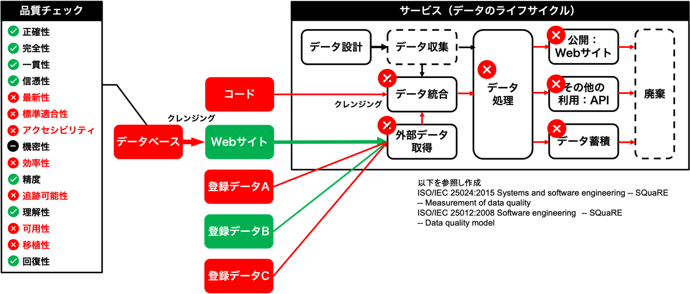
<figcaption> 図 1　品質に問題のあるデータがサービス全体に大きな影響を与える例 </figcaption> </figure>

品質に問題のあるデータが提供される状況でデータを利用していくには、機械処理や人力で、データの検証、変換、補完、突合等の処理（データクレンジング）を行い、データを整える必要があります。これらの工程は提供元で品質に問題のないデータを生成していれば不要のものです。品質について措置されていないデータを利用者が受け取ると、これらの工程に対するコストが都度かかることになり、それが積み上がった結果、社会的な経済損失が生じることになります。

また、最近ではビッグデータの解析やAIの活用など、データを活用した研究開発も進められています。このようにデータを応用する時にも、元のデータが正確でないと正しい結果を導けなくなってしまいます。

このような課題を解決するには、単にデータを集めるだけではなく、データ品質という観点での対応を行うことが必要です。

また、国際間のデータ流通にも配慮し、国際規格等を意識した対応を行うことも必要です。

一方で、政府におけるデータ品質の評価モデルが確立していないため、データの品質をどのように測定すれば良いかが分からないケースや、データの品質を向上させるために、どのような対策を採れば良いかが分からないという課題がありました。

さらには、政府全体でデータ流通に関する議論が高まり、DFFT（Data Free Flow with Trust）というように、単なるデータ自体の品質だけではなく、情報源、情報流通経路等の信頼性という観点からも、データ環境の整備が求められています。

### 1.2. 　目的

ありたい姿として、日本のデータ品質管理というブランドを確立し（データ品質の管理体系を整え）、国際間含めあらゆるデータ連携を効率的かつ安定して行えることが挙げられます。そのためには、日本国内においてデータ品質指標に関するコンセンサスが形成され、官民含めたデータオーナーが高品質のデータを提供できることにあります。本ガイドブックでは、データオーナーが上記を実現できるよう、以下の観点でデータ品質管理のフレームワークと評価モデルを示します。

* データの提供者や利用者が容易にデータ品質の評価を行えるようにする。
* データの提供者と利用者の間で品質の評価を共有できるようにする。
* 海外とのデータ連携や海外サービスによる利用の際にも活用できるようにする。

### 1.3. 　価値

データ利活用が社会活動の基盤となる中で、品質に問題のあるデータがあると、新たなサービスの創出にかかる時間やコストに悪影響を及ぼします。

特に、データクレンジングと言われるデータ品質の改善作業が、データ提供者側ではなくデータ利用者側で行われていることは、社会的な非効率につながります。

本来、データクレンジングはデータ提供側で行われるべき作業ですが、多くのデータオーナーがその問題やデータ品質管理の価値に気が付いていません。

データオーナーにとってのデータ品質管理の価値は以下のように整理されます。

* データ収集コストを低減できる。
* データ収集を迅速化できる。
* データ更新を容易にできる。
* データ更新にまつわる問題を回避できる。
* 内部でのデータ活用を容易にできる。
* データ公開を容易にできる。
* 利用者側でのデータ活用が進む。

### 1.4. 　方針

データの品質管理は、特定の時点で行うだけではなく、継続的に実施して品質の改善を図っていくものです。データ品質の評価モデルを中心に、図２に示すデータ品質管理フレームワークで改善を進めていきます。

<figure>
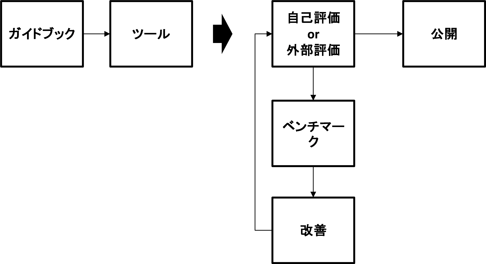
<figcaption> 図 2　データ品質管理フレームワーク </figcaption> </figure>

#### 1.4.1. 評価と結果の公開

データそのもの、データを利用したサービス及びデータを管理する組織の評価を行います。データを公開する場合には、利用者がそのデータの品質を事前に知ることができるように品質情報も併せて公開します。

#### 1.4.2. ベンチマークと改善

他組織のデータ品質やガバナンス体制をベンチマークとして比較することで、データ品質の改善案を検討します。また、評価結果により課題を明確化することで、品質改善対策を効果的に行うことができるようになります。

## 2. 　データ品質評価モデル

### 2.1. 　概要

データ品質の評価は、データそのものに対する評価だけでは不十分です。データを継続的に安定して活用するためには、その管理プロセスも含めて考えていく必要があります。例えば、データの収集から提供までの期間が長いと、収集時には正しいデータであっても、提供時には不適切なデータになってしまう可能性があります。

品質の高いデータを提供するためには、迅速かつ正確なデータ作成を継続的に行うためのプロセスや、それを実行する体制を整える必要があります。また、そのプロセスを現場に負荷をかけずに実施する、データのライフサイクルを通じたエコシステムの実現が必要になります。

また、データの品質は高ければ良いというわけではありません。製造物と同じように、品質を高めれば、それに伴いコストも高くなることに留意が必要です。さらに、データの提供者と利用者の間でデータ品質の考え方が異なると、提供者が自身の基準で高い品質のデータを提供しているつもりでも、利用者にとっては十分な品質ではないという認識の相違が発生します。データ品質を考える時には、利用目的に応じた適切なデータ品質を考えていく必要があります。

データ品質はデータマネジメントの重要な要素であり、国際的にはData Management Association International（DAMA-I）のデータマネジメント知識体系ガイド（DMBOK）やCMMI協会のデータ管理成熟度モデル（DMM）の中に位置付けられています。

本ガイドブックではデータ品質にフォーカスし、以下の国際標準をベースに、データ品質の評価、サービス品質の評価及び管理プロセスの評価の３つの視点から評価モデルを考えていきます。

* ISO/IEC 25012（データ品質の評価）
  * データそのものの品質
* ISO/IEC 25024（サービス品質の評価）
  * データを使ったサービス実現プロセスに関する品質
* ISO/TS 8000-61（データ管理プロセスの評価）
  * データの整備から活用までの管理プロセスに関する品質

### 2.2. 　評価方法

本ガイドブックでは、データ品質を単純に評価するだけではなく、各項目の評価に成熟度モデル（マチュリティモデル）を採用しています。

マチュリティモデルとは、減点法ではなく、ステップごとの目標レベルを定め、目標に対し現在どこに位置しているのか、次に何をやるべきかを見定められる形で成熟度を測るという評価方法です。

具体的な評価に当たっては、各評価項目それぞれの達成度を４つの成熟度レベルで評価します。各データが基本レベルに達することを目指して取組を進めていき、最終的には、サステイナブル・レベルを目指します。

* アドホック・レベル
  * 独自の方法で実施している。当該サービスの目的を達成するための基本機能が実装されていない。
  * データ作成者による改善がされなければ、データとして利用することが困難である。
* 部分対応レベル
  * 基本機能が一部で実装されている。
  * 利用者側にてある程度の修復が可能であり、限定的な範囲でデータとして利用可能である。
* 基本レベル
  * 基本機能が実装されている。
  * データとして利用可能な品質である。
* サステイナブル・レベル
  * 基本機能を継続的に提供し、フィードバックをかけている。
  * 継続性のあるデータ、コンピュータシステムとして統合が可能である。

さらに、各項目には基礎・応用・アドバンスド（評価モデルがないものでは無印）の３段階のレベル付けをしています。このレベルは重要度を表したものではなく、最初に達成すべき項目、次に達成すべき項目というように順を追って目標を広げていくためのものです。

なお、本ガイドブックで使用する成熟度モデルは、既存の具体的なデータの改善を主たる目的としているため、DMMの定義する抽象度の高い成熟度モデルとは異なる定義を使用しています。

### 2.3. 　データの評価

データ自体の品質の確保は、データライフサイクルにおけるプロセスの整備や管理体制の整備などにより実現されます。実際に活用するデータそのものの品質ですので重要な評価項目になります。ショッピングサイトでは、製品の評価と出店者の評価が行われますが、データの評価は、製品（特に原材料）の評価に相当するものです。

ただし、データ自体の評価は評価時点でのスナップショットにすぎず、品質の良いデータであり続けるためには、継続的にデータが更新される必要があります。ある時、品質の良いデータを提供したとしても、その後データの品質が下がってしまっては意味がありません。そのため、データの品質を繰り返し確認することが重要になります。

データの品質は、網羅性の確認等、コンピュータによる検証が有効な項目が多いため、積極的にコンピュータによる確認を導入するなどの対策が効果的です。

本ガイドブックでは、データ自体の品質を、ISO/IEC 25012に沿って評価します。

    1. 正確性 （Accuracy)
    2. 完全性 （Completeness)
    3. 一貫性 （Consistency)
    4. 信憑性 （Credibility)
    5. 最新性 （Currentness)
    6. アクセシビリティ （Accessibility)
    7. 標準適合性 （Compliance)
    8. 機密性 （Confidentiality)
    9. 効率性 （Efficiency)
    10. 精度 （Precision)
    11. 追跡可能性 （Traceability)
    12. 理解性 （Understandability)
    13. 可用性 （Availability)
    14. 移植性 （Portability)
    15. 回復性 （Recoverability)

#### 2.3.1. 正確性（Accuracy）：基礎

データの基本は正確であることです。データの正しさを以下の点に着目して評価します。

<u>評価項目</u>

* 書式が正しいか。
* 誤字脱字などはないか。
* 意味的な誤りがないか。
* データに誤りはないか。

<u>問題となる例</u>

* 「同上」、「〃」などの記述がある。
* 日付や数字が記述されるべき欄に「不明」など数字以外の文字列が記述されている。
* 住所が記述されるべき欄に電話番号が記述されている。
* フリガナ欄にカタカナとひらがなが混在している。

#### 2.3.2. 完全性（Completeness）：基礎

データは目的に応じて抜け漏れなくあることで、詳細な分析をすることができるようになります。データが完全であることを以下の点に着目して評価します。

<u>評価項目</u>

* 用途に応じて必要な項目が網羅されているか。
* 必須項目に空欄が含まれていないか。

<u>問題となる例</u>

* 重要なデータ項目が定義されていない。
* データが取得できないという理由で必須項目に空欄がある。

#### 2.3.3. 一貫性（Consistency）：基礎

データには整合性や一貫性が必要で、データ内の項目や値に矛盾があるとエラー処理をする必要があります。データに矛盾がないことを以下の点に着目して評価します。

<u>評価項目</u>

* データセット内でデータに矛盾はないか。
* データセット間でデータに矛盾はないか。

<u>問題となる例</u>

* 住所コードと住所が一致しない。
* 外部参照に間違いがある。
* 各項目の個別の値を集計した合計値と、元々データに含まれていた合計値が一致しない。

#### 2.3.4. 信ぴょう（憑）性（Credibility）：基礎

データは意思決定に使われることも多く、信頼できるデータである必要があります。データの信ぴょう性について以下の点に着目して評価します。

<u>評価項目</u>

* データの出所が明示されているか。
* データの更新日が明示されているか。
* 改ざん防止策が施してあるか。

<u>問題となる例</u>

* 特定のデータ作成者やデータ計測機器によるデータの誤りが複数発見された。
* データがいつ作成されたものか分からない。
* データの出典や収集方法が不明

#### 2.3.5. 最新性（Currentness）：基礎

データが最新のものに更新されていることで、誤処理や再処理を行う必要がなくなります。データが十分に新しいものに維持されていることを以下の点に着目して評価します。

<u>評価項目</u>

* 公開データの更新サイクルは元データの更新サイクルに対して適切か。
* データは収集時から十分に短い期間で公開されているか。
* ファイル等で提供される場合は、最終更新日時及び最新版の所在が明記されているなど、更新版の有無が確認できるようになっているか。

<u>問題となる例</u>

* データが更新されていない（データが古くなってしまった場合は、データの公開を終了することを検討する必要があります。）。
* 各年で取りまとめを行っているデータの公開に半年近くかかる。
* ダウンロードしたファイルの更新版の有無が確認できない。
* 最新のデータにおいて住所だけ古いまま掲載されている（例：東京市）。

#### 2.3.6. アクセシビリティ（Accessibility）：基礎

データを受け取った人がそのデータを活用できるようにする必要があります。データが誰でも使用できるものになっているかを以下の点に着目して評価します。

<u>評価項目</u>

* ファイルで提供している場合、データの使用権を持つ全ての人が利用できるようになっているか。
* ソフトウェアを通して提供している場合、そのソフトウェアはISO/IEC 40500 に準拠しているか。
* 使用している文字セット（常用漢字など）は正しいか。

<u>問題となる例</u>

* 特殊なファイル形式で公開されている。
* 常用漢字が定められているにも関わらず、それ以外の漢字がフリガナを伴わず使用されている。
* 環境依存の文字が使用されている。

#### 2.3.7. 標準適合性（Compliance）：基礎

データは入力ルールなどの一定のルールにより管理されており、そのルールを守ることで円滑に処理をすることができます。データが標準に適合しているかを以下の点に着目して評価します。

<u>評価項目</u>

* データの書式は標準に準拠しているか。
* 使用している文字セットは正しいか。
* 選択項目に、指定された選択肢以外のデータが入っていないか。

<u>問題となる例</u>

* 年月日が西暦ではなく和暦で表記されている（例：R2.4.1）。
* 環境依存の文字やユーザー定義文字が使用されている。
* 都道府県名が略称で表記されている（例：「東京都」と表記すべきところを「東京」と表記）。

#### 2.3.8. 機密性（Confidentiality）：基礎

データによっては機密情報を含むものもあり、目的に応じた機密性が確保される必要があります。データの機密性について以下の点に着目して評価します。

<u>評価項目</u>

* データにアクセスできるのは、アクセスを許可された者に限定されているか。
* 利用者を制限する場合、暗号化やハッキング対策などが行われているか。

<u>問題となる例</u>

* データを提供しているソフトウェアに脆弱性がある。
* データ管理ツールにおいて共有範囲が誤って設定されている。

#### 2.3.9. 効率性（Efficiency）：応用

データは効率的に処理される必要があり、そのためにコードを割り当てる等の対応をします。データの効率性について以下の点に着目して評価します。

<u>評価項目</u>

* データの内容に重複などがないか。
* データは効率的に処理できるようになっているか。
* コードを効果的に使用しているか。
* データに一貫性はあるか。

<u>問題となる例</u>

* データに全角と半角が混在するなど、データとデータを結び付ける際に正規化が必要となる。
* 住所とビル名が別データ項目になっていないなど、データ活用するために分離処理が必要になる。
* 表計算ソフトで作成されたデータに余分な罫線やスペースが入っている。
* 他のデータと結合しやすくするためのIDやコードが入っていない。

#### 2.3.10. 精度（Precision）：基礎

データには使用目的に応じて必要な精度があります。また、精度の違うデータを一体として扱う時に精度の調整が必要になります。データの精度について以下の点に着目して評価します。

<u>評価項目</u>

* データの精度は適正に設定されているか。
* データの精度がそろっているか。
* データの精度が示されているか。

<u>問題となる例</u>

* 各データが、小数点以下切捨て、小数点以下２桁まで記録など、精度にばらつきがあり、単純に加算できない。
* 許容誤差範囲が異なるデータが混在している。
* 正確な位置を特定する必要のあるデータにおいて、緯度経度の値が粗すぎる。

#### 2.3.11. 追跡可能性（Traceability）：応用

データに疑義が生じたりした時に、データの原典などを参照する場合があります。データの追跡可能性について以下の点に着目して評価します。

<u>評価項目</u>

* 外部データが明確になっているか。
* データの変更の際に、変更者、変更日などを記録しているか。

<u>問題となる例</u>

* 外部データの出所が明確になっていない。
* いつ、誰が変更したかが分からない。
* データの変更箇所や変更方法（例：機械処理なのか人手なのか）が不明

#### 2.3.12. 理解性（Understandability）：基礎

データを活用する時には、データの項目を正しく理解して活用する必要があります。利用者がデータについて理解できるかについて以下の点に着目して評価します。

<u>評価項目</u>

* データ全体及びその各項目が意味するものを利用者が理解できるようになっているか。
* データ全体や必要に応じてその各項目にメタデータが提供されているか。
* 共通語彙基盤[^1]のような意味を定めたものに関連付けがされているか。

<u>問題となる例</u>

* データの説明がなく、データが意味するものを正確に理解できない。
* 住所が本店所在地なのか、事業所所在地なのか判断できない。
* 記述されているコードや略称の意味する内容が不明

#### 2.3.13. 可用性（Availability）：基礎

データは必要な時に使えるようになっている必要があります。データが利用可能な状態になっているかを以下の点に着目して評価します。

<u>評価項目</u>

* 必要な時にいつでもデータにアクセスできるようになっているか。
* データを公開するシステムは常時稼働しているか。

<u>問題となる例</u>

* 頻繁にシステムが停止する。
* データ公開システムにアクセス可能な時間帯が限定されている。

#### 2.3.14. 移植性（Portability）：基礎

システムの入替えやシステム間の連携を行う際には、データを簡易に移行できる必要があります。データの移植のしやすさについて以下の点に着目して評価します。

<u>評価項目</u>

* 標準的なフォーマットで出力できないソフトウェアに依存していないか。
* データを管理するシステムから標準的な形式によりデータをエクスポートすることができるか。

<u>問題となる例</u>

* ソフトウェア固有のフォーマットでしか出力できない。
* PDFや画像データであるため再利用できない。
* システムからデータをエクスポートできない。

#### 2.3.15. 回復性（Recoverability）：基礎

データセンターなどで事故が起こった時に、そのデータが早急に復元される必要があります。データの回復性について以下の点に着目して評価します。

<u>評価項目</u>

* データのバックアップが保存されているか。
* システム障害が発生した場合であっても、継続してデータを提供するバックアップシステムが存在するか。

<u>問題となる例</u>

* バックアップされないディスク上にのみデータが保存されている。
* 特定のサーバーのみからしかデータが取得できない。

### 2.4. 　サービス品質の評価

データの利用を促進したり、高い品質のデータを作成し、その品質を維持したりしていくためには、データのライフサイクル全体において、正しいプロセスに従って作業を行うことが重要です。

サービスを提供するプロセスの品質を、データライフサイクルのステップごとにISO/IEC 25024の規定に沿って評価します。

<figure>
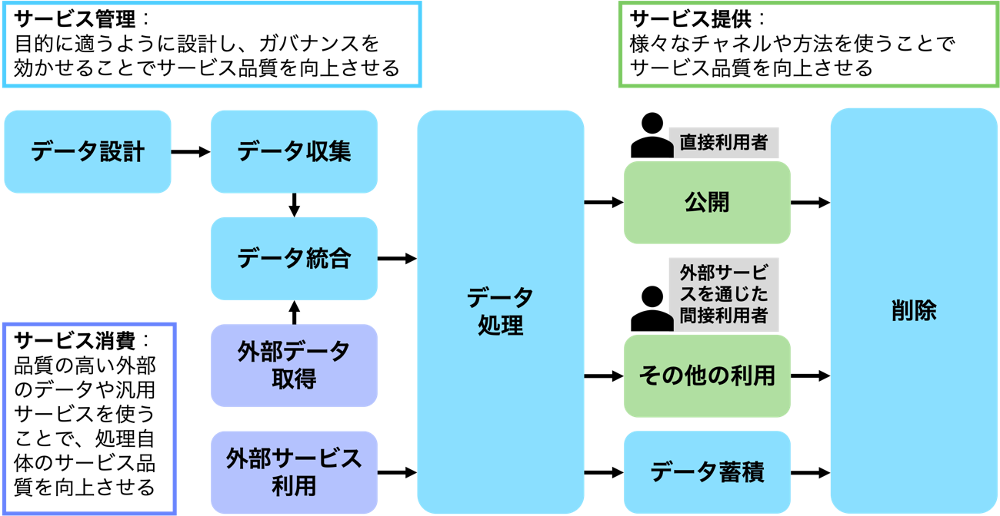
<figcaption> 図 3 データのライフサイクル </figcaption> </figure>

また、EC（European Commission）で検討されているデータの相互運用性のための品質モデルであるiMAPS（Interoperability Maturity Assessment of a Public Service）も参考に評価項目を検討します。

#### 2.4.1. データ設計

データ設計が適切に行われ、データの収集、管理、公開等の後続のプロセスの基盤が作られる必要があります。データ設計が正しく行われているかを評価します。

<u>評価項目</u>

* データ標準を参照して設計しているか。
* クラス図、ER図等の設計図を描いているか。

<u>問題となる例</u>

* 氏名を１つのデータ項目にしたため、他システムと連携できない。
* 住所に方書情報を含めてしまったため、ビル名の抜き出しができない。

#### 2.4.2. データ収集

サービスの中でデータを利用者から収集する場合があり、そのプロセスでは誤データの登録を防ぐ必要があります。こうした観点を考慮したデータ収集の仕組みが整備できているかを評価します。

<u>評価項目</u>

* 入力フォーム又はファイルのアップロード機能を適切に使っているか。
* 入力項目においてバリデーションをしているか。
* 選択項目は、入力方法を選択式にしているか。

<u>問題となる例</u>

* 半角で入力されるべき電話番号欄に、全角の電話番号が入力されている。
* 住所のうち市町村名を入力し忘れている。

#### 2.4.3. データ統合

複数データの統合時に、データ項目のマッチング、精度や単位の確認、コードのコンバージョンなどを正確に行う必要があります。データ統合時に品質の劣化を起こさない仕組みが整備できているかを評価します。

<u>評価項目</u>

* 重複データの確認プロセスがあるか。
* コード変換表など統合に関する情報を公開しているか。
* 統合元データの出所を明確にしているか。

<u>問題となる例</u>

* 有効数字の違う数字を単純に加算してしまう。
* コード変換表を公開していないので、詳細分析ができない。
* 同一名の別法人のデータを結合してしまう。

#### 2.4.4. 外部データ取得

サービスに外部データを活用する時は、最終的なサービスの品質を高くするため、品質の高いデータを採用するとともに、データクレンジングなどによりデータの品質向上を図る必要があります。外部データから品質の高いデータを取り込む仕組みが整備されているかを評価します。

<u>評価項目</u>

* 外部データの評価をしているか。
* 外部データが十分な品質を持っているか。

<u>問題となる例</u>

* 外部データに間違いが多数含まれ、データ全体の信頼性を下げている。

#### 2.4.5. 外部サービス利用

データの作成やサービス提供において、外部のサービスを効果的に利用することで、全体として質の高いサービスとなるとともにコストを抑制することができます。外部のサービスを効率的に利用しているかを評価します。

<u>評価項目</u>

* リアルタイムとバッチのプロセスが適切に使われている。
* APIを経由して使用している。
* クラウド等の適切なネットワークインフラを活用している。
* 例外処理のプロセスが定義され、デジタルで処理されている。

以下は、ベース・レジストリ[^2]として基本情報が提供されている場合の評価項目です。

* ベース・レジストリの活用をして確認された正しい情報を参照／利用している。

以下は、当該サービスを必要とする場合に、独自に構築せずに外部で提供されている共通サービスを使っているかの評価項目です。

* 共通認証サービスを活用している。
* 共通請求サービスを活用している。
* 共通支払サービスを活用している。
* 共通申請サービスを活用している。
* 共通証明サービスを活用している。
* 共通通知サービスを活用している。
* 翻訳サービスを活用している。
* アクセス分析サービスを活用している。

<u>問題となる例</u>

* 認証サービスを、独自にコストをかけて開発したのに利用者の満足度が低い。

* ベース・レジストリを活用していないために、データの不備や他のデータとの不整合が生じてしまっている。

#### 2.4.6. データ処理（サービス内容）

データを処理することにより価値を生み出すことが重要です。また、コストに見合った処理をする必要があります。サービス内でのデータの処理やサービス品質に関する評価をします。

<u>評価項目</u>

* サービスが安定的に提供されている。
* コスト効果分析をしている。
* サービスの利用拡大策を提供している。
* サービス提供の責任部署を明確にしている。
* 外部からの利用要求に自動で対応している。
* サービス提供状態の公開をしている（月次アクセス状況等）。
* ビジネスプロセスを定義しルール化している。
* ビジネスプロセスをモデル化している標準を使っている。
* ビジネスプロセスのモデルに標準技法を使っている。
* アーキテクチャを定義して活用している。

<u>問題となる例</u>

* サービス提供の責任部署が明確になっておらず、データの更新が滞ってしまう、質問に回答できないなどの問題が生じている。

#### 2.4.7. データ提供

サービスの品質を高めるには、データの品質だけではなく、その公開方法やAPI等による提供方法が重要になります。データ提供方法についての評価を行います。

<u>評価項目</u>

* 画面からのデータ提供（UI/UX）に関する評価をしている。
* APIなどの機械からのデータ提供に関する評価をしている。
* デバイスやブラウザ依存がない。
* プレプリント、自動入力等、既存データを使って自動入力できる。
* マルチリンガルに対応している。
* 他サービスの参照を実施している。
* サービス・カタログ[^3]等の利用者に分かりやすい標準的なサービスメニューを提供している。

<u>問題となる例</u>

* データは公開されているが、利用者が見つけられない又は利用者にデータについて正しく理解されない。
* 一部のWebブラウザでは正しく表示することができない。
* サービス・カタログが活用されていないために利用者がデータを見つけることができない。

#### 2.4.8. データ蓄積

データは蓄積するだけではなく更新を行う必要があります。更新の仕組みが整備されているかを評価します。

<u>評価項目</u>

* データに変更があった時に更新を実施しているか。
* データの中の住所表記などが新しくなった時に更新する仕組みがあるか。

<u>問題となる例</u>

* 住所移転したのに変更届が出されていない。
* 住所表記が最新のものになっていない。

#### 2.4.9. データ廃棄

廃棄（削除）についてはデータ品質に関連する事項はありません。

### 2.5. 　データ管理プロセスの評価

データ品質やサービス品質を維持、向上していくためにはデータ管理プロセス及び運用体制が重要になります。ISO/TS 8000のデータクオリティのプロセス管理の規格であるPart 61に沿って評価します。

<figure>
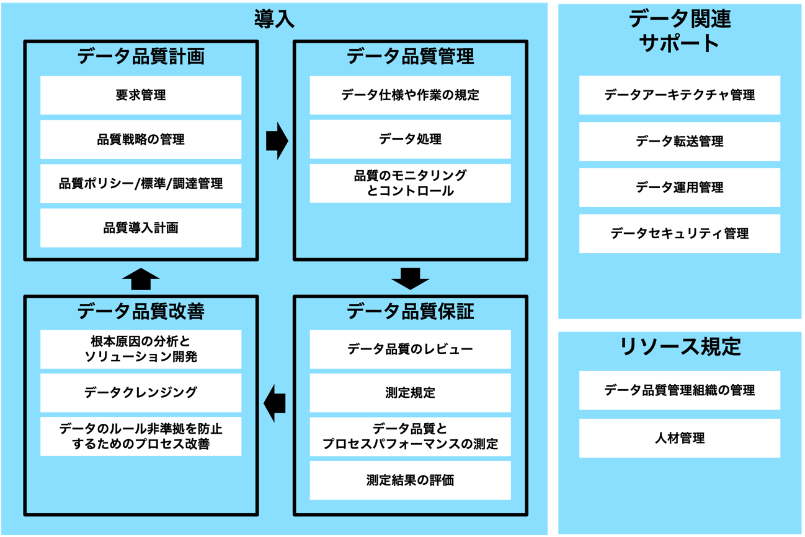
<figcaption> 図 4　ISO8000-61　データ品質管理の詳細構造 </figcaption> </figure>

#### 2.5.1. データ品質計画

データの品質を維持・管理していくためには、計画を立てて実行することが重要です。データ品質管理が計画的に行われているかを評価します。

<u>評価項目</u>

* データ品質に対する要求の管理を実施しているか。
* データ品質を維持・向上させる戦略の管理ができているか。
* データ品質ポリシー／標準／調達管理等のルール化ができているか。
* データ品質導入計画を策定しているか。

<u>問題となる例</u>

* 品質の要求要件や基準が明確になっていないため、何から手を付けて良いのか分からない。

#### 2.5.2. データ品質管理

データの品質を維持・管理していくためには、データ品質計画に基づいて具体的な運用マニュアル等を整備することが必要になります。データ品質の管理や制御（コントロール）が行われているかを評価します。

<u>評価項目</u>

* データ仕様や作業の規定ができているか。
* データ処理が正しく行われているか。
* データ品質モニタリングとコントロールができているか。

<u>問題となる例</u>

* データ品質の維持のための具体的な作業が明確になっていない。

#### 2.5.3. データ品質保証

追加・更新・削除などにより、データは常に変化していきます。そのため、随時データの品質を計測し、その結果をプロセスや運用マニュアルに反映していくことが必要になります。データ品質管理の運用を通じた課題などを検討する品質保証の仕組みがあるかどうかを評価します。

<u>評価項目</u>

* データ品質のレビューのプロセスがあるか。
* データ品質を測定する規定があるか。
* データ品質とプロセスパフォーマンスを測定しているか。
* 測定結果の評価をしているか。

<u>問題となる例</u>

* データ品質の測定を実施していない。

#### 2.5.4. データ品質改善

データ品質測定により、問題が検出された際には、品質の改善とともに原因を特定し再発防止策を講じる必要があります。データの品質改善の仕組みがあり、運用されているかを評価します。

<u>評価項目</u>

* データ品質に関する問題の根本的な原因の分析と解決に向けた対策を行っているか。
* 更なる改善のためのデータクレンジングをしているか。
* データのルール非準拠を防止するためのプロセス改善をしているか。

<u>問題となる例</u>

* 測定結果を具体的にプロセスに反映していない。

#### 2.5.5. データ関連サポート

データの提供に当たっては、安定した提供を行うとともに、セキュリティを維持するなど利用者が安心して活用できるように運用を管理する必要があります。データ品質管理に関連する仕組みが整備されているかを評価します。

<u>評価項目</u>

* データアーキテクチャを策定し管理しているか。
* データ転送の関係性などを管理しているか。
* データ運用の管理ルールを定めているか。
* データセキュリティを管理しているか。

<u>問題となる例</u>

* データの運用が止まっているが、指摘されるまで気が付かない。

#### 2.5.6. リソース規定

データの品質、提供システムの品質などを維持するためには、データ作成のプロセスや運用管理を行う責任部署及び担当者を配置し明確にしておくことが必要です。また、サービスによるデータ活用には切れ目がありません。人員の異動などに伴うサービス低下が起こらないよう規定を明確にし、円滑な引継ぎを行える体制を整えておく必要があります。データの品質管理をする体制を運用する仕組みがあるかを評価します。

<u>評価項目</u>

* データ品質管理体制が管理されているか。
* データ品質管理に関する人材管理や訓練が行われているか。

<u>問題となる例</u>

* 人員異動に際して引継ぎが十分でなく、サービスレベルや品質が低下してしまう。
* データ品質管理の担当者が明確になっていない。

## 3. 　データ品質評価の実施

データ品質評価を実施することで、データ関連サービスの課題を明確にするとともに、他サービスと比較することでベンチマークをすることができます。

本ガイドブックに沿ってデータ品質ができる評価ツールを提供します。ツールは成熟度モデルとなっており、各項目の質問に対する実現レベルを答え、その具体的根拠を記述していくことで継続的な改善を図ることができます。

また、可視化することで全体としてのバランスも見ることができます。

定期的に実施し、その改善状況を公開するとともに、改善計画などを策定していくことが重要になります。

<figure>
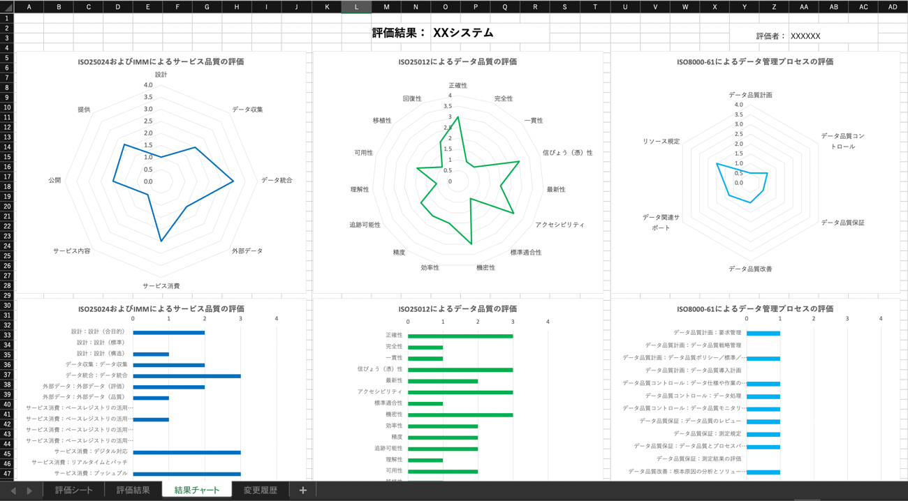
<figcaption> 図 5 データ品質評価ツールの結果表示例 </figcaption> </figure>

データ品質評価ツールの全部を使う必要はありません。評価したい品質内容に応じて評価項目を選択してください。

### 3.1. 　データの評価実施

データ品質評価ツールの「データ品質評価（ISO25012）」を使用してください。

1.  評価対象データを選択します。初めて評価をする時は、評価対象にマスターデータ系を選択することを推奨します。特に、データ修正などのエラー処理や修正手順が発生しているデータを評価対象にします。
2.  評価表の項目に答えていきます。分からない場合は未回答で結構です。未回答も一種の回答になります。評価対象データが評価項目対象外の場合には、対象外と答えてください。
3.  評価実施中や評価結果により、どの分野に改善の余地があるかを把握します。
4.  他のデータの評価結果とベンチマークをすることで更なる改善点を検討します
5.  改善点に対して対策を検討します

例えば登録企業管理マスターファイルの評価をすると、企業の住所が更新されていないことがある、設計時にデータ項目を用意しているのに活用できていない等の課題が明確になります。

### 3.2. 　サービス品質の評価

データ品質評価ツールの「サービス品質評価（ISO25024及びiMAPS）」を使用してください。

1.  評価対象サービスを選択します。初めて評価をする時は、評価対象にデータ修正などのエラー処理や修正手順が発生しているサービスを評価対象にすることを推奨します。
2.  評価表の項目に答えていきます。分からない場合は未回答で結構です。未回答も一種の回答になります。評価対象データが評価項目対象外の場合には、対象外と答えてください。
3.  評価実施中や評価結果により、どの分野に改善の余地があるかを把握します。
4.  他のサービスの評価結果とベンチマークをすることで更なる改善点を検討します。
5.  改善点に対して対策を検討します。

例えば旅費精算サービスの評価をすると、旅費入力時に間違いが多いなどの課題が明確になります。登録企業向けサービスでは、送付物の返送が多い場合は、登録企業のマスターファイル自体が更新されていなかったり、住所の検証に使用している住所マスターファイルの品質に問題があったりすること等が明確になります。

### 3.3. 　データ管理プロセスの評価

データ品質評価ツールの「データ管理プロセスの評価（ISO8000-61）」を使用してください。組織全体を評価するので、情報システム部門やデータ管理部門が使用します。

1.  評価表の項目に答えていきます。分からない場合は未回答で結構です。未回答も一種の回答になります。評価対象データが評価項目対象外の場合には、対象外と答えてください。
2.  評価実施中や評価結果により、どの分野に改善の余地があるかを把握します。
3.  他の組織の評価結果とベンチマークをすることで更なる改善点を検討します。
4.  改善点に対して対策を検討します。

例えば、データ品質の改善目標が設定されず、漫然とデータ品質が放置されている等の課題が明確になります。

## 4. 　データ品質改善への工夫

### 4.1. 　データ標準の活用

データ設計時にデータ標準を活用することで、設計品質や相互運用性の高いデータ設計をすることができます。

データ設計に当たっては、GIF（Government Interoperability Framework: 政府相互運用性フレームワーク）などに内包されている行政データ連携標準、IMI共通語彙基盤、推奨データセットやschema.org等を参考にすることができます。

### 4.2. 　データ入力フォームの活用

データ入力フォームを使うことで、データ収集時のデータ形式の揺らぎや誤データの混入を防ぐことができます。フォーム作成の外部サービスを、目的、データのセキュリティレベルに合わせて選択して活用することも検討します。

### 4.3. 　コードやコントロールド・ボキャブラリの活用

選択肢があるデータ項目は、自由記述ではなく、コード入力や選択肢入力にすることで誤データの混入を防ぐことができます。ただし、東京都と入力する代わりに東京都の地方公共団体コードを入力してくださいというのは利用者には不便ですので、選択肢で東京都を選択するとデータにはコードが書き込まれるといった工夫をしていくことが重要です。この時の選択肢のことをコントロールド・ボキャブラリと呼びます。

コードやコントロールド・ボキャブラリは、データ設計時に独自に設定するのではなく、できるだけ標準的な選択肢を設定してください。そうすることで、他データとの連携も容易に行えるようになります。また、コントロールド・ボキャブラリを作る時には、データ項目定義を明確にすることが必要です。他データと連携する時に検討が容易になります。

コードやコントロールド・ボキャブラリは、国際標準、総務省統計局などのコード一覧等で整理されている既存の体系をできるだけ引用するようにしてください。

### 4.4. 　データクレンジングツールの活用

データのクレンジングには、機械的に処理できる工程がたくさんあります。OpenRefineやIMIコンポーネント等のツールを必要に応じて活用してください。ただし、ツールを使って一括処理する際には、誤変換を起こさないように細心の注意を払う必要があります。

紙のデータをOCRやパンチでデジタル化したデータは、誤データが含まれる可能性があることから、既存のデータとの照合、計算による検証、他社のOCR結果と認識結果の照合をする等、必要に応じて確認プロセスを検討します。

## 5. 　解説

### 5.1. 　国際標準の採用における考え方

本ガイドブックにおいては、できる限りシンプルな評価モデルにすることで、自己評価だけでなく第三者による外形評価も可能とするために、国際標準を網羅する方向ではなく、必要最低限と考えられるものを厳選して利用する方針を採っています。

本ガイドブックは主に行政サービスの品質向上に向けてデータの品質向上を図ることを目的としていることから、ソフトウェア製品の品質要求仕様を規定し、品質の測定と評価を行うために策定された国際標準であるISO25000 Systems and software Quality Requirements and Evaluation（SQuaRE）シリーズにフォーカスし、データ品質モデルを規定する「ISO/IEC 25012:2008 Software engineering -- Data quality model」及びデータを使ったサービス提供品質を測る規格である「ISO/IEC 25024:2015 Systems and software engineering -- Measurement of data quality」を採用しました。また、データそのものやサービスの評価のみではなく、データの管理プロセスも評価可能にするために、ISO8000 Data qualityのうち、「Part 61： Data quality management： Process reference model」を採用しました。

サービス品質については、公的機関が提供するサービスの相互運用性を評価するための品質モデルであるiMAPSも参考に評価項目の検討を行いました。

### 5.2. 　ISO25000 Systems and software Quality Requirements and Evaluation（SQuaRE）

ソフトウェア品質向上のための国際標準です。ここでの「ソフトウェア品質」は、「明示された状況下で使用された時、明示的ニーズ及び暗黙のニーズをソフトウェア製品が満足させる度合い」と定義されます（JIS X25010 品質モデル）。SQuaREシリーズは、2500n：品質管理部門、2501n：品質モデル部門、2502n：品質測定部門、2503n：品質要求部門及び2504n：品質評価部門の５つの部門並びに2505nから2509nまでの拡張部門から構成されます。

本ガイドブックでは、SQuaREシリーズのうちデータ品質を評価するための標準であるISO25012のデータ品質モデル及びISO25024によるデータ品質測定を採用しました。

#### 5.2.1. 全体構成

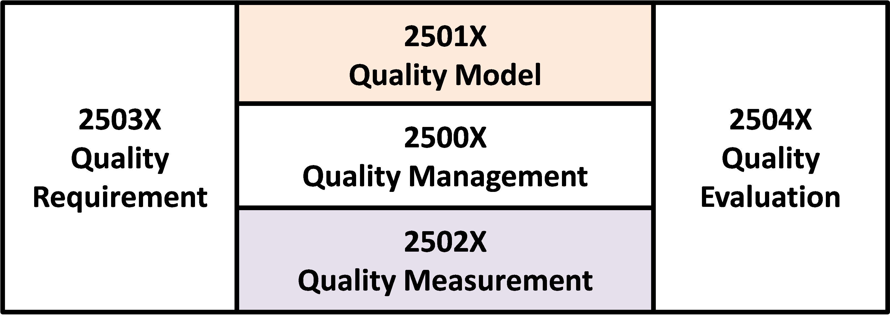

#### 5.2.2. ISO/IEC 25012:2008 Software engineering -- Data quality model

データ自体の品質を測る項目を定義しています。

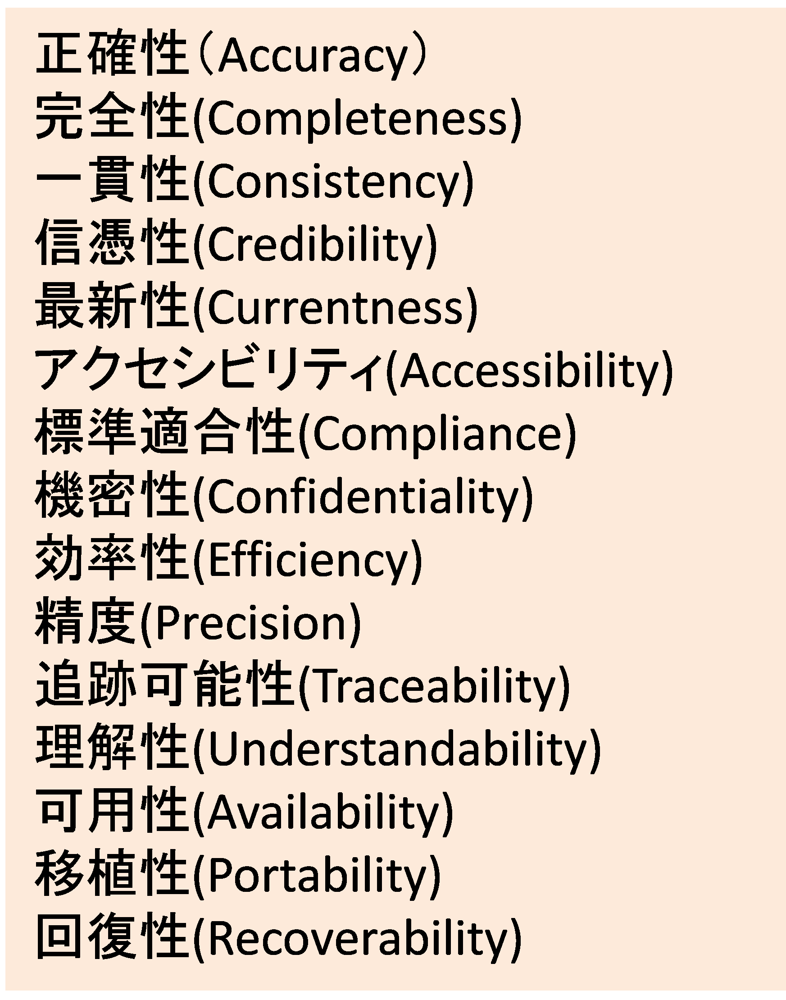

#### 5.2.3. ISO/IEC 25024:2015 Systems and software engineering -- Measurement of data quality

データ生成から廃棄までの各手順におけるデータ品質を測るための標準です。

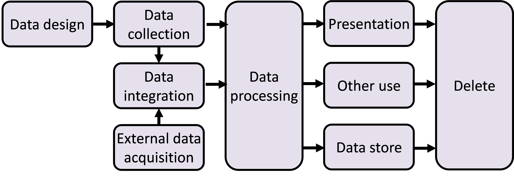

### 5.3. 　ISO8000 Data quality 　

データ品質を取り扱うための規格群として開発された国際標準です。ISO8000の適用範囲は「データ品質に関係するデータの諸特性を定義し、これらのデータ諸特性に適用されるべき要求事項を規定し、データ品質の改善に関わる指針を提供するもの」と定義されています。下記の４つの部から構成されます。

* Parts 1 to 99： General data quality（データ品質一般）
* Parts 100 to 199： Master data quality（マスターデータ品質）
* Parts 200 to 299： Transaction data quality（商取引の個別場面での交換データの品質）
* Parts 300 to 399： Product data quality（製品データ品質）

　本ガイドブックでは、ISO8000のうち、データの管理プロセスを評価するために「Part 61： Data quality management： Process reference model」を採用しました。

#### 5.3.1. 全体像

データマネジメントの体系は、以下のような関係性です。

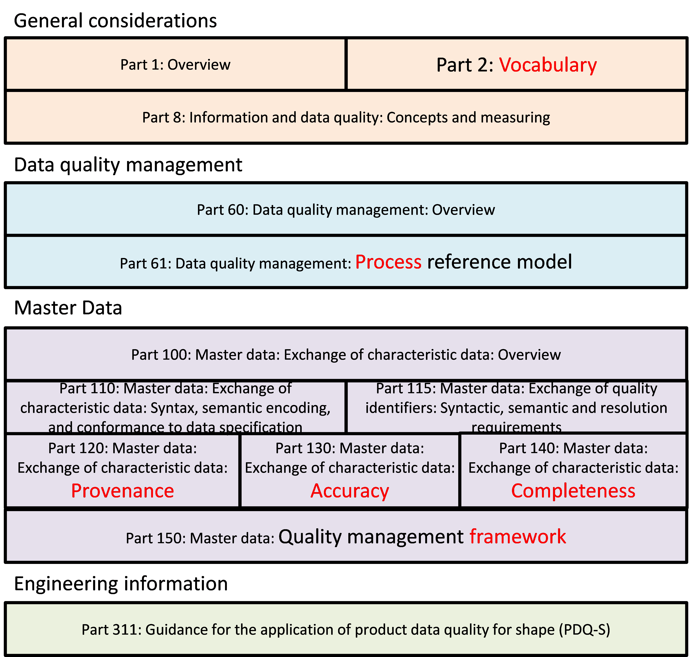

#### 5.3.2. Part 61: Data quality management: Process reference model

データ品質管理プロセスを構成するPart 61は、データ品質管理の中核として活用されています。

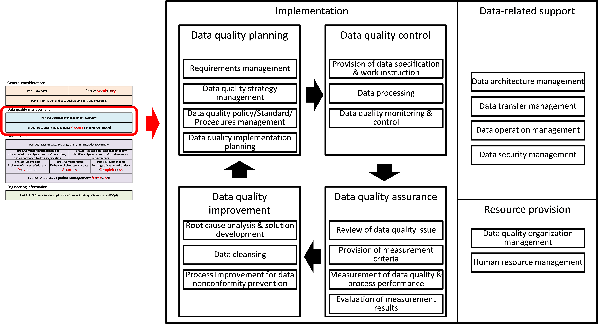

#### 5.3.3. Part 150: Master data: Quality management framework

マスターデータ管理に関する人材像と役割は、以下のように整理されます。

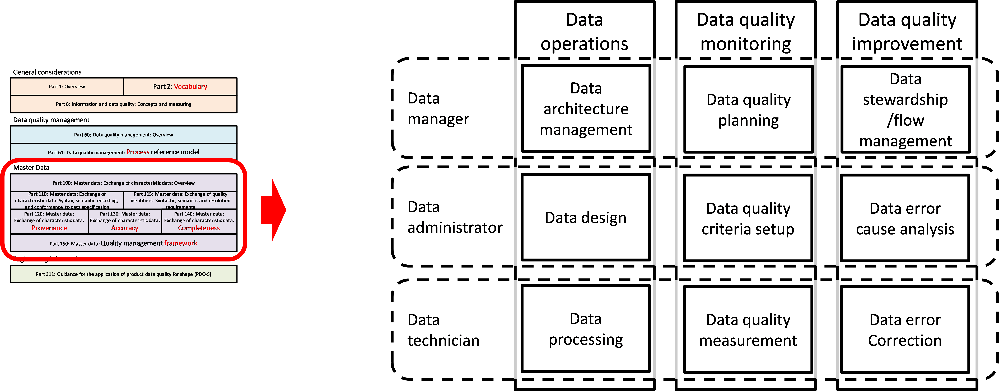

### 5.4. 　iMAPS（Interoperability Maturity Assessment of a Public Service）

公的機関が提供するデジタルサービスの相互運用性の成熟度を評価するための品質モデルです。EC（European Commission）において検討が進められています。

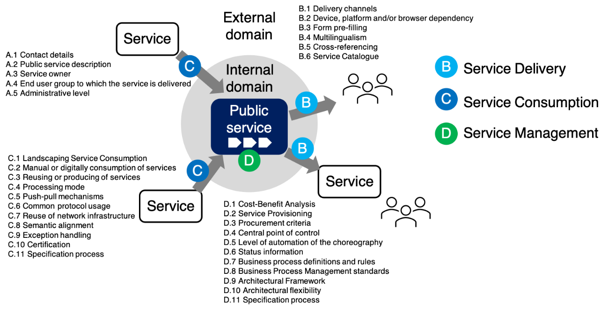

[^1]: 情報処理推進機構が提供する共通的なデータ項目を定義するための基盤。

[^2]: 行政機関等公的機関が提供する正式なデータ。デジタル時代の台帳であり、今後、提供が予定されている。

[^3]: サービス・カタログとは、行政サービスの基本的な分類。今後提供される予定。データを探す時の索引情報になる。

