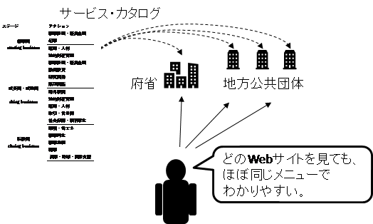
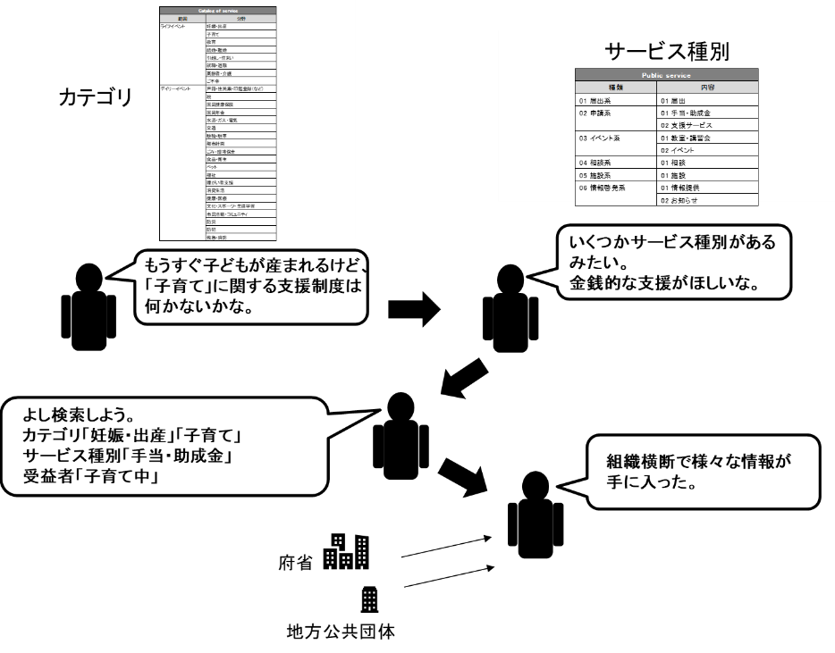
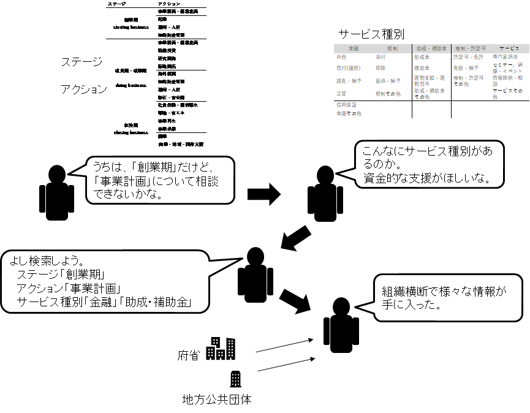
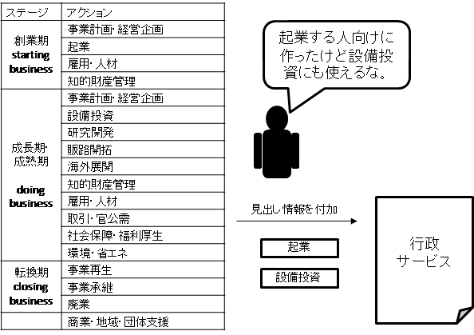
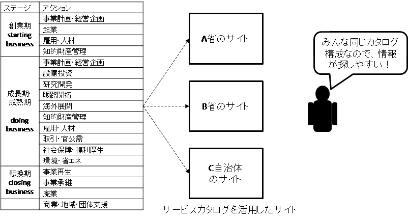
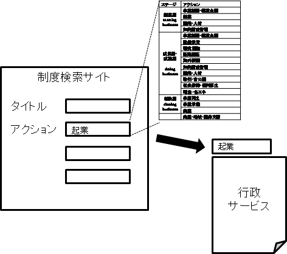
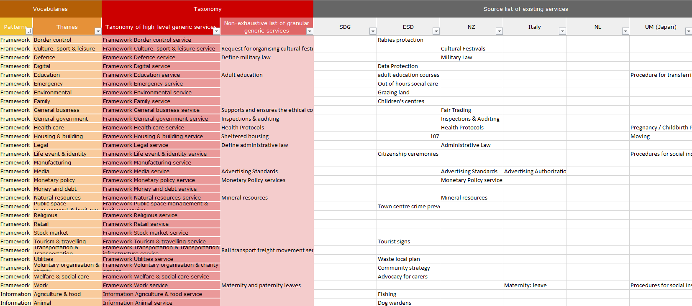

# コード サービスカタログ <!-- omit in toc -->

デジタル社会推進実践ガイドブック DS-491-1

2022年（令和4年）3月31日

デジタル庁

-----
**[キーワード]**

個人、法人、サービスカタログ、メニュー、行政サービス

**[概要]**

個人、法人に関する行政サービス情報を効率的に提供するための行政サービスのメニューであり分類を示すガイドブック。このガイドに従いサービス情報の提供を行うことで、組織横断での情報検索を容易にすることができます。

※個人向けのサービスカタログは、一般社団法人ユニバーサルメニュー普及協会が提唱する、市民向けのユニバーサルメニュー、及びユニバーサルメニュータグを参考にして作成したものです。

<figure>

<figcaption>
</figcaption>
</figure>

-----
## 改訂履歴 <!-- omit in toc -->

| 改訂年月日    | 改訂箇所 | 改訂内容   |
|---------------|----------|------------|
| 2022年3月31日 | 全体     | 正式版決定 |
| 2021年6月4日  | -       | β版公開    |

-----
## 目次 <!-- omit in toc -->
- [1. 背景と課題](#1-背景と課題)
  - [1.1. 背景](#11-背景)
  - [1.2. 課題](#12-課題)
  - [1.3. 投資対効果](#13-投資対効果)
- [2. 目的と概要](#2-目的と概要)
  - [2.1. 目的](#21-目的)
  - [2.2. 概要](#22-概要)
    - [2.2.1. 個人向けサービスカタログ](#221-個人向けサービスカタログ)
    - [2.2.2. 法人向けサービスカタログ](#222-法人向けサービスカタログ)
- [3. 個人向けサービスカタログのデータモデル](#3-個人向けサービスカタログのデータモデル)
  - [3.1. カテゴリ（ライフステージ分類）](#31-カテゴリライフステージ分類)
  - [3.2. お困りごと分類](#32-お困りごと分類)
  - [3.3. サービス種別](#33-サービス種別)
  - [3.4. 受益者種別](#34-受益者種別)
- [4. 法人向けサービスカタログのデータモデル](#4-法人向けサービスカタログのデータモデル)
  - [4.1. 事業ステージ分類](#41-事業ステージ分類)
  - [4.2. お困りごと分類](#42-お困りごと分類)
  - [4.3. サービス種別](#43-サービス種別)
- [5. 活用場面イメージ](#5-活用場面イメージ)
  - [5.1. 行政サービスを作るとき](#51-行政サービスを作るとき)
  - [5.2. Webサイトを作るとき](#52-webサイトを作るとき)
  - [5.3. 検索サービスを作るとき](#53-検索サービスを作るとき)
- [6. 解説](#6-解説)
  - [6.1. データ標準](#61-データ標準)
  - [6.2. 本サービスカタログの検討方法](#62-本サービスカタログの検討方法)

-----
## 1. 背景と課題

### 1.1. 背景

各行政機関では類似のサービスを提供していることがあります。その分類はそれぞれの機関で様々であり、サービスの検索や比較が困難でした。最近では、サービス間の連携の動きが進んでいますが、各機関が独自にサービスを分類しているため、効率的に整理することも困難でした。

諸外国でも同様の問題が起こっており、欧州では欧州委員会（EC）が中心になり各国の分類の整理や自治体とも共通的に使えるサービスカタログの整備を行っています。米国では、2000年頃に政府の業務の分類であるLoB（Line of Business）が予算の重複などを防止するために導入されましたが、内容が細かすぎる等の課題があり現在では使われていません。日本も米国のLoBを参考に業務分類を整備しましたが、システム管理の一部に使用しているだけで現在はほぼ使われていません。

### 1.2. 課題

各行政機関で提供されているサービスを見つけられないため、利用者が本来享受できるサービスが受けられないことがあり、また、政策的に実施しているサービスが対象者に伝わらないなどの問題が起こっています。例えば、引っ越しをすると引っ越し先の自治体でこれまで使っていたサービスに関する情報が見つけられない等の不便がありました。

また、自分が利用できるサービスを探そうとするときにも、各県及び各市区町村でその分類方法が違うため、必要な情報を効率的に収集することが困難でした。

* 利用者にとっての課題
     * 行政サービスを見つけられない
     * 他の行政機関のサービスと比較できない
     * 行政サービスの情報が不充分（対象者情報や支援内容がわからない）
* 行政職員にとっての課題
     * 他の自治体のサービスと比較しようとしても見つけられない

### 1.3. 投資対効果

情報が適切に整理されていないと、個人が自分に適したサービス情報を入手するのに多くの時間を費やすことになります。これまでは、特に地方公共団体のWebサイトが整理されていないことで、自分が必要としているサービス情報にたどり着くまでに時間がかかっていました。一定の形式に沿って作成されたカタログを整備することで各種情報を検索することが容易になり、良質な利用者体験を提供することができるだけでなく、最新情報の配信を受けることで、利用の機会を増大させることができます。行政サービスの提供側もサービスカタログの利用を促進することで政策効果を出しやすくなります。

法人も、サービス情報を入手するのに多くの時間を使っていました。特に複数の地方公共団体に拠点を持つ法人は、各地方公共団体の情報を探す必要があり、時間がかかっていました。カタログを整備することにより各種情報の検索することが容易になり、検索コストを下げることができます。最新情報の配信も行うことが可能になります。

-----
## 2. 目的と概要

### 2.1. 目的

本データモデルは、行政機関が共通的に活用できるサービスカタログを提示することによりWebサイトや各種ガイドの目次の共通化を図り、行政サービスを見つけやすくするとともに、比較ができるようにすることを目指します。別途提供する行政サービスのデータモデルと組み合わせることにより、行政サービスや制度を見つけやすくするだけでなく、情報内容を伝わりやすくし、さらに、重複サービスの確認や、複数組織による業務の連携を促進します。これらを通じて社会全体を活性化することを目指します。

### 2.2. 概要

各行政機関が提供するサービスのメニュー分類項目が統一された場合、利用者はどのサイトでも分類をもとに情報が探しやすくなります。

<figure>

<figcaption>
図 1　サービスカタログのイメージ
</figcaption>
</figure>

#### 2.2.1. 個人向けサービスカタログ

個人向けのサービスカタログのデータモデルは、人生における大きな出来事を示すライフイベントと日常の生活の中で起こりうる出来事を示すデイリーイベントから構成される「カテゴリ」、そこで提供される行政サービスの種類である「サービス種別」、そのサービスの対象となる「受益者」の3要素で構成されます。

各行政サービスは、この3要素のタグを付加することで、検索性を向上させることができます。また、利用者は事前登録をしておくことで、関連情報の配信を受けることができるようになります。

<figure>

<figcaption>
図 2　サービスカタログを使った情報検索の流れ(個人)
</figcaption>
</figure>

さらに、受益者のタグを活用することで、利用者の属性に応じたきめ細やかな検索を実現することができます。

#### 2.2.2. 法人向けサービスカタログ

法人向けのサービスカタログは、法人の事業ステージを示す「ステージ」と、各法人がステージ内で実施する「アクション」、そこで提供される行政サービスの種類である「サービス種別」の3要素で構成されます。

各行政サービスは、この3要素のタグを付加することで検索性を向上させることができます。また、利用者は事前登録をしておくことで、関連情報の配信を受けることができるようになります。

<figure>

<figcaption>
図 3　サービスカタログを使った情報検索の流れ(法人)
</figcaption>
</figure>

この3情報に加えて、産業分類や、従業員数等の情報を活用することで、さらに情報を絞り込むことができます。

------
## 3. 個人向けサービスカタログのデータモデル

### 3.1. カテゴリ（ライフステージ分類）

個人向けのカテゴリは、人生の出来事であるライフイベントと、日常の出来事であるデイリーイベントで構成されます。

| ステージ | アクション（分野） |
|---------|-------------------|
| ライフイベント | 妊娠・出産 |
| ライフイベント | 子育て |
| ライフイベント | 教育 |
| ライフイベント | 結婚・離婚 |
| ライフイベント | 引っ越し・住まい |
| ライフイベント | 就職・退職 |
| ライフイベント | 高齢者・介護 |
| ライフイベント | ご不幸 |
| デイリーイベント | 戸籍・住民票・印鑑登録（など） |
| デイリーイベント | 税 |
| デイリーイベント | 国民健康保険 |
| デイリーイベント | 国民年金 |
| デイリーイベント | 水道・ガス・電気 |
| デイリーイベント | 交通 |
| デイリーイベント | 駐輪・駐車 |
| デイリーイベント | 都市計画 |
| デイリーイベント | ごみ・環境保全 |
| デイリーイベント | 食品・衛生 |
| デイリーイベント | ペット |
| デイリーイベント | 福祉 |
| デイリーイベント | 障がい者支援 |
| デイリーイベント | 消費生活 |
| デイリーイベント | 健康・医療 |
| デイリーイベント | 文化・スポーツ・生涯学習 |
| デイリーイベント | 市民活動・コミュニティ |
| デイリーイベント | 防災 |
| デイリーイベント | 防犯 |
| デイリーイベント | 救急・消防 |

### 3.2. お困りごと分類

行政サービスを必要とするお困りごとの分類は以下のように分かれます。

| 分類 |
|---|
| 住まい |
| 仕事 |
| 医療福祉 |
| 子育て・教育 |
| お金 |
| その他暮らしに関すること |

### 3.3. サービス種別

行政サービスの種類は以下のように分かれます。

| 種類 | 内容 |
|---|---|
| 届出系 | 届出 |
| 申請系 | 手当・助成金 |
| 申請系 | 支援サービス |
| イベント系 | 教室・講習会 |
| イベント系 | イベント |
| 相談系 | 相談 |
| 施設系 | 施設 |
| 情報啓発系 | 情報提供 |
| 情報啓発系 | お知らせ |

### 3.4. 受益者種別

当該サービスの受益対象となる属性は以下のように分かれます。

| 種類 | 内容 |
|---|---|
| 本人 | 妊産婦 |
| 本人 | 子育て中 |
| 本人 | ひとり親 |
| 本人 | 学生 |
| 本人 | 独身者 |
| 本人 | 求職者 |
| 本人 | 就業者 |
| 本人 | 高齢者 |
| 本人 | 遺族・遺児 |
| 本人 | 被災者 |
| 本人 | 犯罪被害者 |
| 本人 | 外国人 |
| 本人以外 | 子ども |
| 本人以外 | 未熟児 |
| 本人以外 | 障がい児 |
| 本人以外 | 被介護者 |
| 本人以外 | 障がい者 |
| 本人以外 | ペットの飼い主 |

-----
## 4. 法人向けサービスカタログのデータモデル

### 4.1. 事業ステージ分類

事業者のライフサイクルは3つのステージと14種類のアクションで構成されます。アクションは「事業計画・経営企画」のように複数のステージで扱われることがあります

| ステージ | アクション |
|---------|-----------|
| 創業期 starting business | 事業計画・経営企画 |
| 創業期 starting business | 起業 |
| 創業期 starting business | 雇用・人材 |
| 創業期 starting business | 知的財産管理 |
| 成長期・成熟期 doing business | 事業計画・経営企画 |
| 成長期・成熟期 doing business | 設備投資 |
| 成長期・成熟期 doing business | 研究開発 |
| 成長期・成熟期 doing business | 販路開拓 |
| 成長期・成熟期 doing business | 海外展開 |
| 成長期・成熟期 doing business | 知的財産管理 |
| 成長期・成熟期 doing business | 雇用・人材 |
| 成長期・成熟期 doing business | 取引・官公需 |
| 成長期・成熟期 doing business | 社会保障・福利厚生 |
| 成長期・成熟期 doing business | 環境・省エネ |
| 転換期 closing business | 事業再生 |
| 転換期 closing business | 事業承継 |
| 転換期 closing business | 廃業 |
| 転換期 closing business | 商業・地域・団体支援 |

また、事業者直接の支援だけではなく、事業者集団に対して支援することもあることから、ステージのないアクションとして「商業・地域・団体支援」を設定しています。

### 4.2. お困りごと分類

行政サービスを必要とする困りごとの分類は以下のように分かれます。

| 分類 |
|---|
| 販路開拓 |
| 設備投資 |
| IT化 |
| 資金繰り |
| 人材 |
| 知的財産 |
| 起業・創業 |
| 事業承継 |
| 災害対応 |
| 情報収集 |

### 4.3. サービス種別

行政サービスの種類は以下のように5つの大分類に分かれます。

| 金融 | 税制 | 助成・補助金 | 規制・許認可 | サービス |
|---|---|---|---|---|
| 出資 | 還付 | 助成金 | 許認可・免許 | 専門家派遣 |
| 貸付(融資） | 控除 | 補助金 | 免除・猶予 | セミナー、研修・イベント |
| 減免・猶予 | 優遇・猶予 | 現物支給・現物貸与 | 規制・許認可その他 | 情報提供・相談 |
| 立替 | 税制その他 | 助成・補助金その他 | 　 | サービスその他 |
| 信用保証 | 　 | 　 | 　 | 　 |
| 金融その他 | 　 | 　 | 　 | 　 |

-----
## 5. 活用場面イメージ

### 5.1. 行政サービスを作るとき

行政サービスを作るときには、サービスカタログのどこに位置づけられるかを意識して作成すると、利用者が情報を使いやすくなります。

<figure>

<figcaption>
図 4　行政サービス設計時の活用
</figcaption>
</figure>

### 5.2. Webサイトを作るとき

Webサイトを作るときには、サービスメニューをサービスカタログに準拠させることで、利用者は、複数組織の情報を見つけやすくなります。

<figure>

<figcaption>
図 5　webサイト構築時の活用
</figcaption>
</figure>

### 5.3. 検索サービスを作るとき

検索項目にサービスカタログを検索用選択肢として使うことで、効率的な検索サービスを提供することができます。

<figure>

<figcaption>
図 6　検索サイト設計時の活用
</figcaption>
</figure>

-----
## 6. 解説

### 6.1. データ標準

サービスカタログは、国際的にも現在検討が進められているところであり標準がありません。現在、EUではCPSV（Core Public Service Vocabulary）[^1]のデータモデルの一環としてサービスカタログの定義を進めています。

### 6.2. 本サービスカタログの検討方法

国内では、個人向けサービスカタログは一般社団法人ユニバーサルメニュー普及協会が提案する、市民向けのユニバーサルメニュー、及びユニバーサルメニュータグが自治体に普及しています。既存のサービスカタログとの連携を容易に実現するため、本サービスカタログはユニバーサルメニューを参考にして作成しています。

<figure>

</figure>

法人向けのサービスカタログは、中小企業庁の各種分類を参考にワークショップなどを通じて作成しています。

また、サービスカタログは、国際的なインタオペラビリティが重要なことから、本サービスカタログに関する意見交換をEUとも進めてきており、現在、EUのサービスカタログ用のコントロールド・ボキャブラリ[^2]とのマッピングも行われています。

<figure>

<figcaption>
図 7　欧州や各国と日本のサービスカタログのマッピング表
</figcaption>
</figure>

[^1]: https://ec.europa.eu/isa2/solutions/core-public-service-vocabulary-application-profile-cpsv-ap_en

[^2]: https://joinup.ec.europa.eu/collection/catalogue-services/document/controlled-vocabularies
